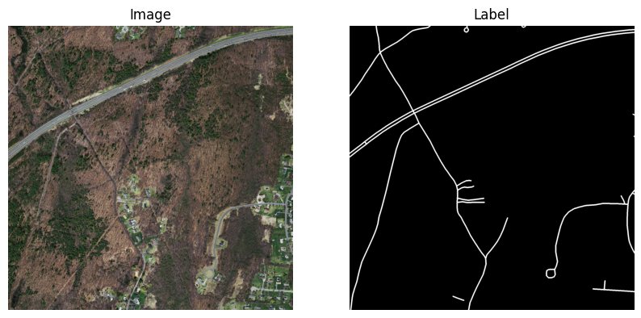
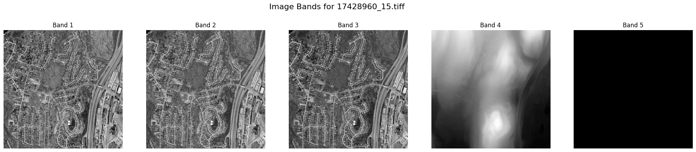

# Project 4: Road Finding

by Alex, Lorn, and Ted

## Hypothesis

It is possible to extract road networks from satellite imagery with enough clarity to distinguish them from non-road features.

## Data

Images and rasterized road segments within them in tiles over the state of Massechusetts at 1m resolution. A 0.5m DEM of Massechusetts. A global building footprint dataset from Microsoft. 

### Initial Visuals


```python
from pathlib import Path
from itertools import islice

ROADS_DIR = Path("data/roads/")

for road_dir in ROADS_DIR.iterdir():
    if road_dir.is_dir():
        n = sum(1 for f in road_dir.iterdir() if f.is_file())
        print(road_dir.name, n)
```

    train 1108
    train_labels 1108
    val 14
    test_labels 49
    test 49
    val_labels 14


```python
print("Image Files")
for item in islice(Path(ROADS_DIR / "train").iterdir(), 10):
    print(item.name)
print("\nLabel Files")
for item in islice(Path(ROADS_DIR / "train_labels").iterdir(), 10):
    print(item.name)
```

    Image Files
    17128945_15.tiff
    26429275_15.tiff
    22228930_15.tiff
    20128900_15.tiff
    22529395_15.tiff
    20578900_15.tiff
    24929230_15.tiff
    11278945_15.tiff
    27028705_15.tiff
    24028810_15.tiff
    
    Label Files
    24478810_15.tif
    11128855_15.tif
    22679080_15.tif
    11278660_15.tif
    17128930_15.tif
    24778825_15.tif
    17578780_15.tif
    15628855_15.tif
    10528780_15.tif
    17428945_15.tif


```python
import rasterio
import matplotlib.pyplot as plt

img   = rasterio.open(ROADS_DIR/"test"/"10378780_15.tiff").read()
label = rasterio.open(ROADS_DIR/"test_labels"/"10378780_15.tif").read(1)

plt.figure(figsize=(10,5))

plt.subplot(1,2,1)
plt.imshow(img.transpose(1,2,0))
plt.title("Image")
plt.axis("off")

plt.subplot(1,2,2)
plt.imshow(label, cmap="gray")
plt.title("Label")
plt.axis("off")

plt.show()
```

    /home/lorn/Code/road-finding/.venv/lib/python3.11/site-packages/rasterio/__init__.py:356: NotGeoreferencedWarning: Dataset has no geotransform, gcps, or rpcs. The identity matrix will be returned.
      dataset = DatasetReader(path, driver=driver, sharing=sharing, **kwargs)


    

    


```python
path = ROADS_DIR/"test"/"10378780_15.tiff"
path = Path("data/roads_buildings/train/17428960_15.tiff")
with rasterio.open(path) as src:
    img = src.read()   # shape: (bands, H, W)
    transform = src.transform
    width = src.width
    height = src.height

    # Pixel center indices
    cx = width  / 2
    cy = height / 2

    # Convert pixel center → map coordinates
    center_x, center_y = transform * (cx, cy)

bands, H, W = img.shape

plt.figure(figsize=(5 * bands, 5))
plt.suptitle(f"Image Bands for {path.name}", fontsize=16)
for i in range(bands):
    plt.subplot(1, bands, i+1)
    plt.imshow(img[i], cmap="gray")
    plt.title(f"Band {i+1}")
    plt.axis("off")

plt.show()
```


    

    


```python

```


```python
import geopandas as gpd
from shapely.geometry import box
import folium

DATA_DIR = Path("data/roads")  

records = []

for tif in DATA_DIR.rglob("*.tiff"):
    with rasterio.open(tif) as src:
        if not src.crs:
            continue
        
        left, bottom, right, top = src.bounds
        geom = box(left, bottom, right, top)

        records.append({
            "path": str(tif),
            "geometry": geom
        })

gdf = gpd.GeoDataFrame(records, crs="EPSG:26986")  
gdf_ll = gdf.to_crs("EPSG:4326")


center = [42.25, -71.8]

m = folium.Map(location=center, zoom_start=9, tiles="cartodb positron")

for _, row in gdf_ll.iterrows():
    geojson = folium.GeoJson(row["geometry"])
    geojson.add_to(m)

m
```


<div style="width:100%;"><div style="position:relative;width:100%;height:0;padding-bottom:60%;"><span style="color:#565656">Make this Notebook Trusted to load map: File -> Trust Notebook</span><iframe srcdoc="&lt;!DOCTYPE html&gt;
&lt;html&gt;
&lt;head&gt;

    &lt;meta http-equiv=&quot;content-type&quot; content=&quot;text/html; charset=UTF-8&quot; /&gt;
    &lt;script src=&quot;https://cdn.jsdelivr.net/npm/leaflet@1.9.3/dist/leaflet.js&quot;&gt;&lt;/script&gt;
    &lt;script src=&quot;https://code.jquery.com/jquery-3.7.1.min.js&quot;&gt;&lt;/script&gt;
    &lt;script src=&quot;https://cdn.jsdelivr.net/npm/bootstrap@5.2.2/dist/js/bootstrap.bundle.min.js&quot;&gt;&lt;/script&gt;
    &lt;script src=&quot;https://cdnjs.cloudflare.com/ajax/libs/Leaflet.awesome-markers/2.0.2/leaflet.awesome-markers.js&quot;&gt;&lt;/script&gt;
    &lt;link rel=&quot;stylesheet&quot; href=&quot;https://cdn.jsdelivr.net/npm/leaflet@1.9.3/dist/leaflet.css&quot;/&gt;
    &lt;link rel=&quot;stylesheet&quot; href=&quot;https://cdn.jsdelivr.net/npm/bootstrap@5.2.2/dist/css/bootstrap.min.css&quot;/&gt;
    &lt;link rel=&quot;stylesheet&quot; href=&quot;https://netdna.bootstrapcdn.com/bootstrap/3.0.0/css/bootstrap-glyphicons.css&quot;/&gt;
    &lt;link rel=&quot;stylesheet&quot; href=&quot;https://cdn.jsdelivr.net/npm/@fortawesome/fontawesome-free@6.2.0/css/all.min.css&quot;/&gt;
    &lt;link rel=&quot;stylesheet&quot; href=&quot;https://cdnjs.cloudflare.com/ajax/libs/Leaflet.awesome-markers/2.0.2/leaflet.awesome-markers.css&quot;/&gt;
    &lt;link rel=&quot;stylesheet&quot; href=&quot;https://cdn.jsdelivr.net/gh/python-visualization/folium/folium/templates/leaflet.awesome.rotate.min.css&quot;/&gt;

            &lt;meta name=&quot;viewport&quot; content=&quot;width=device-width,
                initial-scale=1.0, maximum-scale=1.0, user-scalable=no&quot; /&gt;
            &lt;style&gt;
                #map_f4b9c2c9583d471824798ec30faffa51 {
                    position: relative;
                    width: 100.0%;
                    height: 100.0%;
                    left: 0.0%;
                    top: 0.0%;
                }
                .leaflet-container { font-size: 1rem; }
            &lt;/style&gt;

            &lt;style&gt;html, body {
                width: 100%;
                height: 100%;
                margin: 0;
                padding: 0;
            }
            &lt;/style&gt;

            &lt;style&gt;#map {
                position:absolute;
                top:0;
                bottom:0;
                right:0;
                left:0;
                }
            &lt;/style&gt;

            &lt;script&gt;
                L_NO_TOUCH = false;
                L_DISABLE_3D = false;
            &lt;/script&gt;


&lt;/head&gt;
&lt;body&gt;


            &lt;div class=&quot;folium-map&quot; id=&quot;map_f4b9c2c9583d471824798ec30faffa51&quot; &gt;&lt;/div&gt;

&lt;/body&gt;
&lt;script&gt;


            var map_f4b9c2c9583d471824798ec30faffa51 = L.map(
                &quot;map_f4b9c2c9583d471824798ec30faffa51&quot;,
                {
                    center: [42.25, -71.8],
                    crs: L.CRS.EPSG3857,
                    ...{
  &quot;zoom&quot;: 9,
  &quot;zoomControl&quot;: true,
  &quot;preferCanvas&quot;: false,
}

                }
            );


            var tile_layer_9712e84f0dac32b8483f594df7e5ab78 = L.tileLayer(
                &quot;https://{s}.basemaps.cartocdn.com/light_all/{z}/{x}/{y}{r}.png&quot;,
                {
  &quot;minZoom&quot;: 0,
  &quot;maxZoom&quot;: 20,
  &quot;maxNativeZoom&quot;: 20,
  &quot;noWrap&quot;: false,
  &quot;attribution&quot;: &quot;\u0026copy; \u003ca href=\&quot;https://www.openstreetmap.org/copyright\&quot;\u003eOpenStreetMap\u003c/a\u003e contributors \u0026copy; \u003ca href=\&quot;https://carto.com/attributions\&quot;\u003eCARTO\u003c/a\u003e&quot;,
  &quot;subdomains&quot;: &quot;abcd&quot;,
  &quot;detectRetina&quot;: false,
  &quot;tms&quot;: false,
  &quot;opacity&quot;: 1,
}

            );


            tile_layer_9712e84f0dac32b8483f594df7e5ab78.addTo(map_f4b9c2c9583d471824798ec30faffa51);


        function geo_json_13afbd9ece7fc7eadc994260a604ccdc_onEachFeature(feature, layer) {

            layer.on({
            });
        };
        var geo_json_13afbd9ece7fc7eadc994260a604ccdc = L.geoJson(null, {
                onEachFeature: geo_json_13afbd9ece7fc7eadc994260a604ccdc_onEachFeature,

            ...{
}
        });

        function geo_json_13afbd9ece7fc7eadc994260a604ccdc_add (data) {
            geo_json_13afbd9ece7fc7eadc994260a604ccdc
                .addData(data);
        }
            geo_json_13afbd9ece7fc7eadc994260a604ccdc_add({&quot;coordinates&quot;: [[[-71.83970092372113, 42.293916106336034], [-71.83977338031778, 42.30742034477962], [-71.85796650412821, 42.3073651107739], [-71.8578901679408, 42.29386088395573], [-71.83970092372113, 42.293916106336034]]], &quot;type&quot;: &quot;Polygon&quot;});
        geo_json_13afbd9ece7fc7eadc994260a604ccdc.setStyle(function(feature) {return feature.properties.style;});


            geo_json_13afbd9ece7fc7eadc994260a604ccdc.addTo(map_f4b9c2c9583d471824798ec30faffa51);


        function geo_json_b65ca0c160346c71f7bbd623aec694c7_onEachFeature(feature, layer) {

            layer.on({
            });
        };
        var geo_json_b65ca0c160346c71f7bbd623aec694c7 = L.geoJson(null, {
                onEachFeature: geo_json_b65ca0c160346c71f7bbd623aec694c7_onEachFeature,

            ...{
}
        });

        function geo_json_b65ca0c160346c71f7bbd623aec694c7_add (data) {
            geo_json_b65ca0c160346c71f7bbd623aec694c7
                .addData(data);
        }
            geo_json_b65ca0c160346c71f7bbd623aec694c7_add({&quot;coordinates&quot;: [[[-70.70825886003104, 42.588788795003126], [-70.70808919716552, 42.60229156175325], [-70.72636686190197, 42.6024154816465], [-70.72653260930518, 42.58891268884212], [-70.70825886003104, 42.588788795003126]]], &quot;type&quot;: &quot;Polygon&quot;});
        geo_json_b65ca0c160346c71f7bbd623aec694c7.setStyle(function(feature) {return feature.properties.style;});


            geo_json_b65ca0c160346c71f7bbd623aec694c7.addTo(map_f4b9c2c9583d471824798ec30faffa51);


        function geo_json_172f567f4c726a8b6b595fb9141cbb76_onEachFeature(feature, layer) {

            layer.on({
            });
        };
        var geo_json_172f567f4c726a8b6b595fb9141cbb76 = L.geoJson(null, {
                onEachFeature: geo_json_172f567f4c726a8b6b595fb9141cbb76_onEachFeature,

            ...{
}
        });

        function geo_json_172f567f4c726a8b6b595fb9141cbb76_add (data) {
            geo_json_172f567f4c726a8b6b595fb9141cbb76
                .addData(data);
        }
            geo_json_172f567f4c726a8b6b595fb9141cbb76_add({&quot;coordinates&quot;: [[[-71.22131849159214, 42.28057586908367], [-71.22125906261799, 42.29408017919087], [-71.23944842921594, 42.294122870458644], [-71.23950398017529, 42.28061855136554], [-71.22131849159214, 42.28057586908367]]], &quot;type&quot;: &quot;Polygon&quot;});
        geo_json_172f567f4c726a8b6b595fb9141cbb76.setStyle(function(feature) {return feature.properties.style;});


            geo_json_172f567f4c726a8b6b595fb9141cbb76.addTo(map_f4b9c2c9583d471824798ec30faffa51);


        function geo_json_8d4245dd73378dad00da772824db6c02_onEachFeature(feature, layer) {

            layer.on({
            });
        };
        var geo_json_8d4245dd73378dad00da772824db6c02 = L.geoJson(null, {
                onEachFeature: geo_json_8d4245dd73378dad00da772824db6c02_onEachFeature,

            ...{
}
        });

        function geo_json_8d4245dd73378dad00da772824db6c02_add (data) {
            geo_json_8d4245dd73378dad00da772824db6c02
                .addData(data);
        }
            geo_json_8d4245dd73378dad00da772824db6c02_add({&quot;coordinates&quot;: [[[-71.47592715003972, 42.25390254363369], [-71.47592201864445, 42.267406996356286], [-71.49410381185467, 42.267409369176626], [-71.49410506842486, 42.25390491595453], [-71.47592715003972, 42.25390254363369]]], &quot;type&quot;: &quot;Polygon&quot;});
        geo_json_8d4245dd73378dad00da772824db6c02.setStyle(function(feature) {return feature.properties.style;});


            geo_json_8d4245dd73378dad00da772824db6c02.addTo(map_f4b9c2c9583d471824798ec30faffa51);


        function geo_json_b4e6ddece22aa8f4b2b76184ad263276_onEachFeature(feature, layer) {

            layer.on({
            });
        };
        var geo_json_b4e6ddece22aa8f4b2b76184ad263276 = L.geoJson(null, {
                onEachFeature: geo_json_b4e6ddece22aa8f4b2b76184ad263276_onEachFeature,

            ...{
}
        });

        function geo_json_b4e6ddece22aa8f4b2b76184ad263276_add (data) {
            geo_json_b4e6ddece22aa8f4b2b76184ad263276
                .addData(data);
        }
            geo_json_b4e6ddece22aa8f4b2b76184ad263276_add({&quot;coordinates&quot;: [[[-71.18285145059944, 42.69909423001531], [-71.18278336857365, 42.71259702008927], [-71.20109372603422, 42.71264578789553], [-71.2011578783001, 42.69914298757164], [-71.18285145059944, 42.69909423001531]]], &quot;type&quot;: &quot;Polygon&quot;});
        geo_json_b4e6ddece22aa8f4b2b76184ad263276.setStyle(function(feature) {return feature.properties.style;});


            geo_json_b4e6ddece22aa8f4b2b76184ad263276.addTo(map_f4b9c2c9583d471824798ec30faffa51);


        function geo_json_56acd82f92523a119cabacb48ac88c86_onEachFeature(feature, layer) {

            layer.on({
            });
        };
        var geo_json_56acd82f92523a119cabacb48ac88c86 = L.geoJson(null, {
                onEachFeature: geo_json_56acd82f92523a119cabacb48ac88c86_onEachFeature,

            ...{
}
        });

        function geo_json_56acd82f92523a119cabacb48ac88c86_add (data) {
            geo_json_56acd82f92523a119cabacb48ac88c86
                .addData(data);
        }
            geo_json_56acd82f92523a119cabacb48ac88c86_add({&quot;coordinates&quot;: [[[-71.42139341460937, 42.25387815858913], [-71.42137665875146, 42.267382606177435], [-71.43955844044056, 42.26739361485578], [-71.43957132148077, 42.2538891649501], [-71.42139341460937, 42.25387815858913]]], &quot;type&quot;: &quot;Polygon&quot;});
        geo_json_56acd82f92523a119cabacb48ac88c86.setStyle(function(feature) {return feature.properties.style;});


            geo_json_56acd82f92523a119cabacb48ac88c86.addTo(map_f4b9c2c9583d471824798ec30faffa51);


        function geo_json_e63b7908916998df964a2dc9cea495d8_onEachFeature(feature, layer) {

            layer.on({
            });
        };
        var geo_json_e63b7908916998df964a2dc9cea495d8 = L.geoJson(null, {
                onEachFeature: geo_json_e63b7908916998df964a2dc9cea495d8_onEachFeature,

            ...{
}
        });

        function geo_json_e63b7908916998df964a2dc9cea495d8_add (data) {
            geo_json_e63b7908916998df964a2dc9cea495d8
                .addData(data);
        }
            geo_json_e63b7908916998df964a2dc9cea495d8_add({&quot;coordinates&quot;: [[[-70.89139052824036, 42.549388232638435], [-70.89126018954207, 42.56289139138808], [-70.90952674667368, 42.562986316174424], [-70.90965317453059, 42.549483137463675], [-70.89139052824036, 42.549388232638435]]], &quot;type&quot;: &quot;Polygon&quot;});
        geo_json_e63b7908916998df964a2dc9cea495d8.setStyle(function(feature) {return feature.properties.style;});


            geo_json_e63b7908916998df964a2dc9cea495d8.addTo(map_f4b9c2c9583d471824798ec30faffa51);


        function geo_json_37c0381c1f7bec00d010745d0da3ee1a_onEachFeature(feature, layer) {

            layer.on({
            });
        };
        var geo_json_37c0381c1f7bec00d010745d0da3ee1a = L.geoJson(null, {
                onEachFeature: geo_json_37c0381c1f7bec00d010745d0da3ee1a_onEachFeature,

            ...{
}
        });

        function geo_json_37c0381c1f7bec00d010745d0da3ee1a_add (data) {
            geo_json_37c0381c1f7bec00d010745d0da3ee1a
                .addData(data);
        }
            geo_json_37c0381c1f7bec00d010745d0da3ee1a_add({&quot;coordinates&quot;: [[[-72.54904221071641, 42.289628634485005], [-72.54926594624314, 42.30313197035506], [-72.56745657347648, 42.30296441150206], [-72.56722895995564, 42.28946111089715], [-72.54904221071641, 42.289628634485005]]], &quot;type&quot;: &quot;Polygon&quot;});
        geo_json_37c0381c1f7bec00d010745d0da3ee1a.setStyle(function(feature) {return feature.properties.style;});


            geo_json_37c0381c1f7bec00d010745d0da3ee1a.addTo(map_f4b9c2c9583d471824798ec30faffa51);


        function geo_json_b5a8ced092339825ef6b96c2185b4c7f_onEachFeature(feature, layer) {

            layer.on({
            });
        };
        var geo_json_b5a8ced092339825ef6b96c2185b4c7f = L.geoJson(null, {
                onEachFeature: geo_json_b5a8ced092339825ef6b96c2185b4c7f_onEachFeature,

            ...{
}
        });

        function geo_json_b5a8ced092339825ef6b96c2185b4c7f_add (data) {
            geo_json_b5a8ced092339825ef6b96c2185b4c7f
                .addData(data);
        }
            geo_json_b5a8ced092339825ef6b96c2185b4c7f_add({&quot;coordinates&quot;: [[[-70.64214856075536, 42.075130382809505], [-70.6419662178099, 42.088634553763804], [-70.66009597117785, 42.088768968026486], [-70.66027446182656, 42.07526476876042], [-70.64214856075536, 42.075130382809505]]], &quot;type&quot;: &quot;Polygon&quot;});
        geo_json_b5a8ced092339825ef6b96c2185b4c7f.setStyle(function(feature) {return feature.properties.style;});


            geo_json_b5a8ced092339825ef6b96c2185b4c7f.addTo(map_f4b9c2c9583d471824798ec30faffa51);


        function geo_json_cc6e5bb9ec8497ed1d596010379e96b8_onEachFeature(feature, layer) {

            layer.on({
            });
        };
        var geo_json_cc6e5bb9ec8497ed1d596010379e96b8 = L.geoJson(null, {
                onEachFeature: geo_json_cc6e5bb9ec8497ed1d596010379e96b8_onEachFeature,

            ...{
}
        });

        function geo_json_cc6e5bb9ec8497ed1d596010379e96b8_add (data) {
            geo_json_cc6e5bb9ec8497ed1d596010379e96b8
                .addData(data);
        }
            geo_json_cc6e5bb9ec8497ed1d596010379e96b8_add({&quot;coordinates&quot;: [[[-71.00394116454251, 42.171804622259444], [-71.00383556153561, 42.18530904745915], [-71.02199353895497, 42.185386165680576], [-71.02209527740594, 42.1718817242425], [-71.00394116454251, 42.171804622259444]]], &quot;type&quot;: &quot;Polygon&quot;});
        geo_json_cc6e5bb9ec8497ed1d596010379e96b8.setStyle(function(feature) {return feature.properties.style;});


            geo_json_cc6e5bb9ec8497ed1d596010379e96b8.addTo(map_f4b9c2c9583d471824798ec30faffa51);


        function geo_json_d6a813b059cbe7bdd6ad6f4465d606de_onEachFeature(feature, layer) {

            layer.on({
            });
        };
        var geo_json_d6a813b059cbe7bdd6ad6f4465d606de = L.geoJson(null, {
                onEachFeature: geo_json_d6a813b059cbe7bdd6ad6f4465d606de_onEachFeature,

            ...{
}
        });

        function geo_json_d6a813b059cbe7bdd6ad6f4465d606de_add (data) {
            geo_json_d6a813b059cbe7bdd6ad6f4465d606de
                .addData(data);
        }
            geo_json_d6a813b059cbe7bdd6ad6f4465d606de_add({&quot;coordinates&quot;: [[[-70.78120027569717, 42.602769880552124], [-70.78104620893542, 42.616272693397946], [-70.7993280651185, 42.6163850630134], [-70.79947821456348, 42.602882226542725], [-70.78120027569717, 42.602769880552124]]], &quot;type&quot;: &quot;Polygon&quot;});
        geo_json_d6a813b059cbe7bdd6ad6f4465d606de.setStyle(function(feature) {return feature.properties.style;});


            geo_json_d6a813b059cbe7bdd6ad6f4465d606de.addTo(map_f4b9c2c9583d471824798ec30faffa51);


        function geo_json_a6baea37c4a8d15d82c4f20a745a8f5a_onEachFeature(feature, layer) {

            layer.on({
            });
        };
        var geo_json_a6baea37c4a8d15d82c4f20a745a8f5a = L.geoJson(null, {
                onEachFeature: geo_json_a6baea37c4a8d15d82c4f20a745a8f5a_onEachFeature,

            ...{
}
        });

        function geo_json_a6baea37c4a8d15d82c4f20a745a8f5a_add (data) {
            geo_json_a6baea37c4a8d15d82c4f20a745a8f5a
                .addData(data);
        }
            geo_json_a6baea37c4a8d15d82c4f20a745a8f5a_add({&quot;coordinates&quot;: [[[-70.87299368824766, 42.56279357484186], [-70.87285938123141, 42.576296660827865], [-70.89112979500655, 42.57639449794662], [-70.89126018954207, 42.56289139138808], [-70.87299368824766, 42.56279357484186]]], &quot;type&quot;: &quot;Polygon&quot;});
        geo_json_a6baea37c4a8d15d82c4f20a745a8f5a.setStyle(function(feature) {return feature.properties.style;});


            geo_json_a6baea37c4a8d15d82c4f20a745a8f5a.addTo(map_f4b9c2c9583d471824798ec30faffa51);


        function geo_json_10b59c1d95255ba911cdc3b9d58f62fc_onEachFeature(feature, layer) {

            layer.on({
            });
        };
        var geo_json_10b59c1d95255ba911cdc3b9d58f62fc = L.geoJson(null, {
                onEachFeature: geo_json_10b59c1d95255ba911cdc3b9d58f62fc_onEachFeature,

            ...{
}
        });

        function geo_json_10b59c1d95255ba911cdc3b9d58f62fc_add (data) {
            geo_json_10b59c1d95255ba911cdc3b9d58f62fc
                .addData(data);
        }
            geo_json_10b59c1d95255ba911cdc3b9d58f62fc_add({&quot;coordinates&quot;: [[[-71.04219819680745, 41.901861419244355], [-71.04210115098543, 41.91536634225994], [-71.06018223249332, 41.91543741067566], [-71.06027544639927, 41.90193247268103], [-71.04219819680745, 41.901861419244355]]], &quot;type&quot;: &quot;Polygon&quot;});
        geo_json_10b59c1d95255ba911cdc3b9d58f62fc.setStyle(function(feature) {return feature.properties.style;});


            geo_json_10b59c1d95255ba911cdc3b9d58f62fc.addTo(map_f4b9c2c9583d471824798ec30faffa51);


        function geo_json_d94a9abe3981177e69307382d55f38d3_onEachFeature(feature, layer) {

            layer.on({
            });
        };
        var geo_json_d94a9abe3981177e69307382d55f38d3 = L.geoJson(null, {
                onEachFeature: geo_json_d94a9abe3981177e69307382d55f38d3_onEachFeature,

            ...{
}
        });

        function geo_json_d94a9abe3981177e69307382d55f38d3_add (data) {
            geo_json_d94a9abe3981177e69307382d55f38d3
                .addData(data);
        }
            geo_json_d94a9abe3981177e69307382d55f38d3_add({&quot;coordinates&quot;: [[[-70.90940026465478, 42.57648944269732], [-70.90927372843913, 42.58999251627961], [-70.92754816651193, 42.59008458800879], [-70.92767078849978, 42.57658149506713], [-70.90940026465478, 42.57648944269732]]], &quot;type&quot;: &quot;Polygon&quot;});
        geo_json_d94a9abe3981177e69307382d55f38d3.setStyle(function(feature) {return feature.properties.style;});


            geo_json_d94a9abe3981177e69307382d55f38d3.addTo(map_f4b9c2c9583d471824798ec30faffa51);


        function geo_json_264c0a15a877e160d8d5faa9aff3c8c4_onEachFeature(feature, layer) {

            layer.on({
            });
        };
        var geo_json_264c0a15a877e160d8d5faa9aff3c8c4 = L.geoJson(null, {
                onEachFeature: geo_json_264c0a15a877e160d8d5faa9aff3c8c4_onEachFeature,

            ...{
}
        });

        function geo_json_264c0a15a877e160d8d5faa9aff3c8c4_add (data) {
            geo_json_264c0a15a877e160d8d5faa9aff3c8c4
                .addData(data);
        }
            geo_json_264c0a15a877e160d8d5faa9aff3c8c4_add({&quot;coordinates&quot;: [[[-71.1306277166031, 42.23980628653946], [-71.13054899855949, 42.2533106495209], [-71.14872659304454, 42.253367703615446], [-71.14880143812128, 42.23986332862323], [-71.1306277166031, 42.23980628653946]]], &quot;type&quot;: &quot;Polygon&quot;});
        geo_json_264c0a15a877e160d8d5faa9aff3c8c4.setStyle(function(feature) {return feature.properties.style;});


            geo_json_264c0a15a877e160d8d5faa9aff3c8c4.addTo(map_f4b9c2c9583d471824798ec30faffa51);


        function geo_json_cfc1c9393604835217c9b7d41df8745e_onEachFeature(feature, layer) {

            layer.on({
            });
        };
        var geo_json_cfc1c9393604835217c9b7d41df8745e = L.geoJson(null, {
                onEachFeature: geo_json_cfc1c9393604835217c9b7d41df8745e_onEachFeature,

            ...{
}
        });

        function geo_json_cfc1c9393604835217c9b7d41df8745e_add (data) {
            geo_json_cfc1c9393604835217c9b7d41df8745e
                .addData(data);
        }
            geo_json_cfc1c9393604835217c9b7d41df8745e_add({&quot;coordinates&quot;: [[[-72.00329548252394, 42.279811283214045], [-72.00340280881497, 42.29331543235354], [-72.0215917005327, 42.293234292468675], [-72.0214804965305, 42.27973016040783], [-72.00329548252394, 42.279811283214045]]], &quot;type&quot;: &quot;Polygon&quot;});
        geo_json_cfc1c9393604835217c9b7d41df8745e.setStyle(function(feature) {return feature.properties.style;});


            geo_json_cfc1c9393604835217c9b7d41df8745e.addTo(map_f4b9c2c9583d471824798ec30faffa51);


        function geo_json_5869f3fed0ec652866e3411581579445_onEachFeature(feature, layer) {

            layer.on({
            });
        };
        var geo_json_5869f3fed0ec652866e3411581579445 = L.geoJson(null, {
                onEachFeature: geo_json_5869f3fed0ec652866e3411581579445_onEachFeature,

            ...{
}
        });

        function geo_json_5869f3fed0ec652866e3411581579445_add (data) {
            geo_json_5869f3fed0ec652866e3411581579445
                .addData(data);
        }
            geo_json_5869f3fed0ec652866e3411581579445_add({&quot;coordinates&quot;: [[[-70.98818364821904, 41.874621293389495], [-70.98807519877596, 41.888126198032076], [-71.00614848990789, 41.888205821164334], [-71.00625311076291, 41.87470089973801], [-70.98818364821904, 41.874621293389495]]], &quot;type&quot;: &quot;Polygon&quot;});
        geo_json_5869f3fed0ec652866e3411581579445.setStyle(function(feature) {return feature.properties.style;});


            geo_json_5869f3fed0ec652866e3411581579445.addTo(map_f4b9c2c9583d471824798ec30faffa51);


        function geo_json_365194f2896678f3b20007b6a298796f_onEachFeature(feature, layer) {

            layer.on({
            });
        };
        var geo_json_365194f2896678f3b20007b6a298796f = L.geoJson(null, {
                onEachFeature: geo_json_365194f2896678f3b20007b6a298796f_onEachFeature,

            ...{
}
        });

        function geo_json_365194f2896678f3b20007b6a298796f_add (data) {
            geo_json_365194f2896678f3b20007b6a298796f
                .addData(data);
        }
            geo_json_365194f2896678f3b20007b6a298796f_add({&quot;coordinates&quot;: [[[-71.82144309874133, 42.28046416036955], [-71.82151164648525, 42.29396844695869], [-71.8397009216003, 42.29391610434382], [-71.83962849590006, 42.28041182877205], [-71.82144309874133, 42.28046416036955]]], &quot;type&quot;: &quot;Polygon&quot;});
        geo_json_365194f2896678f3b20007b6a298796f.setStyle(function(feature) {return feature.properties.style;});


            geo_json_365194f2896678f3b20007b6a298796f.addTo(map_f4b9c2c9583d471824798ec30faffa51);


        function geo_json_3f066ca14dafa35df6e4ce3f08916709_onEachFeature(feature, layer) {

            layer.on({
            });
        };
        var geo_json_3f066ca14dafa35df6e4ce3f08916709 = L.geoJson(null, {
                onEachFeature: geo_json_3f066ca14dafa35df6e4ce3f08916709_onEachFeature,

            ...{
}
        });

        function geo_json_3f066ca14dafa35df6e4ce3f08916709_add (data) {
            geo_json_3f066ca14dafa35df6e4ce3f08916709
                .addData(data);
        }
            geo_json_3f066ca14dafa35df6e4ce3f08916709_add({&quot;coordinates&quot;: [[[-71.00182052695402, 42.441886352774986], [-71.00171401903079, 42.45539001247268], [-71.01994963455473, 42.45546745601729], [-71.02005224480864, 42.44196378002826], [-71.00182052695402, 42.441886352774986]]], &quot;type&quot;: &quot;Polygon&quot;});
        geo_json_3f066ca14dafa35df6e4ce3f08916709.setStyle(function(feature) {return feature.properties.style;});


            geo_json_3f066ca14dafa35df6e4ce3f08916709.addTo(map_f4b9c2c9583d471824798ec30faffa51);


        function geo_json_b8f85febacd67449b6202fed6a25d31a_onEachFeature(feature, layer) {

            layer.on({
            });
        };
        var geo_json_b8f85febacd67449b6202fed6a25d31a = L.geoJson(null, {
                onEachFeature: geo_json_b8f85febacd67449b6202fed6a25d31a_onEachFeature,

            ...{
}
        });

        function geo_json_b8f85febacd67449b6202fed6a25d31a_add (data) {
            geo_json_b8f85febacd67449b6202fed6a25d31a
                .addData(data);
        }
            geo_json_b8f85febacd67449b6202fed6a25d31a_add({&quot;coordinates&quot;: [[[-71.18474595122419, 42.32099462580637], [-71.1846786802339, 42.33449880249604], [-71.20287963834772, 42.3345472839367], [-71.20294302639071, 42.321043097043834], [-71.18474595122419, 42.32099462580637]]], &quot;type&quot;: &quot;Polygon&quot;});
        geo_json_b8f85febacd67449b6202fed6a25d31a.setStyle(function(feature) {return feature.properties.style;});


            geo_json_b8f85febacd67449b6202fed6a25d31a.addTo(map_f4b9c2c9583d471824798ec30faffa51);


        function geo_json_5ab0a777a2c71fb5b4f6c94825f886df_onEachFeature(feature, layer) {

            layer.on({
            });
        };
        var geo_json_5ab0a777a2c71fb5b4f6c94825f886df = L.geoJson(null, {
                onEachFeature: geo_json_5ab0a777a2c71fb5b4f6c94825f886df_onEachFeature,

            ...{
}
        });

        function geo_json_5ab0a777a2c71fb5b4f6c94825f886df_add (data) {
            geo_json_5ab0a777a2c71fb5b4f6c94825f886df
                .addData(data);
        }
            geo_json_5ab0a777a2c71fb5b4f6c94825f886df_add({&quot;coordinates&quot;: [[[-70.93096183937931, 42.21198043839945], [-70.93084062368587, 42.22548469685056], [-70.94901001452703, 42.22557337037078], [-70.94912736084595, 42.212069093250896], [-70.93096183937931, 42.21198043839945]]], &quot;type&quot;: &quot;Polygon&quot;});
        geo_json_5ab0a777a2c71fb5b4f6c94825f886df.setStyle(function(feature) {return feature.properties.style;});


            geo_json_5ab0a777a2c71fb5b4f6c94825f886df.addTo(map_f4b9c2c9583d471824798ec30faffa51);


        function geo_json_d7cd121308be05f45b4577cf6dba7019_onEachFeature(feature, layer) {

            layer.on({
            });
        };
        var geo_json_d7cd121308be05f45b4577cf6dba7019 = L.geoJson(null, {
                onEachFeature: geo_json_d7cd121308be05f45b4577cf6dba7019_onEachFeature,

            ...{
}
        });

        function geo_json_d7cd121308be05f45b4577cf6dba7019_add (data) {
            geo_json_d7cd121308be05f45b4577cf6dba7019
                .addData(data);
        }
            geo_json_d7cd121308be05f45b4577cf6dba7019_add({&quot;coordinates&quot;: [[[-72.62083265179989, 42.234928137030444], [-72.62107149131585, 42.24843147289971], [-72.63924621916377, 42.24825254582057], [-72.63900350851269, 42.23474924761594], [-72.62083265179989, 42.234928137030444]]], &quot;type&quot;: &quot;Polygon&quot;});
        geo_json_d7cd121308be05f45b4577cf6dba7019.setStyle(function(feature) {return feature.properties.style;});


            geo_json_d7cd121308be05f45b4577cf6dba7019.addTo(map_f4b9c2c9583d471824798ec30faffa51);


        function geo_json_9f2d2f54016f6797dc4cffdd8505cedc_onEachFeature(feature, layer) {

            layer.on({
            });
        };
        var geo_json_9f2d2f54016f6797dc4cffdd8505cedc = L.geoJson(null, {
                onEachFeature: geo_json_9f2d2f54016f6797dc4cffdd8505cedc_onEachFeature,

            ...{
}
        });

        function geo_json_9f2d2f54016f6797dc4cffdd8505cedc_add (data) {
            geo_json_9f2d2f54016f6797dc4cffdd8505cedc
                .addData(data);
        }
            geo_json_9f2d2f54016f6797dc4cffdd8505cedc_add({&quot;coordinates&quot;: [[[-71.76614906190157, 42.1050447349675], [-71.76620566145105, 42.118549465375494], [-71.78434473385863, 42.1185058815662], [-71.78428427770973, 42.10500116033771], [-71.76614906190157, 42.1050447349675]]], &quot;type&quot;: &quot;Polygon&quot;});
        geo_json_9f2d2f54016f6797dc4cffdd8505cedc.setStyle(function(feature) {return feature.properties.style;});


            geo_json_9f2d2f54016f6797dc4cffdd8505cedc.addTo(map_f4b9c2c9583d471824798ec30faffa51);


        function geo_json_b9c7d81a5e572961ce02283d12f9ce13_onEachFeature(feature, layer) {

            layer.on({
            });
        };
        var geo_json_b9c7d81a5e572961ce02283d12f9ce13 = L.geoJson(null, {
                onEachFeature: geo_json_b9c7d81a5e572961ce02283d12f9ce13_onEachFeature,

            ...{
}
        });

        function geo_json_b9c7d81a5e572961ce02283d12f9ce13_add (data) {
            geo_json_b9c7d81a5e572961ce02283d12f9ce13
                .addData(data);
        }
            geo_json_b9c7d81a5e572961ce02283d12f9ce13_add({&quot;coordinates&quot;: [[[-70.69669720528296, 42.062020654154665], [-70.6965264919436, 42.07552493345882], [-70.71465261563937, 42.07565071015994], [-70.71481947817671, 42.06214640436194], [-70.69669720528296, 42.062020654154665]]], &quot;type&quot;: &quot;Polygon&quot;});
        geo_json_b9c7d81a5e572961ce02283d12f9ce13.setStyle(function(feature) {return feature.properties.style;});


            geo_json_b9c7d81a5e572961ce02283d12f9ce13.addTo(map_f4b9c2c9583d471824798ec30faffa51);


        function geo_json_4305229ccdd06aa86fe616f451477416_onEachFeature(feature, layer) {

            layer.on({
            });
        };
        var geo_json_4305229ccdd06aa86fe616f451477416 = L.geoJson(null, {
                onEachFeature: geo_json_4305229ccdd06aa86fe616f451477416_onEachFeature,

            ...{
}
        });

        function geo_json_4305229ccdd06aa86fe616f451477416_add (data) {
            geo_json_4305229ccdd06aa86fe616f451477416
                .addData(data);
        }
            geo_json_4305229ccdd06aa86fe616f451477416_add({&quot;coordinates&quot;: [[[-72.00318820198687, 42.266307097675416], [-72.00329548252392, 42.279811283213874], [-72.0214804965305, 42.27973016040766], [-72.02136933993529, 42.26622599194505], [-72.00318820198687, 42.266307097675416]]], &quot;type&quot;: &quot;Polygon&quot;});
        geo_json_4305229ccdd06aa86fe616f451477416.setStyle(function(feature) {return feature.properties.style;});


            geo_json_4305229ccdd06aa86fe616f451477416.addTo(map_f4b9c2c9583d471824798ec30faffa51);


        function geo_json_bb90c587ce6f6b6f466f8a0ebea9742b_onEachFeature(feature, layer) {

            layer.on({
            });
        };
        var geo_json_bb90c587ce6f6b6f466f8a0ebea9742b = L.geoJson(null, {
                onEachFeature: geo_json_bb90c587ce6f6b6f466f8a0ebea9742b_onEachFeature,

            ...{
}
        });

        function geo_json_bb90c587ce6f6b6f466f8a0ebea9742b_add (data) {
            geo_json_bb90c587ce6f6b6f466f8a0ebea9742b
                .addData(data);
        }
            geo_json_bb90c587ce6f6b6f466f8a0ebea9742b_add({&quot;coordinates&quot;: [[[-72.45545849421407, 42.11487440703932], [-72.45566171059198, 42.12837833592163], [-72.47380250942494, 42.128225594901245], [-72.47359543616662, 42.114721698185825], [-72.45545849421407, 42.11487440703932]]], &quot;type&quot;: &quot;Polygon&quot;});
        geo_json_bb90c587ce6f6b6f466f8a0ebea9742b.setStyle(function(feature) {return feature.properties.style;});


            geo_json_bb90c587ce6f6b6f466f8a0ebea9742b.addTo(map_f4b9c2c9583d471824798ec30faffa51);


        function geo_json_44b3a79905cdace13cb611bed71f992b_onEachFeature(feature, layer) {

            layer.on({
            });
        };
        var geo_json_44b3a79905cdace13cb611bed71f992b = L.geoJson(null, {
                onEachFeature: geo_json_44b3a79905cdace13cb611bed71f992b_onEachFeature,

            ...{
}
        });

        function geo_json_44b3a79905cdace13cb611bed71f992b_add (data) {
            geo_json_44b3a79905cdace13cb611bed71f992b
                .addData(data);
        }
            geo_json_44b3a79905cdace13cb611bed71f992b_add({&quot;coordinates&quot;: [[[-72.58425963405269, 42.221773840170805], [-72.58449063266092, 42.23527728384073], [-72.60266169120457, 42.235104147794715], [-72.60242682298072, 42.22160074057233], [-72.58425963405269, 42.221773840170805]]], &quot;type&quot;: &quot;Polygon&quot;});
        geo_json_44b3a79905cdace13cb611bed71f992b.setStyle(function(feature) {return feature.properties.style;});


            geo_json_44b3a79905cdace13cb611bed71f992b.addTo(map_f4b9c2c9583d471824798ec30faffa51);


        function geo_json_7c7924a3f8141fd1303af29ece85818c_onEachFeature(feature, layer) {

            layer.on({
            });
        };
        var geo_json_7c7924a3f8141fd1303af29ece85818c = L.geoJson(null, {
                onEachFeature: geo_json_7c7924a3f8141fd1303af29ece85818c_onEachFeature,

            ...{
}
        });

        function geo_json_7c7924a3f8141fd1303af29ece85818c_add (data) {
            geo_json_7c7924a3f8141fd1303af29ece85818c
                .addData(data);
        }
            geo_json_7c7924a3f8141fd1303af29ece85818c_add({&quot;coordinates&quot;: [[[-71.65777340977895, 42.280805583553956], [-71.65780705520203, 42.29430994202266], [-71.67599653393857, 42.294283517564175], [-71.67595901042898, 42.280779164657474], [-71.65777340977895, 42.280805583553956]]], &quot;type&quot;: &quot;Polygon&quot;});
        geo_json_7c7924a3f8141fd1303af29ece85818c.setStyle(function(feature) {return feature.properties.style;});


            geo_json_7c7924a3f8141fd1303af29ece85818c.addTo(map_f4b9c2c9583d471824798ec30faffa51);


        function geo_json_7e622a3ef1c89bea424bf14a6b935e08_onEachFeature(feature, layer) {

            layer.on({
            });
        };
        var geo_json_7e622a3ef1c89bea424bf14a6b935e08 = L.geoJson(null, {
                onEachFeature: geo_json_7e622a3ef1c89bea424bf14a6b935e08_onEachFeature,

            ...{
}
        });

        function geo_json_7e622a3ef1c89bea424bf14a6b935e08_add (data) {
            geo_json_7e622a3ef1c89bea424bf14a6b935e08
                .addData(data);
        }
            geo_json_7e622a3ef1c89bea424bf14a6b935e08_add({&quot;coordinates&quot;: [[[-72.60078554261104, 42.12707599270096], [-72.60101971198179, 42.140579619010644], [-72.61916361813151, 42.14040386551347], [-72.61892559071904, 42.12690027621469], [-72.60078554261104, 42.12707599270096]]], &quot;type&quot;: &quot;Polygon&quot;});
        geo_json_7e622a3ef1c89bea424bf14a6b935e08.setStyle(function(feature) {return feature.properties.style;});


            geo_json_7e622a3ef1c89bea424bf14a6b935e08.addTo(map_f4b9c2c9583d471824798ec30faffa51);


        function geo_json_f0f2390f2220cbe30b48a2b3e62bf411_onEachFeature(feature, layer) {

            layer.on({
            });
        };
        var geo_json_f0f2390f2220cbe30b48a2b3e62bf411 = L.geoJson(null, {
                onEachFeature: geo_json_f0f2390f2220cbe30b48a2b3e62bf411_onEachFeature,

            ...{
}
        });

        function geo_json_f0f2390f2220cbe30b48a2b3e62bf411_add (data) {
            geo_json_f0f2390f2220cbe30b48a2b3e62bf411
                .addData(data);
        }
            geo_json_f0f2390f2220cbe30b48a2b3e62bf411_add({&quot;coordinates&quot;: [[[-71.09453954872968, 42.19917035914338], [-71.09445319525886, 42.21267479645026], [-71.11261910715623, 42.21273756674454], [-71.11270159265084, 42.19923311622169], [-71.09453954872968, 42.19917035914338]]], &quot;type&quot;: &quot;Polygon&quot;});
        geo_json_f0f2390f2220cbe30b48a2b3e62bf411.setStyle(function(feature) {return feature.properties.style;});


            geo_json_f0f2390f2220cbe30b48a2b3e62bf411.addTo(map_f4b9c2c9583d471824798ec30faffa51);


        function geo_json_cd63853ea6dbd3e9b37eb0c646583519_onEachFeature(feature, layer) {

            layer.on({
            });
        };
        var geo_json_cd63853ea6dbd3e9b37eb0c646583519 = L.geoJson(null, {
                onEachFeature: geo_json_cd63853ea6dbd3e9b37eb0c646583519_onEachFeature,

            ...{
}
        });

        function geo_json_cd63853ea6dbd3e9b37eb0c646583519_add (data) {
            geo_json_cd63853ea6dbd3e9b37eb0c646583519
                .addData(data);
        }
            geo_json_cd63853ea6dbd3e9b37eb0c646583519_add({&quot;coordinates&quot;: [[[-71.93000491772621, 42.199080979253836], [-71.9300964984148, 42.21258539773821], [-71.9482623211852, 42.21251586454088], [-71.9481668725773, 42.199011460696404], [-71.93000491772621, 42.199080979253836]]], &quot;type&quot;: &quot;Polygon&quot;});
        geo_json_cd63853ea6dbd3e9b37eb0c646583519.setStyle(function(feature) {return feature.properties.style;});


            geo_json_cd63853ea6dbd3e9b37eb0c646583519.addTo(map_f4b9c2c9583d471824798ec30faffa51);


        function geo_json_44942b601ff28bc19912353bb6e6773b_onEachFeature(feature, layer) {

            layer.on({
            });
        };
        var geo_json_44942b601ff28bc19912353bb6e6773b = L.geoJson(null, {
                onEachFeature: geo_json_44942b601ff28bc19912353bb6e6773b_onEachFeature,

            ...{
}
        });

        function geo_json_44942b601ff28bc19912353bb6e6773b_add (data) {
            geo_json_44942b601ff28bc19912353bb6e6773b
                .addData(data);
        }
            geo_json_44942b601ff28bc19912353bb6e6773b_add({&quot;coordinates&quot;: [[[-71.20262581542238, 42.388563630261174], [-71.2025622919159, 42.402067612777806], [-71.22078271679389, 42.402113260625555], [-71.22084234903784, 42.388609268504354], [-71.20262581542238, 42.388563630261174]]], &quot;type&quot;: &quot;Polygon&quot;});
        geo_json_44942b601ff28bc19912353bb6e6773b.setStyle(function(feature) {return feature.properties.style;});


            geo_json_44942b601ff28bc19912353bb6e6773b.addTo(map_f4b9c2c9583d471824798ec30faffa51);


        function geo_json_4d1fcd7ecd32268f3e2485a4609d160b_onEachFeature(feature, layer) {

            layer.on({
            });
        };
        var geo_json_4d1fcd7ecd32268f3e2485a4609d160b = L.geoJson(null, {
                onEachFeature: geo_json_4d1fcd7ecd32268f3e2485a4609d160b_onEachFeature,

            ...{
}
        });

        function geo_json_4d1fcd7ecd32268f3e2485a4609d160b_add (data) {
            geo_json_4d1fcd7ecd32268f3e2485a4609d160b
                .addData(data);
        }
            geo_json_4d1fcd7ecd32268f3e2485a4609d160b_add({&quot;coordinates&quot;: [[[-71.69410320903108, 42.267245481452086], [-71.69414459296617, 42.28074986455748], [-71.71233015996827, 42.280717687248405], [-71.71228489962147, 42.26721331091624], [-71.69410320903108, 42.267245481452086]]], &quot;type&quot;: &quot;Polygon&quot;});
        geo_json_4d1fcd7ecd32268f3e2485a4609d160b.setStyle(function(feature) {return feature.properties.style;});


            geo_json_4d1fcd7ecd32268f3e2485a4609d160b.addTo(map_f4b9c2c9583d471824798ec30faffa51);


        function geo_json_f54b42c852a81bf2731611a7138d295f_onEachFeature(feature, layer) {

            layer.on({
            });
        };
        var geo_json_f54b42c852a81bf2731611a7138d295f = L.geoJson(null, {
                onEachFeature: geo_json_f54b42c852a81bf2731611a7138d295f_onEachFeature,

            ...{
}
        });

        function geo_json_f54b42c852a81bf2731611a7138d295f_add (data) {
            geo_json_f54b42c852a81bf2731611a7138d295f
                .addData(data);
        }
            geo_json_f54b42c852a81bf2731611a7138d295f_add({&quot;coordinates&quot;: [[[-71.33028701205609, 42.33480597090084], [-71.33025078961451, 42.34831017287011], [-71.3484558024971, 42.3483356067117], [-71.34848814022503, 42.33483139938999], [-71.33028701205609, 42.33480597090084]]], &quot;type&quot;: &quot;Polygon&quot;});
        geo_json_f54b42c852a81bf2731611a7138d295f.setStyle(function(feature) {return feature.properties.style;});


            geo_json_f54b42c852a81bf2731611a7138d295f.addTo(map_f4b9c2c9583d471824798ec30faffa51);


        function geo_json_9c283ae6a495ad1b85f7cd2d11ff8851_onEachFeature(feature, layer) {

            layer.on({
            });
        };
        var geo_json_9c283ae6a495ad1b85f7cd2d11ff8851 = L.geoJson(null, {
                onEachFeature: geo_json_9c283ae6a495ad1b85f7cd2d11ff8851_onEachFeature,

            ...{
}
        });

        function geo_json_9c283ae6a495ad1b85f7cd2d11ff8851_add (data) {
            geo_json_9c283ae6a495ad1b85f7cd2d11ff8851
                .addData(data);
        }
            geo_json_9c283ae6a495ad1b85f7cd2d11ff8851_add({&quot;coordinates&quot;: [[[-71.239058908119, 42.38865202271452], [-71.23900316715392, 42.40215602383332], [-71.25722364133317, 42.40219590239536], [-71.25727549100417, 42.38869189288589], [-71.239058908119, 42.38865202271452]]], &quot;type&quot;: &quot;Polygon&quot;});
        geo_json_9c283ae6a495ad1b85f7cd2d11ff8851.setStyle(function(feature) {return feature.properties.style;});


            geo_json_9c283ae6a495ad1b85f7cd2d11ff8851.addTo(map_f4b9c2c9583d471824798ec30faffa51);


        function geo_json_df6b20fcd96835fefd4fbc573a9ca844_onEachFeature(feature, layer) {

            layer.on({
            });
        };
        var geo_json_df6b20fcd96835fefd4fbc573a9ca844 = L.geoJson(null, {
                onEachFeature: geo_json_df6b20fcd96835fefd4fbc573a9ca844_onEachFeature,

            ...{
}
        });

        function geo_json_df6b20fcd96835fefd4fbc573a9ca844_add (data) {
            geo_json_df6b20fcd96835fefd4fbc573a9ca844
                .addData(data);
        }
            geo_json_df6b20fcd96835fefd4fbc573a9ca844_add({&quot;coordinates&quot;: [[[-70.98281502094515, 42.5363305410983], [-70.98270428422106, 42.54983384499587], [-71.00096718440487, 42.54991429387751], [-71.00107401179875, 42.536410973062], [-70.98281502094515, 42.5363305410983]]], &quot;type&quot;: &quot;Polygon&quot;});
        geo_json_df6b20fcd96835fefd4fbc573a9ca844.setStyle(function(feature) {return feature.properties.style;});


            geo_json_df6b20fcd96835fefd4fbc573a9ca844.addTo(map_f4b9c2c9583d471824798ec30faffa51);


        function geo_json_a41724101e5b18550879c5cf5c57d90a_onEachFeature(feature, layer) {

            layer.on({
            });
        };
        var geo_json_a41724101e5b18550879c5cf5c57d90a = L.geoJson(null, {
                onEachFeature: geo_json_a41724101e5b18550879c5cf5c57d90a_onEachFeature,

            ...{
}
        });

        function geo_json_a41724101e5b18550879c5cf5c57d90a_add (data) {
            geo_json_a41724101e5b18550879c5cf5c57d90a
                .addData(data);
        }
            geo_json_a41724101e5b18550879c5cf5c57d90a_add({&quot;coordinates&quot;: [[[-70.70859796567159, 42.561783099040696], [-70.70842844812124, 42.57528597250754], [-70.7266982836095, 42.57540984029684], [-70.72686388905055, 42.56190694078424], [-70.70859796567159, 42.561783099040696]]], &quot;type&quot;: &quot;Polygon&quot;});
        geo_json_a41724101e5b18550879c5cf5c57d90a.setStyle(function(feature) {return feature.properties.style;});


            geo_json_a41724101e5b18550879c5cf5c57d90a.addTo(map_f4b9c2c9583d471824798ec30faffa51);


        function geo_json_e68ebecd43407270b0dba780a7abe599_onEachFeature(feature, layer) {

            layer.on({
            });
        };
        var geo_json_e68ebecd43407270b0dba780a7abe599 = L.geoJson(null, {
                onEachFeature: geo_json_e68ebecd43407270b0dba780a7abe599_onEachFeature,

            ...{
}
        });

        function geo_json_e68ebecd43407270b0dba780a7abe599_add (data) {
            geo_json_e68ebecd43407270b0dba780a7abe599
                .addData(data);
        }
            geo_json_e68ebecd43407270b0dba780a7abe599_add({&quot;coordinates&quot;: [[[-71.74811933033762, 42.132094888864465], [-71.74817211816155, 42.145599572330426], [-71.7663189327997, 42.145558843286366], [-71.7662622850787, 42.13205416839782], [-71.74811933033762, 42.132094888864465]]], &quot;type&quot;: &quot;Polygon&quot;});
        geo_json_e68ebecd43407270b0dba780a7abe599.setStyle(function(feature) {return feature.properties.style;});


            geo_json_e68ebecd43407270b0dba780a7abe599.addTo(map_f4b9c2c9583d471824798ec30faffa51);


        function geo_json_ffa0c9c5a6b3225232dee5afd8496416_onEachFeature(feature, layer) {

            layer.on({
            });
        };
        var geo_json_ffa0c9c5a6b3225232dee5afd8496416 = L.geoJson(null, {
                onEachFeature: geo_json_ffa0c9c5a6b3225232dee5afd8496416_onEachFeature,

            ...{
}
        });

        function geo_json_ffa0c9c5a6b3225232dee5afd8496416_add (data) {
            geo_json_ffa0c9c5a6b3225232dee5afd8496416
                .addData(data);
        }
            geo_json_ffa0c9c5a6b3225232dee5afd8496416_add({&quot;coordinates&quot;: [[[-70.98425029602915, 42.36078325309476], [-70.98414017313613, 42.37428715707145], [-71.0023523822327, 42.37436738623491], [-71.00245861746401, 42.360863465376106], [-70.98425029602915, 42.36078325309476]]], &quot;type&quot;: &quot;Polygon&quot;});
        geo_json_ffa0c9c5a6b3225232dee5afd8496416.setStyle(function(feature) {return feature.properties.style;});


            geo_json_ffa0c9c5a6b3225232dee5afd8496416.addTo(map_f4b9c2c9583d471824798ec30faffa51);


        function geo_json_15fb8ed26dcc56cde3feee3fce27e52a_onEachFeature(feature, layer) {

            layer.on({
            });
        };
        var geo_json_15fb8ed26dcc56cde3feee3fce27e52a = L.geoJson(null, {
                onEachFeature: geo_json_15fb8ed26dcc56cde3feee3fce27e52a_onEachFeature,

            ...{
}
        });

        function geo_json_15fb8ed26dcc56cde3feee3fce27e52a_add (data) {
            geo_json_15fb8ed26dcc56cde3feee3fce27e52a
                .addData(data);
        }
            geo_json_15fb8ed26dcc56cde3feee3fce27e52a_add({&quot;coordinates&quot;: [[[-71.23782708102932, 42.68572892796688], [-71.23777081249315, 42.69923180664264], [-71.25607731772728, 42.699271870146525], [-71.25612965814007, 42.68576898304989], [-71.23782708102932, 42.68572892796688]]], &quot;type&quot;: &quot;Polygon&quot;});
        geo_json_15fb8ed26dcc56cde3feee3fce27e52a.setStyle(function(feature) {return feature.properties.style;});


            geo_json_15fb8ed26dcc56cde3feee3fce27e52a.addTo(map_f4b9c2c9583d471824798ec30faffa51);


        function geo_json_5ea30db9a576fd3d4caeacca37d74340_onEachFeature(feature, layer) {

            layer.on({
            });
        };
        var geo_json_5ea30db9a576fd3d4caeacca37d74340 = L.geoJson(null, {
                onEachFeature: geo_json_5ea30db9a576fd3d4caeacca37d74340_onEachFeature,

            ...{
}
        });

        function geo_json_5ea30db9a576fd3d4caeacca37d74340_add (data) {
            geo_json_5ea30db9a576fd3d4caeacca37d74340
                .addData(data);
        }
            geo_json_5ea30db9a576fd3d4caeacca37d74340_add({&quot;coordinates&quot;: [[[-71.10954224796994, 42.71237296279476], [-71.10945841111737, 42.725875645330625], [-71.12777257287313, 42.725936020238755], [-71.12785247836014, 42.712433325014025], [-71.10954224796994, 42.71237296279476]]], &quot;type&quot;: &quot;Polygon&quot;});
        geo_json_5ea30db9a576fd3d4caeacca37d74340.setStyle(function(feature) {return feature.properties.style;});


            geo_json_5ea30db9a576fd3d4caeacca37d74340.addTo(map_f4b9c2c9583d471824798ec30faffa51);


        function geo_json_86039e220aba47902d3796af77e173c0_onEachFeature(feature, layer) {

            layer.on({
            });
        };
        var geo_json_86039e220aba47902d3796af77e173c0 = L.geoJson(null, {
                onEachFeature: geo_json_86039e220aba47902d3796af77e173c0_onEachFeature,

            ...{
}
        });

        function geo_json_86039e220aba47902d3796af77e173c0_add (data) {
            geo_json_86039e220aba47902d3796af77e173c0
                .addData(data);
        }
            geo_json_86039e220aba47902d3796af77e173c0_add({&quot;coordinates&quot;: [[[-72.4369230012117, 42.08801624180831], [-72.4371221911796, 42.101520256517304], [-72.4552553642399, 42.101370450645696], [-72.45505232061444, 42.087866467488595], [-72.4369230012117, 42.08801624180831]]], &quot;type&quot;: &quot;Polygon&quot;});
        geo_json_86039e220aba47902d3796af77e173c0.setStyle(function(feature) {return feature.properties.style;});


            geo_json_86039e220aba47902d3796af77e173c0.addTo(map_f4b9c2c9583d471824798ec30faffa51);


        function geo_json_e6aab56adddceedfbbd77362859aafd2_onEachFeature(feature, layer) {

            layer.on({
            });
        };
        var geo_json_e6aab56adddceedfbbd77362859aafd2 = L.geoJson(null, {
                onEachFeature: geo_json_e6aab56adddceedfbbd77362859aafd2_onEachFeature,

            ...{
}
        });

        function geo_json_e6aab56adddceedfbbd77362859aafd2_add (data) {
            geo_json_e6aab56adddceedfbbd77362859aafd2
                .addData(data);
        }
            geo_json_e6aab56adddceedfbbd77362859aafd2_add({&quot;coordinates&quot;: [[[-71.78507221840813, 42.28056018605982], [-71.7851330101844, 42.29406449286527], [-71.8033223421286, 42.29401790980139], [-71.80325767235968, 42.28051361280102], [-71.78507221840813, 42.28056018605982]]], &quot;type&quot;: &quot;Polygon&quot;});
        geo_json_e6aab56adddceedfbbd77362859aafd2.setStyle(function(feature) {return feature.properties.style;});


            geo_json_e6aab56adddceedfbbd77362859aafd2.addTo(map_f4b9c2c9583d471824798ec30faffa51);


        function geo_json_d4373e6766fe7f4b6903b7ea63ef8b46_onEachFeature(feature, layer) {

            layer.on({
            });
        };
        var geo_json_d4373e6766fe7f4b6903b7ea63ef8b46 = L.geoJson(null, {
                onEachFeature: geo_json_d4373e6766fe7f4b6903b7ea63ef8b46_onEachFeature,

            ...{
}
        });

        function geo_json_d4373e6766fe7f4b6903b7ea63ef8b46_add (data) {
            geo_json_d4373e6766fe7f4b6903b7ea63ef8b46
                .addData(data);
        }
            geo_json_d4373e6766fe7f4b6903b7ea63ef8b46_add({&quot;coordinates&quot;: [[[-70.89424392712964, 42.2523070595805], [-70.89411480783248, 42.26581117637472], [-70.91229571153877, 42.26590566276757], [-70.91242095657941, 42.25240152608369], [-70.89424392712964, 42.2523070595805]]], &quot;type&quot;: &quot;Polygon&quot;});
        geo_json_d4373e6766fe7f4b6903b7ea63ef8b46.setStyle(function(feature) {return feature.properties.style;});


            geo_json_d4373e6766fe7f4b6903b7ea63ef8b46.addTo(map_f4b9c2c9583d471824798ec30faffa51);


        function geo_json_7011b00df50b60099651bf92ff26e2df_onEachFeature(feature, layer) {

            layer.on({
            });
        };
        var geo_json_7011b00df50b60099651bf92ff26e2df = L.geoJson(null, {
                onEachFeature: geo_json_7011b00df50b60099651bf92ff26e2df_onEachFeature,

            ...{
}
        });

        function geo_json_7011b00df50b60099651bf92ff26e2df_add (data) {
            geo_json_7011b00df50b60099651bf92ff26e2df
                .addData(data);
        }
            geo_json_7011b00df50b60099651bf92ff26e2df_add({&quot;coordinates&quot;: [[[-71.01933305048165, 42.536488516415815], [-71.01923013244784, 42.5499918535413], [-71.03749312246973, 42.55006651996637], [-71.03759213111562, 42.536563167138915], [-71.01933305048165, 42.536488516415815]]], &quot;type&quot;: &quot;Polygon&quot;});
        geo_json_7011b00df50b60099651bf92ff26e2df.setStyle(function(feature) {return feature.properties.style;});


            geo_json_7011b00df50b60099651bf92ff26e2df.addTo(map_f4b9c2c9583d471824798ec30faffa51);


        function geo_json_777898b1cb74cb4498d7ffcf99b32dc3_onEachFeature(feature, layer) {

            layer.on({
            });
        };
        var geo_json_777898b1cb74cb4498d7ffcf99b32dc3 = L.geoJson(null, {
                onEachFeature: geo_json_777898b1cb74cb4498d7ffcf99b32dc3_onEachFeature,

            ...{
}
        });

        function geo_json_777898b1cb74cb4498d7ffcf99b32dc3_add (data) {
            geo_json_777898b1cb74cb4498d7ffcf99b32dc3
                .addData(data);
        }
            geo_json_777898b1cb74cb4498d7ffcf99b32dc3_add({&quot;coordinates&quot;: [[[-71.73046657092077, 42.267178261786256], [-71.73051570766694, 42.280682630739165], [-71.74870123440857, 42.280644695034496], [-71.74864822127641, 42.267140334066916], [-71.73046657092077, 42.267178261786256]]], &quot;type&quot;: &quot;Polygon&quot;});
        geo_json_777898b1cb74cb4498d7ffcf99b32dc3.setStyle(function(feature) {return feature.properties.style;});


            geo_json_777898b1cb74cb4498d7ffcf99b32dc3.addTo(map_f4b9c2c9583d471824798ec30faffa51);


        function geo_json_c4c52aff032e723bba7f350433e84c2c_onEachFeature(feature, layer) {

            layer.on({
            });
        };
        var geo_json_c4c52aff032e723bba7f350433e84c2c = L.geoJson(null, {
                onEachFeature: geo_json_c4c52aff032e723bba7f350433e84c2c_onEachFeature,

            ...{
}
        });

        function geo_json_c4c52aff032e723bba7f350433e84c2c_add (data) {
            geo_json_c4c52aff032e723bba7f350433e84c2c
                .addData(data);
        }
            geo_json_c4c52aff032e723bba7f350433e84c2c_add({&quot;coordinates&quot;: [[[-71.07556416083587, 42.320643297907324], [-71.07547359258477, 42.33414740064267], [-71.09367435354484, 42.33421317153324], [-71.09376103897478, 42.320709054956104], [-71.07556416083587, 42.320643297907324]]], &quot;type&quot;: &quot;Polygon&quot;});
        geo_json_c4c52aff032e723bba7f350433e84c2c.setStyle(function(feature) {return feature.properties.style;});


            geo_json_c4c52aff032e723bba7f350433e84c2c.addTo(map_f4b9c2c9583d471824798ec30faffa51);


        function geo_json_e32740741aef0ec1d83c75b4fa071ba0_onEachFeature(feature, layer) {

            layer.on({
            });
        };
        var geo_json_e32740741aef0ec1d83c75b4fa071ba0 = L.geoJson(null, {
                onEachFeature: geo_json_e32740741aef0ec1d83c75b4fa071ba0_onEachFeature,

            ...{
}
        });

        function geo_json_e32740741aef0ec1d83c75b4fa071ba0_add (data) {
            geo_json_e32740741aef0ec1d83c75b4fa071ba0
                .addData(data);
        }
            geo_json_e32740741aef0ec1d83c75b4fa071ba0_add({&quot;coordinates&quot;: [[[-72.52800572720757, 42.114246343283284], [-72.52822437076576, 42.12775013986932], [-72.5463648073586, 42.12758591093941], [-72.54614230715106, 42.11408214893935], [-72.52800572720757, 42.114246343283284]]], &quot;type&quot;: &quot;Polygon&quot;});
        geo_json_e32740741aef0ec1d83c75b4fa071ba0.setStyle(function(feature) {return feature.properties.style;});


            geo_json_e32740741aef0ec1d83c75b4fa071ba0.addTo(map_f4b9c2c9583d471824798ec30faffa51);


        function geo_json_d2c873776618a2f9fed8389e512465ea_onEachFeature(feature, layer) {

            layer.on({
            });
        };
        var geo_json_d2c873776618a2f9fed8389e512465ea = L.geoJson(null, {
                onEachFeature: geo_json_d2c873776618a2f9fed8389e512465ea_onEachFeature,

            ...{
}
        });

        function geo_json_d2c873776618a2f9fed8389e512465ea_add (data) {
            geo_json_d2c873776618a2f9fed8389e512465ea
                .addData(data);
        }
            geo_json_d2c873776618a2f9fed8389e512465ea_add({&quot;coordinates&quot;: [[[-70.75010825234355, 42.1434150438553], [-70.74994868493, 42.15691923831629], [-70.76809815653571, 42.15703655378303], [-70.76825386317809, 42.143532334617525], [-70.75010825234355, 42.1434150438553]]], &quot;type&quot;: &quot;Polygon&quot;});
        geo_json_d2c873776618a2f9fed8389e512465ea.setStyle(function(feature) {return feature.properties.style;});


            geo_json_d2c873776618a2f9fed8389e512465ea.addTo(map_f4b9c2c9583d471824798ec30faffa51);


        function geo_json_4f69c3f5237d9488dd41a925546f45e2_onEachFeature(feature, layer) {

            layer.on({
            });
        };
        var geo_json_4f69c3f5237d9488dd41a925546f45e2 = L.geoJson(null, {
                onEachFeature: geo_json_4f69c3f5237d9488dd41a925546f45e2_onEachFeature,

            ...{
}
        });

        function geo_json_4f69c3f5237d9488dd41a925546f45e2_add (data) {
            geo_json_4f69c3f5237d9488dd41a925546f45e2
                .addData(data);
        }
            geo_json_4f69c3f5237d9488dd41a925546f45e2_add({&quot;coordinates&quot;: [[[-72.54503122391583, 42.046562940819264], [-72.54525325172335, 42.06006683303344], [-72.56337432709185, 42.05989990807685], [-72.56314845088092, 42.046396051024864], [-72.54503122391583, 42.046562940819264]]], &quot;type&quot;: &quot;Polygon&quot;});
        geo_json_4f69c3f5237d9488dd41a925546f45e2.setStyle(function(feature) {return feature.properties.style;});


            geo_json_4f69c3f5237d9488dd41a925546f45e2.addTo(map_f4b9c2c9583d471824798ec30faffa51);


        function geo_json_e82666c0012dab90963d668cb80ff9ed_onEachFeature(feature, layer) {

            layer.on({
            });
        };
        var geo_json_e82666c0012dab90963d668cb80ff9ed = L.geoJson(null, {
                onEachFeature: geo_json_e82666c0012dab90963d668cb80ff9ed_onEachFeature,

            ...{
}
        });

        function geo_json_e82666c0012dab90963d668cb80ff9ed_add (data) {
            geo_json_e82666c0012dab90963d668cb80ff9ed
                .addData(data);
        }
            geo_json_e82666c0012dab90963d668cb80ff9ed_add({&quot;coordinates&quot;: [[[-70.98369921089896, 42.42830234894768], [-70.98358885252249, 42.4418060371542], [-71.00182052485495, 42.44188635076956], [-71.00192698725704, 42.42838264566716], [-70.98369921089896, 42.42830234894768]]], &quot;type&quot;: &quot;Polygon&quot;});
        geo_json_e82666c0012dab90963d668cb80ff9ed.setStyle(function(feature) {return feature.properties.style;});


            geo_json_e82666c0012dab90963d668cb80ff9ed.addTo(map_f4b9c2c9583d471824798ec30faffa51);


        function geo_json_c2c406020ba1e3b97772f835f4e1d339_onEachFeature(feature, layer) {

            layer.on({
            });
        };
        var geo_json_c2c406020ba1e3b97772f835f4e1d339 = L.geoJson(null, {
                onEachFeature: geo_json_c2c406020ba1e3b97772f835f4e1d339_onEachFeature,

            ...{
}
        });

        function geo_json_c2c406020ba1e3b97772f835f4e1d339_add (data) {
            geo_json_c2c406020ba1e3b97772f835f4e1d339
                .addData(data);
        }
            geo_json_c2c406020ba1e3b97772f835f4e1d339_add({&quot;coordinates&quot;: [[[-71.16425681731135, 42.753053323652004], [-71.16418468172898, 42.76655585657945], [-71.1825107458027, 42.76660756645453], [-71.18257894488751, 42.75310502266081], [-71.16425681731135, 42.753053323652004]]], &quot;type&quot;: &quot;Polygon&quot;});
        geo_json_c2c406020ba1e3b97772f835f4e1d339.setStyle(function(feature) {return feature.properties.style;});


            geo_json_c2c406020ba1e3b97772f835f4e1d339.addTo(map_f4b9c2c9583d471824798ec30faffa51);


        function geo_json_702273d4cf50426d42834337414b46b4_onEachFeature(feature, layer) {

            layer.on({
            });
        };
        var geo_json_702273d4cf50426d42834337414b46b4 = L.geoJson(null, {
                onEachFeature: geo_json_702273d4cf50426d42834337414b46b4_onEachFeature,

            ...{
}
        });

        function geo_json_702273d4cf50426d42834337414b46b4_add (data) {
            geo_json_702273d4cf50426d42834337414b46b4
                .addData(data);
        }
            geo_json_702273d4cf50426d42834337414b46b4_add({&quot;coordinates&quot;: [[[-71.00593911305134, 41.915215617115805], [-71.00583435907481, 41.92872049215513], [-71.0239191901408, 41.928797302297745], [-71.02402011062983, 41.91529241107001], [-71.00593911305134, 41.915215617115805]]], &quot;type&quot;: &quot;Polygon&quot;});
        geo_json_702273d4cf50426d42834337414b46b4.setStyle(function(feature) {return feature.properties.style;});


            geo_json_702273d4cf50426d42834337414b46b4.addTo(map_f4b9c2c9583d471824798ec30faffa51);


        function geo_json_3197167c39fbd705b22738ddd3c51da4_onEachFeature(feature, layer) {

            layer.on({
            });
        };
        var geo_json_3197167c39fbd705b22738ddd3c51da4 = L.geoJson(null, {
                onEachFeature: geo_json_3197167c39fbd705b22738ddd3c51da4_onEachFeature,

            ...{
}
        });

        function geo_json_3197167c39fbd705b22738ddd3c51da4_add (data) {
            geo_json_3197167c39fbd705b22738ddd3c51da4
                .addData(data);
        }
            geo_json_3197167c39fbd705b22738ddd3c51da4_add({&quot;coordinates&quot;: [[[-71.25748266840739, 42.334675438633866], [-71.25743090722035, 42.34817961312774], [-71.2756358482891, 42.348216575911316], [-71.27568372480845, 42.334712393638775], [-71.25748266840739, 42.334675438633866]]], &quot;type&quot;: &quot;Polygon&quot;});
        geo_json_3197167c39fbd705b22738ddd3c51da4.setStyle(function(feature) {return feature.properties.style;});


            geo_json_3197167c39fbd705b22738ddd3c51da4.addTo(map_f4b9c2c9583d471824798ec30faffa51);


        function geo_json_2d8fa1fdc1b00cf1d54a82efcb09e4f7_onEachFeature(feature, layer) {

            layer.on({
            });
        };
        var geo_json_2d8fa1fdc1b00cf1d54a82efcb09e4f7 = L.geoJson(null, {
                onEachFeature: geo_json_2d8fa1fdc1b00cf1d54a82efcb09e4f7_onEachFeature,

            ...{
}
        });

        function geo_json_2d8fa1fdc1b00cf1d54a82efcb09e4f7_add (data) {
            geo_json_2d8fa1fdc1b00cf1d54a82efcb09e4f7
                .addData(data);
        }
            geo_json_2d8fa1fdc1b00cf1d54a82efcb09e4f7_add({&quot;coordinates&quot;: [[[-71.11212345331793, 42.29376355628104], [-71.11204072135511, 42.3072677626103], [-71.13023379058407, 42.307327745126386], [-71.13031264299104, 42.29382352617232], [-71.11212345331793, 42.29376355628104]]], &quot;type&quot;: &quot;Polygon&quot;});
        geo_json_2d8fa1fdc1b00cf1d54a82efcb09e4f7.setStyle(function(feature) {return feature.properties.style;});


            geo_json_2d8fa1fdc1b00cf1d54a82efcb09e4f7.addTo(map_f4b9c2c9583d471824798ec30faffa51);


        function geo_json_e53b1156c312dc34843810ac25adbab8_onEachFeature(feature, layer) {

            layer.on({
            });
        };
        var geo_json_e53b1156c312dc34843810ac25adbab8 = L.geoJson(null, {
                onEachFeature: geo_json_e53b1156c312dc34843810ac25adbab8_onEachFeature,

            ...{
}
        });

        function geo_json_e53b1156c312dc34843810ac25adbab8_add (data) {
            geo_json_e53b1156c312dc34843810ac25adbab8
                .addData(data);
        }
            geo_json_e53b1156c312dc34843810ac25adbab8_add({&quot;coordinates&quot;: [[[-70.96774635908814, 42.15813737427711], [-70.96763307528842, 42.171641795594546], [-70.9857870966218, 42.17172464603987], [-70.9858965175686, 42.158220207276244], [-70.96774635908814, 42.15813737427711]]], &quot;type&quot;: &quot;Polygon&quot;});
        geo_json_e53b1156c312dc34843810ac25adbab8.setStyle(function(feature) {return feature.properties.style;});


            geo_json_e53b1156c312dc34843810ac25adbab8.addTo(map_f4b9c2c9583d471824798ec30faffa51);


        function geo_json_c30e25cd68f7d94de135785f755f3774_onEachFeature(feature, layer) {

            layer.on({
            });
        };
        var geo_json_c30e25cd68f7d94de135785f755f3774 = L.geoJson(null, {
                onEachFeature: geo_json_c30e25cd68f7d94de135785f755f3774_onEachFeature,

            ...{
}
        });

        function geo_json_c30e25cd68f7d94de135785f755f3774_add (data) {
            geo_json_c30e25cd68f7d94de135785f755f3774
                .addData(data);
        }
            geo_json_c30e25cd68f7d94de135785f755f3774_add({&quot;coordinates&quot;: [[[-72.52713208199525, 42.060230889089524], [-72.52735035406371, 42.07373479131975], [-72.54547537389043, 42.07357070070007], [-72.54525325172335, 42.06006683303337], [-72.52713208199525, 42.060230889089524]]], &quot;type&quot;: &quot;Polygon&quot;});
        geo_json_c30e25cd68f7d94de135785f755f3774.setStyle(function(feature) {return feature.properties.style;});


            geo_json_c30e25cd68f7d94de135785f755f3774.addTo(map_f4b9c2c9583d471824798ec30faffa51);


        function geo_json_54626a52fa418f7c1729cc44a457c5d7_onEachFeature(feature, layer) {

            layer.on({
            });
        };
        var geo_json_54626a52fa418f7c1729cc44a457c5d7 = L.geoJson(null, {
                onEachFeature: geo_json_54626a52fa418f7c1729cc44a457c5d7_onEachFeature,

            ...{
}
        });

        function geo_json_54626a52fa418f7c1729cc44a457c5d7_add (data) {
            geo_json_54626a52fa418f7c1729cc44a457c5d7
                .addData(data);
        }
            geo_json_54626a52fa418f7c1729cc44a457c5d7_add({&quot;coordinates&quot;: [[[-71.14835188863873, 42.32088904037691], [-71.14827685181005, 42.334393194840885], [-71.16647775083554, 42.33444743946179], [-71.16654890475473, 42.320943273581754], [-71.14835188863873, 42.32088904037691]]], &quot;type&quot;: &quot;Polygon&quot;});
        geo_json_54626a52fa418f7c1729cc44a457c5d7.setStyle(function(feature) {return feature.properties.style;});


            geo_json_54626a52fa418f7c1729cc44a457c5d7.addTo(map_f4b9c2c9583d471824798ec30faffa51);


        function geo_json_447e52a19953d522dcb299f06603e832_onEachFeature(feature, layer) {

            layer.on({
            });
        };
        var geo_json_447e52a19953d522dcb299f06603e832 = L.geoJson(null, {
                onEachFeature: geo_json_447e52a19953d522dcb299f06603e832_onEachFeature,

            ...{
}
        });

        function geo_json_447e52a19953d522dcb299f06603e832_add (data) {
            geo_json_447e52a19953d522dcb299f06603e832
                .addData(data);
        }
            geo_json_447e52a19953d522dcb299f06603e832_add({&quot;coordinates&quot;: [[[-70.75074584573815, 42.08939798594994], [-70.75058654957414, 42.10290229174337], [-70.76872058794395, 42.10301950841586], [-70.76887602989873, 42.08951517793401], [-70.75074584573815, 42.08939798594994]]], &quot;type&quot;: &quot;Polygon&quot;});
        geo_json_447e52a19953d522dcb299f06603e832.setStyle(function(feature) {return feature.properties.style;});


            geo_json_447e52a19953d522dcb299f06603e832.addTo(map_f4b9c2c9583d471824798ec30faffa51);


        function geo_json_d48ce44c55471d95985e5af86f625a68_onEachFeature(feature, layer) {

            layer.on({
            });
        };
        var geo_json_d48ce44c55471d95985e5af86f625a68 = L.geoJson(null, {
                onEachFeature: geo_json_d48ce44c55471d95985e5af86f625a68_onEachFeature,

            ...{
}
        });

        function geo_json_d48ce44c55471d95985e5af86f625a68_add (data) {
            geo_json_d48ce44c55471d95985e5af86f625a68
                .addData(data);
        }
            geo_json_d48ce44c55471d95985e5af86f625a68_add({&quot;coordinates&quot;: [[[-71.78446572544298, 42.14551524310693], [-71.78452625879767, 42.15901987992952], [-71.80267688508398, 42.158973394844374], [-71.80261249022135, 42.145468767810925], [-71.78446572544298, 42.14551524310693]]], &quot;type&quot;: &quot;Polygon&quot;});
        geo_json_d48ce44c55471d95985e5af86f625a68.setStyle(function(feature) {return feature.properties.style;});


            geo_json_d48ce44c55471d95985e5af86f625a68.addTo(map_f4b9c2c9583d471824798ec30faffa51);


        function geo_json_931ec489326eeae2b21bd539eadd1225_onEachFeature(feature, layer) {

            layer.on({
            });
        };
        var geo_json_931ec489326eeae2b21bd539eadd1225 = L.geoJson(null, {
                onEachFeature: geo_json_931ec489326eeae2b21bd539eadd1225_onEachFeature,

            ...{
}
        });

        function geo_json_931ec489326eeae2b21bd539eadd1225_add (data) {
            geo_json_931ec489326eeae2b21bd539eadd1225
                .addData(data);
        }
            geo_json_931ec489326eeae2b21bd539eadd1225_add({&quot;coordinates&quot;: [[[-72.49046859091669, 42.033542382479055], [-72.49067898376019, 42.04704640033774], [-72.5087964887215, 42.04688811549753], [-72.50858224893149, 42.033384130982824], [-72.49046859091669, 42.033542382479055]]], &quot;type&quot;: &quot;Polygon&quot;});
        geo_json_931ec489326eeae2b21bd539eadd1225.setStyle(function(feature) {return feature.properties.style;});


            geo_json_931ec489326eeae2b21bd539eadd1225.addTo(map_f4b9c2c9583d471824798ec30faffa51);


        function geo_json_417113b761e419c862cae944642f4a12_onEachFeature(feature, layer) {

            layer.on({
            });
        };
        var geo_json_417113b761e419c862cae944642f4a12 = L.geoJson(null, {
                onEachFeature: geo_json_417113b761e419c862cae944642f4a12_onEachFeature,

            ...{
}
        });

        function geo_json_417113b761e419c862cae944642f4a12_add (data) {
            geo_json_417113b761e419c862cae944642f4a12
                .addData(data);
        }
            geo_json_417113b761e419c862cae944642f4a12_add({&quot;coordinates&quot;: [[[-72.45505232061444, 42.087866467488595], [-72.4552553642399, 42.101370450645696], [-72.47338845095155, 42.1012177739539], [-72.47318155372355, 42.08771382295327], [-72.45505232061444, 42.087866467488595]]], &quot;type&quot;: &quot;Polygon&quot;});
        geo_json_417113b761e419c862cae944642f4a12.setStyle(function(feature) {return feature.properties.style;});


            geo_json_417113b761e419c862cae944642f4a12.addTo(map_f4b9c2c9583d471824798ec30faffa51);


        function geo_json_1896f7d7b0f8700e3d70da4ba690e50a_onEachFeature(feature, layer) {

            layer.on({
            });
        };
        var geo_json_1896f7d7b0f8700e3d70da4ba690e50a = L.geoJson(null, {
                onEachFeature: geo_json_1896f7d7b0f8700e3d70da4ba690e50a_onEachFeature,

            ...{
}
        });

        function geo_json_1896f7d7b0f8700e3d70da4ba690e50a_add (data) {
            geo_json_1896f7d7b0f8700e3d70da4ba690e50a
                .addData(data);
        }
            geo_json_1896f7d7b0f8700e3d70da4ba690e50a_add({&quot;coordinates&quot;: [[[-71.22108062351955, 42.334592883777276], [-71.22102109304063, 42.348097040894146], [-71.23922598825136, 42.34813976812023], [-71.23928163409194, 42.334635602011566], [-71.22108062351955, 42.334592883777276]]], &quot;type&quot;: &quot;Polygon&quot;});
        geo_json_1896f7d7b0f8700e3d70da4ba690e50a.setStyle(function(feature) {return feature.properties.style;});


            geo_json_1896f7d7b0f8700e3d70da4ba690e50a.addTo(map_f4b9c2c9583d471824798ec30faffa51);


        function geo_json_92865e0497d6a4bec10631dcb347f047_onEachFeature(feature, layer) {

            layer.on({
            });
        };
        var geo_json_92865e0497d6a4bec10631dcb347f047 = L.geoJson(null, {
                onEachFeature: geo_json_92865e0497d6a4bec10631dcb347f047_onEachFeature,

            ...{
}
        });

        function geo_json_92865e0497d6a4bec10631dcb347f047_add (data) {
            geo_json_92865e0497d6a4bec10631dcb347f047
                .addData(data);
        }
            geo_json_92865e0497d6a4bec10631dcb347f047_add({&quot;coordinates&quot;: [[[-71.51223864713519, 42.02432398441195], [-71.51224124651935, 42.03782892837063], [-71.53035739097915, 42.03782555604585], [-71.53035094469811, 42.02432061279766], [-71.51223864713519, 42.02432398441195]]], &quot;type&quot;: &quot;Polygon&quot;});
        geo_json_92865e0497d6a4bec10631dcb347f047.setStyle(function(feature) {return feature.properties.style;});


            geo_json_92865e0497d6a4bec10631dcb347f047.addTo(map_f4b9c2c9583d471824798ec30faffa51);


        function geo_json_477deca4aa1420a98f7475ba3644ba1e_onEachFeature(feature, layer) {

            layer.on({
            });
        };
        var geo_json_477deca4aa1420a98f7475ba3644ba1e = L.geoJson(null, {
                onEachFeature: geo_json_477deca4aa1420a98f7475ba3644ba1e_onEachFeature,

            ...{
}
        });

        function geo_json_477deca4aa1420a98f7475ba3644ba1e_add (data) {
            geo_json_477deca4aa1420a98f7475ba3644ba1e
                .addData(data);
        }
            geo_json_477deca4aa1420a98f7475ba3644ba1e_add({&quot;coordinates&quot;: [[[-71.02046224544914, 42.38794862755909], [-71.02035981044952, 42.401452480648906], [-71.03857988905746, 42.40152697449359], [-71.03867843301636, 42.388023105729935], [-71.02046224544914, 42.38794862755909]]], &quot;type&quot;: &quot;Polygon&quot;});
        geo_json_477deca4aa1420a98f7475ba3644ba1e.setStyle(function(feature) {return feature.properties.style;});


            geo_json_477deca4aa1420a98f7475ba3644ba1e.addTo(map_f4b9c2c9583d471824798ec30faffa51);


        function geo_json_486ace0bc0729ed02e18855d553f98da_onEachFeature(feature, layer) {

            layer.on({
            });
        };
        var geo_json_486ace0bc0729ed02e18855d553f98da = L.geoJson(null, {
                onEachFeature: geo_json_486ace0bc0729ed02e18855d553f98da_onEachFeature,

            ...{
}
        });

        function geo_json_486ace0bc0729ed02e18855d553f98da_add (data) {
            geo_json_486ace0bc0729ed02e18855d553f98da
                .addData(data);
        }
            geo_json_486ace0bc0729ed02e18855d553f98da_add({&quot;coordinates&quot;: [[[-72.65471420846622, 42.09953311662907], [-72.65495974283074, 42.11303668598815], [-72.67309562614915, 42.11285239290017], [-72.67284623721866, 42.09934886235381], [-72.65471420846622, 42.09953311662907]]], &quot;type&quot;: &quot;Polygon&quot;});
        geo_json_486ace0bc0729ed02e18855d553f98da.setStyle(function(feature) {return feature.properties.style;});


            geo_json_486ace0bc0729ed02e18855d553f98da.addTo(map_f4b9c2c9583d471824798ec30faffa51);


        function geo_json_1abacbb1960d7a749382175af2cd190f_onEachFeature(feature, layer) {

            layer.on({
            });
        };
        var geo_json_1abacbb1960d7a749382175af2cd190f = L.geoJson(null, {
                onEachFeature: geo_json_1abacbb1960d7a749382175af2cd190f_onEachFeature,

            ...{
}
        });

        function geo_json_1abacbb1960d7a749382175af2cd190f_add (data) {
            geo_json_1abacbb1960d7a749382175af2cd190f
                .addData(data);
        }
            geo_json_1abacbb1960d7a749382175af2cd190f_add({&quot;coordinates&quot;: [[[-72.38290987876147, 42.1154565280051], [-72.38309766707692, 42.128960579507144], [-72.40123880190208, 42.128819326724674], [-72.40104715649194, 42.115315304970366], [-72.38290987876147, 42.1154565280051]]], &quot;type&quot;: &quot;Polygon&quot;});
        geo_json_1abacbb1960d7a749382175af2cd190f.setStyle(function(feature) {return feature.properties.style;});


            geo_json_1abacbb1960d7a749382175af2cd190f.addTo(map_f4b9c2c9583d471824798ec30faffa51);


        function geo_json_65e803ecdbdc31deb86d122baa7cf356_onEachFeature(feature, layer) {

            layer.on({
            });
        };
        var geo_json_65e803ecdbdc31deb86d122baa7cf356 = L.geoJson(null, {
                onEachFeature: geo_json_65e803ecdbdc31deb86d122baa7cf356_onEachFeature,

            ...{
}
        });

        function geo_json_65e803ecdbdc31deb86d122baa7cf356_add (data) {
            geo_json_65e803ecdbdc31deb86d122baa7cf356
                .addData(data);
        }
            geo_json_65e803ecdbdc31deb86d122baa7cf356_add({&quot;coordinates&quot;: [[[-70.8731279377515, 42.54929043666139], [-70.87299368824766, 42.56279357484186], [-70.89126018954207, 42.56289139138808], [-70.89139052824036, 42.549388232638435], [-70.8731279377515, 42.54929043666139]]], &quot;type&quot;: &quot;Polygon&quot;});
        geo_json_65e803ecdbdc31deb86d122baa7cf356.setStyle(function(feature) {return feature.properties.style;});


            geo_json_65e803ecdbdc31deb86d122baa7cf356.addTo(map_f4b9c2c9583d471824798ec30faffa51);


        function geo_json_bd3db1cb1cdc5c27e5b8e4ca99ab3aa4_onEachFeature(feature, layer) {

            layer.on({
            });
        };
        var geo_json_bd3db1cb1cdc5c27e5b8e4ca99ab3aa4 = L.geoJson(null, {
                onEachFeature: geo_json_bd3db1cb1cdc5c27e5b8e4ca99ab3aa4_onEachFeature,

            ...{
}
        });

        function geo_json_bd3db1cb1cdc5c27e5b8e4ca99ab3aa4_add (data) {
            geo_json_bd3db1cb1cdc5c27e5b8e4ca99ab3aa4
                .addData(data);
        }
            geo_json_bd3db1cb1cdc5c27e5b8e4ca99ab3aa4_add({&quot;coordinates&quot;: [[[-71.63926118786264, 42.132278888387624], [-71.63929081603983, 42.14578361061161], [-71.6574377408336, 42.145760120441466], [-71.65740425268906, 42.132255403164464], [-71.63926118786264, 42.132278888387624]]], &quot;type&quot;: &quot;Polygon&quot;});
        geo_json_bd3db1cb1cdc5c27e5b8e4ca99ab3aa4.setStyle(function(feature) {return feature.properties.style;});


            geo_json_bd3db1cb1cdc5c27e5b8e4ca99ab3aa4.addTo(map_f4b9c2c9583d471824798ec30faffa51);


        function geo_json_dd9810b127161a0b6b2ff849db9defc4_onEachFeature(feature, layer) {

            layer.on({
            });
        };
        var geo_json_dd9810b127161a0b6b2ff849db9defc4 = L.geoJson(null, {
                onEachFeature: geo_json_dd9810b127161a0b6b2ff849db9defc4_onEachFeature,

            ...{
}
        });

        function geo_json_dd9810b127161a0b6b2ff849db9defc4_add (data) {
            geo_json_dd9810b127161a0b6b2ff849db9defc4
                .addData(data);
        }
            geo_json_dd9810b127161a0b6b2ff849db9defc4_add({&quot;coordinates&quot;: [[[-70.96740636087272, 42.198650544243144], [-70.9672929322846, 42.21215487208304], [-70.98545855204758, 42.21223777488431], [-70.98556811284602, 42.19873342958971], [-70.96740636087272, 42.198650544243144]]], &quot;type&quot;: &quot;Polygon&quot;});
        geo_json_dd9810b127161a0b6b2ff849db9defc4.setStyle(function(feature) {return feature.properties.style;});


            geo_json_dd9810b127161a0b6b2ff849db9defc4.addTo(map_f4b9c2c9583d471824798ec30faffa51);


        function geo_json_ce01a3f51aabb9fb6554ba0e71b2302d_onEachFeature(feature, layer) {

            layer.on({
            });
        };
        var geo_json_ce01a3f51aabb9fb6554ba0e71b2302d = L.geoJson(null, {
                onEachFeature: geo_json_ce01a3f51aabb9fb6554ba0e71b2302d_onEachFeature,

            ...{
}
        });

        function geo_json_ce01a3f51aabb9fb6554ba0e71b2302d_add (data) {
            geo_json_ce01a3f51aabb9fb6554ba0e71b2302d
                .addData(data);
        }
            geo_json_ce01a3f51aabb9fb6554ba0e71b2302d_add({&quot;coordinates&quot;: [[[-72.40143053098261, 42.142323322216505], [-72.40162233951955, 42.155827286733775], [-72.41977111181639, 42.1556831011422], [-72.41957544295447, 42.14217916698732], [-72.40143053098261, 42.142323322216505]]], &quot;type&quot;: &quot;Polygon&quot;});
        geo_json_ce01a3f51aabb9fb6554ba0e71b2302d.setStyle(function(feature) {return feature.properties.style;});


            geo_json_ce01a3f51aabb9fb6554ba0e71b2302d.addTo(map_f4b9c2c9583d471824798ec30faffa51);


        function geo_json_8e8d94716ed325d30bf14376324b2a7f_onEachFeature(feature, layer) {

            layer.on({
            });
        };
        var geo_json_8e8d94716ed325d30bf14376324b2a7f = L.geoJson(null, {
                onEachFeature: geo_json_8e8d94716ed325d30bf14376324b2a7f_onEachFeature,

            ...{
}
        });

        function geo_json_8e8d94716ed325d30bf14376324b2a7f_add (data) {
            geo_json_8e8d94716ed325d30bf14376324b2a7f
                .addData(data);
        }
            geo_json_8e8d94716ed325d30bf14376324b2a7f_add({&quot;coordinates&quot;: [[[-71.51228560771013, 42.267408865372595], [-71.51228822708228, 42.28091328287659], [-71.53047389618942, 42.2809098977431], [-71.53046740034027, 42.26740548095167], [-71.51228560771013, 42.267408865372595]]], &quot;type&quot;: &quot;Polygon&quot;});
        geo_json_8e8d94716ed325d30bf14376324b2a7f.setStyle(function(feature) {return feature.properties.style;});


            geo_json_8e8d94716ed325d30bf14376324b2a7f.addTo(map_f4b9c2c9583d471824798ec30faffa51);


        function geo_json_3e5064491f91166a415648ab389fd069_onEachFeature(feature, layer) {

            layer.on({
            });
        };
        var geo_json_3e5064491f91166a415648ab389fd069 = L.geoJson(null, {
                onEachFeature: geo_json_3e5064491f91166a415648ab389fd069_onEachFeature,

            ...{
}
        });

        function geo_json_3e5064491f91166a415648ab389fd069_add (data) {
            geo_json_3e5064491f91166a415648ab389fd069
                .addData(data);
        }
            geo_json_3e5064491f91166a415648ab389fd069_add({&quot;coordinates&quot;: [[[-71.96702488968354, 42.29346907305996], [-71.96712450294066, 42.30697321739489], [-71.98531736399356, 42.30689782102002], [-71.98521387131372, 42.2933936925541], [-71.96702488968354, 42.29346907305996]]], &quot;type&quot;: &quot;Polygon&quot;});
        geo_json_3e5064491f91166a415648ab389fd069.setStyle(function(feature) {return feature.properties.style;});


            geo_json_3e5064491f91166a415648ab389fd069.addTo(map_f4b9c2c9583d471824798ec30faffa51);


        function geo_json_7737b1f009e6f89fa3032b743b143785_onEachFeature(feature, layer) {

            layer.on({
            });
        };
        var geo_json_7737b1f009e6f89fa3032b743b143785 = L.geoJson(null, {
                onEachFeature: geo_json_7737b1f009e6f89fa3032b743b143785_onEachFeature,

            ...{
}
        });

        function geo_json_7737b1f009e6f89fa3032b743b143785_add (data) {
            geo_json_7737b1f009e6f89fa3032b743b143785
                .addData(data);
        }
            geo_json_7737b1f009e6f89fa3032b743b143785_add({&quot;coordinates&quot;: [[[-71.74843639667522, 42.21312254347665], [-71.74848931951176, 42.22662704243113], [-71.76665932806665, 42.22658626189292], [-71.76660253546102, 42.213081771524216], [-71.74843639667522, 42.21312254347665]]], &quot;type&quot;: &quot;Polygon&quot;});
        geo_json_7737b1f009e6f89fa3032b743b143785.setStyle(function(feature) {return feature.properties.style;});


            geo_json_7737b1f009e6f89fa3032b743b143785.addTo(map_f4b9c2c9583d471824798ec30faffa51);


        function geo_json_9c910f4d31bc41fd3f49daadcd18e5f0_onEachFeature(feature, layer) {

            layer.on({
            });
        };
        var geo_json_9c910f4d31bc41fd3f49daadcd18e5f0 = L.geoJson(null, {
                onEachFeature: geo_json_9c910f4d31bc41fd3f49daadcd18e5f0_onEachFeature,

            ...{
}
        });

        function geo_json_9c910f4d31bc41fd3f49daadcd18e5f0_add (data) {
            geo_json_9c910f4d31bc41fd3f49daadcd18e5f0
                .addData(data);
        }
            geo_json_9c910f4d31bc41fd3f49daadcd18e5f0_add({&quot;coordinates&quot;: [[[-71.07502017303776, 42.40166731049467], [-71.07492937245684, 42.41517116564408], [-71.09315346518555, 42.415237019632464], [-71.09324037298538, 42.40173315062772], [-71.07502017303776, 42.40166731049467]]], &quot;type&quot;: &quot;Polygon&quot;});
        geo_json_9c910f4d31bc41fd3f49daadcd18e5f0.setStyle(function(feature) {return feature.properties.style;});


            geo_json_9c910f4d31bc41fd3f49daadcd18e5f0.addTo(map_f4b9c2c9583d471824798ec30faffa51);


        function geo_json_4a0869556535f70bc344e6c94eda2c1f_onEachFeature(feature, layer) {

            layer.on({
            });
        };
        var geo_json_4a0869556535f70bc344e6c94eda2c1f = L.geoJson(null, {
                onEachFeature: geo_json_4a0869556535f70bc344e6c94eda2c1f_onEachFeature,

            ...{
}
        });

        function geo_json_4a0869556535f70bc344e6c94eda2c1f_add (data) {
            geo_json_4a0869556535f70bc344e6c94eda2c1f
                .addData(data);
        }
            geo_json_4a0869556535f70bc344e6c94eda2c1f_add({&quot;coordinates&quot;: [[[-70.75058654957414, 42.10290229174337], [-70.75042718566274, 42.11640657082573], [-70.76856507988067, 42.11652381219069], [-70.76872058794395, 42.10301950841586], [-70.75058654957414, 42.10290229174337]]], &quot;type&quot;: &quot;Polygon&quot;});
        geo_json_4a0869556535f70bc344e6c94eda2c1f.setStyle(function(feature) {return feature.properties.style;});


            geo_json_4a0869556535f70bc344e6c94eda2c1f.addTo(map_f4b9c2c9583d471824798ec30faffa51);


        function geo_json_c6f0db574a35261a32896c1ffa2b7988_onEachFeature(feature, layer) {

            layer.on({
            });
        };
        var geo_json_c6f0db574a35261a32896c1ffa2b7988 = L.geoJson(null, {
                onEachFeature: geo_json_c6f0db574a35261a32896c1ffa2b7988_onEachFeature,

            ...{
}
        });

        function geo_json_c6f0db574a35261a32896c1ffa2b7988_add (data) {
            geo_json_c6f0db574a35261a32896c1ffa2b7988
                .addData(data);
        }
            geo_json_c6f0db574a35261a32896c1ffa2b7988_add({&quot;coordinates&quot;: [[[-70.8370287811936, 42.50857658197597], [-70.83688689254491, 42.52207982928331], [-70.85514154996926, 42.52218336396378], [-70.85527953290635, 42.508680094881825], [-70.8370287811936, 42.50857658197597]]], &quot;type&quot;: &quot;Polygon&quot;});
        geo_json_c6f0db574a35261a32896c1ffa2b7988.setStyle(function(feature) {return feature.properties.style;});


            geo_json_c6f0db574a35261a32896c1ffa2b7988.addTo(map_f4b9c2c9583d471824798ec30faffa51);


        function geo_json_d9d6b0d4a34420237e08d38dc06a9c2f_onEachFeature(feature, layer) {

            layer.on({
            });
        };
        var geo_json_d9d6b0d4a34420237e08d38dc06a9c2f = L.geoJson(null, {
                onEachFeature: geo_json_d9d6b0d4a34420237e08d38dc06a9c2f_onEachFeature,

            ...{
}
        });

        function geo_json_d9d6b0d4a34420237e08d38dc06a9c2f_add (data) {
            geo_json_d9d6b0d4a34420237e08d38dc06a9c2f
                .addData(data);
        }
            geo_json_d9d6b0d4a34420237e08d38dc06a9c2f_add({&quot;coordinates&quot;: [[[-71.00192698725704, 42.42838264566716], [-71.00182052485495, 42.44188635076956], [-71.02005224270899, 42.44196377802318], [-71.02015480910751, 42.428460056632105], [-71.00192698725704, 42.42838264566716]]], &quot;type&quot;: &quot;Polygon&quot;});
        geo_json_d9d6b0d4a34420237e08d38dc06a9c2f.setStyle(function(feature) {return feature.properties.style;});


            geo_json_d9d6b0d4a34420237e08d38dc06a9c2f.addTo(map_f4b9c2c9583d471824798ec30faffa51);


        function geo_json_e9569ec7ea24b1361380ee246235cedd_onEachFeature(feature, layer) {

            layer.on({
            });
        };
        var geo_json_e9569ec7ea24b1361380ee246235cedd = L.geoJson(null, {
                onEachFeature: geo_json_e9569ec7ea24b1361380ee246235cedd_onEachFeature,

            ...{
}
        });

        function geo_json_e9569ec7ea24b1361380ee246235cedd_add (data) {
            geo_json_e9569ec7ea24b1361380ee246235cedd
                .addData(data);
        }
            geo_json_e9569ec7ea24b1361380ee246235cedd_add({&quot;coordinates&quot;: [[[-71.78519382789383, 42.30756876254754], [-71.78525467155306, 42.321072994356875], [-71.80345176444645, 42.32102639167805], [-71.80338703948496, 42.30752216967699], [-71.78519382789383, 42.30756876254754]]], &quot;type&quot;: &quot;Polygon&quot;});
        geo_json_e9569ec7ea24b1361380ee246235cedd.setStyle(function(feature) {return feature.properties.style;});


            geo_json_e9569ec7ea24b1361380ee246235cedd.addTo(map_f4b9c2c9583d471824798ec30faffa51);


        function geo_json_6c798f1ab1a1d791936a828f6cf2ec4c_onEachFeature(feature, layer) {

            layer.on({
            });
        };
        var geo_json_6c798f1ab1a1d791936a828f6cf2ec4c = L.geoJson(null, {
                onEachFeature: geo_json_6c798f1ab1a1d791936a828f6cf2ec4c_onEachFeature,

            ...{
}
        });

        function geo_json_6c798f1ab1a1d791936a828f6cf2ec4c_add (data) {
            geo_json_6c798f1ab1a1d791936a828f6cf2ec4c
                .addData(data);
        }
            geo_json_6c798f1ab1a1d791936a828f6cf2ec4c_add({&quot;coordinates&quot;: [[[-71.7663189327996, 42.14555884328649], [-71.76637560462947, 42.159063489293054], [-71.78452625668318, 42.15901987793628], [-71.78446572332895, 42.145515241113685], [-71.7663189327996, 42.14555884328649]]], &quot;type&quot;: &quot;Polygon&quot;});
        geo_json_6c798f1ab1a1d791936a828f6cf2ec4c.setStyle(function(feature) {return feature.properties.style;});


            geo_json_6c798f1ab1a1d791936a828f6cf2ec4c.addTo(map_f4b9c2c9583d471824798ec30faffa51);


        function geo_json_82cf16d2cfe9116bae5e60aa7b20e95f_onEachFeature(feature, layer) {

            layer.on({
            });
        };
        var geo_json_82cf16d2cfe9116bae5e60aa7b20e95f = L.geoJson(null, {
                onEachFeature: geo_json_82cf16d2cfe9116bae5e60aa7b20e95f_onEachFeature,

            ...{
}
        });

        function geo_json_82cf16d2cfe9116bae5e60aa7b20e95f_add (data) {
            geo_json_82cf16d2cfe9116bae5e60aa7b20e95f
                .addData(data);
        }
            geo_json_82cf16d2cfe9116bae5e60aa7b20e95f_add({&quot;coordinates&quot;: [[[-72.52866193700329, 42.15475764745037], [-72.52888085980145, 42.16826135694861], [-72.5470328761884, 42.1680970242271], [-72.54681009181684, 42.15459334933168], [-72.52866193700329, 42.15475764745037]]], &quot;type&quot;: &quot;Polygon&quot;});
        geo_json_82cf16d2cfe9116bae5e60aa7b20e95f.setStyle(function(feature) {return feature.properties.style;});


            geo_json_82cf16d2cfe9116bae5e60aa7b20e95f.addTo(map_f4b9c2c9583d471824798ec30faffa51);


        function geo_json_25b919421c4698dbee659d85c3cda5f3_onEachFeature(feature, layer) {

            layer.on({
            });
        };
        var geo_json_25b919421c4698dbee659d85c3cda5f3 = L.geoJson(null, {
                onEachFeature: geo_json_25b919421c4698dbee659d85c3cda5f3_onEachFeature,

            ...{
}
        });

        function geo_json_25b919421c4698dbee659d85c3cda5f3_add (data) {
            geo_json_25b919421c4698dbee659d85c3cda5f3
                .addData(data);
        }
            geo_json_25b919421c4698dbee659d85c3cda5f3_add({&quot;coordinates&quot;: [[[-71.33046789052479, 42.26728438357545], [-71.33043174526168, 42.2807887748713], [-71.3486173511402, 42.28081418195967], [-71.34864961996674, 42.267309785315696], [-71.33046789052479, 42.26728438357545]]], &quot;type&quot;: &quot;Polygon&quot;});
        geo_json_25b919421c4698dbee659d85c3cda5f3.setStyle(function(feature) {return feature.properties.style;});


            geo_json_25b919421c4698dbee659d85c3cda5f3.addTo(map_f4b9c2c9583d471824798ec30faffa51);


        function geo_json_81db4eeff4847de1f1d66ee9098aa004_onEachFeature(feature, layer) {

            layer.on({
            });
        };
        var geo_json_81db4eeff4847de1f1d66ee9098aa004 = L.geoJson(null, {
                onEachFeature: geo_json_81db4eeff4847de1f1d66ee9098aa004_onEachFeature,

            ...{
}
        });

        function geo_json_81db4eeff4847de1f1d66ee9098aa004_add (data) {
            geo_json_81db4eeff4847de1f1d66ee9098aa004
                .addData(data);
        }
            geo_json_81db4eeff4847de1f1d66ee9098aa004_add({&quot;coordinates&quot;: [[[-71.7300742297932, 42.159142090799435], [-71.73012319936582, 42.17264672373084], [-71.74827776122214, 42.172608851872404], [-71.7482249284516, 42.15910422691592], [-71.7300742297932, 42.159142090799435]]], &quot;type&quot;: &quot;Polygon&quot;});
        geo_json_81db4eeff4847de1f1d66ee9098aa004.setStyle(function(feature) {return feature.properties.style;});


            geo_json_81db4eeff4847de1f1d66ee9098aa004.addTo(map_f4b9c2c9583d471824798ec30faffa51);


        function geo_json_6d19442c4278265f01ded80d43f2e523_onEachFeature(feature, layer) {

            layer.on({
            });
        };
        var geo_json_6d19442c4278265f01ded80d43f2e523 = L.geoJson(null, {
                onEachFeature: geo_json_6d19442c4278265f01ded80d43f2e523_onEachFeature,

            ...{
}
        });

        function geo_json_6d19442c4278265f01ded80d43f2e523_add (data) {
            geo_json_6d19442c4278265f01ded80d43f2e523
                .addData(data);
        }
            geo_json_6d19442c4278265f01ded80d43f2e523_add({&quot;coordinates&quot;: [[[-71.10929062936081, 42.75288082604647], [-71.10920668441037, 42.76638332271748], [-71.12753265039825, 42.76644373570465], [-71.1276126589143, 42.752941226338535], [-71.10929062936081, 42.75288082604647]]], &quot;type&quot;: &quot;Polygon&quot;});
        geo_json_6d19442c4278265f01ded80d43f2e523.setStyle(function(feature) {return feature.properties.style;});


            geo_json_6d19442c4278265f01ded80d43f2e523.addTo(map_f4b9c2c9583d471824798ec30faffa51);


        function geo_json_d472b344a4855d043bf58e1d13039276_onEachFeature(feature, layer) {

            layer.on({
            });
        };
        var geo_json_d472b344a4855d043bf58e1d13039276 = L.geoJson(null, {
                onEachFeature: geo_json_d472b344a4855d043bf58e1d13039276_onEachFeature,

            ...{
}
        });

        function geo_json_d472b344a4855d043bf58e1d13039276_add (data) {
            geo_json_d472b344a4855d043bf58e1d13039276
                .addData(data);
        }
            geo_json_d472b344a4855d043bf58e1d13039276_add({&quot;coordinates&quot;: [[[-71.07799498220774, 41.95602037525016], [-71.07790544848824, 41.969525258351915], [-71.09600195154701, 41.96959065630225], [-71.09608764679551, 41.95608575941928], [-71.07799498220774, 41.95602037525016]]], &quot;type&quot;: &quot;Polygon&quot;});
        geo_json_d472b344a4855d043bf58e1d13039276.setStyle(function(feature) {return feature.properties.style;});


            geo_json_d472b344a4855d043bf58e1d13039276.addTo(map_f4b9c2c9583d471824798ec30faffa51);


        function geo_json_1761a244ec7eb870765ef41a33baee53_onEachFeature(feature, layer) {

            layer.on({
            });
        };
        var geo_json_1761a244ec7eb870765ef41a33baee53 = L.geoJson(null, {
                onEachFeature: geo_json_1761a244ec7eb870765ef41a33baee53_onEachFeature,

            ...{
}
        });

        function geo_json_1761a244ec7eb870765ef41a33baee53_add (data) {
            geo_json_1761a244ec7eb870765ef41a33baee53
                .addData(data);
        }
            geo_json_1761a244ec7eb870765ef41a33baee53_add({&quot;coordinates&quot;: [[[-71.33050402038171, 42.253779956663685], [-71.33046789052479, 42.26728438357545], [-71.34864961996674, 42.267309785315696], [-71.34868187503933, 42.2538053530567], [-71.33050402038171, 42.253779956663685]]], &quot;type&quot;: &quot;Polygon&quot;});
        geo_json_1761a244ec7eb870765ef41a33baee53.setStyle(function(feature) {return feature.properties.style;});


            geo_json_1761a244ec7eb870765ef41a33baee53.addTo(map_f4b9c2c9583d471824798ec30faffa51);


        function geo_json_4ad798fe7d333c2d1d54f6e1e67c0ed7_onEachFeature(feature, layer) {

            layer.on({
            });
        };
        var geo_json_4ad798fe7d333c2d1d54f6e1e67c0ed7 = L.geoJson(null, {
                onEachFeature: geo_json_4ad798fe7d333c2d1d54f6e1e67c0ed7_onEachFeature,

            ...{
}
        });

        function geo_json_4ad798fe7d333c2d1d54f6e1e67c0ed7_add (data) {
            geo_json_4ad798fe7d333c2d1d54f6e1e67c0ed7
                .addData(data);
        }
            geo_json_4ad798fe7d333c2d1d54f6e1e67c0ed7_add({&quot;coordinates&quot;: [[[-72.61726222942485, 42.032374400327186], [-72.61749954963989, 42.04587817209066], [-72.63561638306778, 42.045699809339496], [-72.63537521633394, 42.032196075149024], [-72.61726222942485, 42.032374400327186]]], &quot;type&quot;: &quot;Polygon&quot;});
        geo_json_4ad798fe7d333c2d1d54f6e1e67c0ed7.setStyle(function(feature) {return feature.properties.style;});


            geo_json_4ad798fe7d333c2d1d54f6e1e67c0ed7.addTo(map_f4b9c2c9583d471824798ec30faffa51);


        function geo_json_bdf6ec9e7807346af6892a24e0fa9428_onEachFeature(feature, layer) {

            layer.on({
            });
        };
        var geo_json_bdf6ec9e7807346af6892a24e0fa9428 = L.geoJson(null, {
                onEachFeature: geo_json_bdf6ec9e7807346af6892a24e0fa9428_onEachFeature,

            ...{
}
        });

        function geo_json_bdf6ec9e7807346af6892a24e0fa9428_add (data) {
            geo_json_bdf6ec9e7807346af6892a24e0fa9428
                .addData(data);
        }
            geo_json_bdf6ec9e7807346af6892a24e0fa9428_add({&quot;coordinates&quot;: [[[-71.09350087375334, 42.361221287783756], [-71.0934140772455, 42.37472528395252], [-71.11162653369139, 42.37478821300671], [-71.11170944237917, 42.36128420359611], [-71.09350087375334, 42.361221287783756]]], &quot;type&quot;: &quot;Polygon&quot;});
        geo_json_bdf6ec9e7807346af6892a24e0fa9428.setStyle(function(feature) {return feature.properties.style;});


            geo_json_bdf6ec9e7807346af6892a24e0fa9428.addTo(map_f4b9c2c9583d471824798ec30faffa51);


        function geo_json_50f3a71a8d8da49d529c1f8c2887c187_onEachFeature(feature, layer) {

            layer.on({
            });
        };
        var geo_json_50f3a71a8d8da49d529c1f8c2887c187 = L.geoJson(null, {
                onEachFeature: geo_json_50f3a71a8d8da49d529c1f8c2887c187_onEachFeature,

            ...{
}
        });

        function geo_json_50f3a71a8d8da49d529c1f8c2887c187_add (data) {
            geo_json_50f3a71a8d8da49d529c1f8c2887c187
                .addData(data);
        }
            geo_json_50f3a71a8d8da49d529c1f8c2887c187_add({&quot;coordinates&quot;: [[[-70.66027446182656, 42.07526476876042], [-70.66009597117785, 42.088768968026486], [-70.67822580043885, 42.08890051195233], [-70.67840043874241, 42.075396284979035], [-70.66027446182656, 42.07526476876042]]], &quot;type&quot;: &quot;Polygon&quot;});
        geo_json_50f3a71a8d8da49d529c1f8c2887c187.setStyle(function(feature) {return feature.properties.style;});


            geo_json_50f3a71a8d8da49d529c1f8c2887c187.addTo(map_f4b9c2c9583d471824798ec30faffa51);


        function geo_json_0a1a48ce2042e901111fd0405eec5df2_onEachFeature(feature, layer) {

            layer.on({
            });
        };
        var geo_json_0a1a48ce2042e901111fd0405eec5df2 = L.geoJson(null, {
                onEachFeature: geo_json_0a1a48ce2042e901111fd0405eec5df2_onEachFeature,

            ...{
}
        });

        function geo_json_0a1a48ce2042e901111fd0405eec5df2_add (data) {
            geo_json_0a1a48ce2042e901111fd0405eec5df2
                .addData(data);
        }
            geo_json_0a1a48ce2042e901111fd0405eec5df2_add({&quot;coordinates&quot;: [[[-70.7451298833424, 42.56202789090095], [-70.74496819005624, 42.57553081585119], [-70.76323816578547, 42.575648899154174], [-70.76339594687224, 42.562145949374425], [-70.7451298833424, 42.56202789090095]]], &quot;type&quot;: &quot;Polygon&quot;});
        geo_json_0a1a48ce2042e901111fd0405eec5df2.setStyle(function(feature) {return feature.properties.style;});


            geo_json_0a1a48ce2042e901111fd0405eec5df2.addTo(map_f4b9c2c9583d471824798ec30faffa51);


        function geo_json_f57ead16ab4caa5707bae27dd4adf8a0_onEachFeature(feature, layer) {

            layer.on({
            });
        };
        var geo_json_f57ead16ab4caa5707bae27dd4adf8a0 = L.geoJson(null, {
                onEachFeature: geo_json_f57ead16ab4caa5707bae27dd4adf8a0_onEachFeature,

            ...{
}
        });

        function geo_json_f57ead16ab4caa5707bae27dd4adf8a0_add (data) {
            geo_json_f57ead16ab4caa5707bae27dd4adf8a0
                .addData(data);
        }
            geo_json_f57ead16ab4caa5707bae27dd4adf8a0_add({&quot;coordinates&quot;: [[[-70.98774957452069, 41.92864082066092], [-70.98764094102941, 41.94214566195166], [-71.00572956275087, 41.942225352246005], [-71.00583436115711, 41.928720494160636], [-70.98774957452069, 41.92864082066092]]], &quot;type&quot;: &quot;Polygon&quot;});
        geo_json_f57ead16ab4caa5707bae27dd4adf8a0.setStyle(function(feature) {return feature.properties.style;});


            geo_json_f57ead16ab4caa5707bae27dd4adf8a0.addTo(map_f4b9c2c9583d471824798ec30faffa51);


        function geo_json_cf8b01f75b0b81bcc576fcb9a5ef4235_onEachFeature(feature, layer) {

            layer.on({
            });
        };
        var geo_json_cf8b01f75b0b81bcc576fcb9a5ef4235 = L.geoJson(null, {
                onEachFeature: geo_json_cf8b01f75b0b81bcc576fcb9a5ef4235_onEachFeature,

            ...{
}
        });

        function geo_json_cf8b01f75b0b81bcc576fcb9a5ef4235_add (data) {
            geo_json_cf8b01f75b0b81bcc576fcb9a5ef4235
                .addData(data);
        }
            geo_json_cf8b01f75b0b81bcc576fcb9a5ef4235_add({&quot;coordinates&quot;: [[[-71.1825107479184, 42.76660756845645], [-71.18244251952224, 42.780110048793766], [-71.2007725511167, 42.7801588678748], [-71.20083684130454, 42.766656377279176], [-71.1825107479184, 42.76660756845645]]], &quot;type&quot;: &quot;Polygon&quot;});
        geo_json_cf8b01f75b0b81bcc576fcb9a5ef4235.setStyle(function(feature) {return feature.properties.style;});


            geo_json_cf8b01f75b0b81bcc576fcb9a5ef4235.addTo(map_f4b9c2c9583d471824798ec30faffa51);


        function geo_json_47b8080a6336277979ee8ae583f67f7f_onEachFeature(feature, layer) {

            layer.on({
            });
        };
        var geo_json_47b8080a6336277979ee8ae583f67f7f = L.geoJson(null, {
                onEachFeature: geo_json_47b8080a6336277979ee8ae583f67f7f_onEachFeature,

            ...{
}
        });

        function geo_json_47b8080a6336277979ee8ae583f67f7f_add (data) {
            geo_json_47b8080a6336277979ee8ae583f67f7f
                .addData(data);
        }
            geo_json_47b8080a6336277979ee8ae583f67f7f_add({&quot;coordinates&quot;: [[[-71.82075922760548, 42.145419419398266], [-71.82082748395858, 42.1589240360374], [-71.83897805377774, 42.15887180351527], [-71.83890593595272, 42.14536719787562], [-71.82075922760548, 42.145419419398266]]], &quot;type&quot;: &quot;Polygon&quot;});
        geo_json_47b8080a6336277979ee8ae583f67f7f.setStyle(function(feature) {return feature.properties.style;});


            geo_json_47b8080a6336277979ee8ae583f67f7f.addTo(map_f4b9c2c9583d471824798ec30faffa51);


        function geo_json_2f64254cd55366474c69d9eb03379514_onEachFeature(feature, layer) {

            layer.on({
            });
        };
        var geo_json_2f64254cd55366474c69d9eb03379514 = L.geoJson(null, {
                onEachFeature: geo_json_2f64254cd55366474c69d9eb03379514_onEachFeature,

            ...{
}
        });

        function geo_json_2f64254cd55366474c69d9eb03379514_add (data) {
            geo_json_2f64254cd55366474c69d9eb03379514
                .addData(data);
        }
            geo_json_2f64254cd55366474c69d9eb03379514_add({&quot;coordinates&quot;: [[[-72.38328553742156, 42.142464604751865], [-72.38347348558143, 42.15596859902652], [-72.40162233951955, 42.155827286733775], [-72.40143053098261, 42.142323322216505], [-72.38328553742156, 42.142464604751865]]], &quot;type&quot;: &quot;Polygon&quot;});
        geo_json_2f64254cd55366474c69d9eb03379514.setStyle(function(feature) {return feature.properties.style;});


            geo_json_2f64254cd55366474c69d9eb03379514.addTo(map_f4b9c2c9583d471824798ec30faffa51);


        function geo_json_55b745deafa15c12e0ee005ea327389e_onEachFeature(feature, layer) {

            layer.on({
            });
        };
        var geo_json_55b745deafa15c12e0ee005ea327389e = L.geoJson(null, {
                onEachFeature: geo_json_55b745deafa15c12e0ee005ea327389e_onEachFeature,

            ...{
}
        });

        function geo_json_55b745deafa15c12e0ee005ea327389e_add (data) {
            geo_json_55b745deafa15c12e0ee005ea327389e
                .addData(data);
        }
            geo_json_55b745deafa15c12e0ee005ea327389e_add({&quot;coordinates&quot;: [[[-71.04239216718086, 41.87485152959225], [-71.04229520358544, 41.88835648277649], [-71.06036862288558, 41.88842752123622], [-71.06046175781152, 41.87492255307775], [-71.04239216718086, 41.87485152959225]]], &quot;type&quot;: &quot;Polygon&quot;});
        geo_json_55b745deafa15c12e0ee005ea327389e.setStyle(function(feature) {return feature.properties.style;});


            geo_json_55b745deafa15c12e0ee005ea327389e.addTo(map_f4b9c2c9583d471824798ec30faffa51);


        function geo_json_ab239465de84671abf0b00f18bea4253_onEachFeature(feature, layer) {

            layer.on({
            });
        };
        var geo_json_ab239465de84671abf0b00f18bea4253 = L.geoJson(null, {
                onEachFeature: geo_json_ab239465de84671abf0b00f18bea4253_onEachFeature,

            ...{
}
        });

        function geo_json_ab239465de84671abf0b00f18bea4253_add (data) {
            geo_json_ab239465de84671abf0b00f18bea4253
                .addData(data);
        }
            geo_json_ab239465de84671abf0b00f18bea4253_add({&quot;coordinates&quot;: [[[-72.69123140311693, 42.11266523066071], [-72.69148475425834, 42.12616869420288], [-72.7096242798593, 42.12597861880535], [-72.70936707264946, 42.112475195291516], [-72.69123140311693, 42.11266523066071]]], &quot;type&quot;: &quot;Polygon&quot;});
        geo_json_ab239465de84671abf0b00f18bea4253.setStyle(function(feature) {return feature.properties.style;});


            geo_json_ab239465de84671abf0b00f18bea4253.addTo(map_f4b9c2c9583d471824798ec30faffa51);


        function geo_json_ad0d66bca34315500c6ff25c5759149b_onEachFeature(feature, layer) {

            layer.on({
            });
        };
        var geo_json_ad0d66bca34315500c6ff25c5759149b = L.geoJson(null, {
                onEachFeature: geo_json_ad0d66bca34315500c6ff25c5759149b_onEachFeature,

            ...{
}
        });

        function geo_json_ad0d66bca34315500c6ff25c5759149b_add (data) {
            geo_json_ad0d66bca34315500c6ff25c5759149b
                .addData(data);
        }
            geo_json_ad0d66bca34315500c6ff25c5759149b_add({&quot;coordinates&quot;: [[[-71.20300638739299, 42.30753887152689], [-71.20294302639071, 42.321043097043834], [-71.22114012859792, 42.321088687287656], [-71.22119960829198, 42.3075844521755], [-71.20300638739299, 42.30753887152689]]], &quot;type&quot;: &quot;Polygon&quot;});
        geo_json_ad0d66bca34315500c6ff25c5759149b.setStyle(function(feature) {return feature.properties.style;});


            geo_json_ad0d66bca34315500c6ff25c5759149b.addTo(map_f4b9c2c9583d471824798ec30faffa51);


        function geo_json_bc34d7af8d860adfbe5660319008f09d_onEachFeature(feature, layer) {

            layer.on({
            });
        };
        var geo_json_bc34d7af8d860adfbe5660319008f09d = L.geoJson(null, {
                onEachFeature: geo_json_bc34d7af8d860adfbe5660319008f09d_onEachFeature,

            ...{
}
        });

        function geo_json_bc34d7af8d860adfbe5660319008f09d_add (data) {
            geo_json_bc34d7af8d860adfbe5660319008f09d
                .addData(data);
        }
            geo_json_bc34d7af8d860adfbe5660319008f09d_add({&quot;coordinates&quot;: [[[-71.60293123566342, 42.10530769893464], [-71.602953125253, 42.11881248473881], [-71.62109235530073, 42.11879474836203], [-71.6210666090112, 42.10528996629346], [-71.60293123566342, 42.10530769893464]]], &quot;type&quot;: &quot;Polygon&quot;});
        geo_json_bc34d7af8d860adfbe5660319008f09d.setStyle(function(feature) {return feature.properties.style;});


            geo_json_bc34d7af8d860adfbe5660319008f09d.addTo(map_f4b9c2c9583d471824798ec30faffa51);


        function geo_json_fce55145559ef79f5cf18f1338327c92_onEachFeature(feature, layer) {

            layer.on({
            });
        };
        var geo_json_fce55145559ef79f5cf18f1338327c92 = L.geoJson(null, {
                onEachFeature: geo_json_fce55145559ef79f5cf18f1338327c92_onEachFeature,

            ...{
}
        });

        function geo_json_fce55145559ef79f5cf18f1338327c92_add (data) {
            geo_json_fce55145559ef79f5cf18f1338327c92
                .addData(data);
        }
            geo_json_fce55145559ef79f5cf18f1338327c92_add({&quot;coordinates&quot;: [[[-72.49236534960065, 42.15507762420093], [-72.49257654907463, 42.168581401089675], [-72.51072875021582, 42.16842281591004], [-72.51051368905054, 42.154919072414], [-72.49236534960065, 42.15507762420093]]], &quot;type&quot;: &quot;Polygon&quot;});
        geo_json_fce55145559ef79f5cf18f1338327c92.setStyle(function(feature) {return feature.properties.style;});


            geo_json_fce55145559ef79f5cf18f1338327c92.addTo(map_f4b9c2c9583d471824798ec30faffa51);


        function geo_json_cd6a33b2e4d1cb78ff86ee9663384d6f_onEachFeature(feature, layer) {

            layer.on({
            });
        };
        var geo_json_cd6a33b2e4d1cb78ff86ee9663384d6f = L.geoJson(null, {
                onEachFeature: geo_json_cd6a33b2e4d1cb78ff86ee9663384d6f_onEachFeature,

            ...{
}
        });

        function geo_json_cd6a33b2e4d1cb78ff86ee9663384d6f_add (data) {
            geo_json_cd6a33b2e4d1cb78ff86ee9663384d6f
                .addData(data);
        }
            geo_json_cd6a33b2e4d1cb78ff86ee9663384d6f_add({&quot;coordinates&quot;: [[[-71.20096533883813, 42.73965120647844], [-71.20090110387241, 42.75315382322884], [-71.21922328834422, 42.75319972134593], [-71.21928358846647, 42.73969709495011], [-71.20096533883813, 42.73965120647844]]], &quot;type&quot;: &quot;Polygon&quot;});
        geo_json_cd6a33b2e4d1cb78ff86ee9663384d6f.setStyle(function(feature) {return feature.properties.style;});


            geo_json_cd6a33b2e4d1cb78ff86ee9663384d6f.addTo(map_f4b9c2c9583d471824798ec30faffa51);


        function geo_json_0b69691035f23e3491d884f7118a4368_onEachFeature(feature, layer) {

            layer.on({
            });
        };
        var geo_json_0b69691035f23e3491d884f7118a4368 = L.geoJson(null, {
                onEachFeature: geo_json_0b69691035f23e3491d884f7118a4368_onEachFeature,

            ...{
}
        });

        function geo_json_0b69691035f23e3491d884f7118a4368_add (data) {
            geo_json_0b69691035f23e3491d884f7118a4368
                .addData(data);
        }
            geo_json_0b69691035f23e3491d884f7118a4368_add({&quot;coordinates&quot;: [[[-71.27549209603156, 42.38872887901308], [-71.27544413766887, 42.402232896306316], [-71.29366465449819, 42.402267005561164], [-71.29370872153946, 42.38876298109114], [-71.27549209603156, 42.38872887901308]]], &quot;type&quot;: &quot;Polygon&quot;});
        geo_json_0b69691035f23e3491d884f7118a4368.setStyle(function(feature) {return feature.properties.style;});


            geo_json_0b69691035f23e3491d884f7118a4368.addTo(map_f4b9c2c9583d471824798ec30faffa51);


        function geo_json_9132d06c89628329c95f7e145aa583a5_onEachFeature(feature, layer) {

            layer.on({
            });
        };
        var geo_json_9132d06c89628329c95f7e145aa583a5 = L.geoJson(null, {
                onEachFeature: geo_json_9132d06c89628329c95f7e145aa583a5_onEachFeature,

            ...{
}
        });

        function geo_json_9132d06c89628329c95f7e145aa583a5_add (data) {
            geo_json_9132d06c89628329c95f7e145aa583a5
                .addData(data);
        }
            geo_json_9132d06c89628329c95f7e145aa583a5_add({&quot;coordinates&quot;: [[[-71.13039146177493, 42.28031927008689], [-71.13031264299104, 42.29382352617232], [-71.1485018662872, 42.29388061631092], [-71.14857680714792, 42.28037634820884], [-71.13039146177493, 42.28031927008689]]], &quot;type&quot;: &quot;Polygon&quot;});
        geo_json_9132d06c89628329c95f7e145aa583a5.setStyle(function(feature) {return feature.properties.style;});


            geo_json_9132d06c89628329c95f7e145aa583a5.addTo(map_f4b9c2c9583d471824798ec30faffa51);


        function geo_json_1da7241f447ad8e02f865c688edee512_onEachFeature(feature, layer) {

            layer.on({
            });
        };
        var geo_json_1da7241f447ad8e02f865c688edee512 = L.geoJson(null, {
                onEachFeature: geo_json_1da7241f447ad8e02f865c688edee512_onEachFeature,

            ...{
}
        });

        function geo_json_1da7241f447ad8e02f865c688edee512_add (data) {
            geo_json_1da7241f447ad8e02f865c688edee512
                .addData(data);
        }
            geo_json_1da7241f447ad8e02f865c688edee512_add({&quot;coordinates&quot;: [[[-70.80007816729177, 42.54887034150504], [-70.7999282749459, 42.562373391328336], [-70.81819453613967, 42.56248277477801], [-70.8183405178342, 42.54897970195334], [-70.80007816729177, 42.54887034150504]]], &quot;type&quot;: &quot;Polygon&quot;});
        geo_json_1da7241f447ad8e02f865c688edee512.setStyle(function(feature) {return feature.properties.style;});


            geo_json_1da7241f447ad8e02f865c688edee512.addTo(map_f4b9c2c9583d471824798ec30faffa51);


        function geo_json_790214666029138eba7cf057495caf62_onEachFeature(feature, layer) {

            layer.on({
            });
        };
        var geo_json_790214666029138eba7cf057495caf62 = L.geoJson(null, {
                onEachFeature: geo_json_790214666029138eba7cf057495caf62_onEachFeature,

            ...{
}
        });

        function geo_json_790214666029138eba7cf057495caf62_add (data) {
            geo_json_790214666029138eba7cf057495caf62
                .addData(data);
        }
            geo_json_790214666029138eba7cf057495caf62_add({&quot;coordinates&quot;: [[[-72.60148834972208, 42.167586783724936], [-72.60172281821887, 42.181090320632485], [-72.61987830834474, 42.18091445606652], [-72.61963997687967, 42.1674109561879], [-72.60148834972208, 42.167586783724936]]], &quot;type&quot;: &quot;Polygon&quot;});
        geo_json_790214666029138eba7cf057495caf62.setStyle(function(feature) {return feature.properties.style;});


            geo_json_790214666029138eba7cf057495caf62.addTo(map_f4b9c2c9583d471824798ec30faffa51);


        function geo_json_86261d4fd6b58f57e0cf92b55ab3ad32_onEachFeature(feature, layer) {

            layer.on({
            });
        };
        var geo_json_86261d4fd6b58f57e0cf92b55ab3ad32 = L.geoJson(null, {
                onEachFeature: geo_json_86261d4fd6b58f57e0cf92b55ab3ad32_onEachFeature,

            ...{
}
        });

        function geo_json_86261d4fd6b58f57e0cf92b55ab3ad32_add (data) {
            geo_json_86261d4fd6b58f57e0cf92b55ab3ad32
                .addData(data);
        }
            geo_json_86261d4fd6b58f57e0cf92b55ab3ad32_add({&quot;coordinates&quot;: [[[-71.9486445225242, 42.26653314598253], [-71.94874017471594, 42.28003737911249], [-71.96692532102601, 42.27996489357149], [-71.96682579269154, 42.26646067569935], [-71.9486445225242, 42.26653314598253]]], &quot;type&quot;: &quot;Polygon&quot;});
        geo_json_86261d4fd6b58f57e0cf92b55ab3ad32.setStyle(function(feature) {return feature.properties.style;});


            geo_json_86261d4fd6b58f57e0cf92b55ab3ad32.addTo(map_f4b9c2c9583d471824798ec30faffa51);


        function geo_json_646c3c19f71ffc4e192c89eb1ee0126d_onEachFeature(feature, layer) {

            layer.on({
            });
        };
        var geo_json_646c3c19f71ffc4e192c89eb1ee0126d = L.geoJson(null, {
                onEachFeature: geo_json_646c3c19f71ffc4e192c89eb1ee0126d_onEachFeature,

            ...{
}
        });

        function geo_json_646c3c19f71ffc4e192c89eb1ee0126d_add (data) {
            geo_json_646c3c19f71ffc4e192c89eb1ee0126d
                .addData(data);
        }
            geo_json_646c3c19f71ffc4e192c89eb1ee0126d_add({&quot;coordinates&quot;: [[[-71.29401666668124, 42.29423366748331], [-71.29397273111886, 42.3077379727799], [-71.3121660623051, 42.30776915140725], [-71.31220611814405, 42.294264839548276], [-71.29401666668124, 42.29423366748331]]], &quot;type&quot;: &quot;Polygon&quot;});
        geo_json_646c3c19f71ffc4e192c89eb1ee0126d.setStyle(function(feature) {return feature.properties.style;});


            geo_json_646c3c19f71ffc4e192c89eb1ee0126d.addTo(map_f4b9c2c9583d471824798ec30faffa51);


        function geo_json_4172aec52ea2da324cfbff716fb6163a_onEachFeature(feature, layer) {

            layer.on({
            });
        };
        var geo_json_4172aec52ea2da324cfbff716fb6163a = L.geoJson(null, {
                onEachFeature: geo_json_4172aec52ea2da324cfbff716fb6163a_onEachFeature,

            ...{
}
        });

        function geo_json_4172aec52ea2da324cfbff716fb6163a_add (data) {
            geo_json_4172aec52ea2da324cfbff716fb6163a
                .addData(data);
        }
            geo_json_4172aec52ea2da324cfbff716fb6163a_add({&quot;coordinates&quot;: [[[-72.56337432709185, 42.05989990807679], [-72.5636002992974, 42.07340374057562], [-72.58172512864859, 42.0732339109688], [-72.58149530646578, 42.059730114242214], [-72.56337432709185, 42.05989990807679]]], &quot;type&quot;: &quot;Polygon&quot;});
        geo_json_4172aec52ea2da324cfbff716fb6163a.setStyle(function(feature) {return feature.properties.style;});


            geo_json_4172aec52ea2da324cfbff716fb6163a.addTo(map_f4b9c2c9583d471824798ec30faffa51);


        function geo_json_fca0db21960100e7b9561263cb68ab7e_onEachFeature(feature, layer) {

            layer.on({
            });
        };
        var geo_json_fca0db21960100e7b9561263cb68ab7e = L.geoJson(null, {
                onEachFeature: geo_json_fca0db21960100e7b9561263cb68ab7e_onEachFeature,

            ...{
}
        });

        function geo_json_fca0db21960100e7b9561263cb68ab7e_add (data) {
            geo_json_fca0db21960100e7b9561263cb68ab7e
                .addData(data);
        }
            geo_json_fca0db21960100e7b9561263cb68ab7e_add({&quot;coordinates&quot;: [[[-70.94889261820417, 42.2390776140818], [-70.9487751718454, 42.25258182363477], [-70.96695235645062, 42.252667656665196], [-70.96706593010445, 42.239163429043195], [-70.94889261820417, 42.2390776140818]]], &quot;type&quot;: &quot;Polygon&quot;});
        geo_json_fca0db21960100e7b9561263cb68ab7e.setStyle(function(feature) {return feature.properties.style;});


            geo_json_fca0db21960100e7b9561263cb68ab7e.addTo(map_f4b9c2c9583d471824798ec30faffa51);


        function geo_json_621e3609c3cb86a30e71d2c3caf94b07_onEachFeature(feature, layer) {

            layer.on({
            });
        };
        var geo_json_621e3609c3cb86a30e71d2c3caf94b07 = L.geoJson(null, {
                onEachFeature: geo_json_621e3609c3cb86a30e71d2c3caf94b07_onEachFeature,

            ...{
}
        });

        function geo_json_621e3609c3cb86a30e71d2c3caf94b07_add (data) {
            geo_json_621e3609c3cb86a30e71d2c3caf94b07
                .addData(data);
        }
            geo_json_621e3609c3cb86a30e71d2c3caf94b07_add({&quot;coordinates&quot;: [[[-71.73041745511806, 42.25367385721399], [-71.73046657092077, 42.26717826178642], [-71.74864822127641, 42.26714033406707], [-71.74859523073995, 42.25363593747866], [-71.73041745511806, 42.25367385721399]]], &quot;type&quot;: &quot;Polygon&quot;});
        geo_json_621e3609c3cb86a30e71d2c3caf94b07.setStyle(function(feature) {return feature.properties.style;});


            geo_json_621e3609c3cb86a30e71d2c3caf94b07.addTo(map_f4b9c2c9583d471824798ec30faffa51);


        function geo_json_f13878ce9e6eac7dafb55c054def7ff8_onEachFeature(feature, layer) {

            layer.on({
            });
        };
        var geo_json_f13878ce9e6eac7dafb55c054def7ff8 = L.geoJson(null, {
                onEachFeature: geo_json_f13878ce9e6eac7dafb55c054def7ff8_onEachFeature,

            ...{
}
        });

        function geo_json_f13878ce9e6eac7dafb55c054def7ff8_add (data) {
            geo_json_f13878ce9e6eac7dafb55c054def7ff8
                .addData(data);
        }
            geo_json_f13878ce9e6eac7dafb55c054def7ff8_add({&quot;coordinates&quot;: [[[-71.20325956134089, 42.253521598217034], [-71.20319630832856, 42.267025970731254], [-71.2213778952307, 42.267071522603686], [-71.22143727354982, 42.25356714050049], [-71.20325956134089, 42.253521598217034]]], &quot;type&quot;: &quot;Polygon&quot;});
        geo_json_f13878ce9e6eac7dafb55c054def7ff8.setStyle(function(feature) {return feature.properties.style;});


            geo_json_f13878ce9e6eac7dafb55c054def7ff8.addTo(map_f4b9c2c9583d471824798ec30faffa51);


        function geo_json_84619582fd1456db608e18174f733b17_onEachFeature(feature, layer) {

            layer.on({
            });
        };
        var geo_json_84619582fd1456db608e18174f733b17 = L.geoJson(null, {
                onEachFeature: geo_json_84619582fd1456db608e18174f733b17_onEachFeature,

            ...{
}
        });

        function geo_json_84619582fd1456db608e18174f733b17_add (data) {
            geo_json_84619582fd1456db608e18174f733b17
                .addData(data);
        }
            geo_json_84619582fd1456db608e18174f733b17_add({&quot;coordinates&quot;: [[[-72.49131069890193, 42.08755830822285], [-72.49152144967637, 42.101062226462446], [-72.50965435877549, 42.10090380819222], [-72.50943975451175, 42.08739992331824], [-72.49131069890193, 42.08755830822285]]], &quot;type&quot;: &quot;Polygon&quot;});
        geo_json_84619582fd1456db608e18174f733b17.setStyle(function(feature) {return feature.properties.style;});


            geo_json_84619582fd1456db608e18174f733b17.addTo(map_f4b9c2c9583d471824798ec30faffa51);


        function geo_json_5ecbcdc6f6c92fc1e5e945869ca396e2_onEachFeature(feature, layer) {

            layer.on({
            });
        };
        var geo_json_5ecbcdc6f6c92fc1e5e945869ca396e2 = L.geoJson(null, {
                onEachFeature: geo_json_5ecbcdc6f6c92fc1e5e945869ca396e2_onEachFeature,

            ...{
}
        });

        function geo_json_5ecbcdc6f6c92fc1e5e945869ca396e2_add (data) {
            geo_json_5ecbcdc6f6c92fc1e5e945869ca396e2
                .addData(data);
        }
            geo_json_5ecbcdc6f6c92fc1e5e945869ca396e2_add({&quot;coordinates&quot;: [[[-72.38366151373981, 42.169472563565], [-72.38384962194779, 42.18297649761876], [-72.40200620156942, 42.18283512579672], [-72.40181422969778, 42.16933122151002], [-72.38366151373981, 42.169472563565]]], &quot;type&quot;: &quot;Polygon&quot;});
        geo_json_5ecbcdc6f6c92fc1e5e945869ca396e2.setStyle(function(feature) {return feature.properties.style;});


            geo_json_5ecbcdc6f6c92fc1e5e945869ca396e2.addTo(map_f4b9c2c9583d471824798ec30faffa51);


        function geo_json_88cba8d3c769726ceaaee92a575c1261_onEachFeature(feature, layer) {

            layer.on({
            });
        };
        var geo_json_88cba8d3c769726ceaaee92a575c1261 = L.geoJson(null, {
                onEachFeature: geo_json_88cba8d3c769726ceaaee92a575c1261_onEachFeature,

            ...{
}
        });

        function geo_json_88cba8d3c769726ceaaee92a575c1261_add (data) {
            geo_json_88cba8d3c769726ceaaee92a575c1261
                .addData(data);
        }
            geo_json_88cba8d3c769726ceaaee92a575c1261_add({&quot;coordinates&quot;: [[[-71.47591174928822, 42.29441579421677], [-71.47590661132446, 42.30792013785529], [-71.49410003892784, 42.30792251217461], [-71.49410129710651, 42.29441816803634], [-71.47591174928822, 42.29441579421677]]], &quot;type&quot;: &quot;Polygon&quot;});
        geo_json_88cba8d3c769726ceaaee92a575c1261.setStyle(function(feature) {return feature.properties.style;});


            geo_json_88cba8d3c769726ceaaee92a575c1261.addTo(map_f4b9c2c9583d471824798ec30faffa51);


        function geo_json_4ddc95f2059ce5bbae30b7ae419da9f6_onEachFeature(feature, layer) {

            layer.on({
            });
        };
        var geo_json_4ddc95f2059ce5bbae30b7ae419da9f6 = L.geoJson(null, {
                onEachFeature: geo_json_4ddc95f2059ce5bbae30b7ae419da9f6_onEachFeature,

            ...{
}
        });

        function geo_json_4ddc95f2059ce5bbae30b7ae419da9f6_add (data) {
            geo_json_4ddc95f2059ce5bbae30b7ae419da9f6
                .addData(data);
        }
            geo_json_4ddc95f2059ce5bbae30b7ae419da9f6_add({&quot;coordinates&quot;: [[[-71.80332234212851, 42.29401790980133], [-71.80338703948487, 42.30752216967699], [-71.8215802234709, 42.307472696421385], [-71.82151164648525, 42.29396844695863], [-71.80332234212851, 42.29401790980133]]], &quot;type&quot;: &quot;Polygon&quot;});
        geo_json_4ddc95f2059ce5bbae30b7ae419da9f6.setStyle(function(feature) {return feature.properties.style;});


            geo_json_4ddc95f2059ce5bbae30b7ae419da9f6.addTo(map_f4b9c2c9583d471824798ec30faffa51);


        function geo_json_5a3014ae60386750d017a6214136a698_onEachFeature(feature, layer) {

            layer.on({
            });
        };
        var geo_json_5a3014ae60386750d017a6214136a698 = L.geoJson(null, {
                onEachFeature: geo_json_5a3014ae60386750d017a6214136a698_onEachFeature,

            ...{
}
        });

        function geo_json_5a3014ae60386750d017a6214136a698_add (data) {
            geo_json_5a3014ae60386750d017a6214136a698
                .addData(data);
        }
            geo_json_5a3014ae60386750d017a6214136a698_add({&quot;coordinates&quot;: [[[-72.54881857272147, 42.27612526331905], [-72.54904221285935, 42.28962863646412], [-72.56722896209914, 42.28946111287592], [-72.56700144562004, 42.275957774990246], [-72.54881857272147, 42.27612526331905]]], &quot;type&quot;: &quot;Polygon&quot;});
        geo_json_5a3014ae60386750d017a6214136a698.setStyle(function(feature) {return feature.properties.style;});


            geo_json_5a3014ae60386750d017a6214136a698.addTo(map_f4b9c2c9583d471824798ec30faffa51);


        function geo_json_07531b7570191d46b69d12d0da3a5fb2_onEachFeature(feature, layer) {

            layer.on({
            });
        };
        var geo_json_07531b7570191d46b69d12d0da3a5fb2 = L.geoJson(null, {
                onEachFeature: geo_json_07531b7570191d46b69d12d0da3a5fb2_onEachFeature,

            ...{
}
        });

        function geo_json_07531b7570191d46b69d12d0da3a5fb2_add (data) {
            geo_json_07531b7570191d46b69d12d0da3a5fb2
                .addData(data);
        }
            geo_json_07531b7570191d46b69d12d0da3a5fb2_add({&quot;coordinates&quot;: [[[-71.96682579056753, 42.266460673709304], [-71.96692531890154, 42.27996489158146], [-71.9851104227631, 42.27988952694198], [-71.98500701831347, 42.26638532493368], [-71.96682579056753, 42.266460673709304]]], &quot;type&quot;: &quot;Polygon&quot;});
        geo_json_07531b7570191d46b69d12d0da3a5fb2.setStyle(function(feature) {return feature.properties.style;});


            geo_json_07531b7570191d46b69d12d0da3a5fb2.addTo(map_f4b9c2c9583d471824798ec30faffa51);


        function geo_json_a1c32cf148e71a69c750204fcf55b40a_onEachFeature(feature, layer) {

            layer.on({
            });
        };
        var geo_json_a1c32cf148e71a69c750204fcf55b40a = L.geoJson(null, {
                onEachFeature: geo_json_a1c32cf148e71a69c750204fcf55b40a_onEachFeature,

            ...{
}
        });

        function geo_json_a1c32cf148e71a69c750204fcf55b40a_add (data) {
            geo_json_a1c32cf148e71a69c750204fcf55b40a
                .addData(data);
        }
            geo_json_a1c32cf148e71a69c750204fcf55b40a_add({&quot;coordinates&quot;: [[[-71.00604382262595, 41.90171072586847], [-71.00593911305134, 41.915215617115805], [-71.02402011062983, 41.91529241107001], [-71.02412098834175, 41.90178750363687], [-71.00604382262595, 41.90171072586847]]], &quot;type&quot;: &quot;Polygon&quot;});
        geo_json_a1c32cf148e71a69c750204fcf55b40a.setStyle(function(feature) {return feature.properties.style;});


            geo_json_a1c32cf148e71a69c750204fcf55b40a.addTo(map_f4b9c2c9583d471824798ec30faffa51);


        function geo_json_2801ce8a0bdeaccf2ff7d9ac48309cc5_onEachFeature(feature, layer) {

            layer.on({
            });
        };
        var geo_json_2801ce8a0bdeaccf2ff7d9ac48309cc5 = L.geoJson(null, {
                onEachFeature: geo_json_2801ce8a0bdeaccf2ff7d9ac48309cc5_onEachFeature,

            ...{
}
        });

        function geo_json_2801ce8a0bdeaccf2ff7d9ac48309cc5_add (data) {
            geo_json_2801ce8a0bdeaccf2ff7d9ac48309cc5
                .addData(data);
        }
            geo_json_2801ce8a0bdeaccf2ff7d9ac48309cc5_add({&quot;coordinates&quot;: [[[-72.61868766452804, 42.113396658605865], [-72.61892559071893, 42.12690027621469], [-72.63706553760538, 42.126721687897366], [-72.63682375507739, 42.11321810789818], [-72.61868766452804, 42.113396658605865]]], &quot;type&quot;: &quot;Polygon&quot;});
        geo_json_2801ce8a0bdeaccf2ff7d9ac48309cc5.setStyle(function(feature) {return feature.properties.style;});


            geo_json_2801ce8a0bdeaccf2ff7d9ac48309cc5.addTo(map_f4b9c2c9583d471824798ec30faffa51);


        function geo_json_927da2ea523451ed2794c5192969c624_onEachFeature(feature, layer) {

            layer.on({
            });
        };
        var geo_json_927da2ea523451ed2794c5192969c624 = L.geoJson(null, {
                onEachFeature: geo_json_927da2ea523451ed2794c5192969c624_onEachFeature,

            ...{
}
        });

        function geo_json_927da2ea523451ed2794c5192969c624_add (data) {
            geo_json_927da2ea523451ed2794c5192969c624
                .addData(data);
        }
            geo_json_927da2ea523451ed2794c5192969c624_add({&quot;coordinates&quot;: [[[-71.40315359646792, 42.29437750062339], [-71.40313293938841, 42.3078818362003], [-71.42132634828992, 42.30789573226851], [-71.4213431255963, 42.29439139376681], [-71.40315359646792, 42.29437750062339]]], &quot;type&quot;: &quot;Polygon&quot;});
        geo_json_927da2ea523451ed2794c5192969c624.setStyle(function(feature) {return feature.properties.style;});


            geo_json_927da2ea523451ed2794c5192969c624.addTo(map_f4b9c2c9583d471824798ec30faffa51);


        function geo_json_858da9980bc4674f0260f150e24f8a53_onEachFeature(feature, layer) {

            layer.on({
            });
        };
        var geo_json_858da9980bc4674f0260f150e24f8a53 = L.geoJson(null, {
                onEachFeature: geo_json_858da9980bc4674f0260f150e24f8a53_onEachFeature,

            ...{
}
        });

        function geo_json_858da9980bc4674f0260f150e24f8a53_add (data) {
            geo_json_858da9980bc4674f0260f150e24f8a53
                .addData(data);
        }
            geo_json_858da9980bc4674f0260f150e24f8a53_add({&quot;coordinates&quot;: [[[-71.05680000977438, 42.401598583777364], [-71.0567053164368, 42.41510242446445], [-71.07492937035633, 42.41517116364], [-71.07502017093769, 42.40166730849057], [-71.05680000977438, 42.401598583777364]]], &quot;type&quot;: &quot;Polygon&quot;});
        geo_json_858da9980bc4674f0260f150e24f8a53.setStyle(function(feature) {return feature.properties.style;});


            geo_json_858da9980bc4674f0260f150e24f8a53.addTo(map_f4b9c2c9583d471824798ec30faffa51);


        function geo_json_a8538147d99f525166e7060a286466e8_onEachFeature(feature, layer) {

            layer.on({
            });
        };
        var geo_json_a8538147d99f525166e7060a286466e8 = L.geoJson(null, {
                onEachFeature: geo_json_a8538147d99f525166e7060a286466e8_onEachFeature,

            ...{
}
        });

        function geo_json_a8538147d99f525166e7060a286466e8_add (data) {
            geo_json_a8538147d99f525166e7060a286466e8
                .addData(data);
        }
            geo_json_a8538147d99f525166e7060a286466e8_add({&quot;coordinates&quot;: [[[-71.6210666069037, 42.1052899642971], [-71.62109235319281, 42.118794746365666], [-71.63923157228713, 42.118774138037566], [-71.63920196930505, 42.105269360309485], [-71.6210666069037, 42.1052899642971]]], &quot;type&quot;: &quot;Polygon&quot;});
        geo_json_a8538147d99f525166e7060a286466e8.setStyle(function(feature) {return feature.properties.style;});


            geo_json_a8538147d99f525166e7060a286466e8.addTo(map_f4b9c2c9583d471824798ec30faffa51);


        function geo_json_a9cbaf2bbe17b838dea342fb3edfb80c_onEachFeature(feature, layer) {

            layer.on({
            });
        };
        var geo_json_a9cbaf2bbe17b838dea342fb3edfb80c = L.geoJson(null, {
                onEachFeature: geo_json_a9cbaf2bbe17b838dea342fb3edfb80c_onEachFeature,

            ...{
}
        });

        function geo_json_a9cbaf2bbe17b838dea342fb3edfb80c_add (data) {
            geo_json_a9cbaf2bbe17b838dea342fb3edfb80c
                .addData(data);
        }
            geo_json_a9cbaf2bbe17b838dea342fb3edfb80c_add({&quot;coordinates&quot;: [[[-71.03907218830119, 42.3340072142321], [-71.03897381250874, 42.34751124807178], [-71.0571783789199, 42.34758279710266], [-71.05727287028445, 42.334078748205876], [-71.03907218830119, 42.3340072142321]]], &quot;type&quot;: &quot;Polygon&quot;});
        geo_json_a9cbaf2bbe17b838dea342fb3edfb80c.setStyle(function(feature) {return feature.properties.style;});


            geo_json_a9cbaf2bbe17b838dea342fb3edfb80c.addTo(map_f4b9c2c9583d471824798ec30faffa51);


        function geo_json_0a44415fe9ba3820fb7ecff66d58ee1d_onEachFeature(feature, layer) {

            layer.on({
            });
        };
        var geo_json_0a44415fe9ba3820fb7ecff66d58ee1d = L.geoJson(null, {
                onEachFeature: geo_json_0a44415fe9ba3820fb7ecff66d58ee1d_onEachFeature,

            ...{
}
        });

        function geo_json_0a44415fe9ba3820fb7ecff66d58ee1d_add (data) {
            geo_json_0a44415fe9ba3820fb7ecff66d58ee1d
                .addData(data);
        }
            geo_json_0a44415fe9ba3820fb7ecff66d58ee1d_add({&quot;coordinates&quot;: [[[-70.81804849190729, 42.57598579539755], [-70.81790238509684, 42.58948876305918], [-70.8361765352379, 42.589595299601804], [-70.83631872800554, 42.57609230953953], [-70.81804849190729, 42.57598579539755]]], &quot;type&quot;: &quot;Polygon&quot;});
        geo_json_0a44415fe9ba3820fb7ecff66d58ee1d.setStyle(function(feature) {return feature.properties.style;});


            geo_json_0a44415fe9ba3820fb7ecff66d58ee1d.addTo(map_f4b9c2c9583d471824798ec30faffa51);


        function geo_json_c07d83000aac51a16d275cfa78d06123_onEachFeature(feature, layer) {

            layer.on({
            });
        };
        var geo_json_c07d83000aac51a16d275cfa78d06123 = L.geoJson(null, {
                onEachFeature: geo_json_c07d83000aac51a16d275cfa78d06123_onEachFeature,

            ...{
}
        });

        function geo_json_c07d83000aac51a16d275cfa78d06123_add (data) {
            geo_json_c07d83000aac51a16d275cfa78d06123
                .addData(data);
        }
            geo_json_c07d83000aac51a16d275cfa78d06123_add({&quot;coordinates&quot;: [[[-71.76677298378051, 42.25359513976502], [-71.76682984903631, 42.26709952776345], [-71.78501145254846, 42.267055842881035], [-71.78495071258882, 42.25355146407853], [-71.76677298378051, 42.25359513976502]]], &quot;type&quot;: &quot;Polygon&quot;});
        geo_json_c07d83000aac51a16d275cfa78d06123.setStyle(function(feature) {return feature.properties.style;});


            geo_json_c07d83000aac51a16d275cfa78d06123.addTo(map_f4b9c2c9583d471824798ec30faffa51);


        function geo_json_aec8f6fa0fb554212cc370cea1d96c89_onEachFeature(feature, layer) {

            layer.on({
            });
        };
        var geo_json_aec8f6fa0fb554212cc370cea1d96c89 = L.geoJson(null, {
                onEachFeature: geo_json_aec8f6fa0fb554212cc370cea1d96c89_onEachFeature,

            ...{
}
        });

        function geo_json_aec8f6fa0fb554212cc370cea1d96c89_add (data) {
            geo_json_aec8f6fa0fb554212cc370cea1d96c89
                .addData(data);
        }
            geo_json_aec8f6fa0fb554212cc370cea1d96c89_add({&quot;coordinates&quot;: [[[-70.6419662178099, 42.088634553763804], [-70.64178379733377, 42.10213869872877], [-70.65991740463613, 42.10227314130778], [-70.66009597117785, 42.088768968026486], [-70.6419662178099, 42.088634553763804]]], &quot;type&quot;: &quot;Polygon&quot;});
        geo_json_aec8f6fa0fb554212cc370cea1d96c89.setStyle(function(feature) {return feature.properties.style;});


            geo_json_aec8f6fa0fb554212cc370cea1d96c89.addTo(map_f4b9c2c9583d471824798ec30faffa51);


        function geo_json_9b537091fdecefdedb9523a3cf0b59cd_onEachFeature(feature, layer) {

            layer.on({
            });
        };
        var geo_json_9b537091fdecefdedb9523a3cf0b59cd = L.geoJson(null, {
                onEachFeature: geo_json_9b537091fdecefdedb9523a3cf0b59cd_onEachFeature,

            ...{
}
        });

        function geo_json_9b537091fdecefdedb9523a3cf0b59cd_add (data) {
            geo_json_9b537091fdecefdedb9523a3cf0b59cd
                .addData(data);
        }
            geo_json_9b537091fdecefdedb9523a3cf0b59cd_add({&quot;coordinates&quot;: [[[-71.11170944027928, 42.36128420159267], [-71.11162653159106, 42.37478821100327], [-71.12983902344939, 42.37484825667434], [-71.12991804429485, 42.36134423462864], [-71.11170944027928, 42.36128420159267]]], &quot;type&quot;: &quot;Polygon&quot;});
        geo_json_9b537091fdecefdedb9523a3cf0b59cd.setStyle(function(feature) {return feature.properties.style;});


            geo_json_9b537091fdecefdedb9523a3cf0b59cd.addTo(map_f4b9c2c9583d471824798ec30faffa51);


        function geo_json_1547cd051a49f5df05102fe61a950131_onEachFeature(feature, layer) {

            layer.on({
            });
        };
        var geo_json_1547cd051a49f5df05102fe61a950131 = L.geoJson(null, {
                onEachFeature: geo_json_1547cd051a49f5df05102fe61a950131_onEachFeature,

            ...{
}
        });

        function geo_json_1547cd051a49f5df05102fe61a950131_add (data) {
            geo_json_1547cd051a49f5df05102fe61a950131
                .addData(data);
        }
            geo_json_1547cd051a49f5df05102fe61a950131_add({&quot;coordinates&quot;: [[[-70.9660420216005, 42.36070015810421], [-70.96592801107592, 42.37420404459208], [-70.98414017313614, 42.37428715707145], [-70.98425029602915, 42.36078325309476], [-70.9660420216005, 42.36070015810421]]], &quot;type&quot;: &quot;Polygon&quot;});
        geo_json_1547cd051a49f5df05102fe61a950131.setStyle(function(feature) {return feature.properties.style;});


            geo_json_1547cd051a49f5df05102fe61a950131.addTo(map_f4b9c2c9583d471824798ec30faffa51);


        function geo_json_f4775bf3078b4131f9d35b8dbb964f0f_onEachFeature(feature, layer) {

            layer.on({
            });
        };
        var geo_json_f4775bf3078b4131f9d35b8dbb964f0f = L.geoJson(null, {
                onEachFeature: geo_json_f4775bf3078b4131f9d35b8dbb964f0f_onEachFeature,

            ...{
}
        });

        function geo_json_f4775bf3078b4131f9d35b8dbb964f0f_add (data) {
            geo_json_f4775bf3078b4131f9d35b8dbb964f0f
                .addData(data);
        }
            geo_json_f4775bf3078b4131f9d35b8dbb964f0f_add({&quot;coordinates&quot;: [[[-71.05821557074098, 42.19903621650534], [-71.05812148138878, 42.212540625563555], [-71.07628731805768, 42.21260914805099], [-71.07637753948168, 42.199104724565665], [-71.05821557074098, 42.19903621650534]]], &quot;type&quot;: &quot;Polygon&quot;});
        geo_json_f4775bf3078b4131f9d35b8dbb964f0f.setStyle(function(feature) {return feature.properties.style;});


            geo_json_f4775bf3078b4131f9d35b8dbb964f0f.addTo(map_f4b9c2c9583d471824798ec30faffa51);


        function geo_json_35d58031598978b02d2115222412ab17_onEachFeature(feature, layer) {

            layer.on({
            });
        };
        var geo_json_35d58031598978b02d2115222412ab17 = L.geoJson(null, {
                onEachFeature: geo_json_35d58031598978b02d2115222412ab17_onEachFeature,

            ...{
}
        });

        function geo_json_35d58031598978b02d2115222412ab17_add (data) {
            geo_json_35d58031598978b02d2115222412ab17
                .addData(data);
        }
            geo_json_35d58031598978b02d2115222412ab17_add({&quot;coordinates&quot;: [[[-71.31220611814405, 42.294264839548276], [-71.3121660623051, 42.30776915140725], [-71.3303594105825, 42.30779744961625], [-71.33039558668712, 42.29429313180117], [-71.31220611814405, 42.294264839548276]]], &quot;type&quot;: &quot;Polygon&quot;});
        geo_json_35d58031598978b02d2115222412ab17.setStyle(function(feature) {return feature.properties.style;});


            geo_json_35d58031598978b02d2115222412ab17.addTo(map_f4b9c2c9583d471824798ec30faffa51);


        function geo_json_45b294cfa37d3d7c76c33a0a3408e049_onEachFeature(feature, layer) {

            layer.on({
            });
        };
        var geo_json_45b294cfa37d3d7c76c33a0a3408e049 = L.geoJson(null, {
                onEachFeature: geo_json_45b294cfa37d3d7c76c33a0a3408e049_onEachFeature,

            ...{
}
        });

        function geo_json_45b294cfa37d3d7c76c33a0a3408e049_add (data) {
            geo_json_45b294cfa37d3d7c76c33a0a3408e049
                .addData(data);
        }
            geo_json_45b294cfa37d3d7c76c33a0a3408e049_add({&quot;coordinates&quot;: [[[-71.18494759208595, 42.280481866982875], [-71.18488040713184, 42.29398615729981], [-71.20306972137186, 42.29403460813587], [-71.20313302834462, 42.280530307620744], [-71.18494759208595, 42.280481866982875]]], &quot;type&quot;: &quot;Polygon&quot;});
        geo_json_45b294cfa37d3d7c76c33a0a3408e049.setStyle(function(feature) {return feature.properties.style;});


            geo_json_45b294cfa37d3d7c76c33a0a3408e049.addTo(map_f4b9c2c9583d471824798ec30faffa51);


        function geo_json_bebd0f5aa96d5ee99c3fca9e4a056517_onEachFeature(feature, layer) {

            layer.on({
            });
        };
        var geo_json_bebd0f5aa96d5ee99c3fca9e4a056517 = L.geoJson(null, {
                onEachFeature: geo_json_bebd0f5aa96d5ee99c3fca9e4a056517_onEachFeature,

            ...{
}
        });

        function geo_json_bebd0f5aa96d5ee99c3fca9e4a056517_add (data) {
            geo_json_bebd0f5aa96d5ee99c3fca9e4a056517
                .addData(data);
        }
            geo_json_bebd0f5aa96d5ee99c3fca9e4a056517_add({&quot;coordinates&quot;: [[[-71.0599023535101, 41.955952124472965], [-71.05980898134332, 41.96945699318968], [-71.07790544640234, 41.96952525634771], [-71.07799498012228, 41.95602037324598], [-71.0599023535101, 41.955952124472965]]], &quot;type&quot;: &quot;Polygon&quot;});
        geo_json_bebd0f5aa96d5ee99c3fca9e4a056517.setStyle(function(feature) {return feature.properties.style;});


            geo_json_bebd0f5aa96d5ee99c3fca9e4a056517.addTo(map_f4b9c2c9583d471824798ec30faffa51);


        function geo_json_117ec1cc6b4228104222bb1bfc7be352_onEachFeature(feature, layer) {

            layer.on({
            });
        };
        var geo_json_117ec1cc6b4228104222bb1bfc7be352 = L.geoJson(null, {
                onEachFeature: geo_json_117ec1cc6b4228104222bb1bfc7be352_onEachFeature,

            ...{
}
        });

        function geo_json_117ec1cc6b4228104222bb1bfc7be352_add (data) {
            geo_json_117ec1cc6b4228104222bb1bfc7be352
                .addData(data);
        }
            geo_json_117ec1cc6b4228104222bb1bfc7be352_add({&quot;coordinates&quot;: [[[-71.16418468172898, 42.76655585657945], [-71.16411251514296, 42.78005832604874], [-71.1824425174061, 42.78011004679184], [-71.1825107458027, 42.76660756645453], [-71.16418468172898, 42.76655585657945]]], &quot;type&quot;: &quot;Polygon&quot;});
        geo_json_117ec1cc6b4228104222bb1bfc7be352.setStyle(function(feature) {return feature.properties.style;});


            geo_json_117ec1cc6b4228104222bb1bfc7be352.addTo(map_f4b9c2c9583d471824798ec30faffa51);


        function geo_json_4927b6470f6d8206c99887114958c74b_onEachFeature(feature, layer) {

            layer.on({
            });
        };
        var geo_json_4927b6470f6d8206c99887114958c74b = L.geoJson(null, {
                onEachFeature: geo_json_4927b6470f6d8206c99887114958c74b_onEachFeature,

            ...{
}
        });

        function geo_json_4927b6470f6d8206c99887114958c74b_add (data) {
            geo_json_4927b6470f6d8206c99887114958c74b
                .addData(data);
        }
            geo_json_4927b6470f6d8206c99887114958c74b_add({&quot;coordinates&quot;: [[[-72.5463648073586, 42.12758591093941], [-72.54658740222706, 42.141089644652915], [-72.56473160238826, 42.140922508603424], [-72.56450514929055, 42.12741881008637], [-72.5463648073586, 42.12758591093941]]], &quot;type&quot;: &quot;Polygon&quot;});
        geo_json_4927b6470f6d8206c99887114958c74b.setStyle(function(feature) {return feature.properties.style;});


            geo_json_4927b6470f6d8206c99887114958c74b.addTo(map_f4b9c2c9583d471824798ec30faffa51);


        function geo_json_45ea47e7a19a372f90f93e446f817a3a_onEachFeature(feature, layer) {

            layer.on({
            });
        };
        var geo_json_45ea47e7a19a372f90f93e446f817a3a = L.geoJson(null, {
                onEachFeature: geo_json_45ea47e7a19a372f90f93e446f817a3a_onEachFeature,

            ...{
}
        });

        function geo_json_45ea47e7a19a372f90f93e446f817a3a_add (data) {
            geo_json_45ea47e7a19a372f90f93e446f817a3a
                .addData(data);
        }
            geo_json_45ea47e7a19a372f90f93e446f817a3a_add({&quot;coordinates&quot;: [[[-70.91028450469956, 42.48196648943552], [-70.91015834713176, 42.49546991779927], [-70.92840542077631, 42.495561854079014], [-70.92852767582818, 42.48205840637802], [-70.91028450469956, 42.48196648943552]]], &quot;type&quot;: &quot;Polygon&quot;});
        geo_json_45ea47e7a19a372f90f93e446f817a3a.setStyle(function(feature) {return feature.properties.style;});


            geo_json_45ea47e7a19a372f90f93e446f817a3a.addTo(map_f4b9c2c9583d471824798ec30faffa51);


        function geo_json_366d48408f568339616f9fd0bc655df9_onEachFeature(feature, layer) {

            layer.on({
            });
        };
        var geo_json_366d48408f568339616f9fd0bc655df9 = L.geoJson(null, {
                onEachFeature: geo_json_366d48408f568339616f9fd0bc655df9_onEachFeature,

            ...{
}
        });

        function geo_json_366d48408f568339616f9fd0bc655df9_add (data) {
            geo_json_366d48408f568339616f9fd0bc655df9
                .addData(data);
        }
            geo_json_366d48408f568339616f9fd0bc655df9_add({&quot;coordinates&quot;: [[[-71.36683136316263, 42.26733230844886], [-71.36680297078146, 42.28083670983487], [-71.38498860253218, 42.28085635849389], [-71.38501311846022, 42.2673519529719], [-71.36683136316263, 42.26733230844886]]], &quot;type&quot;: &quot;Polygon&quot;});
        geo_json_366d48408f568339616f9fd0bc655df9.setStyle(function(feature) {return feature.properties.style;});


            geo_json_366d48408f568339616f9fd0bc655df9.addTo(map_f4b9c2c9583d471824798ec30faffa51);


        function geo_json_3c78550dc4efb5199657aa9274551b19_onEachFeature(feature, layer) {

            layer.on({
            });
        };
        var geo_json_3c78550dc4efb5199657aa9274551b19 = L.geoJson(null, {
                onEachFeature: geo_json_3c78550dc4efb5199657aa9274551b19_onEachFeature,

            ...{
}
        });

        function geo_json_3c78550dc4efb5199657aa9274551b19_add (data) {
            geo_json_3c78550dc4efb5199657aa9274551b19
                .addData(data);
        }
            geo_json_3c78550dc4efb5199657aa9274551b19_add({&quot;coordinates&quot;: [[[-71.1481266820413, 42.36140138487977], [-71.14805154906017, 42.374905418953865], [-71.16626410676285, 42.37495969783414], [-71.16633535185905, 42.3614556523384], [-71.1481266820413, 42.36140138487977]]], &quot;type&quot;: &quot;Polygon&quot;});
        geo_json_3c78550dc4efb5199657aa9274551b19.setStyle(function(feature) {return feature.properties.style;});


            geo_json_3c78550dc4efb5199657aa9274551b19.addTo(map_f4b9c2c9583d471824798ec30faffa51);


        function geo_json_e0f95a1ba70e60ec3f7411d1218cdb13_onEachFeature(feature, layer) {

            layer.on({
            });
        };
        var geo_json_e0f95a1ba70e60ec3f7411d1218cdb13 = L.geoJson(null, {
                onEachFeature: geo_json_e0f95a1ba70e60ec3f7411d1218cdb13_onEachFeature,

            ...{
}
        });

        function geo_json_e0f95a1ba70e60ec3f7411d1218cdb13_add (data) {
            geo_json_e0f95a1ba70e60ec3f7411d1218cdb13
                .addData(data);
        }
            geo_json_e0f95a1ba70e60ec3f7411d1218cdb13_add({&quot;coordinates&quot;: [[[-71.31216606020064, 42.30776914940744], [-71.31212598727006, 42.321273423400285], [-71.33032321693665, 42.321301727566706], [-71.33035940847748, 42.30779744761678], [-71.31216606020064, 42.30776914940744]]], &quot;type&quot;: &quot;Polygon&quot;});
        geo_json_e0f95a1ba70e60ec3f7411d1218cdb13.setStyle(function(feature) {return feature.properties.style;});


            geo_json_e0f95a1ba70e60ec3f7411d1218cdb13.addTo(map_f4b9c2c9583d471824798ec30faffa51);


        function geo_json_5f76db82cb1284f303f91eba7eadf9d6_onEachFeature(feature, layer) {

            layer.on({
            });
        };
        var geo_json_5f76db82cb1284f303f91eba7eadf9d6 = L.geoJson(null, {
                onEachFeature: geo_json_5f76db82cb1284f303f91eba7eadf9d6_onEachFeature,

            ...{
}
        });

        function geo_json_5f76db82cb1284f303f91eba7eadf9d6_add (data) {
            geo_json_5f76db82cb1284f303f91eba7eadf9d6
                .addData(data);
        }
            geo_json_5f76db82cb1284f303f91eba7eadf9d6_add({&quot;coordinates&quot;: [[[-70.96797278211518, 42.13112844340462], [-70.9678595946868, 42.14463292329768], [-70.98600589195783, 42.14471573885342], [-70.98611521981921, 42.13121124151982], [-70.96797278211518, 42.13112844340462]]], &quot;type&quot;: &quot;Polygon&quot;});
        geo_json_5f76db82cb1284f303f91eba7eadf9d6.setStyle(function(feature) {return feature.properties.style;});


            geo_json_5f76db82cb1284f303f91eba7eadf9d6.addTo(map_f4b9c2c9583d471824798ec30faffa51);


        function geo_json_dafa112492becc8030131230ae0657a1_onEachFeature(feature, layer) {

            layer.on({
            });
        };
        var geo_json_dafa112492becc8030131230ae0657a1 = L.geoJson(null, {
                onEachFeature: geo_json_dafa112492becc8030131230ae0657a1_onEachFeature,

            ...{
}
        });

        function geo_json_dafa112492becc8030131230ae0657a1_add (data) {
            geo_json_dafa112492becc8030131230ae0657a1
                .addData(data);
        }
            geo_json_dafa112492becc8030131230ae0657a1_add({&quot;coordinates&quot;: [[[-71.23788332542281, 42.67222599036542], [-71.23782708102932, 42.68572892796688], [-71.25612965814007, 42.68576898304989], [-71.25618197609555, 42.67226603702893], [-71.23788332542281, 42.67222599036542]]], &quot;type&quot;: &quot;Polygon&quot;});
        geo_json_dafa112492becc8030131230ae0657a1.setStyle(function(feature) {return feature.properties.style;});


            geo_json_dafa112492becc8030131230ae0657a1.addTo(map_f4b9c2c9583d471824798ec30faffa51);


        function geo_json_56e3180b0e276a0012914adc228c50d5_onEachFeature(feature, layer) {

            layer.on({
            });
        };
        var geo_json_56e3180b0e276a0012914adc228c50d5 = L.geoJson(null, {
                onEachFeature: geo_json_56e3180b0e276a0012914adc228c50d5_onEachFeature,

            ...{
}
        });

        function geo_json_56e3180b0e276a0012914adc228c50d5_add (data) {
            geo_json_56e3180b0e276a0012914adc228c50d5
                .addData(data);
        }
            geo_json_56e3180b0e276a0012914adc228c50d5_add({&quot;coordinates&quot;: [[[-72.58241518159741, 42.11374514631869], [-72.58264539492157, 42.1272488373326], [-72.60078554261104, 42.12707599270096], [-72.60055147282176, 42.113572338087245], [-72.58241518159741, 42.11374514631869]]], &quot;type&quot;: &quot;Polygon&quot;});
        geo_json_56e3180b0e276a0012914adc228c50d5.setStyle(function(feature) {return feature.properties.style;});


            geo_json_56e3180b0e276a0012914adc228c50d5.addTo(map_f4b9c2c9583d471824798ec30faffa51);


        function geo_json_e97b09fd2310450d4d485b8a2d138467_onEachFeature(feature, layer) {

            layer.on({
            });
        };
        var geo_json_e97b09fd2310450d4d485b8a2d138467 = L.geoJson(null, {
                onEachFeature: geo_json_e97b09fd2310450d4d485b8a2d138467_onEachFeature,

            ...{
}
        });

        function geo_json_e97b09fd2310450d4d485b8a2d138467_add (data) {
            geo_json_e97b09fd2310450d4d485b8a2d138467
                .addData(data);
        }
            geo_json_e97b09fd2310450d4d485b8a2d138467_add({&quot;coordinates&quot;: [[[-70.93144618628632, 42.157963085455386], [-70.9313251768737, 42.17146747006476], [-70.94947910009837, 42.17155606892811], [-70.94959624672067, 42.15805166566212], [-70.93144618628632, 42.157963085455386]]], &quot;type&quot;: &quot;Polygon&quot;});
        geo_json_e97b09fd2310450d4d485b8a2d138467.setStyle(function(feature) {return feature.properties.style;});


            geo_json_e97b09fd2310450d4d485b8a2d138467.addTo(map_f4b9c2c9583d471824798ec30faffa51);


        function geo_json_65b48abe28e72e5eb09bb06781f1af0e_onEachFeature(feature, layer) {

            layer.on({
            });
        };
        var geo_json_65b48abe28e72e5eb09bb06781f1af0e = L.geoJson(null, {
                onEachFeature: geo_json_65b48abe28e72e5eb09bb06781f1af0e_onEachFeature,

            ...{
}
        });

        function geo_json_65b48abe28e72e5eb09bb06781f1af0e_add (data) {
            geo_json_65b48abe28e72e5eb09bb06781f1af0e
                .addData(data);
        }
            geo_json_65b48abe28e72e5eb09bb06781f1af0e_add({&quot;coordinates&quot;: [[[-70.93156714629802, 42.14445867318485], [-70.9314461883738, 42.15796308746221], [-70.9495962488087, 42.158051667668595], [-70.94971334558606, 42.14454723473765], [-70.93156714629802, 42.14445867318485]]], &quot;type&quot;: &quot;Polygon&quot;});
        geo_json_65b48abe28e72e5eb09bb06781f1af0e.setStyle(function(feature) {return feature.properties.style;});


            geo_json_65b48abe28e72e5eb09bb06781f1af0e.addTo(map_f4b9c2c9583d471824798ec30faffa51);


        function geo_json_4587a8bb7e35a9ac67590a65f819f510_onEachFeature(feature, layer) {

            layer.on({
            });
        };
        var geo_json_4587a8bb7e35a9ac67590a65f819f510 = L.geoJson(null, {
                onEachFeature: geo_json_4587a8bb7e35a9ac67590a65f819f510_onEachFeature,

            ...{
}
        });

        function geo_json_4587a8bb7e35a9ac67590a65f819f510_add (data) {
            geo_json_4587a8bb7e35a9ac67590a65f819f510
                .addData(data);
        }
            geo_json_4587a8bb7e35a9ac67590a65f819f510_add({&quot;coordinates&quot;: [[[-71.22090195581606, 42.37510523400825], [-71.22084234903784, 42.38860926850434], [-71.239058908119, 42.38865202271451], [-71.23911462528012, 42.37514797922225], [-71.22090195581606, 42.37510523400825]]], &quot;type&quot;: &quot;Polygon&quot;});
        geo_json_4587a8bb7e35a9ac67590a65f819f510.setStyle(function(feature) {return feature.properties.style;});


            geo_json_4587a8bb7e35a9ac67590a65f819f510.addTo(map_f4b9c2c9583d471824798ec30faffa51);


        function geo_json_4cb9b52469e1eb653074d5fd745ab7f3_onEachFeature(feature, layer) {

            layer.on({
            });
        };
        var geo_json_4cb9b52469e1eb653074d5fd745ab7f3 = L.geoJson(null, {
                onEachFeature: geo_json_4cb9b52469e1eb653074d5fd745ab7f3_onEachFeature,

            ...{
}
        });

        function geo_json_4cb9b52469e1eb653074d5fd745ab7f3_add (data) {
            geo_json_4cb9b52469e1eb653074d5fd745ab7f3
                .addData(data);
        }
            geo_json_4cb9b52469e1eb653074d5fd745ab7f3_add({&quot;coordinates&quot;: [[[-71.00267095191498, 42.33385550171251], [-71.00256480734842, 42.34735950361848], [-71.0207692880988, 42.34743681690705], [-71.02087154829228, 42.33393279873097], [-71.00267095191498, 42.33385550171251]]], &quot;type&quot;: &quot;Polygon&quot;});
        geo_json_4cb9b52469e1eb653074d5fd745ab7f3.setStyle(function(feature) {return feature.properties.style;});


            geo_json_4cb9b52469e1eb653074d5fd745ab7f3.addTo(map_f4b9c2c9583d471824798ec30faffa51);


        function geo_json_0bfcf58640f48678b4ecf238df5e5390_onEachFeature(feature, layer) {

            layer.on({
            });
        };
        var geo_json_0bfcf58640f48678b4ecf238df5e5390 = L.geoJson(null, {
                onEachFeature: geo_json_0bfcf58640f48678b4ecf238df5e5390_onEachFeature,

            ...{
}
        });

        function geo_json_0bfcf58640f48678b4ecf238df5e5390_add (data) {
            geo_json_0bfcf58640f48678b4ecf238df5e5390
                .addData(data);
        }
            geo_json_0bfcf58640f48678b4ecf238df5e5390_add({&quot;coordinates&quot;: [[[-71.02117806928939, 42.293420512836384], [-71.02107593990749, 42.306924646948055], [-71.0392688160857, 42.30699903112929], [-71.03936706603518, 42.293494881361674], [-71.02117806928939, 42.293420512836384]]], &quot;type&quot;: &quot;Polygon&quot;});
        geo_json_0bfcf58640f48678b4ecf238df5e5390.setStyle(function(feature) {return feature.properties.style;});


            geo_json_0bfcf58640f48678b4ecf238df5e5390.addTo(map_f4b9c2c9583d471824798ec30faffa51);


        function geo_json_c1679bc96f1c9a7aafd5b9d3c35074cd_onEachFeature(feature, layer) {

            layer.on({
            });
        };
        var geo_json_c1679bc96f1c9a7aafd5b9d3c35074cd = L.geoJson(null, {
                onEachFeature: geo_json_c1679bc96f1c9a7aafd5b9d3c35074cd_onEachFeature,

            ...{
}
        });

        function geo_json_c1679bc96f1c9a7aafd5b9d3c35074cd_add (data) {
            geo_json_c1679bc96f1c9a7aafd5b9d3c35074cd
                .addData(data);
        }
            geo_json_c1679bc96f1c9a7aafd5b9d3c35074cd_add({&quot;coordinates&quot;: [[[-72.67160088344659, 42.0318308240654], [-72.67184974302168, 42.04533448129751], [-72.68996626414244, 42.04514751407851], [-72.68971355824745, 42.031643896231735], [-72.67160088344659, 42.0318308240654]]], &quot;type&quot;: &quot;Polygon&quot;});
        geo_json_c1679bc96f1c9a7aafd5b9d3c35074cd.setStyle(function(feature) {return feature.properties.style;});


            geo_json_c1679bc96f1c9a7aafd5b9d3c35074cd.addTo(map_f4b9c2c9583d471824798ec30faffa51);


        function geo_json_0380df12e83328858c6c6783002de8a8_onEachFeature(feature, layer) {

            layer.on({
            });
        };
        var geo_json_0380df12e83328858c6c6783002de8a8 = L.geoJson(null, {
                onEachFeature: geo_json_0380df12e83328858c6c6783002de8a8_onEachFeature,

            ...{
}
        });

        function geo_json_0380df12e83328858c6c6783002de8a8_add (data) {
            geo_json_0380df12e83328858c6c6783002de8a8
                .addData(data);
        }
            geo_json_0380df12e83328858c6c6783002de8a8_add({&quot;coordinates&quot;: [[[-71.69414459296617, 42.280749864557656], [-71.69418599455159, 42.29425421129621], [-71.71237543961867, 42.29422202721282], [-71.71233015996827, 42.28071768724858], [-71.69414459296617, 42.280749864557656]]], &quot;type&quot;: &quot;Polygon&quot;});
        geo_json_0380df12e83328858c6c6783002de8a8.setStyle(function(feature) {return feature.properties.style;});


            geo_json_0380df12e83328858c6c6783002de8a8.addTo(map_f4b9c2c9583d471824798ec30faffa51);


        function geo_json_2b605b947a76006ffb05fe9062c5c28e_onEachFeature(feature, layer) {

            layer.on({
            });
        };
        var geo_json_2b605b947a76006ffb05fe9062c5c28e = L.geoJson(null, {
                onEachFeature: geo_json_2b605b947a76006ffb05fe9062c5c28e_onEachFeature,

            ...{
}
        });

        function geo_json_2b605b947a76006ffb05fe9062c5c28e_add (data) {
            geo_json_2b605b947a76006ffb05fe9062c5c28e
                .addData(data);
        }
            geo_json_2b605b947a76006ffb05fe9062c5c28e_add({&quot;coordinates&quot;: [[[-71.00614848782689, 41.888205819158806], [-71.00604382262595, 41.90171072586847], [-71.02412098834175, 41.90178750363687], [-71.02422182330373, 41.88828258074405], [-71.00614848782689, 41.888205819158806]]], &quot;type&quot;: &quot;Polygon&quot;});
        geo_json_2b605b947a76006ffb05fe9062c5c28e.setStyle(function(feature) {return feature.properties.style;});


            geo_json_2b605b947a76006ffb05fe9062c5c28e.addTo(map_f4b9c2c9583d471824798ec30faffa51);


        function geo_json_3e4f183f5d13dd9ae48565fbd48ec5bc_onEachFeature(feature, layer) {

            layer.on({
            });
        };
        var geo_json_3e4f183f5d13dd9ae48565fbd48ec5bc = L.geoJson(null, {
                onEachFeature: geo_json_3e4f183f5d13dd9ae48565fbd48ec5bc_onEachFeature,

            ...{
}
        });

        function geo_json_3e4f183f5d13dd9ae48565fbd48ec5bc_add (data) {
            geo_json_3e4f183f5d13dd9ae48565fbd48ec5bc
                .addData(data);
        }
            geo_json_3e4f183f5d13dd9ae48565fbd48ec5bc_add({&quot;coordinates&quot;: [[[-70.73179928124482, 42.15679904940396], [-70.73163578353984, 42.17030318884762], [-70.74978904959592, 42.17042340307364], [-70.74994868493, 42.15691923831629], [-70.73179928124482, 42.15679904940396]]], &quot;type&quot;: &quot;Polygon&quot;});
        geo_json_3e4f183f5d13dd9ae48565fbd48ec5bc.setStyle(function(feature) {return feature.properties.style;});


            geo_json_3e4f183f5d13dd9ae48565fbd48ec5bc.addTo(map_f4b9c2c9583d471824798ec30faffa51);


        function geo_json_b7de3437ee793874618f92bc7c69e25c_onEachFeature(feature, layer) {

            layer.on({
            });
        };
        var geo_json_b7de3437ee793874618f92bc7c69e25c = L.geoJson(null, {
                onEachFeature: geo_json_b7de3437ee793874618f92bc7c69e25c_onEachFeature,

            ...{
}
        });

        function geo_json_b7de3437ee793874618f92bc7c69e25c_add (data) {
            geo_json_b7de3437ee793874618f92bc7c69e25c
                .addData(data);
        }
            geo_json_b7de3437ee793874618f92bc7c69e25c_add({&quot;coordinates&quot;: [[[-71.1846113805282, 42.34800293980978], [-71.18454405208863, 42.361507036997196], [-71.20275278107042, 42.36155553884923], [-71.20281622324674, 42.348051431455296], [-71.1846113805282, 42.34800293980978]]], &quot;type&quot;: &quot;Polygon&quot;});
        geo_json_b7de3437ee793874618f92bc7c69e25c.setStyle(function(feature) {return feature.properties.style;});


            geo_json_b7de3437ee793874618f92bc7c69e25c.addTo(map_f4b9c2c9583d471824798ec30faffa51);


        function geo_json_dfd5f80c204160ba90fdc073c860c5a8_onEachFeature(feature, layer) {

            layer.on({
            });
        };
        var geo_json_dfd5f80c204160ba90fdc073c860c5a8 = L.geoJson(null, {
                onEachFeature: geo_json_dfd5f80c204160ba90fdc073c860c5a8_onEachFeature,

            ...{
}
        });

        function geo_json_dfd5f80c204160ba90fdc073c860c5a8_add (data) {
            geo_json_dfd5f80c204160ba90fdc073c860c5a8
                .addData(data);
        }
            geo_json_dfd5f80c204160ba90fdc073c860c5a8_add({&quot;coordinates&quot;: [[[-70.90914713799187, 42.60349553616846], [-70.9090204932781, 42.61699850161081], [-70.92730276483985, 42.61709061206816], [-70.92742549196987, 42.60358762726012], [-70.90914713799187, 42.60349553616846]]], &quot;type&quot;: &quot;Polygon&quot;});
        geo_json_dfd5f80c204160ba90fdc073c860c5a8.setStyle(function(feature) {return feature.properties.style;});


            geo_json_dfd5f80c204160ba90fdc073c860c5a8.addTo(map_f4b9c2c9583d471824798ec30faffa51);


        function geo_json_fce8ecf4c4a6c8bbc69e9c76aec12650_onEachFeature(feature, layer) {

            layer.on({
            });
        };
        var geo_json_fce8ecf4c4a6c8bbc69e9c76aec12650 = L.geoJson(null, {
                onEachFeature: geo_json_fce8ecf4c4a6c8bbc69e9c76aec12650_onEachFeature,

            ...{
}
        });

        function geo_json_fce8ecf4c4a6c8bbc69e9c76aec12650_add (data) {
            geo_json_fce8ecf4c4a6c8bbc69e9c76aec12650
                .addData(data);
        }
            geo_json_fce8ecf4c4a6c8bbc69e9c76aec12650_add({&quot;coordinates&quot;: [[[-71.34858506855092, 42.294318542239026], [-71.34855277219009, 42.30782286540397], [-71.36674614968307, 42.30784540276559], [-71.36677456629086, 42.29434107485705], [-71.34858506855092, 42.294318542239026]]], &quot;type&quot;: &quot;Polygon&quot;});
        geo_json_fce8ecf4c4a6c8bbc69e9c76aec12650.setStyle(function(feature) {return feature.properties.style;});


            geo_json_fce8ecf4c4a6c8bbc69e9c76aec12650.addTo(map_f4b9c2c9583d471824798ec30faffa51);


        function geo_json_a6cd4f62329ae11369c5f549f862b657_onEachFeature(feature, layer) {

            layer.on({
            });
        };
        var geo_json_a6cd4f62329ae11369c5f549f862b657 = L.geoJson(null, {
                onEachFeature: geo_json_a6cd4f62329ae11369c5f549f862b657_onEachFeature,

            ...{
}
        });

        function geo_json_a6cd4f62329ae11369c5f549f862b657_add (data) {
            geo_json_a6cd4f62329ae11369c5f549f862b657
                .addData(data);
        }
            geo_json_a6cd4f62329ae11369c5f549f862b657_add({&quot;coordinates&quot;: [[[-71.04180976650086, 41.955881011105504], [-71.0417125559125, 41.96938586483348], [-71.05980898134332, 41.96945699318968], [-71.0599023535101, 41.955952124472965], [-71.04180976650086, 41.955881011105504]]], &quot;type&quot;: &quot;Polygon&quot;});
        geo_json_a6cd4f62329ae11369c5f549f862b657.setStyle(function(feature) {return feature.properties.style;});


            geo_json_a6cd4f62329ae11369c5f549f862b657.addTo(map_f4b9c2c9583d471824798ec30faffa51);


        function geo_json_37f3bba9bc6d97a3d50d3ccbe4391ac0_onEachFeature(feature, layer) {

            layer.on({
            });
        };
        var geo_json_37f3bba9bc6d97a3d50d3ccbe4391ac0 = L.geoJson(null, {
                onEachFeature: geo_json_37f3bba9bc6d97a3d50d3ccbe4391ac0_onEachFeature,

            ...{
}
        });

        function geo_json_37f3bba9bc6d97a3d50d3ccbe4391ac0_add (data) {
            geo_json_37f3bba9bc6d97a3d50d3ccbe4391ac0
                .addData(data);
        }
            geo_json_37f3bba9bc6d97a3d50d3ccbe4391ac0_add({&quot;coordinates&quot;: [[[-71.96662686113487, 42.23945213178248], [-71.96672630465434, 42.25295642019331], [-71.98490365793663, 42.25288108727892], [-71.98480034160443, 42.239376814726775], [-71.96662686113487, 42.23945213178248]]], &quot;type&quot;: &quot;Polygon&quot;});
        geo_json_37f3bba9bc6d97a3d50d3ccbe4391ac0.setStyle(function(feature) {return feature.properties.style;});


            geo_json_37f3bba9bc6d97a3d50d3ccbe4391ac0.addTo(map_f4b9c2c9583d471824798ec30faffa51);


        function geo_json_f20745310db71bc91cabddd13ffcb80b_onEachFeature(feature, layer) {

            layer.on({
            });
        };
        var geo_json_f20745310db71bc91cabddd13ffcb80b = L.geoJson(null, {
                onEachFeature: geo_json_f20745310db71bc91cabddd13ffcb80b_onEachFeature,

            ...{
}
        });

        function geo_json_f20745310db71bc91cabddd13ffcb80b_add (data) {
            geo_json_f20745310db71bc91cabddd13ffcb80b
                .addData(data);
        }
            geo_json_f20745310db71bc91cabddd13ffcb80b_add({&quot;coordinates&quot;: [[[-71.09367435354484, 42.33421317153325], [-71.0935876311125, 42.34771724872466], [-71.11179231357714, 42.34778015129766], [-71.11187515150732, 42.33427606086874], [-71.09367435354484, 42.33421317153325]]], &quot;type&quot;: &quot;Polygon&quot;});
        geo_json_f20745310db71bc91cabddd13ffcb80b.setStyle(function(feature) {return feature.properties.style;});


            geo_json_f20745310db71bc91cabddd13ffcb80b.addTo(map_f4b9c2c9583d471824798ec30faffa51);


        function geo_json_657f1e491dd986a73b429e0218ed3d97_onEachFeature(feature, layer) {

            layer.on({
            });
        };
        var geo_json_657f1e491dd986a73b429e0218ed3d97 = L.geoJson(null, {
                onEachFeature: geo_json_657f1e491dd986a73b429e0218ed3d97_onEachFeature,

            ...{
}
        });

        function geo_json_657f1e491dd986a73b429e0218ed3d97_add (data) {
            geo_json_657f1e491dd986a73b429e0218ed3d97
                .addData(data);
        }
            geo_json_657f1e491dd986a73b429e0218ed3d97_add({&quot;coordinates&quot;: [[[-71.33025078961451, 42.34831017287011], [-71.33021455170747, 42.361814334723576], [-71.34842345096231, 42.3618397739185], [-71.3484558024971, 42.3483356067117], [-71.33025078961451, 42.34831017287011]]], &quot;type&quot;: &quot;Polygon&quot;});
        geo_json_657f1e491dd986a73b429e0218ed3d97.setStyle(function(feature) {return feature.properties.style;});


            geo_json_657f1e491dd986a73b429e0218ed3d97.addTo(map_f4b9c2c9583d471824798ec30faffa51);


        function geo_json_18d765f537d6338d79ef16b383743e6e_onEachFeature(feature, layer) {

            layer.on({
            });
        };
        var geo_json_18d765f537d6338d79ef16b383743e6e = L.geoJson(null, {
                onEachFeature: geo_json_18d765f537d6338d79ef16b383743e6e_onEachFeature,

            ...{
}
        });

        function geo_json_18d765f537d6338d79ef16b383743e6e_add (data) {
            geo_json_18d765f537d6338d79ef16b383743e6e
                .addData(data);
        }
            geo_json_18d765f537d6338d79ef16b383743e6e_add({&quot;coordinates&quot;: [[[-71.3301420294574, 42.38882253508121], [-71.33010574509456, 42.402326572083986], [-71.34832631342836, 42.40235202734414], [-71.34835870643678, 42.38884798498544], [-71.3301420294574, 42.38882253508121]]], &quot;type&quot;: &quot;Polygon&quot;});
        geo_json_18d765f537d6338d79ef16b383743e6e.setStyle(function(feature) {return feature.properties.style;});


            geo_json_18d765f537d6338d79ef16b383743e6e.addTo(map_f4b9c2c9583d471824798ec30faffa51);


        function geo_json_8fe255400a400975826c2a17239ea975_onEachFeature(feature, layer) {

            layer.on({
            });
        };
        var geo_json_8fe255400a400975826c2a17239ea975 = L.geoJson(null, {
                onEachFeature: geo_json_8fe255400a400975826c2a17239ea975_onEachFeature,

            ...{
}
        });

        function geo_json_8fe255400a400975826c2a17239ea975_add (data) {
            geo_json_8fe255400a400975826c2a17239ea975
                .addData(data);
        }
            geo_json_8fe255400a400975826c2a17239ea975_add({&quot;coordinates&quot;: [[[-71.25727549100417, 42.38869189288589], [-71.25722364133317, 42.40219590239536], [-71.27544413766887, 42.402232896306316], [-71.27549209603156, 42.38872887901308], [-71.25727549100417, 42.38869189288589]]], &quot;type&quot;: &quot;Polygon&quot;});
        geo_json_8fe255400a400975826c2a17239ea975.setStyle(function(feature) {return feature.properties.style;});


            geo_json_8fe255400a400975826c2a17239ea975.addTo(map_f4b9c2c9583d471824798ec30faffa51);


        function geo_json_a5e947948a1aed2c1f3b8136261c091c_onEachFeature(feature, layer) {

            layer.on({
            });
        };
        var geo_json_a5e947948a1aed2c1f3b8136261c091c = L.geoJson(null, {
                onEachFeature: geo_json_a5e947948a1aed2c1f3b8136261c091c_onEachFeature,

            ...{
}
        });

        function geo_json_a5e947948a1aed2c1f3b8136261c091c_add (data) {
            geo_json_a5e947948a1aed2c1f3b8136261c091c
                .addData(data);
        }
            geo_json_a5e947948a1aed2c1f3b8136261c091c_add({&quot;coordinates&quot;: [[[-70.71448568008907, 42.08915498872326], [-70.71431867563683, 42.10265924332577], [-70.73245257687239, 42.102782202034426], [-70.73261572720284, 42.089277921534126], [-70.71448568008907, 42.08915498872326]]], &quot;type&quot;: &quot;Polygon&quot;});
        geo_json_a5e947948a1aed2c1f3b8136261c091c.setStyle(function(feature) {return feature.properties.style;});


            geo_json_a5e947948a1aed2c1f3b8136261c091c.addTo(map_f4b9c2c9583d471824798ec30faffa51);


        function geo_json_692d3f8391ca0af1bbf0a414364d95c0_onEachFeature(feature, layer) {

            layer.on({
            });
        };
        var geo_json_692d3f8391ca0af1bbf0a414364d95c0 = L.geoJson(null, {
                onEachFeature: geo_json_692d3f8391ca0af1bbf0a414364d95c0_onEachFeature,

            ...{
}
        });

        function geo_json_692d3f8391ca0af1bbf0a414364d95c0_add (data) {
            geo_json_692d3f8391ca0af1bbf0a414364d95c0
                .addData(data);
        }
            geo_json_692d3f8391ca0af1bbf0a414364d95c0_add({&quot;coordinates&quot;: [[[-70.90977954826032, 42.53597990731772], [-70.90965317453058, 42.549483137463675], [-70.92791587494797, 42.54957515112428], [-70.92803833947573, 42.53607190162844], [-70.90977954826032, 42.53597990731772]]], &quot;type&quot;: &quot;Polygon&quot;});
        geo_json_692d3f8391ca0af1bbf0a414364d95c0.setStyle(function(feature) {return feature.properties.style;});


            geo_json_692d3f8391ca0af1bbf0a414364d95c0.addTo(map_f4b9c2c9583d471824798ec30faffa51);


        function geo_json_2aaca39364276d7a4abd937da18127bd_onEachFeature(feature, layer) {

            layer.on({
            });
        };
        var geo_json_2aaca39364276d7a4abd937da18127bd = L.geoJson(null, {
                onEachFeature: geo_json_2aaca39364276d7a4abd937da18127bd_onEachFeature,

            ...{
}
        });

        function geo_json_2aaca39364276d7a4abd937da18127bd_add (data) {
            geo_json_2aaca39364276d7a4abd937da18127bd
                .addData(data);
        }
            geo_json_2aaca39364276d7a4abd937da18127bd_add({&quot;coordinates&quot;: [[[-71.45773121756298, 42.280906160921035], [-71.45772220366082, 42.2944105405648], [-71.47591174928822, 42.29441579421677], [-71.47591688506108, 42.28091141346718], [-71.45773121756298, 42.280906160921035]]], &quot;type&quot;: &quot;Polygon&quot;});
        geo_json_2aaca39364276d7a4abd937da18127bd.setStyle(function(feature) {return feature.properties.style;});


            geo_json_2aaca39364276d7a4abd937da18127bd.addTo(map_f4b9c2c9583d471824798ec30faffa51);


        function geo_json_6d41be601a25ff104ba337f799705710_onEachFeature(feature, layer) {

            layer.on({
            });
        };
        var geo_json_6d41be601a25ff104ba337f799705710 = L.geoJson(null, {
                onEachFeature: geo_json_6d41be601a25ff104ba337f799705710_onEachFeature,

            ...{
}
        });

        function geo_json_6d41be601a25ff104ba337f799705710_add (data) {
            geo_json_6d41be601a25ff104ba337f799705710
                .addData(data);
        }
            geo_json_6d41be601a25ff104ba337f799705710_add({&quot;coordinates&quot;: [[[-71.73002528105728, 42.14563742824038], [-71.7300742297932, 42.15914209079942], [-71.7482249284516, 42.159104226915915], [-71.74817211816155, 42.145599572330546], [-71.73002528105728, 42.14563742824038]]], &quot;type&quot;: &quot;Polygon&quot;});
        geo_json_6d41be601a25ff104ba337f799705710.setStyle(function(feature) {return feature.properties.style;});


            geo_json_6d41be601a25ff104ba337f799705710.addTo(map_f4b9c2c9583d471824798ec30faffa51);


        function geo_json_04f5131946ad17275746985e986baad2_onEachFeature(feature, layer) {

            layer.on({
            });
        };
        var geo_json_04f5131946ad17275746985e986baad2 = L.geoJson(null, {
                onEachFeature: geo_json_04f5131946ad17275746985e986baad2_onEachFeature,

            ...{
}
        });

        function geo_json_04f5131946ad17275746985e986baad2_add (data) {
            geo_json_04f5131946ad17275746985e986baad2
                .addData(data);
        }
            geo_json_04f5131946ad17275746985e986baad2_add({&quot;coordinates&quot;: [[[-70.73277881026972, 42.075773617076926], [-70.73261572928176, 42.08927792354458], [-70.75074584573815, 42.08939798594994], [-70.75090507419793, 42.07589365419329], [-70.73277881026972, 42.075773617076926]]], &quot;type&quot;: &quot;Polygon&quot;});
        geo_json_04f5131946ad17275746985e986baad2.setStyle(function(feature) {return feature.properties.style;});


            geo_json_04f5131946ad17275746985e986baad2.addTo(map_f4b9c2c9583d471824798ec30faffa51);


        function geo_json_36dc10d4222df16d96a2cef835ab3955_onEachFeature(feature, layer) {

            layer.on({
            });
        };
        var geo_json_36dc10d4222df16d96a2cef835ab3955 = L.geoJson(null, {
                onEachFeature: geo_json_36dc10d4222df16d96a2cef835ab3955_onEachFeature,

            ...{
}
        });

        function geo_json_36dc10d4222df16d96a2cef835ab3955_add (data) {
            geo_json_36dc10d4222df16d96a2cef835ab3955
                .addData(data);
        }
            geo_json_36dc10d4222df16d96a2cef835ab3955_add({&quot;coordinates&quot;: [[[-71.602953125253, 42.11881248473881], [-71.60297502415474, 42.132317243166256], [-71.62111811254314, 42.13229950305329], [-71.62109235530073, 42.11879474836203], [-71.602953125253, 42.11881248473881]]], &quot;type&quot;: &quot;Polygon&quot;});
        geo_json_36dc10d4222df16d96a2cef835ab3955.setStyle(function(feature) {return feature.properties.style;});


            geo_json_36dc10d4222df16d96a2cef835ab3955.addTo(map_f4b9c2c9583d471824798ec30faffa51);


        function geo_json_c3e83f748cbd9111554dcf8dacd6d1d1_onEachFeature(feature, layer) {

            layer.on({
            });
        };
        var geo_json_c3e83f748cbd9111554dcf8dacd6d1d1 = L.geoJson(null, {
                onEachFeature: geo_json_c3e83f748cbd9111554dcf8dacd6d1d1_onEachFeature,

            ...{
}
        });

        function geo_json_c3e83f748cbd9111554dcf8dacd6d1d1_add (data) {
            geo_json_c3e83f748cbd9111554dcf8dacd6d1d1
                .addData(data);
        }
            geo_json_c3e83f748cbd9111554dcf8dacd6d1d1_add({&quot;coordinates&quot;: [[[-71.29406058350902, 42.28072932506936], [-71.29401666668124, 42.29423366748331], [-71.31220611814405, 42.294264839548276], [-71.31224615690275, 42.28076049057305], [-71.29406058350902, 42.28072932506936]]], &quot;type&quot;: &quot;Polygon&quot;});
        geo_json_c3e83f748cbd9111554dcf8dacd6d1d1.setStyle(function(feature) {return feature.properties.style;});


            geo_json_c3e83f748cbd9111554dcf8dacd6d1d1.addTo(map_f4b9c2c9583d471824798ec30faffa51);


        function geo_json_75a791e0acaf5b0bcdd53be69a3214ae_onEachFeature(feature, layer) {

            layer.on({
            });
        };
        var geo_json_75a791e0acaf5b0bcdd53be69a3214ae = L.geoJson(null, {
                onEachFeature: geo_json_75a791e0acaf5b0bcdd53be69a3214ae_onEachFeature,

            ...{
}
        });

        function geo_json_75a791e0acaf5b0bcdd53be69a3214ae_add (data) {
            geo_json_75a791e0acaf5b0bcdd53be69a3214ae
                .addData(data);
        }
            geo_json_75a791e0acaf5b0bcdd53be69a3214ae_add({&quot;coordinates&quot;: [[[-71.01912716822878, 42.563495137243976], [-71.01902416200305, 42.57699837078132], [-71.03729497582431, 42.57707306861831], [-71.03739406931234, 42.563569819373875], [-71.01912716822878, 42.563495137243976]]], &quot;type&quot;: &quot;Polygon&quot;});
        geo_json_75a791e0acaf5b0bcdd53be69a3214ae.setStyle(function(feature) {return feature.properties.style;});


            geo_json_75a791e0acaf5b0bcdd53be69a3214ae.addTo(map_f4b9c2c9583d471824798ec30faffa51);


        function geo_json_e59ba0608f78132e627e6cfcccad4dca_onEachFeature(feature, layer) {

            layer.on({
            });
        };
        var geo_json_e59ba0608f78132e627e6cfcccad4dca = L.geoJson(null, {
                onEachFeature: geo_json_e59ba0608f78132e627e6cfcccad4dca_onEachFeature,

            ...{
}
        });

        function geo_json_e59ba0608f78132e627e6cfcccad4dca_add (data) {
            geo_json_e59ba0608f78132e627e6cfcccad4dca
                .addData(data);
        }
            geo_json_e59ba0608f78132e627e6cfcccad4dca_add({&quot;coordinates&quot;: [[[-71.78525467367301, 42.32107299635014], [-71.78531554329906, 42.33457718953639], [-71.80351651915167, 42.334530577047374], [-71.80345176656695, 42.321026393670984], [-71.78525467367301, 42.32107299635014]]], &quot;type&quot;: &quot;Polygon&quot;});
        geo_json_e59ba0608f78132e627e6cfcccad4dca.setStyle(function(feature) {return feature.properties.style;});


            geo_json_e59ba0608f78132e627e6cfcccad4dca.addTo(map_f4b9c2c9583d471824798ec30faffa51);


        function geo_json_37e89645b7eae2c462ce5515972dd950_onEachFeature(feature, layer) {

            layer.on({
            });
        };
        var geo_json_37e89645b7eae2c462ce5515972dd950 = L.geoJson(null, {
                onEachFeature: geo_json_37e89645b7eae2c462ce5515972dd950_onEachFeature,

            ...{
}
        });

        function geo_json_37e89645b7eae2c462ce5515972dd950_add (data) {
            geo_json_37e89645b7eae2c462ce5515972dd950
                .addData(data);
        }
            geo_json_37e89645b7eae2c462ce5515972dd950_add({&quot;coordinates&quot;: [[[-71.78422384937535, 42.09149641446327], [-71.78428427982242, 42.105001162331085], [-71.80241946992886, 42.10495471639296], [-71.8023551845383, 42.09144997830796], [-71.78422384937535, 42.09149641446327]]], &quot;type&quot;: &quot;Polygon&quot;});
        geo_json_37e89645b7eae2c462ce5515972dd950.setStyle(function(feature) {return feature.properties.style;});


            geo_json_37e89645b7eae2c462ce5515972dd950.addTo(map_f4b9c2c9583d471824798ec30faffa51);


        function geo_json_9484478ef4a81250ca3abc199c3c3ec9_onEachFeature(feature, layer) {

            layer.on({
            });
        };
        var geo_json_9484478ef4a81250ca3abc199c3c3ec9 = L.geoJson(null, {
                onEachFeature: geo_json_9484478ef4a81250ca3abc199c3c3ec9_onEachFeature,

            ...{
}
        });

        function geo_json_9484478ef4a81250ca3abc199c3c3ec9_add (data) {
            geo_json_9484478ef4a81250ca3abc199c3c3ec9
                .addData(data);
        }
            geo_json_9484478ef4a81250ca3abc199c3c3ec9_add({&quot;coordinates&quot;: [[[-72.52778717661067, 42.10074251916441], [-72.52800572720757, 42.114246343283284], [-72.54614230715106, 42.11408214893935], [-72.54591990154405, 42.100578359400835], [-72.52778717661067, 42.10074251916441]]], &quot;type&quot;: &quot;Polygon&quot;});
        geo_json_9484478ef4a81250ca3abc199c3c3ec9.setStyle(function(feature) {return feature.properties.style;});


            geo_json_9484478ef4a81250ca3abc199c3c3ec9.addTo(map_f4b9c2c9583d471824798ec30faffa51);


        function geo_json_93168538dfe621ef445478654f1e9b5c_onEachFeature(feature, layer) {

            layer.on({
            });
        };
        var geo_json_93168538dfe621ef445478654f1e9b5c = L.geoJson(null, {
                onEachFeature: geo_json_93168538dfe621ef445478654f1e9b5c_onEachFeature,

            ...{
}
        });

        function geo_json_93168538dfe621ef445478654f1e9b5c_add (data) {
            geo_json_93168538dfe621ef445478654f1e9b5c
                .addData(data);
        }
            geo_json_93168538dfe621ef445478654f1e9b5c_add({&quot;coordinates&quot;: [[[-72.02136934206071, 42.266225993934086], [-72.02148049865639, 42.27973016239669], [-72.03966546525656, 42.27964616052295], [-72.03955043263304, 42.266142009742204], [-72.02136934206071, 42.266225993934086]]], &quot;type&quot;: &quot;Polygon&quot;});
        geo_json_93168538dfe621ef445478654f1e9b5c.setStyle(function(feature) {return feature.properties.style;});


            geo_json_93168538dfe621ef445478654f1e9b5c.addTo(map_f4b9c2c9583d471824798ec30faffa51);


        function geo_json_295ac8019ba213e031a317f3407b5118_onEachFeature(feature, layer) {

            layer.on({
            });
        };
        var geo_json_295ac8019ba213e031a317f3407b5118 = L.geoJson(null, {
                onEachFeature: geo_json_295ac8019ba213e031a317f3407b5118_onEachFeature,

            ...{
}
        });

        function geo_json_295ac8019ba213e031a317f3407b5118_add (data) {
            geo_json_295ac8019ba213e031a317f3407b5118
                .addData(data);
        }
            geo_json_295ac8019ba213e031a317f3407b5118_add({&quot;coordinates&quot;: [[[-71.00383556153561, 42.18530904745915], [-71.00372991355727, 42.198813441505266], [-71.02189175717818, 42.19889057596775], [-71.02199353895497, 42.185386165680576], [-71.00383556153561, 42.18530904745915]]], &quot;type&quot;: &quot;Polygon&quot;});
        geo_json_295ac8019ba213e031a317f3407b5118.setStyle(function(feature) {return feature.properties.style;});


            geo_json_295ac8019ba213e031a317f3407b5118.addTo(map_f4b9c2c9583d471824798ec30faffa51);


        function geo_json_3c94b0e9ad484692d7cb50f33ee42e95_onEachFeature(feature, layer) {

            layer.on({
            });
        };
        var geo_json_3c94b0e9ad484692d7cb50f33ee42e95 = L.geoJson(null, {
                onEachFeature: geo_json_3c94b0e9ad484692d7cb50f33ee42e95_onEachFeature,

            ...{
}
        });

        function geo_json_3c94b0e9ad484692d7cb50f33ee42e95_add (data) {
            geo_json_3c94b0e9ad484692d7cb50f33ee42e95
                .addData(data);
        }
            geo_json_3c94b0e9ad484692d7cb50f33ee42e95_add({&quot;coordinates&quot;: [[[-71.07456577969577, 42.46918613780342], [-71.07447478482226, 42.48268976597872], [-71.09271836643295, 42.48275568927795], [-71.09280546019612, 42.46925204723604], [-71.07456577969577, 42.46918613780342]]], &quot;type&quot;: &quot;Polygon&quot;});
        geo_json_3c94b0e9ad484692d7cb50f33ee42e95.setStyle(function(feature) {return feature.properties.style;});


            geo_json_3c94b0e9ad484692d7cb50f33ee42e95.addTo(map_f4b9c2c9583d471824798ec30faffa51);


        function geo_json_82366add4d4d81287e59706102b6724d_onEachFeature(feature, layer) {

            layer.on({
            });
        };
        var geo_json_82366add4d4d81287e59706102b6724d = L.geoJson(null, {
                onEachFeature: geo_json_82366add4d4d81287e59706102b6724d_onEachFeature,

            ...{
}
        });

        function geo_json_82366add4d4d81287e59706102b6724d_add (data) {
            geo_json_82366add4d4d81287e59706102b6724d
                .addData(data);
        }
            geo_json_82366add4d4d81287e59706102b6724d_add({&quot;coordinates&quot;: [[[-72.52931898505392, 42.19526868361799], [-72.52953818762734, 42.20877229929162], [-72.54770179859935, 42.20860786272791], [-72.54747872951906, 42.195104281673956], [-72.52931898505392, 42.19526868361799]]], &quot;type&quot;: &quot;Polygon&quot;});
        geo_json_82366add4d4d81287e59706102b6724d.setStyle(function(feature) {return feature.properties.style;});


            geo_json_82366add4d4d81287e59706102b6724d.addTo(map_f4b9c2c9583d471824798ec30faffa51);


        function geo_json_3b326482b67f57aef7f790bce5f05100_onEachFeature(feature, layer) {

            layer.on({
            });
        };
        var geo_json_3b326482b67f57aef7f790bce5f05100 = L.geoJson(null, {
                onEachFeature: geo_json_3b326482b67f57aef7f790bce5f05100_onEachFeature,

            ...{
}
        });

        function geo_json_3b326482b67f57aef7f790bce5f05100_add (data) {
            geo_json_3b326482b67f57aef7f790bce5f05100
                .addData(data);
        }
            geo_json_3b326482b67f57aef7f790bce5f05100_add({&quot;coordinates&quot;: [[[-71.7848293103034, 42.22654260260031], [-71.78488999851264, 42.240047050401905], [-71.8030638284013, 42.24000050654876], [-71.80299926880593, 42.22649606854587], [-71.7848293103034, 42.22654260260031]]], &quot;type&quot;: &quot;Polygon&quot;});
        geo_json_3b326482b67f57aef7f790bce5f05100.setStyle(function(feature) {return feature.properties.style;});


            geo_json_3b326482b67f57aef7f790bce5f05100.addTo(map_f4b9c2c9583d471824798ec30faffa51);


        function geo_json_deb1c38a93d383e8f688823073581e9a_onEachFeature(feature, layer) {

            layer.on({
            });
        };
        var geo_json_deb1c38a93d383e8f688823073581e9a = L.geoJson(null, {
                onEachFeature: geo_json_deb1c38a93d383e8f688823073581e9a_onEachFeature,

            ...{
}
        });

        function geo_json_deb1c38a93d383e8f688823073581e9a_add (data) {
            geo_json_deb1c38a93d383e8f688823073581e9a
                .addData(data);
        }
            geo_json_deb1c38a93d383e8f688823073581e9a_add({&quot;coordinates&quot;: [[[-71.06018223249332, 41.91543741067566], [-71.0600889790599, 41.92894233246982], [-71.0781739336613, 41.929010552479845], [-71.07826335352867, 41.91550561630767], [-71.06018223249332, 41.91543741067566]]], &quot;type&quot;: &quot;Polygon&quot;});
        geo_json_deb1c38a93d383e8f688823073581e9a.setStyle(function(feature) {return feature.properties.style;});


            geo_json_deb1c38a93d383e8f688823073581e9a.addTo(map_f4b9c2c9583d471824798ec30faffa51);


        function geo_json_95f38ab1c3e7f1fba3d0a185bf26384e_onEachFeature(feature, layer) {

            layer.on({
            });
        };
        var geo_json_95f38ab1c3e7f1fba3d0a185bf26384e = L.geoJson(null, {
                onEachFeature: geo_json_95f38ab1c3e7f1fba3d0a185bf26384e_onEachFeature,

            ...{
}
        });

        function geo_json_95f38ab1c3e7f1fba3d0a185bf26384e_add (data) {
            geo_json_95f38ab1c3e7f1fba3d0a185bf26384e
                .addData(data);
        }
            geo_json_95f38ab1c3e7f1fba3d0a185bf26384e_add({&quot;coordinates&quot;: [[[-71.80325767235959, 42.28051361280102], [-71.80332234212851, 42.29401790980139], [-71.82151164648525, 42.29396844695869], [-71.82144309874133, 42.28046416036955], [-71.80325767235959, 42.28051361280102]]], &quot;type&quot;: &quot;Polygon&quot;});
        geo_json_95f38ab1c3e7f1fba3d0a185bf26384e.setStyle(function(feature) {return feature.properties.style;});


            geo_json_95f38ab1c3e7f1fba3d0a185bf26384e.addTo(map_f4b9c2c9583d471824798ec30faffa51);


        function geo_json_aa54e0b0e565270812d8a871b238520f_onEachFeature(feature, layer) {

            layer.on({
            });
        };
        var geo_json_aa54e0b0e565270812d8a871b238520f = L.geoJson(null, {
                onEachFeature: geo_json_aa54e0b0e565270812d8a871b238520f_onEachFeature,

            ...{
}
        });

        function geo_json_aa54e0b0e565270812d8a871b238520f_add (data) {
            geo_json_aa54e0b0e565270812d8a871b238520f
                .addData(data);
        }
            geo_json_aa54e0b0e565270812d8a871b238520f_add({&quot;coordinates&quot;: [[[-71.2391703186525, 42.361643894107274], [-71.23911462528012, 42.37514797922225], [-71.2573273185329, 42.37518784100431], [-71.25737912393359, 42.36168374750138], [-71.2391703186525, 42.361643894107274]]], &quot;type&quot;: &quot;Polygon&quot;});
        geo_json_aa54e0b0e565270812d8a871b238520f.setStyle(function(feature) {return feature.properties.style;});


            geo_json_aa54e0b0e565270812d8a871b238520f.addTo(map_f4b9c2c9583d471824798ec30faffa51);


        function geo_json_6d8904d33019ea0b1eee9c03f04bfce2_onEachFeature(feature, layer) {

            layer.on({
            });
        };
        var geo_json_6d8904d33019ea0b1eee9c03f04bfce2 = L.geoJson(null, {
                onEachFeature: geo_json_6d8904d33019ea0b1eee9c03f04bfce2_onEachFeature,

            ...{
}
        });

        function geo_json_6d8904d33019ea0b1eee9c03f04bfce2_add (data) {
            geo_json_6d8904d33019ea0b1eee9c03f04bfce2
                .addData(data);
        }
            geo_json_6d8904d33019ea0b1eee9c03f04bfce2_add({&quot;coordinates&quot;: [[[-71.23939285455904, 42.30762715243066], [-71.23933725618944, 42.321131396531655], [-71.25753440750884, 42.32117122477008], [-71.2575861245388, 42.3076669722866], [-71.23939285455904, 42.30762715243066]]], &quot;type&quot;: &quot;Polygon&quot;});
        geo_json_6d8904d33019ea0b1eee9c03f04bfce2.setStyle(function(feature) {return feature.properties.style;});


            geo_json_6d8904d33019ea0b1eee9c03f04bfce2.addTo(map_f4b9c2c9583d471824798ec30faffa51);


        function geo_json_73b7bd5106646619efa41f4e15004b40_onEachFeature(feature, layer) {

            layer.on({
            });
        };
        var geo_json_73b7bd5106646619efa41f4e15004b40 = L.geoJson(null, {
                onEachFeature: geo_json_73b7bd5106646619efa41f4e15004b40_onEachFeature,

            ...{
}
        });

        function geo_json_73b7bd5106646619efa41f4e15004b40_add (data) {
            geo_json_73b7bd5106646619efa41f4e15004b40
                .addData(data);
        }
            geo_json_73b7bd5106646619efa41f4e15004b40_add({&quot;coordinates&quot;: [[[-70.8189238221313, 42.49496690566213], [-70.81877809018744, 42.508470179782634], [-70.8370287811936, 42.508576581975966], [-70.83717060913565, 42.49507328547673], [-70.8189238221313, 42.49496690566213]]], &quot;type&quot;: &quot;Polygon&quot;});
        geo_json_73b7bd5106646619efa41f4e15004b40.setStyle(function(feature) {return feature.properties.style;});


            geo_json_73b7bd5106646619efa41f4e15004b40.addTo(map_f4b9c2c9583d471824798ec30faffa51);


        function geo_json_f85a0d9afffd98dae006d9fefd00564e_onEachFeature(feature, layer) {

            layer.on({
            });
        };
        var geo_json_f85a0d9afffd98dae006d9fefd00564e = L.geoJson(null, {
                onEachFeature: geo_json_f85a0d9afffd98dae006d9fefd00564e_onEachFeature,

            ...{
}
        });

        function geo_json_f85a0d9afffd98dae006d9fefd00564e_add (data) {
            geo_json_f85a0d9afffd98dae006d9fefd00564e
                .addData(data);
        }
            geo_json_f85a0d9afffd98dae006d9fefd00564e_add({&quot;coordinates&quot;: [[[-70.91003213347722, 42.50897329572971], [-70.90990586789762, 42.522476626488945], [-70.9281607515842, 42.52256860145297], [-70.92828311130701, 42.50906525135019], [-70.91003213347722, 42.50897329572971]]], &quot;type&quot;: &quot;Polygon&quot;});
        geo_json_f85a0d9afffd98dae006d9fefd00564e.setStyle(function(feature) {return feature.properties.style;});


            geo_json_f85a0d9afffd98dae006d9fefd00564e.addTo(map_f4b9c2c9583d471824798ec30faffa51);


        function geo_json_25e2104280f23887e566cd4a97c8b5c6_onEachFeature(feature, layer) {

            layer.on({
            });
        };
        var geo_json_25e2104280f23887e566cd4a97c8b5c6 = L.geoJson(null, {
                onEachFeature: geo_json_25e2104280f23887e566cd4a97c8b5c6_onEachFeature,

            ...{
}
        });

        function geo_json_25e2104280f23887e566cd4a97c8b5c6_add (data) {
            geo_json_25e2104280f23887e566cd4a97c8b5c6
                .addData(data);
        }
            geo_json_25e2104280f23887e566cd4a97c8b5c6_add({&quot;coordinates&quot;: [[[-71.40323613886295, 42.24035979668702], [-71.40321551698386, 42.253864276215424], [-71.42139341671549, 42.25387816058696], [-71.42141016543262, 42.24037367813566], [-71.40323613886295, 42.24035979668702]]], &quot;type&quot;: &quot;Polygon&quot;});
        geo_json_25e2104280f23887e566cd4a97c8b5c6.setStyle(function(feature) {return feature.properties.style;});


            geo_json_25e2104280f23887e566cd4a97c8b5c6.addTo(map_f4b9c2c9583d471824798ec30faffa51);


        function geo_json_5dba525159283126cd5fce54a5512b2f_onEachFeature(feature, layer) {

            layer.on({
            });
        };
        var geo_json_5dba525159283126cd5fce54a5512b2f = L.geoJson(null, {
                onEachFeature: geo_json_5dba525159283126cd5fce54a5512b2f_onEachFeature,

            ...{
}
        });

        function geo_json_5dba525159283126cd5fce54a5512b2f_add (data) {
            geo_json_5dba525159283126cd5fce54a5512b2f
                .addData(data);
        }
            geo_json_5dba525159283126cd5fce54a5512b2f_add({&quot;coordinates&quot;: [[[-71.36677456629086, 42.29434107485705], [-71.36674614968307, 42.30784540276559], [-71.38493953930099, 42.307865059698564], [-71.38496407614798, 42.29436072765271], [-71.36677456629086, 42.29434107485705]]], &quot;type&quot;: &quot;Polygon&quot;});
        geo_json_5dba525159283126cd5fce54a5512b2f.setStyle(function(feature) {return feature.properties.style;});


            geo_json_5dba525159283126cd5fce54a5512b2f.addTo(map_f4b9c2c9583d471824798ec30faffa51);


        function geo_json_81b5b534ab67bb6e4584a9d12dad4895_onEachFeature(feature, layer) {

            layer.on({
            });
        };
        var geo_json_81b5b534ab67bb6e4584a9d12dad4895 = L.geoJson(null, {
                onEachFeature: geo_json_81b5b534ab67bb6e4584a9d12dad4895_onEachFeature,

            ...{
}
        });

        function geo_json_81b5b534ab67bb6e4584a9d12dad4895_add (data) {
            geo_json_81b5b534ab67bb6e4584a9d12dad4895
                .addData(data);
        }
            geo_json_81b5b534ab67bb6e4584a9d12dad4895_add({&quot;coordinates&quot;: [[[-71.02015480910751, 42.428460056632105], [-71.02005224270899, 42.44196377802318], [-71.03828400441884, 42.442038318904615], [-71.03838267478571, 42.428534581832054], [-71.02015480910751, 42.428460056632105]]], &quot;type&quot;: &quot;Polygon&quot;});
        geo_json_81b5b534ab67bb6e4584a9d12dad4895.setStyle(function(feature) {return feature.properties.style;});


            geo_json_81b5b534ab67bb6e4584a9d12dad4895.addTo(map_f4b9c2c9583d471824798ec30faffa51);


        function geo_json_e47bde18423a885abca0fb5618968a82_onEachFeature(feature, layer) {

            layer.on({
            });
        };
        var geo_json_e47bde18423a885abca0fb5618968a82 = L.geoJson(null, {
                onEachFeature: geo_json_e47bde18423a885abca0fb5618968a82_onEachFeature,

            ...{
}
        });

        function geo_json_e47bde18423a885abca0fb5618968a82_add (data) {
            geo_json_e47bde18423a885abca0fb5618968a82
                .addData(data);
        }
            geo_json_e47bde18423a885abca0fb5618968a82_add({&quot;coordinates&quot;: [[[-72.67234777730862, 42.07234172151132], [-72.67259695429428, 42.08584530497494], [-72.69072502417997, 42.085658219561964], [-72.69047199597047, 42.072154675502844], [-72.67234777730862, 42.07234172151132]]], &quot;type&quot;: &quot;Polygon&quot;});
        geo_json_e47bde18423a885abca0fb5618968a82.setStyle(function(feature) {return feature.properties.style;});


            geo_json_e47bde18423a885abca0fb5618968a82.addTo(map_f4b9c2c9583d471824798ec30faffa51);


        function geo_json_7794023f296bff7022043c33ea522cca_onEachFeature(feature, layer) {

            layer.on({
            });
        };
        var geo_json_7794023f296bff7022043c33ea522cca = L.geoJson(null, {
                onEachFeature: geo_json_7794023f296bff7022043c33ea522cca_onEachFeature,

            ...{
}
        });

        function geo_json_7794023f296bff7022043c33ea522cca_add (data) {
            geo_json_7794023f296bff7022043c33ea522cca
                .addData(data);
        }
            geo_json_7794023f296bff7022043c33ea522cca_add({&quot;coordinates&quot;: [[[-72.65373311402683, 42.04551857840806], [-72.65397823131681, 42.059022250585635], [-72.67209870619416, 42.05883811271068], [-72.67184974088327, 42.04533447932064], [-72.65373311402683, 42.04551857840806]]], &quot;type&quot;: &quot;Polygon&quot;});
        geo_json_7794023f296bff7022043c33ea522cca.setStyle(function(feature) {return feature.properties.style;});


            geo_json_7794023f296bff7022043c33ea522cca.addTo(map_f4b9c2c9583d471824798ec30faffa51);


        function geo_json_f386aaada021e9ad7e50071e8140b6c1_onEachFeature(feature, layer) {

            layer.on({
            });
        };
        var geo_json_f386aaada021e9ad7e50071e8140b6c1 = L.geoJson(null, {
                onEachFeature: geo_json_f386aaada021e9ad7e50071e8140b6c1_onEachFeature,

            ...{
}
        });

        function geo_json_f386aaada021e9ad7e50071e8140b6c1_add (data) {
            geo_json_f386aaada021e9ad7e50071e8140b6c1
                .addData(data);
        }
            geo_json_f386aaada021e9ad7e50071e8140b6c1_add({&quot;coordinates&quot;: [[[-70.90902049538006, 42.61699850361782], [-70.90889379636538, 42.63050141386051], [-70.92717998719101, 42.63059354368638], [-70.9273027669424, 42.61709061407484], [-70.90902049538006, 42.61699850361782]]], &quot;type&quot;: &quot;Polygon&quot;});
        geo_json_f386aaada021e9ad7e50071e8140b6c1.setStyle(function(feature) {return feature.properties.style;});


            geo_json_f386aaada021e9ad7e50071e8140b6c1.addTo(map_f4b9c2c9583d471824798ec30faffa51);


        function geo_json_5958205d5108e859b0f8b675e985605e_onEachFeature(feature, layer) {

            layer.on({
            });
        };
        var geo_json_5958205d5108e859b0f8b675e985605e = L.geoJson(null, {
                onEachFeature: geo_json_5958205d5108e859b0f8b675e985605e_onEachFeature,

            ...{
}
        });

        function geo_json_5958205d5108e859b0f8b675e985605e_add (data) {
            geo_json_5958205d5108e859b0f8b675e985605e
                .addData(data);
        }
            geo_json_5958205d5108e859b0f8b675e985605e_add({&quot;coordinates&quot;: [[[-72.68996626200328, 42.04514751210199], [-72.69021907526768, 42.05865110610033], [-72.70833933690308, 42.05846123077961], [-72.70808267575363, 42.04495767677717], [-72.68996626200328, 42.04514751210199]]], &quot;type&quot;: &quot;Polygon&quot;});
        geo_json_5958205d5108e859b0f8b675e985605e.setStyle(function(feature) {return feature.properties.style;});


            geo_json_5958205d5108e859b0f8b675e985605e.addTo(map_f4b9c2c9583d471824798ec30faffa51);


        function geo_json_bbe65a2aaf8ac22e0d55feb7676e5ac8_onEachFeature(feature, layer) {

            layer.on({
            });
        };
        var geo_json_bbe65a2aaf8ac22e0d55feb7676e5ac8 = L.geoJson(null, {
                onEachFeature: geo_json_bbe65a2aaf8ac22e0d55feb7676e5ac8_onEachFeature,

            ...{
}
        });

        function geo_json_bbe65a2aaf8ac22e0d55feb7676e5ac8_add (data) {
            geo_json_bbe65a2aaf8ac22e0d55feb7676e5ac8
                .addData(data);
        }
            geo_json_bbe65a2aaf8ac22e0d55feb7676e5ac8_add({&quot;coordinates&quot;: [[[-72.58149530646595, 42.059730114242214], [-72.58172512864876, 42.0732339109688], [-72.59984986030811, 42.07306121190247], [-72.5996161882103, 42.05955745155242], [-72.58149530646595, 42.059730114242214]]], &quot;type&quot;: &quot;Polygon&quot;});
        geo_json_bbe65a2aaf8ac22e0d55feb7676e5ac8.setStyle(function(feature) {return feature.properties.style;});


            geo_json_bbe65a2aaf8ac22e0d55feb7676e5ac8.addTo(map_f4b9c2c9583d471824798ec30faffa51);


        function geo_json_7c27e8c3b22270bbec1ff62d1f158481_onEachFeature(feature, layer) {

            layer.on({
            });
        };
        var geo_json_7c27e8c3b22270bbec1ff62d1f158481 = L.geoJson(null, {
                onEachFeature: geo_json_7c27e8c3b22270bbec1ff62d1f158481_onEachFeature,

            ...{
}
        });

        function geo_json_7c27e8c3b22270bbec1ff62d1f158481_add (data) {
            geo_json_7c27e8c3b22270bbec1ff62d1f158481
                .addData(data);
        }
            geo_json_7c27e8c3b22270bbec1ff62d1f158481_add({&quot;coordinates&quot;: [[[-71.63923157228703, 42.118774138037566], [-71.63926118786264, 42.132278888387624], [-71.65740425268906, 42.132255403164464], [-71.65737077878782, 42.11875065776057], [-71.63923157228703, 42.118774138037566]]], &quot;type&quot;: &quot;Polygon&quot;});
        geo_json_7c27e8c3b22270bbec1ff62d1f158481.setStyle(function(feature) {return feature.properties.style;});


            geo_json_7c27e8c3b22270bbec1ff62d1f158481.addTo(map_f4b9c2c9583d471824798ec30faffa51);


        function geo_json_1421c8aa0c0cab0f3bbcda159b8bd66a_onEachFeature(feature, layer) {

            layer.on({
            });
        };
        var geo_json_1421c8aa0c0cab0f3bbcda159b8bd66a = L.geoJson(null, {
                onEachFeature: geo_json_1421c8aa0c0cab0f3bbcda159b8bd66a_onEachFeature,

            ...{
}
        });

        function geo_json_1421c8aa0c0cab0f3bbcda159b8bd66a_add (data) {
            geo_json_1421c8aa0c0cab0f3bbcda159b8bd66a
                .addData(data);
        }
            geo_json_1421c8aa0c0cab0f3bbcda159b8bd66a_add({&quot;coordinates&quot;: [[[-72.47235484356165, 42.033697766218395], [-72.4725613894017, 42.04720181681688], [-72.49067898376019, 42.04704640033774], [-72.49046859091669, 42.033542382479055], [-72.47235484356165, 42.033697766218395]]], &quot;type&quot;: &quot;Polygon&quot;});
        geo_json_1421c8aa0c0cab0f3bbcda159b8bd66a.setStyle(function(feature) {return feature.properties.style;});


            geo_json_1421c8aa0c0cab0f3bbcda159b8bd66a.addTo(map_f4b9c2c9583d471824798ec30faffa51);


        function geo_json_f6b6b9d685625c5d75d0d5fc9c1532a1_onEachFeature(feature, layer) {

            layer.on({
            });
        };
        var geo_json_f6b6b9d685625c5d75d0d5fc9c1532a1 = L.geoJson(null, {
                onEachFeature: geo_json_f6b6b9d685625c5d75d0d5fc9c1532a1_onEachFeature,

            ...{
}
        });

        function geo_json_f6b6b9d685625c5d75d0d5fc9c1532a1_add (data) {
            geo_json_f6b6b9d685625c5d75d0d5fc9c1532a1
                .addData(data);
        }
            geo_json_f6b6b9d685625c5d75d0d5fc9c1532a1_add({&quot;coordinates&quot;: [[[-71.78476865006085, 42.21303812341625], [-71.78482931242016, 42.2265426045935], [-71.80299927092327, 42.22649607053873], [-71.80293473882683, 42.21299159915857], [-71.78476865006085, 42.21303812341625]]], &quot;type&quot;: &quot;Polygon&quot;});
        geo_json_f6b6b9d685625c5d75d0d5fc9c1532a1.setStyle(function(feature) {return feature.properties.style;});


            geo_json_f6b6b9d685625c5d75d0d5fc9c1532a1.addTo(map_f4b9c2c9583d471824798ec30faffa51);


        function geo_json_a80ff83d3f4a7d57578717a9514ce6a2_onEachFeature(feature, layer) {

            layer.on({
            });
        };
        var geo_json_a80ff83d3f4a7d57578717a9514ce6a2 = L.geoJson(null, {
                onEachFeature: geo_json_a80ff83d3f4a7d57578717a9514ce6a2_onEachFeature,

            ...{
}
        });

        function geo_json_a80ff83d3f4a7d57578717a9514ce6a2_add (data) {
            geo_json_a80ff83d3f4a7d57578717a9514ce6a2
                .addData(data);
        }
            geo_json_a80ff83d3f4a7d57578717a9514ce6a2_add({&quot;coordinates&quot;: [[[-71.94883586770257, 42.2935415758512], [-71.94893160151024, 42.30704573544888], [-71.96712450506602, 42.3069732193848], [-71.96702489180845, 42.293469075049906], [-71.94883586770257, 42.2935415758512]]], &quot;type&quot;: &quot;Polygon&quot;});
        geo_json_a80ff83d3f4a7d57578717a9514ce6a2.setStyle(function(feature) {return feature.properties.style;});


            geo_json_a80ff83d3f4a7d57578717a9514ce6a2.addTo(map_f4b9c2c9583d471824798ec30faffa51);


        function geo_json_9887cf3d50fc3a016b0d5fcbcb2d0c6a_onEachFeature(feature, layer) {

            layer.on({
            });
        };
        var geo_json_9887cf3d50fc3a016b0d5fcbcb2d0c6a = L.geoJson(null, {
                onEachFeature: geo_json_9887cf3d50fc3a016b0d5fcbcb2d0c6a_onEachFeature,

            ...{
}
        });

        function geo_json_9887cf3d50fc3a016b0d5fcbcb2d0c6a_add (data) {
            geo_json_9887cf3d50fc3a016b0d5fcbcb2d0c6a
                .addData(data);
        }
            geo_json_9887cf3d50fc3a016b0d5fcbcb2d0c6a_add({&quot;coordinates&quot;: [[[-70.9458226571389, 42.590173766736356], [-70.94570389853587, 42.60367682474184], [-70.9639823560113, 42.60376312860154], [-70.9640971986426, 42.590260052450304], [-70.9458226571389, 42.590173766736356]]], &quot;type&quot;: &quot;Polygon&quot;});
        geo_json_9887cf3d50fc3a016b0d5fcbcb2d0c6a.setStyle(function(feature) {return feature.properties.style;});


            geo_json_9887cf3d50fc3a016b0d5fcbcb2d0c6a.addTo(map_f4b9c2c9583d471824798ec30faffa51);


        function geo_json_a2dee63b507c1150523e697a67e0c392_onEachFeature(feature, layer) {

            layer.on({
            });
        };
        var geo_json_a2dee63b507c1150523e697a67e0c392 = L.geoJson(null, {
                onEachFeature: geo_json_a2dee63b507c1150523e697a67e0c392_onEachFeature,

            ...{
}
        });

        function geo_json_a2dee63b507c1150523e697a67e0c392_add (data) {
            geo_json_a2dee63b507c1150523e697a67e0c392
                .addData(data);
        }
            geo_json_a2dee63b507c1150523e697a67e0c392_add({&quot;coordinates&quot;: [[[-70.93084062368587, 42.225484696850565], [-70.9307193563398, 42.238988921889806], [-70.94889261820417, 42.2390776140818], [-70.94901001452703, 42.225573370370796], [-70.93084062368587, 42.225484696850565]]], &quot;type&quot;: &quot;Polygon&quot;});
        geo_json_a2dee63b507c1150523e697a67e0c392.setStyle(function(feature) {return feature.properties.style;});


            geo_json_a2dee63b507c1150523e697a67e0c392.addTo(map_f4b9c2c9583d471824798ec30faffa51);


        function geo_json_f79603b3200eeaad4e25ac3adb8f73f7_onEachFeature(feature, layer) {

            layer.on({
            });
        };
        var geo_json_f79603b3200eeaad4e25ac3adb8f73f7 = L.geoJson(null, {
                onEachFeature: geo_json_f79603b3200eeaad4e25ac3adb8f73f7_onEachFeature,

            ...{
}
        });

        function geo_json_f79603b3200eeaad4e25ac3adb8f73f7_add (data) {
            geo_json_f79603b3200eeaad4e25ac3adb8f73f7
                .addData(data);
        }
            geo_json_f79603b3200eeaad4e25ac3adb8f73f7_add({&quot;coordinates&quot;: [[[-71.2938848016376, 42.334746467021326], [-71.29384080979902, 42.34825065646599], [-71.31204579009156, 42.34828185478716], [-71.31208589723734, 42.33477765877693], [-71.2938848016376, 42.334746467021326]]], &quot;type&quot;: &quot;Polygon&quot;});
        geo_json_f79603b3200eeaad4e25ac3adb8f73f7.setStyle(function(feature) {return feature.properties.style;});


            geo_json_f79603b3200eeaad4e25ac3adb8f73f7.addTo(map_f4b9c2c9583d471824798ec30faffa51);


        function geo_json_16b69895596cd06cc3ea94ca799a78d2_onEachFeature(feature, layer) {

            layer.on({
            });
        };
        var geo_json_16b69895596cd06cc3ea94ca799a78d2 = L.geoJson(null, {
                onEachFeature: geo_json_16b69895596cd06cc3ea94ca799a78d2_onEachFeature,

            ...{
}
        });

        function geo_json_16b69895596cd06cc3ea94ca799a78d2_add (data) {
            geo_json_16b69895596cd06cc3ea94ca799a78d2
                .addData(data);
        }
            geo_json_16b69895596cd06cc3ea94ca799a78d2_add({&quot;coordinates&quot;: [[[-70.85458902500567, 42.57619593135433], [-70.85445074631997, 42.589698943208994], [-70.87272501666578, 42.58979969386668], [-70.87285938123141, 42.576296660827865], [-70.85458902500567, 42.57619593135433]]], &quot;type&quot;: &quot;Polygon&quot;});
        geo_json_16b69895596cd06cc3ea94ca799a78d2.setStyle(function(feature) {return feature.properties.style;});


            geo_json_16b69895596cd06cc3ea94ca799a78d2.addTo(map_f4b9c2c9583d471824798ec30faffa51);


        function geo_json_d5537390511f99feefa9c475cec8709f_onEachFeature(feature, layer) {

            layer.on({
            });
        };
        var geo_json_d5537390511f99feefa9c475cec8709f = L.geoJson(null, {
                onEachFeature: geo_json_d5537390511f99feefa9c475cec8709f_onEachFeature,

            ...{
}
        });

        function geo_json_d5537390511f99feefa9c475cec8709f_add (data) {
            geo_json_d5537390511f99feefa9c475cec8709f
                .addData(data);
        }
            geo_json_d5537390511f99feefa9c475cec8709f_add({&quot;coordinates&quot;: [[[-72.61892559071893, 42.12690027621469], [-72.61916361813142, 42.14040386551347], [-72.63730742299495, 42.14022523958044], [-72.63706553760538, 42.126721687897366], [-72.61892559071893, 42.12690027621469]]], &quot;type&quot;: &quot;Polygon&quot;});
        geo_json_d5537390511f99feefa9c475cec8709f.setStyle(function(feature) {return feature.properties.style;});


            geo_json_d5537390511f99feefa9c475cec8709f.addTo(map_f4b9c2c9583d471824798ec30faffa51);


        function geo_json_2f68d6b02a772870b0c40d949214f8a6_onEachFeature(feature, layer) {

            layer.on({
            });
        };
        var geo_json_2f68d6b02a772870b0c40d949214f8a6 = L.geoJson(null, {
                onEachFeature: geo_json_2f68d6b02a772870b0c40d949214f8a6_onEachFeature,

            ...{
}
        });

        function geo_json_2f68d6b02a772870b0c40d949214f8a6_add (data) {
            geo_json_2f68d6b02a772870b0c40d949214f8a6
                .addData(data);
        }
            geo_json_2f68d6b02a772870b0c40d949214f8a6_add({&quot;coordinates&quot;: [[[-70.94653414148881, 42.50915431761721], [-70.94641568765643, 42.52265768645575], [-70.96467067444222, 42.52274388148529], [-70.96478522235165, 42.50924049451875], [-70.94653414148881, 42.50915431761721]]], &quot;type&quot;: &quot;Polygon&quot;});
        geo_json_2f68d6b02a772870b0c40d949214f8a6.setStyle(function(feature) {return feature.properties.style;});


            geo_json_2f68d6b02a772870b0c40d949214f8a6.addTo(map_f4b9c2c9583d471824798ec30faffa51);


        function geo_json_915fe39c29b86b4eb580f6498732afdf_onEachFeature(feature, layer) {

            layer.on({
            });
        };
        var geo_json_915fe39c29b86b4eb580f6498732afdf = L.geoJson(null, {
                onEachFeature: geo_json_915fe39c29b86b4eb580f6498732afdf_onEachFeature,

            ...{
}
        });

        function geo_json_915fe39c29b86b4eb580f6498732afdf_add (data) {
            geo_json_915fe39c29b86b4eb580f6498732afdf
                .addData(data);
        }
            geo_json_915fe39c29b86b4eb580f6498732afdf_add({&quot;coordinates&quot;: [[[-71.18427445272755, 42.41552301147438], [-71.18420698034282, 42.42902689677033], [-71.2024351655562, 42.429075449679566], [-71.20249874336922, 42.41557155416877], [-71.18427445272755, 42.41552301147438]]], &quot;type&quot;: &quot;Polygon&quot;});
        geo_json_915fe39c29b86b4eb580f6498732afdf.setStyle(function(feature) {return feature.properties.style;});


            geo_json_915fe39c29b86b4eb580f6498732afdf.addTo(map_f4b9c2c9583d471824798ec30faffa51);


        function geo_json_e29c7af35ffd55ca018c9492c820e3be_onEachFeature(feature, layer) {

            layer.on({
            });
        };
        var geo_json_e29c7af35ffd55ca018c9492c820e3be = L.geoJson(null, {
                onEachFeature: geo_json_e29c7af35ffd55ca018c9492c820e3be_onEachFeature,

            ...{
}
        });

        function geo_json_e29c7af35ffd55ca018c9492c820e3be_add (data) {
            geo_json_e29c7af35ffd55ca018c9492c820e3be
                .addData(data);
        }
            geo_json_e29c7af35ffd55ca018c9492c820e3be_add({&quot;coordinates&quot;: [[[-71.78531554329906, 42.33457718953639], [-71.78537643890816, 42.34808134334937], [-71.80358129937686, 42.348034721048904], [-71.80351651915167, 42.334530577047374], [-71.78531554329906, 42.33457718953639]]], &quot;type&quot;: &quot;Polygon&quot;});
        geo_json_e29c7af35ffd55ca018c9492c820e3be.setStyle(function(feature) {return feature.properties.style;});


            geo_json_e29c7af35ffd55ca018c9492c820e3be.addTo(map_f4b9c2c9583d471824798ec30faffa51);


        function geo_json_f5eb0bdec5f6447fd460276f223a0c28_onEachFeature(feature, layer) {

            layer.on({
            });
        };
        var geo_json_f5eb0bdec5f6447fd460276f223a0c28 = L.geoJson(null, {
                onEachFeature: geo_json_f5eb0bdec5f6447fd460276f223a0c28_onEachFeature,

            ...{
}
        });

        function geo_json_f5eb0bdec5f6447fd460276f223a0c28_add (data) {
            geo_json_f5eb0bdec5f6447fd460276f223a0c28
                .addData(data);
        }
            geo_json_f5eb0bdec5f6447fd460276f223a0c28_add({&quot;coordinates&quot;: [[[-71.67599653393857, 42.294283517564175], [-71.67603407345541, 42.307787833355256], [-71.69422741591532, 42.30775852291304], [-71.69418599666784, 42.294254213291104], [-71.67599653393857, 42.294283517564175]]], &quot;type&quot;: &quot;Polygon&quot;});
        geo_json_f5eb0bdec5f6447fd460276f223a0c28.setStyle(function(feature) {return feature.properties.style;});


            geo_json_f5eb0bdec5f6447fd460276f223a0c28.addTo(map_f4b9c2c9583d471824798ec30faffa51);


        function geo_json_d8da98c630da5816927e067dc27f25b1_onEachFeature(feature, layer) {

            layer.on({
            });
        };
        var geo_json_d8da98c630da5816927e067dc27f25b1 = L.geoJson(null, {
                onEachFeature: geo_json_d8da98c630da5816927e067dc27f25b1_onEachFeature,

            ...{
}
        });

        function geo_json_d8da98c630da5816927e067dc27f25b1_add (data) {
            geo_json_d8da98c630da5816927e067dc27f25b1
                .addData(data);
        }
            geo_json_d8da98c630da5816927e067dc27f25b1_add({&quot;coordinates&quot;: [[[-70.8183405178342, 42.54897970195334], [-70.81819453613967, 42.56248277477801], [-70.83646085987131, 42.56258926652303], [-70.83660293087434, 42.54908617130504], [-70.8183405178342, 42.54897970195334]]], &quot;type&quot;: &quot;Polygon&quot;});
        geo_json_d8da98c630da5816927e067dc27f25b1.setStyle(function(feature) {return feature.properties.style;});


            geo_json_d8da98c630da5816927e067dc27f25b1.addTo(map_f4b9c2c9583d471824798ec30faffa51);


        function geo_json_374b8cc7db5786e03b0e636b2ddc5f76_onEachFeature(feature, layer) {

            layer.on({
            });
        };
        var geo_json_374b8cc7db5786e03b0e636b2ddc5f76 = L.geoJson(null, {
                onEachFeature: geo_json_374b8cc7db5786e03b0e636b2ddc5f76_onEachFeature,

            ...{
}
        });

        function geo_json_374b8cc7db5786e03b0e636b2ddc5f76_add (data) {
            geo_json_374b8cc7db5786e03b0e636b2ddc5f76
                .addData(data);
        }
            geo_json_374b8cc7db5786e03b0e636b2ddc5f76_add({&quot;coordinates&quot;: [[[-71.03897381250874, 42.34751124807178], [-71.03887539471505, 42.361015241768335], [-71.05708384721248, 42.36108680585875], [-71.0571783789199, 42.34758279710266], [-71.03897381250874, 42.34751124807178]]], &quot;type&quot;: &quot;Polygon&quot;});
        geo_json_374b8cc7db5786e03b0e636b2ddc5f76.setStyle(function(feature) {return feature.properties.style;});


            geo_json_374b8cc7db5786e03b0e636b2ddc5f76.addTo(map_f4b9c2c9583d471824798ec30faffa51);


        function geo_json_c2b2e25bd92b23ec546bec830dd2a8d9_onEachFeature(feature, layer) {

            layer.on({
            });
        };
        var geo_json_c2b2e25bd92b23ec546bec830dd2a8d9 = L.geoJson(null, {
                onEachFeature: geo_json_c2b2e25bd92b23ec546bec830dd2a8d9_onEachFeature,

            ...{
}
        });

        function geo_json_c2b2e25bd92b23ec546bec830dd2a8d9_add (data) {
            geo_json_c2b2e25bd92b23ec546bec830dd2a8d9
                .addData(data);
        }
            geo_json_c2b2e25bd92b23ec546bec830dd2a8d9_add({&quot;coordinates&quot;: [[[-70.96751974116735, 42.18514618449533], [-70.96740636087272, 42.198650544243144], [-70.98556811284602, 42.19873342958971], [-70.98567762699763, 42.18522905239003], [-70.96751974116735, 42.18514618449533]]], &quot;type&quot;: &quot;Polygon&quot;});
        geo_json_c2b2e25bd92b23ec546bec830dd2a8d9.setStyle(function(feature) {return feature.properties.style;});


            geo_json_c2b2e25bd92b23ec546bec830dd2a8d9.addTo(map_f4b9c2c9583d471824798ec30faffa51);


        function geo_json_08a2bcf587f178917eccc60fd1e380d9_onEachFeature(feature, layer) {

            layer.on({
            });
        };
        var geo_json_08a2bcf587f178917eccc60fd1e380d9 = L.geoJson(null, {
                onEachFeature: geo_json_08a2bcf587f178917eccc60fd1e380d9_onEachFeature,

            ...{
}
        });

        function geo_json_08a2bcf587f178917eccc60fd1e380d9_add (data) {
            geo_json_08a2bcf587f178917eccc60fd1e380d9
                .addData(data);
        }
            geo_json_08a2bcf587f178917eccc60fd1e380d9_add({&quot;coordinates&quot;: [[[-71.49410129921624, 42.29441817003282], [-71.49410004103804, 42.30792251417106], [-71.51229346917883, 42.30792200805104], [-71.5122908475716, 42.29441766401933], [-71.49410129921624, 42.29441817003282]]], &quot;type&quot;: &quot;Polygon&quot;});
        geo_json_08a2bcf587f178917eccc60fd1e380d9.setStyle(function(feature) {return feature.properties.style;});


            geo_json_08a2bcf587f178917eccc60fd1e380d9.addTo(map_f4b9c2c9583d471824798ec30faffa51);


        function geo_json_b48a3978788fa085ef56e8ab9b844d42_onEachFeature(feature, layer) {

            layer.on({
            });
        };
        var geo_json_b48a3978788fa085ef56e8ab9b844d42 = L.geoJson(null, {
                onEachFeature: geo_json_b48a3978788fa085ef56e8ab9b844d42_onEachFeature,

            ...{
}
        });

        function geo_json_b48a3978788fa085ef56e8ab9b844d42_add (data) {
            geo_json_b48a3978788fa085ef56e8ab9b844d42
                .addData(data);
        }
            geo_json_b48a3978788fa085ef56e8ab9b844d42_add({&quot;coordinates&quot;: [[[-72.54681009181684, 42.15459334933168], [-72.5470328761884, 42.1680970242271], [-72.56518479773304, 42.1679298177676], [-72.56495815184859, 42.154426178080044], [-72.54681009181684, 42.15459334933168]]], &quot;type&quot;: &quot;Polygon&quot;});
        geo_json_b48a3978788fa085ef56e8ab9b844d42.setStyle(function(feature) {return feature.properties.style;});


            geo_json_b48a3978788fa085ef56e8ab9b844d42.addTo(map_f4b9c2c9583d471824798ec30faffa51);


        function geo_json_dbd63a58b630476772767a69263783f6_onEachFeature(feature, layer) {

            layer.on({
            });
        };
        var geo_json_dbd63a58b630476772767a69263783f6 = L.geoJson(null, {
                onEachFeature: geo_json_dbd63a58b630476772767a69263783f6_onEachFeature,

            ...{
}
        });

        function geo_json_dbd63a58b630476772767a69263783f6_add (data) {
            geo_json_dbd63a58b630476772767a69263783f6
                .addData(data);
        }
            geo_json_dbd63a58b630476772767a69263783f6_add({&quot;coordinates&quot;: [[[-71.49412510305639, 42.037829434361754], [-71.49412385501336, 42.05133435553679], [-71.51224384911018, 42.05133385143782], [-71.51224124862117, 42.03782893036898], [-71.49412510305639, 42.037829434361754]]], &quot;type&quot;: &quot;Polygon&quot;});
        geo_json_dbd63a58b630476772767a69263783f6.setStyle(function(feature) {return feature.properties.style;});


            geo_json_dbd63a58b630476772767a69263783f6.addTo(map_f4b9c2c9583d471824798ec30faffa51);


        function geo_json_06edb0b0264ada1c4e169b9ae5ad97e0_onEachFeature(feature, layer) {

            layer.on({
            });
        };
        var geo_json_06edb0b0264ada1c4e169b9ae5ad97e0 = L.geoJson(null, {
                onEachFeature: geo_json_06edb0b0264ada1c4e169b9ae5ad97e0_onEachFeature,

            ...{
}
        });

        function geo_json_06edb0b0264ada1c4e169b9ae5ad97e0_add (data) {
            geo_json_06edb0b0264ada1c4e169b9ae5ad97e0
                .addData(data);
        }
            geo_json_06edb0b0264ada1c4e169b9ae5ad97e0_add({&quot;coordinates&quot;: [[[-72.58379793405415, 42.19476685494179], [-72.58402873596557, 42.20827036494036], [-72.60219205692604, 42.20809730178312], [-72.60195738869291, 42.19459382822021], [-72.58379793405415, 42.19476685494179]]], &quot;type&quot;: &quot;Polygon&quot;});
        geo_json_06edb0b0264ada1c4e169b9ae5ad97e0.setStyle(function(feature) {return feature.properties.style;});


            geo_json_06edb0b0264ada1c4e169b9ae5ad97e0.addTo(map_f4b9c2c9583d471824798ec30faffa51);


        function geo_json_9bd309cb1931f19ec2ef1f595d2d1fbd_onEachFeature(feature, layer) {

            layer.on({
            });
        };
        var geo_json_9bd309cb1931f19ec2ef1f595d2d1fbd = L.geoJson(null, {
                onEachFeature: geo_json_9bd309cb1931f19ec2ef1f595d2d1fbd_onEachFeature,

            ...{
}
        });

        function geo_json_9bd309cb1931f19ec2ef1f595d2d1fbd_add (data) {
            geo_json_9bd309cb1931f19ec2ef1f595d2d1fbd
                .addData(data);
        }
            geo_json_9bd309cb1931f19ec2ef1f595d2d1fbd_add({&quot;coordinates&quot;: [[[-71.36674614968307, 42.30784540276559], [-71.36671772095035, 42.321349692810564], [-71.38491499198449, 42.32136935388157], [-71.38493953930099, 42.307865059698564], [-71.36674614968307, 42.30784540276559]]], &quot;type&quot;: &quot;Polygon&quot;});
        geo_json_9bd309cb1931f19ec2ef1f595d2d1fbd.setStyle(function(feature) {return feature.properties.style;});


            geo_json_9bd309cb1931f19ec2ef1f595d2d1fbd.addTo(map_f4b9c2c9583d471824798ec30faffa51);


        function geo_json_1ad0dfbaace0b057ee0150816df77713_onEachFeature(feature, layer) {

            layer.on({
            });
        };
        var geo_json_1ad0dfbaace0b057ee0150816df77713 = L.geoJson(null, {
                onEachFeature: geo_json_1ad0dfbaace0b057ee0150816df77713_onEachFeature,

            ...{
}
        });

        function geo_json_1ad0dfbaace0b057ee0150816df77713_add (data) {
            geo_json_1ad0dfbaace0b057ee0150816df77713
                .addData(data);
        }
            geo_json_1ad0dfbaace0b057ee0150816df77713_add({&quot;coordinates&quot;: [[[-72.4729747444268, 42.0742098459318], [-72.4731815537238, 42.087713822953255], [-72.49131069890193, 42.08755830822285], [-72.4911000376958, 42.07405436395713], [-72.4729747444268, 42.0742098459318]]], &quot;type&quot;: &quot;Polygon&quot;});
        geo_json_1ad0dfbaace0b057ee0150816df77713.setStyle(function(feature) {return feature.properties.style;});


            geo_json_1ad0dfbaace0b057ee0150816df77713.addTo(map_f4b9c2c9583d471824798ec30faffa51);


        function geo_json_0bb98506edc7b9617eb86dada7504503_onEachFeature(feature, layer) {

            layer.on({
            });
        };
        var geo_json_0bb98506edc7b9617eb86dada7504503 = L.geoJson(null, {
                onEachFeature: geo_json_0bb98506edc7b9617eb86dada7504503_onEachFeature,

            ...{
}
        });

        function geo_json_0bb98506edc7b9617eb86dada7504503_add (data) {
            geo_json_0bb98506edc7b9617eb86dada7504503
                .addData(data);
        }
            geo_json_0bb98506edc7b9617eb86dada7504503_add({&quot;coordinates&quot;: [[[-71.13054899855949, 42.2533106495209], [-71.13047024695724, 42.26681497761989], [-71.14865171606021, 42.266872043727155], [-71.14872659304454, 42.253367703615446], [-71.13054899855949, 42.2533106495209]]], &quot;type&quot;: &quot;Polygon&quot;});
        geo_json_0bb98506edc7b9617eb86dada7504503.setStyle(function(feature) {return feature.properties.style;});


            geo_json_0bb98506edc7b9617eb86dada7504503.addTo(map_f4b9c2c9583d471824798ec30faffa51);


        function geo_json_eef874d6160fb9c545db23ff11676f1b_onEachFeature(feature, layer) {

            layer.on({
            });
        };
        var geo_json_eef874d6160fb9c545db23ff11676f1b = L.geoJson(null, {
                onEachFeature: geo_json_eef874d6160fb9c545db23ff11676f1b_onEachFeature,

            ...{
}
        });

        function geo_json_eef874d6160fb9c545db23ff11676f1b_add (data) {
            geo_json_eef874d6160fb9c545db23ff11676f1b
                .addData(data);
        }
            geo_json_eef874d6160fb9c545db23ff11676f1b_add({&quot;coordinates&quot;: [[[-71.16447303823617, 42.71254535166657], [-71.164400995545, 42.72604807044108], [-71.18271525519717, 42.72609974772273], [-71.18278336645979, 42.71259701808732], [-71.16447303823617, 42.71254535166657]]], &quot;type&quot;: &quot;Polygon&quot;});
        geo_json_eef874d6160fb9c545db23ff11676f1b.setStyle(function(feature) {return feature.properties.style;});


            geo_json_eef874d6160fb9c545db23ff11676f1b.addTo(map_f4b9c2c9583d471824798ec30faffa51);


        function geo_json_30e51aa8b497ba8612ccec639122b441_onEachFeature(feature, layer) {

            layer.on({
            });
        };
        var geo_json_30e51aa8b497ba8612ccec639122b441 = L.geoJson(null, {
                onEachFeature: geo_json_30e51aa8b497ba8612ccec639122b441_onEachFeature,

            ...{
}
        });

        function geo_json_30e51aa8b497ba8612ccec639122b441_add (data) {
            geo_json_30e51aa8b497ba8612ccec639122b441
                .addData(data);
        }
            geo_json_30e51aa8b497ba8612ccec639122b441_add({&quot;coordinates&quot;: [[[-72.70808267668558, 42.04495767876611], [-72.70833933783526, 42.058461232768565], [-72.72645949039834, 42.05826848876288], [-72.7261989814331, 42.044764975360515], [-72.70808267668558, 42.04495767876611]]], &quot;type&quot;: &quot;Polygon&quot;});
        geo_json_30e51aa8b497ba8612ccec639122b441.setStyle(function(feature) {return feature.properties.style;});


            geo_json_30e51aa8b497ba8612ccec639122b441.addTo(map_f4b9c2c9583d471824798ec30faffa51);


        function geo_json_48071c1d121641c6813b87573dff0c0b_onEachFeature(feature, layer) {

            layer.on({
            });
        };
        var geo_json_48071c1d121641c6813b87573dff0c0b = L.geoJson(null, {
                onEachFeature: geo_json_48071c1d121641c6813b87573dff0c0b_onEachFeature,

            ...{
}
        });

        function geo_json_48071c1d121641c6813b87573dff0c0b_add (data) {
            geo_json_48071c1d121641c6813b87573dff0c0b
                .addData(data);
        }
            geo_json_48071c1d121641c6813b87573dff0c0b_add({&quot;coordinates&quot;: [[[-71.07790544848824, 41.969525258351915], [-71.07781587676956, 41.98303012227101], [-71.09591621992834, 41.9830955340048], [-71.09600195154701, 41.96959065630225], [-71.07790544848824, 41.969525258351915]]], &quot;type&quot;: &quot;Polygon&quot;});
        geo_json_48071c1d121641c6813b87573dff0c0b.setStyle(function(feature) {return feature.properties.style;});


            geo_json_48071c1d121641c6813b87573dff0c0b.addTo(map_f4b9c2c9583d471824798ec30faffa51);


        function geo_json_c8ddbcbefa86ae191c1b8dd19d8e8dc1_onEachFeature(feature, layer) {

            layer.on({
            });
        };
        var geo_json_c8ddbcbefa86ae191c1b8dd19d8e8dc1 = L.geoJson(null, {
                onEachFeature: geo_json_c8ddbcbefa86ae191c1b8dd19d8e8dc1_onEachFeature,

            ...{
}
        });

        function geo_json_c8ddbcbefa86ae191c1b8dd19d8e8dc1_add (data) {
            geo_json_c8ddbcbefa86ae191c1b8dd19d8e8dc1
                .addData(data);
        }
            geo_json_c8ddbcbefa86ae191c1b8dd19d8e8dc1_add({&quot;coordinates&quot;: [[[-71.02219697046839, 42.158377250396974], [-71.02209527531515, 42.17188172223734], [-71.04024943147617, 42.17195594997385], [-71.04034726369045, 42.15845146250295], [-71.02219697046839, 42.158377250396974]]], &quot;type&quot;: &quot;Polygon&quot;});
        geo_json_c8ddbcbefa86ae191c1b8dd19d8e8dc1.setStyle(function(feature) {return feature.properties.style;});


            geo_json_c8ddbcbefa86ae191c1b8dd19d8e8dc1.addTo(map_f4b9c2c9583d471824798ec30faffa51);


        function geo_json_a29d26e088f7f66f305a3a4cd6796db7_onEachFeature(feature, layer) {

            layer.on({
            });
        };
        var geo_json_a29d26e088f7f66f305a3a4cd6796db7 = L.geoJson(null, {
                onEachFeature: geo_json_a29d26e088f7f66f305a3a4cd6796db7_onEachFeature,

            ...{
}
        });

        function geo_json_a29d26e088f7f66f305a3a4cd6796db7_add (data) {
            geo_json_a29d26e088f7f66f305a3a4cd6796db7
                .addData(data);
        }
            geo_json_a29d26e088f7f66f305a3a4cd6796db7_add({&quot;coordinates&quot;: [[[-72.59984986030811, 42.073061211902555], [-72.60008363173372, 42.086564946940186], [-72.61821211555292, 42.086389341450584], [-72.61797449263968, 42.07288564339985], [-72.59984986030811, 42.073061211902555]]], &quot;type&quot;: &quot;Polygon&quot;});
        geo_json_a29d26e088f7f66f305a3a4cd6796db7.setStyle(function(feature) {return feature.properties.style;});


            geo_json_a29d26e088f7f66f305a3a4cd6796db7.addTo(map_f4b9c2c9583d471824798ec30faffa51);


        function geo_json_b60a99b05cb62d458790c0426bff2d0b_onEachFeature(feature, layer) {

            layer.on({
            });
        };
        var geo_json_b60a99b05cb62d458790c0426bff2d0b = L.geoJson(null, {
                onEachFeature: geo_json_b60a99b05cb62d458790c0426bff2d0b_onEachFeature,

            ...{
}
        });

        function geo_json_b60a99b05cb62d458790c0426bff2d0b_add (data) {
            geo_json_b60a99b05cb62d458790c0426bff2d0b
                .addData(data);
        }
            geo_json_b60a99b05cb62d458790c0426bff2d0b_add({&quot;coordinates&quot;: [[[-71.06036862288558, 41.88842752123622], [-71.06027544848241, 41.90193247468556], [-71.07835273757713, 41.902000665941564], [-71.07844208166296, 41.888495698118874], [-71.06036862288558, 41.88842752123622]]], &quot;type&quot;: &quot;Polygon&quot;});
        geo_json_b60a99b05cb62d458790c0426bff2d0b.setStyle(function(feature) {return feature.properties.style;});


            geo_json_b60a99b05cb62d458790c0426bff2d0b.addTo(map_f4b9c2c9583d471824798ec30faffa51);


        function geo_json_90ad2d4f9621876467bd85426897190d_onEachFeature(feature, layer) {

            layer.on({
            });
        };
        var geo_json_90ad2d4f9621876467bd85426897190d = L.geoJson(null, {
                onEachFeature: geo_json_90ad2d4f9621876467bd85426897190d_onEachFeature,

            ...{
}
        });

        function geo_json_90ad2d4f9621876467bd85426897190d_add (data) {
            geo_json_90ad2d4f9621876467bd85426897190d
                .addData(data);
        }
            geo_json_90ad2d4f9621876467bd85426897190d_add({&quot;coordinates&quot;: [[[-70.7502677518799, 42.12991082043899], [-70.75010825234355, 42.1434150438553], [-70.76825386317809, 42.143532334617525], [-70.76840950358535, 42.130028086500744], [-70.7502677518799, 42.12991082043899]]], &quot;type&quot;: &quot;Polygon&quot;});
        geo_json_90ad2d4f9621876467bd85426897190d.setStyle(function(feature) {return feature.properties.style;});


            geo_json_90ad2d4f9621876467bd85426897190d.addTo(map_f4b9c2c9583d471824798ec30faffa51);


        function geo_json_0d3159aef30d56db2085a2e0ae857a02_onEachFeature(feature, layer) {

            layer.on({
            });
        };
        var geo_json_0d3159aef30d56db2085a2e0ae857a02 = L.geoJson(null, {
                onEachFeature: geo_json_0d3159aef30d56db2085a2e0ae857a02_onEachFeature,

            ...{
}
        });

        function geo_json_0d3159aef30d56db2085a2e0ae857a02_add (data) {
            geo_json_0d3159aef30d56db2085a2e0ae857a02
                .addData(data);
        }
            geo_json_0d3159aef30d56db2085a2e0ae857a02_add({&quot;coordinates&quot;: [[[-72.63634049834394, 42.086210865943805], [-72.63658207534543, 42.099714500331054], [-72.65471420846622, 42.099533116629125], [-72.65446877847008, 42.086029520443795], [-72.63634049834394, 42.086210865943805]]], &quot;type&quot;: &quot;Polygon&quot;});
        geo_json_0d3159aef30d56db2085a2e0ae857a02.setStyle(function(feature) {return feature.properties.style;});


            geo_json_0d3159aef30d56db2085a2e0ae857a02.addTo(map_f4b9c2c9583d471824798ec30faffa51);


        function geo_json_601fa76247ae0a8cf896fd9622d34f89_onEachFeature(feature, layer) {

            layer.on({
            });
        };
        var geo_json_601fa76247ae0a8cf896fd9622d34f89 = L.geoJson(null, {
                onEachFeature: geo_json_601fa76247ae0a8cf896fd9622d34f89_onEachFeature,

            ...{
}
        });

        function geo_json_601fa76247ae0a8cf896fd9622d34f89_add (data) {
            geo_json_601fa76247ae0a8cf896fd9622d34f89
                .addData(data);
        }
            geo_json_601fa76247ae0a8cf896fd9622d34f89_add({&quot;coordinates&quot;: [[[-71.05849760063096, 42.158522802961826], [-71.0584036313827, 42.17202730545801], [-71.0765578692068, 42.17209578467089], [-71.07664797546396, 42.158591267754645], [-71.05849760063096, 42.158522802961826]]], &quot;type&quot;: &quot;Polygon&quot;});
        geo_json_601fa76247ae0a8cf896fd9622d34f89.setStyle(function(feature) {return feature.properties.style;});


            geo_json_601fa76247ae0a8cf896fd9622d34f89.addTo(map_f4b9c2c9583d471824798ec30faffa51);


        function geo_json_c631b7524e098c28b267a188087e18b4_onEachFeature(feature, layer) {

            layer.on({
            });
        };
        var geo_json_c631b7524e098c28b267a188087e18b4 = L.geoJson(null, {
                onEachFeature: geo_json_c631b7524e098c28b267a188087e18b4_onEachFeature,

            ...{
}
        });

        function geo_json_c631b7524e098c28b267a188087e18b4_add (data) {
            geo_json_c631b7524e098c28b267a188087e18b4
                .addData(data);
        }
            geo_json_c631b7524e098c28b267a188087e18b4_add({&quot;coordinates&quot;: [[[-71.22102109304063, 42.348097040894146], [-71.2209615371449, 42.36160115788798], [-71.2391703186525, 42.361643894107274], [-71.23922598825136, 42.34813976812023], [-71.22102109304063, 42.348097040894146]]], &quot;type&quot;: &quot;Polygon&quot;});
        geo_json_c631b7524e098c28b267a188087e18b4.setStyle(function(feature) {return feature.properties.style;});


            geo_json_c631b7524e098c28b267a188087e18b4.addTo(map_f4b9c2c9583d471824798ec30faffa51);


        function geo_json_efbdde2462f4fdb4ef55338c28df7c72_onEachFeature(feature, layer) {

            layer.on({
            });
        };
        var geo_json_efbdde2462f4fdb4ef55338c28df7c72 = L.geoJson(null, {
                onEachFeature: geo_json_efbdde2462f4fdb4ef55338c28df7c72_onEachFeature,

            ...{
}
        });

        function geo_json_efbdde2462f4fdb4ef55338c28df7c72_add (data) {
            geo_json_efbdde2462f4fdb4ef55338c28df7c72
                .addData(data);
        }
            geo_json_efbdde2462f4fdb4ef55338c28df7c72_add({&quot;coordinates&quot;: [[[-70.98403000320675, 42.38779101939592], [-70.98391978621089, 42.401294839317416], [-71.00213977561314, 42.401375102253375], [-71.00224610162543, 42.38787126544426], [-70.98403000320675, 42.38779101939592]]], &quot;type&quot;: &quot;Polygon&quot;});
        geo_json_efbdde2462f4fdb4ef55338c28df7c72.setStyle(function(feature) {return feature.properties.style;});


            geo_json_efbdde2462f4fdb4ef55338c28df7c72.addTo(map_f4b9c2c9583d471824798ec30faffa51);


        function geo_json_3d0dedf31b1503dd46050db3d3d2ccf5_onEachFeature(feature, layer) {

            layer.on({
            });
        };
        var geo_json_3d0dedf31b1503dd46050db3d3d2ccf5 = L.geoJson(null, {
                onEachFeature: geo_json_3d0dedf31b1503dd46050db3d3d2ccf5_onEachFeature,

            ...{
}
        });

        function geo_json_3d0dedf31b1503dd46050db3d3d2ccf5_add (data) {
            geo_json_3d0dedf31b1503dd46050db3d3d2ccf5
                .addData(data);
        }
            geo_json_3d0dedf31b1503dd46050db3d3d2ccf5_add({&quot;coordinates&quot;: [[[-70.76809815861797, 42.157036555792814], [-70.76794238569862, 42.17054074525864], [-70.78609578603891, 42.17065521136698], [-70.78624769650169, 42.15715099779781], [-70.76809815861797, 42.157036555792814]]], &quot;type&quot;: &quot;Polygon&quot;});
        geo_json_3d0dedf31b1503dd46050db3d3d2ccf5.setStyle(function(feature) {return feature.properties.style;});


            geo_json_3d0dedf31b1503dd46050db3d3d2ccf5.addTo(map_f4b9c2c9583d471824798ec30faffa51);


        function geo_json_6bded0d2d19589eb0595e15f8ec19961_onEachFeature(feature, layer) {

            layer.on({
            });
        };
        var geo_json_6bded0d2d19589eb0595e15f8ec19961 = L.geoJson(null, {
                onEachFeature: geo_json_6bded0d2d19589eb0595e15f8ec19961_onEachFeature,

            ...{
}
        });

        function geo_json_6bded0d2d19589eb0595e15f8ec19961_add (data) {
            geo_json_6bded0d2d19589eb0595e15f8ec19961
                .addData(data);
        }
            geo_json_6bded0d2d19589eb0595e15f8ec19961_add({&quot;coordinates&quot;: [[[-71.02381822684745, 41.94230217657413], [-71.02371722072255, 41.95580703315316], [-71.04180976650086, 41.955881011105504], [-71.04190693585834, 41.94237613893649], [-71.02381822684745, 41.94230217657413]]], &quot;type&quot;: &quot;Polygon&quot;});
        geo_json_6bded0d2d19589eb0595e15f8ec19961.setStyle(function(feature) {return feature.properties.style;});


            geo_json_6bded0d2d19589eb0595e15f8ec19961.addTo(map_f4b9c2c9583d471824798ec30faffa51);


        function geo_json_060b7d13ef66bae4939407e2172ffacd_onEachFeature(feature, layer) {

            layer.on({
            });
        };
        var geo_json_060b7d13ef66bae4939407e2172ffacd = L.geoJson(null, {
                onEachFeature: geo_json_060b7d13ef66bae4939407e2172ffacd_onEachFeature,

            ...{
}
        });

        function geo_json_060b7d13ef66bae4939407e2172ffacd_add (data) {
            geo_json_060b7d13ef66bae4939407e2172ffacd
                .addData(data);
        }
            geo_json_060b7d13ef66bae4939407e2172ffacd_add({&quot;coordinates&quot;: [[[-70.96501417327121, 42.48223357583641], [-70.96489972335078, 42.49573706038916], [-70.98314694894081, 42.495820330395894], [-70.98325749624787, 42.48231682832868], [-70.96501417327121, 42.48223357583641]]], &quot;type&quot;: &quot;Polygon&quot;});
        geo_json_060b7d13ef66bae4939407e2172ffacd.setStyle(function(feature) {return feature.properties.style;});


            geo_json_060b7d13ef66bae4939407e2172ffacd.addTo(map_f4b9c2c9583d471824798ec30faffa51);


        function geo_json_f57af81bac75a7f4ec26f5dc41b072eb_onEachFeature(feature, layer) {

            layer.on({
            });
        };
        var geo_json_f57af81bac75a7f4ec26f5dc41b072eb = L.geoJson(null, {
                onEachFeature: geo_json_f57af81bac75a7f4ec26f5dc41b072eb_onEachFeature,

            ...{
}
        });

        function geo_json_f57af81bac75a7f4ec26f5dc41b072eb_add (data) {
            geo_json_f57af81bac75a7f4ec26f5dc41b072eb
                .addData(data);
        }
            geo_json_f57af81bac75a7f4ec26f5dc41b072eb_add({&quot;coordinates&quot;: [[[-71.14578254601842, 42.78000370565352], [-71.14570640854684, 42.79350609943017], [-71.16404031964927, 42.79356073330728], [-71.1641125172585, 42.780058328051], [-71.14578254601842, 42.78000370565352]]], &quot;type&quot;: &quot;Polygon&quot;});
        geo_json_f57af81bac75a7f4ec26f5dc41b072eb.setStyle(function(feature) {return feature.properties.style;});


            geo_json_f57af81bac75a7f4ec26f5dc41b072eb.addTo(map_f4b9c2c9583d471824798ec30faffa51);


        function geo_json_8f08eaa051ea43efde80622968ee888a_onEachFeature(feature, layer) {

            layer.on({
            });
        };
        var geo_json_8f08eaa051ea43efde80622968ee888a = L.geoJson(null, {
                onEachFeature: geo_json_8f08eaa051ea43efde80622968ee888a_onEachFeature,

            ...{
}
        });

        function geo_json_8f08eaa051ea43efde80622968ee888a_add (data) {
            geo_json_8f08eaa051ea43efde80622968ee888a
                .addData(data);
        }
            geo_json_8f08eaa051ea43efde80622968ee888a_add({&quot;coordinates&quot;: [[[-70.69686784609723, 42.048516350369795], [-70.69669720528296, 42.062020654154665], [-70.71481947817671, 42.06214640436194], [-70.71498626982462, 42.04864207408754], [-70.69686784609723, 42.048516350369795]]], &quot;type&quot;: &quot;Polygon&quot;});
        geo_json_8f08eaa051ea43efde80622968ee888a.setStyle(function(feature) {return feature.properties.style;});


            geo_json_8f08eaa051ea43efde80622968ee888a.addTo(map_f4b9c2c9583d471824798ec30faffa51);


        function geo_json_7db112e654e5bf5027b9e79d354e8ac6_onEachFeature(feature, layer) {

            layer.on({
            });
        };
        var geo_json_7db112e654e5bf5027b9e79d354e8ac6 = L.geoJson(null, {
                onEachFeature: geo_json_7db112e654e5bf5027b9e79d354e8ac6_onEachFeature,

            ...{
}
        });

        function geo_json_7db112e654e5bf5027b9e79d354e8ac6_add (data) {
            geo_json_7db112e654e5bf5027b9e79d354e8ac6
                .addData(data);
        }
            geo_json_7db112e654e5bf5027b9e79d354e8ac6_add({&quot;coordinates&quot;: [[[-72.51115914727092, 42.19543021059154], [-72.51137448327782, 42.20893386027955], [-72.52953818762744, 42.20877229929162], [-72.52931898505402, 42.19526868361799], [-72.51115914727092, 42.19543021059154]]], &quot;type&quot;: &quot;Polygon&quot;});
        geo_json_7db112e654e5bf5027b9e79d354e8ac6.setStyle(function(feature) {return feature.properties.style;});


            geo_json_7db112e654e5bf5027b9e79d354e8ac6.addTo(map_f4b9c2c9583d471824798ec30faffa51);


        function geo_json_679270cecff7e5266f8c59cb9da3fd82_onEachFeature(feature, layer) {

            layer.on({
            });
        };
        var geo_json_679270cecff7e5266f8c59cb9da3fd82 = L.geoJson(null, {
                onEachFeature: geo_json_679270cecff7e5266f8c59cb9da3fd82_onEachFeature,

            ...{
}
        });

        function geo_json_679270cecff7e5266f8c59cb9da3fd82_add (data) {
            geo_json_679270cecff7e5266f8c59cb9da3fd82
                .addData(data);
        }
            geo_json_679270cecff7e5266f8c59cb9da3fd82_add({&quot;coordinates&quot;: [[[-72.60219205692604, 42.20809730178312], [-72.60242682512283, 42.22160074255033], [-72.62059391402389, 42.22142476686108], [-72.62035527792287, 42.20792136314086], [-72.60219205692604, 42.20809730178312]]], &quot;type&quot;: &quot;Polygon&quot;});
        geo_json_679270cecff7e5266f8c59cb9da3fd82.setStyle(function(feature) {return feature.properties.style;});


            geo_json_679270cecff7e5266f8c59cb9da3fd82.addTo(map_f4b9c2c9583d471824798ec30faffa51);


        function geo_json_2163c6c9f11213ca8649e5fabd228293_onEachFeature(feature, layer) {

            layer.on({
            });
        };
        var geo_json_2163c6c9f11213ca8649e5fabd228293 = L.geoJson(null, {
                onEachFeature: geo_json_2163c6c9f11213ca8649e5fabd228293_onEachFeature,

            ...{
}
        });

        function geo_json_2163c6c9f11213ca8649e5fabd228293_add (data) {
            geo_json_2163c6c9f11213ca8649e5fabd228293
                .addData(data);
        }
            geo_json_2163c6c9f11213ca8649e5fabd228293_add({&quot;coordinates&quot;: [[[-71.18291950340766, 42.685591380256945], [-71.18285145059944, 42.69909423001531], [-71.2011578783001, 42.69914298757164], [-71.20122200303484, 42.685640127565044], [-71.18291950340766, 42.685591380256945]]], &quot;type&quot;: &quot;Polygon&quot;});
        geo_json_2163c6c9f11213ca8649e5fabd228293.setStyle(function(feature) {return feature.properties.style;});


            geo_json_2163c6c9f11213ca8649e5fabd228293.addTo(map_f4b9c2c9583d471824798ec30faffa51);


        function geo_json_c838b55c200eff50a1c8a5551ab844ac_onEachFeature(feature, layer) {

            layer.on({
            });
        };
        var geo_json_c838b55c200eff50a1c8a5551ab844ac = L.geoJson(null, {
                onEachFeature: geo_json_c838b55c200eff50a1c8a5551ab844ac_onEachFeature,

            ...{
}
        });

        function geo_json_c838b55c200eff50a1c8a5551ab844ac_add (data) {
            geo_json_c838b55c200eff50a1c8a5551ab844ac
                .addData(data);
        }
            geo_json_c838b55c200eff50a1c8a5551ab844ac_add({&quot;coordinates&quot;: [[[-71.31200566582174, 42.36178601068065], [-71.3119655244169, 42.37529012570696], [-71.33017829621781, 42.375318453711365], [-71.33021454960064, 42.36181433272411], [-71.31200566582174, 42.36178601068065]]], &quot;type&quot;: &quot;Polygon&quot;});
        geo_json_c838b55c200eff50a1c8a5551ab844ac.setStyle(function(feature) {return feature.properties.style;});


            geo_json_c838b55c200eff50a1c8a5551ab844ac.addTo(map_f4b9c2c9583d471824798ec30faffa51);


        function geo_json_ba91a756eb599c3f7b5e6cfe764b3482_onEachFeature(feature, layer) {

            layer.on({
            });
        };
        var geo_json_ba91a756eb599c3f7b5e6cfe764b3482 = L.geoJson(null, {
                onEachFeature: geo_json_ba91a756eb599c3f7b5e6cfe764b3482_onEachFeature,

            ...{
}
        });

        function geo_json_ba91a756eb599c3f7b5e6cfe764b3482_add (data) {
            geo_json_ba91a756eb599c3f7b5e6cfe764b3482
                .addData(data);
        }
            geo_json_ba91a756eb599c3f7b5e6cfe764b3482_add({&quot;coordinates&quot;: [[[-71.04005364415261, 42.1989648349726], [-71.03995568689824, 42.212469228998195], [-71.05812148348205, 42.21254062756803], [-71.05821557283382, 42.19903621850982], [-71.04005364415261, 42.1989648349726]]], &quot;type&quot;: &quot;Polygon&quot;});
        geo_json_ba91a756eb599c3f7b5e6cfe764b3482.setStyle(function(feature) {return feature.properties.style;});


            geo_json_ba91a756eb599c3f7b5e6cfe764b3482.addTo(map_f4b9c2c9583d471824798ec30faffa51);


        function geo_json_61887f62230dfd76f4c5b5a629fdcdf8_onEachFeature(feature, layer) {

            layer.on({
            });
        };
        var geo_json_61887f62230dfd76f4c5b5a629fdcdf8 = L.geoJson(null, {
                onEachFeature: geo_json_61887f62230dfd76f4c5b5a629fdcdf8_onEachFeature,

            ...{
}
        });

        function geo_json_61887f62230dfd76f4c5b5a629fdcdf8_add (data) {
            geo_json_61887f62230dfd76f4c5b5a629fdcdf8
                .addData(data);
        }
            geo_json_61887f62230dfd76f4c5b5a629fdcdf8_add({&quot;coordinates&quot;: [[[-71.09384768742598, 42.307204899743404], [-71.09376103897478, 42.320709054956104], [-71.11195795409243, 42.320771931056214], [-71.11204072135511, 42.3072677626103], [-71.09384768742598, 42.307204899743404]]], &quot;type&quot;: &quot;Polygon&quot;});
        geo_json_61887f62230dfd76f4c5b5a629fdcdf8.setStyle(function(feature) {return feature.properties.style;});


            geo_json_61887f62230dfd76f4c5b5a629fdcdf8.addTo(map_f4b9c2c9583d471824798ec30faffa51);


        function geo_json_0fa931ebfeb9d7f5613c99bc14d098cf_onEachFeature(feature, layer) {

            layer.on({
            });
        };
        var geo_json_0fa931ebfeb9d7f5613c99bc14d098cf = L.geoJson(null, {
                onEachFeature: geo_json_0fa931ebfeb9d7f5613c99bc14d098cf_onEachFeature,

            ...{
}
        });

        function geo_json_0fa931ebfeb9d7f5613c99bc14d098cf_add (data) {
            geo_json_0fa931ebfeb9d7f5613c99bc14d098cf
                .addData(data);
        }
            geo_json_0fa931ebfeb9d7f5613c99bc14d098cf_add({&quot;coordinates&quot;: [[[-71.05999568607389, 41.9424472373176], [-71.0599023535101, 41.955952124472965], [-71.07799498012228, 41.95602037324598], [-71.07808447586721, 41.94251547170794], [-71.05999568607389, 41.9424472373176]]], &quot;type&quot;: &quot;Polygon&quot;});
        geo_json_0fa931ebfeb9d7f5613c99bc14d098cf.setStyle(function(feature) {return feature.properties.style;});


            geo_json_0fa931ebfeb9d7f5613c99bc14d098cf.addTo(map_f4b9c2c9583d471824798ec30faffa51);


        function geo_json_b51c7206da2a8d02c29e7d2c5671f418_onEachFeature(feature, layer) {

            layer.on({
            });
        };
        var geo_json_b51c7206da2a8d02c29e7d2c5671f418 = L.geoJson(null, {
                onEachFeature: geo_json_b51c7206da2a8d02c29e7d2c5671f418_onEachFeature,

            ...{
}
        });

        function geo_json_b51c7206da2a8d02c29e7d2c5671f418_add (data) {
            geo_json_b51c7206da2a8d02c29e7d2c5671f418
                .addData(data);
        }
            geo_json_b51c7206da2a8d02c29e7d2c5671f418_add({&quot;coordinates&quot;: [[[-71.73031928840449, 42.22666494620264], [-71.73036836236086, 42.2401694197658], [-71.74854226490068, 42.24013150801286], [-71.74848931951176, 42.22662704243113], [-71.73031928840449, 42.22666494620264]]], &quot;type&quot;: &quot;Polygon&quot;});
        geo_json_b51c7206da2a8d02c29e7d2c5671f418.setStyle(function(feature) {return feature.properties.style;});


            geo_json_b51c7206da2a8d02c29e7d2c5671f418.addTo(map_f4b9c2c9583d471824798ec30faffa51);


        function geo_json_42dad569d776f99325691b583951489e_onEachFeature(feature, layer) {

            layer.on({
            });
        };
        var geo_json_42dad569d776f99325691b583951489e = L.geoJson(null, {
                onEachFeature: geo_json_42dad569d776f99325691b583951489e_onEachFeature,

            ...{
}
        });

        function geo_json_42dad569d776f99325691b583951489e_add (data) {
            geo_json_42dad569d776f99325691b583951489e
                .addData(data);
        }
            geo_json_42dad569d776f99325691b583951489e_add({&quot;coordinates&quot;: [[[-71.54847353480308, 42.03781931738689], [-71.548483832353, 42.051324236430155], [-71.56660381822803, 42.05131512552276], [-71.5665896721513, 42.03781020839889], [-71.54847353480308, 42.03781931738689]]], &quot;type&quot;: &quot;Polygon&quot;});
        geo_json_42dad569d776f99325691b583951489e.setStyle(function(feature) {return feature.properties.style;});


            geo_json_42dad569d776f99325691b583951489e.addTo(map_f4b9c2c9583d471824798ec30faffa51);


        function geo_json_0aa3e7951fcabdf12ec8a4ccb5aaedc9_onEachFeature(feature, layer) {

            layer.on({
            });
        };
        var geo_json_0aa3e7951fcabdf12ec8a4ccb5aaedc9 = L.geoJson(null, {
                onEachFeature: geo_json_0aa3e7951fcabdf12ec8a4ccb5aaedc9_onEachFeature,

            ...{
}
        });

        function geo_json_0aa3e7951fcabdf12ec8a4ccb5aaedc9_add (data) {
            geo_json_0aa3e7951fcabdf12ec8a4ccb5aaedc9
                .addData(data);
        }
            geo_json_0aa3e7951fcabdf12ec8a4ccb5aaedc9_add({&quot;coordinates&quot;: [[[-72.00265248458855, 42.19878565023078], [-72.00275953679392, 42.21229000652245], [-72.02092518701829, 42.21220896906776], [-72.0208142670038, 42.198704629838076], [-72.00265248458855, 42.19878565023078]]], &quot;type&quot;: &quot;Polygon&quot;});
        geo_json_0aa3e7951fcabdf12ec8a4ccb5aaedc9.setStyle(function(feature) {return feature.properties.style;});


            geo_json_0aa3e7951fcabdf12ec8a4ccb5aaedc9.addTo(map_f4b9c2c9583d471824798ec30faffa51);


        function geo_json_c5d16c9547e688f3253966d6dd270759_onEachFeature(feature, layer) {

            layer.on({
            });
        };
        var geo_json_c5d16c9547e688f3253966d6dd270759 = L.geoJson(null, {
                onEachFeature: geo_json_c5d16c9547e688f3253966d6dd270759_onEachFeature,

            ...{
}
        });

        function geo_json_c5d16c9547e688f3253966d6dd270759_add (data) {
            geo_json_c5d16c9547e688f3253966d6dd270759
                .addData(data);
        }
            geo_json_c5d16c9547e688f3253966d6dd270759_add({&quot;coordinates&quot;: [[[-70.94677089924168, 42.48214743518231], [-70.94665254673929, 42.49565090161297], [-70.96489972335078, 42.49573706038916], [-70.96501417327121, 42.48223357583641], [-70.94677089924168, 42.48214743518231]]], &quot;type&quot;: &quot;Polygon&quot;});
        geo_json_c5d16c9547e688f3253966d6dd270759.setStyle(function(feature) {return feature.properties.style;});


            geo_json_c5d16c9547e688f3253966d6dd270759.addTo(map_f4b9c2c9583d471824798ec30faffa51);


        function geo_json_96722b05510de46b5b9a0ba88e6c3ad7_onEachFeature(feature, layer) {

            layer.on({
            });
        };
        var geo_json_96722b05510de46b5b9a0ba88e6c3ad7 = L.geoJson(null, {
                onEachFeature: geo_json_96722b05510de46b5b9a0ba88e6c3ad7_onEachFeature,

            ...{
}
        });

        function geo_json_96722b05510de46b5b9a0ba88e6c3ad7_add (data) {
            geo_json_96722b05510de46b5b9a0ba88e6c3ad7
                .addData(data);
        }
            geo_json_96722b05510de46b5b9a0ba88e6c3ad7_add({&quot;coordinates&quot;: [[[-71.04229520358544, 41.88835648277649], [-71.04219819889, 41.901861421249215], [-71.06027544848241, 41.90193247468556], [-71.06036862288558, 41.88842752123622], [-71.04229520358544, 41.88835648277649]]], &quot;type&quot;: &quot;Polygon&quot;});
        geo_json_96722b05510de46b5b9a0ba88e6c3ad7.setStyle(function(feature) {return feature.properties.style;});


            geo_json_96722b05510de46b5b9a0ba88e6c3ad7.addTo(map_f4b9c2c9583d471824798ec30faffa51);


        function geo_json_660832603a49c3a9bf3de68b4c13a43f_onEachFeature(feature, layer) {

            layer.on({
            });
        };
        var geo_json_660832603a49c3a9bf3de68b4c13a43f = L.geoJson(null, {
                onEachFeature: geo_json_660832603a49c3a9bf3de68b4c13a43f_onEachFeature,

            ...{
}
        });

        function geo_json_660832603a49c3a9bf3de68b4c13a43f_add (data) {
            geo_json_660832603a49c3a9bf3de68b4c13a43f
                .addData(data);
        }
            geo_json_660832603a49c3a9bf3de68b4c13a43f_add({&quot;coordinates&quot;: [[[-71.29397273111886, 42.3077379727799], [-71.2939287768099, 42.32124224020932], [-71.31212598937496, 42.321273425400086], [-71.3121660623051, 42.30776915140725], [-71.29397273111886, 42.3077379727799]]], &quot;type&quot;: &quot;Polygon&quot;});
        geo_json_660832603a49c3a9bf3de68b4c13a43f.setStyle(function(feature) {return feature.properties.style;});


            geo_json_660832603a49c3a9bf3de68b4c13a43f.addTo(map_f4b9c2c9583d471824798ec30faffa51);


        function geo_json_207d7464a3e4e673d1d4ec975638b264_onEachFeature(feature, layer) {

            layer.on({
            });
        };
        var geo_json_207d7464a3e4e673d1d4ec975638b264 = L.geoJson(null, {
                onEachFeature: geo_json_207d7464a3e4e673d1d4ec975638b264_onEachFeature,

            ...{
}
        });

        function geo_json_207d7464a3e4e673d1d4ec975638b264_add (data) {
            geo_json_207d7464a3e4e673d1d4ec975638b264
                .addData(data);
        }
            geo_json_207d7464a3e4e673d1d4ec975638b264_add({&quot;coordinates&quot;: [[[-71.6573373191208, 42.105245884977855], [-71.65737077878782, 42.11875065776057], [-71.67550997105441, 42.11872430553783], [-71.67547265471151, 42.10521953830538], [-71.6573373191208, 42.105245884977855]]], &quot;type&quot;: &quot;Polygon&quot;});
        geo_json_207d7464a3e4e673d1d4ec975638b264.setStyle(function(feature) {return feature.properties.style;});


            geo_json_207d7464a3e4e673d1d4ec975638b264.addTo(map_f4b9c2c9583d471824798ec30faffa51);


        function geo_json_5aff25bce2f0d6af97477a09976c1948_onEachFeature(feature, layer) {

            layer.on({
            });
        };
        var geo_json_5aff25bce2f0d6af97477a09976c1948 = L.geoJson(null, {
                onEachFeature: geo_json_5aff25bce2f0d6af97477a09976c1948_onEachFeature,

            ...{
}
        });

        function geo_json_5aff25bce2f0d6af97477a09976c1948_add (data) {
            geo_json_5aff25bce2f0d6af97477a09976c1948
                .addData(data);
        }
            geo_json_5aff25bce2f0d6af97477a09976c1948_add({&quot;coordinates&quot;: [[[-70.91015834503382, 42.495469915792214], [-70.91003213347722, 42.50897329572971], [-70.92828311130701, 42.50906525135019], [-70.92840541867777, 42.49556185207228], [-70.91015834503382, 42.495469915792214]]], &quot;type&quot;: &quot;Polygon&quot;});
        geo_json_5aff25bce2f0d6af97477a09976c1948.setStyle(function(feature) {return feature.properties.style;});


            geo_json_5aff25bce2f0d6af97477a09976c1948.addTo(map_f4b9c2c9583d471824798ec30faffa51);


        function geo_json_12f0c4bacaff94185dfe280bdc8024dc_onEachFeature(feature, layer) {

            layer.on({
            });
        };
        var geo_json_12f0c4bacaff94185dfe280bdc8024dc = L.geoJson(null, {
                onEachFeature: geo_json_12f0c4bacaff94185dfe280bdc8024dc_onEachFeature,

            ...{
}
        });

        function geo_json_12f0c4bacaff94185dfe280bdc8024dc_add (data) {
            geo_json_12f0c4bacaff94185dfe280bdc8024dc
                .addData(data);
        }
            geo_json_12f0c4bacaff94185dfe280bdc8024dc_add({&quot;coordinates&quot;: [[[-72.43732146585772, 42.11502424446792], [-72.43752082530013, 42.12852820491238], [-72.45566171059198, 42.12837833592163], [-72.45545849421407, 42.11487440703932], [-72.43732146585772, 42.11502424446792]]], &quot;type&quot;: &quot;Polygon&quot;});
        geo_json_12f0c4bacaff94185dfe280bdc8024dc.setStyle(function(feature) {return feature.properties.style;});


            geo_json_12f0c4bacaff94185dfe280bdc8024dc.addTo(map_f4b9c2c9583d471824798ec30faffa51);


        function geo_json_39ca680416601c952d4813808bebff4c_onEachFeature(feature, layer) {

            layer.on({
            });
        };
        var geo_json_39ca680416601c952d4813808bebff4c = L.geoJson(null, {
                onEachFeature: geo_json_39ca680416601c952d4813808bebff4c_onEachFeature,

            ...{
}
        });

        function geo_json_39ca680416601c952d4813808bebff4c_add (data) {
            geo_json_39ca680416601c952d4813808bebff4c
                .addData(data);
        }
            geo_json_39ca680416601c952d4813808bebff4c_add({&quot;coordinates&quot;: [[[-70.92742549196987, 42.60358762726012], [-70.92730276483985, 42.61709061206816], [-70.9455850890234, 42.61717982830708], [-70.94570389853587, 42.60367682474184], [-70.92742549196987, 42.60358762726012]]], &quot;type&quot;: &quot;Polygon&quot;});
        geo_json_39ca680416601c952d4813808bebff4c.setStyle(function(feature) {return feature.properties.style;});


            geo_json_39ca680416601c952d4813808bebff4c.addTo(map_f4b9c2c9583d471824798ec30faffa51);


        function geo_json_005decdc64997c950bce12c138687bd3_onEachFeature(feature, layer) {

            layer.on({
            });
        };
        var geo_json_005decdc64997c950bce12c138687bd3 = L.geoJson(null, {
                onEachFeature: geo_json_005decdc64997c950bce12c138687bd3_onEachFeature,

            ...{
}
        });

        function geo_json_005decdc64997c950bce12c138687bd3_add (data) {
            geo_json_005decdc64997c950bce12c138687bd3
                .addData(data);
        }
            geo_json_005decdc64997c950bce12c138687bd3_add({&quot;coordinates&quot;: [[[-71.11162653159106, 42.37478821100327], [-71.11154358748982, 42.38829217877883], [-71.12975996885146, 42.38835223708707], [-71.12983902344939, 42.37484825667434], [-71.11162653159106, 42.37478821100327]]], &quot;type&quot;: &quot;Polygon&quot;});
        geo_json_005decdc64997c950bce12c138687bd3.setStyle(function(feature) {return feature.properties.style;});


            geo_json_005decdc64997c950bce12c138687bd3.addTo(map_f4b9c2c9583d471824798ec30faffa51);


        function geo_json_fdf997359a310d6b60f65df26eab0ab5_onEachFeature(feature, layer) {

            layer.on({
            });
        };
        var geo_json_fdf997359a310d6b60f65df26eab0ab5 = L.geoJson(null, {
                onEachFeature: geo_json_fdf997359a310d6b60f65df26eab0ab5_onEachFeature,

            ...{
}
        });

        function geo_json_fdf997359a310d6b60f65df26eab0ab5_add (data) {
            geo_json_fdf997359a310d6b60f65df26eab0ab5
                .addData(data);
        }
            geo_json_fdf997359a310d6b60f65df26eab0ab5_add({&quot;coordinates&quot;: [[[-71.16697519152665, 42.239917493370655], [-71.16690421943717, 42.253421879767785], [-71.18508187608631, 42.253473177970605], [-71.18514897516918, 42.239968780774376], [-71.16697519152665, 42.239917493370655]]], &quot;type&quot;: &quot;Polygon&quot;});
        geo_json_fdf997359a310d6b60f65df26eab0ab5.setStyle(function(feature) {return feature.properties.style;});


            geo_json_fdf997359a310d6b60f65df26eab0ab5.addTo(map_f4b9c2c9583d471824798ec30faffa51);


        function geo_json_0a7d34d47110c9a2ab1479bffaa7d7c9_onEachFeature(feature, layer) {

            layer.on({
            });
        };
        var geo_json_0a7d34d47110c9a2ab1479bffaa7d7c9 = L.geoJson(null, {
                onEachFeature: geo_json_0a7d34d47110c9a2ab1479bffaa7d7c9_onEachFeature,

            ...{
}
        });

        function geo_json_0a7d34d47110c9a2ab1479bffaa7d7c9_add (data) {
            geo_json_0a7d34d47110c9a2ab1479bffaa7d7c9
                .addData(data);
        }
            geo_json_0a7d34d47110c9a2ab1479bffaa7d7c9_add({&quot;coordinates&quot;: [[[-71.20275278107042, 42.36155553884923], [-71.20268931180141, 42.37505960536808], [-71.22090195581606, 42.37510523400825], [-71.2209615371449, 42.36160115788798], [-71.20275278107042, 42.36155553884923]]], &quot;type&quot;: &quot;Polygon&quot;});
        geo_json_0a7d34d47110c9a2ab1479bffaa7d7c9.setStyle(function(feature) {return feature.properties.style;});


            geo_json_0a7d34d47110c9a2ab1479bffaa7d7c9.addTo(map_f4b9c2c9583d471824798ec30faffa51);


        function geo_json_251238adcb4995a9f198928bcecc74f8_onEachFeature(feature, layer) {

            layer.on({
            });
        };
        var geo_json_251238adcb4995a9f198928bcecc74f8 = L.geoJson(null, {
                onEachFeature: geo_json_251238adcb4995a9f198928bcecc74f8_onEachFeature,

            ...{
}
        });

        function geo_json_251238adcb4995a9f198928bcecc74f8_add (data) {
            geo_json_251238adcb4995a9f198928bcecc74f8
                .addData(data);
        }
            geo_json_251238adcb4995a9f198928bcecc74f8_add({&quot;coordinates&quot;: [[[-71.13023379058407, 42.307327745126386], [-71.13015490453252, 42.320831926199176], [-71.14835188863873, 42.32088904037691], [-71.14842689345762, 42.30738484728357], [-71.13023379058407, 42.307327745126386]]], &quot;type&quot;: &quot;Polygon&quot;});
        geo_json_251238adcb4995a9f198928bcecc74f8.setStyle(function(feature) {return feature.properties.style;});


            geo_json_251238adcb4995a9f198928bcecc74f8.addTo(map_f4b9c2c9583d471824798ec30faffa51);


        function geo_json_51166955127e6caa91a4457fc3bf90f4_onEachFeature(feature, layer) {

            layer.on({
            });
        };
        var geo_json_51166955127e6caa91a4457fc3bf90f4 = L.geoJson(null, {
                onEachFeature: geo_json_51166955127e6caa91a4457fc3bf90f4_onEachFeature,

            ...{
}
        });

        function geo_json_51166955127e6caa91a4457fc3bf90f4_add (data) {
            geo_json_51166955127e6caa91a4457fc3bf90f4
                .addData(data);
        }
            geo_json_51166955127e6caa91a4457fc3bf90f4_add({&quot;coordinates&quot;: [[[-71.96692531890154, 42.279964891581635], [-71.96702488968354, 42.29346907306003], [-71.98521387131372, 42.293393692554154], [-71.9851104227631, 42.279889526942156], [-71.96692531890154, 42.279964891581635]]], &quot;type&quot;: &quot;Polygon&quot;});
        geo_json_51166955127e6caa91a4457fc3bf90f4.setStyle(function(feature) {return feature.properties.style;});


            geo_json_51166955127e6caa91a4457fc3bf90f4.addTo(map_f4b9c2c9583d471824798ec30faffa51);


        function geo_json_2a4bfbf5cd809864a838744fd1cc7318_onEachFeature(feature, layer) {

            layer.on({
            });
        };
        var geo_json_2a4bfbf5cd809864a838744fd1cc7318 = L.geoJson(null, {
                onEachFeature: geo_json_2a4bfbf5cd809864a838744fd1cc7318_onEachFeature,

            ...{
}
        });

        function geo_json_2a4bfbf5cd809864a838744fd1cc7318_add (data) {
            geo_json_2a4bfbf5cd809864a838744fd1cc7318
                .addData(data);
        }
            geo_json_2a4bfbf5cd809864a838744fd1cc7318_add({&quot;coordinates&quot;: [[[-70.91304638192233, 42.184880333945344], [-70.91292140338824, 42.19838463770503], [-70.93108300554191, 42.19847614929231], [-70.93120411802862, 42.18497182626451], [-70.91304638192233, 42.184880333945344]]], &quot;type&quot;: &quot;Polygon&quot;});
        geo_json_2a4bfbf5cd809864a838744fd1cc7318.setStyle(function(feature) {return feature.properties.style;});


            geo_json_2a4bfbf5cd809864a838744fd1cc7318.addTo(map_f4b9c2c9583d471824798ec30faffa51);


        function geo_json_f90958ff1e3a72623a82d8d9249a17d8_onEachFeature(feature, layer) {

            layer.on({
            });
        };
        var geo_json_f90958ff1e3a72623a82d8d9249a17d8 = L.geoJson(null, {
                onEachFeature: geo_json_f90958ff1e3a72623a82d8d9249a17d8_onEachFeature,

            ...{
}
        });

        function geo_json_f90958ff1e3a72623a82d8d9249a17d8_add (data) {
            geo_json_f90958ff1e3a72623a82d8d9249a17d8
                .addData(data);
        }
            geo_json_f90958ff1e3a72623a82d8d9249a17d8_add({&quot;coordinates&quot;: [[[-71.04015155760835, 42.185460407045], [-71.04005364206036, 42.198964832967775], [-71.05821557074098, 42.19903621650534], [-71.05830962003311, 42.18553177555239], [-71.04015155760835, 42.185460407045]]], &quot;type&quot;: &quot;Polygon&quot;});
        geo_json_f90958ff1e3a72623a82d8d9249a17d8.setStyle(function(feature) {return feature.properties.style;});


            geo_json_f90958ff1e3a72623a82d8d9249a17d8.addTo(map_f4b9c2c9583d471824798ec30faffa51);


        function geo_json_605394dc018436db09bcbaa3ef2f3c04_onEachFeature(feature, layer) {

            layer.on({
            });
        };
        var geo_json_605394dc018436db09bcbaa3ef2f3c04 = L.geoJson(null, {
                onEachFeature: geo_json_605394dc018436db09bcbaa3ef2f3c04_onEachFeature,

            ...{
}
        });

        function geo_json_605394dc018436db09bcbaa3ef2f3c04_add (data) {
            geo_json_605394dc018436db09bcbaa3ef2f3c04
                .addData(data);
        }
            geo_json_605394dc018436db09bcbaa3ef2f3c04_add({&quot;coordinates&quot;: [[[-71.14827685181005, 42.33439319484089], [-71.14820178295108, 42.34789730992528], [-71.16640656654347, 42.347951565964124], [-71.16647775083554, 42.3344474394618], [-71.14827685181005, 42.33439319484089]]], &quot;type&quot;: &quot;Polygon&quot;});
        geo_json_605394dc018436db09bcbaa3ef2f3c04.setStyle(function(feature) {return feature.properties.style;});


            geo_json_605394dc018436db09bcbaa3ef2f3c04.addTo(map_f4b9c2c9583d471824798ec30faffa51);


        function geo_json_b72ff7e2eefd1f6668f915a4473dfe3b_onEachFeature(feature, layer) {

            layer.on({
            });
        };
        var geo_json_b72ff7e2eefd1f6668f915a4473dfe3b = L.geoJson(null, {
                onEachFeature: geo_json_b72ff7e2eefd1f6668f915a4473dfe3b_onEachFeature,

            ...{
}
        });

        function geo_json_b72ff7e2eefd1f6668f915a4473dfe3b_add (data) {
            geo_json_b72ff7e2eefd1f6668f915a4473dfe3b
                .addData(data);
        }
            geo_json_b72ff7e2eefd1f6668f915a4473dfe3b_add({&quot;coordinates&quot;: [[[-70.91317130725719, 42.171375999017386], [-70.91304638192233, 42.184880333945344], [-70.93120411802862, 42.18497182626451], [-70.9313251789616, 42.171467472071576], [-70.91317130725719, 42.171375999017386]]], &quot;type&quot;: &quot;Polygon&quot;});
        geo_json_b72ff7e2eefd1f6668f915a4473dfe3b.setStyle(function(feature) {return feature.properties.style;});


            geo_json_b72ff7e2eefd1f6668f915a4473dfe3b.addTo(map_f4b9c2c9583d471824798ec30faffa51);


        function geo_json_081a6d1dd72f264305ec6bf8a796e156_onEachFeature(feature, layer) {

            layer.on({
            });
        };
        var geo_json_081a6d1dd72f264305ec6bf8a796e156 = L.geoJson(null, {
                onEachFeature: geo_json_081a6d1dd72f264305ec6bf8a796e156_onEachFeature,

            ...{
}
        });

        function geo_json_081a6d1dd72f264305ec6bf8a796e156_add (data) {
            geo_json_081a6d1dd72f264305ec6bf8a796e156
                .addData(data);
        }
            geo_json_081a6d1dd72f264305ec6bf8a796e156_add({&quot;coordinates&quot;: [[[-70.81775621776669, 42.602991679018736], [-70.81760998567982, 42.61649453850579], [-70.83589196893999, 42.61660111986035], [-70.83603428362841, 42.60309823796533], [-70.81775621776669, 42.602991679018736]]], &quot;type&quot;: &quot;Polygon&quot;});
        geo_json_081a6d1dd72f264305ec6bf8a796e156.setStyle(function(feature) {return feature.properties.style;});


            geo_json_081a6d1dd72f264305ec6bf8a796e156.addTo(map_f4b9c2c9583d471824798ec30faffa51);


        function geo_json_d2bf5ede4abcb1a7fa59c830ad8001a0_onEachFeature(feature, layer) {

            layer.on({
            });
        };
        var geo_json_d2bf5ede4abcb1a7fa59c830ad8001a0 = L.geoJson(null, {
                onEachFeature: geo_json_d2bf5ede4abcb1a7fa59c830ad8001a0_onEachFeature,

            ...{
}
        });

        function geo_json_d2bf5ede4abcb1a7fa59c830ad8001a0_add (data) {
            geo_json_d2bf5ede4abcb1a7fa59c830ad8001a0
                .addData(data);
        }
            geo_json_d2bf5ede4abcb1a7fa59c830ad8001a0_add({&quot;coordinates&quot;: [[[-71.2213778952307, 42.267071522603686], [-71.22131849159214, 42.28057586908366], [-71.23950398017529, 42.280618551365535], [-71.23955950745227, 42.2671141959011], [-71.2213778952307, 42.267071522603686]]], &quot;type&quot;: &quot;Polygon&quot;});
        geo_json_d2bf5ede4abcb1a7fa59c830ad8001a0.setStyle(function(feature) {return feature.properties.style;});


            geo_json_d2bf5ede4abcb1a7fa59c830ad8001a0.addTo(map_f4b9c2c9583d471824798ec30faffa51);


        function geo_json_ceb3bfc3c9803f867a733af295a7c1a8_onEachFeature(feature, layer) {

            layer.on({
            });
        };
        var geo_json_ceb3bfc3c9803f867a733af295a7c1a8 = L.geoJson(null, {
                onEachFeature: geo_json_ceb3bfc3c9803f867a733af295a7c1a8_onEachFeature,

            ...{
}
        });

        function geo_json_ceb3bfc3c9803f867a733af295a7c1a8_add (data) {
            geo_json_ceb3bfc3c9803f867a733af295a7c1a8
                .addData(data);
        }
            geo_json_ceb3bfc3c9803f867a733af295a7c1a8_add({&quot;coordinates&quot;: [[[-70.85541745680769, 42.495176776611544], [-70.85527953290635, 42.508680094881804], [-70.87353034365488, 42.508780718486214], [-70.8736643634776, 42.495277379052524], [-70.85541745680769, 42.495176776611544]]], &quot;type&quot;: &quot;Polygon&quot;});
        geo_json_ceb3bfc3c9803f867a733af295a7c1a8.setStyle(function(feature) {return feature.properties.style;});


            geo_json_ceb3bfc3c9803f867a733af295a7c1a8.addTo(map_f4b9c2c9583d471824798ec30faffa51);


        function geo_json_a537e8cd5ace4e989b9faf569f16d723_onEachFeature(feature, layer) {

            layer.on({
            });
        };
        var geo_json_a537e8cd5ace4e989b9faf569f16d723 = L.geoJson(null, {
                onEachFeature: geo_json_a537e8cd5ace4e989b9faf569f16d723_onEachFeature,

            ...{
}
        });

        function geo_json_a537e8cd5ace4e989b9faf569f16d723_add (data) {
            geo_json_a537e8cd5ace4e989b9faf569f16d723
                .addData(data);
        }
            geo_json_a537e8cd5ace4e989b9faf569f16d723_add({&quot;coordinates&quot;: [[[-72.60125398099761, 42.154083216268184], [-72.60148834972208, 42.167586783724936], [-72.61963997687967, 42.1674109561879], [-72.61940174683018, 42.153907425754085], [-72.60125398099761, 42.154083216268184]]], &quot;type&quot;: &quot;Polygon&quot;});
        geo_json_a537e8cd5ace4e989b9faf569f16d723.setStyle(function(feature) {return feature.properties.style;});


            geo_json_a537e8cd5ace4e989b9faf569f16d723.addTo(map_f4b9c2c9583d471824798ec30faffa51);


        function geo_json_6d2fae4003f838fcb60d0e63a450afa5_onEachFeature(feature, layer) {

            layer.on({
            });
        };
        var geo_json_6d2fae4003f838fcb60d0e63a450afa5 = L.geoJson(null, {
                onEachFeature: geo_json_6d2fae4003f838fcb60d0e63a450afa5_onEachFeature,

            ...{
}
        });

        function geo_json_6d2fae4003f838fcb60d0e63a450afa5_add (data) {
            geo_json_6d2fae4003f838fcb60d0e63a450afa5
                .addData(data);
        }
            geo_json_6d2fae4003f838fcb60d0e63a450afa5_add({&quot;coordinates&quot;: [[[-71.74864822127641, 42.267140334066916], [-71.74870123440857, 42.280644695034496], [-71.76688673854008, 42.28060388013949], [-71.76682984903641, 42.267099527763285], [-71.74864822127641, 42.267140334066916]]], &quot;type&quot;: &quot;Polygon&quot;});
        geo_json_6d2fae4003f838fcb60d0e63a450afa5.setStyle(function(feature) {return feature.properties.style;});


            geo_json_6d2fae4003f838fcb60d0e63a450afa5.addTo(map_f4b9c2c9583d471824798ec30faffa51);


        function geo_json_acbf05e1fcbe22459567c149cd29cae8_onEachFeature(feature, layer) {

            layer.on({
            });
        };
        var geo_json_acbf05e1fcbe22459567c149cd29cae8 = L.geoJson(null, {
                onEachFeature: geo_json_acbf05e1fcbe22459567c149cd29cae8_onEachFeature,

            ...{
}
        });

        function geo_json_acbf05e1fcbe22459567c149cd29cae8_add (data) {
            geo_json_acbf05e1fcbe22459567c149cd29cae8
                .addData(data);
        }
            geo_json_acbf05e1fcbe22459567c149cd29cae8_add({&quot;coordinates&quot;: [[[-71.03828400651909, 42.442038320909376], [-71.03818529396263, 42.45554201258244], [-71.05642099558762, 42.45561368215807], [-71.05651581041957, 42.44210997540827], [-71.03828400651909, 42.442038320909376]]], &quot;type&quot;: &quot;Polygon&quot;});
        geo_json_acbf05e1fcbe22459567c149cd29cae8.setStyle(function(feature) {return feature.properties.style;});


            geo_json_acbf05e1fcbe22459567c149cd29cae8.addTo(map_f4b9c2c9583d471824798ec30faffa51);


        function geo_json_3ab5fe9446d3d82b5bac4601683bc363_onEachFeature(feature, layer) {

            layer.on({
            });
        };
        var geo_json_3ab5fe9446d3d82b5bac4601683bc363 = L.geoJson(null, {
                onEachFeature: geo_json_3ab5fe9446d3d82b5bac4601683bc363_onEachFeature,

            ...{
}
        });

        function geo_json_3ab5fe9446d3d82b5bac4601683bc363_add (data) {
            geo_json_3ab5fe9446d3d82b5bac4601683bc363
                .addData(data);
        }
            geo_json_3ab5fe9446d3d82b5bac4601683bc363_add({&quot;coordinates&quot;: [[[-71.9849036579369, 42.252881087278844], [-71.98500701831374, 42.26638532493386], [-72.00318820198687, 42.26630709767559], [-72.00308096717457, 42.25280287648776], [-71.9849036579369, 42.252881087278844]]], &quot;type&quot;: &quot;Polygon&quot;});
        geo_json_3ab5fe9446d3d82b5bac4601683bc363.setStyle(function(feature) {return feature.properties.style;});


            geo_json_3ab5fe9446d3d82b5bac4601683bc363.addTo(map_f4b9c2c9583d471824798ec30faffa51);


        function geo_json_eda6969f8b4a1826883d1180a4128b83_onEachFeature(feature, layer) {

            layer.on({
            });
        };
        var geo_json_eda6969f8b4a1826883d1180a4128b83 = L.geoJson(null, {
                onEachFeature: geo_json_eda6969f8b4a1826883d1180a4128b83_onEachFeature,

            ...{
}
        });

        function geo_json_eda6969f8b4a1826883d1180a4128b83_add (data) {
            geo_json_eda6969f8b4a1826883d1180a4128b83
                .addData(data);
        }
            geo_json_eda6969f8b4a1826883d1180a4128b83_add({&quot;coordinates&quot;: [[[-71.09280546019612, 42.46925204723604], [-71.09271836643295, 42.48275568927795], [-71.11096198530784, 42.482818724344895], [-71.11104517793675, 42.469315069043866], [-71.09280546019612, 42.46925204723604]]], &quot;type&quot;: &quot;Polygon&quot;});
        geo_json_eda6969f8b4a1826883d1180a4128b83.setStyle(function(feature) {return feature.properties.style;});


            geo_json_eda6969f8b4a1826883d1180a4128b83.addTo(map_f4b9c2c9583d471824798ec30faffa51);


        function geo_json_5b4354854717c017166a278e5257119c_onEachFeature(feature, layer) {

            layer.on({
            });
        };
        var geo_json_5b4354854717c017166a278e5257119c = L.geoJson(null, {
                onEachFeature: geo_json_5b4354854717c017166a278e5257119c_onEachFeature,

            ...{
}
        });

        function geo_json_5b4354854717c017166a278e5257119c_add (data) {
            geo_json_5b4354854717c017166a278e5257119c
                .addData(data);
        }
            geo_json_5b4354854717c017166a278e5257119c_add({&quot;coordinates&quot;: [[[-72.65348810297682, 42.032014884371925], [-72.65373311616469, 42.04551858038524], [-72.67184974302168, 42.04533448129751], [-72.67160088344659, 42.0318308240654], [-72.65348810297682, 42.032014884371925]]], &quot;type&quot;: &quot;Polygon&quot;});
        geo_json_5b4354854717c017166a278e5257119c.setStyle(function(feature) {return feature.properties.style;});


            geo_json_5b4354854717c017166a278e5257119c.addTo(map_f4b9c2c9583d471824798ec30faffa51);


        function geo_json_e4b849a553732d1552729393559419eb_onEachFeature(feature, layer) {

            layer.on({
            });
        };
        var geo_json_e4b849a553732d1552729393559419eb = L.geoJson(null, {
                onEachFeature: geo_json_e4b849a553732d1552729393559419eb_onEachFeature,

            ...{
}
        });

        function geo_json_e4b849a553732d1552729393559419eb_add (data) {
            geo_json_e4b849a553732d1552729393559419eb
                .addData(data);
        }
            geo_json_e4b849a553732d1552729393559419eb_add({&quot;coordinates&quot;: [[[-70.91267128658639, 42.225393148724486], [-70.91254614825057, 42.23889735448621], [-70.9307193584299, 42.238988923896585], [-70.93084062577553, 42.22548469885736], [-70.91267128658639, 42.225393148724486]]], &quot;type&quot;: &quot;Polygon&quot;});
        geo_json_e4b849a553732d1552729393559419eb.setStyle(function(feature) {return feature.properties.style;});


            geo_json_e4b849a553732d1552729393559419eb.addTo(map_f4b9c2c9583d471824798ec30faffa51);


        function geo_json_269c1144bac86f2f99e02ad0ab3634b2_onEachFeature(feature, layer) {

            layer.on({
            });
        };
        var geo_json_269c1144bac86f2f99e02ad0ab3634b2 = L.geoJson(null, {
                onEachFeature: geo_json_269c1144bac86f2f99e02ad0ab3634b2_onEachFeature,

            ...{
}
        });

        function geo_json_269c1144bac86f2f99e02ad0ab3634b2_add (data) {
            geo_json_269c1144bac86f2f99e02ad0ab3634b2
                .addData(data);
        }
            geo_json_269c1144bac86f2f99e02ad0ab3634b2_add({&quot;coordinates&quot;: [[[-70.9640971986426, 42.590260052450304], [-70.9639823560113, 42.60376312860154], [-70.9822608627176, 42.60384653882754], [-70.98237178934555, 42.590343445138906], [-70.9640971986426, 42.590260052450304]]], &quot;type&quot;: &quot;Polygon&quot;});
        geo_json_269c1144bac86f2f99e02ad0ab3634b2.setStyle(function(feature) {return feature.properties.style;});


            geo_json_269c1144bac86f2f99e02ad0ab3634b2.addTo(map_f4b9c2c9583d471824798ec30faffa51);


        function geo_json_87bf12a015640f9d20c1bf97f396daf6_onEachFeature(feature, layer) {

            layer.on({
            });
        };
        var geo_json_87bf12a015640f9d20c1bf97f396daf6 = L.geoJson(null, {
                onEachFeature: geo_json_87bf12a015640f9d20c1bf97f396daf6_onEachFeature,

            ...{
}
        });

        function geo_json_87bf12a015640f9d20c1bf97f396daf6_add (data) {
            geo_json_87bf12a015640f9d20c1bf97f396daf6
                .addData(data);
        }
            geo_json_87bf12a015640f9d20c1bf97f396daf6_add({&quot;coordinates&quot;: [[[-72.54658740222706, 42.141089644653015], [-72.54681009181684, 42.15459334933167], [-72.56495815184859, 42.15442617808003], [-72.56473160238828, 42.14092250860352], [-72.54658740222706, 42.141089644653015]]], &quot;type&quot;: &quot;Polygon&quot;});
        geo_json_87bf12a015640f9d20c1bf97f396daf6.setStyle(function(feature) {return feature.properties.style;});


            geo_json_87bf12a015640f9d20c1bf97f396daf6.addTo(map_f4b9c2c9583d471824798ec30faffa51);


        function geo_json_252bbd4fb3ebe5eb553cda73404854c4_onEachFeature(feature, layer) {

            layer.on({
            });
        };
        var geo_json_252bbd4fb3ebe5eb553cda73404854c4 = L.geoJson(null, {
                onEachFeature: geo_json_252bbd4fb3ebe5eb553cda73404854c4_onEachFeature,

            ...{
}
        });

        function geo_json_252bbd4fb3ebe5eb553cda73404854c4_add (data) {
            geo_json_252bbd4fb3ebe5eb553cda73404854c4
                .addData(data);
        }
            geo_json_252bbd4fb3ebe5eb553cda73404854c4_add({&quot;coordinates&quot;: [[[-71.14857680714792, 42.28037634820884], [-71.1485018662872, 42.29388061631092], [-71.16669112155222, 42.293934826689174], [-71.16676218446932, 42.28043054717661], [-71.14857680714792, 42.28037634820884]]], &quot;type&quot;: &quot;Polygon&quot;});
        geo_json_252bbd4fb3ebe5eb553cda73404854c4.setStyle(function(feature) {return feature.properties.style;});


            geo_json_252bbd4fb3ebe5eb553cda73404854c4.addTo(map_f4b9c2c9583d471824798ec30faffa51);


        function geo_json_bebad9263ef222206c1ec74eadd6772f_onEachFeature(feature, layer) {

            layer.on({
            });
        };
        var geo_json_bebad9263ef222206c1ec74eadd6772f = L.geoJson(null, {
                onEachFeature: geo_json_bebad9263ef222206c1ec74eadd6772f_onEachFeature,

            ...{
}
        });

        function geo_json_bebad9263ef222206c1ec74eadd6772f_add (data) {
            geo_json_bebad9263ef222206c1ec74eadd6772f
                .addData(data);
        }
            geo_json_bebad9263ef222206c1ec74eadd6772f_add({&quot;coordinates&quot;: [[[-71.12999703140949, 42.34784017170056], [-71.12991804429485, 42.36134423462864], [-71.1481266820413, 42.36140138487977], [-71.14820178295108, 42.34789730992528], [-71.12999703140949, 42.34784017170056]]], &quot;type&quot;: &quot;Polygon&quot;});
        geo_json_bebad9263ef222206c1ec74eadd6772f.setStyle(function(feature) {return feature.properties.style;});


            geo_json_bebad9263ef222206c1ec74eadd6772f.addTo(map_f4b9c2c9583d471824798ec30faffa51);


        function geo_json_e56273234fe16ba9dc2a72aad6ae4116_onEachFeature(feature, layer) {

            layer.on({
            });
        };
        var geo_json_e56273234fe16ba9dc2a72aad6ae4116 = L.geoJson(null, {
                onEachFeature: geo_json_e56273234fe16ba9dc2a72aad6ae4116_onEachFeature,

            ...{
}
        });

        function geo_json_e56273234fe16ba9dc2a72aad6ae4116_add (data) {
            geo_json_e56273234fe16ba9dc2a72aad6ae4116
                .addData(data);
        }
            geo_json_e56273234fe16ba9dc2a72aad6ae4116_add({&quot;coordinates&quot;: [[[-72.5290998757985, 42.18176503592068], [-72.52931898505392, 42.195268683617975], [-72.54747872951906, 42.19510428167395], [-72.54725575540229, 42.181600668590725], [-72.5290998757985, 42.18176503592068]]], &quot;type&quot;: &quot;Polygon&quot;});
        geo_json_e56273234fe16ba9dc2a72aad6ae4116.setStyle(function(feature) {return feature.properties.style;});


            geo_json_e56273234fe16ba9dc2a72aad6ae4116.addTo(map_f4b9c2c9583d471824798ec30faffa51);


        function geo_json_97ad8d9f5a802329aa0746fd4a1177bf_onEachFeature(feature, layer) {

            layer.on({
            });
        };
        var geo_json_97ad8d9f5a802329aa0746fd4a1177bf = L.geoJson(null, {
                onEachFeature: geo_json_97ad8d9f5a802329aa0746fd4a1177bf_onEachFeature,

            ...{
}
        });

        function geo_json_97ad8d9f5a802329aa0746fd4a1177bf_add (data) {
            geo_json_97ad8d9f5a802329aa0746fd4a1177bf
                .addData(data);
        }
            geo_json_97ad8d9f5a802329aa0746fd4a1177bf_add({&quot;coordinates&quot;: [[[-71.07637754157508, 42.19910472656982], [-71.07628732015152, 42.21260915005513], [-71.09445319525886, 42.21267479645026], [-71.09453954872968, 42.19917035914338], [-71.07637754157508, 42.19910472656982]]], &quot;type&quot;: &quot;Polygon&quot;});
        geo_json_97ad8d9f5a802329aa0746fd4a1177bf.setStyle(function(feature) {return feature.properties.style;});


            geo_json_97ad8d9f5a802329aa0746fd4a1177bf.addTo(map_f4b9c2c9583d471824798ec30faffa51);


        function geo_json_ec1e491d6c78a672ef206bd99559a373_onEachFeature(feature, layer) {

            layer.on({
            });
        };
        var geo_json_ec1e491d6c78a672ef206bd99559a373 = L.geoJson(null, {
                onEachFeature: geo_json_ec1e491d6c78a672ef206bd99559a373_onEachFeature,

            ...{
}
        });

        function geo_json_ec1e491d6c78a672ef206bd99559a373_add (data) {
            geo_json_ec1e491d6c78a672ef206bd99559a373
                .addData(data);
        }
            geo_json_ec1e491d6c78a672ef206bd99559a373_add({&quot;coordinates&quot;: [[[-71.02209527531515, 42.17188172223735], [-71.02199353686375, 42.18538616367542], [-71.04015155760835, 42.185460407045], [-71.04024943147617, 42.17195594997386], [-71.02209527531515, 42.17188172223735]]], &quot;type&quot;: &quot;Polygon&quot;});
        geo_json_ec1e491d6c78a672ef206bd99559a373.setStyle(function(feature) {return feature.properties.style;});


            geo_json_ec1e491d6c78a672ef206bd99559a373.addTo(map_f4b9c2c9583d471824798ec30faffa51);


        function geo_json_096dcd9faa95dc9725d6bd01afef85d5_onEachFeature(feature, layer) {

            layer.on({
            });
        };
        var geo_json_096dcd9faa95dc9725d6bd01afef85d5 = L.geoJson(null, {
                onEachFeature: geo_json_096dcd9faa95dc9725d6bd01afef85d5_onEachFeature,

            ...{
}
        });

        function geo_json_096dcd9faa95dc9725d6bd01afef85d5_add (data) {
            geo_json_096dcd9faa95dc9725d6bd01afef85d5
                .addData(data);
        }
            geo_json_096dcd9faa95dc9725d6bd01afef85d5_add({&quot;coordinates&quot;: [[[-71.33039558458253, 42.29429312980168], [-71.33035940847748, 42.30779744761678], [-71.34855277219009, 42.30782286540397], [-71.34858506855092, 42.294318542239026], [-71.33039558458253, 42.29429312980168]]], &quot;type&quot;: &quot;Polygon&quot;});
        geo_json_096dcd9faa95dc9725d6bd01afef85d5.setStyle(function(feature) {return feature.properties.style;});


            geo_json_096dcd9faa95dc9725d6bd01afef85d5.addTo(map_f4b9c2c9583d471824798ec30faffa51);


        function geo_json_acd6f24ae6209c60d0ab5ed18c8fee1e_onEachFeature(feature, layer) {

            layer.on({
            });
        };
        var geo_json_acd6f24ae6209c60d0ab5ed18c8fee1e = L.geoJson(null, {
                onEachFeature: geo_json_acd6f24ae6209c60d0ab5ed18c8fee1e_onEachFeature,

            ...{
}
        });

        function geo_json_acd6f24ae6209c60d0ab5ed18c8fee1e_add (data) {
            geo_json_acd6f24ae6209c60d0ab5ed18c8fee1e
                .addData(data);
        }
            geo_json_acd6f24ae6209c60d0ab5ed18c8fee1e_add({&quot;coordinates&quot;: [[[-71.2754441397753, 42.40223289830677], [-71.27539616091943, 42.41573687247826], [-71.29362057073357, 42.41577098891074], [-71.2936646566052, 42.40226700756127], [-71.2754441397753, 42.40223289830677]]], &quot;type&quot;: &quot;Polygon&quot;});
        geo_json_acd6f24ae6209c60d0ab5ed18c8fee1e.setStyle(function(feature) {return feature.properties.style;});


            geo_json_acd6f24ae6209c60d0ab5ed18c8fee1e.addTo(map_f4b9c2c9583d471824798ec30faffa51);


        function geo_json_0db2e05ebc6207e7618bcbeb2977cf83_onEachFeature(feature, layer) {

            layer.on({
            });
        };
        var geo_json_0db2e05ebc6207e7618bcbeb2977cf83 = L.geoJson(null, {
                onEachFeature: geo_json_0db2e05ebc6207e7618bcbeb2977cf83_onEachFeature,

            ...{
}
        });

        function geo_json_0db2e05ebc6207e7618bcbeb2977cf83_add (data) {
            geo_json_0db2e05ebc6207e7618bcbeb2977cf83
                .addData(data);
        }
            geo_json_0db2e05ebc6207e7618bcbeb2977cf83_add({&quot;coordinates&quot;: [[[-71.63917238101607, 42.09176455794734], [-71.6392019714131, 42.10526936230553], [-71.6573373212295, 42.105245886973556], [-71.65730387578716, 42.091741087559946], [-71.63917238101607, 42.09176455794734]]], &quot;type&quot;: &quot;Polygon&quot;});
        geo_json_0db2e05ebc6207e7618bcbeb2977cf83.setStyle(function(feature) {return feature.properties.style;});


            geo_json_0db2e05ebc6207e7618bcbeb2977cf83.addTo(map_f4b9c2c9583d471824798ec30faffa51);


        function geo_json_a7eacb78866d6239743769689aa4d091_onEachFeature(feature, layer) {

            layer.on({
            });
        };
        var geo_json_a7eacb78866d6239743769689aa4d091 = L.geoJson(null, {
                onEachFeature: geo_json_a7eacb78866d6239743769689aa4d091_onEachFeature,

            ...{
}
        });

        function geo_json_a7eacb78866d6239743769689aa4d091_add (data) {
            geo_json_a7eacb78866d6239743769689aa4d091
                .addData(data);
        }
            geo_json_a7eacb78866d6239743769689aa4d091_add({&quot;coordinates&quot;: [[[-70.76323816578547, 42.575648899154174], [-70.76308031709226, 42.589151795964476], [-70.7813542743468, 42.58926701122552], [-70.78150820912111, 42.575764090189885], [-70.76323816578547, 42.575648899154174]]], &quot;type&quot;: &quot;Polygon&quot;});
        geo_json_a7eacb78866d6239743769689aa4d091.setStyle(function(feature) {return feature.properties.style;});


            geo_json_a7eacb78866d6239743769689aa4d091.addTo(map_f4b9c2c9583d471824798ec30faffa51);


        function geo_json_f63b7f516f9175bb436405bc7597f759_onEachFeature(feature, layer) {

            layer.on({
            });
        };
        var geo_json_f63b7f516f9175bb436405bc7597f759 = L.geoJson(null, {
                onEachFeature: geo_json_f63b7f516f9175bb436405bc7597f759_onEachFeature,

            ...{
}
        });

        function geo_json_f63b7f516f9175bb436405bc7597f759_add (data) {
            geo_json_f63b7f516f9175bb436405bc7597f759
                .addData(data);
        }
            geo_json_f63b7f516f9175bb436405bc7597f759_add({&quot;coordinates&quot;: [[[-72.58126558191273, 42.04622629295671], [-72.58149530646595, 42.05973011424229], [-72.5996161882103, 42.05955745155251], [-72.599382615377, 42.04605366663758], [-72.58126558191273, 42.04622629295671]]], &quot;type&quot;: &quot;Polygon&quot;});
        geo_json_f63b7f516f9175bb436405bc7597f759.setStyle(function(feature) {return feature.properties.style;});


            geo_json_f63b7f516f9175bb436405bc7597f759.addTo(map_f4b9c2c9583d471824798ec30faffa51);


        function geo_json_f3bb6032c2712fecaf26ec0db2ef34e4_onEachFeature(feature, layer) {

            layer.on({
            });
        };
        var geo_json_f3bb6032c2712fecaf26ec0db2ef34e4 = L.geoJson(null, {
                onEachFeature: geo_json_f3bb6032c2712fecaf26ec0db2ef34e4_onEachFeature,

            ...{
}
        });

        function geo_json_f3bb6032c2712fecaf26ec0db2ef34e4_add (data) {
            geo_json_f3bb6032c2712fecaf26ec0db2ef34e4
                .addData(data);
        }
            geo_json_f3bb6032c2712fecaf26ec0db2ef34e4_add({&quot;coordinates&quot;: [[[-70.96535722947527, 42.441722839194064], [-70.9652429263021, 42.4552264644872], [-70.98347844905764, 42.45530968195902], [-70.983588854621, 42.44180603915996], [-70.96535722947527, 42.441722839194064]]], &quot;type&quot;: &quot;Polygon&quot;});
        geo_json_f3bb6032c2712fecaf26ec0db2ef34e4.setStyle(function(feature) {return feature.properties.style;});


            geo_json_f3bb6032c2712fecaf26ec0db2ef34e4.addTo(map_f4b9c2c9583d471824798ec30faffa51);


        function geo_json_84fdc19c2284e4bff9e7a488116487c5_onEachFeature(feature, layer) {

            layer.on({
            });
        };
        var geo_json_84fdc19c2284e4bff9e7a488116487c5 = L.geoJson(null, {
                onEachFeature: geo_json_84fdc19c2284e4bff9e7a488116487c5_onEachFeature,

            ...{
}
        });

        function geo_json_84fdc19c2284e4bff9e7a488116487c5_add (data) {
            geo_json_84fdc19c2284e4bff9e7a488116487c5
                .addData(data);
        }
            geo_json_84fdc19c2284e4bff9e7a488116487c5_add({&quot;coordinates&quot;: [[[-71.07826335561282, 41.91550561831187], [-71.07817393574588, 41.92901055448402], [-71.09625892827455, 41.92907591109738], [-71.09634451455133, 41.91557096115069], [-71.07826335561282, 41.91550561831187]]], &quot;type&quot;: &quot;Polygon&quot;});
        geo_json_84fdc19c2284e4bff9e7a488116487c5.setStyle(function(feature) {return feature.properties.style;});


            geo_json_84fdc19c2284e4bff9e7a488116487c5.addTo(map_f4b9c2c9583d471824798ec30faffa51);


        function geo_json_c3a98d34f5aef167f22aad13c986c360_onEachFeature(feature, layer) {

            layer.on({
            });
        };
        var geo_json_c3a98d34f5aef167f22aad13c986c360 = L.geoJson(null, {
                onEachFeature: geo_json_c3a98d34f5aef167f22aad13c986c360_onEachFeature,

            ...{
}
        });

        function geo_json_c3a98d34f5aef167f22aad13c986c360_add (data) {
            geo_json_c3a98d34f5aef167f22aad13c986c360
                .addData(data);
        }
            geo_json_c3a98d34f5aef167f22aad13c986c360_add({&quot;coordinates&quot;: [[[-72.56292267060343, 42.03289217016711], [-72.56314845088092, 42.046396051024864], [-72.58126558191256, 42.04622629295671], [-72.58103595492673, 42.032722447859584], [-72.56292267060343, 42.03289217016711]]], &quot;type&quot;: &quot;Polygon&quot;});
        geo_json_c3a98d34f5aef167f22aad13c986c360.setStyle(function(feature) {return feature.properties.style;});


            geo_json_c3a98d34f5aef167f22aad13c986c360.addTo(map_f4b9c2c9583d471824798ec30faffa51);


        function geo_json_99c6ed7f02d31b1c7e3ecec374e85a99_onEachFeature(feature, layer) {

            layer.on({
            });
        };
        var geo_json_99c6ed7f02d31b1c7e3ecec374e85a99 = L.geoJson(null, {
                onEachFeature: geo_json_99c6ed7f02d31b1c7e3ecec374e85a99_onEachFeature,

            ...{
}
        });

        function geo_json_99c6ed7f02d31b1c7e3ecec374e85a99_add (data) {
            geo_json_99c6ed7f02d31b1c7e3ecec374e85a99
                .addData(data);
        }
            geo_json_99c6ed7f02d31b1c7e3ecec374e85a99_add({&quot;coordinates&quot;: [[[-71.96632878466791, 42.19893906467514], [-71.9664281011687, 42.2124434532742], [-71.98459384096131, 42.2123681679281], [-71.98449065659419, 42.198863795179975], [-71.96632878466791, 42.19893906467514]]], &quot;type&quot;: &quot;Polygon&quot;});
        geo_json_99c6ed7f02d31b1c7e3ecec374e85a99.setStyle(function(feature) {return feature.properties.style;});


            geo_json_99c6ed7f02d31b1c7e3ecec374e85a99.addTo(map_f4b9c2c9583d471824798ec30faffa51);


        function geo_json_fdac38a25b3e39783adea976df8a7a89_onEachFeature(feature, layer) {

            layer.on({
            });
        };
        var geo_json_fdac38a25b3e39783adea976df8a7a89 = L.geoJson(null, {
                onEachFeature: geo_json_fdac38a25b3e39783adea976df8a7a89_onEachFeature,

            ...{
}
        });

        function geo_json_fdac38a25b3e39783adea976df8a7a89_add (data) {
            geo_json_fdac38a25b3e39783adea976df8a7a89
                .addData(data);
        }
            geo_json_fdac38a25b3e39783adea976df8a7a89_add({&quot;coordinates&quot;: [[[-71.80254812063866, 42.1319641098994], [-71.80261248810663, 42.145468765817895], [-71.8207592254902, 42.14541941740559], [-71.82069099817444, 42.131914771879714], [-71.80254812063866, 42.1319641098994]]], &quot;type&quot;: &quot;Polygon&quot;});
        geo_json_fdac38a25b3e39783adea976df8a7a89.setStyle(function(feature) {return feature.properties.style;});


            geo_json_fdac38a25b3e39783adea976df8a7a89.addTo(map_f4b9c2c9583d471824798ec30faffa51);


        function geo_json_a69a64650547ca7790f77e4a6af1fa39_onEachFeature(feature, layer) {

            layer.on({
            });
        };
        var geo_json_a69a64650547ca7790f77e4a6af1fa39 = L.geoJson(null, {
                onEachFeature: geo_json_a69a64650547ca7790f77e4a6af1fa39_onEachFeature,

            ...{
}
        });

        function geo_json_a69a64650547ca7790f77e4a6af1fa39_add (data) {
            geo_json_a69a64650547ca7790f77e4a6af1fa39
                .addData(data);
        }
            geo_json_a69a64650547ca7790f77e4a6af1fa39_add({&quot;coordinates&quot;: [[[-72.41898893340914, 42.101667191548536], [-72.41918435273719, 42.115171210451514], [-72.4373214658578, 42.11502424446792], [-72.43712219117968, 42.10152025651724], [-72.41898893340914, 42.101667191548536]]], &quot;type&quot;: &quot;Polygon&quot;});
        geo_json_a69a64650547ca7790f77e4a6af1fa39.setStyle(function(feature) {return feature.properties.style;});


            geo_json_a69a64650547ca7790f77e4a6af1fa39.addTo(map_f4b9c2c9583d471824798ec30faffa51);


        function geo_json_55f6434aefe8eb158674cbf3742bcaa6_onEachFeature(feature, layer) {

            layer.on({
            });
        };
        var geo_json_55f6434aefe8eb158674cbf3742bcaa6 = L.geoJson(null, {
                onEachFeature: geo_json_55f6434aefe8eb158674cbf3742bcaa6_onEachFeature,

            ...{
}
        });

        function geo_json_55f6434aefe8eb158674cbf3742bcaa6_add (data) {
            geo_json_55f6434aefe8eb158674cbf3742bcaa6
                .addData(data);
        }
            geo_json_55f6434aefe8eb158674cbf3742bcaa6_add({&quot;coordinates&quot;: [[[-72.63658207534543, 42.09971450033098], [-72.63682375507739, 42.11321810789818], [-72.65495974283074, 42.11303668598815], [-72.65471420846622, 42.09953311662907], [-72.63658207534543, 42.09971450033098]]], &quot;type&quot;: &quot;Polygon&quot;});
        geo_json_55f6434aefe8eb158674cbf3742bcaa6.setStyle(function(feature) {return feature.properties.style;});


            geo_json_55f6434aefe8eb158674cbf3742bcaa6.addTo(map_f4b9c2c9583d471824798ec30faffa51);


        function geo_json_0819af8202049c8fad39cd43272577d8_onEachFeature(feature, layer) {

            layer.on({
            });
        };
        var geo_json_0819af8202049c8fad39cd43272577d8 = L.geoJson(null, {
                onEachFeature: geo_json_0819af8202049c8fad39cd43272577d8_onEachFeature,

            ...{
}
        });

        function geo_json_0819af8202049c8fad39cd43272577d8_add (data) {
            geo_json_0819af8202049c8fad39cd43272577d8
                .addData(data);
        }
            geo_json_0819af8202049c8fad39cd43272577d8_add({&quot;coordinates&quot;: [[[-71.49410632656752, 42.24040042986684], [-71.49410507053325, 42.25390491795102], [-71.51228298945442, 42.253904412257015], [-71.51228037231448, 42.24039992427928], [-71.49410632656752, 42.24040042986684]]], &quot;type&quot;: &quot;Polygon&quot;});
        geo_json_0819af8202049c8fad39cd43272577d8.setStyle(function(feature) {return feature.properties.style;});


            geo_json_0819af8202049c8fad39cd43272577d8.addTo(map_f4b9c2c9583d471824798ec30faffa51);


        function geo_json_a77056f8c3191fe8670d563abbc59806_onEachFeature(feature, layer) {

            layer.on({
            });
        };
        var geo_json_a77056f8c3191fe8670d563abbc59806 = L.geoJson(null, {
                onEachFeature: geo_json_a77056f8c3191fe8670d563abbc59806_onEachFeature,

            ...{
}
        });

        function geo_json_a77056f8c3191fe8670d563abbc59806_add (data) {
            geo_json_a77056f8c3191fe8670d563abbc59806
                .addData(data);
        }
            geo_json_a77056f8c3191fe8670d563abbc59806_add({&quot;coordinates&quot;: [[[-71.16647775083554, 42.3344474394618], [-71.16640656654347, 42.347951565964124], [-71.1846113805282, 42.34800293980978], [-71.18467868023392, 42.334498802496064], [-71.16647775083554, 42.3344474394618]]], &quot;type&quot;: &quot;Polygon&quot;});
        geo_json_a77056f8c3191fe8670d563abbc59806.setStyle(function(feature) {return feature.properties.style;});


            geo_json_a77056f8c3191fe8670d563abbc59806.addTo(map_f4b9c2c9583d471824798ec30faffa51);


        function geo_json_ea5792497e162942e50cec22559da3bc_onEachFeature(feature, layer) {

            layer.on({
            });
        };
        var geo_json_ea5792497e162942e50cec22559da3bc = L.geoJson(null, {
                onEachFeature: geo_json_ea5792497e162942e50cec22559da3bc_onEachFeature,

            ...{
}
        });

        function geo_json_ea5792497e162942e50cec22559da3bc_add (data) {
            geo_json_ea5792497e162942e50cec22559da3bc
                .addData(data);
        }
            geo_json_ea5792497e162942e50cec22559da3bc_add({&quot;coordinates&quot;: [[[-71.00224610162545, 42.38787126544426], [-71.00213977561314, 42.401375102253375], [-71.02035981044952, 42.401452480648906], [-71.02046224544914, 42.38794862755909], [-71.00224610162545, 42.38787126544426]]], &quot;type&quot;: &quot;Polygon&quot;});
        geo_json_ea5792497e162942e50cec22559da3bc.setStyle(function(feature) {return feature.properties.style;});


            geo_json_ea5792497e162942e50cec22559da3bc.addTo(map_f4b9c2c9583d471824798ec30faffa51);


        function geo_json_dca9ceaba219b8560ca392013d5aa96a_onEachFeature(feature, layer) {

            layer.on({
            });
        };
        var geo_json_dca9ceaba219b8560ca392013d5aa96a = L.geoJson(null, {
                onEachFeature: geo_json_dca9ceaba219b8560ca392013d5aa96a_onEachFeature,

            ...{
}
        });

        function geo_json_dca9ceaba219b8560ca392013d5aa96a_add (data) {
            geo_json_dca9ceaba219b8560ca392013d5aa96a
                .addData(data);
        }
            geo_json_dca9ceaba219b8560ca392013d5aa96a_add({&quot;coordinates&quot;: [[[-71.45770416431819, 42.32141918776866], [-71.4576951388728, 42.334923453828814], [-71.47589632881865, 42.334928710799346], [-71.47590147116841, 42.32142444363285], [-71.45770416431819, 42.32141918776866]]], &quot;type&quot;: &quot;Polygon&quot;});
        geo_json_dca9ceaba219b8560ca392013d5aa96a.setStyle(function(feature) {return feature.properties.style;});


            geo_json_dca9ceaba219b8560ca392013d5aa96a.addTo(map_f4b9c2c9583d471824798ec30faffa51);


        function geo_json_e17b30020fa7d6389101ab6babf597fb_onEachFeature(feature, layer) {

            layer.on({
            });
        };
        var geo_json_e17b30020fa7d6389101ab6babf597fb = L.geoJson(null, {
                onEachFeature: geo_json_e17b30020fa7d6389101ab6babf597fb_onEachFeature,

            ...{
}
        });

        function geo_json_e17b30020fa7d6389101ab6babf597fb_add (data) {
            geo_json_e17b30020fa7d6389101ab6babf597fb
                .addData(data);
        }
            geo_json_e17b30020fa7d6389101ab6babf597fb_add({&quot;coordinates&quot;: [[[-70.94641568765643, 42.52265768645575], [-70.94629718311045, 42.53616100537007], [-70.96455607749132, 42.536247218530576], [-70.96467067444222, 42.52274388148529], [-70.94641568765643, 42.52265768645575]]], &quot;type&quot;: &quot;Polygon&quot;});
        geo_json_e17b30020fa7d6389101ab6babf597fb.setStyle(function(feature) {return feature.properties.style;});


            geo_json_e17b30020fa7d6389101ab6babf597fb.addTo(map_f4b9c2c9583d471824798ec30faffa51);


        function geo_json_6bb3fdc86e0eb6347c2bd7fb9283f28e_onEachFeature(feature, layer) {

            layer.on({
            });
        };
        var geo_json_6bb3fdc86e0eb6347c2bd7fb9283f28e = L.geoJson(null, {
                onEachFeature: geo_json_6bb3fdc86e0eb6347c2bd7fb9283f28e_onEachFeature,

            ...{
}
        });

        function geo_json_6bb3fdc86e0eb6347c2bd7fb9283f28e_add (data) {
            geo_json_6bb3fdc86e0eb6347c2bd7fb9283f28e
                .addData(data);
        }
            geo_json_6bb3fdc86e0eb6347c2bd7fb9283f28e_add({&quot;coordinates&quot;: [[[-71.76694365230702, 42.294108196143966], [-71.76700059035294, 42.30761247502674], [-71.78519382789383, 42.30756876254754], [-71.7851330101844, 42.294064492865196], [-71.76694365230702, 42.294108196143966]]], &quot;type&quot;: &quot;Polygon&quot;});
        geo_json_6bb3fdc86e0eb6347c2bd7fb9283f28e.setStyle(function(feature) {return feature.properties.style;});


            geo_json_6bb3fdc86e0eb6347c2bd7fb9283f28e.addTo(map_f4b9c2c9583d471824798ec30faffa51);


        function geo_json_1f52d64325cc6fb24243572f7f74ebf8_onEachFeature(feature, layer) {

            layer.on({
            });
        };
        var geo_json_1f52d64325cc6fb24243572f7f74ebf8 = L.geoJson(null, {
                onEachFeature: geo_json_1f52d64325cc6fb24243572f7f74ebf8_onEachFeature,

            ...{
}
        });

        function geo_json_1f52d64325cc6fb24243572f7f74ebf8_add (data) {
            geo_json_1f52d64325cc6fb24243572f7f74ebf8
                .addData(data);
        }
            geo_json_1f52d64325cc6fb24243572f7f74ebf8_add({&quot;coordinates&quot;: [[[-71.42141016332695, 42.24037367613782], [-71.42139341460937, 42.25387815858913], [-71.43957132148077, 42.2538891649501], [-71.43958419703183, 42.240384680181755], [-71.42141016332695, 42.24037367613782]]], &quot;type&quot;: &quot;Polygon&quot;});
        geo_json_1f52d64325cc6fb24243572f7f74ebf8.setStyle(function(feature) {return feature.properties.style;});


            geo_json_1f52d64325cc6fb24243572f7f74ebf8.addTo(map_f4b9c2c9583d471824798ec30faffa51);


        function geo_json_2911cb2db25662848126ef7d50ef7fba_onEachFeature(feature, layer) {

            layer.on({
            });
        };
        var geo_json_2911cb2db25662848126ef7d50ef7fba = L.geoJson(null, {
                onEachFeature: geo_json_2911cb2db25662848126ef7d50ef7fba_onEachFeature,

            ...{
}
        });

        function geo_json_2911cb2db25662848126ef7d50ef7fba_add (data) {
            geo_json_2911cb2db25662848126ef7d50ef7fba
                .addData(data);
        }
            geo_json_2911cb2db25662848126ef7d50ef7fba_add({&quot;coordinates&quot;: [[[-71.87599919805727, 42.28029853009909], [-71.87607937961027, 42.293802781817725], [-71.89426855707538, 42.29374179992985], [-71.89418449762852, 42.28023756104701], [-71.87599919805727, 42.28029853009909]]], &quot;type&quot;: &quot;Polygon&quot;});
        geo_json_2911cb2db25662848126ef7d50ef7fba.setStyle(function(feature) {return feature.properties.style;});


            geo_json_2911cb2db25662848126ef7d50ef7fba.addTo(map_f4b9c2c9583d471824798ec30faffa51);


        function geo_json_8bdf9a7e93316ae88849af3c22ef6e7c_onEachFeature(feature, layer) {

            layer.on({
            });
        };
        var geo_json_8bdf9a7e93316ae88849af3c22ef6e7c = L.geoJson(null, {
                onEachFeature: geo_json_8bdf9a7e93316ae88849af3c22ef6e7c_onEachFeature,

            ...{
}
        });

        function geo_json_8bdf9a7e93316ae88849af3c22ef6e7c_add (data) {
            geo_json_8bdf9a7e93316ae88849af3c22ef6e7c
                .addData(data);
        }
            geo_json_8bdf9a7e93316ae88849af3c22ef6e7c_add({&quot;coordinates&quot;: [[[-71.11253658651944, 42.2262419846305], [-71.11245403071798, 42.239746369130486], [-71.13062771869957, 42.23980628854262], [-71.13070640320556, 42.226301891428086], [-71.11253658651944, 42.2262419846305]]], &quot;type&quot;: &quot;Polygon&quot;});
        geo_json_8bdf9a7e93316ae88849af3c22ef6e7c.setStyle(function(feature) {return feature.properties.style;});


            geo_json_8bdf9a7e93316ae88849af3c22ef6e7c.addTo(map_f4b9c2c9583d471824798ec30faffa51);


        function geo_json_42c5866b0f44eec7d89d126c48ce1d99_onEachFeature(feature, layer) {

            layer.on({
            });
        };
        var geo_json_42c5866b0f44eec7d89d126c48ce1d99 = L.geoJson(null, {
                onEachFeature: geo_json_42c5866b0f44eec7d89d126c48ce1d99_onEachFeature,

            ...{
}
        });

        function geo_json_42c5866b0f44eec7d89d126c48ce1d99_add (data) {
            geo_json_42c5866b0f44eec7d89d126c48ce1d99
                .addData(data);
        }
            geo_json_42c5866b0f44eec7d89d126c48ce1d99_add({&quot;coordinates&quot;: [[[-70.8361765352379, 42.589595299601804], [-70.83603428152924, 42.60309823595696], [-70.85431240837059, 42.6032019013601], [-70.85445074631997, 42.589698943208994], [-70.8361765352379, 42.589595299601804]]], &quot;type&quot;: &quot;Polygon&quot;});
        geo_json_42c5866b0f44eec7d89d126c48ce1d99.setStyle(function(feature) {return feature.properties.style;});


            geo_json_42c5866b0f44eec7d89d126c48ce1d99.addTo(map_f4b9c2c9583d471824798ec30faffa51);


        function geo_json_51a088e24c5565bbfbb17c38dd755493_onEachFeature(feature, layer) {

            layer.on({
            });
        };
        var geo_json_51a088e24c5565bbfbb17c38dd755493 = L.geoJson(null, {
                onEachFeature: geo_json_51a088e24c5565bbfbb17c38dd755493_onEachFeature,

            ...{
}
        });

        function geo_json_51a088e24c5565bbfbb17c38dd755493_add (data) {
            geo_json_51a088e24c5565bbfbb17c38dd755493
                .addData(data);
        }
            geo_json_51a088e24c5565bbfbb17c38dd755493_add({&quot;coordinates&quot;: [[[-71.83962849590023, 42.28041182877205], [-71.83970092160048, 42.29391610434382], [-71.85789016581957, 42.29386088196384], [-71.85781386218278, 42.28035661801557], [-71.83962849590023, 42.28041182877205]]], &quot;type&quot;: &quot;Polygon&quot;});
        geo_json_51a088e24c5565bbfbb17c38dd755493.setStyle(function(feature) {return feature.properties.style;});


            geo_json_51a088e24c5565bbfbb17c38dd755493.addTo(map_f4b9c2c9583d471824798ec30faffa51);


        function geo_json_daba28fc8776c32d7860e2f3359c9d6f_onEachFeature(feature, layer) {

            layer.on({
            });
        };
        var geo_json_daba28fc8776c32d7860e2f3359c9d6f = L.geoJson(null, {
                onEachFeature: geo_json_daba28fc8776c32d7860e2f3359c9d6f_onEachFeature,

            ...{
}
        });

        function geo_json_daba28fc8776c32d7860e2f3359c9d6f_add (data) {
            geo_json_daba28fc8776c32d7860e2f3359c9d6f
                .addData(data);
        }
            geo_json_daba28fc8776c32d7860e2f3359c9d6f_add({&quot;coordinates&quot;: [[[-71.20249874336922, 42.41557155416877], [-71.2024351655562, 42.429075449679566], [-71.22066337794921, 42.42912111674082], [-71.22072306117309, 42.41561721162233], [-71.20249874336922, 42.41557155416877]]], &quot;type&quot;: &quot;Polygon&quot;});
        geo_json_daba28fc8776c32d7860e2f3359c9d6f.setStyle(function(feature) {return feature.properties.style;});


            geo_json_daba28fc8776c32d7860e2f3359c9d6f.addTo(map_f4b9c2c9583d471824798ec30faffa51);


        function geo_json_5ba128a8e4fdf4effa940a898f0fd4bc_onEachFeature(feature, layer) {

            layer.on({
            });
        };
        var geo_json_5ba128a8e4fdf4effa940a898f0fd4bc = L.geoJson(null, {
                onEachFeature: geo_json_5ba128a8e4fdf4effa940a898f0fd4bc_onEachFeature,

            ...{
}
        });

        function geo_json_5ba128a8e4fdf4effa940a898f0fd4bc_add (data) {
            geo_json_5ba128a8e4fdf4effa940a898f0fd4bc
                .addData(data);
        }
            geo_json_5ba128a8e4fdf4effa940a898f0fd4bc_add({&quot;coordinates&quot;: [[[-70.96444143146745, 42.549750504902214], [-70.96432673633907, 42.563253739847816], [-70.98259350006676, 42.563337097470274], [-70.98270428422106, 42.54983384499587], [-70.96444143146745, 42.549750504902214]]], &quot;type&quot;: &quot;Polygon&quot;});
        geo_json_5ba128a8e4fdf4effa940a898f0fd4bc.setStyle(function(feature) {return feature.properties.style;});


            geo_json_5ba128a8e4fdf4effa940a898f0fd4bc.addTo(map_f4b9c2c9583d471824798ec30faffa51);


        function geo_json_1e4aabd0c0f9ad851c9070d9b875d3da_onEachFeature(feature, layer) {

            layer.on({
            });
        };
        var geo_json_1e4aabd0c0f9ad851c9070d9b875d3da = L.geoJson(null, {
                onEachFeature: geo_json_1e4aabd0c0f9ad851c9070d9b875d3da_onEachFeature,

            ...{
}
        });

        function geo_json_1e4aabd0c0f9ad851c9070d9b875d3da_add (data) {
            geo_json_1e4aabd0c0f9ad851c9070d9b875d3da
                .addData(data);
        }
            geo_json_1e4aabd0c0f9ad851c9070d9b875d3da_add({&quot;coordinates&quot;: [[[-72.63754941345282, 42.15372876417665], [-72.6377915047631, 42.16723225698253], [-72.65594292744697, 42.16705068217768], [-72.65569697494215, 42.153547227604726], [-72.63754941345282, 42.15372876417665]]], &quot;type&quot;: &quot;Polygon&quot;});
        geo_json_1e4aabd0c0f9ad851c9070d9b875d3da.setStyle(function(feature) {return feature.properties.style;});


            geo_json_1e4aabd0c0f9ad851c9070d9b875d3da.addTo(map_f4b9c2c9583d471824798ec30faffa51);


        function geo_json_8d98b84f3c547a6b450c48784a46faaf_onEachFeature(feature, layer) {

            layer.on({
            });
        };
        var geo_json_8d98b84f3c547a6b450c48784a46faaf = L.geoJson(null, {
                onEachFeature: geo_json_8d98b84f3c547a6b450c48784a46faaf_onEachFeature,

            ...{
}
        });

        function geo_json_8d98b84f3c547a6b450c48784a46faaf_add (data) {
            geo_json_8d98b84f3c547a6b450c48784a46faaf
                .addData(data);
        }
            geo_json_8d98b84f3c547a6b450c48784a46faaf_add({&quot;coordinates&quot;: [[[-70.81790238509684, 42.58948876305918], [-70.81775621566808, 42.602991677010046], [-70.83603428152924, 42.60309823595696], [-70.8361765352379, 42.589595299601804], [-70.81790238509684, 42.58948876305918]]], &quot;type&quot;: &quot;Polygon&quot;});
        geo_json_8d98b84f3c547a6b450c48784a46faaf.setStyle(function(feature) {return feature.properties.style;});


            geo_json_8d98b84f3c547a6b450c48784a46faaf.addTo(map_f4b9c2c9583d471824798ec30faffa51);


        function geo_json_3a4dcb67e142775378eabf4e6fd7c7b5_onEachFeature(feature, layer) {

            layer.on({
            });
        };
        var geo_json_3a4dcb67e142775378eabf4e6fd7c7b5 = L.geoJson(null, {
                onEachFeature: geo_json_3a4dcb67e142775378eabf4e6fd7c7b5_onEachFeature,

            ...{
}
        });

        function geo_json_3a4dcb67e142775378eabf4e6fd7c7b5_add (data) {
            geo_json_3a4dcb67e142775378eabf4e6fd7c7b5
                .addData(data);
        }
            geo_json_3a4dcb67e142775378eabf4e6fd7c7b5_add({&quot;coordinates&quot;: [[[-71.9482623190636, 42.2125158625506], [-71.94835780833579, 42.22602023375061], [-71.966527459982, 42.22594780922631], [-71.9664281011687, 42.2124434532742], [-71.9482623190636, 42.2125158625506]]], &quot;type&quot;: &quot;Polygon&quot;});
        geo_json_3a4dcb67e142775378eabf4e6fd7c7b5.setStyle(function(feature) {return feature.properties.style;});


            geo_json_3a4dcb67e142775378eabf4e6fd7c7b5.addTo(map_f4b9c2c9583d471824798ec30faffa51);


        function geo_json_f7907f3ab714668f8c909d1cbbeb10dd_onEachFeature(feature, layer) {

            layer.on({
            });
        };
        var geo_json_f7907f3ab714668f8c909d1cbbeb10dd = L.geoJson(null, {
                onEachFeature: geo_json_f7907f3ab714668f8c909d1cbbeb10dd_onEachFeature,

            ...{
}
        });

        function geo_json_f7907f3ab714668f8c909d1cbbeb10dd_add (data) {
            geo_json_f7907f3ab714668f8c909d1cbbeb10dd
                .addData(data);
        }
            geo_json_f7907f3ab714668f8c909d1cbbeb10dd_add({&quot;coordinates&quot;: [[[-71.07547359258477, 42.33414740064268], [-71.07538298567395, 42.34765146399003], [-71.0935876311125, 42.34771724872466], [-71.09367435354484, 42.33421317153325], [-71.07547359258477, 42.33414740064268]]], &quot;type&quot;: &quot;Polygon&quot;});
        geo_json_f7907f3ab714668f8c909d1cbbeb10dd.setStyle(function(feature) {return feature.properties.style;});


            geo_json_f7907f3ab714668f8c909d1cbbeb10dd.addTo(map_f4b9c2c9583d471824798ec30faffa51);


        function geo_json_ca5b7645be8772e8d39d107006f30c19_onEachFeature(feature, layer) {

            layer.on({
            });
        };
        var geo_json_ca5b7645be8772e8d39d107006f30c19 = L.geoJson(null, {
                onEachFeature: geo_json_ca5b7645be8772e8d39d107006f30c19_onEachFeature,

            ...{
}
        });

        function geo_json_ca5b7645be8772e8d39d107006f30c19_add (data) {
            geo_json_ca5b7645be8772e8d39d107006f30c19
                .addData(data);
        }
            geo_json_ca5b7645be8772e8d39d107006f30c19_add({&quot;coordinates&quot;: [[[-71.18278336645977, 42.71259701808732], [-71.18271525519717, 42.72609974772273], [-71.20102954410456, 42.72614852578094], [-71.20109372391975, 42.71264578589391], [-71.18278336645977, 42.71259701808732]]], &quot;type&quot;: &quot;Polygon&quot;});
        geo_json_ca5b7645be8772e8d39d107006f30c19.setStyle(function(feature) {return feature.properties.style;});


            geo_json_ca5b7645be8772e8d39d107006f30c19.addTo(map_f4b9c2c9583d471824798ec30faffa51);


        function geo_json_a8ddd74bbeabb37b9a7d6e1a702059bb_onEachFeature(feature, layer) {

            layer.on({
            });
        };
        var geo_json_a8ddd74bbeabb37b9a7d6e1a702059bb = L.geoJson(null, {
                onEachFeature: geo_json_a8ddd74bbeabb37b9a7d6e1a702059bb_onEachFeature,

            ...{
}
        });

        function geo_json_a8ddd74bbeabb37b9a7d6e1a702059bb_add (data) {
            geo_json_a8ddd74bbeabb37b9a7d6e1a702059bb
                .addData(data);
        }
            geo_json_a8ddd74bbeabb37b9a7d6e1a702059bb_add({&quot;coordinates&quot;: [[[-71.47591688506108, 42.28091141346718], [-71.47591174928822, 42.29441579421677], [-71.49410129710651, 42.29441816803634], [-71.49410255474866, 42.280913786787096], [-71.47591688506108, 42.28091141346718]]], &quot;type&quot;: &quot;Polygon&quot;});
        geo_json_a8ddd74bbeabb37b9a7d6e1a702059bb.setStyle(function(feature) {return feature.properties.style;});


            geo_json_a8ddd74bbeabb37b9a7d6e1a702059bb.addTo(map_f4b9c2c9583d471824798ec30faffa51);


        function geo_json_8e98765e3481b8a249464f63c8809965_onEachFeature(feature, layer) {

            layer.on({
            });
        };
        var geo_json_8e98765e3481b8a249464f63c8809965 = L.geoJson(null, {
                onEachFeature: geo_json_8e98765e3481b8a249464f63c8809965_onEachFeature,

            ...{
}
        });

        function geo_json_8e98765e3481b8a249464f63c8809965_add (data) {
            geo_json_8e98765e3481b8a249464f63c8809965
                .addData(data);
        }
            geo_json_8e98765e3481b8a249464f63c8809965_add({&quot;coordinates&quot;: [[[-72.58472172971209, 42.24878069322243], [-72.58495292526914, 42.26228406756665], [-72.60313172799069, 42.262110858607834], [-72.6028966595199, 42.24860752072298], [-72.58472172971209, 42.24878069322243]]], &quot;type&quot;: &quot;Polygon&quot;});
        geo_json_8e98765e3481b8a249464f63c8809965.setStyle(function(feature) {return feature.properties.style;});


            geo_json_8e98765e3481b8a249464f63c8809965.addTo(map_f4b9c2c9583d471824798ec30faffa51);


        function geo_json_0d48ac4317d447b77d19a94264578ce1_onEachFeature(feature, layer) {

            layer.on({
            });
        };
        var geo_json_0d48ac4317d447b77d19a94264578ce1 = L.geoJson(null, {
                onEachFeature: geo_json_0d48ac4317d447b77d19a94264578ce1_onEachFeature,

            ...{
}
        });

        function geo_json_0d48ac4317d447b77d19a94264578ce1_add (data) {
            geo_json_0d48ac4317d447b77d19a94264578ce1
                .addData(data);
        }
            geo_json_0d48ac4317d447b77d19a94264578ce1_add({&quot;coordinates&quot;: [[[-72.47338845095182, 42.10121777395384], [-72.4735954361669, 42.114721698185825], [-72.49173229007626, 42.114566117928], [-72.49152144967637, 42.10106222646239], [-72.47338845095182, 42.10121777395384]]], &quot;type&quot;: &quot;Polygon&quot;});
        geo_json_0d48ac4317d447b77d19a94264578ce1.setStyle(function(feature) {return feature.properties.style;});


            geo_json_0d48ac4317d447b77d19a94264578ce1.addTo(map_f4b9c2c9583d471824798ec30faffa51);


        function geo_json_24aedadd3000d740aa25be9ac9301e74_onEachFeature(feature, layer) {

            layer.on({
            });
        };
        var geo_json_24aedadd3000d740aa25be9ac9301e74 = L.geoJson(null, {
                onEachFeature: geo_json_24aedadd3000d740aa25be9ac9301e74_onEachFeature,

            ...{
}
        });

        function geo_json_24aedadd3000d740aa25be9ac9301e74_add (data) {
            geo_json_24aedadd3000d740aa25be9ac9301e74
                .addData(data);
        }
            geo_json_24aedadd3000d740aa25be9ac9301e74_add({&quot;coordinates&quot;: [[[-72.40162233951955, 42.155827286733775], [-72.40181422969778, 42.16933122151002], [-72.41996686396232, 42.169187005551116], [-72.41977111181639, 42.1556831011422], [-72.40162233951955, 42.155827286733775]]], &quot;type&quot;: &quot;Polygon&quot;});
        geo_json_24aedadd3000d740aa25be9ac9301e74.setStyle(function(feature) {return feature.properties.style;});


            geo_json_24aedadd3000d740aa25be9ac9301e74.addTo(map_f4b9c2c9583d471824798ec30faffa51);


        function geo_json_a4af28ab8903537f204a75ae43b27f29_onEachFeature(feature, layer) {

            layer.on({
            });
        };
        var geo_json_a4af28ab8903537f204a75ae43b27f29 = L.geoJson(null, {
                onEachFeature: geo_json_a4af28ab8903537f204a75ae43b27f29_onEachFeature,

            ...{
}
        });

        function geo_json_a4af28ab8903537f204a75ae43b27f29_add (data) {
            geo_json_a4af28ab8903537f204a75ae43b27f29
                .addData(data);
        }
            geo_json_a4af28ab8903537f204a75ae43b27f29_add({&quot;coordinates&quot;: [[[-72.60242682512283, 42.22160074255033], [-72.60266169334714, 42.23510414977273], [-72.62083265179989, 42.234928137030444], [-72.62059391402389, 42.22142476686108], [-72.60242682512283, 42.22160074255033]]], &quot;type&quot;: &quot;Polygon&quot;});
        geo_json_a4af28ab8903537f204a75ae43b27f29.setStyle(function(feature) {return feature.properties.style;});


            geo_json_a4af28ab8903537f204a75ae43b27f29.addTo(map_f4b9c2c9583d471824798ec30faffa51);


        function geo_json_6b20039c84491ba9ce459c8edbb42e58_onEachFeature(feature, layer) {

            layer.on({
            });
        };
        var geo_json_6b20039c84491ba9ce459c8edbb42e58 = L.geoJson(null, {
                onEachFeature: geo_json_6b20039c84491ba9ce459c8edbb42e58_onEachFeature,

            ...{
}
        });

        function geo_json_6b20039c84491ba9ce459c8edbb42e58_add (data) {
            geo_json_6b20039c84491ba9ce459c8edbb42e58
                .addData(data);
        }
            geo_json_6b20039c84491ba9ce459c8edbb42e58_add({&quot;coordinates&quot;: [[[-71.78501145254846, 42.267055842880865], [-71.78507221840812, 42.280560186059645], [-71.80325767235968, 42.280513612800846], [-71.80319303016057, 42.26700927942555], [-71.78501145254846, 42.267055842880865]]], &quot;type&quot;: &quot;Polygon&quot;});
        geo_json_6b20039c84491ba9ce459c8edbb42e58.setStyle(function(feature) {return feature.properties.style;});


            geo_json_6b20039c84491ba9ce459c8edbb42e58.addTo(map_f4b9c2c9583d471824798ec30faffa51);


        function geo_json_b045473ddeb0994272187772f7a8dcd9_onEachFeature(feature, layer) {

            layer.on({
            });
        };
        var geo_json_b045473ddeb0994272187772f7a8dcd9 = L.geoJson(null, {
                onEachFeature: geo_json_b045473ddeb0994272187772f7a8dcd9_onEachFeature,

            ...{
}
        });

        function geo_json_b045473ddeb0994272187772f7a8dcd9_add (data) {
            geo_json_b045473ddeb0994272187772f7a8dcd9
                .addData(data);
        }
            geo_json_b045473ddeb0994272187772f7a8dcd9_add({&quot;coordinates&quot;: [[[-70.70842844812124, 42.57528597250754], [-70.70825885793641, 42.58878879299247], [-70.72653260720996, 42.58891268683178], [-70.7266982836095, 42.57540984029684], [-70.70842844812124, 42.57528597250754]]], &quot;type&quot;: &quot;Polygon&quot;});
        geo_json_b045473ddeb0994272187772f7a8dcd9.setStyle(function(feature) {return feature.properties.style;});


            geo_json_b045473ddeb0994272187772f7a8dcd9.addTo(map_f4b9c2c9583d471824798ec30faffa51);


        function geo_json_7b8aa30c6de6bf8ac242024e2b509ec9_onEachFeature(feature, layer) {

            layer.on({
            });
        };
        var geo_json_7b8aa30c6de6bf8ac242024e2b509ec9 = L.geoJson(null, {
                onEachFeature: geo_json_7b8aa30c6de6bf8ac242024e2b509ec9_onEachFeature,

            ...{
}
        });

        function geo_json_7b8aa30c6de6bf8ac242024e2b509ec9_add (data) {
            geo_json_7b8aa30c6de6bf8ac242024e2b509ec9
                .addData(data);
        }
            geo_json_7b8aa30c6de6bf8ac242024e2b509ec9_add({&quot;coordinates&quot;: [[[-71.65740425268906, 42.132255403164464], [-71.6574377408336, 42.145760120441466], [-71.67558465137498, 42.14573375711552], [-71.67554730327218, 42.13222904539058], [-71.65740425268906, 42.132255403164464]]], &quot;type&quot;: &quot;Polygon&quot;});
        geo_json_7b8aa30c6de6bf8ac242024e2b509ec9.setStyle(function(feature) {return feature.properties.style;});


            geo_json_7b8aa30c6de6bf8ac242024e2b509ec9.addTo(map_f4b9c2c9583d471824798ec30faffa51);


        function geo_json_7c521c255cfd9159e93fd2abc8c0c829_onEachFeature(feature, layer) {

            layer.on({
            });
        };
        var geo_json_7c521c255cfd9159e93fd2abc8c0c829 = L.geoJson(null, {
                onEachFeature: geo_json_7c521c255cfd9159e93fd2abc8c0c829_onEachFeature,

            ...{
}
        });

        function geo_json_7c521c255cfd9159e93fd2abc8c0c829_add (data) {
            geo_json_7c521c255cfd9159e93fd2abc8c0c829
                .addData(data);
        }
            geo_json_7c521c255cfd9159e93fd2abc8c0c829_add({&quot;coordinates&quot;: [[[-71.0205646367052, 42.374444732071666], [-71.02046224544914, 42.387948627559076], [-71.03867843301636, 42.38802310572993], [-71.03877693489324, 42.37451919457127], [-71.0205646367052, 42.374444732071666]]], &quot;type&quot;: &quot;Polygon&quot;});
        geo_json_7c521c255cfd9159e93fd2abc8c0c829.setStyle(function(feature) {return feature.properties.style;});


            geo_json_7c521c255cfd9159e93fd2abc8c0c829.addTo(map_f4b9c2c9583d471824798ec30faffa51);


        function geo_json_766ca800700b005097112b7402e739a9_onEachFeature(feature, layer) {

            layer.on({
            });
        };
        var geo_json_766ca800700b005097112b7402e739a9 = L.geoJson(null, {
                onEachFeature: geo_json_766ca800700b005097112b7402e739a9_onEachFeature,

            ...{
}
        });

        function geo_json_766ca800700b005097112b7402e739a9_add (data) {
            geo_json_766ca800700b005097112b7402e739a9
                .addData(data);
        }
            geo_json_766ca800700b005097112b7402e739a9_add({&quot;coordinates&quot;: [[[-71.05651581041957, 42.44210997540827], [-71.05642099558762, 42.45561368215807], [-71.07465673776285, 42.45568246473446], [-71.07474765484427, 42.44217874351524], [-71.05651581041957, 42.44210997540827]]], &quot;type&quot;: &quot;Polygon&quot;});
        geo_json_766ca800700b005097112b7402e739a9.setStyle(function(feature) {return feature.properties.style;});


            geo_json_766ca800700b005097112b7402e739a9.addTo(map_f4b9c2c9583d471824798ec30faffa51);


        function geo_json_354e50e7d312ba6e843d597848018482_onEachFeature(feature, layer) {

            layer.on({
            });
        };
        var geo_json_354e50e7d312ba6e843d597848018482 = L.geoJson(null, {
                onEachFeature: geo_json_354e50e7d312ba6e843d597848018482_onEachFeature,

            ...{
}
        });

        function geo_json_354e50e7d312ba6e843d597848018482_add (data) {
            geo_json_354e50e7d312ba6e843d597848018482
                .addData(data);
        }
            geo_json_354e50e7d312ba6e843d597848018482_add({&quot;coordinates&quot;: [[[-70.76825386525992, 42.14353233662731], [-70.76809815861797, 42.157036555792814], [-70.78624769650169, 42.15715099779781], [-70.78639954233017, 42.14364675453288], [-70.76825386525992, 42.14353233662731]]], &quot;type&quot;: &quot;Polygon&quot;});
        geo_json_354e50e7d312ba6e843d597848018482.setStyle(function(feature) {return feature.properties.style;});


            geo_json_354e50e7d312ba6e843d597848018482.addTo(map_f4b9c2c9583d471824798ec30faffa51);


        function geo_json_262b2db19dc7d635f1a554dbe35f10f0_onEachFeature(feature, layer) {

            layer.on({
            });
        };
        var geo_json_262b2db19dc7d635f1a554dbe35f10f0 = L.geoJson(null, {
                onEachFeature: geo_json_262b2db19dc7d635f1a554dbe35f10f0_onEachFeature,

            ...{
}
        });

        function geo_json_262b2db19dc7d635f1a554dbe35f10f0_add (data) {
            geo_json_262b2db19dc7d635f1a554dbe35f10f0
                .addData(data);
        }
            geo_json_262b2db19dc7d635f1a554dbe35f10f0_add({&quot;coordinates&quot;: [[[-71.45774022762232, 42.26740174491576], [-71.45773121756298, 42.28090616092102], [-71.47591688506108, 42.28091141346717], [-71.47592201864445, 42.267406996356286], [-71.45774022762232, 42.26740174491576]]], &quot;type&quot;: &quot;Polygon&quot;});
        geo_json_262b2db19dc7d635f1a554dbe35f10f0.setStyle(function(feature) {return feature.properties.style;});


            geo_json_262b2db19dc7d635f1a554dbe35f10f0.addTo(map_f4b9c2c9583d471824798ec30faffa51);


        function geo_json_d5bfee00c5dd0572eef8037d6319b39b_onEachFeature(feature, layer) {

            layer.on({
            });
        };
        var geo_json_d5bfee00c5dd0572eef8037d6319b39b = L.geoJson(null, {
                onEachFeature: geo_json_d5bfee00c5dd0572eef8037d6319b39b_onEachFeature,

            ...{
}
        });

        function geo_json_d5bfee00c5dd0572eef8037d6319b39b_add (data) {
            geo_json_d5bfee00c5dd0572eef8037d6319b39b
                .addData(data);
        }
            geo_json_d5bfee00c5dd0572eef8037d6319b39b_add({&quot;coordinates&quot;: [[[-70.92754816651193, 42.59008458800879], [-70.92742549196987, 42.60358762726012], [-70.94570389853587, 42.60367682474184], [-70.9458226571389, 42.590173766736356], [-70.92754816651193, 42.59008458800879]]], &quot;type&quot;: &quot;Polygon&quot;});
        geo_json_d5bfee00c5dd0572eef8037d6319b39b.setStyle(function(feature) {return feature.properties.style;});


            geo_json_d5bfee00c5dd0572eef8037d6319b39b.addTo(map_f4b9c2c9583d471824798ec30faffa51);


        function geo_json_b09c6a49dfe13cc6ff95e0769228b351_onEachFeature(feature, layer) {

            layer.on({
            });
        };
        var geo_json_b09c6a49dfe13cc6ff95e0769228b351 = L.geoJson(null, {
                onEachFeature: geo_json_b09c6a49dfe13cc6ff95e0769228b351_onEachFeature,

            ...{
}
        });

        function geo_json_b09c6a49dfe13cc6ff95e0769228b351_add (data) {
            geo_json_b09c6a49dfe13cc6ff95e0769228b351
                .addData(data);
        }
            geo_json_b09c6a49dfe13cc6ff95e0769228b351_add({&quot;coordinates&quot;: [[[-71.38491499198449, 42.32136935388157], [-71.38489043419176, 42.33487360945162], [-71.40309159878154, 42.3348903930172], [-71.40311227349483, 42.321386133914935], [-71.38491499198449, 42.32136935388157]]], &quot;type&quot;: &quot;Polygon&quot;});
        geo_json_b09c6a49dfe13cc6ff95e0769228b351.setStyle(function(feature) {return feature.properties.style;});


            geo_json_b09c6a49dfe13cc6ff95e0769228b351.addTo(map_f4b9c2c9583d471824798ec30faffa51);


        function geo_json_2119e510aa3d0210e70110525f2af463_onEachFeature(feature, layer) {

            layer.on({
            });
        };
        var geo_json_2119e510aa3d0210e70110525f2af463 = L.geoJson(null, {
                onEachFeature: geo_json_2119e510aa3d0210e70110525f2af463_onEachFeature,

            ...{
}
        });

        function geo_json_2119e510aa3d0210e70110525f2af463_add (data) {
            geo_json_2119e510aa3d0210e70110525f2af463
                .addData(data);
        }
            geo_json_2119e510aa3d0210e70110525f2af463_add({&quot;coordinates&quot;: [[[-70.67805108787992, 42.10240471294534], [-70.6778763010183, 42.115908887210296], [-70.69601391423375, 42.11603761500019], [-70.69618484542642, 42.102533413623775], [-70.67805108787992, 42.10240471294534]]], &quot;type&quot;: &quot;Polygon&quot;});
        geo_json_2119e510aa3d0210e70110525f2af463.setStyle(function(feature) {return feature.properties.style;});


            geo_json_2119e510aa3d0210e70110525f2af463.addTo(map_f4b9c2c9583d471824798ec30faffa51);


        function geo_json_f4a5966f03922db8e465a4aca0b528fc_onEachFeature(feature, layer) {

            layer.on({
            });
        };
        var geo_json_f4a5966f03922db8e465a4aca0b528fc = L.geoJson(null, {
                onEachFeature: geo_json_f4a5966f03922db8e465a4aca0b528fc_onEachFeature,

            ...{
}
        });

        function geo_json_f4a5966f03922db8e465a4aca0b528fc_add (data) {
            geo_json_f4a5966f03922db8e465a4aca0b528fc
                .addData(data);
        }
            geo_json_f4a5966f03922db8e465a4aca0b528fc_add({&quot;coordinates&quot;: [[[-71.03877693489324, 42.37451919457127], [-71.03867843301636, 42.38802310572993], [-71.0568946626656, 42.388094699946805], [-71.05698927513632, 42.37459077372369], [-71.03877693489324, 42.37451919457127]]], &quot;type&quot;: &quot;Polygon&quot;});
        geo_json_f4a5966f03922db8e465a4aca0b528fc.setStyle(function(feature) {return feature.properties.style;});


            geo_json_f4a5966f03922db8e465a4aca0b528fc.addTo(map_f4b9c2c9583d471824798ec30faffa51);


        function geo_json_66346afc83d794a4453b0505a497a54d_onEachFeature(feature, layer) {

            layer.on({
            });
        };
        var geo_json_66346afc83d794a4453b0505a497a54d = L.geoJson(null, {
                onEachFeature: geo_json_66346afc83d794a4453b0505a497a54d_onEachFeature,

            ...{
}
        });

        function geo_json_66346afc83d794a4453b0505a497a54d_add (data) {
            geo_json_66346afc83d794a4453b0505a497a54d
                .addData(data);
        }
            geo_json_66346afc83d794a4453b0505a497a54d_add({&quot;coordinates&quot;: [[[-70.76872058794395, 42.10301950841586], [-70.76856507988067, 42.11652381219069], [-70.78670304024925, 42.11663818190915], [-70.78685469242221, 42.10313385404665], [-70.76872058794395, 42.10301950841586]]], &quot;type&quot;: &quot;Polygon&quot;});
        geo_json_66346afc83d794a4453b0505a497a54d.setStyle(function(feature) {return feature.properties.style;});


            geo_json_66346afc83d794a4453b0505a497a54d.addTo(map_f4b9c2c9583d471824798ec30faffa51);


        function geo_json_91dc9803a453cb19168a6529f2a32f1d_onEachFeature(feature, layer) {

            layer.on({
            });
        };
        var geo_json_91dc9803a453cb19168a6529f2a32f1d = L.geoJson(null, {
                onEachFeature: geo_json_91dc9803a453cb19168a6529f2a32f1d_onEachFeature,

            ...{
}
        });

        function geo_json_91dc9803a453cb19168a6529f2a32f1d_add (data) {
            geo_json_91dc9803a453cb19168a6529f2a32f1d
                .addData(data);
        }
            geo_json_91dc9803a453cb19168a6529f2a32f1d_add({&quot;coordinates&quot;: [[[-71.20102954410456, 42.72614852578094], [-71.20096533672276, 42.73965120447684], [-71.21928358635053, 42.73969709294884], [-71.21934386057855, 42.726194404609075], [-71.20102954410456, 42.72614852578094]]], &quot;type&quot;: &quot;Polygon&quot;});
        geo_json_91dc9803a453cb19168a6529f2a32f1d.setStyle(function(feature) {return feature.properties.style;});


            geo_json_91dc9803a453cb19168a6529f2a32f1d.addTo(map_f4b9c2c9583d471824798ec30faffa51);


        function geo_json_c46ddaf91a7e91ff712933f2d5421396_onEachFeature(feature, layer) {

            layer.on({
            });
        };
        var geo_json_c46ddaf91a7e91ff712933f2d5421396 = L.geoJson(null, {
                onEachFeature: geo_json_c46ddaf91a7e91ff712933f2d5421396_onEachFeature,

            ...{
}
        });

        function geo_json_c46ddaf91a7e91ff712933f2d5421396_add (data) {
            geo_json_c46ddaf91a7e91ff712933f2d5421396
                .addData(data);
        }
            geo_json_c46ddaf91a7e91ff712933f2d5421396_add({&quot;coordinates&quot;: [[[-72.49173229007626, 42.114566117928], [-72.49194322015876, 42.12806998187171], [-72.51008384115246, 42.127911496853976], [-72.509869054303, 42.114407666286716], [-72.49173229007626, 42.114566117928]]], &quot;type&quot;: &quot;Polygon&quot;});
        geo_json_c46ddaf91a7e91ff712933f2d5421396.setStyle(function(feature) {return feature.properties.style;});


            geo_json_c46ddaf91a7e91ff712933f2d5421396.addTo(map_f4b9c2c9583d471824798ec30faffa51);


        function geo_json_60793697a882754da330b1a316b3c8d2_onEachFeature(feature, layer) {

            layer.on({
            });
        };
        var geo_json_60793697a882754da330b1a316b3c8d2 = L.geoJson(null, {
                onEachFeature: geo_json_60793697a882754da330b1a316b3c8d2_onEachFeature,

            ...{
}
        });

        function geo_json_60793697a882754da330b1a316b3c8d2_add (data) {
            geo_json_60793697a882754da330b1a316b3c8d2
                .addData(data);
        }
            geo_json_60793697a882754da330b1a316b3c8d2_add({&quot;coordinates&quot;: [[[-71.71228489962137, 42.26721331091624], [-71.71233015996818, 42.280717687248405], [-71.73051570766667, 42.280682630739165], [-71.7304665709205, 42.267178261786256], [-71.71228489962137, 42.26721331091624]]], &quot;type&quot;: &quot;Polygon&quot;});
        geo_json_60793697a882754da330b1a316b3c8d2.setStyle(function(feature) {return feature.properties.style;});


            geo_json_60793697a882754da330b1a316b3c8d2.addTo(map_f4b9c2c9583d471824798ec30faffa51);


        function geo_json_515de18731c25da414c82274676f8ec6_onEachFeature(feature, layer) {

            layer.on({
            });
        };
        var geo_json_515de18731c25da414c82274676f8ec6 = L.geoJson(null, {
                onEachFeature: geo_json_515de18731c25da414c82274676f8ec6_onEachFeature,

            ...{
}
        });

        function geo_json_515de18731c25da414c82274676f8ec6_add (data) {
            geo_json_515de18731c25da414c82274676f8ec6
                .addData(data);
        }
            geo_json_515de18731c25da414c82274676f8ec6_add({&quot;coordinates&quot;: [[[-71.49412385501336, 42.05133435553679], [-71.49412260643996, 42.064839253074844], [-71.5122464507043, 42.06483874886964], [-71.51224384911018, 42.05133385143782], [-71.49412385501336, 42.05133435553679]]], &quot;type&quot;: &quot;Polygon&quot;});
        geo_json_515de18731c25da414c82274676f8ec6.setStyle(function(feature) {return feature.properties.style;});


            geo_json_515de18731c25da414c82274676f8ec6.addTo(map_f4b9c2c9583d471824798ec30faffa51);


        function geo_json_b61db60f9bcaa7451496ac3b3d09d4b9_onEachFeature(feature, layer) {

            layer.on({
            });
        };
        var geo_json_b61db60f9bcaa7451496ac3b3d09d4b9 = L.geoJson(null, {
                onEachFeature: geo_json_b61db60f9bcaa7451496ac3b3d09d4b9_onEachFeature,

            ...{
}
        });

        function geo_json_b61db60f9bcaa7451496ac3b3d09d4b9_add (data) {
            geo_json_b61db60f9bcaa7451496ac3b3d09d4b9
                .addData(data);
        }
            geo_json_b61db60f9bcaa7451496ac3b3d09d4b9_add({&quot;coordinates&quot;: [[[-70.94724380341557, 42.428133100295305], [-70.9471256531826, 42.44163675288848], [-70.96535722947527, 42.441722839194064], [-70.96547148379544, 42.42821916849061], [-70.94724380341557, 42.428133100295305]]], &quot;type&quot;: &quot;Polygon&quot;});
        geo_json_b61db60f9bcaa7451496ac3b3d09d4b9.setStyle(function(feature) {return feature.properties.style;});


            geo_json_b61db60f9bcaa7451496ac3b3d09d4b9.addTo(map_f4b9c2c9583d471824798ec30faffa51);


        function geo_json_532fee0cd5d369f213afe29a3013b06c_onEachFeature(feature, layer) {

            layer.on({
            });
        };
        var geo_json_532fee0cd5d369f213afe29a3013b06c = L.geoJson(null, {
                onEachFeature: geo_json_532fee0cd5d369f213afe29a3013b06c_onEachFeature,

            ...{
}
        });

        function geo_json_532fee0cd5d369f213afe29a3013b06c_add (data) {
            geo_json_532fee0cd5d369f213afe29a3013b06c
                .addData(data);
        }
            geo_json_532fee0cd5d369f213afe29a3013b06c_add({&quot;coordinates&quot;: [[[-70.93108300345313, 42.19847614728551], [-70.93096183937931, 42.21198043839945], [-70.94912736084595, 42.212069093250896], [-70.94924465719288, 42.19856478347124], [-70.93108300345313, 42.19847614728551]]], &quot;type&quot;: &quot;Polygon&quot;});
        geo_json_532fee0cd5d369f213afe29a3013b06c.setStyle(function(feature) {return feature.properties.style;});


            geo_json_532fee0cd5d369f213afe29a3013b06c.addTo(map_f4b9c2c9583d471824798ec30faffa51);


        function geo_json_07797df3d2fdc5ce6241f341f94040b0_onEachFeature(feature, layer) {

            layer.on({
            });
        };
        var geo_json_07797df3d2fdc5ce6241f341f94040b0 = L.geoJson(null, {
                onEachFeature: geo_json_07797df3d2fdc5ce6241f341f94040b0_onEachFeature,

            ...{
}
        });

        function geo_json_07797df3d2fdc5ce6241f341f94040b0_add (data) {
            geo_json_07797df3d2fdc5ce6241f341f94040b0
                .addData(data);
        }
            geo_json_07797df3d2fdc5ce6241f341f94040b0_add({&quot;coordinates&quot;: [[[-71.25768949244082, 42.280658354460606], [-71.25763781951143, 42.29416268193345], [-71.27582723185017, 42.29419961360997], [-71.27587502673549, 42.28069527836349], [-71.25768949244082, 42.280658354460606]]], &quot;type&quot;: &quot;Polygon&quot;});
        geo_json_07797df3d2fdc5ce6241f341f94040b0.setStyle(function(feature) {return feature.properties.style;});


            geo_json_07797df3d2fdc5ce6241f341f94040b0.addTo(map_f4b9c2c9583d471824798ec30faffa51);


        function geo_json_ba2b9317136e8ae90b05bcffce3ae4f4_onEachFeature(feature, layer) {

            layer.on({
            });
        };
        var geo_json_ba2b9317136e8ae90b05bcffce3ae4f4 = L.geoJson(null, {
                onEachFeature: geo_json_ba2b9317136e8ae90b05bcffce3ae4f4_onEachFeature,

            ...{
}
        });

        function geo_json_ba2b9317136e8ae90b05bcffce3ae4f4_add (data) {
            geo_json_ba2b9317136e8ae90b05bcffce3ae4f4
                .addData(data);
        }
            geo_json_ba2b9317136e8ae90b05bcffce3ae4f4_add({&quot;coordinates&quot;: [[[-71.73012320147897, 42.172646725725095], [-71.73017219190204, 42.18615132828041], [-71.74833061860166, 42.18611344844539], [-71.74827776333585, 42.17260885386633], [-71.73012320147897, 42.172646725725095]]], &quot;type&quot;: &quot;Polygon&quot;});
        geo_json_ba2b9317136e8ae90b05bcffce3ae4f4.setStyle(function(feature) {return feature.properties.style;});


            geo_json_ba2b9317136e8ae90b05bcffce3ae4f4.addTo(map_f4b9c2c9583d471824798ec30faffa51);


        function geo_json_597d12efd2f829b8304b0bda36ebf59e_onEachFeature(feature, layer) {

            layer.on({
            });
        };
        var geo_json_597d12efd2f829b8304b0bda36ebf59e = L.geoJson(null, {
                onEachFeature: geo_json_597d12efd2f829b8304b0bda36ebf59e_onEachFeature,

            ...{
}
        });

        function geo_json_597d12efd2f829b8304b0bda36ebf59e_add (data) {
            geo_json_597d12efd2f829b8304b0bda36ebf59e
                .addData(data);
        }
            geo_json_597d12efd2f829b8304b0bda36ebf59e_add({&quot;coordinates&quot;: [[[-71.94816687045615, 42.199011458706124], [-71.9482623190636, 42.2125158625506], [-71.9664281011687, 42.2124434532742], [-71.96632878466791, 42.19893906467514], [-71.94816687045615, 42.199011458706124]]], &quot;type&quot;: &quot;Polygon&quot;});
        geo_json_597d12efd2f829b8304b0bda36ebf59e.setStyle(function(feature) {return feature.properties.style;});


            geo_json_597d12efd2f829b8304b0bda36ebf59e.addTo(map_f4b9c2c9583d471824798ec30faffa51);


        function geo_json_710165c0f434c0638bbb321a9717bb46_onEachFeature(feature, layer) {

            layer.on({
            });
        };
        var geo_json_710165c0f434c0638bbb321a9717bb46 = L.geoJson(null, {
                onEachFeature: geo_json_710165c0f434c0638bbb321a9717bb46_onEachFeature,

            ...{
}
        });

        function geo_json_710165c0f434c0638bbb321a9717bb46_add (data) {
            geo_json_710165c0f434c0638bbb321a9717bb46
                .addData(data);
        }
            geo_json_710165c0f434c0638bbb321a9717bb46_add({&quot;coordinates&quot;: [[[-72.61940174897052, 42.15390742773183], [-72.61963997902049, 42.167410958165654], [-72.6377915047631, 42.16723225698253], [-72.63754941345282, 42.15372876417665], [-72.61940174897052, 42.15390742773183]]], &quot;type&quot;: &quot;Polygon&quot;});
        geo_json_710165c0f434c0638bbb321a9717bb46.setStyle(function(feature) {return feature.properties.style;});


            geo_json_710165c0f434c0638bbb321a9717bb46.addTo(map_f4b9c2c9583d471824798ec30faffa51);


        function geo_json_96300ca5b687ecd4ab33ee9762a471b6_onEachFeature(feature, layer) {

            layer.on({
            });
        };
        var geo_json_96300ca5b687ecd4ab33ee9762a471b6 = L.geoJson(null, {
                onEachFeature: geo_json_96300ca5b687ecd4ab33ee9762a471b6_onEachFeature,

            ...{
}
        });

        function geo_json_96300ca5b687ecd4ab33ee9762a471b6_add (data) {
            geo_json_96300ca5b687ecd4ab33ee9762a471b6
                .addData(data);
        }
            geo_json_96300ca5b687ecd4ab33ee9762a471b6_add({&quot;coordinates&quot;: [[[-71.36685974554649, 42.25382787344741], [-71.36683136526747, 42.26733231044768], [-71.38501312056563, 42.26735195497039], [-71.3850376260438, 42.25384751383483], [-71.36685974554649, 42.25382787344741]]], &quot;type&quot;: &quot;Polygon&quot;});
        geo_json_96300ca5b687ecd4ab33ee9762a471b6.setStyle(function(feature) {return feature.properties.style;});


            geo_json_96300ca5b687ecd4ab33ee9762a471b6.addTo(map_f4b9c2c9583d471824798ec30faffa51);


        function geo_json_6cceae43572b6ae8b2bdcfdd33b334f4_onEachFeature(feature, layer) {

            layer.on({
            });
        };
        var geo_json_6cceae43572b6ae8b2bdcfdd33b334f4 = L.geoJson(null, {
                onEachFeature: geo_json_6cceae43572b6ae8b2bdcfdd33b334f4_onEachFeature,

            ...{
}
        });

        function geo_json_6cceae43572b6ae8b2bdcfdd33b334f4_add (data) {
            geo_json_6cceae43572b6ae8b2bdcfdd33b334f4
                .addData(data);
        }
            geo_json_6cceae43572b6ae8b2bdcfdd33b334f4_add({&quot;coordinates&quot;: [[[-70.98237179144894, 42.59034344714459], [-70.98226086482146, 42.60384654083324], [-71.00053941908062, 42.603927057413934], [-71.00064642967419, 42.5904239467963], [-70.98237179144894, 42.59034344714459]]], &quot;type&quot;: &quot;Polygon&quot;});
        geo_json_6cceae43572b6ae8b2bdcfdd33b334f4.setStyle(function(feature) {return feature.properties.style;});


            geo_json_6cceae43572b6ae8b2bdcfdd33b334f4.addTo(map_f4b9c2c9583d471824798ec30faffa51);


        function geo_json_5244ab28240b019f9edcba72dee14445_onEachFeature(feature, layer) {

            layer.on({
            });
        };
        var geo_json_5244ab28240b019f9edcba72dee14445 = L.geoJson(null, {
                onEachFeature: geo_json_5244ab28240b019f9edcba72dee14445_onEachFeature,

            ...{
}
        });

        function geo_json_5244ab28240b019f9edcba72dee14445_add (data) {
            geo_json_5244ab28240b019f9edcba72dee14445
                .addData(data);
        }
            geo_json_5244ab28240b019f9edcba72dee14445_add({&quot;coordinates&quot;: [[[-72.56700144347701, 42.27595777301153], [-72.56722895995566, 42.28946111089721], [-72.5854156121527, 42.28929070814413], [-72.58518421939488, 42.275787406123776], [-72.56700144347701, 42.27595777301153]]], &quot;type&quot;: &quot;Polygon&quot;});
        geo_json_5244ab28240b019f9edcba72dee14445.setStyle(function(feature) {return feature.properties.style;});


            geo_json_5244ab28240b019f9edcba72dee14445.addTo(map_f4b9c2c9583d471824798ec30faffa51);


        function geo_json_adaf4b9843e2753d1da756028082f4e0_onEachFeature(feature, layer) {

            layer.on({
            });
        };
        var geo_json_adaf4b9843e2753d1da756028082f4e0 = L.geoJson(null, {
                onEachFeature: geo_json_adaf4b9843e2753d1da756028082f4e0_onEachFeature,

            ...{
}
        });

        function geo_json_adaf4b9843e2753d1da756028082f4e0_add (data) {
            geo_json_adaf4b9843e2753d1da756028082f4e0
                .addData(data);
        }
            geo_json_adaf4b9843e2753d1da756028082f4e0_add({&quot;coordinates&quot;: [[[-70.76856507988067, 42.11652381219069], [-70.76840950566674, 42.13002808851055], [-70.78655132356563, 42.13014248232061], [-70.78670304024925, 42.11663818190915], [-70.76856507988067, 42.11652381219069]]], &quot;type&quot;: &quot;Polygon&quot;});
        geo_json_adaf4b9843e2753d1da756028082f4e0.setStyle(function(feature) {return feature.properties.style;});


            geo_json_adaf4b9843e2753d1da756028082f4e0.addTo(map_f4b9c2c9583d471824798ec30faffa51);


        function geo_json_93f5e24086b242dce633f4a2ea4b3f7d_onEachFeature(feature, layer) {

            layer.on({
            });
        };
        var geo_json_93f5e24086b242dce633f4a2ea4b3f7d = L.geoJson(null, {
                onEachFeature: geo_json_93f5e24086b242dce633f4a2ea4b3f7d_onEachFeature,

            ...{
}
        });

        function geo_json_93f5e24086b242dce633f4a2ea4b3f7d_add (data) {
            geo_json_93f5e24086b242dce633f4a2ea4b3f7d
                .addData(data);
        }
            geo_json_93f5e24086b242dce633f4a2ea4b3f7d_add({&quot;coordinates&quot;: [[[-72.58541561429675, 42.28929071012249], [-72.58564710575006, 42.30279397485625], [-72.6038375371215, 42.30262065648342], [-72.60360216779934, 42.289117428226824], [-72.58541561429675, 42.28929071012249]]], &quot;type&quot;: &quot;Polygon&quot;});
        geo_json_93f5e24086b242dce633f4a2ea4b3f7d.setStyle(function(feature) {return feature.properties.style;});


            geo_json_93f5e24086b242dce633f4a2ea4b3f7d.addTo(map_f4b9c2c9583d471824798ec30faffa51);


        function geo_json_a2a30998bb39c947de09be4e216087c4_onEachFeature(feature, layer) {

            layer.on({
            });
        };
        var geo_json_a2a30998bb39c947de09be4e216087c4 = L.geoJson(null, {
                onEachFeature: geo_json_a2a30998bb39c947de09be4e216087c4_onEachFeature,

            ...{
}
        });

        function geo_json_a2a30998bb39c947de09be4e216087c4_add (data) {
            geo_json_a2a30998bb39c947de09be4e216087c4
                .addData(data);
        }
            geo_json_a2a30998bb39c947de09be4e216087c4_add({&quot;coordinates&quot;: [[[-71.76609248852651, 42.09153997991539], [-71.7661490640137, 42.105044736961204], [-71.78428427982242, 42.105001162331085], [-71.78422384937535, 42.09149641446327], [-71.76609248852651, 42.09153997991539]]], &quot;type&quot;: &quot;Polygon&quot;});
        geo_json_a2a30998bb39c947de09be4e216087c4.setStyle(function(feature) {return feature.properties.style;});


            geo_json_a2a30998bb39c947de09be4e216087c4.addTo(map_f4b9c2c9583d471824798ec30faffa51);


        function geo_json_ef0a374b2db83b90200a1f2ab9683b0f_onEachFeature(feature, layer) {

            layer.on({
            });
        };
        var geo_json_ef0a374b2db83b90200a1f2ab9683b0f = L.geoJson(null, {
                onEachFeature: geo_json_ef0a374b2db83b90200a1f2ab9683b0f_onEachFeature,

            ...{
}
        });

        function geo_json_ef0a374b2db83b90200a1f2ab9683b0f_add (data) {
            geo_json_ef0a374b2db83b90200a1f2ab9683b0f
                .addData(data);
        }
            geo_json_ef0a374b2db83b90200a1f2ab9683b0f_add({&quot;coordinates&quot;: [[[-72.00286663460729, 42.225794330162], [-72.00297377805776, 42.23929862040018], [-72.02114716884454, 42.2392175488132], [-72.02103615428847, 42.22571327564256], [-72.00286663460729, 42.225794330162]]], &quot;type&quot;: &quot;Polygon&quot;});
        geo_json_ef0a374b2db83b90200a1f2ab9683b0f.setStyle(function(feature) {return feature.properties.style;});


            geo_json_ef0a374b2db83b90200a1f2ab9683b0f.addTo(map_f4b9c2c9583d471824798ec30faffa51);


        function geo_json_699fbce37b8c713587578622ef107a53_onEachFeature(feature, layer) {

            layer.on({
            });
        };
        var geo_json_699fbce37b8c713587578622ef107a53 = L.geoJson(null, {
                onEachFeature: geo_json_699fbce37b8c713587578622ef107a53_onEachFeature,

            ...{
}
        });

        function geo_json_699fbce37b8c713587578622ef107a53_add (data) {
            geo_json_699fbce37b8c713587578622ef107a53
                .addData(data);
        }
            geo_json_699fbce37b8c713587578622ef107a53_add({&quot;coordinates&quot;: [[[-71.82137458022041, 42.266959837403604], [-71.82144309874133, 42.28046416036937], [-71.83962849590006, 42.28041182877187], [-71.83955610107601, 42.26690751682168], [-71.82137458022041, 42.266959837403604]]], &quot;type&quot;: &quot;Polygon&quot;});
        geo_json_699fbce37b8c713587578622ef107a53.setStyle(function(feature) {return feature.properties.style;});


            geo_json_699fbce37b8c713587578622ef107a53.addTo(map_f4b9c2c9583d471824798ec30faffa51);


        function geo_json_0444690fb35dfeeccc3c2371a2df83de_onEachFeature(feature, layer) {

            layer.on({
            });
        };
        var geo_json_0444690fb35dfeeccc3c2371a2df83de = L.geoJson(null, {
                onEachFeature: geo_json_0444690fb35dfeeccc3c2371a2df83de_onEachFeature,

            ...{
}
        });

        function geo_json_0444690fb35dfeeccc3c2371a2df83de_add (data) {
            geo_json_0444690fb35dfeeccc3c2371a2df83de
                .addData(data);
        }
            geo_json_0444690fb35dfeeccc3c2371a2df83de_add({&quot;coordinates&quot;: [[[-72.00308096717455, 42.25280287648776], [-72.00318820198687, 42.26630709767559], [-72.02136933993529, 42.26622599194521], [-72.02125823071673, 42.25272178783049], [-72.00308096717455, 42.25280287648776]]], &quot;type&quot;: &quot;Polygon&quot;});
        geo_json_0444690fb35dfeeccc3c2371a2df83de.setStyle(function(feature) {return feature.properties.style;});


            geo_json_0444690fb35dfeeccc3c2371a2df83de.addTo(map_f4b9c2c9583d471824798ec30faffa51);


        function geo_json_7c1e4c0e7f2cc0012a9ee1187ed9ff02_onEachFeature(feature, layer) {

            layer.on({
            });
        };
        var geo_json_7c1e4c0e7f2cc0012a9ee1187ed9ff02 = L.geoJson(null, {
                onEachFeature: geo_json_7c1e4c0e7f2cc0012a9ee1187ed9ff02_onEachFeature,

            ...{
}
        });

        function geo_json_7c1e4c0e7f2cc0012a9ee1187ed9ff02_add (data) {
            geo_json_7c1e4c0e7f2cc0012a9ee1187ed9ff02
                .addData(data);
        }
            geo_json_7c1e4c0e7f2cc0012a9ee1187ed9ff02_add({&quot;coordinates&quot;: [[[-71.38486586802422, 42.34837782765705], [-71.3848412892594, 42.36188200375055], [-71.40305022498231, 42.36189879438195], [-71.40307091735154, 42.348394614755094], [-71.38486586802422, 42.34837782765705]]], &quot;type&quot;: &quot;Polygon&quot;});
        geo_json_7c1e4c0e7f2cc0012a9ee1187ed9ff02.setStyle(function(feature) {return feature.properties.style;});


            geo_json_7c1e4c0e7f2cc0012a9ee1187ed9ff02.addTo(map_f4b9c2c9583d471824798ec30faffa51);


        function geo_json_4c3a57a6923a53afeaf2236d96ed27f8_onEachFeature(feature, layer) {

            layer.on({
            });
        };
        var geo_json_4c3a57a6923a53afeaf2236d96ed27f8 = L.geoJson(null, {
                onEachFeature: geo_json_4c3a57a6923a53afeaf2236d96ed27f8_onEachFeature,

            ...{
}
        });

        function geo_json_4c3a57a6923a53afeaf2236d96ed27f8_add (data) {
            geo_json_4c3a57a6923a53afeaf2236d96ed27f8
                .addData(data);
        }
            geo_json_4c3a57a6923a53afeaf2236d96ed27f8_add({&quot;coordinates&quot;: [[[-71.12975996885146, 42.38835223708709], [-71.12968088047946, 42.40185617511607], [-71.14790118680175, 42.40191336145824], [-71.14797638398719, 42.38840941139696], [-71.12975996885146, 42.38835223708709]]], &quot;type&quot;: &quot;Polygon&quot;});
        geo_json_4c3a57a6923a53afeaf2236d96ed27f8.setStyle(function(feature) {return feature.properties.style;});


            geo_json_4c3a57a6923a53afeaf2236d96ed27f8.addTo(map_f4b9c2c9583d471824798ec30faffa51);


        function geo_json_59cf1cfa42b49911b1f70422785f7b1c_onEachFeature(feature, layer) {

            layer.on({
            });
        };
        var geo_json_59cf1cfa42b49911b1f70422785f7b1c = L.geoJson(null, {
                onEachFeature: geo_json_59cf1cfa42b49911b1f70422785f7b1c_onEachFeature,

            ...{
}
        });

        function geo_json_59cf1cfa42b49911b1f70422785f7b1c_add (data) {
            geo_json_59cf1cfa42b49911b1f70422785f7b1c
                .addData(data);
        }
            geo_json_59cf1cfa42b49911b1f70422785f7b1c_add({&quot;coordinates&quot;: [[[-70.96717945746296, 42.22565916927222], [-70.96706593219572, 42.23916343104934], [-70.98523929248273, 42.23924636876822], [-70.98534894666388, 42.2257420895307], [-70.96717945746296, 42.22565916927222]]], &quot;type&quot;: &quot;Polygon&quot;});
        geo_json_59cf1cfa42b49911b1f70422785f7b1c.setStyle(function(feature) {return feature.properties.style;});


            geo_json_59cf1cfa42b49911b1f70422785f7b1c.addTo(map_f4b9c2c9583d471824798ec30faffa51);


        function geo_json_39048f5ac5b025bec4c4e92ccc7d5968_onEachFeature(feature, layer) {

            layer.on({
            });
        };
        var geo_json_39048f5ac5b025bec4c4e92ccc7d5968 = L.geoJson(null, {
                onEachFeature: geo_json_39048f5ac5b025bec4c4e92ccc7d5968_onEachFeature,

            ...{
}
        });

        function geo_json_39048f5ac5b025bec4c4e92ccc7d5968_add (data) {
            geo_json_39048f5ac5b025bec4c4e92ccc7d5968
                .addData(data);
        }
            geo_json_39048f5ac5b025bec4c4e92ccc7d5968_add({&quot;coordinates&quot;: [[[-71.11237143763306, 42.25325071749183], [-71.11228881143437, 42.266755032972114], [-71.13047024695724, 42.26681497761989], [-71.13054899855949, 42.2533106495209], [-71.11237143763306, 42.25325071749183]]], &quot;type&quot;: &quot;Polygon&quot;});
        geo_json_39048f5ac5b025bec4c4e92ccc7d5968.setStyle(function(feature) {return feature.properties.style;});


            geo_json_39048f5ac5b025bec4c4e92ccc7d5968.addTo(map_f4b9c2c9583d471824798ec30faffa51);


        function geo_json_2318792f0846c3429d10adc757e05a5d_onEachFeature(feature, layer) {

            layer.on({
            });
        };
        var geo_json_2318792f0846c3429d10adc757e05a5d = L.geoJson(null, {
                onEachFeature: geo_json_2318792f0846c3429d10adc757e05a5d_onEachFeature,

            ...{
}
        });

        function geo_json_2318792f0846c3429d10adc757e05a5d_add (data) {
            geo_json_2318792f0846c3429d10adc757e05a5d
                .addData(data);
        }
            geo_json_2318792f0846c3429d10adc757e05a5d_add({&quot;coordinates&quot;: [[[-71.27568372480845, 42.334712393638775], [-71.2756358482891, 42.348216575911316], [-71.29384080979902, 42.34825065646599], [-71.2938848016376, 42.334746467021326], [-71.27568372480845, 42.334712393638775]]], &quot;type&quot;: &quot;Polygon&quot;});
        geo_json_2318792f0846c3429d10adc757e05a5d.setStyle(function(feature) {return feature.properties.style;});


            geo_json_2318792f0846c3429d10adc757e05a5d.addTo(map_f4b9c2c9583d471824798ec30faffa51);


        function geo_json_e0e4fabb3a23e0f4df0f0ef1dd38e80e_onEachFeature(feature, layer) {

            layer.on({
            });
        };
        var geo_json_e0e4fabb3a23e0f4df0f0ef1dd38e80e = L.geoJson(null, {
                onEachFeature: geo_json_e0e4fabb3a23e0f4df0f0ef1dd38e80e_onEachFeature,

            ...{
}
        });

        function geo_json_e0e4fabb3a23e0f4df0f0ef1dd38e80e_add (data) {
            geo_json_e0e4fabb3a23e0f4df0f0ef1dd38e80e
                .addData(data);
        }
            geo_json_e0e4fabb3a23e0f4df0f0ef1dd38e80e_add({&quot;coordinates&quot;: [[[-70.983588854621, 42.44180603915996], [-70.98347844905764, 42.45530968195902], [-71.00171401903079, 42.45539001247268], [-71.00182052695402, 42.441886352774986], [-70.983588854621, 42.44180603915996]]], &quot;type&quot;: &quot;Polygon&quot;});
        geo_json_e0e4fabb3a23e0f4df0f0ef1dd38e80e.setStyle(function(feature) {return feature.properties.style;});


            geo_json_e0e4fabb3a23e0f4df0f0ef1dd38e80e.addTo(map_f4b9c2c9583d471824798ec30faffa51);


        function geo_json_4601b7562bca4fee94278c14c93a6158_onEachFeature(feature, layer) {

            layer.on({
            });
        };
        var geo_json_4601b7562bca4fee94278c14c93a6158 = L.geoJson(null, {
                onEachFeature: geo_json_4601b7562bca4fee94278c14c93a6158_onEachFeature,

            ...{
}
        });

        function geo_json_4601b7562bca4fee94278c14c93a6158_add (data) {
            geo_json_4601b7562bca4fee94278c14c93a6158
                .addData(data);
        }
            geo_json_4601b7562bca4fee94278c14c93a6158_add({&quot;coordinates&quot;: [[[-71.02107593990749, 42.306924646948055], [-71.02097376694978, 42.32042874316463], [-71.03917052421554, 42.32050314300438], [-71.0392688160857, 42.30699903112929], [-71.02107593990749, 42.306924646948055]]], &quot;type&quot;: &quot;Polygon&quot;});
        geo_json_4601b7562bca4fee94278c14c93a6158.setStyle(function(feature) {return feature.properties.style;});


            geo_json_4601b7562bca4fee94278c14c93a6158.addTo(map_f4b9c2c9583d471824798ec30faffa51);


        function geo_json_e94b39144dde712ff2dc364b80588714_onEachFeature(feature, layer) {

            layer.on({
            });
        };
        var geo_json_e94b39144dde712ff2dc364b80588714 = L.geoJson(null, {
                onEachFeature: geo_json_e94b39144dde712ff2dc364b80588714_onEachFeature,

            ...{
}
        });

        function geo_json_e94b39144dde712ff2dc364b80588714_add (data) {
            geo_json_e94b39144dde712ff2dc364b80588714
                .addData(data);
        }
            geo_json_e94b39144dde712ff2dc364b80588714_add({&quot;coordinates&quot;: [[[-71.16640656654347, 42.347951565964124], [-71.16633535185905, 42.3614556523384], [-71.18454405208863, 42.361507036997196], [-71.1846113805282, 42.34800293980978], [-71.16640656654347, 42.347951565964124]]], &quot;type&quot;: &quot;Polygon&quot;});
        geo_json_e94b39144dde712ff2dc364b80588714.setStyle(function(feature) {return feature.properties.style;});


            geo_json_e94b39144dde712ff2dc364b80588714.addTo(map_f4b9c2c9583d471824798ec30faffa51);


        function geo_json_032948209213698fede81d082cb60431_onEachFeature(feature, layer) {

            layer.on({
            });
        };
        var geo_json_032948209213698fede81d082cb60431 = L.geoJson(null, {
                onEachFeature: geo_json_032948209213698fede81d082cb60431_onEachFeature,

            ...{
}
        });

        function geo_json_032948209213698fede81d082cb60431_add (data) {
            geo_json_032948209213698fede81d082cb60431
                .addData(data);
        }
            geo_json_032948209213698fede81d082cb60431_add({&quot;coordinates&quot;: [[[-71.40319488420725, 42.26736871888217], [-71.40317424473898, 42.28087312793408], [-71.42135989574861, 42.28088701815318], [-71.42137665875146, 42.267382606177435], [-71.40319488420725, 42.26736871888217]]], &quot;type&quot;: &quot;Polygon&quot;});
        geo_json_032948209213698fede81d082cb60431.setStyle(function(feature) {return feature.properties.style;});


            geo_json_032948209213698fede81d082cb60431.addTo(map_f4b9c2c9583d471824798ec30faffa51);


        function geo_json_580f2b754dd8300edd80f57ea7dda970_onEachFeature(feature, layer) {

            layer.on({
            });
        };
        var geo_json_580f2b754dd8300edd80f57ea7dda970 = L.geoJson(null, {
                onEachFeature: geo_json_580f2b754dd8300edd80f57ea7dda970_onEachFeature,

            ...{
}
        });

        function geo_json_580f2b754dd8300edd80f57ea7dda970_add (data) {
            geo_json_580f2b754dd8300edd80f57ea7dda970
                .addData(data);
        }
            geo_json_580f2b754dd8300edd80f57ea7dda970_add({&quot;coordinates&quot;: [[[-70.90965317453058, 42.549483137463675], [-70.90952674667368, 42.562986316174424], [-70.92779335796722, 42.56307834918804], [-70.92791587494797, 42.54957515112428], [-70.90965317453058, 42.549483137463675]]], &quot;type&quot;: &quot;Polygon&quot;});
        geo_json_580f2b754dd8300edd80f57ea7dda970.setStyle(function(feature) {return feature.properties.style;});


            geo_json_580f2b754dd8300edd80f57ea7dda970.addTo(map_f4b9c2c9583d471824798ec30faffa51);


        function geo_json_2b2f3f73364bb6dfdf3e15f0ead3b9d2_onEachFeature(feature, layer) {

            layer.on({
            });
        };
        var geo_json_2b2f3f73364bb6dfdf3e15f0ead3b9d2 = L.geoJson(null, {
                onEachFeature: geo_json_2b2f3f73364bb6dfdf3e15f0ead3b9d2_onEachFeature,

            ...{
}
        });

        function geo_json_2b2f3f73364bb6dfdf3e15f0ead3b9d2_add (data) {
            geo_json_2b2f3f73364bb6dfdf3e15f0ead3b9d2
                .addData(data);
        }
            geo_json_2b2f3f73364bb6dfdf3e15f0ead3b9d2_add({&quot;coordinates&quot;: [[[-71.98449065659446, 42.198863795179975], [-71.98459384096158, 42.2123681679281], [-72.00275953679392, 42.21229000652245], [-72.00265248458855, 42.19878565023078], [-71.98449065659446, 42.198863795179975]]], &quot;type&quot;: &quot;Polygon&quot;});
        geo_json_2b2f3f73364bb6dfdf3e15f0ead3b9d2.setStyle(function(feature) {return feature.properties.style;});


            geo_json_2b2f3f73364bb6dfdf3e15f0ead3b9d2.addTo(map_f4b9c2c9583d471824798ec30faffa51);


        function geo_json_505bbcad2349e28903325bf5c47f9bcc_onEachFeature(feature, layer) {

            layer.on({
            });
        };
        var geo_json_505bbcad2349e28903325bf5c47f9bcc = L.geoJson(null, {
                onEachFeature: geo_json_505bbcad2349e28903325bf5c47f9bcc_onEachFeature,

            ...{
}
        });

        function geo_json_505bbcad2349e28903325bf5c47f9bcc_add (data) {
            geo_json_505bbcad2349e28903325bf5c47f9bcc
                .addData(data);
        }
            geo_json_505bbcad2349e28903325bf5c47f9bcc_add({&quot;coordinates&quot;: [[[-72.4725613894017, 42.04720181681688], [-72.47276802300478, 42.06070584363714], [-72.49088946600091, 42.060550394412886], [-72.49067898376019, 42.04704640033774], [-72.4725613894017, 42.04720181681688]]], &quot;type&quot;: &quot;Polygon&quot;});
        geo_json_505bbcad2349e28903325bf5c47f9bcc.setStyle(function(feature) {return feature.properties.style;});


            geo_json_505bbcad2349e28903325bf5c47f9bcc.addTo(map_f4b9c2c9583d471824798ec30faffa51);


        function geo_json_fb50db0c18f58189e752ec7d2a6102f0_onEachFeature(feature, layer) {

            layer.on({
            });
        };
        var geo_json_fb50db0c18f58189e752ec7d2a6102f0 = L.geoJson(null, {
                onEachFeature: geo_json_fb50db0c18f58189e752ec7d2a6102f0_onEachFeature,

            ...{
}
        });

        function geo_json_fb50db0c18f58189e752ec7d2a6102f0_add (data) {
            geo_json_fb50db0c18f58189e752ec7d2a6102f0
                .addData(data);
        }
            geo_json_fb50db0c18f58189e752ec7d2a6102f0_add({&quot;coordinates&quot;: [[[-72.52669581810635, 42.03322301373051], [-72.52691390478535, 42.04672696429708], [-72.54503122605044, 42.0465629427985], [-72.54480929254194, 42.033059026784265], [-72.52669581810635, 42.03322301373051]]], &quot;type&quot;: &quot;Polygon&quot;});
        geo_json_fb50db0c18f58189e752ec7d2a6102f0.setStyle(function(feature) {return feature.properties.style;});


            geo_json_fb50db0c18f58189e752ec7d2a6102f0.addTo(map_f4b9c2c9583d471824798ec30faffa51);


        function geo_json_5ba44865363f784ee8b5a1b19ada5083_onEachFeature(feature, layer) {

            layer.on({
            });
        };
        var geo_json_5ba44865363f784ee8b5a1b19ada5083 = L.geoJson(null, {
                onEachFeature: geo_json_5ba44865363f784ee8b5a1b19ada5083_onEachFeature,

            ...{
}
        });

        function geo_json_5ba44865363f784ee8b5a1b19ada5083_add (data) {
            geo_json_5ba44865363f784ee8b5a1b19ada5083
                .addData(data);
        }
            geo_json_5ba44865363f784ee8b5a1b19ada5083_add({&quot;coordinates&quot;: [[[-71.0757451814577, 42.293634977273285], [-71.07565469045193, 42.30713915653416], [-71.09384768742598, 42.307204899743404], [-71.09393429892211, 42.29370070664523], [-71.0757451814577, 42.293634977273285]]], &quot;type&quot;: &quot;Polygon&quot;});
        geo_json_5ba44865363f784ee8b5a1b19ada5083.setStyle(function(feature) {return feature.properties.style;});


            geo_json_5ba44865363f784ee8b5a1b19ada5083.addTo(map_f4b9c2c9583d471824798ec30faffa51);


        function geo_json_ff54e9f45d0973884c9742e8b21eff26_onEachFeature(feature, layer) {

            layer.on({
            });
        };
        var geo_json_ff54e9f45d0973884c9742e8b21eff26 = L.geoJson(null, {
                onEachFeature: geo_json_ff54e9f45d0973884c9742e8b21eff26_onEachFeature,

            ...{
}
        });

        function geo_json_ff54e9f45d0973884c9742e8b21eff26_add (data) {
            geo_json_ff54e9f45d0973884c9742e8b21eff26
                .addData(data);
        }
            geo_json_ff54e9f45d0973884c9742e8b21eff26_add({&quot;coordinates&quot;: [[[-70.85514154787218, 42.522183361955726], [-70.85500350586095, 42.53568658109716], [-70.87326212977986, 42.53578724703906], [-70.87339626436962, 42.522284006727325], [-70.85514154787218, 42.522183361955726]]], &quot;type&quot;: &quot;Polygon&quot;});
        geo_json_ff54e9f45d0973884c9742e8b21eff26.setStyle(function(feature) {return feature.properties.style;});


            geo_json_ff54e9f45d0973884c9742e8b21eff26.addTo(map_f4b9c2c9583d471824798ec30faffa51);


        function geo_json_457bd76796b918877cb95d7ede19a414_onEachFeature(feature, layer) {

            layer.on({
            });
        };
        var geo_json_457bd76796b918877cb95d7ede19a414 = L.geoJson(null, {
                onEachFeature: geo_json_457bd76796b918877cb95d7ede19a414_onEachFeature,

            ...{
}
        });

        function geo_json_457bd76796b918877cb95d7ede19a414_add (data) {
            geo_json_457bd76796b918877cb95d7ede19a414
                .addData(data);
        }
            geo_json_457bd76796b918877cb95d7ede19a414_add({&quot;coordinates&quot;: [[[-70.76355366249106, 42.54864294938769], [-70.76339594896774, 42.56214595138412], [-70.78166208006115, 42.562261118198094], [-70.78181588301669, 42.548758091984226], [-70.76355366249106, 42.54864294938769]]], &quot;type&quot;: &quot;Polygon&quot;});
        geo_json_457bd76796b918877cb95d7ede19a414.setStyle(function(feature) {return feature.properties.style;});


            geo_json_457bd76796b918877cb95d7ede19a414.addTo(map_f4b9c2c9583d471824798ec30faffa51);


        function geo_json_79bded085b6739409431233d1e3fcd33_onEachFeature(feature, layer) {

            layer.on({
            });
        };
        var geo_json_79bded085b6739409431233d1e3fcd33 = L.geoJson(null, {
                onEachFeature: geo_json_79bded085b6739409431233d1e3fcd33_onEachFeature,

            ...{
}
        });

        function geo_json_79bded085b6739409431233d1e3fcd33_add (data) {
            geo_json_79bded085b6739409431233d1e3fcd33
                .addData(data);
        }
            geo_json_79bded085b6739409431233d1e3fcd33_add({&quot;coordinates&quot;: [[[-71.14842689345762, 42.30738484728357], [-71.14835188863873, 42.32088904037691], [-71.16654890475473, 42.320943273581754], [-71.1666200283205, 42.30743906907419], [-71.14842689345762, 42.30738484728357]]], &quot;type&quot;: &quot;Polygon&quot;});
        geo_json_79bded085b6739409431233d1e3fcd33.setStyle(function(feature) {return feature.properties.style;});


            geo_json_79bded085b6739409431233d1e3fcd33.addTo(map_f4b9c2c9583d471824798ec30faffa51);


        function geo_json_8a253c974057994abb83fd5d0853deae_onEachFeature(feature, layer) {

            layer.on({
            });
        };
        var geo_json_8a253c974057994abb83fd5d0853deae = L.geoJson(null, {
                onEachFeature: geo_json_8a253c974057994abb83fd5d0853deae_onEachFeature,

            ...{
}
        });

        function geo_json_8a253c974057994abb83fd5d0853deae_add (data) {
            geo_json_8a253c974057994abb83fd5d0853deae
                .addData(data);
        }
            geo_json_8a253c974057994abb83fd5d0853deae_add({&quot;coordinates&quot;: [[[-71.51224124651935, 42.03782892837063], [-71.5122438470079, 42.05133384943946], [-71.53036383999904, 42.0513304764041], [-71.53035739097915, 42.03782555604585], [-71.51224124651935, 42.03782892837063]]], &quot;type&quot;: &quot;Polygon&quot;});
        geo_json_8a253c974057994abb83fd5d0853deae.setStyle(function(feature) {return feature.properties.style;});


            geo_json_8a253c974057994abb83fd5d0853deae.addTo(map_f4b9c2c9583d471824798ec30faffa51);


        function geo_json_7b1fb742eeee67efa861d73928068253_onEachFeature(feature, layer) {

            layer.on({
            });
        };
        var geo_json_7b1fb742eeee67efa861d73928068253 = L.geoJson(null, {
                onEachFeature: geo_json_7b1fb742eeee67efa861d73928068253_onEachFeature,

            ...{
}
        });

        function geo_json_7b1fb742eeee67efa861d73928068253_add (data) {
            geo_json_7b1fb742eeee67efa861d73928068253
                .addData(data);
        }
            geo_json_7b1fb742eeee67efa861d73928068253_add({&quot;coordinates&quot;: [[[-71.14865171606021, 42.266872043727155], [-71.14857680714792, 42.280376348208826], [-71.16676218446932, 42.2804305471766], [-71.16683321709117, 42.26692623128627], [-71.14865171606021, 42.266872043727155]]], &quot;type&quot;: &quot;Polygon&quot;});
        geo_json_7b1fb742eeee67efa861d73928068253.setStyle(function(feature) {return feature.properties.style;});


            geo_json_7b1fb742eeee67efa861d73928068253.addTo(map_f4b9c2c9583d471824798ec30faffa51);


        function geo_json_9cda43d0d5e3bb60ba798352e360a4c5_onEachFeature(feature, layer) {

            layer.on({
            });
        };
        var geo_json_9cda43d0d5e3bb60ba798352e360a4c5 = L.geoJson(null, {
                onEachFeature: geo_json_9cda43d0d5e3bb60ba798352e360a4c5_onEachFeature,

            ...{
}
        });

        function geo_json_9cda43d0d5e3bb60ba798352e360a4c5_add (data) {
            geo_json_9cda43d0d5e3bb60ba798352e360a4c5
                .addData(data);
        }
            geo_json_9cda43d0d5e3bb60ba798352e360a4c5_add({&quot;coordinates&quot;: [[[-70.71481947817671, 42.06214640436194], [-70.71465261563937, 42.07565071015994], [-70.73277881026972, 42.075773617076926], [-70.73294182195983, 42.06226928538956], [-70.71481947817671, 42.06214640436194]]], &quot;type&quot;: &quot;Polygon&quot;});
        geo_json_9cda43d0d5e3bb60ba798352e360a4c5.setStyle(function(feature) {return feature.properties.style;});


            geo_json_9cda43d0d5e3bb60ba798352e360a4c5.addTo(map_f4b9c2c9583d471824798ec30faffa51);


        function geo_json_562391ba82ddd2c97bf6829cfa4a32a8_onEachFeature(feature, layer) {

            layer.on({
            });
        };
        var geo_json_562391ba82ddd2c97bf6829cfa4a32a8 = L.geoJson(null, {
                onEachFeature: geo_json_562391ba82ddd2c97bf6829cfa4a32a8_onEachFeature,

            ...{
}
        });

        function geo_json_562391ba82ddd2c97bf6829cfa4a32a8_add (data) {
            geo_json_562391ba82ddd2c97bf6829cfa4a32a8
                .addData(data);
        }
            geo_json_562391ba82ddd2c97bf6829cfa4a32a8_add({&quot;coordinates&quot;: [[[-71.76603593708671, 42.07803519697957], [-71.76609248852651, 42.09153997991539], [-71.78422384937535, 42.09149641446327], [-71.7841634446142, 42.07799164070399], [-71.76603593708671, 42.07803519697957]]], &quot;type&quot;: &quot;Polygon&quot;});
        geo_json_562391ba82ddd2c97bf6829cfa4a32a8.setStyle(function(feature) {return feature.properties.style;});


            geo_json_562391ba82ddd2c97bf6829cfa4a32a8.addTo(map_f4b9c2c9583d471824798ec30faffa51);


        function geo_json_dadba46dca2b3583d834df2b9d2463d1_onEachFeature(feature, layer) {

            layer.on({
            });
        };
        var geo_json_dadba46dca2b3583d834df2b9d2463d1 = L.geoJson(null, {
                onEachFeature: geo_json_dadba46dca2b3583d834df2b9d2463d1_onEachFeature,

            ...{
}
        });

        function geo_json_dadba46dca2b3583d834df2b9d2463d1_add (data) {
            geo_json_dadba46dca2b3583d834df2b9d2463d1
                .addData(data);
        }
            geo_json_dadba46dca2b3583d834df2b9d2463d1_add({&quot;coordinates&quot;: [[[-71.71183335514151, 42.132167712205195], [-71.71187842312935, 42.14567241101081], [-71.73002528105702, 42.14563742824028], [-71.7299763531445, 42.132132736801964], [-71.71183335514151, 42.132167712205195]]], &quot;type&quot;: &quot;Polygon&quot;});
        geo_json_dadba46dca2b3583d834df2b9d2463d1.setStyle(function(feature) {return feature.properties.style;});


            geo_json_dadba46dca2b3583d834df2b9d2463d1.addTo(map_f4b9c2c9583d471824798ec30faffa51);


        function geo_json_4690f3c08f17ba22792d00721012f17a_onEachFeature(feature, layer) {

            layer.on({
            });
        };
        var geo_json_4690f3c08f17ba22792d00721012f17a = L.geoJson(null, {
                onEachFeature: geo_json_4690f3c08f17ba22792d00721012f17a_onEachFeature,

            ...{
}
        });

        function geo_json_4690f3c08f17ba22792d00721012f17a_add (data) {
            geo_json_4690f3c08f17ba22792d00721012f17a
                .addData(data);
        }
            geo_json_4690f3c08f17ba22792d00721012f17a_add({&quot;coordinates&quot;: [[[-71.45768611168512, 42.34842768252468], [-71.45767707853236, 42.361931869111686], [-71.47588603964384, 42.36193712829515], [-71.47589118638476, 42.34843294060144], [-71.45768611168512, 42.34842768252468]]], &quot;type&quot;: &quot;Polygon&quot;});
        geo_json_4690f3c08f17ba22792d00721012f17a.setStyle(function(feature) {return feature.properties.style;});


            geo_json_4690f3c08f17ba22792d00721012f17a.addTo(map_f4b9c2c9583d471824798ec30faffa51);


        function geo_json_2e95d0615a591a162ec2b961d278b3fb_onEachFeature(feature, layer) {

            layer.on({
            });
        };
        var geo_json_2e95d0615a591a162ec2b961d278b3fb = L.geoJson(null, {
                onEachFeature: geo_json_2e95d0615a591a162ec2b961d278b3fb_onEachFeature,

            ...{
}
        });

        function geo_json_2e95d0615a591a162ec2b961d278b3fb_add (data) {
            geo_json_2e95d0615a591a162ec2b961d278b3fb
                .addData(data);
        }
            geo_json_2e95d0615a591a162ec2b961d278b3fb_add({&quot;coordinates&quot;: [[[-70.92852767582818, 42.48205840637802], [-70.92840542077631, 42.495561854079014], [-70.94665254673929, 42.49565090161297], [-70.94677089924168, 42.48214743518231], [-70.92852767582818, 42.48205840637802]]], &quot;type&quot;: &quot;Polygon&quot;});
        geo_json_2e95d0615a591a162ec2b961d278b3fb.setStyle(function(feature) {return feature.properties.style;});


            geo_json_2e95d0615a591a162ec2b961d278b3fb.addTo(map_f4b9c2c9583d471824798ec30faffa51);


        function geo_json_4ad7ea469efacfdbc10b6edf398b3181_onEachFeature(feature, layer) {

            layer.on({
            });
        };
        var geo_json_4ad7ea469efacfdbc10b6edf398b3181 = L.geoJson(null, {
                onEachFeature: geo_json_4ad7ea469efacfdbc10b6edf398b3181_onEachFeature,

            ...{
}
        });

        function geo_json_4ad7ea469efacfdbc10b6edf398b3181_add (data) {
            geo_json_4ad7ea469efacfdbc10b6edf398b3181
                .addData(data);
        }
            geo_json_4ad7ea469efacfdbc10b6edf398b3181_add({&quot;coordinates&quot;: [[[-71.11112833709636, 42.4558113688529], [-71.1110451800402, 42.46931507104726], [-71.12928493335369, 42.46937520522145], [-71.12936419092081, 42.45587149037756], [-71.11112833709636, 42.4558113688529]]], &quot;type&quot;: &quot;Polygon&quot;});
        geo_json_4ad7ea469efacfdbc10b6edf398b3181.setStyle(function(feature) {return feature.properties.style;});


            geo_json_4ad7ea469efacfdbc10b6edf398b3181.addTo(map_f4b9c2c9583d471824798ec30faffa51);


        function geo_json_f4089d4f9c840b3f9d982e0299814965_onEachFeature(feature, layer) {

            layer.on({
            });
        };
        var geo_json_f4089d4f9c840b3f9d982e0299814965 = L.geoJson(null, {
                onEachFeature: geo_json_f4089d4f9c840b3f9d982e0299814965_onEachFeature,

            ...{
}
        });

        function geo_json_f4089d4f9c840b3f9d982e0299814965_add (data) {
            geo_json_f4089d4f9c840b3f9d982e0299814965
                .addData(data);
        }
            geo_json_f4089d4f9c840b3f9d982e0299814965_add({&quot;coordinates&quot;: [[[-71.94854891110133, 42.25302887721097], [-71.9486445225242, 42.26653314598253], [-71.96682579269154, 42.26646067569935], [-71.96672630677787, 42.25295642218312], [-71.94854891110133, 42.25302887721097]]], &quot;type&quot;: &quot;Polygon&quot;});
        geo_json_f4089d4f9c840b3f9d982e0299814965.setStyle(function(feature) {return feature.properties.style;});


            geo_json_f4089d4f9c840b3f9d982e0299814965.addTo(map_f4b9c2c9583d471824798ec30faffa51);


        function geo_json_166165a674a03684385408e09943bb47_onEachFeature(feature, layer) {

            layer.on({
            });
        };
        var geo_json_166165a674a03684385408e09943bb47 = L.geoJson(null, {
                onEachFeature: geo_json_166165a674a03684385408e09943bb47_onEachFeature,

            ...{
}
        });

        function geo_json_166165a674a03684385408e09943bb47_add (data) {
            geo_json_166165a674a03684385408e09943bb47
                .addData(data);
        }
            geo_json_166165a674a03684385408e09943bb47_add({&quot;coordinates&quot;: [[[-71.4213095638249, 42.32140003290842], [-71.42129277219668, 42.334904294936436], [-71.43949395277961, 42.33491531520747], [-71.4395068613182, 42.32141105086016], [-71.4213095638249, 42.32140003290842]]], &quot;type&quot;: &quot;Polygon&quot;});
        geo_json_166165a674a03684385408e09943bb47.setStyle(function(feature) {return feature.properties.style;});


            geo_json_166165a674a03684385408e09943bb47.addTo(map_f4b9c2c9583d471824798ec30faffa51);


        function geo_json_15d7369434b74ee0872b72abb3f0b2e8_onEachFeature(feature, layer) {

            layer.on({
            });
        };
        var geo_json_15d7369434b74ee0872b72abb3f0b2e8 = L.geoJson(null, {
                onEachFeature: geo_json_15d7369434b74ee0872b72abb3f0b2e8_onEachFeature,

            ...{
}
        });

        function geo_json_15d7369434b74ee0872b72abb3f0b2e8_add (data) {
            geo_json_15d7369434b74ee0872b72abb3f0b2e8
                .addData(data);
        }
            geo_json_15d7369434b74ee0872b72abb3f0b2e8_add({&quot;coordinates&quot;: [[[-72.54792496484444, 42.22211141298279], [-72.5481482240343, 42.23561492773118], [-72.56631947781578, 42.2354475451462], [-72.56609234888559, 42.22194406563429], [-72.54792496484444, 42.22211141298279]]], &quot;type&quot;: &quot;Polygon&quot;});
        geo_json_15d7369434b74ee0872b72abb3f0b2e8.setStyle(function(feature) {return feature.properties.style;});


            geo_json_15d7369434b74ee0872b72abb3f0b2e8.addTo(map_f4b9c2c9583d471824798ec30faffa51);


        function geo_json_4d34a1fe6a82308e8cb91ffaa7bc7dc8_onEachFeature(feature, layer) {

            layer.on({
            });
        };
        var geo_json_4d34a1fe6a82308e8cb91ffaa7bc7dc8 = L.geoJson(null, {
                onEachFeature: geo_json_4d34a1fe6a82308e8cb91ffaa7bc7dc8_onEachFeature,

            ...{
}
        });

        function geo_json_4d34a1fe6a82308e8cb91ffaa7bc7dc8_add (data) {
            geo_json_4d34a1fe6a82308e8cb91ffaa7bc7dc8
                .addData(data);
        }
            geo_json_4d34a1fe6a82308e8cb91ffaa7bc7dc8_add({&quot;coordinates&quot;: [[[-71.07483853096635, 42.428674974897255], [-71.07474765274287, 42.44217874151115], [-71.09297953602541, 42.442244623217285], [-71.0930665181393, 42.428740842743544], [-71.07483853096635, 42.428674974897255]]], &quot;type&quot;: &quot;Polygon&quot;});
        geo_json_4d34a1fe6a82308e8cb91ffaa7bc7dc8.setStyle(function(feature) {return feature.properties.style;});


            geo_json_4d34a1fe6a82308e8cb91ffaa7bc7dc8.addTo(map_f4b9c2c9583d471824798ec30faffa51);


        function geo_json_738d8388c7b835da4d9df0cd91b22af7_onEachFeature(feature, layer) {

            layer.on({
            });
        };
        var geo_json_738d8388c7b835da4d9df0cd91b22af7 = L.geoJson(null, {
                onEachFeature: geo_json_738d8388c7b835da4d9df0cd91b22af7_onEachFeature,

            ...{
}
        });

        function geo_json_738d8388c7b835da4d9df0cd91b22af7_add (data) {
            geo_json_738d8388c7b835da4d9df0cd91b22af7
                .addData(data);
        }
            geo_json_738d8388c7b835da4d9df0cd91b22af7_add({&quot;coordinates&quot;: [[[-70.83631872800554, 42.57609230953953], [-70.8361765352379, 42.589595299601804], [-70.85445074631997, 42.589698943208994], [-70.85458902500567, 42.57619593135433], [-70.83631872800554, 42.57609230953953]]], &quot;type&quot;: &quot;Polygon&quot;});
        geo_json_738d8388c7b835da4d9df0cd91b22af7.setStyle(function(feature) {return feature.properties.style;});


            geo_json_738d8388c7b835da4d9df0cd91b22af7.addTo(map_f4b9c2c9583d471824798ec30faffa51);


        function geo_json_d0ece95970f8164d9c505bd8dbc3b4d9_onEachFeature(feature, layer) {

            layer.on({
            });
        };
        var geo_json_d0ece95970f8164d9c505bd8dbc3b4d9 = L.geoJson(null, {
                onEachFeature: geo_json_d0ece95970f8164d9c505bd8dbc3b4d9_onEachFeature,

            ...{
}
        });

        function geo_json_d0ece95970f8164d9c505bd8dbc3b4d9_add (data) {
            geo_json_d0ece95970f8164d9c505bd8dbc3b4d9
                .addData(data);
        }
            geo_json_d0ece95970f8164d9c505bd8dbc3b4d9_add({&quot;coordinates&quot;: [[[-71.14872659304454, 42.253367703615446], [-71.14865171606021, 42.266872043727155], [-71.16683321709117, 42.26692623128627], [-71.16690421943717, 42.253421879767785], [-71.14872659304454, 42.253367703615446]]], &quot;type&quot;: &quot;Polygon&quot;});
        geo_json_d0ece95970f8164d9c505bd8dbc3b4d9.setStyle(function(feature) {return feature.properties.style;});


            geo_json_d0ece95970f8164d9c505bd8dbc3b4d9.addTo(map_f4b9c2c9583d471824798ec30faffa51);


        function geo_json_cc35710b8ac75db5c0d9a3b3653f277b_onEachFeature(feature, layer) {

            layer.on({
            });
        };
        var geo_json_cc35710b8ac75db5c0d9a3b3653f277b = L.geoJson(null, {
                onEachFeature: geo_json_cc35710b8ac75db5c0d9a3b3653f277b_onEachFeature,

            ...{
}
        });

        function geo_json_cc35710b8ac75db5c0d9a3b3653f277b_add (data) {
            geo_json_cc35710b8ac75db5c0d9a3b3653f277b
                .addData(data);
        }
            geo_json_cc35710b8ac75db5c0d9a3b3653f277b_add({&quot;coordinates&quot;: [[[-71.45776723476793, 42.226888286226625], [-71.45775823622233, 42.24039280681914], [-71.4759322792483, 42.2403980560489], [-71.47593740627158, 42.226893534351284], [-71.45776723476793, 42.226888286226625]]], &quot;type&quot;: &quot;Polygon&quot;});
        geo_json_cc35710b8ac75db5c0d9a3b3653f277b.setStyle(function(feature) {return feature.properties.style;});


            geo_json_cc35710b8ac75db5c0d9a3b3653f277b.addTo(map_f4b9c2c9583d471824798ec30faffa51);


        function geo_json_c2433ca7827c84039af06576dd480c08_onEachFeature(feature, layer) {

            layer.on({
            });
        };
        var geo_json_c2433ca7827c84039af06576dd480c08 = L.geoJson(null, {
                onEachFeature: geo_json_c2433ca7827c84039af06576dd480c08_onEachFeature,

            ...{
}
        });

        function geo_json_c2433ca7827c84039af06576dd480c08_add (data) {
            geo_json_c2433ca7827c84039af06576dd480c08
                .addData(data);
        }
            geo_json_c2433ca7827c84039af06576dd480c08_add({&quot;coordinates&quot;: [[[-71.96672630465434, 42.25295642019324], [-71.96682579056753, 42.266460673709474], [-71.98500701831347, 42.26638532493386], [-71.98490365793663, 42.252881087278844], [-71.96672630465434, 42.25295642019324]]], &quot;type&quot;: &quot;Polygon&quot;});
        geo_json_c2433ca7827c84039af06576dd480c08.setStyle(function(feature) {return feature.properties.style;});


            geo_json_c2433ca7827c84039af06576dd480c08.addTo(map_f4b9c2c9583d471824798ec30faffa51);


        function geo_json_374381134cab1386eb7e4346ba2f4e31_onEachFeature(feature, layer) {

            layer.on({
            });
        };
        var geo_json_374381134cab1386eb7e4346ba2f4e31 = L.geoJson(null, {
                onEachFeature: geo_json_374381134cab1386eb7e4346ba2f4e31_onEachFeature,

            ...{
}
        });

        function geo_json_374381134cab1386eb7e4346ba2f4e31_add (data) {
            geo_json_374381134cab1386eb7e4346ba2f4e31
                .addData(data);
        }
            geo_json_374381134cab1386eb7e4346ba2f4e31_add({&quot;coordinates&quot;: [[[-71.00583435907481, 41.92872049215513], [-71.00572956066814, 41.942225350240484], [-71.02381822684745, 41.94230217657413], [-71.0239191901408, 41.928797302297745], [-71.00583435907481, 41.92872049215513]]], &quot;type&quot;: &quot;Polygon&quot;});
        geo_json_374381134cab1386eb7e4346ba2f4e31.setStyle(function(feature) {return feature.properties.style;});


            geo_json_374381134cab1386eb7e4346ba2f4e31.addTo(map_f4b9c2c9583d471824798ec30faffa51);


        function geo_json_abf70f45d3f1c2b20aeb9f4517ad4a14_onEachFeature(feature, layer) {

            layer.on({
            });
        };
        var geo_json_abf70f45d3f1c2b20aeb9f4517ad4a14 = L.geoJson(null, {
                onEachFeature: geo_json_abf70f45d3f1c2b20aeb9f4517ad4a14_onEachFeature,

            ...{
}
        });

        function geo_json_abf70f45d3f1c2b20aeb9f4517ad4a14_add (data) {
            geo_json_abf70f45d3f1c2b20aeb9f4517ad4a14
                .addData(data);
        }
            geo_json_abf70f45d3f1c2b20aeb9f4517ad4a14_add({&quot;coordinates&quot;: [[[-71.9664281011687, 42.2124434532742], [-71.966527459982, 42.22594780922631], [-71.98469706928869, 42.2258725080267], [-71.98459384096131, 42.2123681679281], [-71.9664281011687, 42.2124434532742]]], &quot;type&quot;: &quot;Polygon&quot;});
        geo_json_abf70f45d3f1c2b20aeb9f4517ad4a14.setStyle(function(feature) {return feature.properties.style;});


            geo_json_abf70f45d3f1c2b20aeb9f4517ad4a14.addTo(map_f4b9c2c9583d471824798ec30faffa51);


        function geo_json_16f2f8b14c813f2349b4a4d33465c7df_onEachFeature(feature, layer) {

            layer.on({
            });
        };
        var geo_json_16f2f8b14c813f2349b4a4d33465c7df = L.geoJson(null, {
                onEachFeature: geo_json_16f2f8b14c813f2349b4a4d33465c7df_onEachFeature,

            ...{
}
        });

        function geo_json_16f2f8b14c813f2349b4a4d33465c7df_add (data) {
            geo_json_16f2f8b14c813f2349b4a4d33465c7df
                .addData(data);
        }
            geo_json_16f2f8b14c813f2349b4a4d33465c7df_add({&quot;coordinates&quot;: [[[-71.675622017484, 42.15923844195985], [-71.6756593973877, 42.17274309518447], [-71.69381401686006, 42.17271384638867], [-71.69377277372168, 42.15920919932318], [-71.675622017484, 42.15923844195985]]], &quot;type&quot;: &quot;Polygon&quot;});
        geo_json_16f2f8b14c813f2349b4a4d33465c7df.setStyle(function(feature) {return feature.properties.style;});


            geo_json_16f2f8b14c813f2349b4a4d33465c7df.addTo(map_f4b9c2c9583d471824798ec30faffa51);


        function geo_json_048c75d3e5d4d6fde4757640570050e1_onEachFeature(feature, layer) {

            layer.on({
            });
        };
        var geo_json_048c75d3e5d4d6fde4757640570050e1 = L.geoJson(null, {
                onEachFeature: geo_json_048c75d3e5d4d6fde4757640570050e1_onEachFeature,

            ...{
}
        });

        function geo_json_048c75d3e5d4d6fde4757640570050e1_add (data) {
            geo_json_048c75d3e5d4d6fde4757640570050e1
                .addData(data);
        }
            geo_json_048c75d3e5d4d6fde4757640570050e1_add({&quot;coordinates&quot;: [[[-72.45586501556396, 42.14188223852537], [-72.45606840491537, 42.15538611014048], [-72.47421692243218, 42.15523330477024], [-72.47400967291836, 42.14172946533251], [-72.45586501556396, 42.14188223852537]]], &quot;type&quot;: &quot;Polygon&quot;});
        geo_json_048c75d3e5d4d6fde4757640570050e1.setStyle(function(feature) {return feature.properties.style;});


            geo_json_048c75d3e5d4d6fde4757640570050e1.addTo(map_f4b9c2c9583d471824798ec30faffa51);


        function geo_json_342a77642cb43ad0be6ae01d34d202d5_onEachFeature(feature, layer) {

            layer.on({
            });
        };
        var geo_json_342a77642cb43ad0be6ae01d34d202d5 = L.geoJson(null, {
                onEachFeature: geo_json_342a77642cb43ad0be6ae01d34d202d5_onEachFeature,

            ...{
}
        });

        function geo_json_342a77642cb43ad0be6ae01d34d202d5_add (data) {
            geo_json_342a77642cb43ad0be6ae01d34d202d5
                .addData(data);
        }
            geo_json_342a77642cb43ad0be6ae01d34d202d5_add({&quot;coordinates&quot;: [[[-72.02081426912694, 42.19870463182699], [-72.02092518914189, 42.2122089710567], [-72.03909079211115, 42.212125057563526], [-72.03897600431726, 42.198620736001324], [-72.02081426912694, 42.19870463182699]]], &quot;type&quot;: &quot;Polygon&quot;});
        geo_json_342a77642cb43ad0be6ae01d34d202d5.setStyle(function(feature) {return feature.properties.style;});


            geo_json_342a77642cb43ad0be6ae01d34d202d5.addTo(map_f4b9c2c9583d471824798ec30faffa51);


        function geo_json_b3b7c35ab293e9385cec0464411fa443_onEachFeature(feature, layer) {

            layer.on({
            });
        };
        var geo_json_b3b7c35ab293e9385cec0464411fa443 = L.geoJson(null, {
                onEachFeature: geo_json_b3b7c35ab293e9385cec0464411fa443_onEachFeature,

            ...{
}
        });

        function geo_json_b3b7c35ab293e9385cec0464411fa443_add (data) {
            geo_json_b3b7c35ab293e9385cec0464411fa443
                .addData(data);
        }
            geo_json_b3b7c35ab293e9385cec0464411fa443_add({&quot;coordinates&quot;: [[[-71.42135989574861, 42.2808870181532], [-71.4213431255963, 42.29439139376681], [-71.43953266187873, 42.294402407081115], [-71.43954555390772, 42.280898029149334], [-71.42135989574861, 42.2808870181532]]], &quot;type&quot;: &quot;Polygon&quot;});
        geo_json_b3b7c35ab293e9385cec0464411fa443.setStyle(function(feature) {return feature.properties.style;});


            geo_json_b3b7c35ab293e9385cec0464411fa443.addTo(map_f4b9c2c9583d471824798ec30faffa51);


        function geo_json_02af9adaa5290379a42aec587b0c5883_onEachFeature(feature, layer) {

            layer.on({
            });
        };
        var geo_json_02af9adaa5290379a42aec587b0c5883 = L.geoJson(null, {
                onEachFeature: geo_json_02af9adaa5290379a42aec587b0c5883_onEachFeature,

            ...{
}
        });

        function geo_json_02af9adaa5290379a42aec587b0c5883_add (data) {
            geo_json_02af9adaa5290379a42aec587b0c5883
                .addData(data);
        }
            geo_json_02af9adaa5290379a42aec587b0c5883_add({&quot;coordinates&quot;: [[[-71.02005224270899, 42.44196377802318], [-71.01994963245463, 42.4554674540122], [-71.03818529186192, 42.45554201057769], [-71.03828400441884, 42.442038318904615], [-71.02005224270899, 42.44196377802318]]], &quot;type&quot;: &quot;Polygon&quot;});
        geo_json_02af9adaa5290379a42aec587b0c5883.setStyle(function(feature) {return feature.properties.style;});


            geo_json_02af9adaa5290379a42aec587b0c5883.addTo(map_f4b9c2c9583d471824798ec30faffa51);


        function geo_json_410a61d2826908df7598c92569341495_onEachFeature(feature, layer) {

            layer.on({
            });
        };
        var geo_json_410a61d2826908df7598c92569341495 = L.geoJson(null, {
                onEachFeature: geo_json_410a61d2826908df7598c92569341495_onEachFeature,

            ...{
}
        });

        function geo_json_410a61d2826908df7598c92569341495_add (data) {
            geo_json_410a61d2826908df7598c92569341495
                .addData(data);
        }
            geo_json_410a61d2826908df7598c92569341495_add({&quot;coordinates&quot;: [[[-71.05971556954839, 41.982961842721465], [-71.05962211810002, 41.99646667232182], [-71.07772626494072, 41.99653496425683], [-71.07781587468321, 41.983030120266825], [-71.05971556954839, 41.982961842721465]]], &quot;type&quot;: &quot;Polygon&quot;});
        geo_json_410a61d2826908df7598c92569341495.setStyle(function(feature) {return feature.properties.style;});


            geo_json_410a61d2826908df7598c92569341495.addTo(map_f4b9c2c9583d471824798ec30faffa51);


        function geo_json_aba8fdfd3cebe965784a4a8394edca58_onEachFeature(feature, layer) {

            layer.on({
            });
        };
        var geo_json_aba8fdfd3cebe965784a4a8394edca58 = L.geoJson(null, {
                onEachFeature: geo_json_aba8fdfd3cebe965784a4a8394edca58_onEachFeature,

            ...{
}
        });

        function geo_json_aba8fdfd3cebe965784a4a8394edca58_add (data) {
            geo_json_aba8fdfd3cebe965784a4a8394edca58
                .addData(data);
        }
            geo_json_aba8fdfd3cebe965784a4a8394edca58_add({&quot;coordinates&quot;: [[[-70.7999282749459, 42.562373391328336], [-70.79977831838708, 42.57587638894274], [-70.81804849190729, 42.57598579539755], [-70.81819453613967, 42.56248277477801], [-70.7999282749459, 42.562373391328336]]], &quot;type&quot;: &quot;Polygon&quot;});
        geo_json_aba8fdfd3cebe965784a4a8394edca58.setStyle(function(feature) {return feature.properties.style;});


            geo_json_aba8fdfd3cebe965784a4a8394edca58.addTo(map_f4b9c2c9583d471824798ec30faffa51);


        function geo_json_c22736d172ed207bb27e118fa61be82a_onEachFeature(feature, layer) {

            layer.on({
            });
        };
        var geo_json_c22736d172ed207bb27e118fa61be82a = L.geoJson(null, {
                onEachFeature: geo_json_c22736d172ed207bb27e118fa61be82a_onEachFeature,

            ...{
}
        });

        function geo_json_c22736d172ed207bb27e118fa61be82a_add (data) {
            geo_json_c22736d172ed207bb27e118fa61be82a
                .addData(data);
        }
            geo_json_c22736d172ed207bb27e118fa61be82a_add({&quot;coordinates&quot;: [[[-70.6787494948487, 42.04838775809363], [-70.6785750049143, 42.06189203478461], [-70.69669720528296, 42.062020654154665], [-70.69686784609723, 42.048516350369795], [-70.6787494948487, 42.04838775809363]]], &quot;type&quot;: &quot;Polygon&quot;});
        geo_json_c22736d172ed207bb27e118fa61be82a.setStyle(function(feature) {return feature.properties.style;});


            geo_json_c22736d172ed207bb27e118fa61be82a.addTo(map_f4b9c2c9583d471824798ec30faffa51);


        function geo_json_2b9c173a9aac84b73fbbb3125d75f463_onEachFeature(feature, layer) {

            layer.on({
            });
        };
        var geo_json_2b9c173a9aac84b73fbbb3125d75f463 = L.geoJson(null, {
                onEachFeature: geo_json_2b9c173a9aac84b73fbbb3125d75f463_onEachFeature,

            ...{
}
        });

        function geo_json_2b9c173a9aac84b73fbbb3125d75f463_add (data) {
            geo_json_2b9c173a9aac84b73fbbb3125d75f463
                .addData(data);
        }
            geo_json_2b9c173a9aac84b73fbbb3125d75f463_add({&quot;coordinates&quot;: [[[-71.0213821974372, 42.26641213392734], [-71.02128015512335, 42.27991634157954], [-71.03946527409084, 42.27999069445142], [-71.03956344027944, 42.26648647114835], [-71.0213821974372, 42.26641213392734]]], &quot;type&quot;: &quot;Polygon&quot;});
        geo_json_2b9c173a9aac84b73fbbb3125d75f463.setStyle(function(feature) {return feature.properties.style;});


            geo_json_2b9c173a9aac84b73fbbb3125d75f463.addTo(map_f4b9c2c9583d471824798ec30faffa51);


        function geo_json_0869dfbba6fa6ac69631e275028d10e1_onEachFeature(feature, layer) {

            layer.on({
            });
        };
        var geo_json_0869dfbba6fa6ac69631e275028d10e1 = L.geoJson(null, {
                onEachFeature: geo_json_0869dfbba6fa6ac69631e275028d10e1_onEachFeature,

            ...{
}
        });

        function geo_json_0869dfbba6fa6ac69631e275028d10e1_add (data) {
            geo_json_0869dfbba6fa6ac69631e275028d10e1
                .addData(data);
        }
            geo_json_0869dfbba6fa6ac69631e275028d10e1_add({&quot;coordinates&quot;: [[[-71.40309159878154, 42.33489039301722], [-71.40307091524286, 42.34839461275696], [-71.42127597340063, 42.34840851760243], [-71.42129277219668, 42.33490429493645], [-71.40309159878154, 42.33489039301722]]], &quot;type&quot;: &quot;Polygon&quot;});
        geo_json_0869dfbba6fa6ac69631e275028d10e1.setStyle(function(feature) {return feature.properties.style;});


            geo_json_0869dfbba6fa6ac69631e275028d10e1.addTo(map_f4b9c2c9583d471824798ec30faffa51);


        function geo_json_2422fca3aef1000eed53a382206d2196_onEachFeature(feature, layer) {

            layer.on({
            });
        };
        var geo_json_2422fca3aef1000eed53a382206d2196 = L.geoJson(null, {
                onEachFeature: geo_json_2422fca3aef1000eed53a382206d2196_onEachFeature,

            ...{
}
        });

        function geo_json_2422fca3aef1000eed53a382206d2196_add (data) {
            geo_json_2422fca3aef1000eed53a382206d2196
                .addData(data);
        }
            geo_json_2422fca3aef1000eed53a382206d2196_add({&quot;coordinates&quot;: [[[-70.78166207796507, 42.562261116188736], [-70.78150820912111, 42.575764090189885], [-70.79977831838708, 42.57587638894274], [-70.7999282749459, 42.562373391328336], [-70.78166207796507, 42.562261116188736]]], &quot;type&quot;: &quot;Polygon&quot;});
        geo_json_2422fca3aef1000eed53a382206d2196.setStyle(function(feature) {return feature.properties.style;});


            geo_json_2422fca3aef1000eed53a382206d2196.addTo(map_f4b9c2c9583d471824798ec30faffa51);


        function geo_json_2c241b890acf7eed399d7268d3f622d1_onEachFeature(feature, layer) {

            layer.on({
            });
        };
        var geo_json_2c241b890acf7eed399d7268d3f622d1 = L.geoJson(null, {
                onEachFeature: geo_json_2c241b890acf7eed399d7268d3f622d1_onEachFeature,

            ...{
}
        });

        function geo_json_2c241b890acf7eed399d7268d3f622d1_add (data) {
            geo_json_2c241b890acf7eed399d7268d3f622d1
                .addData(data);
        }
            geo_json_2c241b890acf7eed399d7268d3f622d1_add({&quot;coordinates&quot;: [[[-71.11179231357714, 42.34778015129766], [-71.11170944027928, 42.36128420159267], [-71.12991804429485, 42.36134423462864], [-71.12999703140949, 42.34784017170056], [-71.11179231357714, 42.34778015129766]]], &quot;type&quot;: &quot;Polygon&quot;});
        geo_json_2c241b890acf7eed399d7268d3f622d1.setStyle(function(feature) {return feature.properties.style;});


            geo_json_2c241b890acf7eed399d7268d3f622d1.addTo(map_f4b9c2c9583d471824798ec30faffa51);


        function geo_json_dabae8ecb57864a162285193c8123dea_onEachFeature(feature, layer) {

            layer.on({
            });
        };
        var geo_json_dabae8ecb57864a162285193c8123dea = L.geoJson(null, {
                onEachFeature: geo_json_dabae8ecb57864a162285193c8123dea_onEachFeature,

            ...{
}
        });

        function geo_json_dabae8ecb57864a162285193c8123dea_add (data) {
            geo_json_dabae8ecb57864a162285193c8123dea
                .addData(data);
        }
            geo_json_dabae8ecb57864a162285193c8123dea_add({&quot;coordinates&quot;: [[[-71.07592604983277, 42.26662651009199], [-71.07583563597396, 42.28013076287872], [-71.09402087558344, 42.280196478415284], [-71.09410741323984, 42.26669221179576], [-71.07592604983277, 42.26662651009199]]], &quot;type&quot;: &quot;Polygon&quot;});
        geo_json_dabae8ecb57864a162285193c8123dea.setStyle(function(feature) {return feature.properties.style;});


            geo_json_dabae8ecb57864a162285193c8123dea.addTo(map_f4b9c2c9583d471824798ec30faffa51);


        function geo_json_42860d56fa6efddaa0125678502bc56a_onEachFeature(feature, layer) {

            layer.on({
            });
        };
        var geo_json_42860d56fa6efddaa0125678502bc56a = L.geoJson(null, {
                onEachFeature: geo_json_42860d56fa6efddaa0125678502bc56a_onEachFeature,

            ...{
}
        });

        function geo_json_42860d56fa6efddaa0125678502bc56a_add (data) {
            geo_json_42860d56fa6efddaa0125678502bc56a
                .addData(data);
        }
            geo_json_42860d56fa6efddaa0125678502bc56a_add({&quot;coordinates&quot;: [[[-71.45772220366082, 42.2944105405648], [-71.45771318591338, 42.3079148830973], [-71.47590661132446, 42.30792013785529], [-71.47591174928822, 42.29441579421677], [-71.45772220366082, 42.2944105405648]]], &quot;type&quot;: &quot;Polygon&quot;});
        geo_json_42860d56fa6efddaa0125678502bc56a.setStyle(function(feature) {return feature.properties.style;});


            geo_json_42860d56fa6efddaa0125678502bc56a.addTo(map_f4b9c2c9583d471824798ec30faffa51);


        function geo_json_36f795a7a84f139f642f8d4d0d3753eb_onEachFeature(feature, layer) {

            layer.on({
            });
        };
        var geo_json_36f795a7a84f139f642f8d4d0d3753eb = L.geoJson(null, {
                onEachFeature: geo_json_36f795a7a84f139f642f8d4d0d3753eb_onEachFeature,

            ...{
}
        });

        function geo_json_36f795a7a84f139f642f8d4d0d3753eb_add (data) {
            geo_json_36f795a7a84f139f642f8d4d0d3753eb
                .addData(data);
        }
            geo_json_36f795a7a84f139f642f8d4d0d3753eb_add({&quot;coordinates&quot;: [[[-71.12753265039825, 42.76644373570465], [-71.12745260749489, 42.779946181608715], [-71.14578254601842, 42.78000370565352], [-71.14585865077342, 42.76650124766199], [-71.12753265039825, 42.76644373570465]]], &quot;type&quot;: &quot;Polygon&quot;});
        geo_json_36f795a7a84f139f642f8d4d0d3753eb.setStyle(function(feature) {return feature.properties.style;});


            geo_json_36f795a7a84f139f642f8d4d0d3753eb.addTo(map_f4b9c2c9583d471824798ec30faffa51);


        function geo_json_05c3d70b6996a83271080a9d3e353c48_onEachFeature(feature, layer) {

            layer.on({
            });
        };
        var geo_json_05c3d70b6996a83271080a9d3e353c48 = L.geoJson(null, {
                onEachFeature: geo_json_05c3d70b6996a83271080a9d3e353c48_onEachFeature,

            ...{
}
        });

        function geo_json_05c3d70b6996a83271080a9d3e353c48_add (data) {
            geo_json_05c3d70b6996a83271080a9d3e353c48
                .addData(data);
        }
            geo_json_05c3d70b6996a83271080a9d3e353c48_add({&quot;coordinates&quot;: [[[-71.3305401348423, 42.240275494885516], [-71.33050402038171, 42.253779956663685], [-71.34868187503933, 42.2538053530567], [-71.34871411636676, 42.24030088593217], [-71.3305401348423, 42.240275494885516]]], &quot;type&quot;: &quot;Polygon&quot;});
        geo_json_05c3d70b6996a83271080a9d3e353c48.setStyle(function(feature) {return feature.properties.style;});


            geo_json_05c3d70b6996a83271080a9d3e353c48.addTo(map_f4b9c2c9583d471824798ec30faffa51);


        function geo_json_8ad99ca232ec97f45564499878b26bbd_onEachFeature(feature, layer) {

            layer.on({
            });
        };
        var geo_json_8ad99ca232ec97f45564499878b26bbd = L.geoJson(null, {
                onEachFeature: geo_json_8ad99ca232ec97f45564499878b26bbd_onEachFeature,

            ...{
}
        });

        function geo_json_8ad99ca232ec97f45564499878b26bbd_add (data) {
            geo_json_8ad99ca232ec97f45564499878b26bbd
                .addData(data);
        }
            geo_json_8ad99ca232ec97f45564499878b26bbd_add({&quot;coordinates&quot;: [[[-71.38493953930099, 42.307865059698564], [-71.38491499198449, 42.32136935388157], [-71.40311227349483, 42.321386133914935], [-71.40313293938841, 42.3078818362003], [-71.38493953930099, 42.307865059698564]]], &quot;type&quot;: &quot;Polygon&quot;});
        geo_json_8ad99ca232ec97f45564499878b26bbd.setStyle(function(feature) {return feature.properties.style;});


            geo_json_8ad99ca232ec97f45564499878b26bbd.addTo(map_f4b9c2c9583d471824798ec30faffa51);


        function geo_json_5134630479ac8914492a06d3174607ce_onEachFeature(feature, layer) {

            layer.on({
            });
        };
        var geo_json_5134630479ac8914492a06d3174607ce = L.geoJson(null, {
                onEachFeature: geo_json_5134630479ac8914492a06d3174607ce_onEachFeature,

            ...{
}
        });

        function geo_json_5134630479ac8914492a06d3174607ce_add (data) {
            geo_json_5134630479ac8914492a06d3174607ce
                .addData(data);
        }
            geo_json_5134630479ac8914492a06d3174607ce_add({&quot;coordinates&quot;: [[[-72.49321068719735, 42.20909254566989], [-72.49342224666344, 42.22259619600525], [-72.51158991101578, 42.22243747720047], [-72.5113744832779, 42.20893386027955], [-72.49321068719735, 42.20909254566989]]], &quot;type&quot;: &quot;Polygon&quot;});
        geo_json_5134630479ac8914492a06d3174607ce.setStyle(function(feature) {return feature.properties.style;});


            geo_json_5134630479ac8914492a06d3174607ce.addTo(map_f4b9c2c9583d471824798ec30faffa51);


        function geo_json_0a21386c938b029d5aac9436a95eef50_onEachFeature(feature, layer) {

            layer.on({
            });
        };
        var geo_json_0a21386c938b029d5aac9436a95eef50 = L.geoJson(null, {
                onEachFeature: geo_json_0a21386c938b029d5aac9436a95eef50_onEachFeature,

            ...{
}
        });

        function geo_json_0a21386c938b029d5aac9436a95eef50_add (data) {
            geo_json_0a21386c938b029d5aac9436a95eef50
                .addData(data);
        }
            geo_json_0a21386c938b029d5aac9436a95eef50_add({&quot;coordinates&quot;: [[[-70.71465261563937, 42.07565071015994], [-70.71448568216742, 42.08915499073401], [-70.73261572928176, 42.08927792354458], [-70.73277881026972, 42.075773617076926], [-70.71465261563937, 42.07565071015994]]], &quot;type&quot;: &quot;Polygon&quot;});
        geo_json_0a21386c938b029d5aac9436a95eef50.setStyle(function(feature) {return feature.properties.style;});


            geo_json_0a21386c938b029d5aac9436a95eef50.addTo(map_f4b9c2c9583d471824798ec30faffa51);


        function geo_json_f26823c1958bca69beab1efb99078a18_onEachFeature(feature, layer) {

            layer.on({
            });
        };
        var geo_json_f26823c1958bca69beab1efb99078a18 = L.geoJson(null, {
                onEachFeature: geo_json_f26823c1958bca69beab1efb99078a18_onEachFeature,

            ...{
}
        });

        function geo_json_f26823c1958bca69beab1efb99078a18_add (data) {
            geo_json_f26823c1958bca69beab1efb99078a18
                .addData(data);
        }
            geo_json_f26823c1958bca69beab1efb99078a18_add({&quot;coordinates&quot;: [[[-70.9273027669424, 42.61709061407484], [-70.92717998719101, 42.63059354368638], [-70.94546623067231, 42.63068277868523], [-70.94558509112653, 42.61717983031342], [-70.9273027669424, 42.61709061407484]]], &quot;type&quot;: &quot;Polygon&quot;});
        geo_json_f26823c1958bca69beab1efb99078a18.setStyle(function(feature) {return feature.properties.style;});


            geo_json_f26823c1958bca69beab1efb99078a18.addTo(map_f4b9c2c9583d471824798ec30faffa51);


        function geo_json_97f7ff1df2cb0e24ea43f18720399c20_onEachFeature(feature, layer) {

            layer.on({
            });
        };
        var geo_json_97f7ff1df2cb0e24ea43f18720399c20 = L.geoJson(null, {
                onEachFeature: geo_json_97f7ff1df2cb0e24ea43f18720399c20_onEachFeature,

            ...{
}
        });

        function geo_json_97f7ff1df2cb0e24ea43f18720399c20_add (data) {
            geo_json_97f7ff1df2cb0e24ea43f18720399c20
                .addData(data);
        }
            geo_json_97f7ff1df2cb0e24ea43f18720399c20_add({&quot;coordinates&quot;: [[[-71.80319303016049, 42.26700927942555], [-71.80325767235958, 42.280513612800846], [-71.82144309874133, 42.28046416036937], [-71.82137458022041, 42.266959837403604], [-71.80319303016049, 42.26700927942555]]], &quot;type&quot;: &quot;Polygon&quot;});
        geo_json_97f7ff1df2cb0e24ea43f18720399c20.setStyle(function(feature) {return feature.properties.style;});


            geo_json_97f7ff1df2cb0e24ea43f18720399c20.addTo(map_f4b9c2c9583d471824798ec30faffa51);


        function geo_json_37b53084e439a9b9293be0c67cbf3e24_onEachFeature(feature, layer) {

            layer.on({
            });
        };
        var geo_json_37b53084e439a9b9293be0c67cbf3e24 = L.geoJson(null, {
                onEachFeature: geo_json_37b53084e439a9b9293be0c67cbf3e24_onEachFeature,

            ...{
}
        });

        function geo_json_37b53084e439a9b9293be0c67cbf3e24_add (data) {
            geo_json_37b53084e439a9b9293be0c67cbf3e24
                .addData(data);
        }
            geo_json_37b53084e439a9b9293be0c67cbf3e24_add({&quot;coordinates&quot;: [[[-70.75042718358236, 42.11640656881561], [-70.7502677518799, 42.12991082043899], [-70.76840950358535, 42.130028086500744], [-70.7685650777997, 42.116523810180915], [-70.75042718358236, 42.11640656881561]]], &quot;type&quot;: &quot;Polygon&quot;});
        geo_json_37b53084e439a9b9293be0c67cbf3e24.setStyle(function(feature) {return feature.properties.style;});


            geo_json_37b53084e439a9b9293be0c67cbf3e24.addTo(map_f4b9c2c9583d471824798ec30faffa51);


        function geo_json_8f9913a71a6862b355e345d5ae1c49e2_onEachFeature(feature, layer) {

            layer.on({
            });
        };
        var geo_json_8f9913a71a6862b355e345d5ae1c49e2 = L.geoJson(null, {
                onEachFeature: geo_json_8f9913a71a6862b355e345d5ae1c49e2_onEachFeature,

            ...{
}
        });

        function geo_json_8f9913a71a6862b355e345d5ae1c49e2_add (data) {
            geo_json_8f9913a71a6862b355e345d5ae1c49e2
                .addData(data);
        }
            geo_json_8f9913a71a6862b355e345d5ae1c49e2_add({&quot;coordinates&quot;: [[[-71.985213871314, 42.2933936925541], [-71.98531736399383, 42.30689782102002], [-72.0035101808893, 42.30681954434418], [-72.00340280881497, 42.29331543235347], [-71.985213871314, 42.2933936925541]]], &quot;type&quot;: &quot;Polygon&quot;});
        geo_json_8f9913a71a6862b355e345d5ae1c49e2.setStyle(function(feature) {return feature.properties.style;});


            geo_json_8f9913a71a6862b355e345d5ae1c49e2.addTo(map_f4b9c2c9583d471824798ec30faffa51);


        function geo_json_dfbd578201ff1869e2d427cc8b40878b_onEachFeature(feature, layer) {

            layer.on({
            });
        };
        var geo_json_dfbd578201ff1869e2d427cc8b40878b = L.geoJson(null, {
                onEachFeature: geo_json_dfbd578201ff1869e2d427cc8b40878b_onEachFeature,

            ...{
}
        });

        function geo_json_dfbd578201ff1869e2d427cc8b40878b_add (data) {
            geo_json_dfbd578201ff1869e2d427cc8b40878b
                .addData(data);
        }
            geo_json_dfbd578201ff1869e2d427cc8b40878b_add({&quot;coordinates&quot;: [[[-72.4552553642399, 42.101370450645625], [-72.45545849421407, 42.11487440703932], [-72.47359543616662, 42.114721698185825], [-72.47338845095155, 42.10121777395384], [-72.4552553642399, 42.101370450645625]]], &quot;type&quot;: &quot;Polygon&quot;});
        geo_json_dfbd578201ff1869e2d427cc8b40878b.setStyle(function(feature) {return feature.properties.style;});


            geo_json_dfbd578201ff1869e2d427cc8b40878b.addTo(map_f4b9c2c9583d471824798ec30faffa51);


        function geo_json_599c5bb11d2889f8b0f6aa086ceecaee_onEachFeature(feature, layer) {

            layer.on({
            });
        };
        var geo_json_599c5bb11d2889f8b0f6aa086ceecaee = L.geoJson(null, {
                onEachFeature: geo_json_599c5bb11d2889f8b0f6aa086ceecaee_onEachFeature,

            ...{
}
        });

        function geo_json_599c5bb11d2889f8b0f6aa086ceecaee_add (data) {
            geo_json_599c5bb11d2889f8b0f6aa086ceecaee
                .addData(data);
        }
            geo_json_599c5bb11d2889f8b0f6aa086ceecaee_add({&quot;coordinates&quot;: [[[-70.74978905167805, 42.170423405083746], [-70.74962934838051, 42.183927539388925], [-70.7677865464595, 42.18404490427632], [-70.76794238569862, 42.17054074525864], [-70.74978905167805, 42.170423405083746]]], &quot;type&quot;: &quot;Polygon&quot;});
        geo_json_599c5bb11d2889f8b0f6aa086ceecaee.setStyle(function(feature) {return feature.properties.style;});


            geo_json_599c5bb11d2889f8b0f6aa086ceecaee.addTo(map_f4b9c2c9583d471824798ec30faffa51);


        function geo_json_5e38845e3c027206400eb0ec5b1ae85a_onEachFeature(feature, layer) {

            layer.on({
            });
        };
        var geo_json_5e38845e3c027206400eb0ec5b1ae85a = L.geoJson(null, {
                onEachFeature: geo_json_5e38845e3c027206400eb0ec5b1ae85a_onEachFeature,

            ...{
}
        });

        function geo_json_5e38845e3c027206400eb0ec5b1ae85a_add (data) {
            geo_json_5e38845e3c027206400eb0ec5b1ae85a
                .addData(data);
        }
            geo_json_5e38845e3c027206400eb0ec5b1ae85a_add({&quot;coordinates&quot;: [[[-71.80241946992886, 42.10495471639296], [-71.80248378266124, 42.118459427837095], [-71.82062280199143, 42.118410100208], [-71.82055463269346, 42.10490539915311], [-71.80241946992886, 42.10495471639296]]], &quot;type&quot;: &quot;Polygon&quot;});
        geo_json_5e38845e3c027206400eb0ec5b1ae85a.setStyle(function(feature) {return feature.properties.style;});


            geo_json_5e38845e3c027206400eb0ec5b1ae85a.addTo(map_f4b9c2c9583d471824798ec30faffa51);


        function geo_json_9d410c7e79ae8e494d4f0b09b22c4f6a_onEachFeature(feature, layer) {

            layer.on({
            });
        };
        var geo_json_9d410c7e79ae8e494d4f0b09b22c4f6a = L.geoJson(null, {
                onEachFeature: geo_json_9d410c7e79ae8e494d4f0b09b22c4f6a_onEachFeature,

            ...{
}
        });

        function geo_json_9d410c7e79ae8e494d4f0b09b22c4f6a_add (data) {
            geo_json_9d410c7e79ae8e494d4f0b09b22c4f6a
                .addData(data);
        }
            geo_json_9d410c7e79ae8e494d4f0b09b22c4f6a_add({&quot;coordinates&quot;: [[[-70.94877517393654, 42.25258182564124], [-70.9486576775103, 42.266086000286755], [-70.96683873647187, 42.266171851388826], [-70.96695235854233, 42.25266765867131], [-70.94877517393654, 42.25258182564124]]], &quot;type&quot;: &quot;Polygon&quot;});
        geo_json_9d410c7e79ae8e494d4f0b09b22c4f6a.setStyle(function(feature) {return feature.properties.style;});


            geo_json_9d410c7e79ae8e494d4f0b09b22c4f6a.addTo(map_f4b9c2c9583d471824798ec30faffa51);


        function geo_json_9d2c6c1afe89524c959839b399d09dad_onEachFeature(feature, layer) {

            layer.on({
            });
        };
        var geo_json_9d2c6c1afe89524c959839b399d09dad = L.geoJson(null, {
                onEachFeature: geo_json_9d2c6c1afe89524c959839b399d09dad_onEachFeature,

            ...{
}
        });

        function geo_json_9d2c6c1afe89524c959839b399d09dad_add (data) {
            geo_json_9d2c6c1afe89524c959839b399d09dad
                .addData(data);
        }
            geo_json_9d2c6c1afe89524c959839b399d09dad_add({&quot;coordinates&quot;: [[[-71.05859152989582, 42.14501827081682], [-71.05849760063096, 42.158522802961826], [-71.07664797546396, 42.158591267754645], [-71.07673804338133, 42.14508672119194], [-71.05859152989582, 42.14501827081682]]], &quot;type&quot;: &quot;Polygon&quot;});
        geo_json_9d2c6c1afe89524c959839b399d09dad.setStyle(function(feature) {return feature.properties.style;});


            geo_json_9d2c6c1afe89524c959839b399d09dad.addTo(map_f4b9c2c9583d471824798ec30faffa51);


        function geo_json_253d4051df444c8a2e27ab53ef752bdd_onEachFeature(feature, layer) {

            layer.on({
            });
        };
        var geo_json_253d4051df444c8a2e27ab53ef752bdd = L.geoJson(null, {
                onEachFeature: geo_json_253d4051df444c8a2e27ab53ef752bdd_onEachFeature,

            ...{
}
        });

        function geo_json_253d4051df444c8a2e27ab53ef752bdd_add (data) {
            geo_json_253d4051df444c8a2e27ab53ef752bdd
                .addData(data);
        }
            geo_json_253d4051df444c8a2e27ab53ef752bdd_add({&quot;coordinates&quot;: [[[-71.92991337602965, 42.18557652887631], [-71.93000491772621, 42.199080979253836], [-71.9481668725773, 42.199011460696404], [-71.94807146460816, 42.185507024956365], [-71.92991337602965, 42.18557652887631]]], &quot;type&quot;: &quot;Polygon&quot;});
        geo_json_253d4051df444c8a2e27ab53ef752bdd.setStyle(function(feature) {return feature.properties.style;});


            geo_json_253d4051df444c8a2e27ab53ef752bdd.addTo(map_f4b9c2c9583d471824798ec30faffa51);


        function geo_json_5984da422e7d3f100a0438c1d53cb4f4_onEachFeature(feature, layer) {

            layer.on({
            });
        };
        var geo_json_5984da422e7d3f100a0438c1d53cb4f4 = L.geoJson(null, {
                onEachFeature: geo_json_5984da422e7d3f100a0438c1d53cb4f4_onEachFeature,

            ...{
}
        });

        function geo_json_5984da422e7d3f100a0438c1d53cb4f4_add (data) {
            geo_json_5984da422e7d3f100a0438c1d53cb4f4
                .addData(data);
        }
            geo_json_5984da422e7d3f100a0438c1d53cb4f4_add({&quot;coordinates&quot;: [[[-71.65737077878782, 42.11875065776057], [-71.65740425268906, 42.132255403164464], [-71.67554730327218, 42.13222904539058], [-71.67550997105441, 42.11872430553783], [-71.65737077878782, 42.11875065776057]]], &quot;type&quot;: &quot;Polygon&quot;});
        geo_json_5984da422e7d3f100a0438c1d53cb4f4.setStyle(function(feature) {return feature.properties.style;});


            geo_json_5984da422e7d3f100a0438c1d53cb4f4.addTo(map_f4b9c2c9583d471824798ec30faffa51);


        function geo_json_5112cdf73145f68d011413edc947453f_onEachFeature(feature, layer) {

            layer.on({
            });
        };
        var geo_json_5112cdf73145f68d011413edc947453f = L.geoJson(null, {
                onEachFeature: geo_json_5112cdf73145f68d011413edc947453f_onEachFeature,

            ...{
}
        });

        function geo_json_5112cdf73145f68d011413edc947453f_add (data) {
            geo_json_5112cdf73145f68d011413edc947453f
                .addData(data);
        }
            geo_json_5112cdf73145f68d011413edc947453f_add({&quot;coordinates&quot;: [[[-70.75090507419793, 42.07589365419329], [-70.75074584573815, 42.08939798594994], [-70.76887602989873, 42.08951517793401], [-70.76903140578719, 42.0760108214929], [-70.75090507419793, 42.07589365419329]]], &quot;type&quot;: &quot;Polygon&quot;});
        geo_json_5112cdf73145f68d011413edc947453f.setStyle(function(feature) {return feature.properties.style;});


            geo_json_5112cdf73145f68d011413edc947453f.addTo(map_f4b9c2c9583d471824798ec30faffa51);


        function geo_json_3ef98287b0ecd56c48036bff77e2263f_onEachFeature(feature, layer) {

            layer.on({
            });
        };
        var geo_json_3ef98287b0ecd56c48036bff77e2263f = L.geoJson(null, {
                onEachFeature: geo_json_3ef98287b0ecd56c48036bff77e2263f_onEachFeature,

            ...{
}
        });

        function geo_json_3ef98287b0ecd56c48036bff77e2263f_add (data) {
            geo_json_3ef98287b0ecd56c48036bff77e2263f
                .addData(data);
        }
            geo_json_3ef98287b0ecd56c48036bff77e2263f_add({&quot;coordinates&quot;: [[[-71.20313302834462, 42.280530307620744], [-71.20306972137186, 42.29403460813587], [-71.22125906261799, 42.29408017919087], [-71.22131849159216, 42.28057586908367], [-71.20313302834462, 42.280530307620744]]], &quot;type&quot;: &quot;Polygon&quot;});
        geo_json_3ef98287b0ecd56c48036bff77e2263f.setStyle(function(feature) {return feature.properties.style;});


            geo_json_3ef98287b0ecd56c48036bff77e2263f.addTo(map_f4b9c2c9583d471824798ec30faffa51);


        function geo_json_88587f138bbbb433df0a12ebf5175242_onEachFeature(feature, layer) {

            layer.on({
            });
        };
        var geo_json_88587f138bbbb433df0a12ebf5175242 = L.geoJson(null, {
                onEachFeature: geo_json_88587f138bbbb433df0a12ebf5175242_onEachFeature,

            ...{
}
        });

        function geo_json_88587f138bbbb433df0a12ebf5175242_add (data) {
            geo_json_88587f138bbbb433df0a12ebf5175242
                .addData(data);
        }
            geo_json_88587f138bbbb433df0a12ebf5175242_add({&quot;coordinates&quot;: [[[-70.93059803730807, 42.25249311276791], [-70.93047666655767, 42.26599726873559], [-70.94865767541873, 42.26608599828031], [-70.9487751718454, 42.25258182363477], [-70.93059803730807, 42.25249311276791]]], &quot;type&quot;: &quot;Polygon&quot;});
        geo_json_88587f138bbbb433df0a12ebf5175242.setStyle(function(feature) {return feature.properties.style;});


            geo_json_88587f138bbbb433df0a12ebf5175242.addTo(map_f4b9c2c9583d471824798ec30faffa51);


        function geo_json_f623d461cf46a008792556a9144ccbaa_onEachFeature(feature, layer) {

            layer.on({
            });
        };
        var geo_json_f623d461cf46a008792556a9144ccbaa = L.geoJson(null, {
                onEachFeature: geo_json_f623d461cf46a008792556a9144ccbaa_onEachFeature,

            ...{
}
        });

        function geo_json_f623d461cf46a008792556a9144ccbaa_add (data) {
            geo_json_f623d461cf46a008792556a9144ccbaa
                .addData(data);
        }
            geo_json_f623d461cf46a008792556a9144ccbaa_add({&quot;coordinates&quot;: [[[-71.22125906261799, 42.29408017919087], [-71.22119960829198, 42.3075844521755], [-71.23939285455904, 42.30762715243066], [-71.23944842921594, 42.294122870458644], [-71.22125906261799, 42.29408017919087]]], &quot;type&quot;: &quot;Polygon&quot;});
        geo_json_f623d461cf46a008792556a9144ccbaa.setStyle(function(feature) {return feature.properties.style;});


            geo_json_f623d461cf46a008792556a9144ccbaa.addTo(map_f4b9c2c9583d471824798ec30faffa51);


        function geo_json_9ccab485e6ab2c45691f37cbfb083bdf_onEachFeature(feature, layer) {

            layer.on({
            });
        };
        var geo_json_9ccab485e6ab2c45691f37cbfb083bdf = L.geoJson(null, {
                onEachFeature: geo_json_9ccab485e6ab2c45691f37cbfb083bdf_onEachFeature,

            ...{
}
        });

        function geo_json_9ccab485e6ab2c45691f37cbfb083bdf_add (data) {
            geo_json_9ccab485e6ab2c45691f37cbfb083bdf
                .addData(data);
        }
            geo_json_9ccab485e6ab2c45691f37cbfb083bdf_add({&quot;coordinates&quot;: [[[-71.34871411847013, 42.24030088793135], [-71.34868187714315, 42.25380535505586], [-71.36685974554649, 42.25382787344741], [-71.36688811373156, 42.240323401582394], [-71.34871411847013, 42.24030088793135]]], &quot;type&quot;: &quot;Polygon&quot;});
        geo_json_9ccab485e6ab2c45691f37cbfb083bdf.setStyle(function(feature) {return feature.properties.style;});


            geo_json_9ccab485e6ab2c45691f37cbfb083bdf.addTo(map_f4b9c2c9583d471824798ec30faffa51);


        function geo_json_34eea29263d7a40e50981a714fc61adc_onEachFeature(feature, layer) {

            layer.on({
            });
        };
        var geo_json_34eea29263d7a40e50981a714fc61adc = L.geoJson(null, {
                onEachFeature: geo_json_34eea29263d7a40e50981a714fc61adc_onEachFeature,

            ...{
}
        });

        function geo_json_34eea29263d7a40e50981a714fc61adc_add (data) {
            geo_json_34eea29263d7a40e50981a714fc61adc
                .addData(data);
        }
            geo_json_34eea29263d7a40e50981a714fc61adc_add({&quot;coordinates&quot;: [[[-71.34868187503932, 42.2538053530567], [-71.34864961996674, 42.267309785315696], [-71.36683136316263, 42.26733230844886], [-71.36685974344209, 42.2538278714486], [-71.34868187503932, 42.2538053530567]]], &quot;type&quot;: &quot;Polygon&quot;});
        geo_json_34eea29263d7a40e50981a714fc61adc.setStyle(function(feature) {return feature.properties.style;});


            geo_json_34eea29263d7a40e50981a714fc61adc.addTo(map_f4b9c2c9583d471824798ec30faffa51);


        function geo_json_a0f7564c3a533ef1ab024e97797861d4_onEachFeature(feature, layer) {

            layer.on({
            });
        };
        var geo_json_a0f7564c3a533ef1ab024e97797861d4 = L.geoJson(null, {
                onEachFeature: geo_json_a0f7564c3a533ef1ab024e97797861d4_onEachFeature,

            ...{
}
        });

        function geo_json_a0f7564c3a533ef1ab024e97797861d4_add (data) {
            geo_json_a0f7564c3a533ef1ab024e97797861d4
                .addData(data);
        }
            geo_json_a0f7564c3a533ef1ab024e97797861d4_add({&quot;coordinates&quot;: [[[-70.66009597117785, 42.088768968026486], [-70.65991740463613, 42.10227314130778], [-70.67805108787994, 42.10240471294534], [-70.67822580043885, 42.08890051195233], [-70.66009597117785, 42.088768968026486]]], &quot;type&quot;: &quot;Polygon&quot;});
        geo_json_a0f7564c3a533ef1ab024e97797861d4.setStyle(function(feature) {return feature.properties.style;});


            geo_json_a0f7564c3a533ef1ab024e97797861d4.addTo(map_f4b9c2c9583d471824798ec30faffa51);


        function geo_json_908f2693b6d93d48533c6dde9b574292_onEachFeature(feature, layer) {

            layer.on({
            });
        };
        var geo_json_908f2693b6d93d48533c6dde9b574292 = L.geoJson(null, {
                onEachFeature: geo_json_908f2693b6d93d48533c6dde9b574292_onEachFeature,

            ...{
}
        });

        function geo_json_908f2693b6d93d48533c6dde9b574292_add (data) {
            geo_json_908f2693b6d93d48533c6dde9b574292
                .addData(data);
        }
            geo_json_908f2693b6d93d48533c6dde9b574292_add({&quot;coordinates&quot;: [[[-71.1276126589143, 42.752941226338535], [-71.12753265039825, 42.76644373570465], [-71.14585865077342, 42.76650124766199], [-71.14593472283295, 42.752998726210386], [-71.1276126589143, 42.752941226338535]]], &quot;type&quot;: &quot;Polygon&quot;});
        geo_json_908f2693b6d93d48533c6dde9b574292.setStyle(function(feature) {return feature.properties.style;});


            geo_json_908f2693b6d93d48533c6dde9b574292.addTo(map_f4b9c2c9583d471824798ec30faffa51);


        function geo_json_4bde05a05d6a7c89360b3f7981964ae3_onEachFeature(feature, layer) {

            layer.on({
            });
        };
        var geo_json_4bde05a05d6a7c89360b3f7981964ae3 = L.geoJson(null, {
                onEachFeature: geo_json_4bde05a05d6a7c89360b3f7981964ae3_onEachFeature,

            ...{
}
        });

        function geo_json_4bde05a05d6a7c89360b3f7981964ae3_add (data) {
            geo_json_4bde05a05d6a7c89360b3f7981964ae3
                .addData(data);
        }
            geo_json_4bde05a05d6a7c89360b3f7981964ae3_add({&quot;coordinates&quot;: [[[-71.27539616091943, 42.41573687247826], [-71.27534816155679, 42.429240802777], [-71.29357646601908, 42.429274926388615], [-71.29362057073357, 42.41577098891074], [-71.27539616091943, 42.41573687247826]]], &quot;type&quot;: &quot;Polygon&quot;});
        geo_json_4bde05a05d6a7c89360b3f7981964ae3.setStyle(function(feature) {return feature.properties.style;});


            geo_json_4bde05a05d6a7c89360b3f7981964ae3.addTo(map_f4b9c2c9583d471824798ec30faffa51);


        function geo_json_0096b724a6916bfd2e16aa92bdc35a35_onEachFeature(feature, layer) {

            layer.on({
            });
        };
        var geo_json_0096b724a6916bfd2e16aa92bdc35a35 = L.geoJson(null, {
                onEachFeature: geo_json_0096b724a6916bfd2e16aa92bdc35a35_onEachFeature,

            ...{
}
        });

        function geo_json_0096b724a6916bfd2e16aa92bdc35a35_add (data) {
            geo_json_0096b724a6916bfd2e16aa92bdc35a35
                .addData(data);
        }
            geo_json_0096b724a6916bfd2e16aa92bdc35a35_add({&quot;coordinates&quot;: [[[-71.11195795409243, 42.320771931056214], [-71.11187515150732, 42.334276060868724], [-71.13007598481485, 42.334336068640624], [-71.13015490453253, 42.320831926199176], [-71.11195795409243, 42.320771931056214]]], &quot;type&quot;: &quot;Polygon&quot;});
        geo_json_0096b724a6916bfd2e16aa92bdc35a35.setStyle(function(feature) {return feature.properties.style;});


            geo_json_0096b724a6916bfd2e16aa92bdc35a35.addTo(map_f4b9c2c9583d471824798ec30faffa51);


        function geo_json_e8b090d5f944e296132aa9b3397589fb_onEachFeature(feature, layer) {

            layer.on({
            });
        };
        var geo_json_e8b090d5f944e296132aa9b3397589fb = L.geoJson(null, {
                onEachFeature: geo_json_e8b090d5f944e296132aa9b3397589fb_onEachFeature,

            ...{
}
        });

        function geo_json_e8b090d5f944e296132aa9b3397589fb_add (data) {
            geo_json_e8b090d5f944e296132aa9b3397589fb
                .addData(data);
        }
            geo_json_e8b090d5f944e296132aa9b3397589fb_add({&quot;coordinates&quot;: [[[-70.93120411594028, 42.18497182425769], [-70.93108300345313, 42.19847614728551], [-70.94924465719288, 42.19856478347124], [-70.94936190359971, 42.18506044178071], [-70.93120411594028, 42.18497182425769]]], &quot;type&quot;: &quot;Polygon&quot;});
        geo_json_e8b090d5f944e296132aa9b3397589fb.setStyle(function(feature) {return feature.properties.style;});


            geo_json_e8b090d5f944e296132aa9b3397589fb.addTo(map_f4b9c2c9583d471824798ec30faffa51);


        function geo_json_0d6a9d1f604502c9cd20f6dbafb1cded_onEachFeature(feature, layer) {

            layer.on({
            });
        };
        var geo_json_0d6a9d1f604502c9cd20f6dbafb1cded = L.geoJson(null, {
                onEachFeature: geo_json_0d6a9d1f604502c9cd20f6dbafb1cded_onEachFeature,

            ...{
}
        });

        function geo_json_0d6a9d1f604502c9cd20f6dbafb1cded_add (data) {
            geo_json_0d6a9d1f604502c9cd20f6dbafb1cded
                .addData(data);
        }
            geo_json_0d6a9d1f604502c9cd20f6dbafb1cded_add({&quot;coordinates&quot;: [[[-71.05840362929077, 42.17202730345351], [-71.05830962003311, 42.18553177555239], [-71.07646772249238, 42.18560026918798], [-71.07655786711427, 42.17209578266674], [-71.05840362929077, 42.17202730345351]]], &quot;type&quot;: &quot;Polygon&quot;});
        geo_json_0d6a9d1f604502c9cd20f6dbafb1cded.setStyle(function(feature) {return feature.properties.style;});


            geo_json_0d6a9d1f604502c9cd20f6dbafb1cded.addTo(map_f4b9c2c9583d471824798ec30faffa51);


        function geo_json_2d9c5a4838c86241b3032ee5c3a3ea18_onEachFeature(feature, layer) {

            layer.on({
            });
        };
        var geo_json_2d9c5a4838c86241b3032ee5c3a3ea18 = L.geoJson(null, {
                onEachFeature: geo_json_2d9c5a4838c86241b3032ee5c3a3ea18_onEachFeature,

            ...{
}
        });

        function geo_json_2d9c5a4838c86241b3032ee5c3a3ea18_add (data) {
            geo_json_2d9c5a4838c86241b3032ee5c3a3ea18
                .addData(data);
        }
            geo_json_2d9c5a4838c86241b3032ee5c3a3ea18_add({&quot;coordinates&quot;: [[[-70.98292571026948, 42.52282718652995], [-70.98281502094515, 42.5363305410983], [-71.00107401179875, 42.536410973062], [-71.00118079346608, 42.52290760157847], [-70.98292571026948, 42.52282718652995]]], &quot;type&quot;: &quot;Polygon&quot;});
        geo_json_2d9c5a4838c86241b3032ee5c3a3ea18.setStyle(function(feature) {return feature.properties.style;});


            geo_json_2d9c5a4838c86241b3032ee5c3a3ea18.addTo(map_f4b9c2c9583d471824798ec30faffa51);


        function geo_json_2cafd7e84a26bf986606b6d0bb5f098a_onEachFeature(feature, layer) {

            layer.on({
            });
        };
        var geo_json_2cafd7e84a26bf986606b6d0bb5f098a = L.geoJson(null, {
                onEachFeature: geo_json_2cafd7e84a26bf986606b6d0bb5f098a_onEachFeature,

            ...{
}
        });

        function geo_json_2cafd7e84a26bf986606b6d0bb5f098a_add (data) {
            geo_json_2cafd7e84a26bf986606b6d0bb5f098a
                .addData(data);
        }
            geo_json_2cafd7e84a26bf986606b6d0bb5f098a_add({&quot;coordinates&quot;: [[[-72.4006641122066, 42.08830718170276], [-72.40085559469884, 42.10181125770171], [-72.41898893554168, 42.10166719353013], [-72.4187935992849, 42.088163147873864], [-72.4006641122066, 42.08830718170276]]], &quot;type&quot;: &quot;Polygon&quot;});
        geo_json_2cafd7e84a26bf986606b6d0bb5f098a.setStyle(function(feature) {return feature.properties.style;});


            geo_json_2cafd7e84a26bf986606b6d0bb5f098a.addTo(map_f4b9c2c9583d471824798ec30faffa51);


        function geo_json_887c628f73f41e89abe1d32d3fcbb194_onEachFeature(feature, layer) {

            layer.on({
            });
        };
        var geo_json_887c628f73f41e89abe1d32d3fcbb194 = L.geoJson(null, {
                onEachFeature: geo_json_887c628f73f41e89abe1d32d3fcbb194_onEachFeature,

            ...{
}
        });

        function geo_json_887c628f73f41e89abe1d32d3fcbb194_add (data) {
            geo_json_887c628f73f41e89abe1d32d3fcbb194
                .addData(data);
        }
            geo_json_887c628f73f41e89abe1d32d3fcbb194_add({&quot;coordinates&quot;: [[[-72.65569697494215, 42.153547227604726], [-72.65594292744697, 42.16705068217768], [-72.67409424542903, 42.16686623377554], [-72.67384443179645, 42.15336281804049], [-72.65569697494215, 42.153547227604726]]], &quot;type&quot;: &quot;Polygon&quot;});
        geo_json_887c628f73f41e89abe1d32d3fcbb194.setStyle(function(feature) {return feature.properties.style;});


            geo_json_887c628f73f41e89abe1d32d3fcbb194.addTo(map_f4b9c2c9583d471824798ec30faffa51);


        function geo_json_bf08c2178fd77fa6ae698cbac463a534_onEachFeature(feature, layer) {

            layer.on({
            });
        };
        var geo_json_bf08c2178fd77fa6ae698cbac463a534 = L.geoJson(null, {
                onEachFeature: geo_json_bf08c2178fd77fa6ae698cbac463a534_onEachFeature,

            ...{
}
        });

        function geo_json_bf08c2178fd77fa6ae698cbac463a534_add (data) {
            geo_json_bf08c2178fd77fa6ae698cbac463a534
                .addData(data);
        }
            geo_json_bf08c2178fd77fa6ae698cbac463a534_add({&quot;coordinates&quot;: [[[-71.94874017471594, 42.28003737911249], [-71.94883586770257, 42.2935415758512], [-71.96702489180845, 42.293469075049906], [-71.96692532102601, 42.27996489357149], [-71.94874017471594, 42.28003737911249]]], &quot;type&quot;: &quot;Polygon&quot;});
        geo_json_bf08c2178fd77fa6ae698cbac463a534.setStyle(function(feature) {return feature.properties.style;});


            geo_json_bf08c2178fd77fa6ae698cbac463a534.addTo(map_f4b9c2c9583d471824798ec30faffa51);


        function geo_json_83b8c8248ac57dd20ab426666632b031_onEachFeature(feature, layer) {

            layer.on({
            });
        };
        var geo_json_83b8c8248ac57dd20ab426666632b031 = L.geoJson(null, {
                onEachFeature: geo_json_83b8c8248ac57dd20ab426666632b031_onEachFeature,

            ...{
}
        });

        function geo_json_83b8c8248ac57dd20ab426666632b031_add (data) {
            geo_json_83b8c8248ac57dd20ab426666632b031
                .addData(data);
        }
            geo_json_83b8c8248ac57dd20ab426666632b031_add({&quot;coordinates&quot;: [[[-71.23950398017529, 42.28061855136554], [-71.23944842921594, 42.294122870458644], [-71.25763781951143, 42.29416268193345], [-71.25768949244082, 42.280658354460606], [-71.23950398017529, 42.28061855136554]]], &quot;type&quot;: &quot;Polygon&quot;});
        geo_json_83b8c8248ac57dd20ab426666632b031.setStyle(function(feature) {return feature.properties.style;});


            geo_json_83b8c8248ac57dd20ab426666632b031.addTo(map_f4b9c2c9583d471824798ec30faffa51);


        function geo_json_7af0ead8239faaf54e12946716126e6f_onEachFeature(feature, layer) {

            layer.on({
            });
        };
        var geo_json_7af0ead8239faaf54e12946716126e6f = L.geoJson(null, {
                onEachFeature: geo_json_7af0ead8239faaf54e12946716126e6f_onEachFeature,

            ...{
}
        });

        function geo_json_7af0ead8239faaf54e12946716126e6f_add (data) {
            geo_json_7af0ead8239faaf54e12946716126e6f
                .addData(data);
        }
            geo_json_7af0ead8239faaf54e12946716126e6f_add({&quot;coordinates&quot;: [[[-71.4395068613182, 42.32141105086016], [-71.43949395277961, 42.33491531520747], [-71.4576951388728, 42.334923453828814], [-71.45770416431819, 42.32141918776866], [-71.4395068613182, 42.32141105086016]]], &quot;type&quot;: &quot;Polygon&quot;});
        geo_json_7af0ead8239faaf54e12946716126e6f.setStyle(function(feature) {return feature.properties.style;});


            geo_json_7af0ead8239faaf54e12946716126e6f.addTo(map_f4b9c2c9583d471824798ec30faffa51);


        function geo_json_bbfe46aadfa69f8ee3d4056813795cb6_onEachFeature(feature, layer) {

            layer.on({
            });
        };
        var geo_json_bbfe46aadfa69f8ee3d4056813795cb6 = L.geoJson(null, {
                onEachFeature: geo_json_bbfe46aadfa69f8ee3d4056813795cb6_onEachFeature,

            ...{
}
        });

        function geo_json_bbfe46aadfa69f8ee3d4056813795cb6_add (data) {
            geo_json_bbfe46aadfa69f8ee3d4056813795cb6
                .addData(data);
        }
            geo_json_bbfe46aadfa69f8ee3d4056813795cb6_add({&quot;coordinates&quot;: [[[-71.02412098834174, 41.90178750363687], [-71.02402011062983, 41.91529241107001], [-71.04210115098543, 41.91536634225994], [-71.04219819680745, 41.901861419244355], [-71.02412098834174, 41.90178750363687]]], &quot;type&quot;: &quot;Polygon&quot;});
        geo_json_bbfe46aadfa69f8ee3d4056813795cb6.setStyle(function(feature) {return feature.properties.style;});


            geo_json_bbfe46aadfa69f8ee3d4056813795cb6.addTo(map_f4b9c2c9583d471824798ec30faffa51);


        function geo_json_58436e41532ff5d6f9df308c8b5fb6c3_onEachFeature(feature, layer) {

            layer.on({
            });
        };
        var geo_json_58436e41532ff5d6f9df308c8b5fb6c3 = L.geoJson(null, {
                onEachFeature: geo_json_58436e41532ff5d6f9df308c8b5fb6c3_onEachFeature,

            ...{
}
        });

        function geo_json_58436e41532ff5d6f9df308c8b5fb6c3_add (data) {
            geo_json_58436e41532ff5d6f9df308c8b5fb6c3
                .addData(data);
        }
            geo_json_58436e41532ff5d6f9df308c8b5fb6c3_add({&quot;coordinates&quot;: [[[-71.53035739097906, 42.03782555604585], [-71.53036383999894, 42.0513304764041], [-71.54848383024948, 42.05132423443246], [-71.54847353270002, 42.037819315389214], [-71.53035739097906, 42.03782555604585]]], &quot;type&quot;: &quot;Polygon&quot;});
        geo_json_58436e41532ff5d6f9df308c8b5fb6c3.setStyle(function(feature) {return feature.properties.style;});


            geo_json_58436e41532ff5d6f9df308c8b5fb6c3.addTo(map_f4b9c2c9583d471824798ec30faffa51);


        function geo_json_f94a8f60614d9b44c7baff769e006fc8_onEachFeature(feature, layer) {

            layer.on({
            });
        };
        var geo_json_f94a8f60614d9b44c7baff769e006fc8 = L.geoJson(null, {
                onEachFeature: geo_json_f94a8f60614d9b44c7baff769e006fc8_onEachFeature,

            ...{
}
        });

        function geo_json_f94a8f60614d9b44c7baff769e006fc8_add (data) {
            geo_json_f94a8f60614d9b44c7baff769e006fc8
                .addData(data);
        }
            geo_json_f94a8f60614d9b44c7baff769e006fc8_add({&quot;coordinates&quot;: [[[-70.85445074631997, 42.589698943208994], [-70.85431240837059, 42.6032019013601], [-70.87259059451375, 42.6033026732054], [-70.87272501666578, 42.58979969386668], [-70.85445074631997, 42.589698943208994]]], &quot;type&quot;: &quot;Polygon&quot;});
        geo_json_f94a8f60614d9b44c7baff769e006fc8.setStyle(function(feature) {return feature.properties.style;});


            geo_json_f94a8f60614d9b44c7baff769e006fc8.addTo(map_f4b9c2c9583d471824798ec30faffa51);


        function geo_json_bccb98d70fdb98d89b2e1a0aea748e12_onEachFeature(feature, layer) {

            layer.on({
            });
        };
        var geo_json_bccb98d70fdb98d89b2e1a0aea748e12 = L.geoJson(null, {
                onEachFeature: geo_json_bccb98d70fdb98d89b2e1a0aea748e12_onEachFeature,

            ...{
}
        });

        function geo_json_bccb98d70fdb98d89b2e1a0aea748e12_add (data) {
            geo_json_bccb98d70fdb98d89b2e1a0aea748e12
                .addData(data);
        }
            geo_json_bccb98d70fdb98d89b2e1a0aea748e12_add({&quot;coordinates&quot;: [[[-70.71398445361166, 42.12966767162479], [-70.71381723594804, 42.14317184382526], [-70.7319627093862, 42.14329488025249], [-70.73212606800836, 42.12979068214162], [-70.71398445361166, 42.12966767162479]]], &quot;type&quot;: &quot;Polygon&quot;});
        geo_json_bccb98d70fdb98d89b2e1a0aea748e12.setStyle(function(feature) {return feature.properties.style;});


            geo_json_bccb98d70fdb98d89b2e1a0aea748e12.addTo(map_f4b9c2c9583d471824798ec30faffa51);


        function geo_json_76427955fa1e7fac67bec8e01a192f6c_onEachFeature(feature, layer) {

            layer.on({
            });
        };
        var geo_json_76427955fa1e7fac67bec8e01a192f6c = L.geoJson(null, {
                onEachFeature: geo_json_76427955fa1e7fac67bec8e01a192f6c_onEachFeature,

            ...{
}
        });

        function geo_json_76427955fa1e7fac67bec8e01a192f6c_add (data) {
            geo_json_76427955fa1e7fac67bec8e01a192f6c
                .addData(data);
        }
            geo_json_76427955fa1e7fac67bec8e01a192f6c_add({&quot;coordinates&quot;: [[[-70.89112979500655, 42.57639449794662], [-70.89099934459794, 42.58989755156131], [-70.90927372843913, 42.58999251627961], [-70.90940026465479, 42.57648944269732], [-70.89112979500655, 42.57639449794662]]], &quot;type&quot;: &quot;Polygon&quot;});
        geo_json_76427955fa1e7fac67bec8e01a192f6c.setStyle(function(feature) {return feature.properties.style;});


            geo_json_76427955fa1e7fac67bec8e01a192f6c.addTo(map_f4b9c2c9583d471824798ec30faffa51);


        function geo_json_0512ca5abe3f7b9ddb60b92238148777_onEachFeature(feature, layer) {

            layer.on({
            });
        };
        var geo_json_0512ca5abe3f7b9ddb60b92238148777 = L.geoJson(null, {
                onEachFeature: geo_json_0512ca5abe3f7b9ddb60b92238148777_onEachFeature,

            ...{
}
        });

        function geo_json_0512ca5abe3f7b9ddb60b92238148777_add (data) {
            geo_json_0512ca5abe3f7b9ddb60b92238148777
                .addData(data);
        }
            geo_json_0512ca5abe3f7b9ddb60b92238148777_add({&quot;coordinates&quot;: [[[-71.33032321904213, 42.32130172956616], [-71.33028701205609, 42.33480597090084], [-71.34848814022503, 42.33483139938999], [-71.34852046415496, 42.32132715270374], [-71.33032321904213, 42.32130172956616]]], &quot;type&quot;: &quot;Polygon&quot;});
        geo_json_0512ca5abe3f7b9ddb60b92238148777.setStyle(function(feature) {return feature.properties.style;});


            geo_json_0512ca5abe3f7b9ddb60b92238148777.addTo(map_f4b9c2c9583d471824798ec30faffa51);


        function geo_json_742898bc868cba2772bc0b0642b8322a_onEachFeature(feature, layer) {

            layer.on({
            });
        };
        var geo_json_742898bc868cba2772bc0b0642b8322a = L.geoJson(null, {
                onEachFeature: geo_json_742898bc868cba2772bc0b0642b8322a_onEachFeature,

            ...{
}
        });

        function geo_json_742898bc868cba2772bc0b0642b8322a_add (data) {
            geo_json_742898bc868cba2772bc0b0642b8322a
                .addData(data);
        }
            geo_json_742898bc868cba2772bc0b0642b8322a_add({&quot;coordinates&quot;: [[[-71.27558795132857, 42.361720718064895], [-71.27554003391376, 42.37522481934902], [-71.29375276976198, 42.37525891425144], [-71.29379679917783, 42.361754805792856], [-71.27558795132857, 42.361720718064895]]], &quot;type&quot;: &quot;Polygon&quot;});
        geo_json_742898bc868cba2772bc0b0642b8322a.setStyle(function(feature) {return feature.properties.style;});


            geo_json_742898bc868cba2772bc0b0642b8322a.addTo(map_f4b9c2c9583d471824798ec30faffa51);


        function geo_json_60d37cbc3369864b98785fa386e2ba60_onEachFeature(feature, layer) {

            layer.on({
            });
        };
        var geo_json_60d37cbc3369864b98785fa386e2ba60 = L.geoJson(null, {
                onEachFeature: geo_json_60d37cbc3369864b98785fa386e2ba60_onEachFeature,

            ...{
}
        });

        function geo_json_60d37cbc3369864b98785fa386e2ba60_add (data) {
            geo_json_60d37cbc3369864b98785fa386e2ba60
                .addData(data);
        }
            geo_json_60d37cbc3369864b98785fa386e2ba60_add({&quot;coordinates&quot;: [[[-70.91292140338824, 42.19838463770503], [-70.91279637162093, 42.21188890954773], [-70.93096184146853, 42.21198044040626], [-70.93108300554191, 42.19847614929231], [-70.91292140338824, 42.19838463770503]]], &quot;type&quot;: &quot;Polygon&quot;});
        geo_json_60d37cbc3369864b98785fa386e2ba60.setStyle(function(feature) {return feature.properties.style;});


            geo_json_60d37cbc3369864b98785fa386e2ba60.addTo(map_f4b9c2c9583d471824798ec30faffa51);


        function geo_json_ca6b7c0b03d27f4e4c6d5311bb8ed778_onEachFeature(feature, layer) {

            layer.on({
            });
        };
        var geo_json_ca6b7c0b03d27f4e4c6d5311bb8ed778 = L.geoJson(null, {
                onEachFeature: geo_json_ca6b7c0b03d27f4e4c6d5311bb8ed778_onEachFeature,

            ...{
}
        });

        function geo_json_ca6b7c0b03d27f4e4c6d5311bb8ed778_add (data) {
            geo_json_ca6b7c0b03d27f4e4c6d5311bb8ed778
                .addData(data);
        }
            geo_json_ca6b7c0b03d27f4e4c6d5311bb8ed778_add({&quot;coordinates&quot;: [[[-71.0567053164368, 42.41510242446445], [-71.05661058262689, 42.428606221257], [-71.07483853096635, 42.428674974897255], [-71.07492937035633, 42.41517116364], [-71.0567053164368, 42.41510242446445]]], &quot;type&quot;: &quot;Polygon&quot;});
        geo_json_ca6b7c0b03d27f4e4c6d5311bb8ed778.setStyle(function(feature) {return feature.properties.style;});


            geo_json_ca6b7c0b03d27f4e4c6d5311bb8ed778.addTo(map_f4b9c2c9583d471824798ec30faffa51);


        function geo_json_60aceb02974d8c9dc744759feb63da1f_onEachFeature(feature, layer) {

            layer.on({
            });
        };
        var geo_json_60aceb02974d8c9dc744759feb63da1f = L.geoJson(null, {
                onEachFeature: geo_json_60aceb02974d8c9dc744759feb63da1f_onEachFeature,

            ...{
}
        });

        function geo_json_60aceb02974d8c9dc744759feb63da1f_add (data) {
            geo_json_60aceb02974d8c9dc744759feb63da1f
                .addData(data);
        }
            geo_json_60aceb02974d8c9dc744759feb63da1f_add({&quot;coordinates&quot;: [[[-71.40317424473898, 42.28087312793409], [-71.40315359646792, 42.29437750062339], [-71.4213431255963, 42.29439139376681], [-71.42135989574861, 42.2808870181532], [-71.40317424473898, 42.28087312793409]]], &quot;type&quot;: &quot;Polygon&quot;});
        geo_json_60aceb02974d8c9dc744759feb63da1f.setStyle(function(feature) {return feature.properties.style;});


            geo_json_60aceb02974d8c9dc744759feb63da1f.addTo(map_f4b9c2c9583d471824798ec30faffa51);


        function geo_json_1a4d52eb50e21f0d8ad8ceee3468b008_onEachFeature(feature, layer) {

            layer.on({
            });
        };
        var geo_json_1a4d52eb50e21f0d8ad8ceee3468b008 = L.geoJson(null, {
                onEachFeature: geo_json_1a4d52eb50e21f0d8ad8ceee3468b008_onEachFeature,

            ...{
}
        });

        function geo_json_1a4d52eb50e21f0d8ad8ceee3468b008_add (data) {
            geo_json_1a4d52eb50e21f0d8ad8ceee3468b008
                .addData(data);
        }
            geo_json_1a4d52eb50e21f0d8ad8ceee3468b008_add({&quot;coordinates&quot;: [[[-70.96547148379544, 42.42821916849061], [-70.96535722947527, 42.441722839194064], [-70.983588854621, 42.44180603915996], [-70.98369921299702, 42.42830235095343], [-70.96547148379544, 42.42821916849061]]], &quot;type&quot;: &quot;Polygon&quot;});
        geo_json_1a4d52eb50e21f0d8ad8ceee3468b008.setStyle(function(feature) {return feature.properties.style;});


            geo_json_1a4d52eb50e21f0d8ad8ceee3468b008.addTo(map_f4b9c2c9583d471824798ec30faffa51);


        function geo_json_8871b4470400aa9fcea2a95abc8d01c2_onEachFeature(feature, layer) {

            layer.on({
            });
        };
        var geo_json_8871b4470400aa9fcea2a95abc8d01c2 = L.geoJson(null, {
                onEachFeature: geo_json_8871b4470400aa9fcea2a95abc8d01c2_onEachFeature,

            ...{
}
        });

        function geo_json_8871b4470400aa9fcea2a95abc8d01c2_add (data) {
            geo_json_8871b4470400aa9fcea2a95abc8d01c2
                .addData(data);
        }
            geo_json_8871b4470400aa9fcea2a95abc8d01c2_add({&quot;coordinates&quot;: [[[-71.80312841551356, 42.25350491042512], [-71.80319303016049, 42.267009279425714], [-71.82137458022041, 42.266959837403775], [-71.82130609090382, 42.253455478811], [-71.80312841551356, 42.25350491042512]]], &quot;type&quot;: &quot;Polygon&quot;});
        geo_json_8871b4470400aa9fcea2a95abc8d01c2.setStyle(function(feature) {return feature.properties.style;});


            geo_json_8871b4470400aa9fcea2a95abc8d01c2.addTo(map_f4b9c2c9583d471824798ec30faffa51);


        function geo_json_5a263710dac8fa90f41e58d544cde2e3_onEachFeature(feature, layer) {

            layer.on({
            });
        };
        var geo_json_5a263710dac8fa90f41e58d544cde2e3 = L.geoJson(null, {
                onEachFeature: geo_json_5a263710dac8fa90f41e58d544cde2e3_onEachFeature,

            ...{
}
        });

        function geo_json_5a263710dac8fa90f41e58d544cde2e3_add (data) {
            geo_json_5a263710dac8fa90f41e58d544cde2e3
                .addData(data);
        }
            geo_json_5a263710dac8fa90f41e58d544cde2e3_add({&quot;coordinates&quot;: [[[-71.11096198741176, 42.48281872634829], [-71.11087875918818, 42.49632233400422], [-71.12912631648493, 42.49638249348368], [-71.12920564188232, 42.48287887317408], [-71.11096198741176, 42.48281872634829]]], &quot;type&quot;: &quot;Polygon&quot;});
        geo_json_5a263710dac8fa90f41e58d544cde2e3.setStyle(function(feature) {return feature.properties.style;});


            geo_json_5a263710dac8fa90f41e58d544cde2e3.addTo(map_f4b9c2c9583d471824798ec30faffa51);


        function geo_json_bc22f3168d56e626a89a863f3d1a5e73_onEachFeature(feature, layer) {

            layer.on({
            });
        };
        var geo_json_bc22f3168d56e626a89a863f3d1a5e73 = L.geoJson(null, {
                onEachFeature: geo_json_bc22f3168d56e626a89a863f3d1a5e73_onEachFeature,

            ...{
}
        });

        function geo_json_bc22f3168d56e626a89a863f3d1a5e73_add (data) {
            geo_json_bc22f3168d56e626a89a863f3d1a5e73
                .addData(data);
        }
            geo_json_bc22f3168d56e626a89a863f3d1a5e73_add({&quot;coordinates&quot;: [[[-71.43958419703183, 42.240384680181755], [-71.43957132148077, 42.2538891649501], [-71.45774923384128, 42.25389729329865], [-71.45775823622233, 42.24039280681914], [-71.43958419703183, 42.240384680181755]]], &quot;type&quot;: &quot;Polygon&quot;});
        geo_json_bc22f3168d56e626a89a863f3d1a5e73.setStyle(function(feature) {return feature.properties.style;});


            geo_json_bc22f3168d56e626a89a863f3d1a5e73.addTo(map_f4b9c2c9583d471824798ec30faffa51);


        function geo_json_b92aed3b1bb269d2cba5fb72052c74b3_onEachFeature(feature, layer) {

            layer.on({
            });
        };
        var geo_json_b92aed3b1bb269d2cba5fb72052c74b3 = L.geoJson(null, {
                onEachFeature: geo_json_b92aed3b1bb269d2cba5fb72052c74b3_onEachFeature,

            ...{
}
        });

        function geo_json_b92aed3b1bb269d2cba5fb72052c74b3_add (data) {
            geo_json_b92aed3b1bb269d2cba5fb72052c74b3
                .addData(data);
        }
            geo_json_b92aed3b1bb269d2cba5fb72052c74b3_add({&quot;coordinates&quot;: [[[-71.09263123750938, 42.496259285676345], [-71.09254406919436, 42.50976283167183], [-71.11079549534664, 42.50982589326315], [-71.11087875918818, 42.49632233400422], [-71.09263123750938, 42.496259285676345]]], &quot;type&quot;: &quot;Polygon&quot;});
        geo_json_b92aed3b1bb269d2cba5fb72052c74b3.setStyle(function(feature) {return feature.properties.style;});


            geo_json_b92aed3b1bb269d2cba5fb72052c74b3.addTo(map_f4b9c2c9583d471824798ec30faffa51);


        function geo_json_cdc39da47b563b199d718e86d458fa39_onEachFeature(feature, layer) {

            layer.on({
            });
        };
        var geo_json_cdc39da47b563b199d718e86d458fa39 = L.geoJson(null, {
                onEachFeature: geo_json_cdc39da47b563b199d718e86d458fa39_onEachFeature,

            ...{
}
        });

        function geo_json_cdc39da47b563b199d718e86d458fa39_add (data) {
            geo_json_cdc39da47b563b199d718e86d458fa39
                .addData(data);
        }
            geo_json_cdc39da47b563b199d718e86d458fa39_add({&quot;coordinates&quot;: [[[-70.64233082621956, 42.06162618661353], [-70.64214856075536, 42.075130382809505], [-70.66027446182656, 42.07526476876042], [-70.66045287663061, 42.061760544257275], [-70.64233082621956, 42.06162618661353]]], &quot;type&quot;: &quot;Polygon&quot;});
        geo_json_cdc39da47b563b199d718e86d458fa39.setStyle(function(feature) {return feature.properties.style;});


            geo_json_cdc39da47b563b199d718e86d458fa39.addTo(map_f4b9c2c9583d471824798ec30faffa51);


        function geo_json_a6876e5d36e82983ba6ca8cc2a7848ea_onEachFeature(feature, layer) {

            layer.on({
            });
        };
        var geo_json_a6876e5d36e82983ba6ca8cc2a7848ea = L.geoJson(null, {
                onEachFeature: geo_json_a6876e5d36e82983ba6ca8cc2a7848ea_onEachFeature,

            ...{
}
        });

        function geo_json_a6876e5d36e82983ba6ca8cc2a7848ea_add (data) {
            geo_json_a6876e5d36e82983ba6ca8cc2a7848ea
                .addData(data);
        }
            geo_json_a6876e5d36e82983ba6ca8cc2a7848ea_add({&quot;coordinates&quot;: [[[-72.00275953679392, 42.21229000652245], [-72.00286663460729, 42.225794330161904], [-72.02103615428847, 42.225713275642455], [-72.02092518701829, 42.21220896906776], [-72.00275953679392, 42.21229000652245]]], &quot;type&quot;: &quot;Polygon&quot;});
        geo_json_a6876e5d36e82983ba6ca8cc2a7848ea.setStyle(function(feature) {return feature.properties.style;});


            geo_json_a6876e5d36e82983ba6ca8cc2a7848ea.addTo(map_f4b9c2c9583d471824798ec30faffa51);


        function geo_json_b3b89475189f3aebd66dfd77309244f7_onEachFeature(feature, layer) {

            layer.on({
            });
        };
        var geo_json_b3b89475189f3aebd66dfd77309244f7 = L.geoJson(null, {
                onEachFeature: geo_json_b3b89475189f3aebd66dfd77309244f7_onEachFeature,

            ...{
}
        });

        function geo_json_b3b89475189f3aebd66dfd77309244f7_add (data) {
            geo_json_b3b89475189f3aebd66dfd77309244f7
                .addData(data);
        }
            geo_json_b3b89475189f3aebd66dfd77309244f7_add({&quot;coordinates&quot;: [[[-71.16654890475473, 42.320943273581754], [-71.16647775083554, 42.33444743946179], [-71.18467868023392, 42.33449880249604], [-71.18474595122419, 42.32099462580637], [-71.16654890475473, 42.320943273581754]]], &quot;type&quot;: &quot;Polygon&quot;});
        geo_json_b3b89475189f3aebd66dfd77309244f7.setStyle(function(feature) {return feature.properties.style;});


            geo_json_b3b89475189f3aebd66dfd77309244f7.addTo(map_f4b9c2c9583d471824798ec30faffa51);


        function geo_json_30e8a6e01ec59ebe09deb2342d979443_onEachFeature(feature, layer) {

            layer.on({
            });
        };
        var geo_json_30e8a6e01ec59ebe09deb2342d979443 = L.geoJson(null, {
                onEachFeature: geo_json_30e8a6e01ec59ebe09deb2342d979443_onEachFeature,

            ...{
}
        });

        function geo_json_30e8a6e01ec59ebe09deb2342d979443_add (data) {
            geo_json_30e8a6e01ec59ebe09deb2342d979443
                .addData(data);
        }
            geo_json_30e8a6e01ec59ebe09deb2342d979443_add({&quot;coordinates&quot;: [[[-71.42129277219668, 42.33490429493645], [-71.42127597340063, 42.34840851760243], [-71.43948103873079, 42.34841954019313], [-71.43949395277961, 42.33491531520748], [-71.42129277219668, 42.33490429493645]]], &quot;type&quot;: &quot;Polygon&quot;});
        geo_json_30e8a6e01ec59ebe09deb2342d979443.setStyle(function(feature) {return feature.properties.style;});


            geo_json_30e8a6e01ec59ebe09deb2342d979443.addTo(map_f4b9c2c9583d471824798ec30faffa51);


        function geo_json_1a2fbdaa5b783a5bab7cf1307ba1e034_onEachFeature(feature, layer) {

            layer.on({
            });
        };
        var geo_json_1a2fbdaa5b783a5bab7cf1307ba1e034 = L.geoJson(null, {
                onEachFeature: geo_json_1a2fbdaa5b783a5bab7cf1307ba1e034_onEachFeature,

            ...{
}
        });

        function geo_json_1a2fbdaa5b783a5bab7cf1307ba1e034_add (data) {
            geo_json_1a2fbdaa5b783a5bab7cf1307ba1e034
                .addData(data);
        }
            geo_json_1a2fbdaa5b783a5bab7cf1307ba1e034_add({&quot;coordinates&quot;: [[[-71.12777257076054, 42.725936018235814], [-71.1276926309522, 42.73943865226211], [-71.14601076010443, 42.739496140050804], [-71.1460867668366, 42.72599349394297], [-71.12777257076054, 42.725936018235814]]], &quot;type&quot;: &quot;Polygon&quot;});
        geo_json_1a2fbdaa5b783a5bab7cf1307ba1e034.setStyle(function(feature) {return feature.properties.style;});


            geo_json_1a2fbdaa5b783a5bab7cf1307ba1e034.addTo(map_f4b9c2c9583d471824798ec30faffa51);


        function geo_json_1834d78df86f60f6416b9320c9252541_onEachFeature(feature, layer) {

            layer.on({
            });
        };
        var geo_json_1834d78df86f60f6416b9320c9252541 = L.geoJson(null, {
                onEachFeature: geo_json_1834d78df86f60f6416b9320c9252541_onEachFeature,

            ...{
}
        });

        function geo_json_1834d78df86f60f6416b9320c9252541_add (data) {
            geo_json_1834d78df86f60f6416b9320c9252541
                .addData(data);
        }
            geo_json_1834d78df86f60f6416b9320c9252541_add({&quot;coordinates&quot;: [[[-71.27587502883789, 42.28069528036396], [-71.27582723395302, 42.29419961561043], [-71.29401666668124, 42.29423366748331], [-71.29406058350902, 42.28072932506936], [-71.27587502883789, 42.28069528036396]]], &quot;type&quot;: &quot;Polygon&quot;});
        geo_json_1834d78df86f60f6416b9320c9252541.setStyle(function(feature) {return feature.properties.style;});


            geo_json_1834d78df86f60f6416b9320c9252541.addTo(map_f4b9c2c9583d471824798ec30faffa51);


        function geo_json_94e74244ad91e7160f8ec445042d3045_onEachFeature(feature, layer) {

            layer.on({
            });
        };
        var geo_json_94e74244ad91e7160f8ec445042d3045 = L.geoJson(null, {
                onEachFeature: geo_json_94e74244ad91e7160f8ec445042d3045_onEachFeature,

            ...{
}
        });

        function geo_json_94e74244ad91e7160f8ec445042d3045_add (data) {
            geo_json_94e74244ad91e7160f8ec445042d3045
                .addData(data);
        }
            geo_json_94e74244ad91e7160f8ec445042d3045_add({&quot;coordinates&quot;: [[[-72.63682375507739, 42.11321810789818], [-72.63706553760538, 42.126721687897366], [-72.6552053816302, 42.126540227773035], [-72.65495974283074, 42.11303668598815], [-72.63682375507739, 42.11321810789818]]], &quot;type&quot;: &quot;Polygon&quot;});
        geo_json_94e74244ad91e7160f8ec445042d3045.setStyle(function(feature) {return feature.properties.style;});


            geo_json_94e74244ad91e7160f8ec445042d3045.addTo(map_f4b9c2c9583d471824798ec30faffa51);


        function geo_json_20b9e91892064f2afb886c86b60b8ea2_onEachFeature(feature, layer) {

            layer.on({
            });
        };
        var geo_json_20b9e91892064f2afb886c86b60b8ea2 = L.geoJson(null, {
                onEachFeature: geo_json_20b9e91892064f2afb886c86b60b8ea2_onEachFeature,

            ...{
}
        });

        function geo_json_20b9e91892064f2afb886c86b60b8ea2_add (data) {
            geo_json_20b9e91892064f2afb886c86b60b8ea2
                .addData(data);
        }
            geo_json_20b9e91892064f2afb886c86b60b8ea2_add({&quot;coordinates&quot;: [[[-71.49412759755269, 42.01081952408928], [-71.4941263505694, 42.024324490296905], [-71.5122386492366, 42.02432398641031], [-71.51223605095569, 42.01081902030885], [-71.49412759755269, 42.01081952408928]]], &quot;type&quot;: &quot;Polygon&quot;});
        geo_json_20b9e91892064f2afb886c86b60b8ea2.setStyle(function(feature) {return feature.properties.style;});


            geo_json_20b9e91892064f2afb886c86b60b8ea2.addTo(map_f4b9c2c9583d471824798ec30faffa51);


        function geo_json_22d9dfdd241e8b449815124e0d5851c9_onEachFeature(feature, layer) {

            layer.on({
            });
        };
        var geo_json_22d9dfdd241e8b449815124e0d5851c9 = L.geoJson(null, {
                onEachFeature: geo_json_22d9dfdd241e8b449815124e0d5851c9_onEachFeature,

            ...{
}
        });

        function geo_json_22d9dfdd241e8b449815124e0d5851c9_add (data) {
            geo_json_22d9dfdd241e8b449815124e0d5851c9
                .addData(data);
        }
            geo_json_22d9dfdd241e8b449815124e0d5851c9_add({&quot;coordinates&quot;: [[[-70.78655132356563, 42.13014248232061], [-70.78639954233017, 42.14364675453288], [-70.80454528399345, 42.143758299566734], [-70.80469320601634, 42.13025400386392], [-70.78655132356563, 42.13014248232061]]], &quot;type&quot;: &quot;Polygon&quot;});
        geo_json_22d9dfdd241e8b449815124e0d5851c9.setStyle(function(feature) {return feature.properties.style;});


            geo_json_22d9dfdd241e8b449815124e0d5851c9.addTo(map_f4b9c2c9583d471824798ec30faffa51);


        function geo_json_5c21c9595c334158a1f02a95af48e96e_onEachFeature(feature, layer) {

            layer.on({
            });
        };
        var geo_json_5c21c9595c334158a1f02a95af48e96e = L.geoJson(null, {
                onEachFeature: geo_json_5c21c9595c334158a1f02a95af48e96e_onEachFeature,

            ...{
}
        });

        function geo_json_5c21c9595c334158a1f02a95af48e96e_add (data) {
            geo_json_5c21c9595c334158a1f02a95af48e96e
                .addData(data);
        }
            geo_json_5c21c9595c334158a1f02a95af48e96e_add({&quot;coordinates&quot;: [[[-71.76682984903631, 42.267099527763285], [-71.76688673854, 42.28060388013949], [-71.78507221840813, 42.280560186059645], [-71.78501145254846, 42.267055842880865], [-71.76682984903631, 42.267099527763285]]], &quot;type&quot;: &quot;Polygon&quot;});
        geo_json_5c21c9595c334158a1f02a95af48e96e.setStyle(function(feature) {return feature.properties.style;});


            geo_json_5c21c9595c334158a1f02a95af48e96e.addTo(map_f4b9c2c9583d471824798ec30faffa51);


        function geo_json_556923857562e9a558df7b5ea611f26d_onEachFeature(feature, layer) {

            layer.on({
            });
        };
        var geo_json_556923857562e9a558df7b5ea611f26d = L.geoJson(null, {
                onEachFeature: geo_json_556923857562e9a558df7b5ea611f26d_onEachFeature,

            ...{
}
        });

        function geo_json_556923857562e9a558df7b5ea611f26d_add (data) {
            geo_json_556923857562e9a558df7b5ea611f26d
                .addData(data);
        }
            geo_json_556923857562e9a558df7b5ea611f26d_add({&quot;coordinates&quot;: [[[-72.51029871938212, 42.1414152991459], [-72.51051368905044, 42.154919072414], [-72.52866193700338, 42.15475764745035], [-72.52844310734461, 42.141253908174505], [-72.51029871938212, 42.1414152991459]]], &quot;type&quot;: &quot;Polygon&quot;});
        geo_json_556923857562e9a558df7b5ea611f26d.setStyle(function(feature) {return feature.properties.style;});


            geo_json_556923857562e9a558df7b5ea611f26d.addTo(map_f4b9c2c9583d471824798ec30faffa51);


        function geo_json_576cad232d068870f33deb47333c8d80_onEachFeature(feature, layer) {

            layer.on({
            });
        };
        var geo_json_576cad232d068870f33deb47333c8d80 = L.geoJson(null, {
                onEachFeature: geo_json_576cad232d068870f33deb47333c8d80_onEachFeature,

            ...{
}
        });

        function geo_json_576cad232d068870f33deb47333c8d80_add (data) {
            geo_json_576cad232d068870f33deb47333c8d80
                .addData(data);
        }
            geo_json_576cad232d068870f33deb47333c8d80_add({&quot;coordinates&quot;: [[[-71.62114388074538, 42.14580422961915], [-71.62116965991444, 42.15930892731145], [-71.63932045893657, 42.15928830595733], [-71.63929081814932, 42.14578361260762], [-71.62114388074538, 42.14580422961915]]], &quot;type&quot;: &quot;Polygon&quot;});
        geo_json_576cad232d068870f33deb47333c8d80.setStyle(function(feature) {return feature.properties.style;});


            geo_json_576cad232d068870f33deb47333c8d80.addTo(map_f4b9c2c9583d471824798ec30faffa51);


        function geo_json_99b6109e29fddb7e5fc087abd46d0572_onEachFeature(feature, layer) {

            layer.on({
            });
        };
        var geo_json_99b6109e29fddb7e5fc087abd46d0572 = L.geoJson(null, {
                onEachFeature: geo_json_99b6109e29fddb7e5fc087abd46d0572_onEachFeature,

            ...{
}
        });

        function geo_json_99b6109e29fddb7e5fc087abd46d0572_add (data) {
            geo_json_99b6109e29fddb7e5fc087abd46d0572
                .addData(data);
        }
            geo_json_99b6109e29fddb7e5fc087abd46d0572_add({&quot;coordinates&quot;: [[[-72.61987831048602, 42.180914458044256], [-72.62011674343186, 42.19441792661893], [-72.63827599662568, 42.194239150161586], [-72.63803369913211, 42.18073571922708], [-72.61987831048602, 42.180914458044256]]], &quot;type&quot;: &quot;Polygon&quot;});
        geo_json_99b6109e29fddb7e5fc087abd46d0572.setStyle(function(feature) {return feature.properties.style;});


            geo_json_99b6109e29fddb7e5fc087abd46d0572.addTo(map_f4b9c2c9583d471824798ec30faffa51);


        function geo_json_1ead4b1e6677cc6c1b0c3d6e16f36ef7_onEachFeature(feature, layer) {

            layer.on({
            });
        };
        var geo_json_1ead4b1e6677cc6c1b0c3d6e16f36ef7 = L.geoJson(null, {
                onEachFeature: geo_json_1ead4b1e6677cc6c1b0c3d6e16f36ef7_onEachFeature,

            ...{
}
        });

        function geo_json_1ead4b1e6677cc6c1b0c3d6e16f36ef7_add (data) {
            geo_json_1ead4b1e6677cc6c1b0c3d6e16f36ef7
                .addData(data);
        }
            geo_json_1ead4b1e6677cc6c1b0c3d6e16f36ef7_add({&quot;coordinates&quot;: [[[-70.92779335796722, 42.56307834918804], [-70.92767078849978, 42.57658149506713], [-70.9459413648652, 42.57667065504362], [-70.94606002174746, 42.563167490416525], [-70.92779335796722, 42.56307834918804]]], &quot;type&quot;: &quot;Polygon&quot;});
        geo_json_1ead4b1e6677cc6c1b0c3d6e16f36ef7.setStyle(function(feature) {return feature.properties.style;});


            geo_json_1ead4b1e6677cc6c1b0c3d6e16f36ef7.addTo(map_f4b9c2c9583d471824798ec30faffa51);


        function geo_json_a7341332c544bb9f8548f0d9dad70945_onEachFeature(feature, layer) {

            layer.on({
            });
        };
        var geo_json_a7341332c544bb9f8548f0d9dad70945 = L.geoJson(null, {
                onEachFeature: geo_json_a7341332c544bb9f8548f0d9dad70945_onEachFeature,

            ...{
}
        });

        function geo_json_a7341332c544bb9f8548f0d9dad70945_add (data) {
            geo_json_a7341332c544bb9f8548f0d9dad70945
                .addData(data);
        }
            geo_json_a7341332c544bb9f8548f0d9dad70945_add({&quot;coordinates&quot;: [[[-72.45444370941183, 42.04735436689503], [-72.45464649432178, 42.06085842585609], [-72.47276802513743, 42.06070584561773], [-72.4725613915339, 42.04720181879748], [-72.45444370941183, 42.04735436689503]]], &quot;type&quot;: &quot;Polygon&quot;});
        geo_json_a7341332c544bb9f8548f0d9dad70945.setStyle(function(feature) {return feature.properties.style;});


            geo_json_a7341332c544bb9f8548f0d9dad70945.addTo(map_f4b9c2c9583d471824798ec30faffa51);


        function geo_json_bb17e48a4e9924857eb6d9c7472ce77c_onEachFeature(feature, layer) {

            layer.on({
            });
        };
        var geo_json_bb17e48a4e9924857eb6d9c7472ce77c = L.geoJson(null, {
                onEachFeature: geo_json_bb17e48a4e9924857eb6d9c7472ce77c_onEachFeature,

            ...{
}
        });

        function geo_json_bb17e48a4e9924857eb6d9c7472ce77c_add (data) {
            geo_json_bb17e48a4e9924857eb6d9c7472ce77c
                .addData(data);
        }
            geo_json_bb17e48a4e9924857eb6d9c7472ce77c_add({&quot;coordinates&quot;: [[[-70.76292240284597, 42.60265464106211], [-70.76276441880994, 42.61615742967465], [-70.78104620893542, 42.616272693397946], [-70.78120027569717, 42.602769880552124], [-70.76292240284597, 42.60265464106211]]], &quot;type&quot;: &quot;Polygon&quot;});
        geo_json_bb17e48a4e9924857eb6d9c7472ce77c.setStyle(function(feature) {return feature.properties.style;});


            geo_json_bb17e48a4e9924857eb6d9c7472ce77c.addTo(map_f4b9c2c9583d471824798ec30faffa51);


        function geo_json_bbf98298eae258d5a65a8fa8ad14c201_onEachFeature(feature, layer) {

            layer.on({
            });
        };
        var geo_json_bbf98298eae258d5a65a8fa8ad14c201 = L.geoJson(null, {
                onEachFeature: geo_json_bbf98298eae258d5a65a8fa8ad14c201_onEachFeature,

            ...{
}
        });

        function geo_json_bbf98298eae258d5a65a8fa8ad14c201_add (data) {
            geo_json_bbf98298eae258d5a65a8fa8ad14c201
                .addData(data);
        }
            geo_json_bbf98298eae258d5a65a8fa8ad14c201_add({&quot;coordinates&quot;: [[[-70.94971334349847, 42.14454723273114], [-70.94959624672067, 42.15805166566212], [-70.96774635699953, 42.158137372270964], [-70.96785959259863, 42.14463292129153], [-70.94971334349847, 42.14454723273114]]], &quot;type&quot;: &quot;Polygon&quot;});
        geo_json_bbf98298eae258d5a65a8fa8ad14c201.setStyle(function(feature) {return feature.properties.style;});


            geo_json_bbf98298eae258d5a65a8fa8ad14c201.addTo(map_f4b9c2c9583d471824798ec30faffa51);


        function geo_json_cf4faf8b53fee2d3b4708252e5db38a5_onEachFeature(feature, layer) {

            layer.on({
            });
        };
        var geo_json_cf4faf8b53fee2d3b4708252e5db38a5 = L.geoJson(null, {
                onEachFeature: geo_json_cf4faf8b53fee2d3b4708252e5db38a5_onEachFeature,

            ...{
}
        });

        function geo_json_cf4faf8b53fee2d3b4708252e5db38a5_add (data) {
            geo_json_cf4faf8b53fee2d3b4708252e5db38a5
                .addData(data);
        }
            geo_json_cf4faf8b53fee2d3b4708252e5db38a5_add({&quot;coordinates&quot;: [[[-71.056231244247, 42.48262095646046], [-71.05613630768627, 42.496124522509724], [-71.07438375311871, 42.49619334850854], [-71.07447478692501, 42.482689767982784], [-71.056231244247, 42.48262095646046]]], &quot;type&quot;: &quot;Polygon&quot;});
        geo_json_cf4faf8b53fee2d3b4708252e5db38a5.setStyle(function(feature) {return feature.properties.style;});


            geo_json_cf4faf8b53fee2d3b4708252e5db38a5.addTo(map_f4b9c2c9583d471824798ec30faffa51);


        function geo_json_4e34eaf7e7ffd2fe3fc22a0fdfc57eb2_onEachFeature(feature, layer) {

            layer.on({
            });
        };
        var geo_json_4e34eaf7e7ffd2fe3fc22a0fdfc57eb2 = L.geoJson(null, {
                onEachFeature: geo_json_4e34eaf7e7ffd2fe3fc22a0fdfc57eb2_onEachFeature,

            ...{
}
        });

        function geo_json_4e34eaf7e7ffd2fe3fc22a0fdfc57eb2_add (data) {
            geo_json_4e34eaf7e7ffd2fe3fc22a0fdfc57eb2
                .addData(data);
        }
            geo_json_4e34eaf7e7ffd2fe3fc22a0fdfc57eb2_add({&quot;coordinates&quot;: [[[-72.65397823131681, 42.05902225058556], [-72.65422345277575, 42.07252589817998], [-72.67234777730872, 42.07234172151122], [-72.67209870619416, 42.058838112710625], [-72.65397823131681, 42.05902225058556]]], &quot;type&quot;: &quot;Polygon&quot;});
        geo_json_4e34eaf7e7ffd2fe3fc22a0fdfc57eb2.setStyle(function(feature) {return feature.properties.style;});


            geo_json_4e34eaf7e7ffd2fe3fc22a0fdfc57eb2.addTo(map_f4b9c2c9583d471824798ec30faffa51);


        function geo_json_61b0bb3c6ac696a050a2d6b707398bc0_onEachFeature(feature, layer) {

            layer.on({
            });
        };
        var geo_json_61b0bb3c6ac696a050a2d6b707398bc0 = L.geoJson(null, {
                onEachFeature: geo_json_61b0bb3c6ac696a050a2d6b707398bc0_onEachFeature,

            ...{
}
        });

        function geo_json_61b0bb3c6ac696a050a2d6b707398bc0_add (data) {
            geo_json_61b0bb3c6ac696a050a2d6b707398bc0
                .addData(data);
        }
            geo_json_61b0bb3c6ac696a050a2d6b707398bc0_add({&quot;coordinates&quot;: [[[-71.12968088258125, 42.40185617711917], [-71.12960176041393, 42.41536007201352], [-71.14782595958611, 42.41541727038962], [-71.14790118890413, 42.40191336346102], [-71.12968088258125, 42.40185617711917]]], &quot;type&quot;: &quot;Polygon&quot;});
        geo_json_61b0bb3c6ac696a050a2d6b707398bc0.setStyle(function(feature) {return feature.properties.style;});


            geo_json_61b0bb3c6ac696a050a2d6b707398bc0.addTo(map_f4b9c2c9583d471824798ec30faffa51);


        function geo_json_8806fbf16297055491e01d7ca4b5aac8_onEachFeature(feature, layer) {

            layer.on({
            });
        };
        var geo_json_8806fbf16297055491e01d7ca4b5aac8 = L.geoJson(null, {
                onEachFeature: geo_json_8806fbf16297055491e01d7ca4b5aac8_onEachFeature,

            ...{
}
        });

        function geo_json_8806fbf16297055491e01d7ca4b5aac8_add (data) {
            geo_json_8806fbf16297055491e01d7ca4b5aac8
                .addData(data);
        }
            geo_json_8806fbf16297055491e01d7ca4b5aac8_add({&quot;coordinates&quot;: [[[-71.23911462528012, 42.37514797922225], [-71.239058908119, 42.38865202271451], [-71.25727549100417, 42.38869189288587], [-71.2573273185329, 42.37518784100431], [-71.23911462528012, 42.37514797922225]]], &quot;type&quot;: &quot;Polygon&quot;});
        geo_json_8806fbf16297055491e01d7ca4b5aac8.setStyle(function(feature) {return feature.properties.style;});


            geo_json_8806fbf16297055491e01d7ca4b5aac8.addTo(map_f4b9c2c9583d471824798ec30faffa51);


        function geo_json_6ce20585c0f7260da78e38443d7d4da8_onEachFeature(feature, layer) {

            layer.on({
            });
        };
        var geo_json_6ce20585c0f7260da78e38443d7d4da8 = L.geoJson(null, {
                onEachFeature: geo_json_6ce20585c0f7260da78e38443d7d4da8_onEachFeature,

            ...{
}
        });

        function geo_json_6ce20585c0f7260da78e38443d7d4da8_add (data) {
            geo_json_6ce20585c0f7260da78e38443d7d4da8
                .addData(data);
        }
            geo_json_6ce20585c0f7260da78e38443d7d4da8_add({&quot;coordinates&quot;: [[[-71.31192536797325, 42.38879420111521], [-71.31188519226589, 42.402298232155076], [-71.33010574509456, 42.402326572083986], [-71.3301420294574, 42.38882253508121], [-71.31192536797325, 42.38879420111521]]], &quot;type&quot;: &quot;Polygon&quot;});
        geo_json_6ce20585c0f7260da78e38443d7d4da8.setStyle(function(feature) {return feature.properties.style;});


            geo_json_6ce20585c0f7260da78e38443d7d4da8.addTo(map_f4b9c2c9583d471824798ec30faffa51);


        function geo_json_5ec00b3e1abd5bbad8e318a0f6e1a6a1_onEachFeature(feature, layer) {

            layer.on({
            });
        };
        var geo_json_5ec00b3e1abd5bbad8e318a0f6e1a6a1 = L.geoJson(null, {
                onEachFeature: geo_json_5ec00b3e1abd5bbad8e318a0f6e1a6a1_onEachFeature,

            ...{
}
        });

        function geo_json_5ec00b3e1abd5bbad8e318a0f6e1a6a1_add (data) {
            geo_json_5ec00b3e1abd5bbad8e318a0f6e1a6a1
                .addData(data);
        }
            geo_json_5ec00b3e1abd5bbad8e318a0f6e1a6a1_add({&quot;coordinates&quot;: [[[-71.69418599455159, 42.294254211296135], [-71.69422741379861, 42.307758520918085], [-71.71242073858502, 42.307726330059296], [-71.71237543961867, 42.29422202721276], [-71.69418599455159, 42.294254211296135]]], &quot;type&quot;: &quot;Polygon&quot;});
        geo_json_5ec00b3e1abd5bbad8e318a0f6e1a6a1.setStyle(function(feature) {return feature.properties.style;});


            geo_json_5ec00b3e1abd5bbad8e318a0f6e1a6a1.addTo(map_f4b9c2c9583d471824798ec30faffa51);


        function geo_json_6bb2fc45f7d5fc772aee702e1b7befc3_onEachFeature(feature, layer) {

            layer.on({
            });
        };
        var geo_json_6bb2fc45f7d5fc772aee702e1b7befc3 = L.geoJson(null, {
                onEachFeature: geo_json_6bb2fc45f7d5fc772aee702e1b7befc3_onEachFeature,

            ...{
}
        });

        function geo_json_6bb2fc45f7d5fc772aee702e1b7befc3_add (data) {
            geo_json_6bb2fc45f7d5fc772aee702e1b7befc3
                .addData(data);
        }
            geo_json_6bb2fc45f7d5fc772aee702e1b7befc3_add({&quot;coordinates&quot;: [[[-70.87259059451375, 42.6033026732054], [-70.87245611473831, 42.61680559809101], [-70.89073827601774, 42.61690349694749], [-70.89086883828033, 42.60340055147926], [-70.87259059451375, 42.6033026732054]]], &quot;type&quot;: &quot;Polygon&quot;});
        geo_json_6bb2fc45f7d5fc772aee702e1b7befc3.setStyle(function(feature) {return feature.properties.style;});


            geo_json_6bb2fc45f7d5fc772aee702e1b7befc3.addTo(map_f4b9c2c9583d471824798ec30faffa51);


        function geo_json_a906f0fa1cf27cff93192234c07ab13f_onEachFeature(feature, layer) {

            layer.on({
            });
        };
        var geo_json_a906f0fa1cf27cff93192234c07ab13f = L.geoJson(null, {
                onEachFeature: geo_json_a906f0fa1cf27cff93192234c07ab13f_onEachFeature,

            ...{
}
        });

        function geo_json_a906f0fa1cf27cff93192234c07ab13f_add (data) {
            geo_json_a906f0fa1cf27cff93192234c07ab13f
                .addData(data);
        }
            geo_json_a906f0fa1cf27cff93192234c07ab13f_add({&quot;coordinates&quot;: [[[-71.23900316715392, 42.40215602383332], [-71.23894740236959, 42.41565998182779], [-71.25717176950575, 42.41569986878189], [-71.25722364133317, 42.40219590239536], [-71.23900316715392, 42.40215602383332]]], &quot;type&quot;: &quot;Polygon&quot;});
        geo_json_a906f0fa1cf27cff93192234c07ab13f.setStyle(function(feature) {return feature.properties.style;});


            geo_json_a906f0fa1cf27cff93192234c07ab13f.addTo(map_f4b9c2c9583d471824798ec30faffa51);


        function geo_json_a37c5810ef8eaf4461cb28db743b98b0_onEachFeature(feature, layer) {

            layer.on({
            });
        };
        var geo_json_a37c5810ef8eaf4461cb28db743b98b0 = L.geoJson(null, {
                onEachFeature: geo_json_a37c5810ef8eaf4461cb28db743b98b0_onEachFeature,

            ...{
}
        });

        function geo_json_a37c5810ef8eaf4461cb28db743b98b0_add (data) {
            geo_json_a37c5810ef8eaf4461cb28db743b98b0
                .addData(data);
        }
            geo_json_a37c5810ef8eaf4461cb28db743b98b0_add({&quot;coordinates&quot;: [[[-70.94806944323888, 42.33360632366578], [-70.9479516457318, 42.347110273122375], [-70.96615598555435, 42.347196232718034], [-70.96626989877855, 42.333692265171806], [-70.94806944323888, 42.33360632366578]]], &quot;type&quot;: &quot;Polygon&quot;});
        geo_json_a37c5810ef8eaf4461cb28db743b98b0.setStyle(function(feature) {return feature.properties.style;});


            geo_json_a37c5810ef8eaf4461cb28db743b98b0.addTo(map_f4b9c2c9583d471824798ec30faffa51);


        function geo_json_ffb3055720a3bee752b43d3852cbeeeb_onEachFeature(feature, layer) {

            layer.on({
            });
        };
        var geo_json_ffb3055720a3bee752b43d3852cbeeeb = L.geoJson(null, {
                onEachFeature: geo_json_ffb3055720a3bee752b43d3852cbeeeb_onEachFeature,

            ...{
}
        });

        function geo_json_ffb3055720a3bee752b43d3852cbeeeb_add (data) {
            geo_json_ffb3055720a3bee752b43d3852cbeeeb
                .addData(data);
        }
            geo_json_ffb3055720a3bee752b43d3852cbeeeb_add({&quot;coordinates&quot;: [[[-72.58495292741208, 42.26228406954503], [-72.58518422153846, 42.27578740810215], [-72.60336689882496, 42.275614162677705], [-72.6031317301342, 42.26211086058588], [-72.58495292741208, 42.26228406954503]]], &quot;type&quot;: &quot;Polygon&quot;});
        geo_json_ffb3055720a3bee752b43d3852cbeeeb.setStyle(function(feature) {return feature.properties.style;});


            geo_json_ffb3055720a3bee752b43d3852cbeeeb.addTo(map_f4b9c2c9583d471824798ec30faffa51);


        function geo_json_020c5779ecf240d3a15099b504119c3f_onEachFeature(feature, layer) {

            layer.on({
            });
        };
        var geo_json_020c5779ecf240d3a15099b504119c3f = L.geoJson(null, {
                onEachFeature: geo_json_020c5779ecf240d3a15099b504119c3f_onEachFeature,

            ...{
}
        });

        function geo_json_020c5779ecf240d3a15099b504119c3f_add (data) {
            geo_json_020c5779ecf240d3a15099b504119c3f
                .addData(data);
        }
            geo_json_020c5779ecf240d3a15099b504119c3f_add({&quot;coordinates&quot;: [[[-71.6577061619549, 42.25379675827141], [-71.65773977869964, 42.26730118872033], [-71.67592150291645, 42.26727477538495], [-71.67588401139072, 42.25377035049619], [-71.6577061619549, 42.25379675827141]]], &quot;type&quot;: &quot;Polygon&quot;});
        geo_json_020c5779ecf240d3a15099b504119c3f.setStyle(function(feature) {return feature.properties.style;});


            geo_json_020c5779ecf240d3a15099b504119c3f.addTo(map_f4b9c2c9583d471824798ec30faffa51);


        function geo_json_d42f71df17bc13f511332ea29b6f5236_onEachFeature(feature, layer) {

            layer.on({
            });
        };
        var geo_json_d42f71df17bc13f511332ea29b6f5236 = L.geoJson(null, {
                onEachFeature: geo_json_d42f71df17bc13f511332ea29b6f5236_onEachFeature,

            ...{
}
        });

        function geo_json_d42f71df17bc13f511332ea29b6f5236_add (data) {
            geo_json_d42f71df17bc13f511332ea29b6f5236
                .addData(data);
        }
            geo_json_d42f71df17bc13f511332ea29b6f5236_add({&quot;coordinates&quot;: [[[-71.51228037231448, 42.24039992427928], [-71.51228298945442, 42.253904412257015], [-71.53046090725987, 42.253901028548526], [-71.53045441694641, 42.24039654128312], [-71.51228037231448, 42.24039992427928]]], &quot;type&quot;: &quot;Polygon&quot;});
        geo_json_d42f71df17bc13f511332ea29b6f5236.setStyle(function(feature) {return feature.properties.style;});


            geo_json_d42f71df17bc13f511332ea29b6f5236.addTo(map_f4b9c2c9583d471824798ec30faffa51);


        function geo_json_98ad04893b9e5fde5550be82dda7b1f8_onEachFeature(feature, layer) {

            layer.on({
            });
        };
        var geo_json_98ad04893b9e5fde5550be82dda7b1f8 = L.geoJson(null, {
                onEachFeature: geo_json_98ad04893b9e5fde5550be82dda7b1f8_onEachFeature,

            ...{
}
        });

        function geo_json_98ad04893b9e5fde5550be82dda7b1f8_add (data) {
            geo_json_98ad04893b9e5fde5550be82dda7b1f8
                .addData(data);
        }
            geo_json_98ad04893b9e5fde5550be82dda7b1f8_add({&quot;coordinates&quot;: [[[-71.78452625879767, 42.15901987992952], [-71.78458681792034, 42.17252448712031], [-71.80274130735833, 42.17247799224442], [-71.80267688508398, 42.158973394844374], [-71.78452625879767, 42.15901987992952]]], &quot;type&quot;: &quot;Polygon&quot;});
        geo_json_98ad04893b9e5fde5550be82dda7b1f8.setStyle(function(feature) {return feature.properties.style;});


            geo_json_98ad04893b9e5fde5550be82dda7b1f8.addTo(map_f4b9c2c9583d471824798ec30faffa51);


        function geo_json_1e43f3ea04480aa2198e4dc9530b9b30_onEachFeature(feature, layer) {

            layer.on({
            });
        };
        var geo_json_1e43f3ea04480aa2198e4dc9530b9b30 = L.geoJson(null, {
                onEachFeature: geo_json_1e43f3ea04480aa2198e4dc9530b9b30_onEachFeature,

            ...{
}
        });

        function geo_json_1e43f3ea04480aa2198e4dc9530b9b30_add (data) {
            geo_json_1e43f3ea04480aa2198e4dc9530b9b30
                .addData(data);
        }
            geo_json_1e43f3ea04480aa2198e4dc9530b9b30_add({&quot;coordinates&quot;: [[[-71.20268931180141, 42.37505960536808], [-71.20262581542238, 42.38856363026117], [-71.22084234903784, 42.38860926850434], [-71.22090195581606, 42.37510523400825], [-71.20268931180141, 42.37505960536808]]], &quot;type&quot;: &quot;Polygon&quot;});
        geo_json_1e43f3ea04480aa2198e4dc9530b9b30.setStyle(function(feature) {return feature.properties.style;});


            geo_json_1e43f3ea04480aa2198e4dc9530b9b30.addTo(map_f4b9c2c9583d471824798ec30faffa51);


        function geo_json_29a9cc47a0c7e6e3a13eeb4f1b4743e8_onEachFeature(feature, layer) {

            layer.on({
            });
        };
        var geo_json_29a9cc47a0c7e6e3a13eeb4f1b4743e8 = L.geoJson(null, {
                onEachFeature: geo_json_29a9cc47a0c7e6e3a13eeb4f1b4743e8_onEachFeature,

            ...{
}
        });

        function geo_json_29a9cc47a0c7e6e3a13eeb4f1b4743e8_add (data) {
            geo_json_29a9cc47a0c7e6e3a13eeb4f1b4743e8
                .addData(data);
        }
            geo_json_29a9cc47a0c7e6e3a13eeb4f1b4743e8_add({&quot;coordinates&quot;: [[[-71.7119686187721, 42.17268172323412], [-71.71201374433912, 42.18618633316029], [-71.73017219190204, 42.18615132828041], [-71.73012320147897, 42.172646725725095], [-71.7119686187721, 42.17268172323412]]], &quot;type&quot;: &quot;Polygon&quot;});
        geo_json_29a9cc47a0c7e6e3a13eeb4f1b4743e8.setStyle(function(feature) {return feature.properties.style;});


            geo_json_29a9cc47a0c7e6e3a13eeb4f1b4743e8.addTo(map_f4b9c2c9583d471824798ec30faffa51);


        function geo_json_e0431a3451e431be05e9076eac07e40d_onEachFeature(feature, layer) {

            layer.on({
            });
        };
        var geo_json_e0431a3451e431be05e9076eac07e40d = L.geoJson(null, {
                onEachFeature: geo_json_e0431a3451e431be05e9076eac07e40d_onEachFeature,

            ...{
}
        });

        function geo_json_e0431a3451e431be05e9076eac07e40d_add (data) {
            geo_json_e0431a3451e431be05e9076eac07e40d
                .addData(data);
        }
            geo_json_e0431a3451e431be05e9076eac07e40d_add({&quot;coordinates&quot;: [[[-71.80299927092327, 42.22649607053873], [-71.80306383051908, 42.24000050854162], [-71.82123763289134, 42.23995108733332], [-71.82116920192696, 42.22644665973486], [-71.80299927092327, 42.22649607053873]]], &quot;type&quot;: &quot;Polygon&quot;});
        geo_json_e0431a3451e431be05e9076eac07e40d.setStyle(function(feature) {return feature.properties.style;});


            geo_json_e0431a3451e431be05e9076eac07e40d.addTo(map_f4b9c2c9583d471824798ec30faffa51);


        function geo_json_6a56910df815fa8800e6ecd0766d7084_onEachFeature(feature, layer) {

            layer.on({
            });
        };
        var geo_json_6a56910df815fa8800e6ecd0766d7084 = L.geoJson(null, {
                onEachFeature: geo_json_6a56910df815fa8800e6ecd0766d7084_onEachFeature,

            ...{
}
        });

        function geo_json_6a56910df815fa8800e6ecd0766d7084_add (data) {
            geo_json_6a56910df815fa8800e6ecd0766d7084
                .addData(data);
        }
            geo_json_6a56910df815fa8800e6ecd0766d7084_add({&quot;coordinates&quot;: [[[-72.58333662279217, 42.1677597375926], [-72.58356722825698, 42.18126331092398], [-72.60172281821887, 42.181090320632485], [-72.60148834972208, 42.167586783724936], [-72.58333662279217, 42.1677597375926]]], &quot;type&quot;: &quot;Polygon&quot;});
        geo_json_6a56910df815fa8800e6ecd0766d7084.setStyle(function(feature) {return feature.properties.style;});


            geo_json_6a56910df815fa8800e6ecd0766d7084.addTo(map_f4b9c2c9583d471824798ec30faffa51);


        function geo_json_e4dd488f552ef4549a3da4a22c33efe8_onEachFeature(feature, layer) {

            layer.on({
            });
        };
        var geo_json_e4dd488f552ef4549a3da4a22c33efe8 = L.geoJson(null, {
                onEachFeature: geo_json_e4dd488f552ef4549a3da4a22c33efe8_onEachFeature,

            ...{
}
        });

        function geo_json_e4dd488f552ef4549a3da4a22c33efe8_add (data) {
            geo_json_e4dd488f552ef4549a3da4a22c33efe8
                .addData(data);
        }
            geo_json_e4dd488f552ef4549a3da4a22c33efe8_add({&quot;coordinates&quot;: [[[-71.98480034160468, 42.239376814726775], [-71.98490365793691, 42.25288108727892], [-72.00308096717457, 42.25280287648783], [-72.00297377805776, 42.23929862040018], [-71.98480034160468, 42.239376814726775]]], &quot;type&quot;: &quot;Polygon&quot;});
        geo_json_e4dd488f552ef4549a3da4a22c33efe8.setStyle(function(feature) {return feature.properties.style;});


            geo_json_e4dd488f552ef4549a3da4a22c33efe8.addTo(map_f4b9c2c9583d471824798ec30faffa51);


        function geo_json_fc7bd0e5cb57293a1ba95acdbb398cd8_onEachFeature(feature, layer) {

            layer.on({
            });
        };
        var geo_json_fc7bd0e5cb57293a1ba95acdbb398cd8 = L.geoJson(null, {
                onEachFeature: geo_json_fc7bd0e5cb57293a1ba95acdbb398cd8_onEachFeature,

            ...{
}
        });

        function geo_json_fc7bd0e5cb57293a1ba95acdbb398cd8_add (data) {
            geo_json_fc7bd0e5cb57293a1ba95acdbb398cd8
                .addData(data);
        }
            geo_json_fc7bd0e5cb57293a1ba95acdbb398cd8_add({&quot;coordinates&quot;: [[[-70.71381723594804, 42.14317184382526], [-70.71364994712323, 42.156675987062115], [-70.73179928124482, 42.15679904940396], [-70.7319627093862, 42.14329488025249], [-70.71381723594804, 42.14317184382526]]], &quot;type&quot;: &quot;Polygon&quot;});
        geo_json_fc7bd0e5cb57293a1ba95acdbb398cd8.setStyle(function(feature) {return feature.properties.style;});


            geo_json_fc7bd0e5cb57293a1ba95acdbb398cd8.addTo(map_f4b9c2c9583d471824798ec30faffa51);


        function geo_json_d6ec1049b565787e6382a81844502a5d_onEachFeature(feature, layer) {

            layer.on({
            });
        };
        var geo_json_d6ec1049b565787e6382a81844502a5d = L.geoJson(null, {
                onEachFeature: geo_json_d6ec1049b565787e6382a81844502a5d_onEachFeature,

            ...{
}
        });

        function geo_json_d6ec1049b565787e6382a81844502a5d_add (data) {
            geo_json_d6ec1049b565787e6382a81844502a5d
                .addData(data);
        }
            geo_json_d6ec1049b565787e6382a81844502a5d_add({&quot;coordinates&quot;: [[[-70.9313251768737, 42.171467470064776], [-70.93120411594028, 42.18497182425769], [-70.94936190359971, 42.18506044178071], [-70.94947910009836, 42.17155606892814], [-70.9313251768737, 42.171467470064776]]], &quot;type&quot;: &quot;Polygon&quot;});
        geo_json_d6ec1049b565787e6382a81844502a5d.setStyle(function(feature) {return feature.properties.style;});


            geo_json_d6ec1049b565787e6382a81844502a5d.addTo(map_f4b9c2c9583d471824798ec30faffa51);


        function geo_json_d089cc80c6a127f9d0734729c5ec7229_onEachFeature(feature, layer) {

            layer.on({
            });
        };
        var geo_json_d089cc80c6a127f9d0734729c5ec7229 = L.geoJson(null, {
                onEachFeature: geo_json_d089cc80c6a127f9d0734729c5ec7229_onEachFeature,

            ...{
}
        });

        function geo_json_d089cc80c6a127f9d0734729c5ec7229_add (data) {
            geo_json_d089cc80c6a127f9d0734729c5ec7229
                .addData(data);
        }
            geo_json_d089cc80c6a127f9d0734729c5ec7229_add({&quot;coordinates&quot;: [[[-72.67359472444092, 42.139859372480146], [-72.67384443179645, 42.15336281804049], [-72.69199178237369, 42.15317553550872], [-72.69173821560024, 42.13967212938487], [-72.67359472444092, 42.139859372480146]]], &quot;type&quot;: &quot;Polygon&quot;});
        geo_json_d089cc80c6a127f9d0734729c5ec7229.setStyle(function(feature) {return feature.properties.style;});


            geo_json_d089cc80c6a127f9d0734729c5ec7229.addTo(map_f4b9c2c9583d471824798ec30faffa51);


        function geo_json_22bd29f2fb3f3db4323b13939b6a7eec_onEachFeature(feature, layer) {

            layer.on({
            });
        };
        var geo_json_22bd29f2fb3f3db4323b13939b6a7eec = L.geoJson(null, {
                onEachFeature: geo_json_22bd29f2fb3f3db4323b13939b6a7eec_onEachFeature,

            ...{
}
        });

        function geo_json_22bd29f2fb3f3db4323b13939b6a7eec_add (data) {
            geo_json_22bd29f2fb3f3db4323b13939b6a7eec
                .addData(data);
        }
            geo_json_22bd29f2fb3f3db4323b13939b6a7eec_add({&quot;coordinates&quot;: [[[-71.31228617648901, 42.267256103231524], [-71.3122461547992, 42.280760488573215], [-71.33043174526168, 42.2807887748713], [-71.33046789052479, 42.26728438357545], [-71.31228617648901, 42.267256103231524]]], &quot;type&quot;: &quot;Polygon&quot;});
        geo_json_22bd29f2fb3f3db4323b13939b6a7eec.setStyle(function(feature) {return feature.properties.style;});


            geo_json_22bd29f2fb3f3db4323b13939b6a7eec.addTo(map_f4b9c2c9583d471824798ec30faffa51);


        function geo_json_6083a67c3f097141ffabb57fe2201659_onEachFeature(feature, layer) {

            layer.on({
            });
        };
        var geo_json_6083a67c3f097141ffabb57fe2201659 = L.geoJson(null, {
                onEachFeature: geo_json_6083a67c3f097141ffabb57fe2201659_onEachFeature,

            ...{
}
        });

        function geo_json_6083a67c3f097141ffabb57fe2201659_add (data) {
            geo_json_6083a67c3f097141ffabb57fe2201659
                .addData(data);
        }
            geo_json_6083a67c3f097141ffabb57fe2201659_add({&quot;coordinates&quot;: [[[-71.36680297078146, 42.28083670983488], [-71.36677456629086, 42.29434107485705], [-71.38496407614798, 42.29436072765271], [-71.38498860253218, 42.28085635849391], [-71.36680297078146, 42.28083670983488]]], &quot;type&quot;: &quot;Polygon&quot;});
        geo_json_6083a67c3f097141ffabb57fe2201659.setStyle(function(feature) {return feature.properties.style;});


            geo_json_6083a67c3f097141ffabb57fe2201659.addTo(map_f4b9c2c9583d471824798ec30faffa51);


        function geo_json_4b163f3eb2a0dd395a59be74ec518ee7_onEachFeature(feature, layer) {

            layer.on({
            });
        };
        var geo_json_4b163f3eb2a0dd395a59be74ec518ee7 = L.geoJson(null, {
                onEachFeature: geo_json_4b163f3eb2a0dd395a59be74ec518ee7_onEachFeature,

            ...{
}
        });

        function geo_json_4b163f3eb2a0dd395a59be74ec518ee7_add (data) {
            geo_json_4b163f3eb2a0dd395a59be74ec518ee7
                .addData(data);
        }
            geo_json_4b163f3eb2a0dd395a59be74ec518ee7_add({&quot;coordinates&quot;: [[[-71.47590147116841, 42.32142444363285], [-71.47589632881865, 42.334928710799346], [-71.49409752095961, 42.33493108611838], [-71.49409878021231, 42.321426818451975], [-71.47590147116841, 42.32142444363285]]], &quot;type&quot;: &quot;Polygon&quot;});
        geo_json_4b163f3eb2a0dd395a59be74ec518ee7.setStyle(function(feature) {return feature.properties.style;});


            geo_json_4b163f3eb2a0dd395a59be74ec518ee7.addTo(map_f4b9c2c9583d471824798ec30faffa51);


        function geo_json_253fb1ca4f0dcdc7e6b69302652ce804_onEachFeature(feature, layer) {

            layer.on({
            });
        };
        var geo_json_253fb1ca4f0dcdc7e6b69302652ce804 = L.geoJson(null, {
                onEachFeature: geo_json_253fb1ca4f0dcdc7e6b69302652ce804_onEachFeature,

            ...{
}
        });

        function geo_json_253fb1ca4f0dcdc7e6b69302652ce804_add (data) {
            geo_json_253fb1ca4f0dcdc7e6b69302652ce804
                .addData(data);
        }
            geo_json_253fb1ca4f0dcdc7e6b69302652ce804_add({&quot;coordinates&quot;: [[[-72.52735035406371, 42.07373479131985], [-72.5275687189158, 42.087238668260696], [-72.54569759047726, 42.087074543071886], [-72.54547537389044, 42.07357070070017], [-72.52735035406371, 42.07373479131985]]], &quot;type&quot;: &quot;Polygon&quot;});
        geo_json_253fb1ca4f0dcdc7e6b69302652ce804.setStyle(function(feature) {return feature.properties.style;});


            geo_json_253fb1ca4f0dcdc7e6b69302652ce804.addTo(map_f4b9c2c9583d471824798ec30faffa51);


        function geo_json_72b2c1e796283b468676a344440835a6_onEachFeature(feature, layer) {

            layer.on({
            });
        };
        var geo_json_72b2c1e796283b468676a344440835a6 = L.geoJson(null, {
                onEachFeature: geo_json_72b2c1e796283b468676a344440835a6_onEachFeature,

            ...{
}
        });

        function geo_json_72b2c1e796283b468676a344440835a6_add (data) {
            geo_json_72b2c1e796283b468676a344440835a6
                .addData(data);
        }
            geo_json_72b2c1e796283b468676a344440835a6_add({&quot;coordinates&quot;: [[[-71.74859523073995, 42.25363593747866], [-71.74864822127641, 42.26714033406707], [-71.76682984903641, 42.26709952776345], [-71.7667729837806, 42.25359513976502], [-71.74859523073995, 42.25363593747866]]], &quot;type&quot;: &quot;Polygon&quot;});
        geo_json_72b2c1e796283b468676a344440835a6.setStyle(function(feature) {return feature.properties.style;});


            geo_json_72b2c1e796283b468676a344440835a6.addTo(map_f4b9c2c9583d471824798ec30faffa51);


        function geo_json_128310e8c9120d12de4912d292e657d8_onEachFeature(feature, layer) {

            layer.on({
            });
        };
        var geo_json_128310e8c9120d12de4912d292e657d8 = L.geoJson(null, {
                onEachFeature: geo_json_128310e8c9120d12de4912d292e657d8_onEachFeature,

            ...{
}
        });

        function geo_json_128310e8c9120d12de4912d292e657d8_add (data) {
            geo_json_128310e8c9120d12de4912d292e657d8
                .addData(data);
        }
            geo_json_128310e8c9120d12de4912d292e657d8_add({&quot;coordinates&quot;: [[[-71.80261249022135, 42.145468767810925], [-71.80267688508398, 42.158973394844374], [-71.82082748395858, 42.1589240360374], [-71.82075922760548, 42.145419419398266], [-71.80261249022135, 42.145468767810925]]], &quot;type&quot;: &quot;Polygon&quot;});
        geo_json_128310e8c9120d12de4912d292e657d8.setStyle(function(feature) {return feature.properties.style;});


            geo_json_128310e8c9120d12de4912d292e657d8.addTo(map_f4b9c2c9583d471824798ec30faffa51);


        function geo_json_1c720b3613b6e0cf02fb1db545eb90c9_onEachFeature(feature, layer) {

            layer.on({
            });
        };
        var geo_json_1c720b3613b6e0cf02fb1db545eb90c9 = L.geoJson(null, {
                onEachFeature: geo_json_1c720b3613b6e0cf02fb1db545eb90c9_onEachFeature,

            ...{
}
        });

        function geo_json_1c720b3613b6e0cf02fb1db545eb90c9_add (data) {
            geo_json_1c720b3613b6e0cf02fb1db545eb90c9
                .addData(data);
        }
            geo_json_1c720b3613b6e0cf02fb1db545eb90c9_add({&quot;coordinates&quot;: [[[-71.82123763077288, 42.239951085340806], [-71.82130609090382, 42.25345547881107], [-71.83948373710842, 42.25340316924292], [-71.83941140397758, 42.23989878678465], [-71.82123763077288, 42.239951085340806]]], &quot;type&quot;: &quot;Polygon&quot;});
        geo_json_1c720b3613b6e0cf02fb1db545eb90c9.setStyle(function(feature) {return feature.properties.style;});


            geo_json_1c720b3613b6e0cf02fb1db545eb90c9.addTo(map_f4b9c2c9583d471824798ec30faffa51);


        function geo_json_63195da7f9af9ce7932babaaf207b076_onEachFeature(feature, layer) {

            layer.on({
            });
        };
        var geo_json_63195da7f9af9ce7932babaaf207b076 = L.geoJson(null, {
                onEachFeature: geo_json_63195da7f9af9ce7932babaaf207b076_onEachFeature,

            ...{
}
        });

        function geo_json_63195da7f9af9ce7932babaaf207b076_add (data) {
            geo_json_63195da7f9af9ce7932babaaf207b076
                .addData(data);
        }
            geo_json_63195da7f9af9ce7932babaaf207b076_add({&quot;coordinates&quot;: [[[-72.47380250942521, 42.128225594901245], [-72.47400967078293, 42.14172946335194], [-72.49215423998115, 42.14157381754541], [-72.49194322015876, 42.12806998187171], [-72.47380250942521, 42.128225594901245]]], &quot;type&quot;: &quot;Polygon&quot;});
        geo_json_63195da7f9af9ce7932babaaf207b076.setStyle(function(feature) {return feature.properties.style;});


            geo_json_63195da7f9af9ce7932babaaf207b076.addTo(map_f4b9c2c9583d471824798ec30faffa51);


        function geo_json_b46a75a794a5c3cf34b4874132df9211_onEachFeature(feature, layer) {

            layer.on({
            });
        };
        var geo_json_b46a75a794a5c3cf34b4874132df9211 = L.geoJson(null, {
                onEachFeature: geo_json_b46a75a794a5c3cf34b4874132df9211_onEachFeature,

            ...{
}
        });

        function geo_json_b46a75a794a5c3cf34b4874132df9211_add (data) {
            geo_json_b46a75a794a5c3cf34b4874132df9211
                .addData(data);
        }
            geo_json_b46a75a794a5c3cf34b4874132df9211_add({&quot;coordinates&quot;: [[[-72.54770179859935, 42.20860786272791], [-72.54792496270385, 42.22211141100366], [-72.56609234674443, 42.2219440636555], [-72.5658653145472, 42.208440550610504], [-72.54770179859935, 42.20860786272791]]], &quot;type&quot;: &quot;Polygon&quot;});
        geo_json_b46a75a794a5c3cf34b4874132df9211.setStyle(function(feature) {return feature.properties.style;});


            geo_json_b46a75a794a5c3cf34b4874132df9211.addTo(map_f4b9c2c9583d471824798ec30faffa51);


        function geo_json_34067c7ad472888d9392811e52fa6cf6_onEachFeature(feature, layer) {

            layer.on({
            });
        };
        var geo_json_34067c7ad472888d9392811e52fa6cf6 = L.geoJson(null, {
                onEachFeature: geo_json_34067c7ad472888d9392811e52fa6cf6_onEachFeature,

            ...{
}
        });

        function geo_json_34067c7ad472888d9392811e52fa6cf6_add (data) {
            geo_json_34067c7ad472888d9392811e52fa6cf6
                .addData(data);
        }
            geo_json_34067c7ad472888d9392811e52fa6cf6_add({&quot;coordinates&quot;: [[[-72.4371221911796, 42.10152025651724], [-72.43732146585772, 42.11502424446792], [-72.45545849421407, 42.11487440703932], [-72.4552553642399, 42.101370450645625], [-72.4371221911796, 42.10152025651724]]], &quot;type&quot;: &quot;Polygon&quot;});
        geo_json_34067c7ad472888d9392811e52fa6cf6.setStyle(function(feature) {return feature.properties.style;});


            geo_json_34067c7ad472888d9392811e52fa6cf6.addTo(map_f4b9c2c9583d471824798ec30faffa51);


        function geo_json_c82d5a92ba00215a41db8f9c0b3f8f9f_onEachFeature(feature, layer) {

            layer.on({
            });
        };
        var geo_json_c82d5a92ba00215a41db8f9c0b3f8f9f = L.geoJson(null, {
                onEachFeature: geo_json_c82d5a92ba00215a41db8f9c0b3f8f9f_onEachFeature,

            ...{
}
        });

        function geo_json_c82d5a92ba00215a41db8f9c0b3f8f9f_add (data) {
            geo_json_c82d5a92ba00215a41db8f9c0b3f8f9f
                .addData(data);
        }
            geo_json_c82d5a92ba00215a41db8f9c0b3f8f9f_add({&quot;coordinates&quot;: [[[-71.98500701831374, 42.26638532493368], [-71.98511042276338, 42.27988952694198], [-72.00329548252394, 42.279811283213874], [-72.00318820198687, 42.266307097675416], [-71.98500701831374, 42.26638532493368]]], &quot;type&quot;: &quot;Polygon&quot;});
        geo_json_c82d5a92ba00215a41db8f9c0b3f8f9f.setStyle(function(feature) {return feature.properties.style;});


            geo_json_c82d5a92ba00215a41db8f9c0b3f8f9f.addTo(map_f4b9c2c9583d471824798ec30faffa51);


        function geo_json_38a16a28e675aa4cb5a31e184c141df3_onEachFeature(feature, layer) {

            layer.on({
            });
        };
        var geo_json_38a16a28e675aa4cb5a31e184c141df3 = L.geoJson(null, {
                onEachFeature: geo_json_38a16a28e675aa4cb5a31e184c141df3_onEachFeature,

            ...{
}
        });

        function geo_json_38a16a28e675aa4cb5a31e184c141df3_add (data) {
            geo_json_38a16a28e675aa4cb5a31e184c141df3
                .addData(data);
        }
            geo_json_38a16a28e675aa4cb5a31e184c141df3_add({&quot;coordinates&quot;: [[[-72.5636002992974, 42.07340374057573], [-72.56382636755878, 42.086907547773826], [-72.58195504852323, 42.08673768238899], [-72.58172512864859, 42.073233910968916], [-72.5636002992974, 42.07340374057573]]], &quot;type&quot;: &quot;Polygon&quot;});
        geo_json_38a16a28e675aa4cb5a31e184c141df3.setStyle(function(feature) {return feature.properties.style;});


            geo_json_38a16a28e675aa4cb5a31e184c141df3.addTo(map_f4b9c2c9583d471824798ec30faffa51);


        function geo_json_6ff722291cc11bac0a4e23fe79a1ad8a_onEachFeature(feature, layer) {

            layer.on({
            });
        };
        var geo_json_6ff722291cc11bac0a4e23fe79a1ad8a = L.geoJson(null, {
                onEachFeature: geo_json_6ff722291cc11bac0a4e23fe79a1ad8a_onEachFeature,

            ...{
}
        });

        function geo_json_6ff722291cc11bac0a4e23fe79a1ad8a_add (data) {
            geo_json_6ff722291cc11bac0a4e23fe79a1ad8a
                .addData(data);
        }
            geo_json_6ff722291cc11bac0a4e23fe79a1ad8a_add({&quot;coordinates&quot;: [[[-71.72982969421474, 42.091618496692654], [-71.72987855973675, 42.105123270280174], [-71.74801382203079, 42.10508543828354], [-71.74796110151927, 42.09158067266446], [-71.72982969421474, 42.091618496692654]]], &quot;type&quot;: &quot;Polygon&quot;});
        geo_json_6ff722291cc11bac0a4e23fe79a1ad8a.setStyle(function(feature) {return feature.properties.style;});


            geo_json_6ff722291cc11bac0a4e23fe79a1ad8a.addTo(map_f4b9c2c9583d471824798ec30faffa51);


        function geo_json_ccf9d8a30b8e969558a8422208d3f144_onEachFeature(feature, layer) {

            layer.on({
            });
        };
        var geo_json_ccf9d8a30b8e969558a8422208d3f144 = L.geoJson(null, {
                onEachFeature: geo_json_ccf9d8a30b8e969558a8422208d3f144_onEachFeature,

            ...{
}
        });

        function geo_json_ccf9d8a30b8e969558a8422208d3f144_add (data) {
            geo_json_ccf9d8a30b8e969558a8422208d3f144
                .addData(data);
        }
            geo_json_ccf9d8a30b8e969558a8422208d3f144_add({&quot;coordinates&quot;: [[[-71.80293473882683, 42.21299159915857], [-71.80299927092327, 42.22649607053873], [-71.82116920192696, 42.22644665973486], [-71.82110080011097, 42.21294219875748], [-71.80293473882683, 42.21299159915857]]], &quot;type&quot;: &quot;Polygon&quot;});
        geo_json_ccf9d8a30b8e969558a8422208d3f144.setStyle(function(feature) {return feature.properties.style;});


            geo_json_ccf9d8a30b8e969558a8422208d3f144.addTo(map_f4b9c2c9583d471824798ec30faffa51);


        function geo_json_f02f4761b76d1f4459048832c2921e10_onEachFeature(feature, layer) {

            layer.on({
            });
        };
        var geo_json_f02f4761b76d1f4459048832c2921e10 = L.geoJson(null, {
                onEachFeature: geo_json_f02f4761b76d1f4459048832c2921e10_onEachFeature,

            ...{
}
        });

        function geo_json_f02f4761b76d1f4459048832c2921e10_add (data) {
            geo_json_f02f4761b76d1f4459048832c2921e10
                .addData(data);
        }
            geo_json_f02f4761b76d1f4459048832c2921e10_add({&quot;coordinates&quot;: [[[-72.54458745327285, 42.019555087717215], [-72.54480929254194, 42.033059026784265], [-72.56292267273814, 42.032892172146], [-72.56269698833255, 42.01938826822972], [-72.54458745327285, 42.019555087717215]]], &quot;type&quot;: &quot;Polygon&quot;});
        geo_json_f02f4761b76d1f4459048832c2921e10.setStyle(function(feature) {return feature.properties.style;});


            geo_json_f02f4761b76d1f4459048832c2921e10.addTo(map_f4b9c2c9583d471824798ec30faffa51);


        function geo_json_a8e2f92143e883db527cf29c3014fa51_onEachFeature(feature, layer) {

            layer.on({
            });
        };
        var geo_json_a8e2f92143e883db527cf29c3014fa51 = L.geoJson(null, {
                onEachFeature: geo_json_a8e2f92143e883db527cf29c3014fa51_onEachFeature,

            ...{
}
        });

        function geo_json_a8e2f92143e883db527cf29c3014fa51_add (data) {
            geo_json_a8e2f92143e883db527cf29c3014fa51
                .addData(data);
        }
            geo_json_a8e2f92143e883db527cf29c3014fa51_add({&quot;coordinates&quot;: [[[-71.03926881398989, 42.306999029124505], [-71.03917052211929, 42.32050314099958], [-71.05736732133194, 42.320574659918734], [-71.05746173208817, 42.30707053299146], [-71.03926881398989, 42.306999029124505]]], &quot;type&quot;: &quot;Polygon&quot;});
        geo_json_a8e2f92143e883db527cf29c3014fa51.setStyle(function(feature) {return feature.properties.style;});


            geo_json_a8e2f92143e883db527cf29c3014fa51.addTo(map_f4b9c2c9583d471824798ec30faffa51);


        function geo_json_4d605a4e760b5b5548d4614acfc2309b_onEachFeature(feature, layer) {

            layer.on({
            });
        };
        var geo_json_4d605a4e760b5b5548d4614acfc2309b = L.geoJson(null, {
                onEachFeature: geo_json_4d605a4e760b5b5548d4614acfc2309b_onEachFeature,

            ...{
}
        });

        function geo_json_4d605a4e760b5b5548d4614acfc2309b_add (data) {
            geo_json_4d605a4e760b5b5548d4614acfc2309b
                .addData(data);
        }
            geo_json_4d605a4e760b5b5548d4614acfc2309b_add({&quot;coordinates&quot;: [[[-71.33035940847748, 42.30779744761678], [-71.33032321693665, 42.321301727566706], [-71.34852046204891, 42.3213271507046], [-71.34855277219009, 42.30782286540397], [-71.33035940847748, 42.30779744761678]]], &quot;type&quot;: &quot;Polygon&quot;});
        geo_json_4d605a4e760b5b5548d4614acfc2309b.setStyle(function(feature) {return feature.properties.style;});


            geo_json_4d605a4e760b5b5548d4614acfc2309b.addTo(map_f4b9c2c9583d471824798ec30faffa51);


        function geo_json_8cc43c6fcaeb206abe968034a591fe9c_onEachFeature(feature, layer) {

            layer.on({
            });
        };
        var geo_json_8cc43c6fcaeb206abe968034a591fe9c = L.geoJson(null, {
                onEachFeature: geo_json_8cc43c6fcaeb206abe968034a591fe9c_onEachFeature,

            ...{
}
        });

        function geo_json_8cc43c6fcaeb206abe968034a591fe9c_add (data) {
            geo_json_8cc43c6fcaeb206abe968034a591fe9c
                .addData(data);
        }
            geo_json_8cc43c6fcaeb206abe968034a591fe9c_add({&quot;coordinates&quot;: [[[-70.76840950566674, 42.13002808851055], [-70.76825386525992, 42.14353233662731], [-70.78639954233017, 42.14364675453288], [-70.78655132356563, 42.13014248232061], [-70.76840950566674, 42.13002808851055]]], &quot;type&quot;: &quot;Polygon&quot;});
        geo_json_8cc43c6fcaeb206abe968034a591fe9c.setStyle(function(feature) {return feature.properties.style;});


            geo_json_8cc43c6fcaeb206abe968034a591fe9c.addTo(map_f4b9c2c9583d471824798ec30faffa51);


        function geo_json_fb897a975f8192fd0d1eab1978986a10_onEachFeature(feature, layer) {

            layer.on({
            });
        };
        var geo_json_fb897a975f8192fd0d1eab1978986a10 = L.geoJson(null, {
                onEachFeature: geo_json_fb897a975f8192fd0d1eab1978986a10_onEachFeature,

            ...{
}
        });

        function geo_json_fb897a975f8192fd0d1eab1978986a10_add (data) {
            geo_json_fb897a975f8192fd0d1eab1978986a10
                .addData(data);
        }
            geo_json_fb897a975f8192fd0d1eab1978986a10_add({&quot;coordinates&quot;: [[[-70.92767078849978, 42.57658149506713], [-70.92754816651193, 42.59008458800879], [-70.9458226571389, 42.590173766736356], [-70.9459413648652, 42.57667065504362], [-70.92767078849978, 42.57658149506713]]], &quot;type&quot;: &quot;Polygon&quot;});
        geo_json_fb897a975f8192fd0d1eab1978986a10.setStyle(function(feature) {return feature.properties.style;});


            geo_json_fb897a975f8192fd0d1eab1978986a10.addTo(map_f4b9c2c9583d471824798ec30faffa51);


        function geo_json_61e77911dc71c5c817ee3eaa7775b6cd_onEachFeature(feature, layer) {

            layer.on({
            });
        };
        var geo_json_61e77911dc71c5c817ee3eaa7775b6cd = L.geoJson(null, {
                onEachFeature: geo_json_61e77911dc71c5c817ee3eaa7775b6cd_onEachFeature,

            ...{
}
        });

        function geo_json_61e77911dc71c5c817ee3eaa7775b6cd_add (data) {
            geo_json_61e77911dc71c5c817ee3eaa7775b6cd
                .addData(data);
        }
            geo_json_61e77911dc71c5c817ee3eaa7775b6cd_add({&quot;coordinates&quot;: [[[-71.02422182330373, 41.88828258074405], [-71.02412098834174, 41.90178750363687], [-71.04219819680745, 41.901861419244355], [-71.04229520150332, 41.888356480771634], [-71.02422182330373, 41.88828258074405]]], &quot;type&quot;: &quot;Polygon&quot;});
        geo_json_61e77911dc71c5c817ee3eaa7775b6cd.setStyle(function(feature) {return feature.properties.style;});


            geo_json_61e77911dc71c5c817ee3eaa7775b6cd.addTo(map_f4b9c2c9583d471824798ec30faffa51);


        function geo_json_988a986f222fd00ea1739f52b361ccaa_onEachFeature(feature, layer) {

            layer.on({
            });
        };
        var geo_json_988a986f222fd00ea1739f52b361ccaa = L.geoJson(null, {
                onEachFeature: geo_json_988a986f222fd00ea1739f52b361ccaa_onEachFeature,

            ...{
}
        });

        function geo_json_988a986f222fd00ea1739f52b361ccaa_add (data) {
            geo_json_988a986f222fd00ea1739f52b361ccaa
                .addData(data);
        }
            geo_json_988a986f222fd00ea1739f52b361ccaa_add({&quot;coordinates&quot;: [[[-72.5996161882103, 42.05955745155242], [-72.59984986030811, 42.07306121190247], [-72.61797449263968, 42.07288564339975], [-72.61773697069015, 42.05938192003061], [-72.5996161882103, 42.05955745155242]]], &quot;type&quot;: &quot;Polygon&quot;});
        geo_json_988a986f222fd00ea1739f52b361ccaa.setStyle(function(feature) {return feature.properties.style;});


            geo_json_988a986f222fd00ea1739f52b361ccaa.addTo(map_f4b9c2c9583d471824798ec30faffa51);


        function geo_json_2c717592c195672ca10b6dbfe20a3cc6_onEachFeature(feature, layer) {

            layer.on({
            });
        };
        var geo_json_2c717592c195672ca10b6dbfe20a3cc6 = L.geoJson(null, {
                onEachFeature: geo_json_2c717592c195672ca10b6dbfe20a3cc6_onEachFeature,

            ...{
}
        });

        function geo_json_2c717592c195672ca10b6dbfe20a3cc6_add (data) {
            geo_json_2c717592c195672ca10b6dbfe20a3cc6
                .addData(data);
        }
            geo_json_2c717592c195672ca10b6dbfe20a3cc6_add({&quot;coordinates&quot;: [[[-71.3486173511402, 42.28081418195969], [-71.34858506855092, 42.294318542239026], [-71.36677456629086, 42.29434107485705], [-71.36680297078146, 42.28083670983488], [-71.3486173511402, 42.28081418195969]]], &quot;type&quot;: &quot;Polygon&quot;});
        geo_json_2c717592c195672ca10b6dbfe20a3cc6.setStyle(function(feature) {return feature.properties.style;});


            geo_json_2c717592c195672ca10b6dbfe20a3cc6.addTo(map_f4b9c2c9583d471824798ec30faffa51);


        function geo_json_50963228ee788c0d8be1586c17db7299_onEachFeature(feature, layer) {

            layer.on({
            });
        };
        var geo_json_50963228ee788c0d8be1586c17db7299 = L.geoJson(null, {
                onEachFeature: geo_json_50963228ee788c0d8be1586c17db7299_onEachFeature,

            ...{
}
        });

        function geo_json_50963228ee788c0d8be1586c17db7299_add (data) {
            geo_json_50963228ee788c0d8be1586c17db7299
                .addData(data);
        }
            geo_json_50963228ee788c0d8be1586c17db7299_add({&quot;coordinates&quot;: [[[-71.76671614275705, 42.24009071689393], [-71.76677298378051, 42.25359513976509], [-71.78495071258882, 42.253551464078605], [-71.78488999851264, 42.240047050401905], [-71.76671614275705, 42.24009071689393]]], &quot;type&quot;: &quot;Polygon&quot;});
        geo_json_50963228ee788c0d8be1586c17db7299.setStyle(function(feature) {return feature.properties.style;});


            geo_json_50963228ee788c0d8be1586c17db7299.addTo(map_f4b9c2c9583d471824798ec30faffa51);


        function geo_json_56fc067438a0d2d4a8cf21c0caee2d06_onEachFeature(feature, layer) {

            layer.on({
            });
        };
        var geo_json_56fc067438a0d2d4a8cf21c0caee2d06 = L.geoJson(null, {
                onEachFeature: geo_json_56fc067438a0d2d4a8cf21c0caee2d06_onEachFeature,

            ...{
}
        });

        function geo_json_56fc067438a0d2d4a8cf21c0caee2d06_add (data) {
            geo_json_56fc067438a0d2d4a8cf21c0caee2d06
                .addData(data);
        }
            geo_json_56fc067438a0d2d4a8cf21c0caee2d06_add({&quot;coordinates&quot;: [[[-71.16690421943717, 42.253421879767785], [-71.16683321709117, 42.26692623128627], [-71.185014748398, 42.26697754028995], [-71.18508187608631, 42.253473177970605], [-71.16690421943717, 42.253421879767785]]], &quot;type&quot;: &quot;Polygon&quot;});
        geo_json_56fc067438a0d2d4a8cf21c0caee2d06.setStyle(function(feature) {return feature.properties.style;});


            geo_json_56fc067438a0d2d4a8cf21c0caee2d06.addTo(map_f4b9c2c9583d471824798ec30faffa51);


        function geo_json_ec97f30085d8ff9cf1431d25b4fd6242_onEachFeature(feature, layer) {

            layer.on({
            });
        };
        var geo_json_ec97f30085d8ff9cf1431d25b4fd6242 = L.geoJson(null, {
                onEachFeature: geo_json_ec97f30085d8ff9cf1431d25b4fd6242_onEachFeature,

            ...{
}
        });

        function geo_json_ec97f30085d8ff9cf1431d25b4fd6242_add (data) {
            geo_json_ec97f30085d8ff9cf1431d25b4fd6242
                .addData(data);
        }
            geo_json_ec97f30085d8ff9cf1431d25b4fd6242_add({&quot;coordinates&quot;: [[[-70.96615598555435, 42.347196232718034], [-70.96604202369576, 42.360700160110305], [-70.98425029812498, 42.36078325510052], [-70.98436037401132, 42.347279310222284], [-70.96615598555435, 42.347196232718034]]], &quot;type&quot;: &quot;Polygon&quot;});
        geo_json_ec97f30085d8ff9cf1431d25b4fd6242.setStyle(function(feature) {return feature.properties.style;});


            geo_json_ec97f30085d8ff9cf1431d25b4fd6242.addTo(map_f4b9c2c9583d471824798ec30faffa51);


        function geo_json_fdcd0cef9c93d0bdb22d847d3e4ce23f_onEachFeature(feature, layer) {

            layer.on({
            });
        };
        var geo_json_fdcd0cef9c93d0bdb22d847d3e4ce23f = L.geoJson(null, {
                onEachFeature: geo_json_fdcd0cef9c93d0bdb22d847d3e4ce23f_onEachFeature,

            ...{
}
        });

        function geo_json_fdcd0cef9c93d0bdb22d847d3e4ce23f_add (data) {
            geo_json_fdcd0cef9c93d0bdb22d847d3e4ce23f
                .addData(data);
        }
            geo_json_fdcd0cef9c93d0bdb22d847d3e4ce23f_add({&quot;coordinates&quot;: [[[-71.42137665875146, 42.267382606177435], [-71.42135989574861, 42.28088701815318], [-71.43954555390772, 42.28089802914933], [-71.43955844044056, 42.26739361485578], [-71.42137665875146, 42.267382606177435]]], &quot;type&quot;: &quot;Polygon&quot;});
        geo_json_fdcd0cef9c93d0bdb22d847d3e4ce23f.setStyle(function(feature) {return feature.properties.style;});


            geo_json_fdcd0cef9c93d0bdb22d847d3e4ce23f.addTo(map_f4b9c2c9583d471824798ec30faffa51);


        function geo_json_6d91cedfd6bfefb5dcafecbddb32054c_onEachFeature(feature, layer) {

            layer.on({
            });
        };
        var geo_json_6d91cedfd6bfefb5dcafecbddb32054c = L.geoJson(null, {
                onEachFeature: geo_json_6d91cedfd6bfefb5dcafecbddb32054c_onEachFeature,

            ...{
}
        });

        function geo_json_6d91cedfd6bfefb5dcafecbddb32054c_add (data) {
            geo_json_6d91cedfd6bfefb5dcafecbddb32054c
                .addData(data);
        }
            geo_json_6d91cedfd6bfefb5dcafecbddb32054c_add({&quot;coordinates&quot;: [[[-71.074656735661, 42.455682462730366], [-71.07456577969577, 42.46918613780342], [-71.09280546019612, 42.46925204723604], [-71.09289251671898, 42.45574835829862], [-71.074656735661, 42.455682462730366]]], &quot;type&quot;: &quot;Polygon&quot;});
        geo_json_6d91cedfd6bfefb5dcafecbddb32054c.setStyle(function(feature) {return feature.properties.style;});


            geo_json_6d91cedfd6bfefb5dcafecbddb32054c.addTo(map_f4b9c2c9583d471824798ec30faffa51);


        function geo_json_0d22acfffbf3814ab6a6390103eb645b_onEachFeature(feature, layer) {

            layer.on({
            });
        };
        var geo_json_0d22acfffbf3814ab6a6390103eb645b = L.geoJson(null, {
                onEachFeature: geo_json_0d22acfffbf3814ab6a6390103eb645b_onEachFeature,

            ...{
}
        });

        function geo_json_0d22acfffbf3814ab6a6390103eb645b_add (data) {
            geo_json_0d22acfffbf3814ab6a6390103eb645b
                .addData(data);
        }
            geo_json_0d22acfffbf3814ab6a6390103eb645b_add({&quot;coordinates&quot;: [[[-72.59914914174496, 42.03254985790521], [-72.599382615377, 42.04605366663758], [-72.61749954963999, 42.04587817209066], [-72.61726222942494, 42.032374400327164], [-72.59914914174496, 42.03254985790521]]], &quot;type&quot;: &quot;Polygon&quot;});
        geo_json_0d22acfffbf3814ab6a6390103eb645b.setStyle(function(feature) {return feature.properties.style;});


            geo_json_0d22acfffbf3814ab6a6390103eb645b.addTo(map_f4b9c2c9583d471824798ec30faffa51);


        function geo_json_aee4297c66432a9e4be174b5e13781a8_onEachFeature(feature, layer) {

            layer.on({
            });
        };
        var geo_json_aee4297c66432a9e4be174b5e13781a8 = L.geoJson(null, {
                onEachFeature: geo_json_aee4297c66432a9e4be174b5e13781a8_onEachFeature,

            ...{
}
        });

        function geo_json_aee4297c66432a9e4be174b5e13781a8_add (data) {
            geo_json_aee4297c66432a9e4be174b5e13781a8
                .addData(data);
        }
            geo_json_aee4297c66432a9e4be174b5e13781a8_add({&quot;coordinates&quot;: [[[-71.8578901679408, 42.29386088395573], [-71.85796650412821, 42.3073651107739], [-71.87615959536765, 42.307306996404265], [-71.87607937961027, 42.293802781817725], [-71.8578901679408, 42.29386088395573]]], &quot;type&quot;: &quot;Polygon&quot;});
        geo_json_aee4297c66432a9e4be174b5e13781a8.setStyle(function(feature) {return feature.properties.style;});


            geo_json_aee4297c66432a9e4be174b5e13781a8.addTo(map_f4b9c2c9583d471824798ec30faffa51);


        function geo_json_b5c42e59c52867aa694f5049f35d161a_onEachFeature(feature, layer) {

            layer.on({
            });
        };
        var geo_json_b5c42e59c52867aa694f5049f35d161a = L.geoJson(null, {
                onEachFeature: geo_json_b5c42e59c52867aa694f5049f35d161a_onEachFeature,

            ...{
}
        });

        function geo_json_b5c42e59c52867aa694f5049f35d161a_add (data) {
            geo_json_b5c42e59c52867aa694f5049f35d161a
                .addData(data);
        }
            geo_json_b5c42e59c52867aa694f5049f35d161a_add({&quot;coordinates&quot;: [[[-72.43772027169547, 42.14203213908369], [-72.43791980082922, 42.155536042271166], [-72.45606840491537, 42.15538611014048], [-72.45586501556396, 42.14188223852537], [-72.43772027169547, 42.14203213908369]]], &quot;type&quot;: &quot;Polygon&quot;});
        geo_json_b5c42e59c52867aa694f5049f35d161a.setStyle(function(feature) {return feature.properties.style;});


            geo_json_b5c42e59c52867aa694f5049f35d161a.addTo(map_f4b9c2c9583d471824798ec30faffa51);


        function geo_json_5aa3f1ff9932236d609b4d3dcb96ef99_onEachFeature(feature, layer) {

            layer.on({
            });
        };
        var geo_json_5aa3f1ff9932236d609b4d3dcb96ef99 = L.geoJson(null, {
                onEachFeature: geo_json_5aa3f1ff9932236d609b4d3dcb96ef99_onEachFeature,

            ...{
}
        });

        function geo_json_5aa3f1ff9932236d609b4d3dcb96ef99_add (data) {
            geo_json_5aa3f1ff9932236d609b4d3dcb96ef99
                .addData(data);
        }
            geo_json_5aa3f1ff9932236d609b4d3dcb96ef99_add({&quot;coordinates&quot;: [[[-71.67584653584157, 42.24026589074074], [-71.67588401139072, 42.25377035049619], [-71.69406184484994, 42.253741064724565], [-71.69402049618121, 42.24023661113425], [-71.67584653584157, 42.24026589074074]]], &quot;type&quot;: &quot;Polygon&quot;});
        geo_json_5aa3f1ff9932236d609b4d3dcb96ef99.setStyle(function(feature) {return feature.properties.style;});


            geo_json_5aa3f1ff9932236d609b4d3dcb96ef99.addTo(map_f4b9c2c9583d471824798ec30faffa51);


        function geo_json_91ccc613e9bbd06039a80a619dd11868_onEachFeature(feature, layer) {

            layer.on({
            });
        };
        var geo_json_91ccc613e9bbd06039a80a619dd11868 = L.geoJson(null, {
                onEachFeature: geo_json_91ccc613e9bbd06039a80a619dd11868_onEachFeature,

            ...{
}
        });

        function geo_json_91ccc613e9bbd06039a80a619dd11868_add (data) {
            geo_json_91ccc613e9bbd06039a80a619dd11868
                .addData(data);
        }
            geo_json_91ccc613e9bbd06039a80a619dd11868_add({&quot;coordinates&quot;: [[[-71.00086031125511, 42.56341756327261], [-71.00075339232004, 42.576920780494675], [-71.01902416200305, 42.57699837078132], [-71.01912716822878, 42.563495137243976], [-71.00086031125511, 42.56341756327261]]], &quot;type&quot;: &quot;Polygon&quot;});
        geo_json_91ccc613e9bbd06039a80a619dd11868.setStyle(function(feature) {return feature.properties.style;});


            geo_json_91ccc613e9bbd06039a80a619dd11868.addTo(map_f4b9c2c9583d471824798ec30faffa51);


        function geo_json_154c21ac69d087b566a5e92555884e6f_onEachFeature(feature, layer) {

            layer.on({
            });
        };
        var geo_json_154c21ac69d087b566a5e92555884e6f = L.geoJson(null, {
                onEachFeature: geo_json_154c21ac69d087b566a5e92555884e6f_onEachFeature,

            ...{
}
        });

        function geo_json_154c21ac69d087b566a5e92555884e6f_add (data) {
            geo_json_154c21ac69d087b566a5e92555884e6f
                .addData(data);
        }
            geo_json_154c21ac69d087b566a5e92555884e6f_add({&quot;coordinates&quot;: [[[-70.73196270938618, 42.14329488025249], [-70.73179928124482, 42.15679904940396], [-70.74994868493, 42.15691923831629], [-70.75010825234355, 42.1434150438553], [-70.73196270938618, 42.14329488025249]]], &quot;type&quot;: &quot;Polygon&quot;});
        geo_json_154c21ac69d087b566a5e92555884e6f.setStyle(function(feature) {return feature.properties.style;});


            geo_json_154c21ac69d087b566a5e92555884e6f.addTo(map_f4b9c2c9583d471824798ec30faffa51);


        function geo_json_260b24c5550e1f7bb1ff61c7145d66c5_onEachFeature(feature, layer) {

            layer.on({
            });
        };
        var geo_json_260b24c5550e1f7bb1ff61c7145d66c5 = L.geoJson(null, {
                onEachFeature: geo_json_260b24c5550e1f7bb1ff61c7145d66c5_onEachFeature,

            ...{
}
        });

        function geo_json_260b24c5550e1f7bb1ff61c7145d66c5_add (data) {
            geo_json_260b24c5550e1f7bb1ff61c7145d66c5
                .addData(data);
        }
            geo_json_260b24c5550e1f7bb1ff61c7145d66c5_add({&quot;coordinates&quot;: [[[-72.60031750255048, 42.10006865591764], [-72.60055147282176, 42.113572338087245], [-72.61868766452814, 42.113396658605865], [-72.61844983949426, 42.09989301343516], [-72.60031750255048, 42.10006865591764]]], &quot;type&quot;: &quot;Polygon&quot;});
        geo_json_260b24c5550e1f7bb1ff61c7145d66c5.setStyle(function(feature) {return feature.properties.style;});


            geo_json_260b24c5550e1f7bb1ff61c7145d66c5.addTo(map_f4b9c2c9583d471824798ec30faffa51);


        function geo_json_5f1119e012c6015c3fef00d001ddd5d2_onEachFeature(feature, layer) {

            layer.on({
            });
        };
        var geo_json_5f1119e012c6015c3fef00d001ddd5d2 = L.geoJson(null, {
                onEachFeature: geo_json_5f1119e012c6015c3fef00d001ddd5d2_onEachFeature,

            ...{
}
        });

        function geo_json_5f1119e012c6015c3fef00d001ddd5d2_add (data) {
            geo_json_5f1119e012c6015c3fef00d001ddd5d2
                .addData(data);
        }
            geo_json_5f1119e012c6015c3fef00d001ddd5d2_add({&quot;coordinates&quot;: [[[-70.85500350586095, 42.53568658109716], [-70.85486540473812, 42.549189749545725], [-70.8731279377515, 42.54929043666139], [-70.87326212977986, 42.53578724703906], [-70.85500350586095, 42.53568658109716]]], &quot;type&quot;: &quot;Polygon&quot;});
        geo_json_5f1119e012c6015c3fef00d001ddd5d2.setStyle(function(feature) {return feature.properties.style;});


            geo_json_5f1119e012c6015c3fef00d001ddd5d2.addTo(map_f4b9c2c9583d471824798ec30faffa51);


        function geo_json_4f8446e49b531b12cbc099e7aa076a1d_onEachFeature(feature, layer) {

            layer.on({
            });
        };
        var geo_json_4f8446e49b531b12cbc099e7aa076a1d = L.geoJson(null, {
                onEachFeature: geo_json_4f8446e49b531b12cbc099e7aa076a1d_onEachFeature,

            ...{
}
        });

        function geo_json_4f8446e49b531b12cbc099e7aa076a1d_add (data) {
            geo_json_4f8446e49b531b12cbc099e7aa076a1d
                .addData(data);
        }
            geo_json_4f8446e49b531b12cbc099e7aa076a1d_add({&quot;coordinates&quot;: [[[-72.63706553760538, 42.126721687897366], [-72.63730742299495, 42.14022523958044], [-72.65545112493125, 42.14004374123561], [-72.6552053816302, 42.126540227773035], [-72.63706553760538, 42.126721687897366]]], &quot;type&quot;: &quot;Polygon&quot;});
        geo_json_4f8446e49b531b12cbc099e7aa076a1d.setStyle(function(feature) {return feature.properties.style;});


            geo_json_4f8446e49b531b12cbc099e7aa076a1d.addTo(map_f4b9c2c9583d471824798ec30faffa51);


        function geo_json_a23d8042c021df7af3221e65fe72f61d_onEachFeature(feature, layer) {

            layer.on({
            });
        };
        var geo_json_a23d8042c021df7af3221e65fe72f61d = L.geoJson(null, {
                onEachFeature: geo_json_a23d8042c021df7af3221e65fe72f61d_onEachFeature,

            ...{
}
        });

        function geo_json_a23d8042c021df7af3221e65fe72f61d_add (data) {
            geo_json_a23d8042c021df7af3221e65fe72f61d
                .addData(data);
        }
            geo_json_a23d8042c021df7af3221e65fe72f61d_add({&quot;coordinates&quot;: [[[-71.03848130298957, 42.41503080011131], [-71.03838267478571, 42.428534581832054], [-71.05661058262689, 42.428606221257], [-71.05670531643679, 42.41510242446445], [-71.03848130298957, 42.41503080011131]]], &quot;type&quot;: &quot;Polygon&quot;});
        geo_json_a23d8042c021df7af3221e65fe72f61d.setStyle(function(feature) {return feature.properties.style;});


            geo_json_a23d8042c021df7af3221e65fe72f61d.addTo(map_f4b9c2c9583d471824798ec30faffa51);


        function geo_json_8d3e7056deea4b7c867a86b5736075ae_onEachFeature(feature, layer) {

            layer.on({
            });
        };
        var geo_json_8d3e7056deea4b7c867a86b5736075ae = L.geoJson(null, {
                onEachFeature: geo_json_8d3e7056deea4b7c867a86b5736075ae_onEachFeature,

            ...{
}
        });

        function geo_json_8d3e7056deea4b7c867a86b5736075ae_add (data) {
            geo_json_8d3e7056deea4b7c867a86b5736075ae
                .addData(data);
        }
            geo_json_8d3e7056deea4b7c867a86b5736075ae_add({&quot;coordinates&quot;: [[[-71.49410381185467, 42.267409369176626], [-71.49410255474866, 42.28091378678709], [-71.51228822497241, 42.280913280880426], [-71.51228560560071, 42.26740886337645], [-71.49410381185467, 42.267409369176626]]], &quot;type&quot;: &quot;Polygon&quot;});
        geo_json_8d3e7056deea4b7c867a86b5736075ae.setStyle(function(feature) {return feature.properties.style;});


            geo_json_8d3e7056deea4b7c867a86b5736075ae.addTo(map_f4b9c2c9583d471824798ec30faffa51);


        function geo_json_5bf8c822d8aa352bf233da21800eb27c_onEachFeature(feature, layer) {

            layer.on({
            });
        };
        var geo_json_5bf8c822d8aa352bf233da21800eb27c = L.geoJson(null, {
                onEachFeature: geo_json_5bf8c822d8aa352bf233da21800eb27c_onEachFeature,

            ...{
}
        });

        function geo_json_5bf8c822d8aa352bf233da21800eb27c_add (data) {
            geo_json_5bf8c822d8aa352bf233da21800eb27c
                .addData(data);
        }
            geo_json_5bf8c822d8aa352bf233da21800eb27c_add({&quot;coordinates&quot;: [[[-72.00297377805776, 42.23929862040018], [-72.00308096717457, 42.25280287648783], [-72.02125823071673, 42.252721787830545], [-72.02114716884454, 42.2392175488132], [-72.00297377805776, 42.23929862040018]]], &quot;type&quot;: &quot;Polygon&quot;});
        geo_json_5bf8c822d8aa352bf233da21800eb27c.setStyle(function(feature) {return feature.properties.style;});


            geo_json_5bf8c822d8aa352bf233da21800eb27c.addTo(map_f4b9c2c9583d471824798ec30faffa51);


        function geo_json_e3b86a0eee2c1cf77a1238864c1c2527_onEachFeature(feature, layer) {

            layer.on({
            });
        };
        var geo_json_e3b86a0eee2c1cf77a1238864c1c2527 = L.geoJson(null, {
                onEachFeature: geo_json_e3b86a0eee2c1cf77a1238864c1c2527_onEachFeature,

            ...{
}
        });

        function geo_json_e3b86a0eee2c1cf77a1238864c1c2527_add (data) {
            geo_json_e3b86a0eee2c1cf77a1238864c1c2527
                .addData(data);
        }
            geo_json_e3b86a0eee2c1cf77a1238864c1c2527_add({&quot;coordinates&quot;: [[[-72.54614230715106, 42.11408214893935], [-72.5463648073586, 42.12758591093941], [-72.56450514929055, 42.12741881008637], [-72.56427879249401, 42.113915083277014], [-72.54614230715106, 42.11408214893935]]], &quot;type&quot;: &quot;Polygon&quot;});
        geo_json_e3b86a0eee2c1cf77a1238864c1c2527.setStyle(function(feature) {return feature.properties.style;});


            geo_json_e3b86a0eee2c1cf77a1238864c1c2527.addTo(map_f4b9c2c9583d471824798ec30faffa51);


        function geo_json_2d477f4452e52d27ebe8411b150d890a_onEachFeature(feature, layer) {

            layer.on({
            });
        };
        var geo_json_2d477f4452e52d27ebe8411b150d890a = L.geoJson(null, {
                onEachFeature: geo_json_2d477f4452e52d27ebe8411b150d890a_onEachFeature,

            ...{
}
        });

        function geo_json_2d477f4452e52d27ebe8411b150d890a_add (data) {
            geo_json_2d477f4452e52d27ebe8411b150d890a
                .addData(data);
        }
            geo_json_2d477f4452e52d27ebe8411b150d890a_add({&quot;coordinates&quot;: [[[-71.43955844044056, 42.26739361485578], [-71.43954555390772, 42.28089802914933], [-71.45773121756298, 42.28090616092102], [-71.45774022762232, 42.26740174491576], [-71.43955844044056, 42.26739361485578]]], &quot;type&quot;: &quot;Polygon&quot;});
        geo_json_2d477f4452e52d27ebe8411b150d890a.setStyle(function(feature) {return feature.properties.style;});


            geo_json_2d477f4452e52d27ebe8411b150d890a.addTo(map_f4b9c2c9583d471824798ec30faffa51);


        function geo_json_cfebcf682606e7f2c5e5779613666d41_onEachFeature(feature, layer) {

            layer.on({
            });
        };
        var geo_json_cfebcf682606e7f2c5e5779613666d41 = L.geoJson(null, {
                onEachFeature: geo_json_cfebcf682606e7f2c5e5779613666d41_onEachFeature,

            ...{
}
        });

        function geo_json_cfebcf682606e7f2c5e5779613666d41_add (data) {
            geo_json_cfebcf682606e7f2c5e5779613666d41
                .addData(data);
        }
            geo_json_cfebcf682606e7f2c5e5779613666d41_add({&quot;coordinates&quot;: [[[-71.00256480734842, 42.34735950361848], [-71.00245861746401, 42.360863465376106], [-71.02066698424578, 42.36094079493744], [-71.0207692880988, 42.34743681690705], [-71.00256480734842, 42.34735950361848]]], &quot;type&quot;: &quot;Polygon&quot;});
        geo_json_cfebcf682606e7f2c5e5779613666d41.setStyle(function(feature) {return feature.properties.style;});


            geo_json_cfebcf682606e7f2c5e5779613666d41.addTo(map_f4b9c2c9583d471824798ec30faffa51);


        function geo_json_0ef09f2efcd3f8268c8bab9785440af3_onEachFeature(feature, layer) {

            layer.on({
            });
        };
        var geo_json_0ef09f2efcd3f8268c8bab9785440af3 = L.geoJson(null, {
                onEachFeature: geo_json_0ef09f2efcd3f8268c8bab9785440af3_onEachFeature,

            ...{
}
        });

        function geo_json_0ef09f2efcd3f8268c8bab9785440af3_add (data) {
            geo_json_0ef09f2efcd3f8268c8bab9785440af3
                .addData(data);
        }
            geo_json_0ef09f2efcd3f8268c8bab9785440af3_add({&quot;coordinates&quot;: [[[-70.92803833947573, 42.53607190162844], [-70.92791587494797, 42.54957515112428], [-70.94617862781834, 42.549664273607796], [-70.94629718311045, 42.53616100537007], [-70.92803833947573, 42.53607190162844]]], &quot;type&quot;: &quot;Polygon&quot;});
        geo_json_0ef09f2efcd3f8268c8bab9785440af3.setStyle(function(feature) {return feature.properties.style;});


            geo_json_0ef09f2efcd3f8268c8bab9785440af3.addTo(map_f4b9c2c9583d471824798ec30faffa51);


        function geo_json_5ccf675a18b89395df9dcf47059d33d7_onEachFeature(feature, layer) {

            layer.on({
            });
        };
        var geo_json_5ccf675a18b89395df9dcf47059d33d7 = L.geoJson(null, {
                onEachFeature: geo_json_5ccf675a18b89395df9dcf47059d33d7_onEachFeature,

            ...{
}
        });

        function geo_json_5ccf675a18b89395df9dcf47059d33d7_add (data) {
            geo_json_5ccf675a18b89395df9dcf47059d33d7
                .addData(data);
        }
            geo_json_5ccf675a18b89395df9dcf47059d33d7_add({&quot;coordinates&quot;: [[[-71.98469706928896, 42.225872508026804], [-71.98480034160468, 42.239376814726775], [-72.00297377805776, 42.23929862040018], [-72.00286663460729, 42.225794330162], [-71.98469706928896, 42.225872508026804]]], &quot;type&quot;: &quot;Polygon&quot;});
        geo_json_5ccf675a18b89395df9dcf47059d33d7.setStyle(function(feature) {return feature.properties.style;});


            geo_json_5ccf675a18b89395df9dcf47059d33d7.addTo(map_f4b9c2c9583d471824798ec30faffa51);


        function geo_json_b5cf0ce1212f465ddc1a1a29664cf632_onEachFeature(feature, layer) {

            layer.on({
            });
        };
        var geo_json_b5cf0ce1212f465ddc1a1a29664cf632 = L.geoJson(null, {
                onEachFeature: geo_json_b5cf0ce1212f465ddc1a1a29664cf632_onEachFeature,

            ...{
}
        });

        function geo_json_b5cf0ce1212f465ddc1a1a29664cf632_add (data) {
            geo_json_b5cf0ce1212f465ddc1a1a29664cf632
                .addData(data);
        }
            geo_json_b5cf0ce1212f465ddc1a1a29664cf632_add({&quot;coordinates&quot;: [[[-72.52888085980145, 42.16826135694861], [-72.5290998757985, 42.18176503592075], [-72.54725575540229, 42.1816006685908], [-72.5470328761884, 42.1680970242271], [-72.52888085980145, 42.16826135694861]]], &quot;type&quot;: &quot;Polygon&quot;});
        geo_json_b5cf0ce1212f465ddc1a1a29664cf632.setStyle(function(feature) {return feature.properties.style;});


            geo_json_b5cf0ce1212f465ddc1a1a29664cf632.addTo(map_f4b9c2c9583d471824798ec30faffa51);


        function geo_json_bf876a5fa429be6e162e29ec4cee4f61_onEachFeature(feature, layer) {

            layer.on({
            });
        };
        var geo_json_bf876a5fa429be6e162e29ec4cee4f61 = L.geoJson(null, {
                onEachFeature: geo_json_bf876a5fa429be6e162e29ec4cee4f61_onEachFeature,

            ...{
}
        });

        function geo_json_bf876a5fa429be6e162e29ec4cee4f61_add (data) {
            geo_json_bf876a5fa429be6e162e29ec4cee4f61
                .addData(data);
        }
            geo_json_bf876a5fa429be6e162e29ec4cee4f61_add({&quot;coordinates&quot;: [[[-71.69381401686006, 42.17271384638867], [-71.69385527755875, 42.186218463080365], [-71.71201374433912, 42.18618633316029], [-71.7119686187721, 42.17268172323412], [-71.69381401686006, 42.17271384638867]]], &quot;type&quot;: &quot;Polygon&quot;});
        geo_json_bf876a5fa429be6e162e29ec4cee4f61.setStyle(function(feature) {return feature.properties.style;});


            geo_json_bf876a5fa429be6e162e29ec4cee4f61.addTo(map_f4b9c2c9583d471824798ec30faffa51);


        function geo_json_b59f86ba59b160649bca614ad5df097f_onEachFeature(feature, layer) {

            layer.on({
            });
        };
        var geo_json_b59f86ba59b160649bca614ad5df097f = L.geoJson(null, {
                onEachFeature: geo_json_b59f86ba59b160649bca614ad5df097f_onEachFeature,

            ...{
}
        });

        function geo_json_b59f86ba59b160649bca614ad5df097f_add (data) {
            geo_json_b59f86ba59b160649bca614ad5df097f
                .addData(data);
        }
            geo_json_b59f86ba59b160649bca614ad5df097f_add({&quot;coordinates&quot;: [[[-71.31240614135334, 42.22674273850293], [-71.31236617080653, 42.24024722844688], [-71.33054013694507, 42.24027549688503], [-71.33057623601871, 42.22677100098983], [-71.31240614135334, 42.22674273850293]]], &quot;type&quot;: &quot;Polygon&quot;});
        geo_json_b59f86ba59b160649bca614ad5df097f.setStyle(function(feature) {return feature.properties.style;});


            geo_json_b59f86ba59b160649bca614ad5df097f.addTo(map_f4b9c2c9583d471824798ec30faffa51);


        function geo_json_0840b712ccb9d7269048fcb188c0d01d_onEachFeature(feature, layer) {

            layer.on({
            });
        };
        var geo_json_0840b712ccb9d7269048fcb188c0d01d = L.geoJson(null, {
                onEachFeature: geo_json_0840b712ccb9d7269048fcb188c0d01d_onEachFeature,

            ...{
}
        });

        function geo_json_0840b712ccb9d7269048fcb188c0d01d_add (data) {
            geo_json_0840b712ccb9d7269048fcb188c0d01d
                .addData(data);
        }
            geo_json_0840b712ccb9d7269048fcb188c0d01d_add({&quot;coordinates&quot;: [[[-70.76339594687224, 42.562145949374425], [-70.76323816578547, 42.575648899154174], [-70.78150820912111, 42.575764090189885], [-70.78166207796508, 42.562261116188736], [-70.76339594687224, 42.562145949374425]]], &quot;type&quot;: &quot;Polygon&quot;});
        geo_json_0840b712ccb9d7269048fcb188c0d01d.setStyle(function(feature) {return feature.properties.style;});


            geo_json_0840b712ccb9d7269048fcb188c0d01d.addTo(map_f4b9c2c9583d471824798ec30faffa51);


        function geo_json_aa5a1ff4de234517eb3ab46a7e138a70_onEachFeature(feature, layer) {

            layer.on({
            });
        };
        var geo_json_aa5a1ff4de234517eb3ab46a7e138a70 = L.geoJson(null, {
                onEachFeature: geo_json_aa5a1ff4de234517eb3ab46a7e138a70_onEachFeature,

            ...{
}
        });

        function geo_json_aa5a1ff4de234517eb3ab46a7e138a70_add (data) {
            geo_json_aa5a1ff4de234517eb3ab46a7e138a70
                .addData(data);
        }
            geo_json_aa5a1ff4de234517eb3ab46a7e138a70_add({&quot;coordinates&quot;: [[[-71.73036836024545, 42.240169417771604], [-71.73041745511806, 42.25367385721405], [-71.74859523073995, 42.25363593747873], [-71.7485422627847, 42.240131506019], [-71.73036836024545, 42.240169417771604]]], &quot;type&quot;: &quot;Polygon&quot;});
        geo_json_aa5a1ff4de234517eb3ab46a7e138a70.setStyle(function(feature) {return feature.properties.style;});


            geo_json_aa5a1ff4de234517eb3ab46a7e138a70.addTo(map_f4b9c2c9583d471824798ec30faffa51);


        function geo_json_79a7cfd5f75ee5a0b58b30c8d5e5e3a6_onEachFeature(feature, layer) {

            layer.on({
            });
        };
        var geo_json_79a7cfd5f75ee5a0b58b30c8d5e5e3a6 = L.geoJson(null, {
                onEachFeature: geo_json_79a7cfd5f75ee5a0b58b30c8d5e5e3a6_onEachFeature,

            ...{
}
        });

        function geo_json_79a7cfd5f75ee5a0b58b30c8d5e5e3a6_add (data) {
            geo_json_79a7cfd5f75ee5a0b58b30c8d5e5e3a6
                .addData(data);
        }
            geo_json_79a7cfd5f75ee5a0b58b30c8d5e5e3a6_add({&quot;coordinates&quot;: [[[-71.11187515150732, 42.33427606086874], [-71.11179231357714, 42.34778015129766], [-71.12999703140949, 42.34784017170056], [-71.13007598481485, 42.33433606864064], [-71.11187515150732, 42.33427606086874]]], &quot;type&quot;: &quot;Polygon&quot;});
        geo_json_79a7cfd5f75ee5a0b58b30c8d5e5e3a6.setStyle(function(feature) {return feature.properties.style;});


            geo_json_79a7cfd5f75ee5a0b58b30c8d5e5e3a6.addTo(map_f4b9c2c9583d471824798ec30faffa51);


        function geo_json_df5256b34b2110880ff3568169911f7f_onEachFeature(feature, layer) {

            layer.on({
            });
        };
        var geo_json_df5256b34b2110880ff3568169911f7f = L.geoJson(null, {
                onEachFeature: geo_json_df5256b34b2110880ff3568169911f7f_onEachFeature,

            ...{
}
        });

        function geo_json_df5256b34b2110880ff3568169911f7f_add (data) {
            geo_json_df5256b34b2110880ff3568169911f7f
                .addData(data);
        }
            geo_json_df5256b34b2110880ff3568169911f7f_add({&quot;coordinates&quot;: [[[-71.2209615371449, 42.36160115788798], [-71.22090195581606, 42.37510523400825], [-71.23911462528012, 42.37514797922225], [-71.2391703186525, 42.361643894107274], [-71.2209615371449, 42.36160115788798]]], &quot;type&quot;: &quot;Polygon&quot;});
        geo_json_df5256b34b2110880ff3568169911f7f.setStyle(function(feature) {return feature.properties.style;});


            geo_json_df5256b34b2110880ff3568169911f7f.addTo(map_f4b9c2c9583d471824798ec30faffa51);


        function geo_json_d772a0175b3e7e7739d0857068b711a6_onEachFeature(feature, layer) {

            layer.on({
            });
        };
        var geo_json_d772a0175b3e7e7739d0857068b711a6 = L.geoJson(null, {
                onEachFeature: geo_json_d772a0175b3e7e7739d0857068b711a6_onEachFeature,

            ...{
}
        });

        function geo_json_d772a0175b3e7e7739d0857068b711a6_add (data) {
            geo_json_d772a0175b3e7e7739d0857068b711a6
                .addData(data);
        }
            geo_json_d772a0175b3e7e7739d0857068b711a6_add({&quot;coordinates&quot;: [[[-70.94795164363758, 42.347110271115916], [-70.94783379583744, 42.36061418041564], [-70.9660420216005, 42.36070015810421], [-70.96615598345956, 42.347196230711916], [-70.94795164363758, 42.347110271115916]]], &quot;type&quot;: &quot;Polygon&quot;});
        geo_json_d772a0175b3e7e7739d0857068b711a6.setStyle(function(feature) {return feature.properties.style;});


            geo_json_d772a0175b3e7e7739d0857068b711a6.addTo(map_f4b9c2c9583d471824798ec30faffa51);


        function geo_json_8491732e1c98d243d8b894def6ecaf67_onEachFeature(feature, layer) {

            layer.on({
            });
        };
        var geo_json_8491732e1c98d243d8b894def6ecaf67 = L.geoJson(null, {
                onEachFeature: geo_json_8491732e1c98d243d8b894def6ecaf67_onEachFeature,

            ...{
}
        });

        function geo_json_8491732e1c98d243d8b894def6ecaf67_add (data) {
            geo_json_8491732e1c98d243d8b894def6ecaf67
                .addData(data);
        }
            geo_json_8491732e1c98d243d8b894def6ecaf67_add({&quot;coordinates&quot;: [[[-71.23922598825136, 42.34813976812023], [-71.2391703186525, 42.361643894107274], [-71.25737912393359, 42.36168374750138], [-71.25743090722035, 42.34817961312774], [-71.23922598825136, 42.34813976812023]]], &quot;type&quot;: &quot;Polygon&quot;});
        geo_json_8491732e1c98d243d8b894def6ecaf67.setStyle(function(feature) {return feature.properties.style;});


            geo_json_8491732e1c98d243d8b894def6ecaf67.addTo(map_f4b9c2c9583d471824798ec30faffa51);


        function geo_json_acc433145a859438c77b9a78e749583b_onEachFeature(feature, layer) {

            layer.on({
            });
        };
        var geo_json_acc433145a859438c77b9a78e749583b = L.geoJson(null, {
                onEachFeature: geo_json_acc433145a859438c77b9a78e749583b_onEachFeature,

            ...{
}
        });

        function geo_json_acc433145a859438c77b9a78e749583b_add (data) {
            geo_json_acc433145a859438c77b9a78e749583b
                .addData(data);
        }
            geo_json_acc433145a859438c77b9a78e749583b_add({&quot;coordinates&quot;: [[[-72.56541154010321, 42.181433426917636], [-72.5656383790207, 42.19493700478156], [-72.58379793191334, 42.1947668529633], [-72.5835672282568, 42.181263310923924], [-72.56541154010321, 42.181433426917636]]], &quot;type&quot;: &quot;Polygon&quot;});
        geo_json_acc433145a859438c77b9a78e749583b.setStyle(function(feature) {return feature.properties.style;});


            geo_json_acc433145a859438c77b9a78e749583b.addTo(map_f4b9c2c9583d471824798ec30faffa51);


        function geo_json_711a7bddff0034aa6e129bfba0e5e1a0_onEachFeature(feature, layer) {

            layer.on({
            });
        };
        var geo_json_711a7bddff0034aa6e129bfba0e5e1a0 = L.geoJson(null, {
                onEachFeature: geo_json_711a7bddff0034aa6e129bfba0e5e1a0_onEachFeature,

            ...{
}
        });

        function geo_json_711a7bddff0034aa6e129bfba0e5e1a0_add (data) {
            geo_json_711a7bddff0034aa6e129bfba0e5e1a0
                .addData(data);
        }
            geo_json_711a7bddff0034aa6e129bfba0e5e1a0_add({&quot;coordinates&quot;: [[[-70.79962829967161, 42.5893793356045], [-70.79947821456348, 42.602882226542725], [-70.81775621776669, 42.602991679018736], [-70.81790238719498, 42.589488765067856], [-70.79962829967161, 42.5893793356045]]], &quot;type&quot;: &quot;Polygon&quot;});
        geo_json_711a7bddff0034aa6e129bfba0e5e1a0.setStyle(function(feature) {return feature.properties.style;});


            geo_json_711a7bddff0034aa6e129bfba0e5e1a0.addTo(map_f4b9c2c9583d471824798ec30faffa51);


        function geo_json_7ecdc19fe9a527b04e094c422ef807fe_onEachFeature(feature, layer) {

            layer.on({
            });
        };
        var geo_json_7ecdc19fe9a527b04e094c422ef807fe = L.geoJson(null, {
                onEachFeature: geo_json_7ecdc19fe9a527b04e094c422ef807fe_onEachFeature,

            ...{
}
        });

        function geo_json_7ecdc19fe9a527b04e094c422ef807fe_add (data) {
            geo_json_7ecdc19fe9a527b04e094c422ef807fe
                .addData(data);
        }
            geo_json_7ecdc19fe9a527b04e094c422ef807fe_add({&quot;coordinates&quot;: [[[-72.47276802300478, 42.06070584363708], [-72.4729747444268, 42.074209845931705], [-72.4911000376958, 42.07405436395702], [-72.49088946600091, 42.06055039441282], [-72.47276802300478, 42.06070584363708]]], &quot;type&quot;: &quot;Polygon&quot;});
        geo_json_7ecdc19fe9a527b04e094c422ef807fe.setStyle(function(feature) {return feature.properties.style;});


            geo_json_7ecdc19fe9a527b04e094c422ef807fe.addTo(map_f4b9c2c9583d471824798ec30faffa51);


        function geo_json_fae5a7bf3747756af509f8a78ec7cbbe_onEachFeature(feature, layer) {

            layer.on({
            });
        };
        var geo_json_fae5a7bf3747756af509f8a78ec7cbbe = L.geoJson(null, {
                onEachFeature: geo_json_fae5a7bf3747756af509f8a78ec7cbbe_onEachFeature,

            ...{
}
        });

        function geo_json_fae5a7bf3747756af509f8a78ec7cbbe_add (data) {
            geo_json_fae5a7bf3747756af509f8a78ec7cbbe
                .addData(data);
        }
            geo_json_fae5a7bf3747756af509f8a78ec7cbbe_add({&quot;coordinates&quot;: [[[-72.41957544082057, 42.142179165005864], [-72.41977110968202, 42.15568309916072], [-72.4379197986943, 42.15553604029004], [-72.437720269561, 42.14203213710254], [-72.41957544082057, 42.142179165005864]]], &quot;type&quot;: &quot;Polygon&quot;});
        geo_json_fae5a7bf3747756af509f8a78ec7cbbe.setStyle(function(feature) {return feature.properties.style;});


            geo_json_fae5a7bf3747756af509f8a78ec7cbbe.addTo(map_f4b9c2c9583d471824798ec30faffa51);


        function geo_json_2307c4793e3d5dba94d005435ab8e2e6_onEachFeature(feature, layer) {

            layer.on({
            });
        };
        var geo_json_2307c4793e3d5dba94d005435ab8e2e6 = L.geoJson(null, {
                onEachFeature: geo_json_2307c4793e3d5dba94d005435ab8e2e6_onEachFeature,

            ...{
}
        });

        function geo_json_2307c4793e3d5dba94d005435ab8e2e6_add (data) {
            geo_json_2307c4793e3d5dba94d005435ab8e2e6
                .addData(data);
        }
            geo_json_2307c4793e3d5dba94d005435ab8e2e6_add({&quot;coordinates&quot;: [[[-70.96706593219572, 42.23916343104934], [-70.96695235854233, 42.25266765867131], [-70.98512959156523, 42.252750613853415], [-70.98523929248273, 42.23924636876822], [-70.96706593219572, 42.23916343104934]]], &quot;type&quot;: &quot;Polygon&quot;});
        geo_json_2307c4793e3d5dba94d005435ab8e2e6.setStyle(function(feature) {return feature.properties.style;});


            geo_json_2307c4793e3d5dba94d005435ab8e2e6.addTo(map_f4b9c2c9583d471824798ec30faffa51);


        function geo_json_ea70090accc9493e0e1c073d8b6d2325_onEachFeature(feature, layer) {

            layer.on({
            });
        };
        var geo_json_ea70090accc9493e0e1c073d8b6d2325 = L.geoJson(null, {
                onEachFeature: geo_json_ea70090accc9493e0e1c073d8b6d2325_onEachFeature,

            ...{
}
        });

        function geo_json_ea70090accc9493e0e1c073d8b6d2325_add (data) {
            geo_json_ea70090accc9493e0e1c073d8b6d2325
                .addData(data);
        }
            geo_json_ea70090accc9493e0e1c073d8b6d2325_add({&quot;coordinates&quot;: [[[-71.34864961996674, 42.267309785315696], [-71.3486173511402, 42.28081418195967], [-71.36680297078146, 42.28083670983487], [-71.36683136316263, 42.26733230844886], [-71.34864961996674, 42.267309785315696]]], &quot;type&quot;: &quot;Polygon&quot;});
        geo_json_ea70090accc9493e0e1c073d8b6d2325.setStyle(function(feature) {return feature.properties.style;});


            geo_json_ea70090accc9493e0e1c073d8b6d2325.addTo(map_f4b9c2c9583d471824798ec30faffa51);


        function geo_json_d7abfc789a1b52973ce5f776299747aa_onEachFeature(feature, layer) {

            layer.on({
            });
        };
        var geo_json_d7abfc789a1b52973ce5f776299747aa = L.geoJson(null, {
                onEachFeature: geo_json_d7abfc789a1b52973ce5f776299747aa_onEachFeature,

            ...{
}
        });

        function geo_json_d7abfc789a1b52973ce5f776299747aa_add (data) {
            geo_json_d7abfc789a1b52973ce5f776299747aa
                .addData(data);
        }
            geo_json_d7abfc789a1b52973ce5f776299747aa_add({&quot;coordinates&quot;: [[[-71.71165327686185, 42.07814864515852], [-71.71169826824978, 42.091653451995874], [-71.72982969632518, 42.09161849868694], [-71.72978085157305, 42.07811369921211], [-71.71165327686185, 42.07814864515852]]], &quot;type&quot;: &quot;Polygon&quot;});
        geo_json_d7abfc789a1b52973ce5f776299747aa.setStyle(function(feature) {return feature.properties.style;});


            geo_json_d7abfc789a1b52973ce5f776299747aa.addTo(map_f4b9c2c9583d471824798ec30faffa51);


        function geo_json_dd08a3ee04513bd2fed86d49b1a456e7_onEachFeature(feature, layer) {

            layer.on({
            });
        };
        var geo_json_dd08a3ee04513bd2fed86d49b1a456e7 = L.geoJson(null, {
                onEachFeature: geo_json_dd08a3ee04513bd2fed86d49b1a456e7_onEachFeature,

            ...{
}
        });

        function geo_json_dd08a3ee04513bd2fed86d49b1a456e7_add (data) {
            geo_json_dd08a3ee04513bd2fed86d49b1a456e7
                .addData(data);
        }
            geo_json_dd08a3ee04513bd2fed86d49b1a456e7_add({&quot;coordinates&quot;: [[[-71.82062280199143, 42.118410100208], [-71.82069100028927, 42.13191477387242], [-71.83883384880725, 42.13186256334744], [-71.83876179232175, 42.118357900678944], [-71.82062280199143, 42.118410100208]]], &quot;type&quot;: &quot;Polygon&quot;});
        geo_json_dd08a3ee04513bd2fed86d49b1a456e7.setStyle(function(feature) {return feature.properties.style;});


            geo_json_dd08a3ee04513bd2fed86d49b1a456e7.addTo(map_f4b9c2c9583d471824798ec30faffa51);


        function geo_json_0b57949e51a67ffa0256797b24cabe30_onEachFeature(feature, layer) {

            layer.on({
            });
        };
        var geo_json_0b57949e51a67ffa0256797b24cabe30 = L.geoJson(null, {
                onEachFeature: geo_json_0b57949e51a67ffa0256797b24cabe30_onEachFeature,

            ...{
}
        });

        function geo_json_0b57949e51a67ffa0256797b24cabe30_add (data) {
            geo_json_0b57949e51a67ffa0256797b24cabe30
                .addData(data);
        }
            geo_json_0b57949e51a67ffa0256797b24cabe30_add({&quot;coordinates&quot;: [[[-71.38489043629941, 42.334873611450085], [-71.38486586802422, 42.34837782765705], [-71.40307091735154, 42.348394614755094], [-71.40309160088977, 42.33489039501535], [-71.38489043629941, 42.334873611450085]]], &quot;type&quot;: &quot;Polygon&quot;});
        geo_json_0b57949e51a67ffa0256797b24cabe30.setStyle(function(feature) {return feature.properties.style;});


            geo_json_0b57949e51a67ffa0256797b24cabe30.addTo(map_f4b9c2c9583d471824798ec30faffa51);


        function geo_json_f3ba8c0107cc60406a54d8b96e5825d5_onEachFeature(feature, layer) {

            layer.on({
            });
        };
        var geo_json_f3ba8c0107cc60406a54d8b96e5825d5 = L.geoJson(null, {
                onEachFeature: geo_json_f3ba8c0107cc60406a54d8b96e5825d5_onEachFeature,

            ...{
}
        });

        function geo_json_f3ba8c0107cc60406a54d8b96e5825d5_add (data) {
            geo_json_f3ba8c0107cc60406a54d8b96e5825d5
                .addData(data);
        }
            geo_json_f3ba8c0107cc60406a54d8b96e5825d5_add({&quot;coordinates&quot;: [[[-72.02114717096906, 42.239217550802024], [-72.02125823284169, 42.252721789819354], [-72.03943544903804, 42.252637823306465], [-72.03932051444028, 42.23913360196524], [-72.02114717096906, 42.239217550802024]]], &quot;type&quot;: &quot;Polygon&quot;});
        geo_json_f3ba8c0107cc60406a54d8b96e5825d5.setStyle(function(feature) {return feature.properties.style;});


            geo_json_f3ba8c0107cc60406a54d8b96e5825d5.addTo(map_f4b9c2c9583d471824798ec30faffa51);


        function geo_json_b257fbc5dc8be406a8a9e8d3b5c957f8_onEachFeature(feature, layer) {

            layer.on({
            });
        };
        var geo_json_b257fbc5dc8be406a8a9e8d3b5c957f8 = L.geoJson(null, {
                onEachFeature: geo_json_b257fbc5dc8be406a8a9e8d3b5c957f8_onEachFeature,

            ...{
}
        });

        function geo_json_b257fbc5dc8be406a8a9e8d3b5c957f8_add (data) {
            geo_json_b257fbc5dc8be406a8a9e8d3b5c957f8
                .addData(data);
        }
            geo_json_b257fbc5dc8be406a8a9e8d3b5c957f8_add({&quot;coordinates&quot;: [[[-70.94617862781834, 42.549664273607796], [-70.94606002174746, 42.563167490416525], [-70.96432673633907, 42.563253739847816], [-70.96444143146745, 42.549750504902214], [-70.94617862781834, 42.549664273607796]]], &quot;type&quot;: &quot;Polygon&quot;});
        geo_json_b257fbc5dc8be406a8a9e8d3b5c957f8.setStyle(function(feature) {return feature.properties.style;});


            geo_json_b257fbc5dc8be406a8a9e8d3b5c957f8.addTo(map_f4b9c2c9583d471824798ec30faffa51);


        function geo_json_a6feb1c4823ba09d7238f559ed177378_onEachFeature(feature, layer) {

            layer.on({
            });
        };
        var geo_json_a6feb1c4823ba09d7238f559ed177378 = L.geoJson(null, {
                onEachFeature: geo_json_a6feb1c4823ba09d7238f559ed177378_onEachFeature,

            ...{
}
        });

        function geo_json_a6feb1c4823ba09d7238f559ed177378_add (data) {
            geo_json_a6feb1c4823ba09d7238f559ed177378
                .addData(data);
        }
            geo_json_a6feb1c4823ba09d7238f559ed177378_add({&quot;coordinates&quot;: [[[-70.98270428422106, 42.54983384499587], [-70.98259350006676, 42.563337097470274], [-71.00086031125511, 42.56341756327261], [-71.00096718440487, 42.54991429387751], [-70.98270428422106, 42.54983384499587]]], &quot;type&quot;: &quot;Polygon&quot;});
        geo_json_a6feb1c4823ba09d7238f559ed177378.setStyle(function(feature) {return feature.properties.style;});


            geo_json_a6feb1c4823ba09d7238f559ed177378.addTo(map_f4b9c2c9583d471824798ec30faffa51);


        function geo_json_69e4ca1d1258b0c41ff79bd27735cd53_onEachFeature(feature, layer) {

            layer.on({
            });
        };
        var geo_json_69e4ca1d1258b0c41ff79bd27735cd53 = L.geoJson(null, {
                onEachFeature: geo_json_69e4ca1d1258b0c41ff79bd27735cd53_onEachFeature,

            ...{
}
        });

        function geo_json_69e4ca1d1258b0c41ff79bd27735cd53_add (data) {
            geo_json_69e4ca1d1258b0c41ff79bd27735cd53
                .addData(data);
        }
            geo_json_69e4ca1d1258b0c41ff79bd27735cd53_add({&quot;coordinates&quot;: [[[-71.29414835890664, 42.253720529888334], [-71.29410447951166, 42.26722494428773], [-71.31228617648901, 42.267256103231524], [-71.3123261811204, 42.25375168227297], [-71.29414835890664, 42.253720529888334]]], &quot;type&quot;: &quot;Polygon&quot;});
        geo_json_69e4ca1d1258b0c41ff79bd27735cd53.setStyle(function(feature) {return feature.properties.style;});


            geo_json_69e4ca1d1258b0c41ff79bd27735cd53.addTo(map_f4b9c2c9583d471824798ec30faffa51);


        function geo_json_bac2bd9e69ecfea40cf3f0ccee856ca2_onEachFeature(feature, layer) {

            layer.on({
            });
        };
        var geo_json_bac2bd9e69ecfea40cf3f0ccee856ca2 = L.geoJson(null, {
                onEachFeature: geo_json_bac2bd9e69ecfea40cf3f0ccee856ca2_onEachFeature,

            ...{
}
        });

        function geo_json_bac2bd9e69ecfea40cf3f0ccee856ca2_add (data) {
            geo_json_bac2bd9e69ecfea40cf3f0ccee856ca2
                .addData(data);
        }
            geo_json_bac2bd9e69ecfea40cf3f0ccee856ca2_add({&quot;coordinates&quot;: [[[-71.94893160151024, 42.30704573544888], [-71.94902737616505, 42.32054985715563], [-71.9672241608259, 42.320477325826296], [-71.96712450506602, 42.3069732193848], [-71.94893160151024, 42.30704573544888]]], &quot;type&quot;: &quot;Polygon&quot;});
        geo_json_bac2bd9e69ecfea40cf3f0ccee856ca2.setStyle(function(feature) {return feature.properties.style;});


            geo_json_bac2bd9e69ecfea40cf3f0ccee856ca2.addTo(map_f4b9c2c9583d471824798ec30faffa51);


        function geo_json_7d3c79807c694c36b6d5faffbbcfe011_onEachFeature(feature, layer) {

            layer.on({
            });
        };
        var geo_json_7d3c79807c694c36b6d5faffbbcfe011 = L.geoJson(null, {
                onEachFeature: geo_json_7d3c79807c694c36b6d5faffbbcfe011_onEachFeature,

            ...{
}
        });

        function geo_json_7d3c79807c694c36b6d5faffbbcfe011_add (data) {
            geo_json_7d3c79807c694c36b6d5faffbbcfe011
                .addData(data);
        }
            geo_json_7d3c79807c694c36b6d5faffbbcfe011_add({&quot;coordinates&quot;: [[[-71.6935668210426, 42.09168553458048], [-71.69360797654731, 42.10519032229061], [-71.71174327876948, 42.10515823294708], [-71.71169826824978, 42.091653451995874], [-71.6935668210426, 42.09168553458048]]], &quot;type&quot;: &quot;Polygon&quot;});
        geo_json_7d3c79807c694c36b6d5faffbbcfe011.setStyle(function(feature) {return feature.properties.style;});


            geo_json_7d3c79807c694c36b6d5faffbbcfe011.addTo(map_f4b9c2c9583d471824798ec30faffa51);


        function geo_json_7cbb42c06b985d0e31239695e224c8fc_onEachFeature(feature, layer) {

            layer.on({
            });
        };
        var geo_json_7cbb42c06b985d0e31239695e224c8fc = L.geoJson(null, {
                onEachFeature: geo_json_7cbb42c06b985d0e31239695e224c8fc_onEachFeature,

            ...{
}
        });

        function geo_json_7cbb42c06b985d0e31239695e224c8fc_add (data) {
            geo_json_7cbb42c06b985d0e31239695e224c8fc
                .addData(data);
        }
            geo_json_7cbb42c06b985d0e31239695e224c8fc_add({&quot;coordinates&quot;: [[[-70.81819453613967, 42.56248277477801], [-70.81804849190729, 42.57598579539755], [-70.83631872800554, 42.57609230953953], [-70.83646085987131, 42.56258926652303], [-70.81819453613967, 42.56248277477801]]], &quot;type&quot;: &quot;Polygon&quot;});
        geo_json_7cbb42c06b985d0e31239695e224c8fc.setStyle(function(feature) {return feature.properties.style;});


            geo_json_7cbb42c06b985d0e31239695e224c8fc.addTo(map_f4b9c2c9583d471824798ec30faffa51);


        function geo_json_01ef99d5b487686dafbd3446c093621c_onEachFeature(feature, layer) {

            layer.on({
            });
        };
        var geo_json_01ef99d5b487686dafbd3446c093621c = L.geoJson(null, {
                onEachFeature: geo_json_01ef99d5b487686dafbd3446c093621c_onEachFeature,

            ...{
}
        });

        function geo_json_01ef99d5b487686dafbd3446c093621c_add (data) {
            geo_json_01ef99d5b487686dafbd3446c093621c
                .addData(data);
        }
            geo_json_01ef99d5b487686dafbd3446c093621c_add({&quot;coordinates&quot;: [[[-71.1666200283205, 42.30743906907419], [-71.16654890475473, 42.320943273581754], [-71.18474595122419, 42.32099462580637], [-71.18481319351737, 42.30749041049094], [-71.1666200283205, 42.30743906907419]]], &quot;type&quot;: &quot;Polygon&quot;});
        geo_json_01ef99d5b487686dafbd3446c093621c.setStyle(function(feature) {return feature.properties.style;});


            geo_json_01ef99d5b487686dafbd3446c093621c.addTo(map_f4b9c2c9583d471824798ec30faffa51);


        function geo_json_aaa4b0cc5f97a02663dab7e4f6de8a33_onEachFeature(feature, layer) {

            layer.on({
            });
        };
        var geo_json_aaa4b0cc5f97a02663dab7e4f6de8a33 = L.geoJson(null, {
                onEachFeature: geo_json_aaa4b0cc5f97a02663dab7e4f6de8a33_onEachFeature,

            ...{
}
        });

        function geo_json_aaa4b0cc5f97a02663dab7e4f6de8a33_add (data) {
            geo_json_aaa4b0cc5f97a02663dab7e4f6de8a33
                .addData(data);
        }
            geo_json_aaa4b0cc5f97a02663dab7e4f6de8a33_add({&quot;coordinates&quot;: [[[-71.09289251671896, 42.45574835829862], [-71.09280546019612, 42.46925204723604], [-71.11104517793675, 42.469315069043866], [-71.11112833499335, 42.45581136684948], [-71.09289251671896, 42.45574835829862]]], &quot;type&quot;: &quot;Polygon&quot;});
        geo_json_aaa4b0cc5f97a02663dab7e4f6de8a33.setStyle(function(feature) {return feature.properties.style;});


            geo_json_aaa4b0cc5f97a02663dab7e4f6de8a33.addTo(map_f4b9c2c9583d471824798ec30faffa51);


        function geo_json_3562b0785f748c2054c8402751cccf6a_onEachFeature(feature, layer) {

            layer.on({
            });
        };
        var geo_json_3562b0785f748c2054c8402751cccf6a = L.geoJson(null, {
                onEachFeature: geo_json_3562b0785f748c2054c8402751cccf6a_onEachFeature,

            ...{
}
        });

        function geo_json_3562b0785f748c2054c8402751cccf6a_add (data) {
            geo_json_3562b0785f748c2054c8402751cccf6a
                .addData(data);
        }
            geo_json_3562b0785f748c2054c8402751cccf6a_add({&quot;coordinates&quot;: [[[-72.58356722825698, 42.181263310923924], [-72.58379793191352, 42.1947668529633], [-72.60195738655172, 42.19459382624206], [-72.60172281821887, 42.18109032063242], [-72.58356722825698, 42.181263310923924]]], &quot;type&quot;: &quot;Polygon&quot;});
        geo_json_3562b0785f748c2054c8402751cccf6a.setStyle(function(feature) {return feature.properties.style;});


            geo_json_3562b0785f748c2054c8402751cccf6a.addTo(map_f4b9c2c9583d471824798ec30faffa51);


        function geo_json_f19f9297192ad8633142ba91ce55fb64_onEachFeature(feature, layer) {

            layer.on({
            });
        };
        var geo_json_f19f9297192ad8633142ba91ce55fb64 = L.geoJson(null, {
                onEachFeature: geo_json_f19f9297192ad8633142ba91ce55fb64_onEachFeature,

            ...{
}
        });

        function geo_json_f19f9297192ad8633142ba91ce55fb64_add (data) {
            geo_json_f19f9297192ad8633142ba91ce55fb64
                .addData(data);
        }
            geo_json_f19f9297192ad8633142ba91ce55fb64_add({&quot;coordinates&quot;: [[[-71.18440930893432, 42.38851510799114], [-71.18434189418272, 42.402019080296235], [-71.20256229191591, 42.402067612777806], [-71.20262581542238, 42.388563630261174], [-71.18440930893432, 42.38851510799114]]], &quot;type&quot;: &quot;Polygon&quot;});
        geo_json_f19f9297192ad8633142ba91ce55fb64.setStyle(function(feature) {return feature.properties.style;});


            geo_json_f19f9297192ad8633142ba91ce55fb64.addTo(map_f4b9c2c9583d471824798ec30faffa51);


        function geo_json_a229c15c328df876b98e8d440a86b67c_onEachFeature(feature, layer) {

            layer.on({
            });
        };
        var geo_json_a229c15c328df876b98e8d440a86b67c = L.geoJson(null, {
                onEachFeature: geo_json_a229c15c328df876b98e8d440a86b67c_onEachFeature,

            ...{
}
        });

        function geo_json_a229c15c328df876b98e8d440a86b67c_add (data) {
            geo_json_a229c15c328df876b98e8d440a86b67c
                .addData(data);
        }
            geo_json_a229c15c328df876b98e8d440a86b67c_add({&quot;coordinates&quot;: [[[-71.74875427015084, 42.294149019631746], [-71.7488073285177, 42.307653307108694], [-71.76700059035304, 42.30761247502674], [-71.7669436523071, 42.294108196143966], [-71.74875427015084, 42.294149019631746]]], &quot;type&quot;: &quot;Polygon&quot;});
        geo_json_a229c15c328df876b98e8d440a86b67c.setStyle(function(feature) {return feature.properties.style;});


            geo_json_a229c15c328df876b98e8d440a86b67c.addTo(map_f4b9c2c9583d471824798ec30faffa51);


        function geo_json_11195c4acb49d44ce798944d794545a3_onEachFeature(feature, layer) {

            layer.on({
            });
        };
        var geo_json_11195c4acb49d44ce798944d794545a3 = L.geoJson(null, {
                onEachFeature: geo_json_11195c4acb49d44ce798944d794545a3_onEachFeature,

            ...{
}
        });

        function geo_json_11195c4acb49d44ce798944d794545a3_add (data) {
            geo_json_11195c4acb49d44ce798944d794545a3
                .addData(data);
        }
            geo_json_11195c4acb49d44ce798944d794545a3_add({&quot;coordinates&quot;: [[[-70.92828311130701, 42.50906525135019], [-70.9281607515842, 42.52256860145297], [-70.94641568765643, 42.52265768645575], [-70.94653414148881, 42.50915431761721], [-70.92828311130701, 42.50906525135019]]], &quot;type&quot;: &quot;Polygon&quot;});
        geo_json_11195c4acb49d44ce798944d794545a3.setStyle(function(feature) {return feature.properties.style;});


            geo_json_11195c4acb49d44ce798944d794545a3.addTo(map_f4b9c2c9583d471824798ec30faffa51);


        function geo_json_e14929dac60cfce2ee810fd33106148a_onEachFeature(feature, layer) {

            layer.on({
            });
        };
        var geo_json_e14929dac60cfce2ee810fd33106148a = L.geoJson(null, {
                onEachFeature: geo_json_e14929dac60cfce2ee810fd33106148a_onEachFeature,

            ...{
}
        });

        function geo_json_e14929dac60cfce2ee810fd33106148a_add (data) {
            geo_json_e14929dac60cfce2ee810fd33106148a
                .addData(data);
        }
            geo_json_e14929dac60cfce2ee810fd33106148a_add({&quot;coordinates&quot;: [[[-71.74880733063596, 42.30765330910263], [-71.74886041164234, 42.32115755870946], [-71.76705755481267, 42.32111671803158], [-71.76700059247185, 42.30761247702035], [-71.74880733063596, 42.30765330910263]]], &quot;type&quot;: &quot;Polygon&quot;});
        geo_json_e14929dac60cfce2ee810fd33106148a.setStyle(function(feature) {return feature.properties.style;});


            geo_json_e14929dac60cfce2ee810fd33106148a.addTo(map_f4b9c2c9583d471824798ec30faffa51);


        function geo_json_19c34eb345fea3ac058b51f4182d52e0_onEachFeature(feature, layer) {

            layer.on({
            });
        };
        var geo_json_19c34eb345fea3ac058b51f4182d52e0 = L.geoJson(null, {
                onEachFeature: geo_json_19c34eb345fea3ac058b51f4182d52e0_onEachFeature,

            ...{
}
        });

        function geo_json_19c34eb345fea3ac058b51f4182d52e0_add (data) {
            geo_json_19c34eb345fea3ac058b51f4182d52e0
                .addData(data);
        }
            geo_json_19c34eb345fea3ac058b51f4182d52e0_add({&quot;coordinates&quot;: [[[-70.89165103826876, 42.52238176157611], [-70.89152081113733, 42.535885022450316], [-70.90977954826032, 42.53597990731772], [-70.90990586789763, 42.522476626488945], [-70.89165103826876, 42.52238176157611]]], &quot;type&quot;: &quot;Polygon&quot;});
        geo_json_19c34eb345fea3ac058b51f4182d52e0.setStyle(function(feature) {return feature.properties.style;});


            geo_json_19c34eb345fea3ac058b51f4182d52e0.addTo(map_f4b9c2c9583d471824798ec30faffa51);


        function geo_json_73b00c50e577ee67ed9031d69b2a6a9c_onEachFeature(feature, layer) {

            layer.on({
            });
        };
        var geo_json_73b00c50e577ee67ed9031d69b2a6a9c = L.geoJson(null, {
                onEachFeature: geo_json_73b00c50e577ee67ed9031d69b2a6a9c_onEachFeature,

            ...{
}
        });

        function geo_json_73b00c50e577ee67ed9031d69b2a6a9c_add (data) {
            geo_json_73b00c50e577ee67ed9031d69b2a6a9c
                .addData(data);
        }
            geo_json_73b00c50e577ee67ed9031d69b2a6a9c_add({&quot;coordinates&quot;: [[[-71.94845334042121, 42.23952457354732], [-71.94854891110133, 42.25302887721097], [-71.96672630677787, 42.25295642218312], [-71.96662686325796, 42.23945213377231], [-71.94845334042121, 42.23952457354732]]], &quot;type&quot;: &quot;Polygon&quot;});
        geo_json_73b00c50e577ee67ed9031d69b2a6a9c.setStyle(function(feature) {return feature.properties.style;});


            geo_json_73b00c50e577ee67ed9031d69b2a6a9c.addTo(map_f4b9c2c9583d471824798ec30faffa51);


        function geo_json_3730a14dd850ae0bff0404d72db039fe_onEachFeature(feature, layer) {

            layer.on({
            });
        };
        var geo_json_3730a14dd850ae0bff0404d72db039fe = L.geoJson(null, {
                onEachFeature: geo_json_3730a14dd850ae0bff0404d72db039fe_onEachFeature,

            ...{
}
        });

        function geo_json_3730a14dd850ae0bff0404d72db039fe_add (data) {
            geo_json_3730a14dd850ae0bff0404d72db039fe
                .addData(data);
        }
            geo_json_3730a14dd850ae0bff0404d72db039fe_add({&quot;coordinates&quot;: [[[-71.05746173208817, 42.30707053299146], [-71.05736732133194, 42.320574659918734], [-71.07556416083587, 42.320643297907324], [-71.07565469045193, 42.30713915653416], [-71.05746173208817, 42.30707053299146]]], &quot;type&quot;: &quot;Polygon&quot;});
        geo_json_3730a14dd850ae0bff0404d72db039fe.setStyle(function(feature) {return feature.properties.style;});


            geo_json_3730a14dd850ae0bff0404d72db039fe.addTo(map_f4b9c2c9583d471824798ec30faffa51);


        function geo_json_3d58993fae1d05c705348d556e22bb1e_onEachFeature(feature, layer) {

            layer.on({
            });
        };
        var geo_json_3d58993fae1d05c705348d556e22bb1e = L.geoJson(null, {
                onEachFeature: geo_json_3d58993fae1d05c705348d556e22bb1e_onEachFeature,

            ...{
}
        });

        function geo_json_3d58993fae1d05c705348d556e22bb1e_add (data) {
            geo_json_3d58993fae1d05c705348d556e22bb1e
                .addData(data);
        }
            geo_json_3d58993fae1d05c705348d556e22bb1e_add({&quot;coordinates&quot;: [[[-71.71219443890433, 42.24020445414116], [-71.7122396606814, 42.25370890096047], [-71.73041745723393, 42.253673859208234], [-71.73036836236086, 42.2401694197658], [-71.71219443890433, 42.24020445414116]]], &quot;type&quot;: &quot;Polygon&quot;});
        geo_json_3d58993fae1d05c705348d556e22bb1e.setStyle(function(feature) {return feature.properties.style;});


            geo_json_3d58993fae1d05c705348d556e22bb1e.addTo(map_f4b9c2c9583d471824798ec30faffa51);


        function geo_json_5b8cf0fbd6be90dcb2d5a358a759d017_onEachFeature(feature, layer) {

            layer.on({
            });
        };
        var geo_json_5b8cf0fbd6be90dcb2d5a358a759d017 = L.geoJson(null, {
                onEachFeature: geo_json_5b8cf0fbd6be90dcb2d5a358a759d017_onEachFeature,

            ...{
}
        });

        function geo_json_5b8cf0fbd6be90dcb2d5a358a759d017_add (data) {
            geo_json_5b8cf0fbd6be90dcb2d5a358a759d017
                .addData(data);
        }
            geo_json_5b8cf0fbd6be90dcb2d5a358a759d017_add({&quot;coordinates&quot;: [[[-71.65773977869964, 42.26730118872033], [-71.65777340977895, 42.280805583553956], [-71.67595901042898, 42.280779164657474], [-71.67592150291645, 42.26727477538495], [-71.65773977869964, 42.26730118872033]]], &quot;type&quot;: &quot;Polygon&quot;});
        geo_json_5b8cf0fbd6be90dcb2d5a358a759d017.setStyle(function(feature) {return feature.properties.style;});


            geo_json_5b8cf0fbd6be90dcb2d5a358a759d017.addTo(map_f4b9c2c9583d471824798ec30faffa51);


        function geo_json_5e01afa1ef5114a09dd22b67e5e2af99_onEachFeature(feature, layer) {

            layer.on({
            });
        };
        var geo_json_5e01afa1ef5114a09dd22b67e5e2af99 = L.geoJson(null, {
                onEachFeature: geo_json_5e01afa1ef5114a09dd22b67e5e2af99_onEachFeature,

            ...{
}
        });

        function geo_json_5e01afa1ef5114a09dd22b67e5e2af99_add (data) {
            geo_json_5e01afa1ef5114a09dd22b67e5e2af99
                .addData(data);
        }
            geo_json_5e01afa1ef5114a09dd22b67e5e2af99_add({&quot;coordinates&quot;: [[[-72.49257654907463, 42.168581401089675], [-72.49278783846044, 42.182085147463255], [-72.51094390293648, 42.18192652888547], [-72.51072875021582, 42.16842281591004], [-72.49257654907463, 42.168581401089675]]], &quot;type&quot;: &quot;Polygon&quot;});
        geo_json_5e01afa1ef5114a09dd22b67e5e2af99.setStyle(function(feature) {return feature.properties.style;});


            geo_json_5e01afa1ef5114a09dd22b67e5e2af99.addTo(map_f4b9c2c9583d471824798ec30faffa51);


        function geo_json_d2d2a9de7026b18086682b68238c3cae_onEachFeature(feature, layer) {

            layer.on({
            });
        };
        var geo_json_d2d2a9de7026b18086682b68238c3cae = L.geoJson(null, {
                onEachFeature: geo_json_d2d2a9de7026b18086682b68238c3cae_onEachFeature,

            ...{
}
        });

        function geo_json_d2d2a9de7026b18086682b68238c3cae_add (data) {
            geo_json_d2d2a9de7026b18086682b68238c3cae
                .addData(data);
        }
            geo_json_d2d2a9de7026b18086682b68238c3cae_add({&quot;coordinates&quot;: [[[-71.03946527199594, 42.279990692446624], [-71.03936706393984, 42.29349487935686], [-71.0575561025789, 42.29356636817408], [-71.0576504328299, 42.28006216621657], [-71.03946527199594, 42.279990692446624]]], &quot;type&quot;: &quot;Polygon&quot;});
        geo_json_d2d2a9de7026b18086682b68238c3cae.setStyle(function(feature) {return feature.properties.style;});


            geo_json_d2d2a9de7026b18086682b68238c3cae.addTo(map_f4b9c2c9583d471824798ec30faffa51);


        function geo_json_bdcbe1049992ebedc67635dc76840ecd_onEachFeature(feature, layer) {

            layer.on({
            });
        };
        var geo_json_bdcbe1049992ebedc67635dc76840ecd = L.geoJson(null, {
                onEachFeature: geo_json_bdcbe1049992ebedc67635dc76840ecd_onEachFeature,

            ...{
}
        });

        function geo_json_bdcbe1049992ebedc67635dc76840ecd_add (data) {
            geo_json_bdcbe1049992ebedc67635dc76840ecd
                .addData(data);
        }
            geo_json_bdcbe1049992ebedc67635dc76840ecd_add({&quot;coordinates&quot;: [[[-71.07511093483491, 42.38816341220413], [-71.07502017303776, 42.40166731049467], [-71.09324037298538, 42.40173315062772], [-71.0933272436641, 42.388229238484094], [-71.07511093483491, 42.38816341220413]]], &quot;type&quot;: &quot;Polygon&quot;});
        geo_json_bdcbe1049992ebedc67635dc76840ecd.setStyle(function(feature) {return feature.properties.style;});


            geo_json_bdcbe1049992ebedc67635dc76840ecd.addTo(map_f4b9c2c9583d471824798ec30faffa51);


        function geo_json_a0d8d80e6bac96333eb85cc41e9e1884_onEachFeature(feature, layer) {

            layer.on({
            });
        };
        var geo_json_a0d8d80e6bac96333eb85cc41e9e1884 = L.geoJson(null, {
                onEachFeature: geo_json_a0d8d80e6bac96333eb85cc41e9e1884_onEachFeature,

            ...{
}
        });

        function geo_json_a0d8d80e6bac96333eb85cc41e9e1884_add (data) {
            geo_json_a0d8d80e6bac96333eb85cc41e9e1884
                .addData(data);
        }
            geo_json_a0d8d80e6bac96333eb85cc41e9e1884_add({&quot;coordinates&quot;: [[[-71.69402049618121, 42.24023661113425], [-71.69406184484994, 42.253741064724565], [-71.7122396606814, 42.25370890096047], [-71.71219443890433, 42.24020445414116], [-71.69402049618121, 42.24023661113425]]], &quot;type&quot;: &quot;Polygon&quot;});
        geo_json_a0d8d80e6bac96333eb85cc41e9e1884.setStyle(function(feature) {return feature.properties.style;});


            geo_json_a0d8d80e6bac96333eb85cc41e9e1884.addTo(map_f4b9c2c9583d471824798ec30faffa51);


        function geo_json_0da09a87faa3f20d2d0f8c49474d92b8_onEachFeature(feature, layer) {

            layer.on({
            });
        };
        var geo_json_0da09a87faa3f20d2d0f8c49474d92b8 = L.geoJson(null, {
                onEachFeature: geo_json_0da09a87faa3f20d2d0f8c49474d92b8_onEachFeature,

            ...{
}
        });

        function geo_json_0da09a87faa3f20d2d0f8c49474d92b8_add (data) {
            geo_json_0da09a87faa3f20d2d0f8c49474d92b8
                .addData(data);
        }
            geo_json_0da09a87faa3f20d2d0f8c49474d92b8_add({&quot;coordinates&quot;: [[[-71.82116920192696, 42.22644665973486], [-71.82123763289134, 42.23995108733332], [-71.83941140609657, 42.23989878877683], [-71.83933910378231, 42.22639437218859], [-71.82116920192696, 42.22644665973486]]], &quot;type&quot;: &quot;Polygon&quot;});
        geo_json_0da09a87faa3f20d2d0f8c49474d92b8.setStyle(function(feature) {return feature.properties.style;});


            geo_json_0da09a87faa3f20d2d0f8c49474d92b8.addTo(map_f4b9c2c9583d471824798ec30faffa51);


        function geo_json_e7dd827f9a38be2e7c18fb6bc7efea91_onEachFeature(feature, layer) {

            layer.on({
            });
        };
        var geo_json_e7dd827f9a38be2e7c18fb6bc7efea91 = L.geoJson(null, {
                onEachFeature: geo_json_e7dd827f9a38be2e7c18fb6bc7efea91_onEachFeature,

            ...{
}
        });

        function geo_json_e7dd827f9a38be2e7c18fb6bc7efea91_add (data) {
            geo_json_e7dd827f9a38be2e7c18fb6bc7efea91
                .addData(data);
        }
            geo_json_e7dd827f9a38be2e7c18fb6bc7efea91_add({&quot;coordinates&quot;: [[[-71.10937453825541, 42.73937826666599], [-71.10929062936081, 42.75288082604647], [-71.1276126589143, 42.752941226338535], [-71.12769263306522, 42.73943865426505], [-71.10937453825541, 42.73937826666599]]], &quot;type&quot;: &quot;Polygon&quot;});
        geo_json_e7dd827f9a38be2e7c18fb6bc7efea91.setStyle(function(feature) {return feature.properties.style;});


            geo_json_e7dd827f9a38be2e7c18fb6bc7efea91.addTo(map_f4b9c2c9583d471824798ec30faffa51);


        function geo_json_35178f2cb91e5d66f213442ea03c9723_onEachFeature(feature, layer) {

            layer.on({
            });
        };
        var geo_json_35178f2cb91e5d66f213442ea03c9723 = L.geoJson(null, {
                onEachFeature: geo_json_35178f2cb91e5d66f213442ea03c9723_onEachFeature,

            ...{
}
        });

        function geo_json_35178f2cb91e5d66f213442ea03c9723_add (data) {
            geo_json_35178f2cb91e5d66f213442ea03c9723
                .addData(data);
        }
            geo_json_35178f2cb91e5d66f213442ea03c9723_add({&quot;coordinates&quot;: [[[-71.00107401179875, 42.536410973062], [-71.00096718440489, 42.54991429387751], [-71.01923013034461, 42.54999185153627], [-71.01933304837887, 42.53648851441079], [-71.00107401179875, 42.536410973062]]], &quot;type&quot;: &quot;Polygon&quot;});
        geo_json_35178f2cb91e5d66f213442ea03c9723.setStyle(function(feature) {return feature.properties.style;});


            geo_json_35178f2cb91e5d66f213442ea03c9723.addTo(map_f4b9c2c9583d471824798ec30faffa51);


        function geo_json_5a07ac1b2621e7203a7650cb4f002217_onEachFeature(feature, layer) {

            layer.on({
            });
        };
        var geo_json_5a07ac1b2621e7203a7650cb4f002217 = L.geoJson(null, {
                onEachFeature: geo_json_5a07ac1b2621e7203a7650cb4f002217_onEachFeature,

            ...{
}
        });

        function geo_json_5a07ac1b2621e7203a7650cb4f002217_add (data) {
            geo_json_5a07ac1b2621e7203a7650cb4f002217
                .addData(data);
        }
            geo_json_5a07ac1b2621e7203a7650cb4f002217_add({&quot;coordinates&quot;: [[[-70.98436037401132, 42.347279310222284], [-70.98425029812498, 42.36078325510052], [-71.00245861956041, 42.36086346738155], [-71.0025648094444, 42.34735950562393], [-70.98436037401132, 42.347279310222284]]], &quot;type&quot;: &quot;Polygon&quot;});
        geo_json_5a07ac1b2621e7203a7650cb4f002217.setStyle(function(feature) {return feature.properties.style;});


            geo_json_5a07ac1b2621e7203a7650cb4f002217.addTo(map_f4b9c2c9583d471824798ec30faffa51);


        function geo_json_ae2e94f87eb94e1f24f82f2d7bddc766_onEachFeature(feature, layer) {

            layer.on({
            });
        };
        var geo_json_ae2e94f87eb94e1f24f82f2d7bddc766 = L.geoJson(null, {
                onEachFeature: geo_json_ae2e94f87eb94e1f24f82f2d7bddc766_onEachFeature,

            ...{
}
        });

        function geo_json_ae2e94f87eb94e1f24f82f2d7bddc766_add (data) {
            geo_json_ae2e94f87eb94e1f24f82f2d7bddc766
                .addData(data);
        }
            geo_json_ae2e94f87eb94e1f24f82f2d7bddc766_add({&quot;coordinates&quot;: [[[-72.49088946600091, 42.06055039441282], [-72.4911000376958, 42.07405436395702], [-72.50922524145358, 42.073896012412625], [-72.50901081954285, 42.06039207622321], [-72.49088946600091, 42.06055039441282]]], &quot;type&quot;: &quot;Polygon&quot;});
        geo_json_ae2e94f87eb94e1f24f82f2d7bddc766.setStyle(function(feature) {return feature.properties.style;});


            geo_json_ae2e94f87eb94e1f24f82f2d7bddc766.addTo(map_f4b9c2c9583d471824798ec30faffa51);


        function geo_json_8149dc0b343aff53877151d82fd4e183_onEachFeature(feature, layer) {

            layer.on({
            });
        };
        var geo_json_8149dc0b343aff53877151d82fd4e183 = L.geoJson(null, {
                onEachFeature: geo_json_8149dc0b343aff53877151d82fd4e183_onEachFeature,

            ...{
}
        });

        function geo_json_8149dc0b343aff53877151d82fd4e183_add (data) {
            geo_json_8149dc0b343aff53877151d82fd4e183
                .addData(data);
        }
            geo_json_8149dc0b343aff53877151d82fd4e183_add({&quot;coordinates&quot;: [[[-72.67184974088319, 42.04533447932064], [-72.67209870619408, 42.05883811271068], [-72.69021907526778, 42.05865110610033], [-72.68996626200337, 42.04514751210199], [-72.67184974088319, 42.04533447932064]]], &quot;type&quot;: &quot;Polygon&quot;});
        geo_json_8149dc0b343aff53877151d82fd4e183.setStyle(function(feature) {return feature.properties.style;});


            geo_json_8149dc0b343aff53877151d82fd4e183.addTo(map_f4b9c2c9583d471824798ec30faffa51);


        function geo_json_b33e8f97a3a6a47970e9a51b440fe085_onEachFeature(feature, layer) {

            layer.on({
            });
        };
        var geo_json_b33e8f97a3a6a47970e9a51b440fe085 = L.geoJson(null, {
                onEachFeature: geo_json_b33e8f97a3a6a47970e9a51b440fe085_onEachFeature,

            ...{
}
        });

        function geo_json_b33e8f97a3a6a47970e9a51b440fe085_add (data) {
            geo_json_b33e8f97a3a6a47970e9a51b440fe085
                .addData(data);
        }
            geo_json_b33e8f97a3a6a47970e9a51b440fe085_add({&quot;coordinates&quot;: [[[-71.22072306117308, 42.41561721162233], [-71.22066337794921, 42.42912111674082], [-71.23889161585691, 42.429163897947916], [-71.23894740447531, 42.41565998382887], [-71.22072306117308, 42.41561721162233]]], &quot;type&quot;: &quot;Polygon&quot;});
        geo_json_b33e8f97a3a6a47970e9a51b440fe085.setStyle(function(feature) {return feature.properties.style;});


            geo_json_b33e8f97a3a6a47970e9a51b440fe085.addTo(map_f4b9c2c9583d471824798ec30faffa51);


        function geo_json_1d915e8563ce7410b9b1bde70f4af0e5_onEachFeature(feature, layer) {

            layer.on({
            });
        };
        var geo_json_1d915e8563ce7410b9b1bde70f4af0e5 = L.geoJson(null, {
                onEachFeature: geo_json_1d915e8563ce7410b9b1bde70f4af0e5_onEachFeature,

            ...{
}
        });

        function geo_json_1d915e8563ce7410b9b1bde70f4af0e5_add (data) {
            geo_json_1d915e8563ce7410b9b1bde70f4af0e5
                .addData(data);
        }
            geo_json_1d915e8563ce7410b9b1bde70f4af0e5_add({&quot;coordinates&quot;: [[[-70.73212606800836, 42.12979068214162], [-70.73196270938618, 42.14329488025249], [-70.75010825234355, 42.1434150438553], [-70.7502677518799, 42.12991082043899], [-70.73212606800836, 42.12979068214162]]], &quot;type&quot;: &quot;Polygon&quot;});
        geo_json_1d915e8563ce7410b9b1bde70f4af0e5.setStyle(function(feature) {return feature.properties.style;});


            geo_json_1d915e8563ce7410b9b1bde70f4af0e5.addTo(map_f4b9c2c9583d471824798ec30faffa51);


        function geo_json_b561e98aadf6adf189c4ad946cfaf4f5_onEachFeature(feature, layer) {

            layer.on({
            });
        };
        var geo_json_b561e98aadf6adf189c4ad946cfaf4f5 = L.geoJson(null, {
                onEachFeature: geo_json_b561e98aadf6adf189c4ad946cfaf4f5_onEachFeature,

            ...{
}
        });

        function geo_json_b561e98aadf6adf189c4ad946cfaf4f5_add (data) {
            geo_json_b561e98aadf6adf189c4ad946cfaf4f5
                .addData(data);
        }
            geo_json_b561e98aadf6adf189c4ad946cfaf4f5_add({&quot;coordinates&quot;: [[[-71.21928358846647, 42.73969709495011], [-71.21922328834422, 42.75319972134593], [-71.2375454987274, 42.75324271900784], [-71.23760186398948, 42.73974008357608], [-71.21928358846647, 42.73969709495011]]], &quot;type&quot;: &quot;Polygon&quot;});
        geo_json_b561e98aadf6adf189c4ad946cfaf4f5.setStyle(function(feature) {return feature.properties.style;});


            geo_json_b561e98aadf6adf189c4ad946cfaf4f5.addTo(map_f4b9c2c9583d471824798ec30faffa51);


        function geo_json_88e33bff46bbcc532983372a6c945497_onEachFeature(feature, layer) {

            layer.on({
            });
        };
        var geo_json_88e33bff46bbcc532983372a6c945497 = L.geoJson(null, {
                onEachFeature: geo_json_88e33bff46bbcc532983372a6c945497_onEachFeature,

            ...{
}
        });

        function geo_json_88e33bff46bbcc532983372a6c945497_add (data) {
            geo_json_88e33bff46bbcc532983372a6c945497
                .addData(data);
        }
            geo_json_88e33bff46bbcc532983372a6c945497_add({&quot;coordinates&quot;: [[[-71.1844766948968, 42.37501109330787], [-71.18440930893432, 42.38851510799113], [-71.20262581542238, 42.38856363026117], [-71.20268931180141, 42.37505960536808], [-71.1844766948968, 42.37501109330787]]], &quot;type&quot;: &quot;Polygon&quot;});
        geo_json_88e33bff46bbcc532983372a6c945497.setStyle(function(feature) {return feature.properties.style;});


            geo_json_88e33bff46bbcc532983372a6c945497.addTo(map_f4b9c2c9583d471824798ec30faffa51);


        function geo_json_c5e5a55678567e6cb3a6448e6370c9d1_onEachFeature(feature, layer) {

            layer.on({
            });
        };
        var geo_json_c5e5a55678567e6cb3a6448e6370c9d1 = L.geoJson(null, {
                onEachFeature: geo_json_c5e5a55678567e6cb3a6448e6370c9d1_onEachFeature,

            ...{
}
        });

        function geo_json_c5e5a55678567e6cb3a6448e6370c9d1_add (data) {
            geo_json_c5e5a55678567e6cb3a6448e6370c9d1
                .addData(data);
        }
            geo_json_c5e5a55678567e6cb3a6448e6370c9d1_add({&quot;coordinates&quot;: [[[-71.14820178295108, 42.34789730992528], [-71.1481266820413, 42.36140138487977], [-71.16633535185905, 42.3614556523384], [-71.16640656654347, 42.347951565964124], [-71.14820178295108, 42.34789730992528]]], &quot;type&quot;: &quot;Polygon&quot;});
        geo_json_c5e5a55678567e6cb3a6448e6370c9d1.setStyle(function(feature) {return feature.properties.style;});


            geo_json_c5e5a55678567e6cb3a6448e6370c9d1.addTo(map_f4b9c2c9583d471824798ec30faffa51);


        function geo_json_cd8240990d0a758a04158eea86f95713_onEachFeature(feature, layer) {

            layer.on({
            });
        };
        var geo_json_cd8240990d0a758a04158eea86f95713 = L.geoJson(null, {
                onEachFeature: geo_json_cd8240990d0a758a04158eea86f95713_onEachFeature,

            ...{
}
        });

        function geo_json_cd8240990d0a758a04158eea86f95713_add (data) {
            geo_json_cd8240990d0a758a04158eea86f95713
                .addData(data);
        }
            geo_json_cd8240990d0a758a04158eea86f95713_add({&quot;coordinates&quot;: [[[-72.62059391402389, 42.22142476686108], [-72.62083265179989, 42.234928137030444], [-72.63900350851269, 42.23474924761594], [-72.63876090125001, 42.22124591510507], [-72.62059391402389, 42.22142476686108]]], &quot;type&quot;: &quot;Polygon&quot;});
        geo_json_cd8240990d0a758a04158eea86f95713.setStyle(function(feature) {return feature.properties.style;});


            geo_json_cd8240990d0a758a04158eea86f95713.addTo(map_f4b9c2c9583d471824798ec30faffa51);


        function geo_json_975047827654a4afc7d45f284e776c26_onEachFeature(feature, layer) {

            layer.on({
            });
        };
        var geo_json_975047827654a4afc7d45f284e776c26 = L.geoJson(null, {
                onEachFeature: geo_json_975047827654a4afc7d45f284e776c26_onEachFeature,

            ...{
}
        });

        function geo_json_975047827654a4afc7d45f284e776c26_add (data) {
            geo_json_975047827654a4afc7d45f284e776c26
                .addData(data);
        }
            geo_json_975047827654a4afc7d45f284e776c26_add({&quot;coordinates&quot;: [[[-71.18257894700274, 42.75310502466275], [-71.1825107479184, 42.76660756845645], [-71.20083684130454, 42.766656377279176], [-71.20090110387241, 42.75315382322884], [-71.18257894700274, 42.75310502466275]]], &quot;type&quot;: &quot;Polygon&quot;});
        geo_json_975047827654a4afc7d45f284e776c26.setStyle(function(feature) {return feature.properties.style;});


            geo_json_975047827654a4afc7d45f284e776c26.addTo(map_f4b9c2c9583d471824798ec30faffa51);


        function geo_json_589e420fa148746a616f17eaebfcfe1d_onEachFeature(feature, layer) {

            layer.on({
            });
        };
        var geo_json_589e420fa148746a616f17eaebfcfe1d = L.geoJson(null, {
                onEachFeature: geo_json_589e420fa148746a616f17eaebfcfe1d_onEachFeature,

            ...{
}
        });

        function geo_json_589e420fa148746a616f17eaebfcfe1d_add (data) {
            geo_json_589e420fa148746a616f17eaebfcfe1d
                .addData(data);
        }
            geo_json_589e420fa148746a616f17eaebfcfe1d_add({&quot;coordinates&quot;: [[[-71.29384080979902, 42.34825065646599], [-71.29379679917783, 42.361754805792856], [-71.31200566582174, 42.36178601068065], [-71.31204579009156, 42.34828185478716], [-71.29384080979902, 42.34825065646599]]], &quot;type&quot;: &quot;Polygon&quot;});
        geo_json_589e420fa148746a616f17eaebfcfe1d.setStyle(function(feature) {return feature.properties.style;});


            geo_json_589e420fa148746a616f17eaebfcfe1d.addTo(map_f4b9c2c9583d471824798ec30faffa51);


        function geo_json_275a5b0410c341317246a728f9af2f9f_onEachFeature(feature, layer) {

            layer.on({
            });
        };
        var geo_json_275a5b0410c341317246a728f9af2f9f = L.geoJson(null, {
                onEachFeature: geo_json_275a5b0410c341317246a728f9af2f9f_onEachFeature,

            ...{
}
        });

        function geo_json_275a5b0410c341317246a728f9af2f9f_add (data) {
            geo_json_275a5b0410c341317246a728f9af2f9f
                .addData(data);
        }
            geo_json_275a5b0410c341317246a728f9af2f9f_add({&quot;coordinates&quot;: [[[-71.16612152736006, 42.401967665189844], [-71.16605019091192, 42.415471583545674], [-71.18427445272755, 42.41552301147438], [-71.18434189628627, 42.40201908229834], [-71.16612152736006, 42.401967665189844]]], &quot;type&quot;: &quot;Polygon&quot;});
        geo_json_275a5b0410c341317246a728f9af2f9f.setStyle(function(feature) {return feature.properties.style;});


            geo_json_275a5b0410c341317246a728f9af2f9f.addTo(map_f4b9c2c9583d471824798ec30faffa51);


        function geo_json_f97879f2cc90ea0afa6675a79e23505b_onEachFeature(feature, layer) {

            layer.on({
            });
        };
        var geo_json_f97879f2cc90ea0afa6675a79e23505b = L.geoJson(null, {
                onEachFeature: geo_json_f97879f2cc90ea0afa6675a79e23505b_onEachFeature,

            ...{
}
        });

        function geo_json_f97879f2cc90ea0afa6675a79e23505b_add (data) {
            geo_json_f97879f2cc90ea0afa6675a79e23505b
                .addData(data);
        }
            geo_json_f97879f2cc90ea0afa6675a79e23505b_add({&quot;coordinates&quot;: [[[-71.85773759107508, 42.266852317686826], [-71.8578138621825, 42.28035661801538], [-71.87599919593568, 42.280298528107366], [-71.87591904856566, 42.26679424000645], [-71.85773759107508, 42.266852317686826]]], &quot;type&quot;: &quot;Polygon&quot;});
        geo_json_f97879f2cc90ea0afa6675a79e23505b.setStyle(function(feature) {return feature.properties.style;});


            geo_json_f97879f2cc90ea0afa6675a79e23505b.addTo(map_f4b9c2c9583d471824798ec30faffa51);


        function geo_json_179e539cd4969d294b825f968dcf921a_onEachFeature(feature, layer) {

            layer.on({
            });
        };
        var geo_json_179e539cd4969d294b825f968dcf921a = L.geoJson(null, {
                onEachFeature: geo_json_179e539cd4969d294b825f968dcf921a_onEachFeature,

            ...{
}
        });

        function geo_json_179e539cd4969d294b825f968dcf921a_add (data) {
            geo_json_179e539cd4969d294b825f968dcf921a
                .addData(data);
        }
            geo_json_179e539cd4969d294b825f968dcf921a_add({&quot;coordinates&quot;: [[[-71.09271836643295, 42.48275568927795], [-71.0926312354056, 42.49625928367261], [-71.11087875708382, 42.49632233200081], [-71.11096198530784, 42.482818724344895], [-71.09271836643295, 42.48275568927795]]], &quot;type&quot;: &quot;Polygon&quot;});
        geo_json_179e539cd4969d294b825f968dcf921a.setStyle(function(feature) {return feature.properties.style;});


            geo_json_179e539cd4969d294b825f968dcf921a.addTo(map_f4b9c2c9583d471824798ec30faffa51);


        function geo_json_249c1e43e8d3102aaca281fb8c4ccd31_onEachFeature(feature, layer) {

            layer.on({
            });
        };
        var geo_json_249c1e43e8d3102aaca281fb8c4ccd31 = L.geoJson(null, {
                onEachFeature: geo_json_249c1e43e8d3102aaca281fb8c4ccd31_onEachFeature,

            ...{
}
        });

        function geo_json_249c1e43e8d3102aaca281fb8c4ccd31_add (data) {
            geo_json_249c1e43e8d3102aaca281fb8c4ccd31
                .addData(data);
        }
            geo_json_249c1e43e8d3102aaca281fb8c4ccd31_add({&quot;coordinates&quot;: [[[-71.67543535634219, 42.09171474643647], [-71.67547265682079, 42.105219540300745], [-71.69360797654731, 42.10519032229061], [-71.6935668210426, 42.09168553458048], [-71.67543535634219, 42.09171474643647]]], &quot;type&quot;: &quot;Polygon&quot;});
        geo_json_249c1e43e8d3102aaca281fb8c4ccd31.setStyle(function(feature) {return feature.properties.style;});


            geo_json_249c1e43e8d3102aaca281fb8c4ccd31.addTo(map_f4b9c2c9583d471824798ec30faffa51);


        function geo_json_536df8ce5af3a6f964404a62d4252d6c_onEachFeature(feature, layer) {

            layer.on({
            });
        };
        var geo_json_536df8ce5af3a6f964404a62d4252d6c = L.geoJson(null, {
                onEachFeature: geo_json_536df8ce5af3a6f964404a62d4252d6c_onEachFeature,

            ...{
}
        });

        function geo_json_536df8ce5af3a6f964404a62d4252d6c_add (data) {
            geo_json_536df8ce5af3a6f964404a62d4252d6c
                .addData(data);
        }
            geo_json_536df8ce5af3a6f964404a62d4252d6c_add({&quot;coordinates&quot;: [[[-72.45566171059198, 42.12837833592163], [-72.45586501342883, 42.14188223654447], [-72.47400967078266, 42.14172946335194], [-72.47380250942494, 42.128225594901245], [-72.45566171059198, 42.12837833592163]]], &quot;type&quot;: &quot;Polygon&quot;});
        geo_json_536df8ce5af3a6f964404a62d4252d6c.setStyle(function(feature) {return feature.properties.style;});


            geo_json_536df8ce5af3a6f964404a62d4252d6c.addTo(map_f4b9c2c9583d471824798ec30faffa51);


        function geo_json_604ccff1b32df31ccd67b2d712000b18_onEachFeature(feature, layer) {

            layer.on({
            });
        };
        var geo_json_604ccff1b32df31ccd67b2d712000b18 = L.geoJson(null, {
                onEachFeature: geo_json_604ccff1b32df31ccd67b2d712000b18_onEachFeature,

            ...{
}
        });

        function geo_json_604ccff1b32df31ccd67b2d712000b18_add (data) {
            geo_json_604ccff1b32df31ccd67b2d712000b18
                .addData(data);
        }
            geo_json_604ccff1b32df31ccd67b2d712000b18_add({&quot;coordinates&quot;: [[[-72.58264539492157, 42.1272488373326], [-72.58287570618705, 42.14075250004837], [-72.60101971198179, 42.140579619010644], [-72.60078554261104, 42.12707599270096], [-72.58264539492157, 42.1272488373326]]], &quot;type&quot;: &quot;Polygon&quot;});
        geo_json_604ccff1b32df31ccd67b2d712000b18.setStyle(function(feature) {return feature.properties.style;});


            geo_json_604ccff1b32df31ccd67b2d712000b18.addTo(map_f4b9c2c9583d471824798ec30faffa51);


        function geo_json_5a98c92d684807d9c780fa9b7a34ac8f_onEachFeature(feature, layer) {

            layer.on({
            });
        };
        var geo_json_5a98c92d684807d9c780fa9b7a34ac8f = L.geoJson(null, {
                onEachFeature: geo_json_5a98c92d684807d9c780fa9b7a34ac8f_onEachFeature,

            ...{
}
        });

        function geo_json_5a98c92d684807d9c780fa9b7a34ac8f_add (data) {
            geo_json_5a98c92d684807d9c780fa9b7a34ac8f
                .addData(data);
        }
            geo_json_5a98c92d684807d9c780fa9b7a34ac8f_add({&quot;coordinates&quot;: [[[-71.20294302639071, 42.321043097043834], [-71.20287963834772, 42.3345472839367], [-71.22108062351955, 42.33459288377726], [-71.22114012859792, 42.321088687287656], [-71.20294302639071, 42.321043097043834]]], &quot;type&quot;: &quot;Polygon&quot;});
        geo_json_5a98c92d684807d9c780fa9b7a34ac8f.setStyle(function(feature) {return feature.properties.style;});


            geo_json_5a98c92d684807d9c780fa9b7a34ac8f.addTo(map_f4b9c2c9583d471824798ec30faffa51);


        function geo_json_403b4777988d47ad8484d56ded90fe00_onEachFeature(feature, layer) {

            layer.on({
            });
        };
        var geo_json_403b4777988d47ad8484d56ded90fe00 = L.geoJson(null, {
                onEachFeature: geo_json_403b4777988d47ad8484d56ded90fe00_onEachFeature,

            ...{
}
        });

        function geo_json_403b4777988d47ad8484d56ded90fe00_add (data) {
            geo_json_403b4777988d47ad8484d56ded90fe00
                .addData(data);
        }
            geo_json_403b4777988d47ad8484d56ded90fe00_add({&quot;coordinates&quot;: [[[-71.82151164648525, 42.29396844695863], [-71.8215802234709, 42.307472696421385], [-71.83977337819648, 42.307420342787346], [-71.8397009216003, 42.29391610434376], [-71.82151164648525, 42.29396844695863]]], &quot;type&quot;: &quot;Polygon&quot;});
        geo_json_403b4777988d47ad8484d56ded90fe00.setStyle(function(feature) {return feature.properties.style;});


            geo_json_403b4777988d47ad8484d56ded90fe00.addTo(map_f4b9c2c9583d471824798ec30faffa51);


        function geo_json_9d32d8fb9f74d77f5fb1b402612c32eb_onEachFeature(feature, layer) {

            layer.on({
            });
        };
        var geo_json_9d32d8fb9f74d77f5fb1b402612c32eb = L.geoJson(null, {
                onEachFeature: geo_json_9d32d8fb9f74d77f5fb1b402612c32eb_onEachFeature,

            ...{
}
        });

        function geo_json_9d32d8fb9f74d77f5fb1b402612c32eb_add (data) {
            geo_json_9d32d8fb9f74d77f5fb1b402612c32eb
                .addData(data);
        }
            geo_json_9d32d8fb9f74d77f5fb1b402612c32eb_add({&quot;coordinates&quot;: [[[-72.02148049865639, 42.27973016239669], [-72.02159170265904, 42.29323429445753], [-72.03978054694002, 42.293150274899034], [-72.03966546525656, 42.27964616052295], [-72.02148049865639, 42.27973016239669]]], &quot;type&quot;: &quot;Polygon&quot;});
        geo_json_9d32d8fb9f74d77f5fb1b402612c32eb.setStyle(function(feature) {return feature.properties.style;});


            geo_json_9d32d8fb9f74d77f5fb1b402612c32eb.addTo(map_f4b9c2c9583d471824798ec30faffa51);


        function geo_json_be42e58e087851f6449c2c736e93031f_onEachFeature(feature, layer) {

            layer.on({
            });
        };
        var geo_json_be42e58e087851f6449c2c736e93031f = L.geoJson(null, {
                onEachFeature: geo_json_be42e58e087851f6449c2c736e93031f_onEachFeature,

            ...{
}
        });

        function geo_json_be42e58e087851f6449c2c736e93031f_add (data) {
            geo_json_be42e58e087851f6449c2c736e93031f
                .addData(data);
        }
            geo_json_be42e58e087851f6449c2c736e93031f_add({&quot;coordinates&quot;: [[[-71.71246605899744, 42.32123059703281], [-71.71251139663326, 42.33473482339405], [-71.73071246647307, 42.33469973735541], [-71.73066324581846, 42.32119551837823], [-71.71246605899744, 42.32123059703281]]], &quot;type&quot;: &quot;Polygon&quot;});
        geo_json_be42e58e087851f6449c2c736e93031f.setStyle(function(feature) {return feature.properties.style;});


            geo_json_be42e58e087851f6449c2c736e93031f.addTo(map_f4b9c2c9583d471824798ec30faffa51);


        function geo_json_a67977d5a18c13c00caf2a8bf9ad06e7_onEachFeature(feature, layer) {

            layer.on({
            });
        };
        var geo_json_a67977d5a18c13c00caf2a8bf9ad06e7 = L.geoJson(null, {
                onEachFeature: geo_json_a67977d5a18c13c00caf2a8bf9ad06e7_onEachFeature,

            ...{
}
        });

        function geo_json_a67977d5a18c13c00caf2a8bf9ad06e7_add (data) {
            geo_json_a67977d5a18c13c00caf2a8bf9ad06e7
                .addData(data);
        }
            geo_json_a67977d5a18c13c00caf2a8bf9ad06e7_add({&quot;coordinates&quot;: [[[-72.63609902400745, 42.07270720548438], [-72.63634049834394, 42.086210865943805], [-72.65446877847008, 42.086029520443795], [-72.65422345277577, 42.07252589818008], [-72.63609902400745, 42.07270720548438]]], &quot;type&quot;: &quot;Polygon&quot;});
        geo_json_a67977d5a18c13c00caf2a8bf9ad06e7.setStyle(function(feature) {return feature.properties.style;});


            geo_json_a67977d5a18c13c00caf2a8bf9ad06e7.addTo(map_f4b9c2c9583d471824798ec30faffa51);


        function geo_json_a7bdc7a83a838ca3bdfb9143c25ad677_onEachFeature(feature, layer) {

            layer.on({
            });
        };
        var geo_json_a7bdc7a83a838ca3bdfb9143c25ad677 = L.geoJson(null, {
                onEachFeature: geo_json_a7bdc7a83a838ca3bdfb9143c25ad677_onEachFeature,

            ...{
}
        });

        function geo_json_a7bdc7a83a838ca3bdfb9143c25ad677_add (data) {
            geo_json_a7bdc7a83a838ca3bdfb9143c25ad677
                .addData(data);
        }
            geo_json_a7bdc7a83a838ca3bdfb9143c25ad677_add({&quot;coordinates&quot;: [[[-71.14880143812128, 42.23986332862323], [-71.14872659304454, 42.253367703615446], [-71.16690421943717, 42.253421879767785], [-71.16697519152665, 42.239917493370655], [-71.14880143812128, 42.23986332862323]]], &quot;type&quot;: &quot;Polygon&quot;});
        geo_json_a7bdc7a83a838ca3bdfb9143c25ad677.setStyle(function(feature) {return feature.properties.style;});


            geo_json_a7bdc7a83a838ca3bdfb9143c25ad677.addTo(map_f4b9c2c9583d471824798ec30faffa51);


        function geo_json_b74b4e7ae6dad10a017b064113dc80ea_onEachFeature(feature, layer) {

            layer.on({
            });
        };
        var geo_json_b74b4e7ae6dad10a017b064113dc80ea = L.geoJson(null, {
                onEachFeature: geo_json_b74b4e7ae6dad10a017b064113dc80ea_onEachFeature,

            ...{
}
        });

        function geo_json_b74b4e7ae6dad10a017b064113dc80ea_add (data) {
            geo_json_b74b4e7ae6dad10a017b064113dc80ea
                .addData(data);
        }
            geo_json_b74b4e7ae6dad10a017b064113dc80ea_add({&quot;coordinates&quot;: [[[-71.02035981044952, 42.401452480648906], [-71.02025733167832, 42.41495629059027], [-71.03848130298957, 42.41503080011131], [-71.03857988905746, 42.40152697449359], [-71.02035981044952, 42.401452480648906]]], &quot;type&quot;: &quot;Polygon&quot;});
        geo_json_b74b4e7ae6dad10a017b064113dc80ea.setStyle(function(feature) {return feature.properties.style;});


            geo_json_b74b4e7ae6dad10a017b064113dc80ea.addTo(map_f4b9c2c9583d471824798ec30faffa51);


        function geo_json_253638fce0795dcb246ef1db7f3e3082_onEachFeature(feature, layer) {

            layer.on({
            });
        };
        var geo_json_253638fce0795dcb246ef1db7f3e3082 = L.geoJson(null, {
                onEachFeature: geo_json_253638fce0795dcb246ef1db7f3e3082_onEachFeature,

            ...{
}
        });

        function geo_json_253638fce0795dcb246ef1db7f3e3082_add (data) {
            geo_json_253638fce0795dcb246ef1db7f3e3082
                .addData(data);
        }
            geo_json_253638fce0795dcb246ef1db7f3e3082_add({&quot;coordinates&quot;: [[[-71.63920196930495, 42.10526936030949], [-71.63923157228703, 42.118774138037566], [-71.65737077878782, 42.11875065776057], [-71.6573373191208, 42.105245884977855], [-71.63920196930495, 42.10526936030949]]], &quot;type&quot;: &quot;Polygon&quot;});
        geo_json_253638fce0795dcb246ef1db7f3e3082.setStyle(function(feature) {return feature.properties.style;});


            geo_json_253638fce0795dcb246ef1db7f3e3082.addTo(map_f4b9c2c9583d471824798ec30faffa51);


        function geo_json_48349f271ea105be551fd61b53b7466e_onEachFeature(feature, layer) {

            layer.on({
            });
        };
        var geo_json_48349f271ea105be551fd61b53b7466e = L.geoJson(null, {
                onEachFeature: geo_json_48349f271ea105be551fd61b53b7466e_onEachFeature,

            ...{
}
        });

        function geo_json_48349f271ea105be551fd61b53b7466e_add (data) {
            geo_json_48349f271ea105be551fd61b53b7466e
                .addData(data);
        }
            geo_json_48349f271ea105be551fd61b53b7466e_add({&quot;coordinates&quot;: [[[-70.87326212977986, 42.53578724703906], [-70.8731279377515, 42.54929043666139], [-70.89139052824036, 42.549388232638435], [-70.89152081113733, 42.535885022450316], [-70.87326212977986, 42.53578724703906]]], &quot;type&quot;: &quot;Polygon&quot;});
        geo_json_48349f271ea105be551fd61b53b7466e.setStyle(function(feature) {return feature.properties.style;});


            geo_json_48349f271ea105be551fd61b53b7466e.addTo(map_f4b9c2c9583d471824798ec30faffa51);


        function geo_json_827096036bcaf4a9ef3699766a7303db_onEachFeature(feature, layer) {

            layer.on({
            });
        };
        var geo_json_827096036bcaf4a9ef3699766a7303db = L.geoJson(null, {
                onEachFeature: geo_json_827096036bcaf4a9ef3699766a7303db_onEachFeature,

            ...{
}
        });

        function geo_json_827096036bcaf4a9ef3699766a7303db_add (data) {
            geo_json_827096036bcaf4a9ef3699766a7303db
                .addData(data);
        }
            geo_json_827096036bcaf4a9ef3699766a7303db_add({&quot;coordinates&quot;: [[[-72.49152144967637, 42.10106222646239], [-72.49173229007626, 42.114566117928], [-72.509869054303, 42.114407666286716], [-72.50965435877549, 42.10090380819216], [-72.49152144967637, 42.10106222646239]]], &quot;type&quot;: &quot;Polygon&quot;});
        geo_json_827096036bcaf4a9ef3699766a7303db.setStyle(function(feature) {return feature.properties.style;});


            geo_json_827096036bcaf4a9ef3699766a7303db.addTo(map_f4b9c2c9583d471824798ec30faffa51);


        function geo_json_12316fb6e9e6efd5908ae4bbb172a7d1_onEachFeature(feature, layer) {

            layer.on({
            });
        };
        var geo_json_12316fb6e9e6efd5908ae4bbb172a7d1 = L.geoJson(null, {
                onEachFeature: geo_json_12316fb6e9e6efd5908ae4bbb172a7d1_onEachFeature,

            ...{
}
        });

        function geo_json_12316fb6e9e6efd5908ae4bbb172a7d1_add (data) {
            geo_json_12316fb6e9e6efd5908ae4bbb172a7d1
                .addData(data);
        }
            geo_json_12316fb6e9e6efd5908ae4bbb172a7d1_add({&quot;coordinates&quot;: [[[-71.21958470099091, 42.67218304889781], [-71.21952453017542, 42.68568597747074], [-71.23782708314405, 42.68572892996784], [-71.23788332753708, 42.6722259923664], [-71.21958470099091, 42.67218304889781]]], &quot;type&quot;: &quot;Polygon&quot;});
        geo_json_12316fb6e9e6efd5908ae4bbb172a7d1.setStyle(function(feature) {return feature.properties.style;});


            geo_json_12316fb6e9e6efd5908ae4bbb172a7d1.addTo(map_f4b9c2c9583d471824798ec30faffa51);


        function geo_json_0ae2109a566d54a25a4ccffda4084131_onEachFeature(feature, layer) {

            layer.on({
            });
        };
        var geo_json_0ae2109a566d54a25a4ccffda4084131 = L.geoJson(null, {
                onEachFeature: geo_json_0ae2109a566d54a25a4ccffda4084131_onEachFeature,

            ...{
}
        });

        function geo_json_0ae2109a566d54a25a4ccffda4084131_add (data) {
            geo_json_0ae2109a566d54a25a4ccffda4084131
                .addData(data);
        }
            geo_json_0ae2109a566d54a25a4ccffda4084131_add({&quot;coordinates&quot;: [[[-71.60297502415474, 42.132317243166256], [-71.6029969323746, 42.14582197346894], [-71.62114388074538, 42.14580422961915], [-71.62111811254314, 42.13229950305329], [-71.60297502415474, 42.132317243166256]]], &quot;type&quot;: &quot;Polygon&quot;});
        geo_json_0ae2109a566d54a25a4ccffda4084131.setStyle(function(feature) {return feature.properties.style;});


            geo_json_0ae2109a566d54a25a4ccffda4084131.addTo(map_f4b9c2c9583d471824798ec30faffa51);


        function geo_json_35132046632ca0e9e4f24b5ff1624b23_onEachFeature(feature, layer) {

            layer.on({
            });
        };
        var geo_json_35132046632ca0e9e4f24b5ff1624b23 = L.geoJson(null, {
                onEachFeature: geo_json_35132046632ca0e9e4f24b5ff1624b23_onEachFeature,

            ...{
}
        });

        function geo_json_35132046632ca0e9e4f24b5ff1624b23_add (data) {
            geo_json_35132046632ca0e9e4f24b5ff1624b23
                .addData(data);
        }
            geo_json_35132046632ca0e9e4f24b5ff1624b23_add({&quot;coordinates&quot;: [[[-71.0760164251553, 42.25312222166682], [-71.07592604983277, 42.26662651009199], [-71.09410741323984, 42.26669221179576], [-71.09419391401202, 42.253187909540074], [-71.0760164251553, 42.25312222166682]]], &quot;type&quot;: &quot;Polygon&quot;});
        geo_json_35132046632ca0e9e4f24b5ff1624b23.setStyle(function(feature) {return feature.properties.style;});


            geo_json_35132046632ca0e9e4f24b5ff1624b23.addTo(map_f4b9c2c9583d471824798ec30faffa51);


        function geo_json_d437c4bef30d6f5703bd35f65dee49b0_onEachFeature(feature, layer) {

            layer.on({
            });
        };
        var geo_json_d437c4bef30d6f5703bd35f65dee49b0 = L.geoJson(null, {
                onEachFeature: geo_json_d437c4bef30d6f5703bd35f65dee49b0_onEachFeature,

            ...{
}
        });

        function geo_json_d437c4bef30d6f5703bd35f65dee49b0_add (data) {
            geo_json_d437c4bef30d6f5703bd35f65dee49b0
                .addData(data);
        }
            geo_json_d437c4bef30d6f5703bd35f65dee49b0_add({&quot;coordinates&quot;: [[[-71.42142690701397, 42.226869161570654], [-71.42141016543262, 42.24037367813566], [-71.43958419913807, 42.24038468217927], [-71.43959706920307, 42.22688016329761], [-71.42142690701397, 42.226869161570654]]], &quot;type&quot;: &quot;Polygon&quot;});
        geo_json_d437c4bef30d6f5703bd35f65dee49b0.setStyle(function(feature) {return feature.properties.style;});


            geo_json_d437c4bef30d6f5703bd35f65dee49b0.addTo(map_f4b9c2c9583d471824798ec30faffa51);


        function geo_json_ed94f78552ee1474725904e94f1b9da4_onEachFeature(feature, layer) {

            layer.on({
            });
        };
        var geo_json_ed94f78552ee1474725904e94f1b9da4 = L.geoJson(null, {
                onEachFeature: geo_json_ed94f78552ee1474725904e94f1b9da4_onEachFeature,

            ...{
}
        });

        function geo_json_ed94f78552ee1474725904e94f1b9da4_add (data) {
            geo_json_ed94f78552ee1474725904e94f1b9da4
                .addData(data);
        }
            geo_json_ed94f78552ee1474725904e94f1b9da4_add({&quot;coordinates&quot;: [[[-70.71364994920376, 42.156675989072895], [-70.71348258917274, 42.170180102597776], [-70.73163578562139, 42.170303190858064], [-70.73179928332593, 42.15679905141439], [-70.71364994920376, 42.156675989072895]]], &quot;type&quot;: &quot;Polygon&quot;});
        geo_json_ed94f78552ee1474725904e94f1b9da4.setStyle(function(feature) {return feature.properties.style;});


            geo_json_ed94f78552ee1474725904e94f1b9da4.addTo(map_f4b9c2c9583d471824798ec30faffa51);


        function geo_json_013d9db2c1783b8f3e27814e3caeff48_onEachFeature(feature, layer) {

            layer.on({
            });
        };
        var geo_json_013d9db2c1783b8f3e27814e3caeff48 = L.geoJson(null, {
                onEachFeature: geo_json_013d9db2c1783b8f3e27814e3caeff48_onEachFeature,

            ...{
}
        });

        function geo_json_013d9db2c1783b8f3e27814e3caeff48_add (data) {
            geo_json_013d9db2c1783b8f3e27814e3caeff48
                .addData(data);
        }
            geo_json_013d9db2c1783b8f3e27814e3caeff48_add({&quot;coordinates&quot;: [[[-71.8395561010762, 42.266907516821675], [-71.83962849590023, 42.28041182877187], [-71.85781386218278, 42.28035661801538], [-71.85773759107535, 42.266852317686826], [-71.8395561010762, 42.266907516821675]]], &quot;type&quot;: &quot;Polygon&quot;});
        geo_json_013d9db2c1783b8f3e27814e3caeff48.setStyle(function(feature) {return feature.properties.style;});


            geo_json_013d9db2c1783b8f3e27814e3caeff48.addTo(map_f4b9c2c9583d471824798ec30faffa51);


        function geo_json_4e1726584fc8d321570c13e0de403037_onEachFeature(feature, layer) {

            layer.on({
            });
        };
        var geo_json_4e1726584fc8d321570c13e0de403037 = L.geoJson(null, {
                onEachFeature: geo_json_4e1726584fc8d321570c13e0de403037_onEachFeature,

            ...{
}
        });

        function geo_json_4e1726584fc8d321570c13e0de403037_add (data) {
            geo_json_4e1726584fc8d321570c13e0de403037
                .addData(data);
        }
            geo_json_4e1726584fc8d321570c13e0de403037_add({&quot;coordinates&quot;: [[[-71.69406184273502, 42.25374106272965], [-71.69410320903108, 42.26724548145226], [-71.71228489962147, 42.267213310916404], [-71.71223965856592, 42.25370889896589], [-71.69406184273502, 42.25374106272965]]], &quot;type&quot;: &quot;Polygon&quot;});
        geo_json_4e1726584fc8d321570c13e0de403037.setStyle(function(feature) {return feature.properties.style;});


            geo_json_4e1726584fc8d321570c13e0de403037.addTo(map_f4b9c2c9583d471824798ec30faffa51);


        function geo_json_b11786589b7948c683f6b76a427814c7_onEachFeature(feature, layer) {

            layer.on({
            });
        };
        var geo_json_b11786589b7948c683f6b76a427814c7 = L.geoJson(null, {
                onEachFeature: geo_json_b11786589b7948c683f6b76a427814c7_onEachFeature,

            ...{
}
        });

        function geo_json_b11786589b7948c683f6b76a427814c7_add (data) {
            geo_json_b11786589b7948c683f6b76a427814c7
                .addData(data);
        }
            geo_json_b11786589b7948c683f6b76a427814c7_add({&quot;coordinates&quot;: [[[-72.58518422153846, 42.27578740810215], [-72.58541561429675, 42.28929071012249], [-72.60360216779934, 42.289117428226824], [-72.60336689882496, 42.275614162677705], [-72.58518422153846, 42.27578740810215]]], &quot;type&quot;: &quot;Polygon&quot;});
        geo_json_b11786589b7948c683f6b76a427814c7.setStyle(function(feature) {return feature.properties.style;});


            geo_json_b11786589b7948c683f6b76a427814c7.addTo(map_f4b9c2c9583d471824798ec30faffa51);


        function geo_json_ace75c125a15978df200998bdc1981ee_onEachFeature(feature, layer) {

            layer.on({
            });
        };
        var geo_json_ace75c125a15978df200998bdc1981ee = L.geoJson(null, {
                onEachFeature: geo_json_ace75c125a15978df200998bdc1981ee_onEachFeature,

            ...{
}
        });

        function geo_json_ace75c125a15978df200998bdc1981ee_add (data) {
            geo_json_ace75c125a15978df200998bdc1981ee
                .addData(data);
        }
            geo_json_ace75c125a15978df200998bdc1981ee_add({&quot;coordinates&quot;: [[[-70.96467067444222, 42.52274388148529], [-70.96455607749132, 42.536247218530576], [-70.98281502094515, 42.5363305410983], [-70.98292571026948, 42.52282718652995], [-70.96467067444222, 42.52274388148529]]], &quot;type&quot;: &quot;Polygon&quot;});
        geo_json_ace75c125a15978df200998bdc1981ee.setStyle(function(feature) {return feature.properties.style;});


            geo_json_ace75c125a15978df200998bdc1981ee.addTo(map_f4b9c2c9583d471824798ec30faffa51);


        function geo_json_3d42300f47c6447b1478b32f4125a788_onEachFeature(feature, layer) {

            layer.on({
            });
        };
        var geo_json_3d42300f47c6447b1478b32f4125a788 = L.geoJson(null, {
                onEachFeature: geo_json_3d42300f47c6447b1478b32f4125a788_onEachFeature,

            ...{
}
        });

        function geo_json_3d42300f47c6447b1478b32f4125a788_add (data) {
            geo_json_3d42300f47c6447b1478b32f4125a788
                .addData(data);
        }
            geo_json_3d42300f47c6447b1478b32f4125a788_add({&quot;coordinates&quot;: [[[-70.96432673633907, 42.563253739847816], [-70.96421199207465, 42.57675692261475], [-70.98248266845175, 42.57684029776885], [-70.98259350006676, 42.563337097470274], [-70.96432673633907, 42.563253739847816]]], &quot;type&quot;: &quot;Polygon&quot;});
        geo_json_3d42300f47c6447b1478b32f4125a788.setStyle(function(feature) {return feature.properties.style;});


            geo_json_3d42300f47c6447b1478b32f4125a788.addTo(map_f4b9c2c9583d471824798ec30faffa51);


        function geo_json_f33ca62f0e0f7b635f8f0e35454d615a_onEachFeature(feature, layer) {

            layer.on({
            });
        };
        var geo_json_f33ca62f0e0f7b635f8f0e35454d615a = L.geoJson(null, {
                onEachFeature: geo_json_f33ca62f0e0f7b635f8f0e35454d615a_onEachFeature,

            ...{
}
        });

        function geo_json_f33ca62f0e0f7b635f8f0e35454d615a_add (data) {
            geo_json_f33ca62f0e0f7b635f8f0e35454d615a
                .addData(data);
        }
            geo_json_f33ca62f0e0f7b635f8f0e35454d615a_add({&quot;coordinates&quot;: [[[-71.0568946626656, 42.38809469994681], [-71.05680000977438, 42.401598583777364], [-71.07502017093769, 42.40166730849057], [-71.07511093273529, 42.388163410200036], [-71.0568946626656, 42.38809469994681]]], &quot;type&quot;: &quot;Polygon&quot;});
        geo_json_f33ca62f0e0f7b635f8f0e35454d615a.setStyle(function(feature) {return feature.properties.style;});


            geo_json_f33ca62f0e0f7b635f8f0e35454d615a.addTo(map_f4b9c2c9583d471824798ec30faffa51);


        function geo_json_7347c3445d4d7211dae15a6d9f74f2ed_onEachFeature(feature, layer) {

            layer.on({
            });
        };
        var geo_json_7347c3445d4d7211dae15a6d9f74f2ed = L.geoJson(null, {
                onEachFeature: geo_json_7347c3445d4d7211dae15a6d9f74f2ed_onEachFeature,

            ...{
}
        });

        function geo_json_7347c3445d4d7211dae15a6d9f74f2ed_add (data) {
            geo_json_7347c3445d4d7211dae15a6d9f74f2ed
                .addData(data);
        }
            geo_json_7347c3445d4d7211dae15a6d9f74f2ed_add({&quot;coordinates&quot;: [[[-70.69652648986627, 42.07552493144771], [-70.69635570395515, 42.08902918552367], [-70.71448568008907, 42.08915498872326], [-70.71465261356146, 42.075650708149155], [-70.69652648986627, 42.07552493144771]]], &quot;type&quot;: &quot;Polygon&quot;});
        geo_json_7347c3445d4d7211dae15a6d9f74f2ed.setStyle(function(feature) {return feature.properties.style;});


            geo_json_7347c3445d4d7211dae15a6d9f74f2ed.addTo(map_f4b9c2c9583d471824798ec30faffa51);


        function geo_json_b14e70ab3e87130e8f1f6b35b585add6_onEachFeature(feature, layer) {

            layer.on({
            });
        };
        var geo_json_b14e70ab3e87130e8f1f6b35b585add6 = L.geoJson(null, {
                onEachFeature: geo_json_b14e70ab3e87130e8f1f6b35b585add6_onEachFeature,

            ...{
}
        });

        function geo_json_b14e70ab3e87130e8f1f6b35b585add6_add (data) {
            geo_json_b14e70ab3e87130e8f1f6b35b585add6
                .addData(data);
        }
            geo_json_b14e70ab3e87130e8f1f6b35b585add6_add({&quot;coordinates&quot;: [[[-71.3123661687043, 42.24024722644704], [-71.3123261811204, 42.25375168227297], [-71.33050402038171, 42.253779956663685], [-71.3305401348423, 42.240275494885516], [-71.3123661687043, 42.24024722644704]]], &quot;type&quot;: &quot;Polygon&quot;});
        geo_json_b14e70ab3e87130e8f1f6b35b585add6.setStyle(function(feature) {return feature.properties.style;});


            geo_json_b14e70ab3e87130e8f1f6b35b585add6.addTo(map_f4b9c2c9583d471824798ec30faffa51);


        function geo_json_04eb37db6178faf3c000855028eadb87_onEachFeature(feature, layer) {

            layer.on({
            });
        };
        var geo_json_04eb37db6178faf3c000855028eadb87 = L.geoJson(null, {
                onEachFeature: geo_json_04eb37db6178faf3c000855028eadb87_onEachFeature,

            ...{
}
        });

        function geo_json_04eb37db6178faf3c000855028eadb87_add (data) {
            geo_json_04eb37db6178faf3c000855028eadb87
                .addData(data);
        }
            geo_json_04eb37db6178faf3c000855028eadb87_add({&quot;coordinates&quot;: [[[-71.76665932595047, 42.22658625989941], [-71.76671614275705, 42.24009071689393], [-71.78488999851264, 42.240047050401905], [-71.7848293103034, 42.22654260260031], [-71.76665932595047, 42.22658625989941]]], &quot;type&quot;: &quot;Polygon&quot;});
        geo_json_04eb37db6178faf3c000855028eadb87.setStyle(function(feature) {return feature.properties.style;});


            geo_json_04eb37db6178faf3c000855028eadb87.addTo(map_f4b9c2c9583d471824798ec30faffa51);


        function geo_json_14843a8aec94edc8ccd28e85a09ae844_onEachFeature(feature, layer) {

            layer.on({
            });
        };
        var geo_json_14843a8aec94edc8ccd28e85a09ae844 = L.geoJson(null, {
                onEachFeature: geo_json_14843a8aec94edc8ccd28e85a09ae844_onEachFeature,

            ...{
}
        });

        function geo_json_14843a8aec94edc8ccd28e85a09ae844_add (data) {
            geo_json_14843a8aec94edc8ccd28e85a09ae844
                .addData(data);
        }
            geo_json_14843a8aec94edc8ccd28e85a09ae844_add({&quot;coordinates&quot;: [[[-72.54837157836988, 42.24911840820297], [-72.54859502791197, 42.262621853648774], [-72.5667740261211, 42.26245440057364], [-72.56654670354034, 42.24895099037577], [-72.54837157836988, 42.24911840820297]]], &quot;type&quot;: &quot;Polygon&quot;});
        geo_json_14843a8aec94edc8ccd28e85a09ae844.setStyle(function(feature) {return feature.properties.style;});


            geo_json_14843a8aec94edc8ccd28e85a09ae844.addTo(map_f4b9c2c9583d471824798ec30faffa51);


        function geo_json_08b996a01814bd32e714e4838dc3fe72_onEachFeature(feature, layer) {

            layer.on({
            });
        };
        var geo_json_08b996a01814bd32e714e4838dc3fe72 = L.geoJson(null, {
                onEachFeature: geo_json_08b996a01814bd32e714e4838dc3fe72_onEachFeature,

            ...{
}
        });

        function geo_json_08b996a01814bd32e714e4838dc3fe72_add (data) {
            geo_json_08b996a01814bd32e714e4838dc3fe72
                .addData(data);
        }
            geo_json_08b996a01814bd32e714e4838dc3fe72_add({&quot;coordinates&quot;: [[[-71.62116965991444, 42.15930892731145], [-71.62119545005734, 42.17281359538183], [-71.63935011234148, 42.17279296968442], [-71.63932045893657, 42.15928830595733], [-71.62116965991444, 42.15930892731145]]], &quot;type&quot;: &quot;Polygon&quot;});
        geo_json_08b996a01814bd32e714e4838dc3fe72.setStyle(function(feature) {return feature.properties.style;});


            geo_json_08b996a01814bd32e714e4838dc3fe72.addTo(map_f4b9c2c9583d471824798ec30faffa51);


        function geo_json_0483f55523f246eacc92079034e994b0_onEachFeature(feature, layer) {

            layer.on({
            });
        };
        var geo_json_0483f55523f246eacc92079034e994b0 = L.geoJson(null, {
                onEachFeature: geo_json_0483f55523f246eacc92079034e994b0_onEachFeature,

            ...{
}
        });

        function geo_json_0483f55523f246eacc92079034e994b0_add (data) {
            geo_json_0483f55523f246eacc92079034e994b0
                .addData(data);
        }
            geo_json_0483f55523f246eacc92079034e994b0_add({&quot;coordinates&quot;: [[[-71.82130609090382, 42.253455478811], [-71.82137458022041, 42.266959837403775], [-71.83955610107601, 42.26690751682185], [-71.83948373710842, 42.253403169242866], [-71.82130609090382, 42.253455478811]]], &quot;type&quot;: &quot;Polygon&quot;});
        geo_json_0483f55523f246eacc92079034e994b0.setStyle(function(feature) {return feature.properties.style;});


            geo_json_0483f55523f246eacc92079034e994b0.addTo(map_f4b9c2c9583d471824798ec30faffa51);


        function geo_json_56bcbd72d8fe9b3ac25b985e11d11849_onEachFeature(feature, layer) {

            layer.on({
            });
        };
        var geo_json_56bcbd72d8fe9b3ac25b985e11d11849 = L.geoJson(null, {
                onEachFeature: geo_json_56bcbd72d8fe9b3ac25b985e11d11849_onEachFeature,

            ...{
}
        });

        function geo_json_56bcbd72d8fe9b3ac25b985e11d11849_add (data) {
            geo_json_56bcbd72d8fe9b3ac25b985e11d11849
                .addData(data);
        }
            geo_json_56bcbd72d8fe9b3ac25b985e11d11849_add({&quot;coordinates&quot;: [[[-72.0035101830155, 42.30681954633343], [-72.00361760090286, 42.32032362042545], [-72.02181425300658, 42.320242446374635], [-72.02170295409897, 42.30673838936681], [-72.0035101830155, 42.30681954633343]]], &quot;type&quot;: &quot;Polygon&quot;});
        geo_json_56bcbd72d8fe9b3ac25b985e11d11849.setStyle(function(feature) {return feature.properties.style;});


            geo_json_56bcbd72d8fe9b3ac25b985e11d11849.addTo(map_f4b9c2c9583d471824798ec30faffa51);


        function geo_json_96eb47a2d816fe2bb87c5b03f77e92a1_onEachFeature(feature, layer) {

            layer.on({
            });
        };
        var geo_json_96eb47a2d816fe2bb87c5b03f77e92a1 = L.geoJson(null, {
                onEachFeature: geo_json_96eb47a2d816fe2bb87c5b03f77e92a1_onEachFeature,

            ...{
}
        });

        function geo_json_96eb47a2d816fe2bb87c5b03f77e92a1_add (data) {
            geo_json_96eb47a2d816fe2bb87c5b03f77e92a1
                .addData(data);
        }
            geo_json_96eb47a2d816fe2bb87c5b03f77e92a1_add({&quot;coordinates&quot;: [[[-71.78428427982242, 42.105001162331085], [-71.78434473597179, 42.11850588355958], [-71.80248378266124, 42.118459427837095], [-71.80241946992886, 42.10495471639296], [-71.78428427982242, 42.105001162331085]]], &quot;type&quot;: &quot;Polygon&quot;});
        geo_json_96eb47a2d816fe2bb87c5b03f77e92a1.setStyle(function(feature) {return feature.properties.style;});


            geo_json_96eb47a2d816fe2bb87c5b03f77e92a1.addTo(map_f4b9c2c9583d471824798ec30faffa51);


        function geo_json_83991c48f3a5546703d6bb7b5d344295_onEachFeature(feature, layer) {

            layer.on({
            });
        };
        var geo_json_83991c48f3a5546703d6bb7b5d344295 = L.geoJson(null, {
                onEachFeature: geo_json_83991c48f3a5546703d6bb7b5d344295_onEachFeature,

            ...{
}
        });

        function geo_json_83991c48f3a5546703d6bb7b5d344295_add (data) {
            geo_json_83991c48f3a5546703d6bb7b5d344295
                .addData(data);
        }
            geo_json_83991c48f3a5546703d6bb7b5d344295_add({&quot;coordinates&quot;: [[[-71.58481388589311, 42.118827349161506], [-71.58483192644826, 42.1323321107202], [-71.60297502415474, 42.132317243166256], [-71.602953125253, 42.11881248473881], [-71.58481388589311, 42.118827349161506]]], &quot;type&quot;: &quot;Polygon&quot;});
        geo_json_83991c48f3a5546703d6bb7b5d344295.setStyle(function(feature) {return feature.properties.style;});


            geo_json_83991c48f3a5546703d6bb7b5d344295.addTo(map_f4b9c2c9583d471824798ec30faffa51);


        function geo_json_34558dd3f8de2950742e033de755e666_onEachFeature(feature, layer) {

            layer.on({
            });
        };
        var geo_json_34558dd3f8de2950742e033de755e666 = L.geoJson(null, {
                onEachFeature: geo_json_34558dd3f8de2950742e033de755e666_onEachFeature,

            ...{
}
        });

        function geo_json_34558dd3f8de2950742e033de755e666_add (data) {
            geo_json_34558dd3f8de2950742e033de755e666
                .addData(data);
        }
            geo_json_34558dd3f8de2950742e033de755e666_add({&quot;coordinates&quot;: [[[-72.5481482240343, 42.23561492773118], [-72.54837157836988, 42.24911840820297], [-72.56654670354034, 42.24895099037577], [-72.56631947781578, 42.2354475451462], [-72.5481482240343, 42.23561492773118]]], &quot;type&quot;: &quot;Polygon&quot;});
        geo_json_34558dd3f8de2950742e033de755e666.setStyle(function(feature) {return feature.properties.style;});


            geo_json_34558dd3f8de2950742e033de755e666.addTo(map_f4b9c2c9583d471824798ec30faffa51);


        function geo_json_54631fef91da5b014c5ed72809bd70f9_onEachFeature(feature, layer) {

            layer.on({
            });
        };
        var geo_json_54631fef91da5b014c5ed72809bd70f9 = L.geoJson(null, {
                onEachFeature: geo_json_54631fef91da5b014c5ed72809bd70f9_onEachFeature,

            ...{
}
        });

        function geo_json_54631fef91da5b014c5ed72809bd70f9_add (data) {
            geo_json_54631fef91da5b014c5ed72809bd70f9
                .addData(data);
        }
            geo_json_54631fef91da5b014c5ed72809bd70f9_add({&quot;coordinates&quot;: [[[-71.58479585300942, 42.10532256022663], [-71.58481388589311, 42.118827349161506], [-71.602953125253, 42.11881248473881], [-71.60293123566342, 42.10530769893464], [-71.58479585300942, 42.10532256022663]]], &quot;type&quot;: &quot;Polygon&quot;});
        geo_json_54631fef91da5b014c5ed72809bd70f9.setStyle(function(feature) {return feature.properties.style;});


            geo_json_54631fef91da5b014c5ed72809bd70f9.addTo(map_f4b9c2c9583d471824798ec30faffa51);


        function geo_json_f5a5a7431726b2f38a66d18ac0e6e08b_onEachFeature(feature, layer) {

            layer.on({
            });
        };
        var geo_json_f5a5a7431726b2f38a66d18ac0e6e08b = L.geoJson(null, {
                onEachFeature: geo_json_f5a5a7431726b2f38a66d18ac0e6e08b_onEachFeature,

            ...{
}
        });

        function geo_json_f5a5a7431726b2f38a66d18ac0e6e08b_add (data) {
            geo_json_f5a5a7431726b2f38a66d18ac0e6e08b
                .addData(data);
        }
            geo_json_f5a5a7431726b2f38a66d18ac0e6e08b_add({&quot;coordinates&quot;: [[[-70.69567183367107, 42.14304593459017], [-70.69550068420824, 42.15655005130738], [-70.71364994712323, 42.156675987062115], [-70.71381723594804, 42.14317184382526], [-70.69567183367107, 42.14304593459017]]], &quot;type&quot;: &quot;Polygon&quot;});
        geo_json_f5a5a7431726b2f38a66d18ac0e6e08b.setStyle(function(feature) {return feature.properties.style;});


            geo_json_f5a5a7431726b2f38a66d18ac0e6e08b.addTo(map_f4b9c2c9583d471824798ec30faffa51);


        function geo_json_a5d908e6fc869b8ca4c6b17e0199723c_onEachFeature(feature, layer) {

            layer.on({
            });
        };
        var geo_json_a5d908e6fc869b8ca4c6b17e0199723c = L.geoJson(null, {
                onEachFeature: geo_json_a5d908e6fc869b8ca4c6b17e0199723c_onEachFeature,

            ...{
}
        });

        function geo_json_a5d908e6fc869b8ca4c6b17e0199723c_add (data) {
            geo_json_a5d908e6fc869b8ca4c6b17e0199723c
                .addData(data);
        }
            geo_json_a5d908e6fc869b8ca4c6b17e0199723c_add({&quot;coordinates&quot;: [[[-71.02025733167832, 42.41495629059027], [-71.02015480910751, 42.428460056632105], [-71.03838267478571, 42.428534581832054], [-71.03848130298957, 42.41503080011131], [-71.02025733167832, 42.41495629059027]]], &quot;type&quot;: &quot;Polygon&quot;});
        geo_json_a5d908e6fc869b8ca4c6b17e0199723c.setStyle(function(feature) {return feature.properties.style;});


            geo_json_a5d908e6fc869b8ca4c6b17e0199723c.addTo(map_f4b9c2c9583d471824798ec30faffa51);


        function geo_json_b05c759c7f2a5e6449125ce420fec3c4_onEachFeature(feature, layer) {

            layer.on({
            });
        };
        var geo_json_b05c759c7f2a5e6449125ce420fec3c4 = L.geoJson(null, {
                onEachFeature: geo_json_b05c759c7f2a5e6449125ce420fec3c4_onEachFeature,

            ...{
}
        });

        function geo_json_b05c759c7f2a5e6449125ce420fec3c4_add (data) {
            geo_json_b05c759c7f2a5e6449125ce420fec3c4
                .addData(data);
        }
            geo_json_b05c759c7f2a5e6449125ce420fec3c4_add({&quot;coordinates&quot;: [[[-70.94959624672067, 42.15805166566212], [-70.94947910009836, 42.17155606892811], [-70.96763307319935, 42.17164179358839], [-70.96774635699953, 42.158137372270964], [-70.94959624672067, 42.15805166566212]]], &quot;type&quot;: &quot;Polygon&quot;});
        geo_json_b05c759c7f2a5e6449125ce420fec3c4.setStyle(function(feature) {return feature.properties.style;});


            geo_json_b05c759c7f2a5e6449125ce420fec3c4.addTo(map_f4b9c2c9583d471824798ec30faffa51);


        function geo_json_cfc365555291b5b8cf2236746a14016f_onEachFeature(feature, layer) {

            layer.on({
            });
        };
        var geo_json_cfc365555291b5b8cf2236746a14016f = L.geoJson(null, {
                onEachFeature: geo_json_cfc365555291b5b8cf2236746a14016f_onEachFeature,

            ...{
}
        });

        function geo_json_cfc365555291b5b8cf2236746a14016f_add (data) {
            geo_json_cfc365555291b5b8cf2236746a14016f
                .addData(data);
        }
            geo_json_cfc365555291b5b8cf2236746a14016f_add({&quot;coordinates&quot;: [[[-71.09393429892211, 42.29370070664523], [-71.09384768742598, 42.307204899743404], [-71.11204072135511, 42.3072677626103], [-71.11212345331793, 42.29376355628104], [-71.09393429892211, 42.29370070664523]]], &quot;type&quot;: &quot;Polygon&quot;});
        geo_json_cfc365555291b5b8cf2236746a14016f.setStyle(function(feature) {return feature.properties.style;});


            geo_json_cfc365555291b5b8cf2236746a14016f.addTo(map_f4b9c2c9583d471824798ec30faffa51);


        function geo_json_a794dd37936ea01fec4cbcf6c17de0be_onEachFeature(feature, layer) {

            layer.on({
            });
        };
        var geo_json_a794dd37936ea01fec4cbcf6c17de0be = L.geoJson(null, {
                onEachFeature: geo_json_a794dd37936ea01fec4cbcf6c17de0be_onEachFeature,

            ...{
}
        });

        function geo_json_a794dd37936ea01fec4cbcf6c17de0be_add (data) {
            geo_json_a794dd37936ea01fec4cbcf6c17de0be
                .addData(data);
        }
            geo_json_a794dd37936ea01fec4cbcf6c17de0be_add({&quot;coordinates&quot;: [[[-72.02125823284169, 42.252721789819354], [-72.02136934206071, 42.266225993934086], [-72.03955043263304, 42.266142009742204], [-72.03943544903804, 42.252637823306465], [-72.02125823284169, 42.252721789819354]]], &quot;type&quot;: &quot;Polygon&quot;});
        geo_json_a794dd37936ea01fec4cbcf6c17de0be.setStyle(function(feature) {return feature.properties.style;});


            geo_json_a794dd37936ea01fec4cbcf6c17de0be.addTo(map_f4b9c2c9583d471824798ec30faffa51);


        function geo_json_0326f11b3ef7e15599a9c3b2015432a9_onEachFeature(feature, layer) {

            layer.on({
            });
        };
        var geo_json_0326f11b3ef7e15599a9c3b2015432a9 = L.geoJson(null, {
                onEachFeature: geo_json_0326f11b3ef7e15599a9c3b2015432a9_onEachFeature,

            ...{
}
        });

        function geo_json_0326f11b3ef7e15599a9c3b2015432a9_add (data) {
            geo_json_0326f11b3ef7e15599a9c3b2015432a9
                .addData(data);
        }
            geo_json_0326f11b3ef7e15599a9c3b2015432a9_add({&quot;coordinates&quot;: [[[-72.4367238980323, 42.07451220307005], [-72.43692300334442, 42.088016243789504], [-72.45505232274772, 42.08786646946945], [-72.45484936541543, 42.07436246029676], [-72.4367238980323, 42.07451220307005]]], &quot;type&quot;: &quot;Polygon&quot;});
        geo_json_0326f11b3ef7e15599a9c3b2015432a9.setStyle(function(feature) {return feature.properties.style;});


            geo_json_0326f11b3ef7e15599a9c3b2015432a9.addTo(map_f4b9c2c9583d471824798ec30faffa51);


        function geo_json_3e4b8313a966a0f19ad0f43b9ed5e090_onEachFeature(feature, layer) {

            layer.on({
            });
        };
        var geo_json_3e4b8313a966a0f19ad0f43b9ed5e090 = L.geoJson(null, {
                onEachFeature: geo_json_3e4b8313a966a0f19ad0f43b9ed5e090_onEachFeature,

            ...{
}
        });

        function geo_json_3e4b8313a966a0f19ad0f43b9ed5e090_add (data) {
            geo_json_3e4b8313a966a0f19ad0f43b9ed5e090
                .addData(data);
        }
            geo_json_3e4b8313a966a0f19ad0f43b9ed5e090_add({&quot;coordinates&quot;: [[[-70.98458038488558, 42.32027130076281], [-70.98447040292149, 42.33377532519292], [-71.0026709540105, 42.33385550371795], [-71.00277705328774, 42.320351462413974], [-70.98458038488558, 42.32027130076281]]], &quot;type&quot;: &quot;Polygon&quot;});
        geo_json_3e4b8313a966a0f19ad0f43b9ed5e090.setStyle(function(feature) {return feature.properties.style;});


            geo_json_3e4b8313a966a0f19ad0f43b9ed5e090.addTo(map_f4b9c2c9583d471824798ec30faffa51);


        function geo_json_f7d1e96da17d668720b114af0fdc5b5e_onEachFeature(feature, layer) {

            layer.on({
            });
        };
        var geo_json_f7d1e96da17d668720b114af0fdc5b5e = L.geoJson(null, {
                onEachFeature: geo_json_f7d1e96da17d668720b114af0fdc5b5e_onEachFeature,

            ...{
}
        });

        function geo_json_f7d1e96da17d668720b114af0fdc5b5e_add (data) {
            geo_json_f7d1e96da17d668720b114af0fdc5b5e
                .addData(data);
        }
            geo_json_f7d1e96da17d668720b114af0fdc5b5e_add({&quot;coordinates&quot;: [[[-72.4735954361669, 42.114721698185825], [-72.47380250942521, 42.128225594901245], [-72.49194322015876, 42.12806998187171], [-72.49173229007626, 42.114566117928], [-72.4735954361669, 42.114721698185825]]], &quot;type&quot;: &quot;Polygon&quot;});
        geo_json_f7d1e96da17d668720b114af0fdc5b5e.setStyle(function(feature) {return feature.properties.style;});


            geo_json_f7d1e96da17d668720b114af0fdc5b5e.addTo(map_f4b9c2c9583d471824798ec30faffa51);


        function geo_json_a27a9d3cf4b7377e05f0d8cf1930e095_onEachFeature(feature, layer) {

            layer.on({
            });
        };
        var geo_json_a27a9d3cf4b7377e05f0d8cf1930e095 = L.geoJson(null, {
                onEachFeature: geo_json_a27a9d3cf4b7377e05f0d8cf1930e095_onEachFeature,

            ...{
}
        });

        function geo_json_a27a9d3cf4b7377e05f0d8cf1930e095_add (data) {
            geo_json_a27a9d3cf4b7377e05f0d8cf1930e095
                .addData(data);
        }
            geo_json_a27a9d3cf4b7377e05f0d8cf1930e095_add({&quot;coordinates&quot;: [[[-71.05708384721248, 42.36108680585875], [-71.05698927513632, 42.37459077372369], [-71.07520165577401, 42.374659469519266], [-71.0752923400786, 42.36115548719906], [-71.05708384721248, 42.36108680585875]]], &quot;type&quot;: &quot;Polygon&quot;});
        geo_json_a27a9d3cf4b7377e05f0d8cf1930e095.setStyle(function(feature) {return feature.properties.style;});


            geo_json_a27a9d3cf4b7377e05f0d8cf1930e095.addTo(map_f4b9c2c9583d471824798ec30faffa51);


        function geo_json_a30926feb2321807c9dfaecafc3c38af_onEachFeature(feature, layer) {

            layer.on({
            });
        };
        var geo_json_a30926feb2321807c9dfaecafc3c38af = L.geoJson(null, {
                onEachFeature: geo_json_a30926feb2321807c9dfaecafc3c38af_onEachFeature,

            ...{
}
        });

        function geo_json_a30926feb2321807c9dfaecafc3c38af_add (data) {
            geo_json_a30926feb2321807c9dfaecafc3c38af
                .addData(data);
        }
            geo_json_a30926feb2321807c9dfaecafc3c38af_add({&quot;coordinates&quot;: [[[-71.13015490453252, 42.320831926199176], [-71.13007598481485, 42.334336068640624], [-71.14827685181005, 42.334393194840885], [-71.14835188863873, 42.32088904037691], [-71.13015490453252, 42.320831926199176]]], &quot;type&quot;: &quot;Polygon&quot;});
        geo_json_a30926feb2321807c9dfaecafc3c38af.setStyle(function(feature) {return feature.properties.style;});


            geo_json_a30926feb2321807c9dfaecafc3c38af.addTo(map_f4b9c2c9583d471824798ec30faffa51);


        function geo_json_4e6e853f69e7dda3b840dcf3384349ed_onEachFeature(feature, layer) {

            layer.on({
            });
        };
        var geo_json_4e6e853f69e7dda3b840dcf3384349ed = L.geoJson(null, {
                onEachFeature: geo_json_4e6e853f69e7dda3b840dcf3384349ed_onEachFeature,

            ...{
}
        });

        function geo_json_4e6e853f69e7dda3b840dcf3384349ed_add (data) {
            geo_json_4e6e853f69e7dda3b840dcf3384349ed
                .addData(data);
        }
            geo_json_4e6e853f69e7dda3b840dcf3384349ed_add({&quot;coordinates&quot;: [[[-71.16683321709117, 42.26692623128627], [-71.16676218446932, 42.2804305471766], [-71.18494759208595, 42.28048186698287], [-71.185014748398, 42.26697754028995], [-71.16683321709117, 42.26692623128627]]], &quot;type&quot;: &quot;Polygon&quot;});
        geo_json_4e6e853f69e7dda3b840dcf3384349ed.setStyle(function(feature) {return feature.properties.style;});


            geo_json_4e6e853f69e7dda3b840dcf3384349ed.addTo(map_f4b9c2c9583d471824798ec30faffa51);


        function geo_json_26008c72c7ff60c46fafa77630f2f4c5_onEachFeature(feature, layer) {

            layer.on({
            });
        };
        var geo_json_26008c72c7ff60c46fafa77630f2f4c5 = L.geoJson(null, {
                onEachFeature: geo_json_26008c72c7ff60c46fafa77630f2f4c5_onEachFeature,

            ...{
}
        });

        function geo_json_26008c72c7ff60c46fafa77630f2f4c5_add (data) {
            geo_json_26008c72c7ff60c46fafa77630f2f4c5
                .addData(data);
        }
            geo_json_26008c72c7ff60c46fafa77630f2f4c5_add({&quot;coordinates&quot;: [[[-71.02371722280628, 41.95580703515835], [-71.023616173823, 41.96931187329379], [-71.04171255799724, 41.96938586683836], [-71.04180976858518, 41.95588101311036], [-71.02371722280628, 41.95580703515835]]], &quot;type&quot;: &quot;Polygon&quot;});
        geo_json_26008c72c7ff60c46fafa77630f2f4c5.setStyle(function(feature) {return feature.properties.style;});


            geo_json_26008c72c7ff60c46fafa77630f2f4c5.addTo(map_f4b9c2c9583d471824798ec30faffa51);


        function geo_json_05be2031a70262e4e16b6554bf07a517_onEachFeature(feature, layer) {

            layer.on({
            });
        };
        var geo_json_05be2031a70262e4e16b6554bf07a517 = L.geoJson(null, {
                onEachFeature: geo_json_05be2031a70262e4e16b6554bf07a517_onEachFeature,

            ...{
}
        });

        function geo_json_05be2031a70262e4e16b6554bf07a517_add (data) {
            geo_json_05be2031a70262e4e16b6554bf07a517
                .addData(data);
        }
            geo_json_05be2031a70262e4e16b6554bf07a517_add({&quot;coordinates&quot;: [[[-71.51228298734546, 42.25390441026084], [-71.5122856056007, 42.26740886337645], [-71.53046739823029, 42.26740547895586], [-71.53046090515032, 42.25390102655271], [-71.51228298734546, 42.25390441026084]]], &quot;type&quot;: &quot;Polygon&quot;});
        geo_json_05be2031a70262e4e16b6554bf07a517.setStyle(function(feature) {return feature.properties.style;});


            geo_json_05be2031a70262e4e16b6554bf07a517.addTo(map_f4b9c2c9583d471824798ec30faffa51);


        function geo_json_0479df2f7050bc9143b05210b7d9bc93_onEachFeature(feature, layer) {

            layer.on({
            });
        };
        var geo_json_0479df2f7050bc9143b05210b7d9bc93 = L.geoJson(null, {
                onEachFeature: geo_json_0479df2f7050bc9143b05210b7d9bc93_onEachFeature,

            ...{
}
        });

        function geo_json_0479df2f7050bc9143b05210b7d9bc93_add (data) {
            geo_json_0479df2f7050bc9143b05210b7d9bc93
                .addData(data);
        }
            geo_json_0479df2f7050bc9143b05210b7d9bc93_add({&quot;coordinates&quot;: [[[-71.04034726369045, 42.15845146250295], [-71.04024943147617, 42.17195594997385], [-71.05840362929077, 42.172027303453504], [-71.05849759853946, 42.158522800957336], [-71.04034726369045, 42.15845146250295]]], &quot;type&quot;: &quot;Polygon&quot;});
        geo_json_0479df2f7050bc9143b05210b7d9bc93.setStyle(function(feature) {return feature.properties.style;});


            geo_json_0479df2f7050bc9143b05210b7d9bc93.addTo(map_f4b9c2c9583d471824798ec30faffa51);


        function geo_json_b563dc78cb6ce3636434a6ce47aed2ff_onEachFeature(feature, layer) {

            layer.on({
            });
        };
        var geo_json_b563dc78cb6ce3636434a6ce47aed2ff = L.geoJson(null, {
                onEachFeature: geo_json_b563dc78cb6ce3636434a6ce47aed2ff_onEachFeature,

            ...{
}
        });

        function geo_json_b563dc78cb6ce3636434a6ce47aed2ff_add (data) {
            geo_json_b563dc78cb6ce3636434a6ce47aed2ff
                .addData(data);
        }
            geo_json_b563dc78cb6ce3636434a6ce47aed2ff_add({&quot;coordinates&quot;: [[[-71.23944842921594, 42.294122870458644], [-71.23939285455904, 42.30762715243066], [-71.2575861245388, 42.3076669722866], [-71.25763781951143, 42.29416268193345], [-71.23944842921594, 42.294122870458644]]], &quot;type&quot;: &quot;Polygon&quot;});
        geo_json_b563dc78cb6ce3636434a6ce47aed2ff.setStyle(function(feature) {return feature.properties.style;});


            geo_json_b563dc78cb6ce3636434a6ce47aed2ff.addTo(map_f4b9c2c9583d471824798ec30faffa51);


        function geo_json_d9840345e4bb9a804788137b2a1a8660_onEachFeature(feature, layer) {

            layer.on({
            });
        };
        var geo_json_d9840345e4bb9a804788137b2a1a8660 = L.geoJson(null, {
                onEachFeature: geo_json_d9840345e4bb9a804788137b2a1a8660_onEachFeature,

            ...{
}
        });

        function geo_json_d9840345e4bb9a804788137b2a1a8660_add (data) {
            geo_json_d9840345e4bb9a804788137b2a1a8660
                .addData(data);
        }
            geo_json_d9840345e4bb9a804788137b2a1a8660_add({&quot;coordinates&quot;: [[[-71.8030638284012, 42.24000050654876], [-71.80312841551356, 42.25350491042518], [-71.82130609090382, 42.25345547881107], [-71.82123763077288, 42.239951085340806], [-71.8030638284012, 42.24000050654876]]], &quot;type&quot;: &quot;Polygon&quot;});
        geo_json_d9840345e4bb9a804788137b2a1a8660.setStyle(function(feature) {return feature.properties.style;});


            geo_json_d9840345e4bb9a804788137b2a1a8660.addTo(map_f4b9c2c9583d471824798ec30faffa51);


        function geo_json_c1fa2f523e7b1a7d3abaccf698ab6651_onEachFeature(feature, layer) {

            layer.on({
            });
        };
        var geo_json_c1fa2f523e7b1a7d3abaccf698ab6651 = L.geoJson(null, {
                onEachFeature: geo_json_c1fa2f523e7b1a7d3abaccf698ab6651_onEachFeature,

            ...{
}
        });

        function geo_json_c1fa2f523e7b1a7d3abaccf698ab6651_add (data) {
            geo_json_c1fa2f523e7b1a7d3abaccf698ab6651
                .addData(data);
        }
            geo_json_c1fa2f523e7b1a7d3abaccf698ab6651_add({&quot;coordinates&quot;: [[[-71.548483832353, 42.051324236430155], [-71.548494134279, 42.06482913183606], [-71.5666179703163, 42.06482001900896], [-71.56660381822803, 42.05131512552276], [-71.548483832353, 42.051324236430155]]], &quot;type&quot;: &quot;Polygon&quot;});
        geo_json_c1fa2f523e7b1a7d3abaccf698ab6651.setStyle(function(feature) {return feature.properties.style;});


            geo_json_c1fa2f523e7b1a7d3abaccf698ab6651.addTo(map_f4b9c2c9583d471824798ec30faffa51);


        function geo_json_c8ba6b167e5591a75d9e2ff614638985_onEachFeature(feature, layer) {

            layer.on({
            });
        };
        var geo_json_c8ba6b167e5591a75d9e2ff614638985 = L.geoJson(null, {
                onEachFeature: geo_json_c8ba6b167e5591a75d9e2ff614638985_onEachFeature,

            ...{
}
        });

        function geo_json_c8ba6b167e5591a75d9e2ff614638985_add (data) {
            geo_json_c8ba6b167e5591a75d9e2ff614638985
                .addData(data);
        }
            geo_json_c8ba6b167e5591a75d9e2ff614638985_add({&quot;coordinates&quot;: [[[-72.54725575540229, 42.181600668590725], [-72.54747872951906, 42.19510428167395], [-72.5656383790207, 42.19493700478156], [-72.56541154010321, 42.181433426917636], [-72.54725575540229, 42.181600668590725]]], &quot;type&quot;: &quot;Polygon&quot;});
        geo_json_c8ba6b167e5591a75d9e2ff614638985.setStyle(function(feature) {return feature.properties.style;});


            geo_json_c8ba6b167e5591a75d9e2ff614638985.addTo(map_f4b9c2c9583d471824798ec30faffa51);


        function geo_json_952a075777987a7209c882aeec06ebd3_onEachFeature(feature, layer) {

            layer.on({
            });
        };
        var geo_json_952a075777987a7209c882aeec06ebd3 = L.geoJson(null, {
                onEachFeature: geo_json_952a075777987a7209c882aeec06ebd3_onEachFeature,

            ...{
}
        });

        function geo_json_952a075777987a7209c882aeec06ebd3_add (data) {
            geo_json_952a075777987a7209c882aeec06ebd3
                .addData(data);
        }
            geo_json_952a075777987a7209c882aeec06ebd3_add({&quot;coordinates&quot;: [[[-71.47590661132446, 42.30792013785529], [-71.47590147116841, 42.32142444363285], [-71.49409878021231, 42.321426818451975], [-71.49410003892784, 42.30792251217461], [-71.47590661132446, 42.30792013785529]]], &quot;type&quot;: &quot;Polygon&quot;});
        geo_json_952a075777987a7209c882aeec06ebd3.setStyle(function(feature) {return feature.properties.style;});


            geo_json_952a075777987a7209c882aeec06ebd3.addTo(map_f4b9c2c9583d471824798ec30faffa51);


        function geo_json_a878c623f9ef80884f8f266c286585ae_onEachFeature(feature, layer) {

            layer.on({
            });
        };
        var geo_json_a878c623f9ef80884f8f266c286585ae = L.geoJson(null, {
                onEachFeature: geo_json_a878c623f9ef80884f8f266c286585ae_onEachFeature,

            ...{
}
        });

        function geo_json_a878c623f9ef80884f8f266c286585ae_add (data) {
            geo_json_a878c623f9ef80884f8f266c286585ae
                .addData(data);
        }
            geo_json_a878c623f9ef80884f8f266c286585ae_add({&quot;coordinates&quot;: [[[-72.56314845088092, 42.046396051024864], [-72.56337432709185, 42.05989990807685], [-72.58149530646578, 42.05973011424229], [-72.58126558191256, 42.04622629295671], [-72.56314845088092, 42.046396051024864]]], &quot;type&quot;: &quot;Polygon&quot;});
        geo_json_a878c623f9ef80884f8f266c286585ae.setStyle(function(feature) {return feature.properties.style;});


            geo_json_a878c623f9ef80884f8f266c286585ae.addTo(map_f4b9c2c9583d471824798ec30faffa51);


        function geo_json_e2a613a70e2deac3fc4b490c595d6260_onEachFeature(feature, layer) {

            layer.on({
            });
        };
        var geo_json_e2a613a70e2deac3fc4b490c595d6260 = L.geoJson(null, {
                onEachFeature: geo_json_e2a613a70e2deac3fc4b490c595d6260_onEachFeature,

            ...{
}
        });

        function geo_json_e2a613a70e2deac3fc4b490c595d6260_add (data) {
            geo_json_e2a613a70e2deac3fc4b490c595d6260
                .addData(data);
        }
            geo_json_e2a613a70e2deac3fc4b490c595d6260_add({&quot;coordinates&quot;: [[[-71.9853173661195, 42.306897823009606], [-71.98542090295724, 42.32040191357952], [-72.00361760090286, 42.32032362042545], [-72.0035101830155, 42.30681954633343], [-71.9853173661195, 42.306897823009606]]], &quot;type&quot;: &quot;Polygon&quot;});
        geo_json_e2a613a70e2deac3fc4b490c595d6260.setStyle(function(feature) {return feature.properties.style;});


            geo_json_e2a613a70e2deac3fc4b490c595d6260.addTo(map_f4b9c2c9583d471824798ec30faffa51);


        function geo_json_89cad45744d47089bfc72ed995d4a413_onEachFeature(feature, layer) {

            layer.on({
            });
        };
        var geo_json_89cad45744d47089bfc72ed995d4a413 = L.geoJson(null, {
                onEachFeature: geo_json_89cad45744d47089bfc72ed995d4a413_onEachFeature,

            ...{
}
        });

        function geo_json_89cad45744d47089bfc72ed995d4a413_add (data) {
            geo_json_89cad45744d47089bfc72ed995d4a413
                .addData(data);
        }
            geo_json_89cad45744d47089bfc72ed995d4a413_add({&quot;coordinates&quot;: [[[-71.25758612664154, 42.30766697428741], [-71.25753440961199, 42.32117122677089], [-71.27573158300345, 42.321208173998045], [-71.27577941867922, 42.30770391373842], [-71.25758612664154, 42.30766697428741]]], &quot;type&quot;: &quot;Polygon&quot;});
        geo_json_89cad45744d47089bfc72ed995d4a413.setStyle(function(feature) {return feature.properties.style;});


            geo_json_89cad45744d47089bfc72ed995d4a413.addTo(map_f4b9c2c9583d471824798ec30faffa51);


        function geo_json_414c4603e8d6ec70248d5ac82bef5731_onEachFeature(feature, layer) {

            layer.on({
            });
        };
        var geo_json_414c4603e8d6ec70248d5ac82bef5731 = L.geoJson(null, {
                onEachFeature: geo_json_414c4603e8d6ec70248d5ac82bef5731_onEachFeature,

            ...{
}
        });

        function geo_json_414c4603e8d6ec70248d5ac82bef5731_add (data) {
            geo_json_414c4603e8d6ec70248d5ac82bef5731
                .addData(data);
        }
            geo_json_414c4603e8d6ec70248d5ac82bef5731_add({&quot;coordinates&quot;: [[[-71.07447478482226, 42.48268976597872], [-71.0743837510155, 42.49619334650448], [-71.0926312354056, 42.49625928367261], [-71.09271836643295, 42.48275568927795], [-71.07447478482226, 42.48268976597872]]], &quot;type&quot;: &quot;Polygon&quot;});
        geo_json_414c4603e8d6ec70248d5ac82bef5731.setStyle(function(feature) {return feature.properties.style;});


            geo_json_414c4603e8d6ec70248d5ac82bef5731.addTo(map_f4b9c2c9583d471824798ec30faffa51);


        function geo_json_5cba2f96f8dc21bbe57cd17b8d7b553a_onEachFeature(feature, layer) {

            layer.on({
            });
        };
        var geo_json_5cba2f96f8dc21bbe57cd17b8d7b553a = L.geoJson(null, {
                onEachFeature: geo_json_5cba2f96f8dc21bbe57cd17b8d7b553a_onEachFeature,

            ...{
}
        });

        function geo_json_5cba2f96f8dc21bbe57cd17b8d7b553a_add (data) {
            geo_json_5cba2f96f8dc21bbe57cd17b8d7b553a
                .addData(data);
        }
            geo_json_5cba2f96f8dc21bbe57cd17b8d7b553a_add({&quot;coordinates&quot;: [[[-71.98511042276338, 42.279889526942156], [-71.985213871314, 42.293393692554154], [-72.00340280881497, 42.29331543235354], [-72.00329548252394, 42.279811283214045], [-71.98511042276338, 42.279889526942156]]], &quot;type&quot;: &quot;Polygon&quot;});
        geo_json_5cba2f96f8dc21bbe57cd17b8d7b553a.setStyle(function(feature) {return feature.properties.style;});


            geo_json_5cba2f96f8dc21bbe57cd17b8d7b553a.addTo(map_f4b9c2c9583d471824798ec30faffa51);


        function geo_json_55468503b8c3e17a33153a135faffbc5_onEachFeature(feature, layer) {

            layer.on({
            });
        };
        var geo_json_55468503b8c3e17a33153a135faffbc5 = L.geoJson(null, {
                onEachFeature: geo_json_55468503b8c3e17a33153a135faffbc5_onEachFeature,

            ...{
}
        });

        function geo_json_55468503b8c3e17a33153a135faffbc5_add (data) {
            geo_json_55468503b8c3e17a33153a135faffbc5
                .addData(data);
        }
            geo_json_55468503b8c3e17a33153a135faffbc5_add({&quot;coordinates&quot;: [[[-71.16432892191004, 42.73955072802102], [-71.16425681731135, 42.753053323652004], [-71.18257894488751, 42.75310502266081], [-71.18264711467937, 42.73960241616537], [-71.16432892191004, 42.73955072802102]]], &quot;type&quot;: &quot;Polygon&quot;});
        geo_json_55468503b8c3e17a33153a135faffbc5.setStyle(function(feature) {return feature.properties.style;});


            geo_json_55468503b8c3e17a33153a135faffbc5.addTo(map_f4b9c2c9583d471824798ec30faffa51);


        function geo_json_91be8e3d2d5c3475f6aac3da064257ed_onEachFeature(feature, layer) {

            layer.on({
            });
        };
        var geo_json_91be8e3d2d5c3475f6aac3da064257ed = L.geoJson(null, {
                onEachFeature: geo_json_91be8e3d2d5c3475f6aac3da064257ed_onEachFeature,

            ...{
}
        });

        function geo_json_91be8e3d2d5c3475f6aac3da064257ed_add (data) {
            geo_json_91be8e3d2d5c3475f6aac3da064257ed
                .addData(data);
        }
            geo_json_91be8e3d2d5c3475f6aac3da064257ed_add({&quot;coordinates&quot;: [[[-71.71237543961858, 42.29422202721276], [-71.71242073858494, 42.307726330059296], [-71.73061404404304, 42.30769125878792], [-71.73056486536971, 42.29418696332305], [-71.71237543961858, 42.29422202721276]]], &quot;type&quot;: &quot;Polygon&quot;});
        geo_json_91be8e3d2d5c3475f6aac3da064257ed.setStyle(function(feature) {return feature.properties.style;});


            geo_json_91be8e3d2d5c3475f6aac3da064257ed.addTo(map_f4b9c2c9583d471824798ec30faffa51);


        function geo_json_8d045d5ffca8a0310d84fde521ba8696_onEachFeature(feature, layer) {

            layer.on({
            });
        };
        var geo_json_8d045d5ffca8a0310d84fde521ba8696 = L.geoJson(null, {
                onEachFeature: geo_json_8d045d5ffca8a0310d84fde521ba8696_onEachFeature,

            ...{
}
        });

        function geo_json_8d045d5ffca8a0310d84fde521ba8696_add (data) {
            geo_json_8d045d5ffca8a0310d84fde521ba8696
                .addData(data);
        }
            geo_json_8d045d5ffca8a0310d84fde521ba8696_add({&quot;coordinates&quot;: [[[-71.65747124534104, 42.15926481083907], [-71.65750476199989, 42.172769469617556], [-71.6756593973877, 42.17274309518447], [-71.675622017484, 42.15923844195985], [-71.65747124534104, 42.15926481083907]]], &quot;type&quot;: &quot;Polygon&quot;});
        geo_json_8d045d5ffca8a0310d84fde521ba8696.setStyle(function(feature) {return feature.properties.style;});


            geo_json_8d045d5ffca8a0310d84fde521ba8696.addTo(map_f4b9c2c9583d471824798ec30faffa51);


        function geo_json_4980351c89add3f292c20be0dfcd02e0_onEachFeature(feature, layer) {

            layer.on({
            });
        };
        var geo_json_4980351c89add3f292c20be0dfcd02e0 = L.geoJson(null, {
                onEachFeature: geo_json_4980351c89add3f292c20be0dfcd02e0_onEachFeature,

            ...{
}
        });

        function geo_json_4980351c89add3f292c20be0dfcd02e0_add (data) {
            geo_json_4980351c89add3f292c20be0dfcd02e0
                .addData(data);
        }
            geo_json_4980351c89add3f292c20be0dfcd02e0_add({&quot;coordinates&quot;: [[[-71.00572956275087, 41.942225352246005], [-71.00562471988623, 41.95573019263136], [-71.02371722280628, 41.95580703515835], [-71.02381822893076, 41.94230217857933], [-71.00572956275087, 41.942225352246005]]], &quot;type&quot;: &quot;Polygon&quot;});
        geo_json_4980351c89add3f292c20be0dfcd02e0.setStyle(function(feature) {return feature.properties.style;});


            geo_json_4980351c89add3f292c20be0dfcd02e0.addTo(map_f4b9c2c9583d471824798ec30faffa51);


        function geo_json_f3d61aac2bf3429563984cc71e502523_onEachFeature(feature, layer) {

            layer.on({
            });
        };
        var geo_json_f3d61aac2bf3429563984cc71e502523 = L.geoJson(null, {
                onEachFeature: geo_json_f3d61aac2bf3429563984cc71e502523_onEachFeature,

            ...{
}
        });

        function geo_json_f3d61aac2bf3429563984cc71e502523_add (data) {
            geo_json_f3d61aac2bf3429563984cc71e502523
                .addData(data);
        }
            geo_json_f3d61aac2bf3429563984cc71e502523_add({&quot;coordinates&quot;: [[[-71.23777081249315, 42.69923180664264], [-71.23771451979874, 42.71273462563868], [-71.2560249548427, 42.71277469756483], [-71.25607731772728, 42.699271870146525], [-71.23777081249315, 42.69923180664264]]], &quot;type&quot;: &quot;Polygon&quot;});
        geo_json_f3d61aac2bf3429563984cc71e502523.setStyle(function(feature) {return feature.properties.style;});


            geo_json_f3d61aac2bf3429563984cc71e502523.addTo(map_f4b9c2c9583d471824798ec30faffa51);


        function geo_json_7a450dee73316bd9831f2dc0c5fd7dcf_onEachFeature(feature, layer) {

            layer.on({
            });
        };
        var geo_json_7a450dee73316bd9831f2dc0c5fd7dcf = L.geoJson(null, {
                onEachFeature: geo_json_7a450dee73316bd9831f2dc0c5fd7dcf_onEachFeature,

            ...{
}
        });

        function geo_json_7a450dee73316bd9831f2dc0c5fd7dcf_add (data) {
            geo_json_7a450dee73316bd9831f2dc0c5fd7dcf
                .addData(data);
        }
            geo_json_7a450dee73316bd9831f2dc0c5fd7dcf_add({&quot;coordinates&quot;: [[[-70.69584291033077, 42.12954178890503], [-70.69567183367107, 42.14304593459017], [-70.71381723594804, 42.14317184382526], [-70.71398445361166, 42.12966767162479], [-70.69584291033077, 42.12954178890503]]], &quot;type&quot;: &quot;Polygon&quot;});
        geo_json_7a450dee73316bd9831f2dc0c5fd7dcf.setStyle(function(feature) {return feature.properties.style;});


            geo_json_7a450dee73316bd9831f2dc0c5fd7dcf.addTo(map_f4b9c2c9583d471824798ec30faffa51);


        function geo_json_bef45888991fefcc368fbe0a36dad268_onEachFeature(feature, layer) {

            layer.on({
            });
        };
        var geo_json_bef45888991fefcc368fbe0a36dad268 = L.geoJson(null, {
                onEachFeature: geo_json_bef45888991fefcc368fbe0a36dad268_onEachFeature,

            ...{
}
        });

        function geo_json_bef45888991fefcc368fbe0a36dad268_add (data) {
            geo_json_bef45888991fefcc368fbe0a36dad268
                .addData(data);
        }
            geo_json_bef45888991fefcc368fbe0a36dad268_add({&quot;coordinates&quot;: [[[-71.80248378266124, 42.118459427837095], [-71.80254812275292, 42.13196411189244], [-71.82069100028927, 42.13191477387242], [-71.82062280199143, 42.118410100208], [-71.80248378266124, 42.118459427837095]]], &quot;type&quot;: &quot;Polygon&quot;});
        geo_json_bef45888991fefcc368fbe0a36dad268.setStyle(function(feature) {return feature.properties.style;});


            geo_json_bef45888991fefcc368fbe0a36dad268.addTo(map_f4b9c2c9583d471824798ec30faffa51);


        function geo_json_fbf8c86a32f44c9120fd21630f9461f4_onEachFeature(feature, layer) {

            layer.on({
            });
        };
        var geo_json_fbf8c86a32f44c9120fd21630f9461f4 = L.geoJson(null, {
                onEachFeature: geo_json_fbf8c86a32f44c9120fd21630f9461f4_onEachFeature,

            ...{
}
        });

        function geo_json_fbf8c86a32f44c9120fd21630f9461f4_add (data) {
            geo_json_fbf8c86a32f44c9120fd21630f9461f4
                .addData(data);
        }
            geo_json_fbf8c86a32f44c9120fd21630f9461f4_add({&quot;coordinates&quot;: [[[-71.65767255953557, 42.24029229295666], [-71.6577061619549, 42.25379675827141], [-71.67588401139072, 42.25377035049619], [-71.67584653584157, 42.24026589074074], [-71.65767255953557, 42.24029229295666]]], &quot;type&quot;: &quot;Polygon&quot;});
        geo_json_fbf8c86a32f44c9120fd21630f9461f4.setStyle(function(feature) {return feature.properties.style;});


            geo_json_fbf8c86a32f44c9120fd21630f9461f4.addTo(map_f4b9c2c9583d471824798ec30faffa51);


        function geo_json_184598827fc350fd398d32b57dd7180c_onEachFeature(feature, layer) {

            layer.on({
            });
        };
        var geo_json_184598827fc350fd398d32b57dd7180c = L.geoJson(null, {
                onEachFeature: geo_json_184598827fc350fd398d32b57dd7180c_onEachFeature,

            ...{
}
        });

        function geo_json_184598827fc350fd398d32b57dd7180c_add (data) {
            geo_json_184598827fc350fd398d32b57dd7180c
                .addData(data);
        }
            geo_json_184598827fc350fd398d32b57dd7180c_add({&quot;coordinates&quot;: [[[-71.05727287028445, 42.334078748205876], [-71.0571783789199, 42.34758279710266], [-71.07538298567395, 42.34765146399003], [-71.07547359258477, 42.33414740064268], [-71.05727287028445, 42.334078748205876]]], &quot;type&quot;: &quot;Polygon&quot;});
        geo_json_184598827fc350fd398d32b57dd7180c.setStyle(function(feature) {return feature.properties.style;});


            geo_json_184598827fc350fd398d32b57dd7180c.addTo(map_f4b9c2c9583d471824798ec30faffa51);


        function geo_json_41d8803cd2bf2ed092354f1fdc380654_onEachFeature(feature, layer) {

            layer.on({
            });
        };
        var geo_json_41d8803cd2bf2ed092354f1fdc380654 = L.geoJson(null, {
                onEachFeature: geo_json_41d8803cd2bf2ed092354f1fdc380654_onEachFeature,

            ...{
}
        });

        function geo_json_41d8803cd2bf2ed092354f1fdc380654_add (data) {
            geo_json_41d8803cd2bf2ed092354f1fdc380654
                .addData(data);
        }
            geo_json_41d8803cd2bf2ed092354f1fdc380654_add({&quot;coordinates&quot;: [[[-70.85431240837059, 42.6032019013601], [-70.85417401111937, 42.61670480505463], [-70.87245611473831, 42.61680559809101], [-70.87259059451375, 42.6033026732054], [-70.85431240837059, 42.6032019013601]]], &quot;type&quot;: &quot;Polygon&quot;});
        geo_json_41d8803cd2bf2ed092354f1fdc380654.setStyle(function(feature) {return feature.properties.style;});


            geo_json_41d8803cd2bf2ed092354f1fdc380654.addTo(map_f4b9c2c9583d471824798ec30faffa51);


        function geo_json_eaa3a45d598b1b6c116160a50b655d15_onEachFeature(feature, layer) {

            layer.on({
            });
        };
        var geo_json_eaa3a45d598b1b6c116160a50b655d15 = L.geoJson(null, {
                onEachFeature: geo_json_eaa3a45d598b1b6c116160a50b655d15_onEachFeature,

            ...{
}
        });

        function geo_json_eaa3a45d598b1b6c116160a50b655d15_add (data) {
            geo_json_eaa3a45d598b1b6c116160a50b655d15
                .addData(data);
        }
            geo_json_eaa3a45d598b1b6c116160a50b655d15_add({&quot;coordinates&quot;: [[[-71.00245861746401, 42.360863465376106], [-71.0023523822327, 42.37436738623491], [-71.0205646367052, 42.374444732071666], [-71.02066698424578, 42.36094079493744], [-71.00245861746401, 42.360863465376106]]], &quot;type&quot;: &quot;Polygon&quot;});
        geo_json_eaa3a45d598b1b6c116160a50b655d15.setStyle(function(feature) {return feature.properties.style;});


            geo_json_eaa3a45d598b1b6c116160a50b655d15.addTo(map_f4b9c2c9583d471824798ec30faffa51);


        function geo_json_fece81bbbb0cc9840c50c567df2c143b_onEachFeature(feature, layer) {

            layer.on({
            });
        };
        var geo_json_fece81bbbb0cc9840c50c567df2c143b = L.geoJson(null, {
                onEachFeature: geo_json_fece81bbbb0cc9840c50c567df2c143b_onEachFeature,

            ...{
}
        });

        function geo_json_fece81bbbb0cc9840c50c567df2c143b_add (data) {
            geo_json_fece81bbbb0cc9840c50c567df2c143b
                .addData(data);
        }
            geo_json_fece81bbbb0cc9840c50c567df2c143b_add({&quot;coordinates&quot;: [[[-70.83660293087434, 42.54908617130504], [-70.83646085987131, 42.56258926652303], [-70.85472724446569, 42.56269286654897], [-70.85486540473812, 42.549189749545725], [-70.83660293087434, 42.54908617130504]]], &quot;type&quot;: &quot;Polygon&quot;});
        geo_json_fece81bbbb0cc9840c50c567df2c143b.setStyle(function(feature) {return feature.properties.style;});


            geo_json_fece81bbbb0cc9840c50c567df2c143b.addTo(map_f4b9c2c9583d471824798ec30faffa51);


        function geo_json_fd4551c0ad257803fe98b53a32b71862_onEachFeature(feature, layer) {

            layer.on({
            });
        };
        var geo_json_fd4551c0ad257803fe98b53a32b71862 = L.geoJson(null, {
                onEachFeature: geo_json_fd4551c0ad257803fe98b53a32b71862_onEachFeature,

            ...{
}
        });

        function geo_json_fd4551c0ad257803fe98b53a32b71862_add (data) {
            geo_json_fd4551c0ad257803fe98b53a32b71862
                .addData(data);
        }
            geo_json_fd4551c0ad257803fe98b53a32b71862_add({&quot;coordinates&quot;: [[[-71.43951976435005, 42.30790674790134], [-71.4395068613182, 42.32141105086016], [-71.45770416431819, 42.32141918776866], [-71.45771318591338, 42.3079148830973], [-71.43951976435005, 42.30790674790134]]], &quot;type&quot;: &quot;Polygon&quot;});
        geo_json_fd4551c0ad257803fe98b53a32b71862.setStyle(function(feature) {return feature.properties.style;});


            geo_json_fd4551c0ad257803fe98b53a32b71862.addTo(map_f4b9c2c9583d471824798ec30faffa51);


        function geo_json_2d30344fc94dbacccf2b3919113cce81_onEachFeature(feature, layer) {

            layer.on({
            });
        };
        var geo_json_2d30344fc94dbacccf2b3919113cce81 = L.geoJson(null, {
                onEachFeature: geo_json_2d30344fc94dbacccf2b3919113cce81_onEachFeature,

            ...{
}
        });

        function geo_json_2d30344fc94dbacccf2b3919113cce81_add (data) {
            geo_json_2d30344fc94dbacccf2b3919113cce81
                .addData(data);
        }
            geo_json_2d30344fc94dbacccf2b3919113cce81_add({&quot;coordinates&quot;: [[[-71.11204072135511, 42.3072677626103], [-71.11195795409243, 42.320771931056214], [-71.13015490453253, 42.320831926199176], [-71.13023379058407, 42.307327745126386], [-71.11204072135511, 42.3072677626103]]], &quot;type&quot;: &quot;Polygon&quot;});
        geo_json_2d30344fc94dbacccf2b3919113cce81.setStyle(function(feature) {return feature.properties.style;});


            geo_json_2d30344fc94dbacccf2b3919113cce81.addTo(map_f4b9c2c9583d471824798ec30faffa51);


        function geo_json_1361d6f72374b1ccc000b53746ab33c6_onEachFeature(feature, layer) {

            layer.on({
            });
        };
        var geo_json_1361d6f72374b1ccc000b53746ab33c6 = L.geoJson(null, {
                onEachFeature: geo_json_1361d6f72374b1ccc000b53746ab33c6_onEachFeature,

            ...{
}
        });

        function geo_json_1361d6f72374b1ccc000b53746ab33c6_add (data) {
            geo_json_1361d6f72374b1ccc000b53746ab33c6
                .addData(data);
        }
            geo_json_1361d6f72374b1ccc000b53746ab33c6_add({&quot;coordinates&quot;: [[[-71.03917052211929, 42.32050314099958], [-71.03907218830119, 42.334007214232095], [-71.05727287028445, 42.33407874820586], [-71.05736732133194, 42.320574659918734], [-71.03917052211929, 42.32050314099958]]], &quot;type&quot;: &quot;Polygon&quot;});
        geo_json_1361d6f72374b1ccc000b53746ab33c6.setStyle(function(feature) {return feature.properties.style;});


            geo_json_1361d6f72374b1ccc000b53746ab33c6.addTo(map_f4b9c2c9583d471824798ec30faffa51);


        function geo_json_c2e44e523ea0171de8c8fd8c434b899f_onEachFeature(feature, layer) {

            layer.on({
            });
        };
        var geo_json_c2e44e523ea0171de8c8fd8c434b899f = L.geoJson(null, {
                onEachFeature: geo_json_c2e44e523ea0171de8c8fd8c434b899f_onEachFeature,

            ...{
}
        });

        function geo_json_c2e44e523ea0171de8c8fd8c434b899f_add (data) {
            geo_json_c2e44e523ea0171de8c8fd8c434b899f
                .addData(data);
        }
            geo_json_c2e44e523ea0171de8c8fd8c434b899f_add({&quot;coordinates&quot;: [[[-71.67558465137489, 42.14573375711563], [-71.67562201537282, 42.159238439964575], [-71.69377277160994, 42.15920919732826], [-71.69373154602111, 42.14570452063742], [-71.67558465137489, 42.14573375711563]]], &quot;type&quot;: &quot;Polygon&quot;});
        geo_json_c2e44e523ea0171de8c8fd8c434b899f.setStyle(function(feature) {return feature.properties.style;});


            geo_json_c2e44e523ea0171de8c8fd8c434b899f.addTo(map_f4b9c2c9583d471824798ec30faffa51);


        function geo_json_b2ff1c64c87e645b717a2ed8e64b2081_onEachFeature(feature, layer) {

            layer.on({
            });
        };
        var geo_json_b2ff1c64c87e645b717a2ed8e64b2081 = L.geoJson(null, {
                onEachFeature: geo_json_b2ff1c64c87e645b717a2ed8e64b2081_onEachFeature,

            ...{
}
        });

        function geo_json_b2ff1c64c87e645b717a2ed8e64b2081_add (data) {
            geo_json_b2ff1c64c87e645b717a2ed8e64b2081
                .addData(data);
        }
            geo_json_b2ff1c64c87e645b717a2ed8e64b2081_add({&quot;coordinates&quot;: [[[-71.05830962003311, 42.18553177555239], [-71.05821557074098, 42.19903621650534], [-71.07637753948168, 42.199104724565665], [-71.07646772249238, 42.18560026918798], [-71.05830962003311, 42.18553177555239]]], &quot;type&quot;: &quot;Polygon&quot;});
        geo_json_b2ff1c64c87e645b717a2ed8e64b2081.setStyle(function(feature) {return feature.properties.style;});


            geo_json_b2ff1c64c87e645b717a2ed8e64b2081.addTo(map_f4b9c2c9583d471824798ec30faffa51);


        function geo_json_33b7da5a6cffc0596ee50dc01bd5cc30_onEachFeature(feature, layer) {

            layer.on({
            });
        };
        var geo_json_33b7da5a6cffc0596ee50dc01bd5cc30 = L.geoJson(null, {
                onEachFeature: geo_json_33b7da5a6cffc0596ee50dc01bd5cc30_onEachFeature,

            ...{
}
        });

        function geo_json_33b7da5a6cffc0596ee50dc01bd5cc30_add (data) {
            geo_json_33b7da5a6cffc0596ee50dc01bd5cc30
                .addData(data);
        }
            geo_json_33b7da5a6cffc0596ee50dc01bd5cc30_add({&quot;coordinates&quot;: [[[-71.43949395277961, 42.33491531520748], [-71.43948103873079, 42.34841954019313], [-71.45768610957472, 42.34842768052756], [-71.4576951388728, 42.33492345382882], [-71.43949395277961, 42.33491531520748]]], &quot;type&quot;: &quot;Polygon&quot;});
        geo_json_33b7da5a6cffc0596ee50dc01bd5cc30.setStyle(function(feature) {return feature.properties.style;});


            geo_json_33b7da5a6cffc0596ee50dc01bd5cc30.addTo(map_f4b9c2c9583d471824798ec30faffa51);


        function geo_json_70456e30772d0eb8b89d5c379ae01f60_onEachFeature(feature, layer) {

            layer.on({
            });
        };
        var geo_json_70456e30772d0eb8b89d5c379ae01f60 = L.geoJson(null, {
                onEachFeature: geo_json_70456e30772d0eb8b89d5c379ae01f60_onEachFeature,

            ...{
}
        });

        function geo_json_70456e30772d0eb8b89d5c379ae01f60_add (data) {
            geo_json_70456e30772d0eb8b89d5c379ae01f60
                .addData(data);
        }
            geo_json_70456e30772d0eb8b89d5c379ae01f60_add({&quot;coordinates&quot;: [[[-70.9824826705547, 42.57684029977455], [-70.98237179144894, 42.59034344714459], [-71.00064642967419, 42.5904239467963], [-71.00075339442357, 42.57692078250002], [-70.9824826705547, 42.57684029977455]]], &quot;type&quot;: &quot;Polygon&quot;});
        geo_json_70456e30772d0eb8b89d5c379ae01f60.setStyle(function(feature) {return feature.properties.style;});


            geo_json_70456e30772d0eb8b89d5c379ae01f60.addTo(map_f4b9c2c9583d471824798ec30faffa51);


        function geo_json_2eb506063be29583fa6b2d8c1e76e87f_onEachFeature(feature, layer) {

            layer.on({
            });
        };
        var geo_json_2eb506063be29583fa6b2d8c1e76e87f = L.geoJson(null, {
                onEachFeature: geo_json_2eb506063be29583fa6b2d8c1e76e87f_onEachFeature,

            ...{
}
        });

        function geo_json_2eb506063be29583fa6b2d8c1e76e87f_add (data) {
            geo_json_2eb506063be29583fa6b2d8c1e76e87f
                .addData(data);
        }
            geo_json_2eb506063be29583fa6b2d8c1e76e87f_add({&quot;coordinates&quot;: [[[-71.14790118890413, 42.40191336346102], [-71.14782595958611, 42.41541727038962], [-71.16605019091192, 42.415471583545674], [-71.16612152736006, 42.401967665189844], [-71.14790118890413, 42.40191336346102]]], &quot;type&quot;: &quot;Polygon&quot;});
        geo_json_2eb506063be29583fa6b2d8c1e76e87f.setStyle(function(feature) {return feature.properties.style;});


            geo_json_2eb506063be29583fa6b2d8c1e76e87f.addTo(map_f4b9c2c9583d471824798ec30faffa51);


        function geo_json_591821f88612f4b955ab52b184baa66d_onEachFeature(feature, layer) {

            layer.on({
            });
        };
        var geo_json_591821f88612f4b955ab52b184baa66d = L.geoJson(null, {
                onEachFeature: geo_json_591821f88612f4b955ab52b184baa66d_onEachFeature,

            ...{
}
        });

        function geo_json_591821f88612f4b955ab52b184baa66d_add (data) {
            geo_json_591821f88612f4b955ab52b184baa66d
                .addData(data);
        }
            geo_json_591821f88612f4b955ab52b184baa66d_add({&quot;coordinates&quot;: [[[-71.72978085157305, 42.07811369921211], [-71.72982969632518, 42.09161849868694], [-71.74796110363027, 42.09158067465843], [-71.74790840552717, 42.07807588315076], [-71.72978085157305, 42.07811369921211]]], &quot;type&quot;: &quot;Polygon&quot;});
        geo_json_591821f88612f4b955ab52b184baa66d.setStyle(function(feature) {return feature.properties.style;});


            geo_json_591821f88612f4b955ab52b184baa66d.addTo(map_f4b9c2c9583d471824798ec30faffa51);


        function geo_json_c0ccf667aaf26b522c5611d3f1f6dda4_onEachFeature(feature, layer) {

            layer.on({
            });
        };
        var geo_json_c0ccf667aaf26b522c5611d3f1f6dda4 = L.geoJson(null, {
                onEachFeature: geo_json_c0ccf667aaf26b522c5611d3f1f6dda4_onEachFeature,

            ...{
}
        });

        function geo_json_c0ccf667aaf26b522c5611d3f1f6dda4_add (data) {
            geo_json_c0ccf667aaf26b522c5611d3f1f6dda4
                .addData(data);
        }
            geo_json_c0ccf667aaf26b522c5611d3f1f6dda4_add({&quot;coordinates&quot;: [[[-71.71223965856584, 42.25370889896589], [-71.71228489962137, 42.267213310916404], [-71.7304665709205, 42.26717826178642], [-71.73041745511779, 42.25367385721399], [-71.71223965856584, 42.25370889896589]]], &quot;type&quot;: &quot;Polygon&quot;});
        geo_json_c0ccf667aaf26b522c5611d3f1f6dda4.setStyle(function(feature) {return feature.properties.style;});


            geo_json_c0ccf667aaf26b522c5611d3f1f6dda4.addTo(map_f4b9c2c9583d471824798ec30faffa51);


        function geo_json_6a3c9cb94543fd9c7d3b9de69543a158_onEachFeature(feature, layer) {

            layer.on({
            });
        };
        var geo_json_6a3c9cb94543fd9c7d3b9de69543a158 = L.geoJson(null, {
                onEachFeature: geo_json_6a3c9cb94543fd9c7d3b9de69543a158_onEachFeature,

            ...{
}
        });

        function geo_json_6a3c9cb94543fd9c7d3b9de69543a158_add (data) {
            geo_json_6a3c9cb94543fd9c7d3b9de69543a158
                .addData(data);
        }
            geo_json_6a3c9cb94543fd9c7d3b9de69543a158_add({&quot;coordinates&quot;: [[[-71.4576951388728, 42.33492345382882], [-71.45768610957472, 42.34842768052756], [-71.47589118427379, 42.34843293860464], [-71.47589632881865, 42.33492871079936], [-71.4576951388728, 42.33492345382882]]], &quot;type&quot;: &quot;Polygon&quot;});
        geo_json_6a3c9cb94543fd9c7d3b9de69543a158.setStyle(function(feature) {return feature.properties.style;});


            geo_json_6a3c9cb94543fd9c7d3b9de69543a158.addTo(map_f4b9c2c9583d471824798ec30faffa51);


        function geo_json_1f7a3805a65d66457756bee558421b40_onEachFeature(feature, layer) {

            layer.on({
            });
        };
        var geo_json_1f7a3805a65d66457756bee558421b40 = L.geoJson(null, {
                onEachFeature: geo_json_1f7a3805a65d66457756bee558421b40_onEachFeature,

            ...{
}
        });

        function geo_json_1f7a3805a65d66457756bee558421b40_add (data) {
            geo_json_1f7a3805a65d66457756bee558421b40
                .addData(data);
        }
            geo_json_1f7a3805a65d66457756bee558421b40_add({&quot;coordinates&quot;: [[[-71.0222986223511, 42.144872748902806], [-71.02219697046839, 42.158377250396974], [-71.04034726369045, 42.15845146250295], [-71.04044505427773, 42.144946945380816], [-71.0222986223511, 42.144872748902806]]], &quot;type&quot;: &quot;Polygon&quot;});
        geo_json_1f7a3805a65d66457756bee558421b40.setStyle(function(feature) {return feature.properties.style;});


            geo_json_1f7a3805a65d66457756bee558421b40.addTo(map_f4b9c2c9583d471824798ec30faffa51);


        function geo_json_f97aec143b8568eca2bbd12c9f8dd770_onEachFeature(feature, layer) {

            layer.on({
            });
        };
        var geo_json_f97aec143b8568eca2bbd12c9f8dd770 = L.geoJson(null, {
                onEachFeature: geo_json_f97aec143b8568eca2bbd12c9f8dd770_onEachFeature,

            ...{
}
        });

        function geo_json_f97aec143b8568eca2bbd12c9f8dd770_add (data) {
            geo_json_f97aec143b8568eca2bbd12c9f8dd770
                .addData(data);
        }
            geo_json_f97aec143b8568eca2bbd12c9f8dd770_add({&quot;coordinates&quot;: [[[-71.80345176656695, 42.321026393670984], [-71.80351651915167, 42.334530577047374], [-71.82171746736381, 42.33448108296051], [-71.82164883183813, 42.32097691000041], [-71.80345176656695, 42.321026393670984]]], &quot;type&quot;: &quot;Polygon&quot;});
        geo_json_f97aec143b8568eca2bbd12c9f8dd770.setStyle(function(feature) {return feature.properties.style;});


            geo_json_f97aec143b8568eca2bbd12c9f8dd770.addTo(map_f4b9c2c9583d471824798ec30faffa51);


        function geo_json_8fb08cd67dae773b788b0d41a9e5163d_onEachFeature(feature, layer) {

            layer.on({
            });
        };
        var geo_json_8fb08cd67dae773b788b0d41a9e5163d = L.geoJson(null, {
                onEachFeature: geo_json_8fb08cd67dae773b788b0d41a9e5163d_onEachFeature,

            ...{
}
        });

        function geo_json_8fb08cd67dae773b788b0d41a9e5163d_add (data) {
            geo_json_8fb08cd67dae773b788b0d41a9e5163d
                .addData(data);
        }
            geo_json_8fb08cd67dae773b788b0d41a9e5163d_add({&quot;coordinates&quot;: [[[-72.69097815968816, 42.09916173953159], [-72.69123140311693, 42.11266523066071], [-72.70936707264946, 42.112475195291516], [-72.709109974791, 42.09897174418429], [-72.69097815968816, 42.09916173953159]]], &quot;type&quot;: &quot;Polygon&quot;});
        geo_json_8fb08cd67dae773b788b0d41a9e5163d.setStyle(function(feature) {return feature.properties.style;});


            geo_json_8fb08cd67dae773b788b0d41a9e5163d.addTo(map_f4b9c2c9583d471824798ec30faffa51);


        function geo_json_2bf260ca47037d4a58e901ebc38dc051_onEachFeature(feature, layer) {

            layer.on({
            });
        };
        var geo_json_2bf260ca47037d4a58e901ebc38dc051 = L.geoJson(null, {
                onEachFeature: geo_json_2bf260ca47037d4a58e901ebc38dc051_onEachFeature,

            ...{
}
        });

        function geo_json_2bf260ca47037d4a58e901ebc38dc051_add (data) {
            geo_json_2bf260ca47037d4a58e901ebc38dc051
                .addData(data);
        }
            geo_json_2bf260ca47037d4a58e901ebc38dc051_add({&quot;coordinates&quot;: [[[-71.53036383999894, 42.0513304764041], [-71.53037029175944, 42.0648353731252], [-71.54849413217505, 42.06482912983837], [-71.54848383024948, 42.05132423443246], [-71.53036383999894, 42.0513304764041]]], &quot;type&quot;: &quot;Polygon&quot;});
        geo_json_2bf260ca47037d4a58e901ebc38dc051.setStyle(function(feature) {return feature.properties.style;});


            geo_json_2bf260ca47037d4a58e901ebc38dc051.addTo(map_f4b9c2c9583d471824798ec30faffa51);


        function geo_json_a1d9b5a867b517f949531888c6141dd6_onEachFeature(feature, layer) {

            layer.on({
            });
        };
        var geo_json_a1d9b5a867b517f949531888c6141dd6 = L.geoJson(null, {
                onEachFeature: geo_json_a1d9b5a867b517f949531888c6141dd6_onEachFeature,

            ...{
}
        });

        function geo_json_a1d9b5a867b517f949531888c6141dd6_add (data) {
            geo_json_a1d9b5a867b517f949531888c6141dd6
                .addData(data);
        }
            geo_json_a1d9b5a867b517f949531888c6141dd6_add({&quot;coordinates&quot;: [[[-71.25743090722035, 42.34817961312774], [-71.25737912393359, 42.36168374750138], [-71.27558795132857, 42.361720718064895], [-71.2756358482891, 42.348216575911316], [-71.25743090722035, 42.34817961312774]]], &quot;type&quot;: &quot;Polygon&quot;});
        geo_json_a1d9b5a867b517f949531888c6141dd6.setStyle(function(feature) {return feature.properties.style;});


            geo_json_a1d9b5a867b517f949531888c6141dd6.addTo(map_f4b9c2c9583d471824798ec30faffa51);


        function geo_json_59110f4b84d7b426bff29605f092f882_onEachFeature(feature, layer) {

            layer.on({
            });
        };
        var geo_json_59110f4b84d7b426bff29605f092f882 = L.geoJson(null, {
                onEachFeature: geo_json_59110f4b84d7b426bff29605f092f882_onEachFeature,

            ...{
}
        });

        function geo_json_59110f4b84d7b426bff29605f092f882_add (data) {
            geo_json_59110f4b84d7b426bff29605f092f882
                .addData(data);
        }
            geo_json_59110f4b84d7b426bff29605f092f882_add({&quot;coordinates&quot;: [[[-71.09315346518555, 42.415237019632464], [-71.09306652024084, 42.42874084474732], [-71.11129454458307, 42.42880382679043], [-71.11137759505917, 42.415299988425105], [-71.09315346518555, 42.415237019632464]]], &quot;type&quot;: &quot;Polygon&quot;});
        geo_json_59110f4b84d7b426bff29605f092f882.setStyle(function(feature) {return feature.properties.style;});


            geo_json_59110f4b84d7b426bff29605f092f882.addTo(map_f4b9c2c9583d471824798ec30faffa51);


        function geo_json_aed81192dcc4df31817162be07d3620b_onEachFeature(feature, layer) {

            layer.on({
            });
        };
        var geo_json_aed81192dcc4df31817162be07d3620b = L.geoJson(null, {
                onEachFeature: geo_json_aed81192dcc4df31817162be07d3620b_onEachFeature,

            ...{
}
        });

        function geo_json_aed81192dcc4df31817162be07d3620b_add (data) {
            geo_json_aed81192dcc4df31817162be07d3620b
                .addData(data);
        }
            geo_json_aed81192dcc4df31817162be07d3620b_add({&quot;coordinates&quot;: [[[-71.63929081603983, 42.1457836106117], [-71.63932045682662, 42.159288303961404], [-71.65747124323052, 42.15926480884348], [-71.6574377408336, 42.14576012044157], [-71.63929081603983, 42.1457836106117]]], &quot;type&quot;: &quot;Polygon&quot;});
        geo_json_aed81192dcc4df31817162be07d3620b.setStyle(function(feature) {return feature.properties.style;});


            geo_json_aed81192dcc4df31817162be07d3620b.addTo(map_f4b9c2c9583d471824798ec30faffa51);


        function geo_json_4a20a7bf3b54769dc9d8ddfbdd7d3d52_onEachFeature(feature, layer) {

            layer.on({
            });
        };
        var geo_json_4a20a7bf3b54769dc9d8ddfbdd7d3d52 = L.geoJson(null, {
                onEachFeature: geo_json_4a20a7bf3b54769dc9d8ddfbdd7d3d52_onEachFeature,

            ...{
}
        });

        function geo_json_4a20a7bf3b54769dc9d8ddfbdd7d3d52_add (data) {
            geo_json_4a20a7bf3b54769dc9d8ddfbdd7d3d52
                .addData(data);
        }
            geo_json_4a20a7bf3b54769dc9d8ddfbdd7d3d52_add({&quot;coordinates&quot;: [[[-71.54845295282031, 42.010809411376954], [-71.54846324162644, 42.024314375453486], [-71.56657553208231, 42.02430526838455], [-71.56656139801723, 42.01080030622677], [-71.54845295282031, 42.010809411376954]]], &quot;type&quot;: &quot;Polygon&quot;});
        geo_json_4a20a7bf3b54769dc9d8ddfbdd7d3d52.setStyle(function(feature) {return feature.properties.style;});


            geo_json_4a20a7bf3b54769dc9d8ddfbdd7d3d52.addTo(map_f4b9c2c9583d471824798ec30faffa51);


        function geo_json_df52e2041ceb4b0396f36eb11bd49610_onEachFeature(feature, layer) {

            layer.on({
            });
        };
        var geo_json_df52e2041ceb4b0396f36eb11bd49610 = L.geoJson(null, {
                onEachFeature: geo_json_df52e2041ceb4b0396f36eb11bd49610_onEachFeature,

            ...{
}
        });

        function geo_json_df52e2041ceb4b0396f36eb11bd49610_add (data) {
            geo_json_df52e2041ceb4b0396f36eb11bd49610
                .addData(data);
        }
            geo_json_df52e2041ceb4b0396f36eb11bd49610_add({&quot;coordinates&quot;: [[[-71.63932045893657, 42.15928830595733], [-71.63935011234148, 42.17279296968442], [-71.6575047619999, 42.172769469617556], [-71.65747124534104, 42.15926481083907], [-71.63932045893657, 42.15928830595733]]], &quot;type&quot;: &quot;Polygon&quot;});
        geo_json_df52e2041ceb4b0396f36eb11bd49610.setStyle(function(feature) {return feature.properties.style;});


            geo_json_df52e2041ceb4b0396f36eb11bd49610.addTo(map_f4b9c2c9583d471824798ec30faffa51);


        function geo_json_81f97e7879c213f51a575b722a022954_onEachFeature(feature, layer) {

            layer.on({
            });
        };
        var geo_json_81f97e7879c213f51a575b722a022954 = L.geoJson(null, {
                onEachFeature: geo_json_81f97e7879c213f51a575b722a022954_onEachFeature,

            ...{
}
        });

        function geo_json_81f97e7879c213f51a575b722a022954_add (data) {
            geo_json_81f97e7879c213f51a575b722a022954
                .addData(data);
        }
            geo_json_81f97e7879c213f51a575b722a022954_add({&quot;coordinates&quot;: [[[-71.78440521572624, 42.13201057540752], [-71.78446572332895, 42.145515241113586], [-71.80261248810672, 42.145468765817895], [-71.80254812063876, 42.1319641098994], [-71.78440521572624, 42.13201057540752]]], &quot;type&quot;: &quot;Polygon&quot;});
        geo_json_81f97e7879c213f51a575b722a022954.setStyle(function(feature) {return feature.properties.style;});


            geo_json_81f97e7879c213f51a575b722a022954.addTo(map_f4b9c2c9583d471824798ec30faffa51);


        function geo_json_9cc18305ae40b416fd2dce0c2137d2e9_onEachFeature(feature, layer) {

            layer.on({
            });
        };
        var geo_json_9cc18305ae40b416fd2dce0c2137d2e9 = L.geoJson(null, {
                onEachFeature: geo_json_9cc18305ae40b416fd2dce0c2137d2e9_onEachFeature,

            ...{
}
        });

        function geo_json_9cc18305ae40b416fd2dce0c2137d2e9_add (data) {
            geo_json_9cc18305ae40b416fd2dce0c2137d2e9
                .addData(data);
        }
            geo_json_9cc18305ae40b416fd2dce0c2137d2e9_add({&quot;coordinates&quot;: [[[-72.63561638306778, 42.045699809339496], [-72.63585765227052, 42.0592035197004], [-72.65397823131681, 42.059022250585635], [-72.65373311402683, 42.04551857840806], [-72.63561638306778, 42.045699809339496]]], &quot;type&quot;: &quot;Polygon&quot;});
        geo_json_9cc18305ae40b416fd2dce0c2137d2e9.setStyle(function(feature) {return feature.properties.style;});


            geo_json_9cc18305ae40b416fd2dce0c2137d2e9.addTo(map_f4b9c2c9583d471824798ec30faffa51);


        function geo_json_ebb70254adf944b89e410b1e41057b8f_onEachFeature(feature, layer) {

            layer.on({
            });
        };
        var geo_json_ebb70254adf944b89e410b1e41057b8f = L.geoJson(null, {
                onEachFeature: geo_json_ebb70254adf944b89e410b1e41057b8f_onEachFeature,

            ...{
}
        });

        function geo_json_ebb70254adf944b89e410b1e41057b8f_add (data) {
            geo_json_ebb70254adf944b89e410b1e41057b8f
                .addData(data);
        }
            geo_json_ebb70254adf944b89e410b1e41057b8f_add({&quot;coordinates&quot;: [[[-70.6955006862882, 42.15655005331847], [-70.69532946397618, 42.17005414031938], [-70.71348258917274, 42.170180102597776], [-70.71364994920376, 42.156675989072895], [-70.6955006862882, 42.15655005331847]]], &quot;type&quot;: &quot;Polygon&quot;});
        geo_json_ebb70254adf944b89e410b1e41057b8f.setStyle(function(feature) {return feature.properties.style;});


            geo_json_ebb70254adf944b89e410b1e41057b8f.addTo(map_f4b9c2c9583d471824798ec30faffa51);


        function geo_json_18e24f0a951b5b7539d52094140999ea_onEachFeature(feature, layer) {

            layer.on({
            });
        };
        var geo_json_18e24f0a951b5b7539d52094140999ea = L.geoJson(null, {
                onEachFeature: geo_json_18e24f0a951b5b7539d52094140999ea_onEachFeature,

            ...{
}
        });

        function geo_json_18e24f0a951b5b7539d52094140999ea_add (data) {
            geo_json_18e24f0a951b5b7539d52094140999ea
                .addData(data);
        }
            geo_json_18e24f0a951b5b7539d52094140999ea_add({&quot;coordinates&quot;: [[[-70.65991740463613, 42.10227314130778], [-70.65973876215297, 42.11577728785652], [-70.6778763010183, 42.115908887210296], [-70.67805108787994, 42.10240471294534], [-70.65991740463613, 42.10227314130778]]], &quot;type&quot;: &quot;Polygon&quot;});
        geo_json_18e24f0a951b5b7539d52094140999ea.setStyle(function(feature) {return feature.properties.style;});


            geo_json_18e24f0a951b5b7539d52094140999ea.addTo(map_f4b9c2c9583d471824798ec30faffa51);


        function geo_json_ae633c0ff21bc8b907f1cd673dcc1461_onEachFeature(feature, layer) {

            layer.on({
            });
        };
        var geo_json_ae633c0ff21bc8b907f1cd673dcc1461 = L.geoJson(null, {
                onEachFeature: geo_json_ae633c0ff21bc8b907f1cd673dcc1461_onEachFeature,

            ...{
}
        });

        function geo_json_ae633c0ff21bc8b907f1cd673dcc1461_add (data) {
            geo_json_ae633c0ff21bc8b907f1cd673dcc1461
                .addData(data);
        }
            geo_json_ae633c0ff21bc8b907f1cd673dcc1461_add({&quot;coordinates&quot;: [[[-72.50986905430291, 42.114407666286716], [-72.51008384115238, 42.127911496853976], [-72.52822437076584, 42.12775013986932], [-72.52800572720766, 42.114246343283284], [-72.50986905430291, 42.114407666286716]]], &quot;type&quot;: &quot;Polygon&quot;});
        geo_json_ae633c0ff21bc8b907f1cd673dcc1461.setStyle(function(feature) {return feature.properties.style;});


            geo_json_ae633c0ff21bc8b907f1cd673dcc1461.addTo(map_f4b9c2c9583d471824798ec30faffa51);


        function geo_json_0b3c0170d1f133e030b4aa787dc9b467_onEachFeature(feature, layer) {

            layer.on({
            });
        };
        var geo_json_0b3c0170d1f133e030b4aa787dc9b467 = L.geoJson(null, {
                onEachFeature: geo_json_0b3c0170d1f133e030b4aa787dc9b467_onEachFeature,

            ...{
}
        });

        function geo_json_0b3c0170d1f133e030b4aa787dc9b467_add (data) {
            geo_json_0b3c0170d1f133e030b4aa787dc9b467
                .addData(data);
        }
            geo_json_0b3c0170d1f133e030b4aa787dc9b467_add({&quot;coordinates&quot;: [[[-71.78488999851264, 42.240047050401905], [-71.78495071258882, 42.253551464078605], [-71.80312841551364, 42.25350491042518], [-71.8030638284013, 42.24000050654876], [-71.78488999851264, 42.240047050401905]]], &quot;type&quot;: &quot;Polygon&quot;});
        geo_json_0b3c0170d1f133e030b4aa787dc9b467.setStyle(function(feature) {return feature.properties.style;});


            geo_json_0b3c0170d1f133e030b4aa787dc9b467.addTo(map_f4b9c2c9583d471824798ec30faffa51);


        function geo_json_b8cd84d4a59bb9e780796b53329e5eaf_onEachFeature(feature, layer) {

            layer.on({
            });
        };
        var geo_json_b8cd84d4a59bb9e780796b53329e5eaf = L.geoJson(null, {
                onEachFeature: geo_json_b8cd84d4a59bb9e780796b53329e5eaf_onEachFeature,

            ...{
}
        });

        function geo_json_b8cd84d4a59bb9e780796b53329e5eaf_add (data) {
            geo_json_b8cd84d4a59bb9e780796b53329e5eaf
                .addData(data);
        }
            geo_json_b8cd84d4a59bb9e780796b53329e5eaf_add({&quot;coordinates&quot;: [[[-70.69601391423375, 42.1160376150002], [-70.69584291033077, 42.12954178890503], [-70.71398445361166, 42.12966767162479], [-70.71415160015947, 42.116163471208935], [-70.69601391423375, 42.1160376150002]]], &quot;type&quot;: &quot;Polygon&quot;});
        geo_json_b8cd84d4a59bb9e780796b53329e5eaf.setStyle(function(feature) {return feature.properties.style;});


            geo_json_b8cd84d4a59bb9e780796b53329e5eaf.addTo(map_f4b9c2c9583d471824798ec30faffa51);


        function geo_json_5d8cbecaff90cf4b81befe565276b6b8_onEachFeature(feature, layer) {

            layer.on({
            });
        };
        var geo_json_5d8cbecaff90cf4b81befe565276b6b8 = L.geoJson(null, {
                onEachFeature: geo_json_5d8cbecaff90cf4b81befe565276b6b8_onEachFeature,

            ...{
}
        });

        function geo_json_5d8cbecaff90cf4b81befe565276b6b8_add (data) {
            geo_json_5d8cbecaff90cf4b81befe565276b6b8
                .addData(data);
        }
            geo_json_5d8cbecaff90cf4b81befe565276b6b8_add({&quot;coordinates&quot;: [[[-71.07520165787317, 42.37465947152338], [-71.07511093483491, 42.38816341220413], [-71.0933272436641, 42.388229238484094], [-71.0934140772455, 42.37472528395252], [-71.07520165787317, 42.37465947152338]]], &quot;type&quot;: &quot;Polygon&quot;});
        geo_json_5d8cbecaff90cf4b81befe565276b6b8.setStyle(function(feature) {return feature.properties.style;});


            geo_json_5d8cbecaff90cf4b81befe565276b6b8.addTo(map_f4b9c2c9583d471824798ec30faffa51);


        function geo_json_505f7fa77f3089e83e368344b8cbb7ef_onEachFeature(feature, layer) {

            layer.on({
            });
        };
        var geo_json_505f7fa77f3089e83e368344b8cbb7ef = L.geoJson(null, {
                onEachFeature: geo_json_505f7fa77f3089e83e368344b8cbb7ef_onEachFeature,

            ...{
}
        });

        function geo_json_505f7fa77f3089e83e368344b8cbb7ef_add (data) {
            geo_json_505f7fa77f3089e83e368344b8cbb7ef
                .addData(data);
        }
            geo_json_505f7fa77f3089e83e368344b8cbb7ef_add({&quot;coordinates&quot;: [[[-71.82069100028927, 42.13191477387242], [-71.82075922760548, 42.145419419398266], [-71.83890593595272, 42.14536719787562], [-71.83883384880725, 42.13186256334744], [-71.82069100028927, 42.13191477387242]]], &quot;type&quot;: &quot;Polygon&quot;});
        geo_json_505f7fa77f3089e83e368344b8cbb7ef.setStyle(function(feature) {return feature.properties.style;});


            geo_json_505f7fa77f3089e83e368344b8cbb7ef.addTo(map_f4b9c2c9583d471824798ec30faffa51);


        function geo_json_2832cf300e2d3580437d4ad174d31028_onEachFeature(feature, layer) {

            layer.on({
            });
        };
        var geo_json_2832cf300e2d3580437d4ad174d31028 = L.geoJson(null, {
                onEachFeature: geo_json_2832cf300e2d3580437d4ad174d31028_onEachFeature,

            ...{
}
        });

        function geo_json_2832cf300e2d3580437d4ad174d31028_add (data) {
            geo_json_2832cf300e2d3580437d4ad174d31028
                .addData(data);
        }
            geo_json_2832cf300e2d3580437d4ad174d31028_add({&quot;coordinates&quot;: [[[-71.43953266187873, 42.294402407081115], [-71.43951976435005, 42.30790674790134], [-71.45771318591338, 42.3079148830973], [-71.45772220366082, 42.2944105405648], [-71.43953266187873, 42.294402407081115]]], &quot;type&quot;: &quot;Polygon&quot;});
        geo_json_2832cf300e2d3580437d4ad174d31028.setStyle(function(feature) {return feature.properties.style;});


            geo_json_2832cf300e2d3580437d4ad174d31028.addTo(map_f4b9c2c9583d471824798ec30faffa51);


        function geo_json_25fbcd558b449adb5f9ebf801075ff75_onEachFeature(feature, layer) {

            layer.on({
            });
        };
        var geo_json_25fbcd558b449adb5f9ebf801075ff75 = L.geoJson(null, {
                onEachFeature: geo_json_25fbcd558b449adb5f9ebf801075ff75_onEachFeature,

            ...{
}
        });

        function geo_json_25fbcd558b449adb5f9ebf801075ff75_add (data) {
            geo_json_25fbcd558b449adb5f9ebf801075ff75
                .addData(data);
        }
            geo_json_25fbcd558b449adb5f9ebf801075ff75_add({&quot;coordinates&quot;: [[[-71.16711704501337, 42.212908618937625], [-71.16704613337893, 42.22641307284418], [-71.1852160456649, 42.22646434945059], [-71.18528308759171, 42.21295988474846], [-71.16711704501337, 42.212908618937625]]], &quot;type&quot;: &quot;Polygon&quot;});
        geo_json_25fbcd558b449adb5f9ebf801075ff75.setStyle(function(feature) {return feature.properties.style;});


            geo_json_25fbcd558b449adb5f9ebf801075ff75.addTo(map_f4b9c2c9583d471824798ec30faffa51);


        function geo_json_485e44f0270fccdebdab41ab277e6764_onEachFeature(feature, layer) {

            layer.on({
            });
        };
        var geo_json_485e44f0270fccdebdab41ab277e6764 = L.geoJson(null, {
                onEachFeature: geo_json_485e44f0270fccdebdab41ab277e6764_onEachFeature,

            ...{
}
        });

        function geo_json_485e44f0270fccdebdab41ab277e6764_add (data) {
            geo_json_485e44f0270fccdebdab41ab277e6764
                .addData(data);
        }
            geo_json_485e44f0270fccdebdab41ab277e6764_add({&quot;coordinates&quot;: [[[-72.54591990154405, 42.100578359400835], [-72.54614230715106, 42.11408214893935], [-72.56427879249401, 42.113915083277014], [-72.56405253193721, 42.100411328923514], [-72.54591990154405, 42.100578359400835]]], &quot;type&quot;: &quot;Polygon&quot;});
        geo_json_485e44f0270fccdebdab41ab277e6764.setStyle(function(feature) {return feature.properties.style;});


            geo_json_485e44f0270fccdebdab41ab277e6764.addTo(map_f4b9c2c9583d471824798ec30faffa51);


        function geo_json_9115657c568d2b9c958d91518f8812c8_onEachFeature(feature, layer) {

            layer.on({
            });
        };
        var geo_json_9115657c568d2b9c958d91518f8812c8 = L.geoJson(null, {
                onEachFeature: geo_json_9115657c568d2b9c958d91518f8812c8_onEachFeature,

            ...{
}
        });

        function geo_json_9115657c568d2b9c958d91518f8812c8_add (data) {
            geo_json_9115657c568d2b9c958d91518f8812c8
                .addData(data);
        }
            geo_json_9115657c568d2b9c958d91518f8812c8_add({&quot;coordinates&quot;: [[[-71.78495071258882, 42.25355146407853], [-71.78501145254846, 42.267055842881035], [-71.80319303016057, 42.267009279425714], [-71.80312841551364, 42.25350491042512], [-71.78495071258882, 42.25355146407853]]], &quot;type&quot;: &quot;Polygon&quot;});
        geo_json_9115657c568d2b9c958d91518f8812c8.setStyle(function(feature) {return feature.properties.style;});


            geo_json_9115657c568d2b9c958d91518f8812c8.addTo(map_f4b9c2c9583d471824798ec30faffa51);


        function geo_json_9ddaf940bc857ccd22993b988e5f3391_onEachFeature(feature, layer) {

            layer.on({
            });
        };
        var geo_json_9ddaf940bc857ccd22993b988e5f3391 = L.geoJson(null, {
                onEachFeature: geo_json_9ddaf940bc857ccd22993b988e5f3391_onEachFeature,

            ...{
}
        });

        function geo_json_9ddaf940bc857ccd22993b988e5f3391_add (data) {
            geo_json_9ddaf940bc857ccd22993b988e5f3391
                .addData(data);
        }
            geo_json_9ddaf940bc857ccd22993b988e5f3391_add({&quot;coordinates&quot;: [[[-71.45771318591338, 42.3079148830973], [-71.45770416431819, 42.32141918776866], [-71.47590147116841, 42.32142444363285], [-71.47590661132446, 42.30792013785529], [-71.45771318591338, 42.3079148830973]]], &quot;type&quot;: &quot;Polygon&quot;});
        geo_json_9ddaf940bc857ccd22993b988e5f3391.setStyle(function(feature) {return feature.properties.style;});


            geo_json_9ddaf940bc857ccd22993b988e5f3391.addTo(map_f4b9c2c9583d471824798ec30faffa51);


        function geo_json_6b18edf9e7b1075ab0fa8e99388dedbe_onEachFeature(feature, layer) {

            layer.on({
            });
        };
        var geo_json_6b18edf9e7b1075ab0fa8e99388dedbe = L.geoJson(null, {
                onEachFeature: geo_json_6b18edf9e7b1075ab0fa8e99388dedbe_onEachFeature,

            ...{
}
        });

        function geo_json_6b18edf9e7b1075ab0fa8e99388dedbe_add (data) {
            geo_json_6b18edf9e7b1075ab0fa8e99388dedbe
                .addData(data);
        }
            geo_json_6b18edf9e7b1075ab0fa8e99388dedbe_add({&quot;coordinates&quot;: [[[-70.62402273924042, 42.07499312915679], [-70.62383654404805, 42.08849727119479], [-70.64196621988594, 42.088634555775904], [-70.64214856283095, 42.07513038482161], [-70.62402273924042, 42.07499312915679]]], &quot;type&quot;: &quot;Polygon&quot;});
        geo_json_6b18edf9e7b1075ab0fa8e99388dedbe.setStyle(function(feature) {return feature.properties.style;});


            geo_json_6b18edf9e7b1075ab0fa8e99388dedbe.addTo(map_f4b9c2c9583d471824798ec30faffa51);


        function geo_json_9d3df889a279f7bb89ff821e1caf0535_onEachFeature(feature, layer) {

            layer.on({
            });
        };
        var geo_json_9d3df889a279f7bb89ff821e1caf0535 = L.geoJson(null, {
                onEachFeature: geo_json_9d3df889a279f7bb89ff821e1caf0535_onEachFeature,

            ...{
}
        });

        function geo_json_9d3df889a279f7bb89ff821e1caf0535_add (data) {
            geo_json_9d3df889a279f7bb89ff821e1caf0535
                .addData(data);
        }
            geo_json_9d3df889a279f7bb89ff821e1caf0535_add({&quot;coordinates&quot;: [[[-71.05642099558762, 42.45561368215807], [-71.05632614020544, 42.4691173427593], [-71.07456578179807, 42.4691861398075], [-71.07465673776285, 42.45568246473446], [-71.05642099558762, 42.45561368215807]]], &quot;type&quot;: &quot;Polygon&quot;});
        geo_json_9d3df889a279f7bb89ff821e1caf0535.setStyle(function(feature) {return feature.properties.style;});


            geo_json_9d3df889a279f7bb89ff821e1caf0535.addTo(map_f4b9c2c9583d471824798ec30faffa51);


        function geo_json_fed7cc95d07221fa5820f17af7e8ba3f_onEachFeature(feature, layer) {

            layer.on({
            });
        };
        var geo_json_fed7cc95d07221fa5820f17af7e8ba3f = L.geoJson(null, {
                onEachFeature: geo_json_fed7cc95d07221fa5820f17af7e8ba3f_onEachFeature,

            ...{
}
        });

        function geo_json_fed7cc95d07221fa5820f17af7e8ba3f_add (data) {
            geo_json_fed7cc95d07221fa5820f17af7e8ba3f
                .addData(data);
        }
            geo_json_fed7cc95d07221fa5820f17af7e8ba3f_add({&quot;coordinates&quot;: [[[-71.54846324162644, 42.024314375453486], [-71.54847353480308, 42.03781931738689], [-71.5665896721513, 42.03781020839889], [-71.56657553208231, 42.02430526838455], [-71.54846324162644, 42.024314375453486]]], &quot;type&quot;: &quot;Polygon&quot;});
        geo_json_fed7cc95d07221fa5820f17af7e8ba3f.setStyle(function(feature) {return feature.properties.style;});


            geo_json_fed7cc95d07221fa5820f17af7e8ba3f.addTo(map_f4b9c2c9583d471824798ec30faffa51);


        function geo_json_37756ef6d46aba32fd5258b8ac9792df_onEachFeature(feature, layer) {

            layer.on({
            });
        };
        var geo_json_37756ef6d46aba32fd5258b8ac9792df = L.geoJson(null, {
                onEachFeature: geo_json_37756ef6d46aba32fd5258b8ac9792df_onEachFeature,

            ...{
}
        });

        function geo_json_37756ef6d46aba32fd5258b8ac9792df_add (data) {
            geo_json_37756ef6d46aba32fd5258b8ac9792df
                .addData(data);
        }
            geo_json_37756ef6d46aba32fd5258b8ac9792df_add({&quot;coordinates&quot;: [[[-71.34855277219009, 42.30782286540397], [-71.3485204620489, 42.3213271507046], [-71.36671772095035, 42.321349692810564], [-71.36674614968307, 42.30784540276559], [-71.34855277219009, 42.30782286540397]]], &quot;type&quot;: &quot;Polygon&quot;});
        geo_json_37756ef6d46aba32fd5258b8ac9792df.setStyle(function(feature) {return feature.properties.style;});


            geo_json_37756ef6d46aba32fd5258b8ac9792df.addTo(map_f4b9c2c9583d471824798ec30faffa51);


        function geo_json_590b7a3722c9fba6815d5602e46c43f3_onEachFeature(feature, layer) {

            layer.on({
            });
        };
        var geo_json_590b7a3722c9fba6815d5602e46c43f3 = L.geoJson(null, {
                onEachFeature: geo_json_590b7a3722c9fba6815d5602e46c43f3_onEachFeature,

            ...{
}
        });

        function geo_json_590b7a3722c9fba6815d5602e46c43f3_add (data) {
            geo_json_590b7a3722c9fba6815d5602e46c43f3
                .addData(data);
        }
            geo_json_590b7a3722c9fba6815d5602e46c43f3_add({&quot;coordinates&quot;: [[[-70.98391978621089, 42.401294839317416], [-70.98380952211835, 42.41479861608502], [-71.00203340416672, 42.414878895911365], [-71.00213977561314, 42.401375102253375], [-70.98391978621089, 42.401294839317416]]], &quot;type&quot;: &quot;Polygon&quot;});
        geo_json_590b7a3722c9fba6815d5602e46c43f3.setStyle(function(feature) {return feature.properties.style;});


            geo_json_590b7a3722c9fba6815d5602e46c43f3.addTo(map_f4b9c2c9583d471824798ec30faffa51);


        function geo_json_8e81d66f66d5fddf546508da97f8028e_onEachFeature(feature, layer) {

            layer.on({
            });
        };
        var geo_json_8e81d66f66d5fddf546508da97f8028e = L.geoJson(null, {
                onEachFeature: geo_json_8e81d66f66d5fddf546508da97f8028e_onEachFeature,

            ...{
}
        });

        function geo_json_8e81d66f66d5fddf546508da97f8028e_add (data) {
            geo_json_8e81d66f66d5fddf546508da97f8028e
                .addData(data);
        }
            geo_json_8e81d66f66d5fddf546508da97f8028e_add({&quot;coordinates&quot;: [[[-72.56495815184859, 42.154426178080044], [-72.56518479773304, 42.1679298177676], [-72.58333662279199, 42.1677597375926], [-72.58310611545622, 42.154256133717915], [-72.56495815184859, 42.154426178080044]]], &quot;type&quot;: &quot;Polygon&quot;});
        geo_json_8e81d66f66d5fddf546508da97f8028e.setStyle(function(feature) {return feature.properties.style;});


            geo_json_8e81d66f66d5fddf546508da97f8028e.addTo(map_f4b9c2c9583d471824798ec30faffa51);


        function geo_json_e26314bf751e119156dc87281fd02097_onEachFeature(feature, layer) {

            layer.on({
            });
        };
        var geo_json_e26314bf751e119156dc87281fd02097 = L.geoJson(null, {
                onEachFeature: geo_json_e26314bf751e119156dc87281fd02097_onEachFeature,

            ...{
}
        });

        function geo_json_e26314bf751e119156dc87281fd02097_add (data) {
            geo_json_e26314bf751e119156dc87281fd02097
                .addData(data);
        }
            geo_json_e26314bf751e119156dc87281fd02097_add({&quot;coordinates&quot;: [[[-70.73163578562139, 42.170303190858064], [-70.73147221830882, 42.183807299845455], [-70.74962934838051, 42.183927539388925], [-70.74978905167805, 42.170423405083746], [-70.73163578562139, 42.170303190858064]]], &quot;type&quot;: &quot;Polygon&quot;});
        geo_json_e26314bf751e119156dc87281fd02097.setStyle(function(feature) {return feature.properties.style;});


            geo_json_e26314bf751e119156dc87281fd02097.addTo(map_f4b9c2c9583d471824798ec30faffa51);


        function geo_json_8f08c029b2446590dfeb20f0d84a7951_onEachFeature(feature, layer) {

            layer.on({
            });
        };
        var geo_json_8f08c029b2446590dfeb20f0d84a7951 = L.geoJson(null, {
                onEachFeature: geo_json_8f08c029b2446590dfeb20f0d84a7951_onEachFeature,

            ...{
}
        });

        function geo_json_8f08c029b2446590dfeb20f0d84a7951_add (data) {
            geo_json_8f08c029b2446590dfeb20f0d84a7951
                .addData(data);
        }
            geo_json_8f08c029b2446590dfeb20f0d84a7951_add({&quot;coordinates&quot;: [[[-70.89086883828033, 42.60340055147926], [-70.89073827601774, 42.61690349694749], [-70.9090204932781, 42.61699850161081], [-70.90914713799187, 42.60349553616846], [-70.89086883828033, 42.60340055147926]]], &quot;type&quot;: &quot;Polygon&quot;});
        geo_json_8f08c029b2446590dfeb20f0d84a7951.setStyle(function(feature) {return feature.properties.style;});


            geo_json_8f08c029b2446590dfeb20f0d84a7951.addTo(map_f4b9c2c9583d471824798ec30faffa51);


        function geo_json_a0b625dc14924978b4e161a5718060b6_onEachFeature(feature, layer) {

            layer.on({
            });
        };
        var geo_json_a0b625dc14924978b4e161a5718060b6 = L.geoJson(null, {
                onEachFeature: geo_json_a0b625dc14924978b4e161a5718060b6_onEachFeature,

            ...{
}
        });

        function geo_json_a0b625dc14924978b4e161a5718060b6_add (data) {
            geo_json_a0b625dc14924978b4e161a5718060b6
                .addData(data);
        }
            geo_json_a0b625dc14924978b4e161a5718060b6_add({&quot;coordinates&quot;: [[[-71.18271525519717, 42.72609974772273], [-71.18264711467937, 42.73960241616537], [-71.20096533672276, 42.73965120447684], [-71.20102954410456, 42.72614852578094], [-71.18271525519717, 42.72609974772273]]], &quot;type&quot;: &quot;Polygon&quot;});
        geo_json_a0b625dc14924978b4e161a5718060b6.setStyle(function(feature) {return feature.properties.style;});


            geo_json_a0b625dc14924978b4e161a5718060b6.addTo(map_f4b9c2c9583d471824798ec30faffa51);


        function geo_json_1188c110f19bbfe033fb5c4fd0ce3e4e_onEachFeature(feature, layer) {

            layer.on({
            });
        };
        var geo_json_1188c110f19bbfe033fb5c4fd0ce3e4e = L.geoJson(null, {
                onEachFeature: geo_json_1188c110f19bbfe033fb5c4fd0ce3e4e_onEachFeature,

            ...{
}
        });

        function geo_json_1188c110f19bbfe033fb5c4fd0ce3e4e_add (data) {
            geo_json_1188c110f19bbfe033fb5c4fd0ce3e4e
                .addData(data);
        }
            geo_json_1188c110f19bbfe033fb5c4fd0ce3e4e_add({&quot;coordinates&quot;: [[[-71.31204579009156, 42.34828185478716], [-71.31200566582174, 42.36178601068065], [-71.33021454960064, 42.36181433272411], [-71.33025078750812, 42.34831017087063], [-71.31204579009156, 42.34828185478716]]], &quot;type&quot;: &quot;Polygon&quot;});
        geo_json_1188c110f19bbfe033fb5c4fd0ce3e4e.setStyle(function(feature) {return feature.properties.style;});


            geo_json_1188c110f19bbfe033fb5c4fd0ce3e4e.addTo(map_f4b9c2c9583d471824798ec30faffa51);


        function geo_json_84e3f78c137db7decd3aebb12f98186d_onEachFeature(feature, layer) {

            layer.on({
            });
        };
        var geo_json_84e3f78c137db7decd3aebb12f98186d = L.geoJson(null, {
                onEachFeature: geo_json_84e3f78c137db7decd3aebb12f98186d_onEachFeature,

            ...{
}
        });

        function geo_json_84e3f78c137db7decd3aebb12f98186d_add (data) {
            geo_json_84e3f78c137db7decd3aebb12f98186d
                .addData(data);
        }
            geo_json_84e3f78c137db7decd3aebb12f98186d_add({&quot;coordinates&quot;: [[[-72.61749954963989, 42.04587817209066], [-72.61773697069005, 42.05938192003068], [-72.63585765227052, 42.0592035197004], [-72.63561638306778, 42.045699809339496], [-72.61749954963989, 42.04587817209066]]], &quot;type&quot;: &quot;Polygon&quot;});
        geo_json_84e3f78c137db7decd3aebb12f98186d.setStyle(function(feature) {return feature.properties.style;});


            geo_json_84e3f78c137db7decd3aebb12f98186d.addTo(map_f4b9c2c9583d471824798ec30faffa51);


        function geo_json_ff5d2e7c34cd681705e0238468ab859c_onEachFeature(feature, layer) {

            layer.on({
            });
        };
        var geo_json_ff5d2e7c34cd681705e0238468ab859c = L.geoJson(null, {
                onEachFeature: geo_json_ff5d2e7c34cd681705e0238468ab859c_onEachFeature,

            ...{
}
        });

        function geo_json_ff5d2e7c34cd681705e0238468ab859c_add (data) {
            geo_json_ff5d2e7c34cd681705e0238468ab859c
                .addData(data);
        }
            geo_json_ff5d2e7c34cd681705e0238468ab859c_add({&quot;coordinates&quot;: [[[-72.6552053816302, 42.126540227773035], [-72.65545112493125, 42.14004374123561], [-72.67359472229926, 42.139859370503295], [-72.67334512115343, 42.12635589586605], [-72.6552053816302, 42.126540227773035]]], &quot;type&quot;: &quot;Polygon&quot;});
        geo_json_ff5d2e7c34cd681705e0238468ab859c.setStyle(function(feature) {return feature.properties.style;});


            geo_json_ff5d2e7c34cd681705e0238468ab859c.addTo(map_f4b9c2c9583d471824798ec30faffa51);


        function geo_json_7f0cbdf19847409b5fd8b268463e5907_onEachFeature(feature, layer) {

            layer.on({
            });
        };
        var geo_json_7f0cbdf19847409b5fd8b268463e5907 = L.geoJson(null, {
                onEachFeature: geo_json_7f0cbdf19847409b5fd8b268463e5907_onEachFeature,

            ...{
}
        });

        function geo_json_7f0cbdf19847409b5fd8b268463e5907_add (data) {
            geo_json_7f0cbdf19847409b5fd8b268463e5907
                .addData(data);
        }
            geo_json_7f0cbdf19847409b5fd8b268463e5907_add({&quot;coordinates&quot;: [[[-70.9471256531826, 42.44163675288848], [-70.9470074524309, 42.45514036006839], [-70.9652429263021, 42.4552264644872], [-70.96535722947527, 42.441722839194064], [-70.9471256531826, 42.44163675288848]]], &quot;type&quot;: &quot;Polygon&quot;});
        geo_json_7f0cbdf19847409b5fd8b268463e5907.setStyle(function(feature) {return feature.properties.style;});


            geo_json_7f0cbdf19847409b5fd8b268463e5907.addTo(map_f4b9c2c9583d471824798ec30faffa51);


        function geo_json_3f6aa4303a0f2fff27f7cdf33184e133_onEachFeature(feature, layer) {

            layer.on({
            });
        };
        var geo_json_3f6aa4303a0f2fff27f7cdf33184e133 = L.geoJson(null, {
                onEachFeature: geo_json_3f6aa4303a0f2fff27f7cdf33184e133_onEachFeature,

            ...{
}
        });

        function geo_json_3f6aa4303a0f2fff27f7cdf33184e133_add (data) {
            geo_json_3f6aa4303a0f2fff27f7cdf33184e133
                .addData(data);
        }
            geo_json_3f6aa4303a0f2fff27f7cdf33184e133_add({&quot;coordinates&quot;: [[[-71.05661058262689, 42.428606221257], [-71.05651580831874, 42.44210997340384], [-71.07474765274287, 42.44217874151115], [-71.07483853096635, 42.428674974897255], [-71.05661058262689, 42.428606221257]]], &quot;type&quot;: &quot;Polygon&quot;});
        geo_json_3f6aa4303a0f2fff27f7cdf33184e133.setStyle(function(feature) {return feature.properties.style;});


            geo_json_3f6aa4303a0f2fff27f7cdf33184e133.addTo(map_f4b9c2c9583d471824798ec30faffa51);


        function geo_json_d58171c8dfc203d7a2f432aaaef3996f_onEachFeature(feature, layer) {

            layer.on({
            });
        };
        var geo_json_d58171c8dfc203d7a2f432aaaef3996f = L.geoJson(null, {
                onEachFeature: geo_json_d58171c8dfc203d7a2f432aaaef3996f_onEachFeature,

            ...{
}
        });

        function geo_json_d58171c8dfc203d7a2f432aaaef3996f_add (data) {
            geo_json_d58171c8dfc203d7a2f432aaaef3996f
                .addData(data);
        }
            geo_json_d58171c8dfc203d7a2f432aaaef3996f_add({&quot;coordinates&quot;: [[[-71.71201374433912, 42.18618633316029], [-71.71205888912357, 42.19969091196293], [-71.73022120318844, 42.19965589971096], [-71.73017219190204, 42.18615132828041], [-71.71201374433912, 42.18618633316029]]], &quot;type&quot;: &quot;Polygon&quot;});
        geo_json_d58171c8dfc203d7a2f432aaaef3996f.setStyle(function(feature) {return feature.properties.style;});


            geo_json_d58171c8dfc203d7a2f432aaaef3996f.addTo(map_f4b9c2c9583d471824798ec30faffa51);


        function geo_json_c8e04199fec1dcddabbea0331781bf93_onEachFeature(feature, layer) {

            layer.on({
            });
        };
        var geo_json_c8e04199fec1dcddabbea0331781bf93 = L.geoJson(null, {
                onEachFeature: geo_json_c8e04199fec1dcddabbea0331781bf93_onEachFeature,

            ...{
}
        });

        function geo_json_c8e04199fec1dcddabbea0331781bf93_add (data) {
            geo_json_c8e04199fec1dcddabbea0331781bf93
                .addData(data);
        }
            geo_json_c8e04199fec1dcddabbea0331781bf93_add({&quot;coordinates&quot;: [[[-72.56427879249401, 42.113915083277014], [-72.56450514929055, 42.12741881008637], [-72.58264539492137, 42.1272488373326], [-72.58241518159724, 42.11374514631869], [-72.56427879249401, 42.113915083277014]]], &quot;type&quot;: &quot;Polygon&quot;});
        geo_json_c8e04199fec1dcddabbea0331781bf93.setStyle(function(feature) {return feature.properties.style;});


            geo_json_c8e04199fec1dcddabbea0331781bf93.addTo(map_f4b9c2c9583d471824798ec30faffa51);


        function geo_json_a2d6e12772efa166060c841a58cdd5c9_onEachFeature(feature, layer) {

            layer.on({
            });
        };
        var geo_json_a2d6e12772efa166060c841a58cdd5c9 = L.geoJson(null, {
                onEachFeature: geo_json_a2d6e12772efa166060c841a58cdd5c9_onEachFeature,

            ...{
}
        });

        function geo_json_a2d6e12772efa166060c841a58cdd5c9_add (data) {
            geo_json_a2d6e12772efa166060c841a58cdd5c9
                .addData(data);
        }
            geo_json_a2d6e12772efa166060c841a58cdd5c9_add({&quot;coordinates&quot;: [[[-71.8394837371086, 42.253403169242866], [-71.8395561010762, 42.26690751682183], [-71.85773759107535, 42.26685231768699], [-71.85766135247648, 42.253347981727714], [-71.8394837371086, 42.253403169242866]]], &quot;type&quot;: &quot;Polygon&quot;});
        geo_json_a2d6e12772efa166060c841a58cdd5c9.setStyle(function(feature) {return feature.properties.style;});


            geo_json_a2d6e12772efa166060c841a58cdd5c9.addTo(map_f4b9c2c9583d471824798ec30faffa51);


        function geo_json_4c7400f16f713e151fb8edd9b9bbfac5_onEachFeature(feature, layer) {

            layer.on({
            });
        };
        var geo_json_4c7400f16f713e151fb8edd9b9bbfac5 = L.geoJson(null, {
                onEachFeature: geo_json_4c7400f16f713e151fb8edd9b9bbfac5_onEachFeature,

            ...{
}
        });

        function geo_json_4c7400f16f713e151fb8edd9b9bbfac5_add (data) {
            geo_json_4c7400f16f713e151fb8edd9b9bbfac5
                .addData(data);
        }
            geo_json_4c7400f16f713e151fb8edd9b9bbfac5_add({&quot;coordinates&quot;: [[[-72.5470328761884, 42.1680970242271], [-72.54725575540229, 42.1816006685908], [-72.56541154010321, 42.18143342691771], [-72.56518479773304, 42.1679298177676], [-72.5470328761884, 42.1680970242271]]], &quot;type&quot;: &quot;Polygon&quot;});
        geo_json_4c7400f16f713e151fb8edd9b9bbfac5.setStyle(function(feature) {return feature.properties.style;});


            geo_json_4c7400f16f713e151fb8edd9b9bbfac5.addTo(map_f4b9c2c9583d471824798ec30faffa51);


        function geo_json_45b502dc7df53c80a473572d312a0995_onEachFeature(feature, layer) {

            layer.on({
            });
        };
        var geo_json_45b502dc7df53c80a473572d312a0995 = L.geoJson(null, {
                onEachFeature: geo_json_45b502dc7df53c80a473572d312a0995_onEachFeature,

            ...{
}
        });

        function geo_json_45b502dc7df53c80a473572d312a0995_add (data) {
            geo_json_45b502dc7df53c80a473572d312a0995
                .addData(data);
        }
            geo_json_45b502dc7df53c80a473572d312a0995_add({&quot;coordinates&quot;: [[[-71.8575851484848, 42.239843612879184], [-71.85766135459633, 42.25334798371962], [-71.87583893747698, 42.25328991826458], [-71.875758858406, 42.23978555964784], [-71.8575851484848, 42.239843612879184]]], &quot;type&quot;: &quot;Polygon&quot;});
        geo_json_45b502dc7df53c80a473572d312a0995.setStyle(function(feature) {return feature.properties.style;});


            geo_json_45b502dc7df53c80a473572d312a0995.addTo(map_f4b9c2c9583d471824798ec30faffa51);


        function geo_json_8e93dca87d02306c092cd0af86d50617_onEachFeature(feature, layer) {

            layer.on({
            });
        };
        var geo_json_8e93dca87d02306c092cd0af86d50617 = L.geoJson(null, {
                onEachFeature: geo_json_8e93dca87d02306c092cd0af86d50617_onEachFeature,

            ...{
}
        });

        function geo_json_8e93dca87d02306c092cd0af86d50617_add (data) {
            geo_json_8e93dca87d02306c092cd0af86d50617
                .addData(data);
        }
            geo_json_8e93dca87d02306c092cd0af86d50617_add({&quot;coordinates&quot;: [[[-72.38309766920916, 42.12896058148941], [-72.38328553742156, 42.142464604751865], [-72.40143053098261, 42.142323322216505], [-72.40123880403488, 42.12881932870662], [-72.38309766920916, 42.12896058148941]]], &quot;type&quot;: &quot;Polygon&quot;});
        geo_json_8e93dca87d02306c092cd0af86d50617.setStyle(function(feature) {return feature.properties.style;});


            geo_json_8e93dca87d02306c092cd0af86d50617.addTo(map_f4b9c2c9583d471824798ec30faffa51);


        function geo_json_17f679438783b2c5779cdf7cfe0d12cb_onEachFeature(feature, layer) {

            layer.on({
            });
        };
        var geo_json_17f679438783b2c5779cdf7cfe0d12cb = L.geoJson(null, {
                onEachFeature: geo_json_17f679438783b2c5779cdf7cfe0d12cb_onEachFeature,

            ...{
}
        });

        function geo_json_17f679438783b2c5779cdf7cfe0d12cb_add (data) {
            geo_json_17f679438783b2c5779cdf7cfe0d12cb
                .addData(data);
        }
            geo_json_17f679438783b2c5779cdf7cfe0d12cb_add({&quot;coordinates&quot;: [[[-70.67770144188506, 42.12941303601069], [-70.6775265062762, 42.14291715457552], [-70.6956718357506, 42.143045936601254], [-70.69584291240984, 42.12954179091614], [-70.67770144188506, 42.12941303601069]]], &quot;type&quot;: &quot;Polygon&quot;});
        geo_json_17f679438783b2c5779cdf7cfe0d12cb.setStyle(function(feature) {return feature.properties.style;});


            geo_json_17f679438783b2c5779cdf7cfe0d12cb.addTo(map_f4b9c2c9583d471824798ec30faffa51);


        function geo_json_68d5fc6047c4a027564ddb6ac5f51f2f_onEachFeature(feature, layer) {

            layer.on({
            });
        };
        var geo_json_68d5fc6047c4a027564ddb6ac5f51f2f = L.geoJson(null, {
                onEachFeature: geo_json_68d5fc6047c4a027564ddb6ac5f51f2f_onEachFeature,

            ...{
}
        });

        function geo_json_68d5fc6047c4a027564ddb6ac5f51f2f_add (data) {
            geo_json_68d5fc6047c4a027564ddb6ac5f51f2f
                .addData(data);
        }
            geo_json_68d5fc6047c4a027564ddb6ac5f51f2f_add({&quot;coordinates&quot;: [[[-70.83646085987131, 42.56258926652303], [-70.83631872800554, 42.57609230953953], [-70.85458902500567, 42.57619593135433], [-70.85472724446569, 42.56269286654897], [-70.83646085987131, 42.56258926652303]]], &quot;type&quot;: &quot;Polygon&quot;});
        geo_json_68d5fc6047c4a027564ddb6ac5f51f2f.setStyle(function(feature) {return feature.properties.style;});


            geo_json_68d5fc6047c4a027564ddb6ac5f51f2f.addTo(map_f4b9c2c9583d471824798ec30faffa51);


        function geo_json_beffe0488e5111c742d9e4dd4d763d8a_onEachFeature(feature, layer) {

            layer.on({
            });
        };
        var geo_json_beffe0488e5111c742d9e4dd4d763d8a = L.geoJson(null, {
                onEachFeature: geo_json_beffe0488e5111c742d9e4dd4d763d8a_onEachFeature,

            ...{
}
        });

        function geo_json_beffe0488e5111c742d9e4dd4d763d8a_add (data) {
            geo_json_beffe0488e5111c742d9e4dd4d763d8a
                .addData(data);
        }
            geo_json_beffe0488e5111c742d9e4dd4d763d8a_add({&quot;coordinates&quot;: [[[-70.92791587494797, 42.54957515112428], [-70.92779335796722, 42.56307834918804], [-70.94606002174746, 42.563167490416525], [-70.94617862781834, 42.549664273607796], [-70.92791587494797, 42.54957515112428]]], &quot;type&quot;: &quot;Polygon&quot;});
        geo_json_beffe0488e5111c742d9e4dd4d763d8a.setStyle(function(feature) {return feature.properties.style;});


            geo_json_beffe0488e5111c742d9e4dd4d763d8a.addTo(map_f4b9c2c9583d471824798ec30faffa51);


        function geo_json_c48731b191a306e9330f7583871f2a6a_onEachFeature(feature, layer) {

            layer.on({
            });
        };
        var geo_json_c48731b191a306e9330f7583871f2a6a = L.geoJson(null, {
                onEachFeature: geo_json_c48731b191a306e9330f7583871f2a6a_onEachFeature,

            ...{
}
        });

        function geo_json_c48731b191a306e9330f7583871f2a6a_add (data) {
            geo_json_c48731b191a306e9330f7583871f2a6a
                .addData(data);
        }
            geo_json_c48731b191a306e9330f7583871f2a6a_add({&quot;coordinates&quot;: [[[-71.10945841111737, 42.725875645330625], [-71.10937453825541, 42.73937826666599], [-71.12769263306522, 42.73943865426505], [-71.12777257287313, 42.725936020238755], [-71.10945841111737, 42.725875645330625]]], &quot;type&quot;: &quot;Polygon&quot;});
        geo_json_c48731b191a306e9330f7583871f2a6a.setStyle(function(feature) {return feature.properties.style;});


            geo_json_c48731b191a306e9330f7583871f2a6a.addTo(map_f4b9c2c9583d471824798ec30faffa51);


        function geo_json_f93c3b8dc59a1a79a2dc21d7696d3b2c_onEachFeature(feature, layer) {

            layer.on({
            });
        };
        var geo_json_f93c3b8dc59a1a79a2dc21d7696d3b2c = L.geoJson(null, {
                onEachFeature: geo_json_f93c3b8dc59a1a79a2dc21d7696d3b2c_onEachFeature,

            ...{
}
        });

        function geo_json_f93c3b8dc59a1a79a2dc21d7696d3b2c_add (data) {
            geo_json_f93c3b8dc59a1a79a2dc21d7696d3b2c
                .addData(data);
        }
            geo_json_f93c3b8dc59a1a79a2dc21d7696d3b2c_add({&quot;coordinates&quot;: [[[-70.64251301632662, 42.04812196793544], [-70.64233082829473, 42.06162618862561], [-70.66045287870635, 42.061760546269035], [-70.66063121771366, 42.04825629727629], [-70.64251301632662, 42.04812196793544]]], &quot;type&quot;: &quot;Polygon&quot;});
        geo_json_f93c3b8dc59a1a79a2dc21d7696d3b2c.setStyle(function(feature) {return feature.properties.style;});


            geo_json_f93c3b8dc59a1a79a2dc21d7696d3b2c.addTo(map_f4b9c2c9583d471824798ec30faffa51);


        function geo_json_92dfeaa367bae84efc56b8bf17c5e12f_onEachFeature(feature, layer) {

            layer.on({
            });
        };
        var geo_json_92dfeaa367bae84efc56b8bf17c5e12f = L.geoJson(null, {
                onEachFeature: geo_json_92dfeaa367bae84efc56b8bf17c5e12f_onEachFeature,

            ...{
}
        });

        function geo_json_92dfeaa367bae84efc56b8bf17c5e12f_add (data) {
            geo_json_92dfeaa367bae84efc56b8bf17c5e12f
                .addData(data);
        }
            geo_json_92dfeaa367bae84efc56b8bf17c5e12f_add({&quot;coordinates&quot;: [[[-71.98438751615952, 42.18535939053122], [-71.98449065659446, 42.19886379517997], [-72.00265248458855, 42.19878565023077], [-72.00254547796204, 42.18528126203581], [-71.98438751615952, 42.18535939053122]]], &quot;type&quot;: &quot;Polygon&quot;});
        geo_json_92dfeaa367bae84efc56b8bf17c5e12f.setStyle(function(feature) {return feature.properties.style;});


            geo_json_92dfeaa367bae84efc56b8bf17c5e12f.addTo(map_f4b9c2c9583d471824798ec30faffa51);


        function geo_json_b63354ad62763f81f9eab284ce12e3a7_onEachFeature(feature, layer) {

            layer.on({
            });
        };
        var geo_json_b63354ad62763f81f9eab284ce12e3a7 = L.geoJson(null, {
                onEachFeature: geo_json_b63354ad62763f81f9eab284ce12e3a7_onEachFeature,

            ...{
}
        });

        function geo_json_b63354ad62763f81f9eab284ce12e3a7_add (data) {
            geo_json_b63354ad62763f81f9eab284ce12e3a7
                .addData(data);
        }
            geo_json_b63354ad62763f81f9eab284ce12e3a7_add({&quot;coordinates&quot;: [[[-71.22114012859792, 42.321088687287656], [-71.22108062351955, 42.33459288377726], [-71.23928163409194, 42.33463560201156], [-71.23933725618944, 42.321131396531655], [-71.22114012859792, 42.321088687287656]]], &quot;type&quot;: &quot;Polygon&quot;});
        geo_json_b63354ad62763f81f9eab284ce12e3a7.setStyle(function(feature) {return feature.properties.style;});


            geo_json_b63354ad62763f81f9eab284ce12e3a7.addTo(map_f4b9c2c9583d471824798ec30faffa51);


        function geo_json_33c372be061568cac49271190a0f9d6e_onEachFeature(feature, layer) {

            layer.on({
            });
        };
        var geo_json_33c372be061568cac49271190a0f9d6e = L.geoJson(null, {
                onEachFeature: geo_json_33c372be061568cac49271190a0f9d6e_onEachFeature,

            ...{
}
        });

        function geo_json_33c372be061568cac49271190a0f9d6e_add (data) {
            geo_json_33c372be061568cac49271190a0f9d6e
                .addData(data);
        }
            geo_json_33c372be061568cac49271190a0f9d6e_add({&quot;coordinates&quot;: [[[-71.6574377408336, 42.14576012044157], [-71.65747124323052, 42.15926480884348], [-71.67562201537292, 42.159238439964575], [-71.67558465137498, 42.14573375711563], [-71.6574377408336, 42.14576012044157]]], &quot;type&quot;: &quot;Polygon&quot;});
        geo_json_33c372be061568cac49271190a0f9d6e.setStyle(function(feature) {return feature.properties.style;});


            geo_json_33c372be061568cac49271190a0f9d6e.addTo(map_f4b9c2c9583d471824798ec30faffa51);


        function geo_json_a2f869596433af6df9bd9bde2677ce67_onEachFeature(feature, layer) {

            layer.on({
            });
        };
        var geo_json_a2f869596433af6df9bd9bde2677ce67 = L.geoJson(null, {
                onEachFeature: geo_json_a2f869596433af6df9bd9bde2677ce67_onEachFeature,

            ...{
}
        });

        function geo_json_a2f869596433af6df9bd9bde2677ce67_add (data) {
            geo_json_a2f869596433af6df9bd9bde2677ce67
                .addData(data);
        }
            geo_json_a2f869596433af6df9bd9bde2677ce67_add({&quot;coordinates&quot;: [[[-71.94835781045785, 42.22602023574089], [-71.94845334042121, 42.23952457354732], [-71.96662686325796, 42.23945213377231], [-71.96652746210464, 42.22594781121623], [-71.94835781045785, 42.22602023574089]]], &quot;type&quot;: &quot;Polygon&quot;});
        geo_json_a2f869596433af6df9bd9bde2677ce67.setStyle(function(feature) {return feature.properties.style;});


            geo_json_a2f869596433af6df9bd9bde2677ce67.addTo(map_f4b9c2c9583d471824798ec30faffa51);


        function geo_json_b720292aa73bfbe0df16c7ff9c0a1656_onEachFeature(feature, layer) {

            layer.on({
            });
        };
        var geo_json_b720292aa73bfbe0df16c7ff9c0a1656 = L.geoJson(null, {
                onEachFeature: geo_json_b720292aa73bfbe0df16c7ff9c0a1656_onEachFeature,

            ...{
}
        });

        function geo_json_b720292aa73bfbe0df16c7ff9c0a1656_add (data) {
            geo_json_b720292aa73bfbe0df16c7ff9c0a1656
                .addData(data);
        }
            geo_json_b720292aa73bfbe0df16c7ff9c0a1656_add({&quot;coordinates&quot;: [[[-70.71415160015947, 42.116163471208935], [-70.71398445361166, 42.12966767162479], [-70.73212606800836, 42.12979068214162], [-70.73228935715565, 42.11628645581958], [-70.71415160015947, 42.116163471208935]]], &quot;type&quot;: &quot;Polygon&quot;});
        geo_json_b720292aa73bfbe0df16c7ff9c0a1656.setStyle(function(feature) {return feature.properties.style;});


            geo_json_b720292aa73bfbe0df16c7ff9c0a1656.addTo(map_f4b9c2c9583d471824798ec30faffa51);


        function geo_json_839974799a032d88ced68138cdaede5f_onEachFeature(feature, layer) {

            layer.on({
            });
        };
        var geo_json_839974799a032d88ced68138cdaede5f = L.geoJson(null, {
                onEachFeature: geo_json_839974799a032d88ced68138cdaede5f_onEachFeature,

            ...{
}
        });

        function geo_json_839974799a032d88ced68138cdaede5f_add (data) {
            geo_json_839974799a032d88ced68138cdaede5f
                .addData(data);
        }
            geo_json_839974799a032d88ced68138cdaede5f_add({&quot;coordinates&quot;: [[[-71.83977338031778, 42.30742034477962], [-71.83984586783015, 42.32092454534511], [-71.85804287288666, 42.3208692997121], [-71.85796650412821, 42.3073651107739], [-71.83977338031778, 42.30742034477962]]], &quot;type&quot;: &quot;Polygon&quot;});
        geo_json_839974799a032d88ced68138cdaede5f.setStyle(function(feature) {return feature.properties.style;});


            geo_json_839974799a032d88ced68138cdaede5f.addTo(map_f4b9c2c9583d471824798ec30faffa51);


        function geo_json_ee785266daabe3542cd24c660ed12997_onEachFeature(feature, layer) {

            layer.on({
            });
        };
        var geo_json_ee785266daabe3542cd24c660ed12997 = L.geoJson(null, {
                onEachFeature: geo_json_ee785266daabe3542cd24c660ed12997_onEachFeature,

            ...{
}
        });

        function geo_json_ee785266daabe3542cd24c660ed12997_add (data) {
            geo_json_ee785266daabe3542cd24c660ed12997
                .addData(data);
        }
            geo_json_ee785266daabe3542cd24c660ed12997_add({&quot;coordinates&quot;: [[[-71.7482249284516, 42.15910422691592], [-71.74827776122214, 42.172608851872404], [-71.76643230058363, 42.17256810566932], [-71.76637560462956, 42.159063489293075], [-71.7482249284516, 42.15910422691592]]], &quot;type&quot;: &quot;Polygon&quot;});
        geo_json_ee785266daabe3542cd24c660ed12997.setStyle(function(feature) {return feature.properties.style;});


            geo_json_ee785266daabe3542cd24c660ed12997.addTo(map_f4b9c2c9583d471824798ec30faffa51);


        function geo_json_80ef326248e77012a87b0c27b8264df9_onEachFeature(feature, layer) {

            layer.on({
            });
        };
        var geo_json_80ef326248e77012a87b0c27b8264df9 = L.geoJson(null, {
                onEachFeature: geo_json_80ef326248e77012a87b0c27b8264df9_onEachFeature,

            ...{
}
        });

        function geo_json_80ef326248e77012a87b0c27b8264df9_add (data) {
            geo_json_80ef326248e77012a87b0c27b8264df9
                .addData(data);
        }
            geo_json_80ef326248e77012a87b0c27b8264df9_add({&quot;coordinates&quot;: [[[-71.6210408736675, 42.09178515759549], [-71.6210666090112, 42.10528996629346], [-71.6392019714131, 42.10526936230553], [-71.63917238101607, 42.09176455794734], [-71.6210408736675, 42.09178515759549]]], &quot;type&quot;: &quot;Polygon&quot;});
        geo_json_80ef326248e77012a87b0c27b8264df9.setStyle(function(feature) {return feature.properties.style;});


            geo_json_80ef326248e77012a87b0c27b8264df9.addTo(map_f4b9c2c9583d471824798ec30faffa51);


        function geo_json_2c24f8e7a9eae59fc792e9ce851a823f_onEachFeature(feature, layer) {

            layer.on({
            });
        };
        var geo_json_2c24f8e7a9eae59fc792e9ce851a823f = L.geoJson(null, {
                onEachFeature: geo_json_2c24f8e7a9eae59fc792e9ce851a823f_onEachFeature,

            ...{
}
        });

        function geo_json_2c24f8e7a9eae59fc792e9ce851a823f_add (data) {
            geo_json_2c24f8e7a9eae59fc792e9ce851a823f
                .addData(data);
        }
            geo_json_2c24f8e7a9eae59fc792e9ce851a823f_add({&quot;coordinates&quot;: [[[-70.89204138542772, 42.481871682359866], [-70.8919113253782, 42.495375090778786], [-70.91015834503382, 42.495469915792214], [-70.91028450260205, 42.48196648742847], [-70.89204138542772, 42.481871682359866]]], &quot;type&quot;: &quot;Polygon&quot;});
        geo_json_2c24f8e7a9eae59fc792e9ce851a823f.setStyle(function(feature) {return feature.properties.style;});


            geo_json_2c24f8e7a9eae59fc792e9ce851a823f.addTo(map_f4b9c2c9583d471824798ec30faffa51);


        function geo_json_b6eecc02044a9ec7c70c215cf9814de0_onEachFeature(feature, layer) {

            layer.on({
            });
        };
        var geo_json_b6eecc02044a9ec7c70c215cf9814de0 = L.geoJson(null, {
                onEachFeature: geo_json_b6eecc02044a9ec7c70c215cf9814de0_onEachFeature,

            ...{
}
        });

        function geo_json_b6eecc02044a9ec7c70c215cf9814de0_add (data) {
            geo_json_b6eecc02044a9ec7c70c215cf9814de0
                .addData(data);
        }
            geo_json_b6eecc02044a9ec7c70c215cf9814de0_add({&quot;coordinates&quot;: [[[-71.27577941867922, 42.30770391373842], [-71.27573158300345, 42.321208173998045], [-71.2939287768099, 42.32124224020932], [-71.29397273111886, 42.3077379727799], [-71.27577941867922, 42.30770391373842]]], &quot;type&quot;: &quot;Polygon&quot;});
        geo_json_b6eecc02044a9ec7c70c215cf9814de0.setStyle(function(feature) {return feature.properties.style;});


            geo_json_b6eecc02044a9ec7c70c215cf9814de0.addTo(map_f4b9c2c9583d471824798ec30faffa51);


        function geo_json_6ad2123eba8340ccaba6adc8a21e94e1_onEachFeature(feature, layer) {

            layer.on({
            });
        };
        var geo_json_6ad2123eba8340ccaba6adc8a21e94e1 = L.geoJson(null, {
                onEachFeature: geo_json_6ad2123eba8340ccaba6adc8a21e94e1_onEachFeature,

            ...{
}
        });

        function geo_json_6ad2123eba8340ccaba6adc8a21e94e1_add (data) {
            geo_json_6ad2123eba8340ccaba6adc8a21e94e1
                .addData(data);
        }
            geo_json_6ad2123eba8340ccaba6adc8a21e94e1_add({&quot;coordinates&quot;: [[[-71.11245402862211, 42.23974636712699], [-71.11237143763306, 42.25325071749183], [-71.13054899855949, 42.2533106495209], [-71.1306277166031, 42.23980628653946], [-71.11245402862211, 42.23974636712699]]], &quot;type&quot;: &quot;Polygon&quot;});
        geo_json_6ad2123eba8340ccaba6adc8a21e94e1.setStyle(function(feature) {return feature.properties.style;});


            geo_json_6ad2123eba8340ccaba6adc8a21e94e1.addTo(map_f4b9c2c9583d471824798ec30faffa51);


        function geo_json_eae4202c4787ee4e2db0ae0afddb551b_onEachFeature(feature, layer) {

            layer.on({
            });
        };
        var geo_json_eae4202c4787ee4e2db0ae0afddb551b = L.geoJson(null, {
                onEachFeature: geo_json_eae4202c4787ee4e2db0ae0afddb551b_onEachFeature,

            ...{
}
        });

        function geo_json_eae4202c4787ee4e2db0ae0afddb551b_add (data) {
            geo_json_eae4202c4787ee4e2db0ae0afddb551b
                .addData(data);
        }
            geo_json_eae4202c4787ee4e2db0ae0afddb551b_add({&quot;coordinates&quot;: [[[-71.00118079556783, 42.52290760358385], [-71.00107401390095, 42.53641097506736], [-71.01933305048165, 42.536488516415815], [-71.01943592446219, 42.52298512862502], [-71.00118079556783, 42.52290760358385]]], &quot;type&quot;: &quot;Polygon&quot;});
        geo_json_eae4202c4787ee4e2db0ae0afddb551b.setStyle(function(feature) {return feature.properties.style;});


            geo_json_eae4202c4787ee4e2db0ae0afddb551b.addTo(map_f4b9c2c9583d471824798ec30faffa51);


        function geo_json_a2e6972b6797537a1aa4225bcc4c55d9_onEachFeature(feature, layer) {

            layer.on({
            });
        };
        var geo_json_a2e6972b6797537a1aa4225bcc4c55d9 = L.geoJson(null, {
                onEachFeature: geo_json_a2e6972b6797537a1aa4225bcc4c55d9_onEachFeature,

            ...{
}
        });

        function geo_json_a2e6972b6797537a1aa4225bcc4c55d9_add (data) {
            geo_json_a2e6972b6797537a1aa4225bcc4c55d9
                .addData(data);
        }
            geo_json_a2e6972b6797537a1aa4225bcc4c55d9_add({&quot;coordinates&quot;: [[[-71.85781386430354, 42.280356620007446], [-71.8578901679408, 42.29386088395573], [-71.87607937961027, 42.293802781817725], [-71.87599919805727, 42.28029853009909], [-71.85781386430354, 42.280356620007446]]], &quot;type&quot;: &quot;Polygon&quot;});
        geo_json_a2e6972b6797537a1aa4225bcc4c55d9.setStyle(function(feature) {return feature.properties.style;});


            geo_json_a2e6972b6797537a1aa4225bcc4c55d9.addTo(map_f4b9c2c9583d471824798ec30faffa51);


        function geo_json_56676dce13a53d604a53c960d7d2cdea_onEachFeature(feature, layer) {

            layer.on({
            });
        };
        var geo_json_56676dce13a53d604a53c960d7d2cdea = L.geoJson(null, {
                onEachFeature: geo_json_56676dce13a53d604a53c960d7d2cdea_onEachFeature,

            ...{
}
        });

        function geo_json_56676dce13a53d604a53c960d7d2cdea_add (data) {
            geo_json_56676dce13a53d604a53c960d7d2cdea
                .addData(data);
        }
            geo_json_56676dce13a53d604a53c960d7d2cdea_add({&quot;coordinates&quot;: [[[-71.87583893747698, 42.25328991826458], [-71.8759190506868, 42.266794241998184], [-71.89410047401729, 42.26673328577979], [-71.89401648621883, 42.25322897487781], [-71.87583893747698, 42.25328991826458]]], &quot;type&quot;: &quot;Polygon&quot;});
        geo_json_56676dce13a53d604a53c960d7d2cdea.setStyle(function(feature) {return feature.properties.style;});


            geo_json_56676dce13a53d604a53c960d7d2cdea.addTo(map_f4b9c2c9583d471824798ec30faffa51);


        function geo_json_08472b221089ae6c08bf601fbfe55db5_onEachFeature(feature, layer) {

            layer.on({
            });
        };
        var geo_json_08472b221089ae6c08bf601fbfe55db5 = L.geoJson(null, {
                onEachFeature: geo_json_08472b221089ae6c08bf601fbfe55db5_onEachFeature,

            ...{
}
        });

        function geo_json_08472b221089ae6c08bf601fbfe55db5_add (data) {
            geo_json_08472b221089ae6c08bf601fbfe55db5
                .addData(data);
        }
            geo_json_08472b221089ae6c08bf601fbfe55db5_add({&quot;coordinates&quot;: [[[-71.02199353686375, 42.18538616367542], [-71.02189175508651, 42.19889057396258], [-71.04005364206036, 42.198964832967775], [-71.04015155760835, 42.185460407045], [-71.02199353686375, 42.18538616367542]]], &quot;type&quot;: &quot;Polygon&quot;});
        geo_json_08472b221089ae6c08bf601fbfe55db5.setStyle(function(feature) {return feature.properties.style;});


            geo_json_08472b221089ae6c08bf601fbfe55db5.addTo(map_f4b9c2c9583d471824798ec30faffa51);


        function geo_json_6a5a8c748c8229b51f7cd3589a588c47_onEachFeature(feature, layer) {

            layer.on({
            });
        };
        var geo_json_6a5a8c748c8229b51f7cd3589a588c47 = L.geoJson(null, {
                onEachFeature: geo_json_6a5a8c748c8229b51f7cd3589a588c47_onEachFeature,

            ...{
}
        });

        function geo_json_6a5a8c748c8229b51f7cd3589a588c47_add (data) {
            geo_json_6a5a8c748c8229b51f7cd3589a588c47
                .addData(data);
        }
            geo_json_6a5a8c748c8229b51f7cd3589a588c47_add({&quot;coordinates&quot;: [[[-72.54525325172335, 42.06006683303337], [-72.54547537389043, 42.07357070070007], [-72.5636002992974, 42.07340374057562], [-72.56337432709185, 42.05989990807679], [-72.54525325172335, 42.06006683303337]]], &quot;type&quot;: &quot;Polygon&quot;});
        geo_json_6a5a8c748c8229b51f7cd3589a588c47.setStyle(function(feature) {return feature.properties.style;});


            geo_json_6a5a8c748c8229b51f7cd3589a588c47.addTo(map_f4b9c2c9583d471824798ec30faffa51);


        function geo_json_1fd32a9089aaedf25266b7486a62baa0_onEachFeature(feature, layer) {

            layer.on({
            });
        };
        var geo_json_1fd32a9089aaedf25266b7486a62baa0 = L.geoJson(null, {
                onEachFeature: geo_json_1fd32a9089aaedf25266b7486a62baa0_onEachFeature,

            ...{
}
        });

        function geo_json_1fd32a9089aaedf25266b7486a62baa0_add (data) {
            geo_json_1fd32a9089aaedf25266b7486a62baa0
                .addData(data);
        }
            geo_json_1fd32a9089aaedf25266b7486a62baa0_add({&quot;coordinates&quot;: [[[-71.67607162898979, 42.32129211128085], [-71.67610920055193, 42.33479635059087], [-71.69431030744038, 42.334767027807324], [-71.69426885283573, 42.32126279466846], [-71.67607162898979, 42.32129211128085]]], &quot;type&quot;: &quot;Polygon&quot;});
        geo_json_1fd32a9089aaedf25266b7486a62baa0.setStyle(function(feature) {return feature.properties.style;});


            geo_json_1fd32a9089aaedf25266b7486a62baa0.addTo(map_f4b9c2c9583d471824798ec30faffa51);


        function geo_json_8b12e06035946b43701bbc2bb8043771_onEachFeature(feature, layer) {

            layer.on({
            });
        };
        var geo_json_8b12e06035946b43701bbc2bb8043771 = L.geoJson(null, {
                onEachFeature: geo_json_8b12e06035946b43701bbc2bb8043771_onEachFeature,

            ...{
}
        });

        function geo_json_8b12e06035946b43701bbc2bb8043771_add (data) {
            geo_json_8b12e06035946b43701bbc2bb8043771
                .addData(data);
        }
            geo_json_8b12e06035946b43701bbc2bb8043771_add({&quot;coordinates&quot;: [[[-72.54569759047726, 42.087074543071886], [-72.54591990154405, 42.1005783594009], [-72.56405253193721, 42.10041132892358], [-72.56382636755878, 42.086907547773826], [-72.54569759047726, 42.087074543071886]]], &quot;type&quot;: &quot;Polygon&quot;});
        geo_json_8b12e06035946b43701bbc2bb8043771.setStyle(function(feature) {return feature.properties.style;});


            geo_json_8b12e06035946b43701bbc2bb8043771.addTo(map_f4b9c2c9583d471824798ec30faffa51);


        function geo_json_f8e842cffeb5913e2ffdaa252c4f2998_onEachFeature(feature, layer) {

            layer.on({
            });
        };
        var geo_json_f8e842cffeb5913e2ffdaa252c4f2998 = L.geoJson(null, {
                onEachFeature: geo_json_f8e842cffeb5913e2ffdaa252c4f2998_onEachFeature,

            ...{
}
        });

        function geo_json_f8e842cffeb5913e2ffdaa252c4f2998_add (data) {
            geo_json_f8e842cffeb5913e2ffdaa252c4f2998
                .addData(data);
        }
            geo_json_f8e842cffeb5913e2ffdaa252c4f2998_add({&quot;coordinates&quot;: [[[-70.96455607749132, 42.536247218530576], [-70.96444143146745, 42.549750504902214], [-70.98270428422106, 42.54983384499587], [-70.98281502094515, 42.5363305410983], [-70.96455607749132, 42.536247218530576]]], &quot;type&quot;: &quot;Polygon&quot;});
        geo_json_f8e842cffeb5913e2ffdaa252c4f2998.setStyle(function(feature) {return feature.properties.style;});


            geo_json_f8e842cffeb5913e2ffdaa252c4f2998.addTo(map_f4b9c2c9583d471824798ec30faffa51);


        function geo_json_7069e8e92694107128b7b33ccd10d7c1_onEachFeature(feature, layer) {

            layer.on({
            });
        };
        var geo_json_7069e8e92694107128b7b33ccd10d7c1 = L.geoJson(null, {
                onEachFeature: geo_json_7069e8e92694107128b7b33ccd10d7c1_onEachFeature,

            ...{
}
        });

        function geo_json_7069e8e92694107128b7b33ccd10d7c1_add (data) {
            geo_json_7069e8e92694107128b7b33ccd10d7c1
                .addData(data);
        }
            geo_json_7069e8e92694107128b7b33ccd10d7c1_add({&quot;coordinates&quot;: [[[-71.14895103263358, 42.21285447699452], [-71.14887625131084, 42.226358919499845], [-71.16704613337893, 42.22641307284418], [-71.16711704501337, 42.212908618937625], [-71.14895103263358, 42.21285447699452]]], &quot;type&quot;: &quot;Polygon&quot;});
        geo_json_7069e8e92694107128b7b33ccd10d7c1.setStyle(function(feature) {return feature.properties.style;});


            geo_json_7069e8e92694107128b7b33ccd10d7c1.addTo(map_f4b9c2c9583d471824798ec30faffa51);


        function geo_json_3513d97a531780599355c89e4d9cac33_onEachFeature(feature, layer) {

            layer.on({
            });
        };
        var geo_json_3513d97a531780599355c89e4d9cac33 = L.geoJson(null, {
                onEachFeature: geo_json_3513d97a531780599355c89e4d9cac33_onEachFeature,

            ...{
}
        });

        function geo_json_3513d97a531780599355c89e4d9cac33_add (data) {
            geo_json_3513d97a531780599355c89e4d9cac33
                .addData(data);
        }
            geo_json_3513d97a531780599355c89e4d9cac33_add({&quot;coordinates&quot;: [[[-72.54547537389044, 42.07357070070017], [-72.54569759047726, 42.087074543071886], [-72.56382636755878, 42.086907547773826], [-72.5636002992974, 42.07340374057573], [-72.54547537389044, 42.07357070070017]]], &quot;type&quot;: &quot;Polygon&quot;});
        geo_json_3513d97a531780599355c89e4d9cac33.setStyle(function(feature) {return feature.properties.style;});


            geo_json_3513d97a531780599355c89e4d9cac33.addTo(map_f4b9c2c9583d471824798ec30faffa51);


        function geo_json_d7968a62dd81914a8534b2941a19e131_onEachFeature(feature, layer) {

            layer.on({
            });
        };
        var geo_json_d7968a62dd81914a8534b2941a19e131 = L.geoJson(null, {
                onEachFeature: geo_json_d7968a62dd81914a8534b2941a19e131_onEachFeature,

            ...{
}
        });

        function geo_json_d7968a62dd81914a8534b2941a19e131_add (data) {
            geo_json_d7968a62dd81914a8534b2941a19e131
                .addData(data);
        }
            geo_json_d7968a62dd81914a8534b2941a19e131_add({&quot;coordinates&quot;: [[[-72.4187935992849, 42.088163147873864], [-72.41898893554168, 42.10166719353013], [-72.43712219331277, 42.1015202584985], [-72.43692300334442, 42.088016243789504], [-72.4187935992849, 42.088163147873864]]], &quot;type&quot;: &quot;Polygon&quot;});
        geo_json_d7968a62dd81914a8534b2941a19e131.setStyle(function(feature) {return feature.properties.style;});


            geo_json_d7968a62dd81914a8534b2941a19e131.addTo(map_f4b9c2c9583d471824798ec30faffa51);


        function geo_json_571ef6618d73ba89b41f9f4943849566_onEachFeature(feature, layer) {

            layer.on({
            });
        };
        var geo_json_571ef6618d73ba89b41f9f4943849566 = L.geoJson(null, {
                onEachFeature: geo_json_571ef6618d73ba89b41f9f4943849566_onEachFeature,

            ...{
}
        });

        function geo_json_571ef6618d73ba89b41f9f4943849566_add (data) {
            geo_json_571ef6618d73ba89b41f9f4943849566
                .addData(data);
        }
            geo_json_571ef6618d73ba89b41f9f4943849566_add({&quot;coordinates&quot;: [[[-71.07474765274287, 42.44217874151115], [-71.074656735661, 42.455682462730366], [-71.09289251671898, 42.45574835829862], [-71.09297953602541, 42.442244623217285], [-71.07474765274287, 42.44217874151115]]], &quot;type&quot;: &quot;Polygon&quot;});
        geo_json_571ef6618d73ba89b41f9f4943849566.setStyle(function(feature) {return feature.properties.style;});


            geo_json_571ef6618d73ba89b41f9f4943849566.addTo(map_f4b9c2c9583d471824798ec30faffa51);


        function geo_json_458bb14c65f3881fdfdf2acf5a76b922_onEachFeature(feature, layer) {

            layer.on({
            });
        };
        var geo_json_458bb14c65f3881fdfdf2acf5a76b922 = L.geoJson(null, {
                onEachFeature: geo_json_458bb14c65f3881fdfdf2acf5a76b922_onEachFeature,

            ...{
}
        });

        function geo_json_458bb14c65f3881fdfdf2acf5a76b922_add (data) {
            geo_json_458bb14c65f3881fdfdf2acf5a76b922
                .addData(data);
        }
            geo_json_458bb14c65f3881fdfdf2acf5a76b922_add({&quot;coordinates&quot;: [[[-70.7448064274876, 42.58903368782791], [-70.74464459559194, 42.602536506078216], [-70.76292240074915, 42.60265463905243], [-70.76308031709226, 42.589151795964476], [-70.7448064274876, 42.58903368782791]]], &quot;type&quot;: &quot;Polygon&quot;});
        geo_json_458bb14c65f3881fdfdf2acf5a76b922.setStyle(function(feature) {return feature.properties.style;});


            geo_json_458bb14c65f3881fdfdf2acf5a76b922.addTo(map_f4b9c2c9583d471824798ec30faffa51);


        function geo_json_00c25b34282dce5dbd45ac51a4ff68ad_onEachFeature(feature, layer) {

            layer.on({
            });
        };
        var geo_json_00c25b34282dce5dbd45ac51a4ff68ad = L.geoJson(null, {
                onEachFeature: geo_json_00c25b34282dce5dbd45ac51a4ff68ad_onEachFeature,

            ...{
}
        });

        function geo_json_00c25b34282dce5dbd45ac51a4ff68ad_add (data) {
            geo_json_00c25b34282dce5dbd45ac51a4ff68ad
                .addData(data);
        }
            geo_json_00c25b34282dce5dbd45ac51a4ff68ad_add({&quot;coordinates&quot;: [[[-70.98807519669555, 41.88812619602622], [-70.98796670128384, 41.90163108594944], [-71.00604382262595, 41.90171072586847], [-71.00614848782689, 41.888205819158806], [-70.98807519669555, 41.88812619602622]]], &quot;type&quot;: &quot;Polygon&quot;});
        geo_json_00c25b34282dce5dbd45ac51a4ff68ad.setStyle(function(feature) {return feature.properties.style;});


            geo_json_00c25b34282dce5dbd45ac51a4ff68ad.addTo(map_f4b9c2c9583d471824798ec30faffa51);


        function geo_json_0ee2348738f620ddd91f0770a895298d_onEachFeature(feature, layer) {

            layer.on({
            });
        };
        var geo_json_0ee2348738f620ddd91f0770a895298d = L.geoJson(null, {
                onEachFeature: geo_json_0ee2348738f620ddd91f0770a895298d_onEachFeature,

            ...{
}
        });

        function geo_json_0ee2348738f620ddd91f0770a895298d_add (data) {
            geo_json_0ee2348738f620ddd91f0770a895298d
                .addData(data);
        }
            geo_json_0ee2348738f620ddd91f0770a895298d_add({&quot;coordinates&quot;: [[[-72.60289666166292, 42.24860752270103], [-72.6031317301342, 42.26211086058588], [-72.62131043263679, 42.26193477371949], [-72.62107149131585, 42.24843147289971], [-72.60289666166292, 42.24860752270103]]], &quot;type&quot;: &quot;Polygon&quot;});
        geo_json_0ee2348738f620ddd91f0770a895298d.setStyle(function(feature) {return feature.properties.style;});


            geo_json_0ee2348738f620ddd91f0770a895298d.addTo(map_f4b9c2c9583d471824798ec30faffa51);


        function geo_json_f6026f39d61d8ab94f9b0eab1aebbecf_onEachFeature(feature, layer) {

            layer.on({
            });
        };
        var geo_json_f6026f39d61d8ab94f9b0eab1aebbecf = L.geoJson(null, {
                onEachFeature: geo_json_f6026f39d61d8ab94f9b0eab1aebbecf_onEachFeature,

            ...{
}
        });

        function geo_json_f6026f39d61d8ab94f9b0eab1aebbecf_add (data) {
            geo_json_f6026f39d61d8ab94f9b0eab1aebbecf
                .addData(data);
        }
            geo_json_f6026f39d61d8ab94f9b0eab1aebbecf_add({&quot;coordinates&quot;: [[[-72.56518479773304, 42.1679298177676], [-72.56541154010321, 42.18143342691771], [-72.5835672282568, 42.18126331092398], [-72.58333662279199, 42.1677597375926], [-72.56518479773304, 42.1679298177676]]], &quot;type&quot;: &quot;Polygon&quot;});
        geo_json_f6026f39d61d8ab94f9b0eab1aebbecf.setStyle(function(feature) {return feature.properties.style;});


            geo_json_f6026f39d61d8ab94f9b0eab1aebbecf.addTo(map_f4b9c2c9583d471824798ec30faffa51);


        function geo_json_25c5dcf5c57262a26957dd84e1f48d01_onEachFeature(feature, layer) {

            layer.on({
            });
        };
        var geo_json_25c5dcf5c57262a26957dd84e1f48d01 = L.geoJson(null, {
                onEachFeature: geo_json_25c5dcf5c57262a26957dd84e1f48d01_onEachFeature,

            ...{
}
        });

        function geo_json_25c5dcf5c57262a26957dd84e1f48d01_add (data) {
            geo_json_25c5dcf5c57262a26957dd84e1f48d01
                .addData(data);
        }
            geo_json_25c5dcf5c57262a26957dd84e1f48d01_add({&quot;coordinates&quot;: [[[-71.76626228507861, 42.13205416839782], [-71.7663189327996, 42.145558843286366], [-71.78446572332895, 42.145515241113586], [-71.78440521572624, 42.13201057540752], [-71.76626228507861, 42.13205416839782]]], &quot;type&quot;: &quot;Polygon&quot;});
        geo_json_25c5dcf5c57262a26957dd84e1f48d01.setStyle(function(feature) {return feature.properties.style;});


            geo_json_25c5dcf5c57262a26957dd84e1f48d01.addTo(map_f4b9c2c9583d471824798ec30faffa51);


        function geo_json_ffe8541d35b4136b952b909cde30171a_onEachFeature(feature, layer) {

            layer.on({
            });
        };
        var geo_json_ffe8541d35b4136b952b909cde30171a = L.geoJson(null, {
                onEachFeature: geo_json_ffe8541d35b4136b952b909cde30171a_onEachFeature,

            ...{
}
        });

        function geo_json_ffe8541d35b4136b952b909cde30171a_add (data) {
            geo_json_ffe8541d35b4136b952b909cde30171a
                .addData(data);
        }
            geo_json_ffe8541d35b4136b952b909cde30171a_add({&quot;coordinates&quot;: [[[-72.50858225106434, 42.03338413296273], [-72.50879649085482, 42.046888117477444], [-72.52691390478535, 42.04672696429708], [-72.52669581810635, 42.03322301373051], [-72.50858225106434, 42.03338413296273]]], &quot;type&quot;: &quot;Polygon&quot;});
        geo_json_ffe8541d35b4136b952b909cde30171a.setStyle(function(feature) {return feature.properties.style;});


            geo_json_ffe8541d35b4136b952b909cde30171a.addTo(map_f4b9c2c9583d471824798ec30faffa51);


        function geo_json_c0fbb72682440971eeb18fe78928baa2_onEachFeature(feature, layer) {

            layer.on({
            });
        };
        var geo_json_c0fbb72682440971eeb18fe78928baa2 = L.geoJson(null, {
                onEachFeature: geo_json_c0fbb72682440971eeb18fe78928baa2_onEachFeature,

            ...{
}
        });

        function geo_json_c0fbb72682440971eeb18fe78928baa2_add (data) {
            geo_json_c0fbb72682440971eeb18fe78928baa2
                .addData(data);
        }
            geo_json_c0fbb72682440971eeb18fe78928baa2_add({&quot;coordinates&quot;: [[[-72.61773697069005, 42.05938192003061], [-72.61797449263959, 42.07288564339975], [-72.63609902400745, 42.07270720548428], [-72.63585765227052, 42.05920351970034], [-72.61773697069005, 42.05938192003061]]], &quot;type&quot;: &quot;Polygon&quot;});
        geo_json_c0fbb72682440971eeb18fe78928baa2.setStyle(function(feature) {return feature.properties.style;});


            geo_json_c0fbb72682440971eeb18fe78928baa2.addTo(map_f4b9c2c9583d471824798ec30faffa51);


        function geo_json_9540189498dc11bd585981fcb12b50cb_onEachFeature(feature, layer) {

            layer.on({
            });
        };
        var geo_json_9540189498dc11bd585981fcb12b50cb = L.geoJson(null, {
                onEachFeature: geo_json_9540189498dc11bd585981fcb12b50cb_onEachFeature,

            ...{
}
        });

        function geo_json_9540189498dc11bd585981fcb12b50cb_add (data) {
            geo_json_9540189498dc11bd585981fcb12b50cb
                .addData(data);
        }
            geo_json_9540189498dc11bd585981fcb12b50cb_add({&quot;coordinates&quot;: [[[-71.2757315808997, 42.32120817199759], [-71.27568372480845, 42.33471239363876], [-71.2938848016376, 42.33474646702132], [-71.29392877470558, 42.32124223820919], [-71.2757315808997, 42.32120817199759]]], &quot;type&quot;: &quot;Polygon&quot;});
        geo_json_9540189498dc11bd585981fcb12b50cb.setStyle(function(feature) {return feature.properties.style;});


            geo_json_9540189498dc11bd585981fcb12b50cb.addTo(map_f4b9c2c9583d471824798ec30faffa51);


        function geo_json_8988fb0e85f0027951afbb17fa46ba34_onEachFeature(feature, layer) {

            layer.on({
            });
        };
        var geo_json_8988fb0e85f0027951afbb17fa46ba34 = L.geoJson(null, {
                onEachFeature: geo_json_8988fb0e85f0027951afbb17fa46ba34_onEachFeature,

            ...{
}
        });

        function geo_json_8988fb0e85f0027951afbb17fa46ba34_add (data) {
            geo_json_8988fb0e85f0027951afbb17fa46ba34
                .addData(data);
        }
            geo_json_8988fb0e85f0027951afbb17fa46ba34_add({&quot;coordinates&quot;: [[[-70.78150820912111, 42.575764090189885], [-70.7813542743468, 42.58926701122552], [-70.79962829757405, 42.58937933359549], [-70.79977831838708, 42.57587638894274], [-70.78150820912111, 42.575764090189885]]], &quot;type&quot;: &quot;Polygon&quot;});
        geo_json_8988fb0e85f0027951afbb17fa46ba34.setStyle(function(feature) {return feature.properties.style;});


            geo_json_8988fb0e85f0027951afbb17fa46ba34.addTo(map_f4b9c2c9583d471824798ec30faffa51);


        function geo_json_b608e8fb6520c8fe2e5e3f59ea787ddc_onEachFeature(feature, layer) {

            layer.on({
            });
        };
        var geo_json_b608e8fb6520c8fe2e5e3f59ea787ddc = L.geoJson(null, {
                onEachFeature: geo_json_b608e8fb6520c8fe2e5e3f59ea787ddc_onEachFeature,

            ...{
}
        });

        function geo_json_b608e8fb6520c8fe2e5e3f59ea787ddc_add (data) {
            geo_json_b608e8fb6520c8fe2e5e3f59ea787ddc
                .addData(data);
        }
            geo_json_b608e8fb6520c8fe2e5e3f59ea787ddc_add({&quot;coordinates&quot;: [[[-71.1852160456649, 42.2264643494506], [-71.18514897516918, 42.239968780774376], [-71.20332278739889, 42.24001719082755], [-71.20338598651976, 42.2265127493122], [-71.1852160456649, 42.2264643494506]]], &quot;type&quot;: &quot;Polygon&quot;});
        geo_json_b608e8fb6520c8fe2e5e3f59ea787ddc.setStyle(function(feature) {return feature.properties.style;});


            geo_json_b608e8fb6520c8fe2e5e3f59ea787ddc.addTo(map_f4b9c2c9583d471824798ec30faffa51);


        function geo_json_9c826a44ac30d75ff786b3fd6523bf0d_onEachFeature(feature, layer) {

            layer.on({
            });
        };
        var geo_json_9c826a44ac30d75ff786b3fd6523bf0d = L.geoJson(null, {
                onEachFeature: geo_json_9c826a44ac30d75ff786b3fd6523bf0d_onEachFeature,

            ...{
}
        });

        function geo_json_9c826a44ac30d75ff786b3fd6523bf0d_add (data) {
            geo_json_9c826a44ac30d75ff786b3fd6523bf0d
                .addData(data);
        }
            geo_json_9c826a44ac30d75ff786b3fd6523bf0d_add({&quot;coordinates&quot;: [[[-71.76700059247185, 42.30761247702035], [-71.76705755481267, 42.32111671803158], [-71.78525467367301, 42.32107299635014], [-71.78519383001333, 42.307568764540825], [-71.76700059247185, 42.30761247702035]]], &quot;type&quot;: &quot;Polygon&quot;});
        geo_json_9c826a44ac30d75ff786b3fd6523bf0d.setStyle(function(feature) {return feature.properties.style;});


            geo_json_9c826a44ac30d75ff786b3fd6523bf0d.addTo(map_f4b9c2c9583d471824798ec30faffa51);


        function geo_json_cd8b748d820ce57e11c6c8e3e2b29da3_onEachFeature(feature, layer) {

            layer.on({
            });
        };
        var geo_json_cd8b748d820ce57e11c6c8e3e2b29da3 = L.geoJson(null, {
                onEachFeature: geo_json_cd8b748d820ce57e11c6c8e3e2b29da3_onEachFeature,

            ...{
}
        });

        function geo_json_cd8b748d820ce57e11c6c8e3e2b29da3_add (data) {
            geo_json_cd8b748d820ce57e11c6c8e3e2b29da3
                .addData(data);
        }
            geo_json_cd8b748d820ce57e11c6c8e3e2b29da3_add({&quot;coordinates&quot;: [[[-70.98314694894081, 42.495820330395894], [-70.98303635432521, 42.50932378404891], [-71.00128753153756, 42.50940418218467], [-71.00139422183942, 42.495900711622], [-70.98314694894081, 42.495820330395894]]], &quot;type&quot;: &quot;Polygon&quot;});
        geo_json_cd8b748d820ce57e11c6c8e3e2b29da3.setStyle(function(feature) {return feature.properties.style;});


            geo_json_cd8b748d820ce57e11c6c8e3e2b29da3.addTo(map_f4b9c2c9583d471824798ec30faffa51);


        function geo_json_f83f621f1661901fba36a387e3f729b8_onEachFeature(feature, layer) {

            layer.on({
            });
        };
        var geo_json_f83f621f1661901fba36a387e3f729b8 = L.geoJson(null, {
                onEachFeature: geo_json_f83f621f1661901fba36a387e3f729b8_onEachFeature,

            ...{
}
        });

        function geo_json_f83f621f1661901fba36a387e3f729b8_add (data) {
            geo_json_f83f621f1661901fba36a387e3f729b8
                .addData(data);
        }
            geo_json_f83f621f1661901fba36a387e3f729b8_add({&quot;coordinates&quot;: [[[-71.03867843301636, 42.388023105729935], [-71.03857988905746, 42.40152697449359], [-71.05680000977438, 42.401598583777364], [-71.0568946626656, 42.38809469994681], [-71.03867843301636, 42.388023105729935]]], &quot;type&quot;: &quot;Polygon&quot;});
        geo_json_f83f621f1661901fba36a387e3f729b8.setStyle(function(feature) {return feature.properties.style;});


            geo_json_f83f621f1661901fba36a387e3f729b8.addTo(map_f4b9c2c9583d471824798ec30faffa51);


        function geo_json_40520834de0acfe857752a08145eee7f_onEachFeature(feature, layer) {

            layer.on({
            });
        };
        var geo_json_40520834de0acfe857752a08145eee7f = L.geoJson(null, {
                onEachFeature: geo_json_40520834de0acfe857752a08145eee7f_onEachFeature,

            ...{
}
        });

        function geo_json_40520834de0acfe857752a08145eee7f_add (data) {
            geo_json_40520834de0acfe857752a08145eee7f
                .addData(data);
        }
            geo_json_40520834de0acfe857752a08145eee7f_add({&quot;coordinates&quot;: [[[-70.94924465719288, 42.19856478347124], [-70.94912736084595, 42.212069093250896], [-70.9672929322846, 42.21215487208304], [-70.96740636087272, 42.198650544243144], [-70.94924465719288, 42.19856478347124]]], &quot;type&quot;: &quot;Polygon&quot;});
        geo_json_40520834de0acfe857752a08145eee7f.setStyle(function(feature) {return feature.properties.style;});


            geo_json_40520834de0acfe857752a08145eee7f.addTo(map_f4b9c2c9583d471824798ec30faffa51);


        function geo_json_c6acae847706d4e1bf6ffb50b4879907_onEachFeature(feature, layer) {

            layer.on({
            });
        };
        var geo_json_c6acae847706d4e1bf6ffb50b4879907 = L.geoJson(null, {
                onEachFeature: geo_json_c6acae847706d4e1bf6ffb50b4879907_onEachFeature,

            ...{
}
        });

        function geo_json_c6acae847706d4e1bf6ffb50b4879907_add (data) {
            geo_json_c6acae847706d4e1bf6ffb50b4879907
                .addData(data);
        }
            geo_json_c6acae847706d4e1bf6ffb50b4879907_add({&quot;coordinates&quot;: [[[-71.185014748398, 42.26697754028995], [-71.18494759208595, 42.28048186698287], [-71.20313302834462, 42.28053030762074], [-71.20319630832856, 42.267025970731254], [-71.185014748398, 42.26697754028995]]], &quot;type&quot;: &quot;Polygon&quot;});
        geo_json_c6acae847706d4e1bf6ffb50b4879907.setStyle(function(feature) {return feature.properties.style;});


            geo_json_c6acae847706d4e1bf6ffb50b4879907.addTo(map_f4b9c2c9583d471824798ec30faffa51);


        function geo_json_8212fb216897fde7c892a62755f72deb_onEachFeature(feature, layer) {

            layer.on({
            });
        };
        var geo_json_8212fb216897fde7c892a62755f72deb = L.geoJson(null, {
                onEachFeature: geo_json_8212fb216897fde7c892a62755f72deb_onEachFeature,

            ...{
}
        });

        function geo_json_8212fb216897fde7c892a62755f72deb_add (data) {
            geo_json_8212fb216897fde7c892a62755f72deb
                .addData(data);
        }
            geo_json_8212fb216897fde7c892a62755f72deb_add({&quot;coordinates&quot;: [[[-71.12785247624801, 42.71243332301106], [-71.12777257076054, 42.725936018235814], [-71.1460867668366, 42.72599349394297], [-71.14616274093642, 42.71249078663869], [-71.12785247624801, 42.71243332301106]]], &quot;type&quot;: &quot;Polygon&quot;});
        geo_json_8212fb216897fde7c892a62755f72deb.setStyle(function(feature) {return feature.properties.style;});


            geo_json_8212fb216897fde7c892a62755f72deb.addTo(map_f4b9c2c9583d471824798ec30faffa51);


        function geo_json_52922ee3776565abc22371cc834c47da_onEachFeature(feature, layer) {

            layer.on({
            });
        };
        var geo_json_52922ee3776565abc22371cc834c47da = L.geoJson(null, {
                onEachFeature: geo_json_52922ee3776565abc22371cc834c47da_onEachFeature,

            ...{
}
        });

        function geo_json_52922ee3776565abc22371cc834c47da_add (data) {
            geo_json_52922ee3776565abc22371cc834c47da
                .addData(data);
        }
            geo_json_52922ee3776565abc22371cc834c47da_add({&quot;coordinates&quot;: [[[-71.47592201864445, 42.267406996356286], [-71.47591688506108, 42.28091141346717], [-71.49410255474866, 42.28091378678709], [-71.49410381185467, 42.267409369176626], [-71.47592201864445, 42.267406996356286]]], &quot;type&quot;: &quot;Polygon&quot;});
        geo_json_52922ee3776565abc22371cc834c47da.setStyle(function(feature) {return feature.properties.style;});


            geo_json_52922ee3776565abc22371cc834c47da.addTo(map_f4b9c2c9583d471824798ec30faffa51);


        function geo_json_132b73e48ebfbba5a1b02500a55ba118_onEachFeature(feature, layer) {

            layer.on({
            });
        };
        var geo_json_132b73e48ebfbba5a1b02500a55ba118 = L.geoJson(null, {
                onEachFeature: geo_json_132b73e48ebfbba5a1b02500a55ba118_onEachFeature,

            ...{
}
        });

        function geo_json_132b73e48ebfbba5a1b02500a55ba118_add (data) {
            geo_json_132b73e48ebfbba5a1b02500a55ba118
                .addData(data);
        }
            geo_json_132b73e48ebfbba5a1b02500a55ba118_add({&quot;coordinates&quot;: [[[-70.6775265062762, 42.14291715457552], [-70.67735149622229, 42.15642124416805], [-70.6955006862882, 42.15655005331847], [-70.6956718357506, 42.143045936601254], [-70.6775265062762, 42.14291715457552]]], &quot;type&quot;: &quot;Polygon&quot;});
        geo_json_132b73e48ebfbba5a1b02500a55ba118.setStyle(function(feature) {return feature.properties.style;});


            geo_json_132b73e48ebfbba5a1b02500a55ba118.addTo(map_f4b9c2c9583d471824798ec30faffa51);


        function geo_json_43375496e49b7bc41ae00ddfcc3fdc86_onEachFeature(feature, layer) {

            layer.on({
            });
        };
        var geo_json_43375496e49b7bc41ae00ddfcc3fdc86 = L.geoJson(null, {
                onEachFeature: geo_json_43375496e49b7bc41ae00ddfcc3fdc86_onEachFeature,

            ...{
}
        });

        function geo_json_43375496e49b7bc41ae00ddfcc3fdc86_add (data) {
            geo_json_43375496e49b7bc41ae00ddfcc3fdc86
                .addData(data);
        }
            geo_json_43375496e49b7bc41ae00ddfcc3fdc86_add({&quot;coordinates&quot;: [[[-71.07646772249238, 42.18560026918798], [-71.07637753948168, 42.199104724565665], [-71.0945395466357, 42.199170357139565], [-71.09462586334043, 42.18566588794258], [-71.07646772249238, 42.18560026918798]]], &quot;type&quot;: &quot;Polygon&quot;});
        geo_json_43375496e49b7bc41ae00ddfcc3fdc86.setStyle(function(feature) {return feature.properties.style;});


            geo_json_43375496e49b7bc41ae00ddfcc3fdc86.addTo(map_f4b9c2c9583d471824798ec30faffa51);


        function geo_json_05753ef569324967da8d63957b474615_onEachFeature(feature, layer) {

            layer.on({
            });
        };
        var geo_json_05753ef569324967da8d63957b474615 = L.geoJson(null, {
                onEachFeature: geo_json_05753ef569324967da8d63957b474615_onEachFeature,

            ...{
}
        });

        function geo_json_05753ef569324967da8d63957b474615_add (data) {
            geo_json_05753ef569324967da8d63957b474615
                .addData(data);
        }
            geo_json_05753ef569324967da8d63957b474615_add({&quot;coordinates&quot;: [[[-71.20109372391975, 42.71264578589391], [-71.20102954410456, 42.72614852578094], [-71.21934386057855, 42.726194404609075], [-71.21940410892857, 42.71269165507978], [-71.20109372391975, 42.71264578589391]]], &quot;type&quot;: &quot;Polygon&quot;});
        geo_json_05753ef569324967da8d63957b474615.setStyle(function(feature) {return feature.properties.style;});


            geo_json_05753ef569324967da8d63957b474615.addTo(map_f4b9c2c9583d471824798ec30faffa51);


        function geo_json_78fe32077dea46579a65ce73e5d308e8_onEachFeature(feature, layer) {

            layer.on({
            });
        };
        var geo_json_78fe32077dea46579a65ce73e5d308e8 = L.geoJson(null, {
                onEachFeature: geo_json_78fe32077dea46579a65ce73e5d308e8_onEachFeature,

            ...{
}
        });

        function geo_json_78fe32077dea46579a65ce73e5d308e8_add (data) {
            geo_json_78fe32077dea46579a65ce73e5d308e8
                .addData(data);
        }
            geo_json_78fe32077dea46579a65ce73e5d308e8_add({&quot;coordinates&quot;: [[[-71.51223605095569, 42.01081902030885], [-71.5122386492366, 42.02432398641031], [-71.53035094680006, 42.02432061479569], [-71.53034450325569, 42.0108156494046], [-71.51223605095569, 42.01081902030885]]], &quot;type&quot;: &quot;Polygon&quot;});
        geo_json_78fe32077dea46579a65ce73e5d308e8.setStyle(function(feature) {return feature.properties.style;});


            geo_json_78fe32077dea46579a65ce73e5d308e8.addTo(map_f4b9c2c9583d471824798ec30faffa51);


        function geo_json_01569d7ac6b6b3e6767f91f54e3887e6_onEachFeature(feature, layer) {

            layer.on({
            });
        };
        var geo_json_01569d7ac6b6b3e6767f91f54e3887e6 = L.geoJson(null, {
                onEachFeature: geo_json_01569d7ac6b6b3e6767f91f54e3887e6_onEachFeature,

            ...{
}
        });

        function geo_json_01569d7ac6b6b3e6767f91f54e3887e6_add (data) {
            geo_json_01569d7ac6b6b3e6767f91f54e3887e6
                .addData(data);
        }
            geo_json_01569d7ac6b6b3e6767f91f54e3887e6_add({&quot;coordinates&quot;: [[[-72.60055147282176, 42.113572338087245], [-72.60078554261104, 42.12707599270096], [-72.61892559071904, 42.12690027621469], [-72.61868766452814, 42.113396658605865], [-72.60055147282176, 42.113572338087245]]], &quot;type&quot;: &quot;Polygon&quot;});
        geo_json_01569d7ac6b6b3e6767f91f54e3887e6.setStyle(function(feature) {return feature.properties.style;});


            geo_json_01569d7ac6b6b3e6767f91f54e3887e6.addTo(map_f4b9c2c9583d471824798ec30faffa51);


        function geo_json_dcaca9bb3a5212be5db577641e48ad45_onEachFeature(feature, layer) {

            layer.on({
            });
        };
        var geo_json_dcaca9bb3a5212be5db577641e48ad45 = L.geoJson(null, {
                onEachFeature: geo_json_dcaca9bb3a5212be5db577641e48ad45_onEachFeature,

            ...{
}
        });

        function geo_json_dcaca9bb3a5212be5db577641e48ad45_add (data) {
            geo_json_dcaca9bb3a5212be5db577641e48ad45
                .addData(data);
        }
            geo_json_dcaca9bb3a5212be5db577641e48ad45_add({&quot;coordinates&quot;: [[[-71.18454405208863, 42.361507036997196], [-71.1844766948968, 42.37501109330787], [-71.20268931180141, 42.37505960536808], [-71.20275278107042, 42.36155553884923], [-71.18454405208863, 42.361507036997196]]], &quot;type&quot;: &quot;Polygon&quot;});
        geo_json_dcaca9bb3a5212be5db577641e48ad45.setStyle(function(feature) {return feature.properties.style;});


            geo_json_dcaca9bb3a5212be5db577641e48ad45.addTo(map_f4b9c2c9583d471824798ec30faffa51);


        function geo_json_f0efeb0b37127f99d2a64d4266aeead5_onEachFeature(feature, layer) {

            layer.on({
            });
        };
        var geo_json_f0efeb0b37127f99d2a64d4266aeead5 = L.geoJson(null, {
                onEachFeature: geo_json_f0efeb0b37127f99d2a64d4266aeead5_onEachFeature,

            ...{
}
        });

        function geo_json_f0efeb0b37127f99d2a64d4266aeead5_add (data) {
            geo_json_f0efeb0b37127f99d2a64d4266aeead5
                .addData(data);
        }
            geo_json_f0efeb0b37127f99d2a64d4266aeead5_add({&quot;coordinates&quot;: [[[-70.91254614825057, 42.23889735448621], [-70.91242095657941, 42.25240152608369], [-70.93059803939863, 42.2524931147747], [-70.9307193584299, 42.238988923896585], [-70.91254614825057, 42.23889735448621]]], &quot;type&quot;: &quot;Polygon&quot;});
        geo_json_f0efeb0b37127f99d2a64d4266aeead5.setStyle(function(feature) {return feature.properties.style;});


            geo_json_f0efeb0b37127f99d2a64d4266aeead5.addTo(map_f4b9c2c9583d471824798ec30faffa51);


        function geo_json_df9ca339072770fcdf95114097f36e33_onEachFeature(feature, layer) {

            layer.on({
            });
        };
        var geo_json_df9ca339072770fcdf95114097f36e33 = L.geoJson(null, {
                onEachFeature: geo_json_df9ca339072770fcdf95114097f36e33_onEachFeature,

            ...{
}
        });

        function geo_json_df9ca339072770fcdf95114097f36e33_add (data) {
            geo_json_df9ca339072770fcdf95114097f36e33
                .addData(data);
        }
            geo_json_df9ca339072770fcdf95114097f36e33_add({&quot;coordinates&quot;: [[[-71.83941140397775, 42.23989878678465], [-71.83948373710861, 42.25340316924292], [-71.85766135247648, 42.25334798172777], [-71.8575851463654, 42.239843610887355], [-71.83941140397775, 42.23989878678465]]], &quot;type&quot;: &quot;Polygon&quot;});
        geo_json_df9ca339072770fcdf95114097f36e33.setStyle(function(feature) {return feature.properties.style;});


            geo_json_df9ca339072770fcdf95114097f36e33.addTo(map_f4b9c2c9583d471824798ec30faffa51);


        function geo_json_bde877370e1d2779668e4675c43a7a97_onEachFeature(feature, layer) {

            layer.on({
            });
        };
        var geo_json_bde877370e1d2779668e4675c43a7a97 = L.geoJson(null, {
                onEachFeature: geo_json_bde877370e1d2779668e4675c43a7a97_onEachFeature,

            ...{
}
        });

        function geo_json_bde877370e1d2779668e4675c43a7a97_add (data) {
            geo_json_bde877370e1d2779668e4675c43a7a97
                .addData(data);
        }
            geo_json_bde877370e1d2779668e4675c43a7a97_add({&quot;coordinates&quot;: [[[-71.00625311076291, 41.87470089973801], [-71.00614848990789, 41.888205821164334], [-71.02422182538528, 41.88828258274924], [-71.0243226176241, 41.87477764514237], [-71.00625311076291, 41.87470089973801]]], &quot;type&quot;: &quot;Polygon&quot;});
        geo_json_bde877370e1d2779668e4675c43a7a97.setStyle(function(feature) {return feature.properties.style;});


            geo_json_bde877370e1d2779668e4675c43a7a97.addTo(map_f4b9c2c9583d471824798ec30faffa51);


        function geo_json_3918115ca238df5bf3efe52fa2c434c4_onEachFeature(feature, layer) {

            layer.on({
            });
        };
        var geo_json_3918115ca238df5bf3efe52fa2c434c4 = L.geoJson(null, {
                onEachFeature: geo_json_3918115ca238df5bf3efe52fa2c434c4_onEachFeature,

            ...{
}
        });

        function geo_json_3918115ca238df5bf3efe52fa2c434c4_add (data) {
            geo_json_3918115ca238df5bf3efe52fa2c434c4
                .addData(data);
        }
            geo_json_3918115ca238df5bf3efe52fa2c434c4_add({&quot;coordinates&quot;: [[[-71.78434473385863, 42.1185058815662], [-71.78440521572624, 42.13201057540752], [-71.80254812063876, 42.1319641098994], [-71.80248378054753, 42.11845942584405], [-71.78434473385863, 42.1185058815662]]], &quot;type&quot;: &quot;Polygon&quot;});
        geo_json_3918115ca238df5bf3efe52fa2c434c4.setStyle(function(feature) {return feature.properties.style;});


            geo_json_3918115ca238df5bf3efe52fa2c434c4.addTo(map_f4b9c2c9583d471824798ec30faffa51);


        function geo_json_23e1c345d58e3df60d18fefe1dd0b440_onEachFeature(feature, layer) {

            layer.on({
            });
        };
        var geo_json_23e1c345d58e3df60d18fefe1dd0b440 = L.geoJson(null, {
                onEachFeature: geo_json_23e1c345d58e3df60d18fefe1dd0b440_onEachFeature,

            ...{
}
        });

        function geo_json_23e1c345d58e3df60d18fefe1dd0b440_add (data) {
            geo_json_23e1c345d58e3df60d18fefe1dd0b440
                .addData(data);
        }
            geo_json_23e1c345d58e3df60d18fefe1dd0b440_add({&quot;coordinates&quot;: [[[-72.52953818762734, 42.20877229929162], [-72.52975748357835, 42.2222758821927], [-72.54792496270385, 42.22211141100366], [-72.54770179859935, 42.20860786272791], [-72.52953818762734, 42.20877229929162]]], &quot;type&quot;: &quot;Polygon&quot;});
        geo_json_23e1c345d58e3df60d18fefe1dd0b440.setStyle(function(feature) {return feature.properties.style;});


            geo_json_23e1c345d58e3df60d18fefe1dd0b440.addTo(map_f4b9c2c9583d471824798ec30faffa51);


        function geo_json_f8ec99ac632a63c7dfc90f5124d2b4bf_onEachFeature(feature, layer) {

            layer.on({
            });
        };
        var geo_json_f8ec99ac632a63c7dfc90f5124d2b4bf = L.geoJson(null, {
                onEachFeature: geo_json_f8ec99ac632a63c7dfc90f5124d2b4bf_onEachFeature,

            ...{
}
        });

        function geo_json_f8ec99ac632a63c7dfc90f5124d2b4bf_add (data) {
            geo_json_f8ec99ac632a63c7dfc90f5124d2b4bf
                .addData(data);
        }
            geo_json_f8ec99ac632a63c7dfc90f5124d2b4bf_add({&quot;coordinates&quot;: [[[-70.7499486870117, 42.15691924032641], [-70.74978905167805, 42.170423405083746], [-70.76794238569862, 42.17054074525864], [-70.76809815861799, 42.157036555792814], [-70.7499486870117, 42.15691924032641]]], &quot;type&quot;: &quot;Polygon&quot;});
        geo_json_f8ec99ac632a63c7dfc90f5124d2b4bf.setStyle(function(feature) {return feature.properties.style;});


            geo_json_f8ec99ac632a63c7dfc90f5124d2b4bf.addTo(map_f4b9c2c9583d471824798ec30faffa51);


        function geo_json_9afa6bfbe5ea28e4e1de44033b728863_onEachFeature(feature, layer) {

            layer.on({
            });
        };
        var geo_json_9afa6bfbe5ea28e4e1de44033b728863 = L.geoJson(null, {
                onEachFeature: geo_json_9afa6bfbe5ea28e4e1de44033b728863_onEachFeature,

            ...{
}
        });

        function geo_json_9afa6bfbe5ea28e4e1de44033b728863_add (data) {
            geo_json_9afa6bfbe5ea28e4e1de44033b728863
                .addData(data);
        }
            geo_json_9afa6bfbe5ea28e4e1de44033b728863_add({&quot;coordinates&quot;: [[[-71.13086367169171, 42.19929299779628], [-71.13078505419581, 42.212797460929615], [-71.14895103472972, 42.21285447899735], [-71.14902578420556, 42.19935000385911], [-71.13086367169171, 42.19929299779628]]], &quot;type&quot;: &quot;Polygon&quot;});
        geo_json_9afa6bfbe5ea28e4e1de44033b728863.setStyle(function(feature) {return feature.properties.style;});


            geo_json_9afa6bfbe5ea28e4e1de44033b728863.addTo(map_f4b9c2c9583d471824798ec30faffa51);


        function geo_json_29db2eefd92efa65a77b329b47baa9e0_onEachFeature(feature, layer) {

            layer.on({
            });
        };
        var geo_json_29db2eefd92efa65a77b329b47baa9e0 = L.geoJson(null, {
                onEachFeature: geo_json_29db2eefd92efa65a77b329b47baa9e0_onEachFeature,

            ...{
}
        });

        function geo_json_29db2eefd92efa65a77b329b47baa9e0_add (data) {
            geo_json_29db2eefd92efa65a77b329b47baa9e0
                .addData(data);
        }
            geo_json_29db2eefd92efa65a77b329b47baa9e0_add({&quot;coordinates&quot;: [[[-72.70782612453934, 42.03145410090876], [-72.70808267668558, 42.04495767876611], [-72.7261989814331, 42.044764975360515], [-72.72593858310474, 42.031261438096635], [-72.70782612453934, 42.03145410090876]]], &quot;type&quot;: &quot;Polygon&quot;});
        geo_json_29db2eefd92efa65a77b329b47baa9e0.setStyle(function(feature) {return feature.properties.style;});


            geo_json_29db2eefd92efa65a77b329b47baa9e0.addTo(map_f4b9c2c9583d471824798ec30faffa51);


        function geo_json_e98e311c2f1dd96fb8ca4320f5095c94_onEachFeature(feature, layer) {

            layer.on({
            });
        };
        var geo_json_e98e311c2f1dd96fb8ca4320f5095c94 = L.geoJson(null, {
                onEachFeature: geo_json_e98e311c2f1dd96fb8ca4320f5095c94_onEachFeature,

            ...{
}
        });

        function geo_json_e98e311c2f1dd96fb8ca4320f5095c94_add (data) {
            geo_json_e98e311c2f1dd96fb8ca4320f5095c94
                .addData(data);
        }
            geo_json_e98e311c2f1dd96fb8ca4320f5095c94_add({&quot;coordinates&quot;: [[[-71.23928163409194, 42.334635602011566], [-71.23922598825136, 42.34813976812023], [-71.25743090722035, 42.34817961312774], [-71.25748266840739, 42.334675438633866], [-71.23928163409194, 42.334635602011566]]], &quot;type&quot;: &quot;Polygon&quot;});
        geo_json_e98e311c2f1dd96fb8ca4320f5095c94.setStyle(function(feature) {return feature.properties.style;});


            geo_json_e98e311c2f1dd96fb8ca4320f5095c94.addTo(map_f4b9c2c9583d471824798ec30faffa51);


        function geo_json_06c9442c5c59f30588127a0498cee890_onEachFeature(feature, layer) {

            layer.on({
            });
        };
        var geo_json_06c9442c5c59f30588127a0498cee890 = L.geoJson(null, {
                onEachFeature: geo_json_06c9442c5c59f30588127a0498cee890_onEachFeature,

            ...{
}
        });

        function geo_json_06c9442c5c59f30588127a0498cee890_add (data) {
            geo_json_06c9442c5c59f30588127a0498cee890
                .addData(data);
        }
            geo_json_06c9442c5c59f30588127a0498cee890_add({&quot;coordinates&quot;: [[[-71.20122200303484, 42.685640127565044], [-71.2011578783001, 42.69914298757164], [-71.21946433353187, 42.69918884711649], [-71.21952453017542, 42.68568597747074], [-71.20122200303484, 42.685640127565044]]], &quot;type&quot;: &quot;Polygon&quot;});
        geo_json_06c9442c5c59f30588127a0498cee890.setStyle(function(feature) {return feature.properties.style;});


            geo_json_06c9442c5c59f30588127a0498cee890.addTo(map_f4b9c2c9583d471824798ec30faffa51);


        function geo_json_d4918df567fb3897746f20d95d05209d_onEachFeature(feature, layer) {

            layer.on({
            });
        };
        var geo_json_d4918df567fb3897746f20d95d05209d = L.geoJson(null, {
                onEachFeature: geo_json_d4918df567fb3897746f20d95d05209d_onEachFeature,

            ...{
}
        });

        function geo_json_d4918df567fb3897746f20d95d05209d_add (data) {
            geo_json_d4918df567fb3897746f20d95d05209d
                .addData(data);
        }
            geo_json_d4918df567fb3897746f20d95d05209d_add({&quot;coordinates&quot;: [[[-72.69072502390335, 42.08565822156356], [-72.69097815968816, 42.09916173953159], [-72.709109974791, 42.09897174418429], [-72.70885298621427, 42.085468266231636], [-72.69072502390335, 42.08565822156356]]], &quot;type&quot;: &quot;Polygon&quot;});
        geo_json_d4918df567fb3897746f20d95d05209d.setStyle(function(feature) {return feature.properties.style;});


            geo_json_d4918df567fb3897746f20d95d05209d.addTo(map_f4b9c2c9583d471824798ec30faffa51);


        function geo_json_379c846e6da9de7ccad5d7f9d3390c91_onEachFeature(feature, layer) {

            layer.on({
            });
        };
        var geo_json_379c846e6da9de7ccad5d7f9d3390c91 = L.geoJson(null, {
                onEachFeature: geo_json_379c846e6da9de7ccad5d7f9d3390c91_onEachFeature,

            ...{
}
        });

        function geo_json_379c846e6da9de7ccad5d7f9d3390c91_add (data) {
            geo_json_379c846e6da9de7ccad5d7f9d3390c91
                .addData(data);
        }
            geo_json_379c846e6da9de7ccad5d7f9d3390c91_add({&quot;coordinates&quot;: [[[-71.11121145860307, 42.44230762051679], [-71.11112833709636, 42.4558113688529], [-71.12936419092081, 42.45587149037756], [-71.12944341460542, 42.44236772939398], [-71.11121145860307, 42.44230762051679]]], &quot;type&quot;: &quot;Polygon&quot;});
        geo_json_379c846e6da9de7ccad5d7f9d3390c91.setStyle(function(feature) {return feature.properties.style;});


            geo_json_379c846e6da9de7ccad5d7f9d3390c91.addTo(map_f4b9c2c9583d471824798ec30faffa51);


        function geo_json_8f1a75441a658ce14f8cae79c79c41da_onEachFeature(feature, layer) {

            layer.on({
            });
        };
        var geo_json_8f1a75441a658ce14f8cae79c79c41da = L.geoJson(null, {
                onEachFeature: geo_json_8f1a75441a658ce14f8cae79c79c41da_onEachFeature,

            ...{
}
        });

        function geo_json_8f1a75441a658ce14f8cae79c79c41da_add (data) {
            geo_json_8f1a75441a658ce14f8cae79c79c41da
                .addData(data);
        }
            geo_json_8f1a75441a658ce14f8cae79c79c41da_add({&quot;coordinates&quot;: [[[-71.43959706920307, 42.22688016329761], [-71.43958419913807, 42.24038468217927], [-71.45775823832915, 42.24039280881631], [-71.45776723687429, 42.2268882882238], [-71.43959706920307, 42.22688016329761]]], &quot;type&quot;: &quot;Polygon&quot;});
        geo_json_8f1a75441a658ce14f8cae79c79c41da.setStyle(function(feature) {return feature.properties.style;});


            geo_json_8f1a75441a658ce14f8cae79c79c41da.addTo(map_f4b9c2c9583d471824798ec30faffa51);


        function geo_json_e9aee4e5d0ff8b3f8712e9c258576c41_onEachFeature(feature, layer) {

            layer.on({
            });
        };
        var geo_json_e9aee4e5d0ff8b3f8712e9c258576c41 = L.geoJson(null, {
                onEachFeature: geo_json_e9aee4e5d0ff8b3f8712e9c258576c41_onEachFeature,

            ...{
}
        });

        function geo_json_e9aee4e5d0ff8b3f8712e9c258576c41_add (data) {
            geo_json_e9aee4e5d0ff8b3f8712e9c258576c41
                .addData(data);
        }
            geo_json_e9aee4e5d0ff8b3f8712e9c258576c41_add({&quot;coordinates&quot;: [[[-71.07835273757713, 41.902000665941564], [-71.07826335561282, 41.91550561831187], [-71.09634451455133, 41.91557096115069], [-71.09643006455038, 41.90206599500807], [-71.07835273757713, 41.902000665941564]]], &quot;type&quot;: &quot;Polygon&quot;});
        geo_json_e9aee4e5d0ff8b3f8712e9c258576c41.setStyle(function(feature) {return feature.properties.style;});


            geo_json_e9aee4e5d0ff8b3f8712e9c258576c41.addTo(map_f4b9c2c9583d471824798ec30faffa51);


        function geo_json_5278545382c777659efa5675863d4fb2_onEachFeature(feature, layer) {

            layer.on({
            });
        };
        var geo_json_5278545382c777659efa5675863d4fb2 = L.geoJson(null, {
                onEachFeature: geo_json_5278545382c777659efa5675863d4fb2_onEachFeature,

            ...{
}
        });

        function geo_json_5278545382c777659efa5675863d4fb2_add (data) {
            geo_json_5278545382c777659efa5675863d4fb2
                .addData(data);
        }
            geo_json_5278545382c777659efa5675863d4fb2_add({&quot;coordinates&quot;: [[[-71.45774923384128, 42.25389729329865], [-71.45774022762232, 42.26740174491576], [-71.47592201864445, 42.267406996356286], [-71.47592715003972, 42.25390254363369], [-71.45774923384128, 42.25389729329865]]], &quot;type&quot;: &quot;Polygon&quot;});
        geo_json_5278545382c777659efa5675863d4fb2.setStyle(function(feature) {return feature.properties.style;});


            geo_json_5278545382c777659efa5675863d4fb2.addTo(map_f4b9c2c9583d471824798ec30faffa51);


        function geo_json_e49f8f11af31fbaeffaa062bc6195c47_onEachFeature(feature, layer) {

            layer.on({
            });
        };
        var geo_json_e49f8f11af31fbaeffaa062bc6195c47 = L.geoJson(null, {
                onEachFeature: geo_json_e49f8f11af31fbaeffaa062bc6195c47_onEachFeature,

            ...{
}
        });

        function geo_json_e49f8f11af31fbaeffaa062bc6195c47_add (data) {
            geo_json_e49f8f11af31fbaeffaa062bc6195c47
                .addData(data);
        }
            geo_json_e49f8f11af31fbaeffaa062bc6195c47_add({&quot;coordinates&quot;: [[[-72.56677402397854, 42.26245439859475], [-72.56700144347701, 42.27595777301135], [-72.58518421939488, 42.2757874061236], [-72.58495292526895, 42.262284067566476], [-72.56677402397854, 42.26245439859475]]], &quot;type&quot;: &quot;Polygon&quot;});
        geo_json_e49f8f11af31fbaeffaa062bc6195c47.setStyle(function(feature) {return feature.properties.style;});


            geo_json_e49f8f11af31fbaeffaa062bc6195c47.addTo(map_f4b9c2c9583d471824798ec30faffa51);


        function geo_json_519d6ef2fbb3ac128f80259b69e26ed9_onEachFeature(feature, layer) {

            layer.on({
            });
        };
        var geo_json_519d6ef2fbb3ac128f80259b69e26ed9 = L.geoJson(null, {
                onEachFeature: geo_json_519d6ef2fbb3ac128f80259b69e26ed9_onEachFeature,

            ...{
}
        });

        function geo_json_519d6ef2fbb3ac128f80259b69e26ed9_add (data) {
            geo_json_519d6ef2fbb3ac128f80259b69e26ed9
                .addData(data);
        }
            geo_json_519d6ef2fbb3ac128f80259b69e26ed9_add({&quot;coordinates&quot;: [[[-70.7266982836095, 42.57540984029684], [-70.72653260720996, 42.58891268683178], [-70.7448064274876, 42.58903368782791], [-70.74496819005624, 42.57553081585119], [-70.7266982836095, 42.57540984029684]]], &quot;type&quot;: &quot;Polygon&quot;});
        geo_json_519d6ef2fbb3ac128f80259b69e26ed9.setStyle(function(feature) {return feature.properties.style;});


            geo_json_519d6ef2fbb3ac128f80259b69e26ed9.addTo(map_f4b9c2c9583d471824798ec30faffa51);


        function geo_json_b1697af82f10cfdc143d8f7673530f10_onEachFeature(feature, layer) {

            layer.on({
            });
        };
        var geo_json_b1697af82f10cfdc143d8f7673530f10 = L.geoJson(null, {
                onEachFeature: geo_json_b1697af82f10cfdc143d8f7673530f10_onEachFeature,

            ...{
}
        });

        function geo_json_b1697af82f10cfdc143d8f7673530f10_add (data) {
            geo_json_b1697af82f10cfdc143d8f7673530f10
                .addData(data);
        }
            geo_json_b1697af82f10cfdc143d8f7673530f10_add({&quot;coordinates&quot;: [[[-72.51008384115238, 42.127911496853976], [-72.51029871938212, 42.1414152991458], [-72.52844310734461, 42.14125390817439], [-72.52822437076584, 42.12775013986932], [-72.51008384115238, 42.127911496853976]]], &quot;type&quot;: &quot;Polygon&quot;});
        geo_json_b1697af82f10cfdc143d8f7673530f10.setStyle(function(feature) {return feature.properties.style;});


            geo_json_b1697af82f10cfdc143d8f7673530f10.addTo(map_f4b9c2c9583d471824798ec30faffa51);


        function geo_json_ce4a911dd5d7adfa898e08159c134aa3_onEachFeature(feature, layer) {

            layer.on({
            });
        };
        var geo_json_ce4a911dd5d7adfa898e08159c134aa3 = L.geoJson(null, {
                onEachFeature: geo_json_ce4a911dd5d7adfa898e08159c134aa3_onEachFeature,

            ...{
}
        });

        function geo_json_ce4a911dd5d7adfa898e08159c134aa3_add (data) {
            geo_json_ce4a911dd5d7adfa898e08159c134aa3
                .addData(data);
        }
            geo_json_ce4a911dd5d7adfa898e08159c134aa3_add({&quot;coordinates&quot;: [[[-71.25774114334108, 42.26715399061774], [-71.25768949244082, 42.28065835446059], [-71.27587502673549, 42.28069527836346], [-71.27592280124495, 42.26719090674828], [-71.25774114334108, 42.26715399061774]]], &quot;type&quot;: &quot;Polygon&quot;});
        geo_json_ce4a911dd5d7adfa898e08159c134aa3.setStyle(function(feature) {return feature.properties.style;});


            geo_json_ce4a911dd5d7adfa898e08159c134aa3.addTo(map_f4b9c2c9583d471824798ec30faffa51);


        function geo_json_53134b95b257e821b5ce82dd29e0387b_onEachFeature(feature, layer) {

            layer.on({
            });
        };
        var geo_json_53134b95b257e821b5ce82dd29e0387b = L.geoJson(null, {
                onEachFeature: geo_json_53134b95b257e821b5ce82dd29e0387b_onEachFeature,

            ...{
}
        });

        function geo_json_53134b95b257e821b5ce82dd29e0387b_add (data) {
            geo_json_53134b95b257e821b5ce82dd29e0387b
                .addData(data);
        }
            geo_json_53134b95b257e821b5ce82dd29e0387b_add({&quot;coordinates&quot;: [[[-72.56405253193721, 42.100411328923514], [-72.56427879249401, 42.113915083277014], [-72.58241518159724, 42.11374514631869], [-72.582185066152, 42.10024142775483], [-72.56405253193721, 42.100411328923514]]], &quot;type&quot;: &quot;Polygon&quot;});
        geo_json_53134b95b257e821b5ce82dd29e0387b.setStyle(function(feature) {return feature.properties.style;});


            geo_json_53134b95b257e821b5ce82dd29e0387b.addTo(map_f4b9c2c9583d471824798ec30faffa51);


        function geo_json_f175a1ac50d60f85648102eeae501f3f_onEachFeature(feature, layer) {

            layer.on({
            });
        };
        var geo_json_f175a1ac50d60f85648102eeae501f3f = L.geoJson(null, {
                onEachFeature: geo_json_f175a1ac50d60f85648102eeae501f3f_onEachFeature,

            ...{
}
        });

        function geo_json_f175a1ac50d60f85648102eeae501f3f_add (data) {
            geo_json_f175a1ac50d60f85648102eeae501f3f
                .addData(data);
        }
            geo_json_f175a1ac50d60f85648102eeae501f3f_add({&quot;coordinates&quot;: [[[-71.82158022559162, 42.30747269841398], [-71.82164883183813, 42.32097691000041], [-71.83984586783015, 42.32092454534511], [-71.83977338031778, 42.30742034477962], [-71.82158022559162, 42.30747269841398]]], &quot;type&quot;: &quot;Polygon&quot;});
        geo_json_f175a1ac50d60f85648102eeae501f3f.setStyle(function(feature) {return feature.properties.style;});


            geo_json_f175a1ac50d60f85648102eeae501f3f.addTo(map_f4b9c2c9583d471824798ec30faffa51);


        function geo_json_6b4ea8372b3b70cc9e71daddffdb5ba8_onEachFeature(feature, layer) {

            layer.on({
            });
        };
        var geo_json_6b4ea8372b3b70cc9e71daddffdb5ba8 = L.geoJson(null, {
                onEachFeature: geo_json_6b4ea8372b3b70cc9e71daddffdb5ba8_onEachFeature,

            ...{
}
        });

        function geo_json_6b4ea8372b3b70cc9e71daddffdb5ba8_add (data) {
            geo_json_6b4ea8372b3b70cc9e71daddffdb5ba8
                .addData(data);
        }
            geo_json_6b4ea8372b3b70cc9e71daddffdb5ba8_add({&quot;coordinates&quot;: [[[-71.20115787618607, 42.699142985570035], [-71.20109372391975, 42.71264578589391], [-71.21940410892857, 42.71269165507978], [-71.21946433141727, 42.699188845115195], [-71.20115787618607, 42.699142985570035]]], &quot;type&quot;: &quot;Polygon&quot;});
        geo_json_6b4ea8372b3b70cc9e71daddffdb5ba8.setStyle(function(feature) {return feature.properties.style;});


            geo_json_6b4ea8372b3b70cc9e71daddffdb5ba8.addTo(map_f4b9c2c9583d471824798ec30faffa51);


        function geo_json_f07f2a4b372513fe0a38ce5489abe09e_onEachFeature(feature, layer) {

            layer.on({
            });
        };
        var geo_json_f07f2a4b372513fe0a38ce5489abe09e = L.geoJson(null, {
                onEachFeature: geo_json_f07f2a4b372513fe0a38ce5489abe09e_onEachFeature,

            ...{
}
        });

        function geo_json_f07f2a4b372513fe0a38ce5489abe09e_add (data) {
            geo_json_f07f2a4b372513fe0a38ce5489abe09e
                .addData(data);
        }
            geo_json_f07f2a4b372513fe0a38ce5489abe09e_add({&quot;coordinates&quot;: [[[-71.29410447951166, 42.26722494428773], [-71.29406058140603, 42.280729323069195], [-71.3122461547992, 42.280760488573215], [-71.31228617648901, 42.267256103231524], [-71.29410447951166, 42.26722494428773]]], &quot;type&quot;: &quot;Polygon&quot;});
        geo_json_f07f2a4b372513fe0a38ce5489abe09e.setStyle(function(feature) {return feature.properties.style;});


            geo_json_f07f2a4b372513fe0a38ce5489abe09e.addTo(map_f4b9c2c9583d471824798ec30faffa51);


        function geo_json_1ef5796f2f9fb3eee29f569123435d26_onEachFeature(feature, layer) {

            layer.on({
            });
        };
        var geo_json_1ef5796f2f9fb3eee29f569123435d26 = L.geoJson(null, {
                onEachFeature: geo_json_1ef5796f2f9fb3eee29f569123435d26_onEachFeature,

            ...{
}
        });

        function geo_json_1ef5796f2f9fb3eee29f569123435d26_add (data) {
            geo_json_1ef5796f2f9fb3eee29f569123435d26
                .addData(data);
        }
            geo_json_1ef5796f2f9fb3eee29f569123435d26_add({&quot;coordinates&quot;: [[[-71.0758356338779, 42.28013076087459], [-71.0757451814577, 42.293634977273285], [-71.09393429892211, 42.29370070664523], [-71.09402087348678, 42.280196476411476], [-71.0758356338779, 42.28013076087459]]], &quot;type&quot;: &quot;Polygon&quot;});
        geo_json_1ef5796f2f9fb3eee29f569123435d26.setStyle(function(feature) {return feature.properties.style;});


            geo_json_1ef5796f2f9fb3eee29f569123435d26.addTo(map_f4b9c2c9583d471824798ec30faffa51);


        function geo_json_69da5d499c1b65e60b177c65e3ce3795_onEachFeature(feature, layer) {

            layer.on({
            });
        };
        var geo_json_69da5d499c1b65e60b177c65e3ce3795 = L.geoJson(null, {
                onEachFeature: geo_json_69da5d499c1b65e60b177c65e3ce3795_onEachFeature,

            ...{
}
        });

        function geo_json_69da5d499c1b65e60b177c65e3ce3795_add (data) {
            geo_json_69da5d499c1b65e60b177c65e3ce3795
                .addData(data);
        }
            geo_json_69da5d499c1b65e60b177c65e3ce3795_add({&quot;coordinates&quot;: [[[-70.74496819005624, 42.57553081585119], [-70.7448064274876, 42.58903368782791], [-70.76308031709226, 42.589151795964476], [-70.76323816578547, 42.575648899154174], [-70.74496819005624, 42.57553081585119]]], &quot;type&quot;: &quot;Polygon&quot;});
        geo_json_69da5d499c1b65e60b177c65e3ce3795.setStyle(function(feature) {return feature.properties.style;});


            geo_json_69da5d499c1b65e60b177c65e3ce3795.addTo(map_f4b9c2c9583d471824798ec30faffa51);


        function geo_json_10422a9962a1eac03ce055d10e8686d8_onEachFeature(feature, layer) {

            layer.on({
            });
        };
        var geo_json_10422a9962a1eac03ce055d10e8686d8 = L.geoJson(null, {
                onEachFeature: geo_json_10422a9962a1eac03ce055d10e8686d8_onEachFeature,

            ...{
}
        });

        function geo_json_10422a9962a1eac03ce055d10e8686d8_add (data) {
            geo_json_10422a9962a1eac03ce055d10e8686d8
                .addData(data);
        }
            geo_json_10422a9962a1eac03ce055d10e8686d8_add({&quot;coordinates&quot;: [[[-70.98785815987475, 41.915135960407625], [-70.98774957243897, 41.92864081865507], [-71.00583435907481, 41.92872049215513], [-71.00593911305134, 41.915215617115805], [-70.98785815987475, 41.915135960407625]]], &quot;type&quot;: &quot;Polygon&quot;});
        geo_json_10422a9962a1eac03ce055d10e8686d8.setStyle(function(feature) {return feature.properties.style;});


            geo_json_10422a9962a1eac03ce055d10e8686d8.addTo(map_f4b9c2c9583d471824798ec30faffa51);


        function geo_json_579e74bec1dbadbf30e412b06064bc33_onEachFeature(feature, layer) {

            layer.on({
            });
        };
        var geo_json_579e74bec1dbadbf30e412b06064bc33 = L.geoJson(null, {
                onEachFeature: geo_json_579e74bec1dbadbf30e412b06064bc33_onEachFeature,

            ...{
}
        });

        function geo_json_579e74bec1dbadbf30e412b06064bc33_add (data) {
            geo_json_579e74bec1dbadbf30e412b06064bc33
                .addData(data);
        }
            geo_json_579e74bec1dbadbf30e412b06064bc33_add({&quot;coordinates&quot;: [[[-72.54859502791197, 42.262621853648774], [-72.54881857272147, 42.27612526331905], [-72.56700144562004, 42.275957774990246], [-72.5667740261211, 42.26245440057364], [-72.54859502791197, 42.262621853648774]]], &quot;type&quot;: &quot;Polygon&quot;});
        geo_json_579e74bec1dbadbf30e412b06064bc33.setStyle(function(feature) {return feature.properties.style;});


            geo_json_579e74bec1dbadbf30e412b06064bc33.addTo(map_f4b9c2c9583d471824798ec30faffa51);


        function geo_json_ca78062383568104a6ffe0ab3b885523_onEachFeature(feature, layer) {

            layer.on({
            });
        };
        var geo_json_ca78062383568104a6ffe0ab3b885523 = L.geoJson(null, {
                onEachFeature: geo_json_ca78062383568104a6ffe0ab3b885523_onEachFeature,

            ...{
}
        });

        function geo_json_ca78062383568104a6ffe0ab3b885523_add (data) {
            geo_json_ca78062383568104a6ffe0ab3b885523
                .addData(data);
        }
            geo_json_ca78062383568104a6ffe0ab3b885523_add({&quot;coordinates&quot;: [[[-72.49194322015876, 42.12806998187171], [-72.49215423998115, 42.14157381754541], [-72.5102987193822, 42.1414152991458], [-72.51008384115246, 42.127911496853976], [-72.49194322015876, 42.12806998187171]]], &quot;type&quot;: &quot;Polygon&quot;});
        geo_json_ca78062383568104a6ffe0ab3b885523.setStyle(function(feature) {return feature.properties.style;});


            geo_json_ca78062383568104a6ffe0ab3b885523.addTo(map_f4b9c2c9583d471824798ec30faffa51);


        function geo_json_c569cb56dadd0875fef464e1e323f206_onEachFeature(feature, layer) {

            layer.on({
            });
        };
        var geo_json_c569cb56dadd0875fef464e1e323f206 = L.geoJson(null, {
                onEachFeature: geo_json_c569cb56dadd0875fef464e1e323f206_onEachFeature,

            ...{
}
        });

        function geo_json_c569cb56dadd0875fef464e1e323f206_add (data) {
            geo_json_c569cb56dadd0875fef464e1e323f206
                .addData(data);
        }
            geo_json_c569cb56dadd0875fef464e1e323f206_add({&quot;coordinates&quot;: [[[-71.09376103897478, 42.320709054956104], [-71.09367435354484, 42.33421317153324], [-71.11187515150732, 42.334276060868724], [-71.11195795409243, 42.320771931056214], [-71.09376103897478, 42.320709054956104]]], &quot;type&quot;: &quot;Polygon&quot;});
        geo_json_c569cb56dadd0875fef464e1e323f206.setStyle(function(feature) {return feature.properties.style;});


            geo_json_c569cb56dadd0875fef464e1e323f206.addTo(map_f4b9c2c9583d471824798ec30faffa51);


        function geo_json_2d902d82dbb9ad438143af0ae1cc1baa_onEachFeature(feature, layer) {

            layer.on({
            });
        };
        var geo_json_2d902d82dbb9ad438143af0ae1cc1baa = L.geoJson(null, {
                onEachFeature: geo_json_2d902d82dbb9ad438143af0ae1cc1baa_onEachFeature,

            ...{
}
        });

        function geo_json_2d902d82dbb9ad438143af0ae1cc1baa_add (data) {
            geo_json_2d902d82dbb9ad438143af0ae1cc1baa
                .addData(data);
        }
            geo_json_2d902d82dbb9ad438143af0ae1cc1baa_add({&quot;coordinates&quot;: [[[-71.71233015996818, 42.28071768724858], [-71.71237543961858, 42.29422202721282], [-71.73056486536971, 42.294186963323114], [-71.73051570766668, 42.28068263073934], [-71.71233015996818, 42.28071768724858]]], &quot;type&quot;: &quot;Polygon&quot;});
        geo_json_2d902d82dbb9ad438143af0ae1cc1baa.setStyle(function(feature) {return feature.properties.style;});


            geo_json_2d902d82dbb9ad438143af0ae1cc1baa.addTo(map_f4b9c2c9583d471824798ec30faffa51);


        function geo_json_afc82856ead3ae2a0879e19985508532_onEachFeature(feature, layer) {

            layer.on({
            });
        };
        var geo_json_afc82856ead3ae2a0879e19985508532 = L.geoJson(null, {
                onEachFeature: geo_json_afc82856ead3ae2a0879e19985508532_onEachFeature,

            ...{
}
        });

        function geo_json_afc82856ead3ae2a0879e19985508532_add (data) {
            geo_json_afc82856ead3ae2a0879e19985508532
                .addData(data);
        }
            geo_json_afc82856ead3ae2a0879e19985508532_add({&quot;coordinates&quot;: [[[-71.40307091735154, 42.348394614755094], [-71.40305022498231, 42.36189879438195], [-71.4212591695419, 42.36191270215379], [-71.42127597550989, 42.34840851960022], [-71.40307091735154, 42.348394614755094]]], &quot;type&quot;: &quot;Polygon&quot;});
        geo_json_afc82856ead3ae2a0879e19985508532.setStyle(function(feature) {return feature.properties.style;});


            geo_json_afc82856ead3ae2a0879e19985508532.addTo(map_f4b9c2c9583d471824798ec30faffa51);


        function geo_json_306ffade6f1e0c15fba176476365590d_onEachFeature(feature, layer) {

            layer.on({
            });
        };
        var geo_json_306ffade6f1e0c15fba176476365590d = L.geoJson(null, {
                onEachFeature: geo_json_306ffade6f1e0c15fba176476365590d_onEachFeature,

            ...{
}
        });

        function geo_json_306ffade6f1e0c15fba176476365590d_add (data) {
            geo_json_306ffade6f1e0c15fba176476365590d
                .addData(data);
        }
            geo_json_306ffade6f1e0c15fba176476365590d_add({&quot;coordinates&quot;: [[[-70.89099934459794, 42.58989755156131], [-70.89086883828033, 42.60340055147926], [-70.90914713799187, 42.60349553616846], [-70.90927372843913, 42.58999251627961], [-70.89099934459794, 42.58989755156131]]], &quot;type&quot;: &quot;Polygon&quot;});
        geo_json_306ffade6f1e0c15fba176476365590d.setStyle(function(feature) {return feature.properties.style;});


            geo_json_306ffade6f1e0c15fba176476365590d.addTo(map_f4b9c2c9583d471824798ec30faffa51);


        function geo_json_96ec14dacffd3c46b3914fcdfa0c7d7c_onEachFeature(feature, layer) {

            layer.on({
            });
        };
        var geo_json_96ec14dacffd3c46b3914fcdfa0c7d7c = L.geoJson(null, {
                onEachFeature: geo_json_96ec14dacffd3c46b3914fcdfa0c7d7c_onEachFeature,

            ...{
}
        });

        function geo_json_96ec14dacffd3c46b3914fcdfa0c7d7c_add (data) {
            geo_json_96ec14dacffd3c46b3914fcdfa0c7d7c
                .addData(data);
        }
            geo_json_96ec14dacffd3c46b3914fcdfa0c7d7c_add({&quot;coordinates&quot;: [[[-71.05980898134332, 41.96945699318968], [-71.05971556954839, 41.982961842721465], [-71.07781587468321, 41.983030120266825], [-71.07790544640234, 41.96952525634771], [-71.05980898134332, 41.96945699318968]]], &quot;type&quot;: &quot;Polygon&quot;});
        geo_json_96ec14dacffd3c46b3914fcdfa0c7d7c.setStyle(function(feature) {return feature.properties.style;});


            geo_json_96ec14dacffd3c46b3914fcdfa0c7d7c.addTo(map_f4b9c2c9583d471824798ec30faffa51);


        function geo_json_6d32be37262ccb60a7d8284d89e91f77_onEachFeature(feature, layer) {

            layer.on({
            });
        };
        var geo_json_6d32be37262ccb60a7d8284d89e91f77 = L.geoJson(null, {
                onEachFeature: geo_json_6d32be37262ccb60a7d8284d89e91f77_onEachFeature,

            ...{
}
        });

        function geo_json_6d32be37262ccb60a7d8284d89e91f77_add (data) {
            geo_json_6d32be37262ccb60a7d8284d89e91f77
                .addData(data);
        }
            geo_json_6d32be37262ccb60a7d8284d89e91f77_add({&quot;coordinates&quot;: [[[-72.67259695429428, 42.08584530497494], [-72.67284623721856, 42.099348862353864], [-72.69097815996483, 42.09916173752998], [-72.69072502417997, 42.085658219561964], [-72.67259695429428, 42.08584530497494]]], &quot;type&quot;: &quot;Polygon&quot;});
        geo_json_6d32be37262ccb60a7d8284d89e91f77.setStyle(function(feature) {return feature.properties.style;});


            geo_json_6d32be37262ccb60a7d8284d89e91f77.addTo(map_f4b9c2c9583d471824798ec30faffa51);


        function geo_json_ffc2493a27c706a05b81ccf4b88dbef5_onEachFeature(feature, layer) {

            layer.on({
            });
        };
        var geo_json_ffc2493a27c706a05b81ccf4b88dbef5 = L.geoJson(null, {
                onEachFeature: geo_json_ffc2493a27c706a05b81ccf4b88dbef5_onEachFeature,

            ...{
}
        });

        function geo_json_ffc2493a27c706a05b81ccf4b88dbef5_add (data) {
            geo_json_ffc2493a27c706a05b81ccf4b88dbef5
                .addData(data);
        }
            geo_json_ffc2493a27c706a05b81ccf4b88dbef5_add({&quot;coordinates&quot;: [[[-72.67284623721856, 42.09934886235381], [-72.67309562614903, 42.11285239290018], [-72.69123140339363, 42.112665228659026], [-72.69097815996481, 42.09916173752993], [-72.67284623721856, 42.09934886235381]]], &quot;type&quot;: &quot;Polygon&quot;});
        geo_json_ffc2493a27c706a05b81ccf4b88dbef5.setStyle(function(feature) {return feature.properties.style;});


            geo_json_ffc2493a27c706a05b81ccf4b88dbef5.addTo(map_f4b9c2c9583d471824798ec30faffa51);


        function geo_json_9b59bedd97f29216c7a2d24624c1771c_onEachFeature(feature, layer) {

            layer.on({
            });
        };
        var geo_json_9b59bedd97f29216c7a2d24624c1771c = L.geoJson(null, {
                onEachFeature: geo_json_9b59bedd97f29216c7a2d24624c1771c_onEachFeature,

            ...{
}
        });

        function geo_json_9b59bedd97f29216c7a2d24624c1771c_add (data) {
            geo_json_9b59bedd97f29216c7a2d24624c1771c
                .addData(data);
        }
            geo_json_9b59bedd97f29216c7a2d24624c1771c_add({&quot;coordinates&quot;: [[[-70.91279637162093, 42.21188890954773], [-70.91267128658639, 42.225393148724486], [-70.93084062577553, 42.22548469885736], [-70.93096184146853, 42.21198044040626], [-70.91279637162093, 42.21188890954773]]], &quot;type&quot;: &quot;Polygon&quot;});
        geo_json_9b59bedd97f29216c7a2d24624c1771c.setStyle(function(feature) {return feature.properties.style;});


            geo_json_9b59bedd97f29216c7a2d24624c1771c.addTo(map_f4b9c2c9583d471824798ec30faffa51);


        function geo_json_f31ae18af4ea054571b3e0e6414c2117_onEachFeature(feature, layer) {

            layer.on({
            });
        };
        var geo_json_f31ae18af4ea054571b3e0e6414c2117 = L.geoJson(null, {
                onEachFeature: geo_json_f31ae18af4ea054571b3e0e6414c2117_onEachFeature,

            ...{
}
        });

        function geo_json_f31ae18af4ea054571b3e0e6414c2117_add (data) {
            geo_json_f31ae18af4ea054571b3e0e6414c2117
                .addData(data);
        }
            geo_json_f31ae18af4ea054571b3e0e6414c2117_add({&quot;coordinates&quot;: [[[-72.65446877847008, 42.086029520443795], [-72.65471420846622, 42.099533116629125], [-72.67284623721866, 42.099348862353864], [-72.67259695429438, 42.08584530497494], [-72.65446877847008, 42.086029520443795]]], &quot;type&quot;: &quot;Polygon&quot;});
        geo_json_f31ae18af4ea054571b3e0e6414c2117.setStyle(function(feature) {return feature.properties.style;});


            geo_json_f31ae18af4ea054571b3e0e6414c2117.addTo(map_f4b9c2c9583d471824798ec30faffa51);


        function geo_json_8ff195595351d9155606583ab57b0141_onEachFeature(feature, layer) {

            layer.on({
            });
        };
        var geo_json_8ff195595351d9155606583ab57b0141 = L.geoJson(null, {
                onEachFeature: geo_json_8ff195595351d9155606583ab57b0141_onEachFeature,

            ...{
}
        });

        function geo_json_8ff195595351d9155606583ab57b0141_add (data) {
            geo_json_8ff195595351d9155606583ab57b0141
                .addData(data);
        }
            geo_json_8ff195595351d9155606583ab57b0141_add({&quot;coordinates&quot;: [[[-71.11087875918818, 42.49632233400422], [-71.11079549534664, 42.50982589326315], [-71.12904695713974, 42.50988606539832], [-71.12912631648493, 42.49638249348368], [-71.11087875918818, 42.49632233400422]]], &quot;type&quot;: &quot;Polygon&quot;});
        geo_json_8ff195595351d9155606583ab57b0141.setStyle(function(feature) {return feature.properties.style;});


            geo_json_8ff195595351d9155606583ab57b0141.addTo(map_f4b9c2c9583d471824798ec30faffa51);


        function geo_json_677e16cb54e521a91c52227b63150e63_onEachFeature(feature, layer) {

            layer.on({
            });
        };
        var geo_json_677e16cb54e521a91c52227b63150e63 = L.geoJson(null, {
                onEachFeature: geo_json_677e16cb54e521a91c52227b63150e63_onEachFeature,

            ...{
}
        });

        function geo_json_677e16cb54e521a91c52227b63150e63_add (data) {
            geo_json_677e16cb54e521a91c52227b63150e63
                .addData(data);
        }
            geo_json_677e16cb54e521a91c52227b63150e63_add({&quot;coordinates&quot;: [[[-71.53035094469801, 42.02432061279766], [-71.53035739097906, 42.03782555604585], [-71.54847353270002, 42.037819315389214], [-71.54846323952383, 42.02431437345577], [-71.53035094469801, 42.02432061279766]]], &quot;type&quot;: &quot;Polygon&quot;});
        geo_json_677e16cb54e521a91c52227b63150e63.setStyle(function(feature) {return feature.properties.style;});


            geo_json_677e16cb54e521a91c52227b63150e63.addTo(map_f4b9c2c9583d471824798ec30faffa51);


        function geo_json_e8a6bbc53c980f826d965d93f5b1c769_onEachFeature(feature, layer) {

            layer.on({
            });
        };
        var geo_json_e8a6bbc53c980f826d965d93f5b1c769 = L.geoJson(null, {
                onEachFeature: geo_json_e8a6bbc53c980f826d965d93f5b1c769_onEachFeature,

            ...{
}
        });

        function geo_json_e8a6bbc53c980f826d965d93f5b1c769_add (data) {
            geo_json_e8a6bbc53c980f826d965d93f5b1c769
                .addData(data);
        }
            geo_json_e8a6bbc53c980f826d965d93f5b1c769_add({&quot;coordinates&quot;: [[[-71.33017829832508, 42.37531845571082], [-71.3301420294574, 42.38882253508121], [-71.34835870643678, 42.38884798498544], [-71.34839108561182, 42.37534390025995], [-71.33017829832508, 42.37531845571082]]], &quot;type&quot;: &quot;Polygon&quot;});
        geo_json_e8a6bbc53c980f826d965d93f5b1c769.setStyle(function(feature) {return feature.properties.style;});


            geo_json_e8a6bbc53c980f826d965d93f5b1c769.addTo(map_f4b9c2c9583d471824798ec30faffa51);


        function geo_json_144c9af11f3dd7adb2a9199515ec6933_onEachFeature(feature, layer) {

            layer.on({
            });
        };
        var geo_json_144c9af11f3dd7adb2a9199515ec6933 = L.geoJson(null, {
                onEachFeature: geo_json_144c9af11f3dd7adb2a9199515ec6933_onEachFeature,

            ...{
}
        });

        function geo_json_144c9af11f3dd7adb2a9199515ec6933_add (data) {
            geo_json_144c9af11f3dd7adb2a9199515ec6933
                .addData(data);
        }
            geo_json_144c9af11f3dd7adb2a9199515ec6933_add({&quot;coordinates&quot;: [[[-71.8759190506868, 42.266794241998184], [-71.87599919805727, 42.28029853009909], [-71.89418449762852, 42.28023756104701], [-71.89410047401729, 42.26673328577979], [-71.8759190506868, 42.266794241998184]]], &quot;type&quot;: &quot;Polygon&quot;});
        geo_json_144c9af11f3dd7adb2a9199515ec6933.setStyle(function(feature) {return feature.properties.style;});


            geo_json_144c9af11f3dd7adb2a9199515ec6933.addTo(map_f4b9c2c9583d471824798ec30faffa51);


        function geo_json_9b0f89b002b69b262f766d38881dbf40_onEachFeature(feature, layer) {

            layer.on({
            });
        };
        var geo_json_9b0f89b002b69b262f766d38881dbf40 = L.geoJson(null, {
                onEachFeature: geo_json_9b0f89b002b69b262f766d38881dbf40_onEachFeature,

            ...{
}
        });

        function geo_json_9b0f89b002b69b262f766d38881dbf40_add (data) {
            geo_json_9b0f89b002b69b262f766d38881dbf40
                .addData(data);
        }
            geo_json_9b0f89b002b69b262f766d38881dbf40_add({&quot;coordinates&quot;: [[[-71.43948104084062, 42.3484195421906], [-71.43946812127847, 42.36192372706421], [-71.45767707853236, 42.361931869111686], [-71.45768611168512, 42.34842768252468], [-71.43948104084062, 42.3484195421906]]], &quot;type&quot;: &quot;Polygon&quot;});
        geo_json_9b0f89b002b69b262f766d38881dbf40.setStyle(function(feature) {return feature.properties.style;});


            geo_json_9b0f89b002b69b262f766d38881dbf40.addTo(map_f4b9c2c9583d471824798ec30faffa51);


        function geo_json_140415835afdc060a403d6089abee8d4_onEachFeature(feature, layer) {

            layer.on({
            });
        };
        var geo_json_140415835afdc060a403d6089abee8d4 = L.geoJson(null, {
                onEachFeature: geo_json_140415835afdc060a403d6089abee8d4_onEachFeature,

            ...{
}
        });

        function geo_json_140415835afdc060a403d6089abee8d4_add (data) {
            geo_json_140415835afdc060a403d6089abee8d4
                .addData(data);
        }
            geo_json_140415835afdc060a403d6089abee8d4_add({&quot;coordinates&quot;: [[[-70.69618484542642, 42.102533413623775], [-70.69601391423375, 42.11603761500019], [-70.71415160015947, 42.11616347120893], [-70.71431867563683, 42.10265924332577], [-70.69618484542642, 42.102533413623775]]], &quot;type&quot;: &quot;Polygon&quot;});
        geo_json_140415835afdc060a403d6089abee8d4.setStyle(function(feature) {return feature.properties.style;});


            geo_json_140415835afdc060a403d6089abee8d4.addTo(map_f4b9c2c9583d471824798ec30faffa51);


        function geo_json_8a92ea09353abdda50463d4f58fe54cd_onEachFeature(feature, layer) {

            layer.on({
            });
        };
        var geo_json_8a92ea09353abdda50463d4f58fe54cd = L.geoJson(null, {
                onEachFeature: geo_json_8a92ea09353abdda50463d4f58fe54cd_onEachFeature,

            ...{
}
        });

        function geo_json_8a92ea09353abdda50463d4f58fe54cd_add (data) {
            geo_json_8a92ea09353abdda50463d4f58fe54cd
                .addData(data);
        }
            geo_json_8a92ea09353abdda50463d4f58fe54cd_add({&quot;coordinates&quot;: [[[-72.02170295409897, 42.30673838936681], [-72.02181425300658, 42.320242446374635], [-72.04001085761227, 42.320158391438014], [-72.03989567771478, 42.306654352120674], [-72.02170295409897, 42.30673838936681]]], &quot;type&quot;: &quot;Polygon&quot;});
        geo_json_8a92ea09353abdda50463d4f58fe54cd.setStyle(function(feature) {return feature.properties.style;});


            geo_json_8a92ea09353abdda50463d4f58fe54cd.addTo(map_f4b9c2c9583d471824798ec30faffa51);


        function geo_json_fd4c06a2e3fe40b889d9f22516a65055_onEachFeature(feature, layer) {

            layer.on({
            });
        };
        var geo_json_fd4c06a2e3fe40b889d9f22516a65055 = L.geoJson(null, {
                onEachFeature: geo_json_fd4c06a2e3fe40b889d9f22516a65055_onEachFeature,

            ...{
}
        });

        function geo_json_fd4c06a2e3fe40b889d9f22516a65055_add (data) {
            geo_json_fd4c06a2e3fe40b889d9f22516a65055
                .addData(data);
        }
            geo_json_fd4c06a2e3fe40b889d9f22516a65055_add({&quot;coordinates&quot;: [[[-71.02066698424578, 42.36094079493744], [-71.0205646367052, 42.374444732071666], [-71.03877693489324, 42.37451919457127], [-71.03887539471505, 42.361015241768335], [-71.02066698424578, 42.36094079493744]]], &quot;type&quot;: &quot;Polygon&quot;});
        geo_json_fd4c06a2e3fe40b889d9f22516a65055.setStyle(function(feature) {return feature.properties.style;});


            geo_json_fd4c06a2e3fe40b889d9f22516a65055.addTo(map_f4b9c2c9583d471824798ec30faffa51);


        function geo_json_5f586e76c8de5f58227bf95fa0435213_onEachFeature(feature, layer) {

            layer.on({
            });
        };
        var geo_json_5f586e76c8de5f58227bf95fa0435213 = L.geoJson(null, {
                onEachFeature: geo_json_5f586e76c8de5f58227bf95fa0435213_onEachFeature,

            ...{
}
        });

        function geo_json_5f586e76c8de5f58227bf95fa0435213_add (data) {
            geo_json_5f586e76c8de5f58227bf95fa0435213
                .addData(data);
        }
            geo_json_5f586e76c8de5f58227bf95fa0435213_add({&quot;coordinates&quot;: [[[-71.96622951257386, 42.18543464616795], [-71.96632878678962, 42.19893906666506], [-71.98449065871647, 42.19886379716956], [-71.98438751828107, 42.18535939252082], [-71.96622951257386, 42.18543464616795]]], &quot;type&quot;: &quot;Polygon&quot;});
        geo_json_5f586e76c8de5f58227bf95fa0435213.setStyle(function(feature) {return feature.properties.style;});


            geo_json_5f586e76c8de5f58227bf95fa0435213.addTo(map_f4b9c2c9583d471824798ec30faffa51);


        function geo_json_f6a3732b5c47d3d2792879c5d18d7c0b_onEachFeature(feature, layer) {

            layer.on({
            });
        };
        var geo_json_f6a3732b5c47d3d2792879c5d18d7c0b = L.geoJson(null, {
                onEachFeature: geo_json_f6a3732b5c47d3d2792879c5d18d7c0b_onEachFeature,

            ...{
}
        });

        function geo_json_f6a3732b5c47d3d2792879c5d18d7c0b_add (data) {
            geo_json_f6a3732b5c47d3d2792879c5d18d7c0b
                .addData(data);
        }
            geo_json_f6a3732b5c47d3d2792879c5d18d7c0b_add({&quot;coordinates&quot;: [[[-71.09306652024084, 42.42874084474732], [-71.0929795381274, 42.44224462522104], [-71.11121145860307, 42.44230762051679], [-71.11129454458307, 42.42880382679043], [-71.09306652024084, 42.42874084474732]]], &quot;type&quot;: &quot;Polygon&quot;});
        geo_json_f6a3732b5c47d3d2792879c5d18d7c0b.setStyle(function(feature) {return feature.properties.style;});


            geo_json_f6a3732b5c47d3d2792879c5d18d7c0b.addTo(map_f4b9c2c9583d471824798ec30faffa51);


        function geo_json_cc24743ee0461c899ae9bfbeb673b759_onEachFeature(feature, layer) {

            layer.on({
            });
        };
        var geo_json_cc24743ee0461c899ae9bfbeb673b759 = L.geoJson(null, {
                onEachFeature: geo_json_cc24743ee0461c899ae9bfbeb673b759_onEachFeature,

            ...{
}
        });

        function geo_json_cc24743ee0461c899ae9bfbeb673b759_add (data) {
            geo_json_cc24743ee0461c899ae9bfbeb673b759
                .addData(data);
        }
            geo_json_cc24743ee0461c899ae9bfbeb673b759_add({&quot;coordinates&quot;: [[[-72.02103615641252, 42.22571327763139], [-72.02114717096906, 42.239217550802024], [-72.03932051444028, 42.23913360196524], [-72.0392056288084, 42.22562934646785], [-72.02103615641252, 42.22571327763139]]], &quot;type&quot;: &quot;Polygon&quot;});
        geo_json_cc24743ee0461c899ae9bfbeb673b759.setStyle(function(feature) {return feature.properties.style;});


            geo_json_cc24743ee0461c899ae9bfbeb673b759.addTo(map_f4b9c2c9583d471824798ec30faffa51);


        function geo_json_0ad10fd263d98817365845170981e267_onEachFeature(feature, layer) {

            layer.on({
            });
        };
        var geo_json_0ad10fd263d98817365845170981e267 = L.geoJson(null, {
                onEachFeature: geo_json_0ad10fd263d98817365845170981e267_onEachFeature,

            ...{
}
        });

        function geo_json_0ad10fd263d98817365845170981e267_add (data) {
            geo_json_0ad10fd263d98817365845170981e267
                .addData(data);
        }
            geo_json_0ad10fd263d98817365845170981e267_add({&quot;coordinates&quot;: [[[-71.76688673854, 42.280603880139665], [-71.76694365230702, 42.29410819614404], [-71.7851330101844, 42.29406449286527], [-71.78507221840813, 42.28056018605982], [-71.76688673854, 42.280603880139665]]], &quot;type&quot;: &quot;Polygon&quot;});
        geo_json_0ad10fd263d98817365845170981e267.setStyle(function(feature) {return feature.properties.style;});


            geo_json_0ad10fd263d98817365845170981e267.addTo(map_f4b9c2c9583d471824798ec30faffa51);


        function geo_json_6f214b216c5c51c1688932dcbae99450_onEachFeature(feature, layer) {

            layer.on({
            });
        };
        var geo_json_6f214b216c5c51c1688932dcbae99450 = L.geoJson(null, {
                onEachFeature: geo_json_6f214b216c5c51c1688932dcbae99450_onEachFeature,

            ...{
}
        });

        function geo_json_6f214b216c5c51c1688932dcbae99450_add (data) {
            geo_json_6f214b216c5c51c1688932dcbae99450
                .addData(data);
        }
            geo_json_6f214b216c5c51c1688932dcbae99450_add({&quot;coordinates&quot;: [[[-71.74796110151927, 42.09158067266446], [-71.74801382203079, 42.10508543828354], [-71.76614906190166, 42.105044734967564], [-71.76609248641493, 42.09153997792175], [-71.74796110151927, 42.09158067266446]]], &quot;type&quot;: &quot;Polygon&quot;});
        geo_json_6f214b216c5c51c1688932dcbae99450.setStyle(function(feature) {return feature.properties.style;});


            geo_json_6f214b216c5c51c1688932dcbae99450.addTo(map_f4b9c2c9583d471824798ec30faffa51);


        function geo_json_b42c91896c0c9b36ca378e41b227b615_onEachFeature(feature, layer) {

            layer.on({
            });
        };
        var geo_json_b42c91896c0c9b36ca378e41b227b615 = L.geoJson(null, {
                onEachFeature: geo_json_b42c91896c0c9b36ca378e41b227b615_onEachFeature,

            ...{
}
        });

        function geo_json_b42c91896c0c9b36ca378e41b227b615_add (data) {
            geo_json_b42c91896c0c9b36ca378e41b227b615
                .addData(data);
        }
            geo_json_b42c91896c0c9b36ca378e41b227b615_add({&quot;coordinates&quot;: [[[-71.0207692880988, 42.34743681690705], [-71.02066698424578, 42.36094079493744], [-71.03887539471505, 42.361015241768335], [-71.03897381250874, 42.34751124807178], [-71.0207692880988, 42.34743681690705]]], &quot;type&quot;: &quot;Polygon&quot;});
        geo_json_b42c91896c0c9b36ca378e41b227b615.setStyle(function(feature) {return feature.properties.style;});


            geo_json_b42c91896c0c9b36ca378e41b227b615.addTo(map_f4b9c2c9583d471824798ec30faffa51);


        function geo_json_b5ace06d6bc98bdbf899e7c8d225101e_onEachFeature(feature, layer) {

            layer.on({
            });
        };
        var geo_json_b5ace06d6bc98bdbf899e7c8d225101e = L.geoJson(null, {
                onEachFeature: geo_json_b5ace06d6bc98bdbf899e7c8d225101e_onEachFeature,

            ...{
}
        });

        function geo_json_b5ace06d6bc98bdbf899e7c8d225101e_add (data) {
            geo_json_b5ace06d6bc98bdbf899e7c8d225101e
                .addData(data);
        }
            geo_json_b5ace06d6bc98bdbf899e7c8d225101e_add({&quot;coordinates&quot;: [[[-71.29392877470558, 42.32124223820918], [-71.2938848016376, 42.33474646702132], [-71.31208589723734, 42.334777658776915], [-71.31212598727006, 42.321273423400285], [-71.29392877470558, 42.32124223820918]]], &quot;type&quot;: &quot;Polygon&quot;});
        geo_json_b5ace06d6bc98bdbf899e7c8d225101e.setStyle(function(feature) {return feature.properties.style;});


            geo_json_b5ace06d6bc98bdbf899e7c8d225101e.addTo(map_f4b9c2c9583d471824798ec30faffa51);


        function geo_json_01cec9eb54591e99686395497da716f1_onEachFeature(feature, layer) {

            layer.on({
            });
        };
        var geo_json_01cec9eb54591e99686395497da716f1 = L.geoJson(null, {
                onEachFeature: geo_json_01cec9eb54591e99686395497da716f1_onEachFeature,

            ...{
}
        });

        function geo_json_01cec9eb54591e99686395497da716f1_add (data) {
            geo_json_01cec9eb54591e99686395497da716f1
                .addData(data);
        }
            geo_json_01cec9eb54591e99686395497da716f1_add({&quot;coordinates&quot;: [[[-72.5275687189158, 42.087238668260696], [-72.52778717661067, 42.10074251916448], [-72.54591990154405, 42.1005783594009], [-72.54569759047726, 42.087074543071886], [-72.5275687189158, 42.087238668260696]]], &quot;type&quot;: &quot;Polygon&quot;});
        geo_json_01cec9eb54591e99686395497da716f1.setStyle(function(feature) {return feature.properties.style;});


            geo_json_01cec9eb54591e99686395497da716f1.addTo(map_f4b9c2c9583d471824798ec30faffa51);


        function geo_json_4a0a9facd6cafa65022ea1c95a83ee34_onEachFeature(feature, layer) {

            layer.on({
            });
        };
        var geo_json_4a0a9facd6cafa65022ea1c95a83ee34 = L.geoJson(null, {
                onEachFeature: geo_json_4a0a9facd6cafa65022ea1c95a83ee34_onEachFeature,

            ...{
}
        });

        function geo_json_4a0a9facd6cafa65022ea1c95a83ee34_add (data) {
            geo_json_4a0a9facd6cafa65022ea1c95a83ee34
                .addData(data);
        }
            geo_json_4a0a9facd6cafa65022ea1c95a83ee34_add({&quot;coordinates&quot;: [[[-71.00128753153756, 42.509404182184674], [-71.00118079556783, 42.52290760358385], [-71.01943592446219, 42.52298512862502], [-71.01953875441774, 42.50948169092121], [-71.00128753153756, 42.509404182184674]]], &quot;type&quot;: &quot;Polygon&quot;});
        geo_json_4a0a9facd6cafa65022ea1c95a83ee34.setStyle(function(feature) {return feature.properties.style;});


            geo_json_4a0a9facd6cafa65022ea1c95a83ee34.addTo(map_f4b9c2c9583d471824798ec30faffa51);


        function geo_json_5ab0c0b35235342018f1464dbbd9c303_onEachFeature(feature, layer) {

            layer.on({
            });
        };
        var geo_json_5ab0c0b35235342018f1464dbbd9c303 = L.geoJson(null, {
                onEachFeature: geo_json_5ab0c0b35235342018f1464dbbd9c303_onEachFeature,

            ...{
}
        });

        function geo_json_5ab0c0b35235342018f1464dbbd9c303_add (data) {
            geo_json_5ab0c0b35235342018f1464dbbd9c303
                .addData(data);
        }
            geo_json_5ab0c0b35235342018f1464dbbd9c303_add({&quot;coordinates&quot;: [[[-72.02070339633751, 42.185200260691246], [-72.02081426912694, 42.19870463182699], [-72.03897600431726, 42.198620736001324], [-72.03886126539551, 42.18511638253021], [-72.02070339633751, 42.185200260691246]]], &quot;type&quot;: &quot;Polygon&quot;});
        geo_json_5ab0c0b35235342018f1464dbbd9c303.setStyle(function(feature) {return feature.properties.style;});


            geo_json_5ab0c0b35235342018f1464dbbd9c303.addTo(map_f4b9c2c9583d471824798ec30faffa51);


        function geo_json_441fb7edf5ec2a7db79533d32a41c1de_onEachFeature(feature, layer) {

            layer.on({
            });
        };
        var geo_json_441fb7edf5ec2a7db79533d32a41c1de = L.geoJson(null, {
                onEachFeature: geo_json_441fb7edf5ec2a7db79533d32a41c1de_onEachFeature,

            ...{
}
        });

        function geo_json_441fb7edf5ec2a7db79533d32a41c1de_add (data) {
            geo_json_441fb7edf5ec2a7db79533d32a41c1de
                .addData(data);
        }
            geo_json_441fb7edf5ec2a7db79533d32a41c1de_add({&quot;coordinates&quot;: [[[-71.23961501106199, 42.25360980481493], [-71.23955950745227, 42.2671141959011], [-71.25774114334108, 42.26715399061774], [-71.25779277222627, 42.25364959115455], [-71.23961501106199, 42.25360980481493]]], &quot;type&quot;: &quot;Polygon&quot;});
        geo_json_441fb7edf5ec2a7db79533d32a41c1de.setStyle(function(feature) {return feature.properties.style;});


            geo_json_441fb7edf5ec2a7db79533d32a41c1de.addTo(map_f4b9c2c9583d471824798ec30faffa51);


        function geo_json_7b40fc0e5ffc54040c22ffd9c6bd0cfe_onEachFeature(feature, layer) {

            layer.on({
            });
        };
        var geo_json_7b40fc0e5ffc54040c22ffd9c6bd0cfe = L.geoJson(null, {
                onEachFeature: geo_json_7b40fc0e5ffc54040c22ffd9c6bd0cfe_onEachFeature,

            ...{
}
        });

        function geo_json_7b40fc0e5ffc54040c22ffd9c6bd0cfe_add (data) {
            geo_json_7b40fc0e5ffc54040c22ffd9c6bd0cfe
                .addData(data);
        }
            geo_json_7b40fc0e5ffc54040c22ffd9c6bd0cfe_add({&quot;coordinates&quot;: [[[-71.23894740447531, 42.41565998382887], [-71.23889161585691, 42.429163897947916], [-71.25711987761443, 42.429203793295116], [-71.25717177161205, 42.41569987078265], [-71.23894740447531, 42.41565998382887]]], &quot;type&quot;: &quot;Polygon&quot;});
        geo_json_7b40fc0e5ffc54040c22ffd9c6bd0cfe.setStyle(function(feature) {return feature.properties.style;});


            geo_json_7b40fc0e5ffc54040c22ffd9c6bd0cfe.addTo(map_f4b9c2c9583d471824798ec30faffa51);


        function geo_json_c02d1ffa79f4ff84037c56f2d865d521_onEachFeature(feature, layer) {

            layer.on({
            });
        };
        var geo_json_c02d1ffa79f4ff84037c56f2d865d521 = L.geoJson(null, {
                onEachFeature: geo_json_c02d1ffa79f4ff84037c56f2d865d521_onEachFeature,

            ...{
}
        });

        function geo_json_c02d1ffa79f4ff84037c56f2d865d521_add (data) {
            geo_json_c02d1ffa79f4ff84037c56f2d865d521
                .addData(data);
        }
            geo_json_c02d1ffa79f4ff84037c56f2d865d521_add({&quot;coordinates&quot;: [[[-72.49299921781552, 42.19558886257289], [-72.49321068719735, 42.20909254566989], [-72.5113744832779, 42.20893386027955], [-72.511159147271, 42.195430210591525], [-72.49299921781552, 42.19558886257289]]], &quot;type&quot;: &quot;Polygon&quot;});
        geo_json_c02d1ffa79f4ff84037c56f2d865d521.setStyle(function(feature) {return feature.properties.style;});


            geo_json_c02d1ffa79f4ff84037c56f2d865d521.addTo(map_f4b9c2c9583d471824798ec30faffa51);


        function geo_json_cb1f62c8eb26826b3a30b92aab118d45_onEachFeature(feature, layer) {

            layer.on({
            });
        };
        var geo_json_cb1f62c8eb26826b3a30b92aab118d45 = L.geoJson(null, {
                onEachFeature: geo_json_cb1f62c8eb26826b3a30b92aab118d45_onEachFeature,

            ...{
}
        });

        function geo_json_cb1f62c8eb26826b3a30b92aab118d45_add (data) {
            geo_json_cb1f62c8eb26826b3a30b92aab118d45
                .addData(data);
        }
            geo_json_cb1f62c8eb26826b3a30b92aab118d45_add({&quot;coordinates&quot;: [[[-70.87379832597225, 42.481773991186], [-70.8736643634776, 42.495277379052524], [-70.89191132747557, 42.49537509278618], [-70.89204138752464, 42.481871684367256], [-70.87379832597225, 42.481773991186]]], &quot;type&quot;: &quot;Polygon&quot;});
        geo_json_cb1f62c8eb26826b3a30b92aab118d45.setStyle(function(feature) {return feature.properties.style;});


            geo_json_cb1f62c8eb26826b3a30b92aab118d45.addTo(map_f4b9c2c9583d471824798ec30faffa51);


        function geo_json_210dc3bbcfd1edf87122d5c830e1938a_onEachFeature(feature, layer) {

            layer.on({
            });
        };
        var geo_json_210dc3bbcfd1edf87122d5c830e1938a = L.geoJson(null, {
                onEachFeature: geo_json_210dc3bbcfd1edf87122d5c830e1938a_onEachFeature,

            ...{
}
        });

        function geo_json_210dc3bbcfd1edf87122d5c830e1938a_add (data) {
            geo_json_210dc3bbcfd1edf87122d5c830e1938a
                .addData(data);
        }
            geo_json_210dc3bbcfd1edf87122d5c830e1938a_add({&quot;coordinates&quot;: [[[-72.6904719956939, 42.07215467750447], [-72.69072502390335, 42.08565822156356], [-72.70885298621427, 42.085468266231636], [-72.70859610684954, 42.071964762181416], [-72.6904719956939, 42.07215467750447]]], &quot;type&quot;: &quot;Polygon&quot;});
        geo_json_210dc3bbcfd1edf87122d5c830e1938a.setStyle(function(feature) {return feature.properties.style;});


            geo_json_210dc3bbcfd1edf87122d5c830e1938a.addTo(map_f4b9c2c9583d471824798ec30faffa51);


        function geo_json_4942915e651574fab42ec66e62229cc0_onEachFeature(feature, layer) {

            layer.on({
            });
        };
        var geo_json_4942915e651574fab42ec66e62229cc0 = L.geoJson(null, {
                onEachFeature: geo_json_4942915e651574fab42ec66e62229cc0_onEachFeature,

            ...{
}
        });

        function geo_json_4942915e651574fab42ec66e62229cc0_add (data) {
            geo_json_4942915e651574fab42ec66e62229cc0
                .addData(data);
        }
            geo_json_4942915e651574fab42ec66e62229cc0_add({&quot;coordinates&quot;: [[[-70.98380952211835, 42.41479861608502], [-70.98369921089896, 42.42830234894768], [-71.00192698725704, 42.42838264566716], [-71.00203340416672, 42.414878895911365], [-70.98380952211835, 42.41479861608502]]], &quot;type&quot;: &quot;Polygon&quot;});
        geo_json_4942915e651574fab42ec66e62229cc0.setStyle(function(feature) {return feature.properties.style;});


            geo_json_4942915e651574fab42ec66e62229cc0.addTo(map_f4b9c2c9583d471824798ec30faffa51);


        function geo_json_1259175f1db663c02e991d814a5528bc_onEachFeature(feature, layer) {

            layer.on({
            });
        };
        var geo_json_1259175f1db663c02e991d814a5528bc = L.geoJson(null, {
                onEachFeature: geo_json_1259175f1db663c02e991d814a5528bc_onEachFeature,

            ...{
}
        });

        function geo_json_1259175f1db663c02e991d814a5528bc_add (data) {
            geo_json_1259175f1db663c02e991d814a5528bc
                .addData(data);
        }
            geo_json_1259175f1db663c02e991d814a5528bc_add({&quot;coordinates&quot;: [[[-71.73061404616098, 42.3076912607822], [-71.73066324581846, 42.32119551837823], [-71.74886041164234, 42.32115755870946], [-71.74880733063596, 42.30765330910263], [-71.73061404616098, 42.3076912607822]]], &quot;type&quot;: &quot;Polygon&quot;});
        geo_json_1259175f1db663c02e991d814a5528bc.setStyle(function(feature) {return feature.properties.style;});


            geo_json_1259175f1db663c02e991d814a5528bc.addTo(map_f4b9c2c9583d471824798ec30faffa51);


        function geo_json_93caf8c10f526ae42d84ef1c53aca673_onEachFeature(feature, layer) {

            layer.on({
            });
        };
        var geo_json_93caf8c10f526ae42d84ef1c53aca673 = L.geoJson(null, {
                onEachFeature: geo_json_93caf8c10f526ae42d84ef1c53aca673_onEachFeature,

            ...{
}
        });

        function geo_json_93caf8c10f526ae42d84ef1c53aca673_add (data) {
            geo_json_93caf8c10f526ae42d84ef1c53aca673
                .addData(data);
        }
            geo_json_93caf8c10f526ae42d84ef1c53aca673_add({&quot;coordinates&quot;: [[[-71.0935876311125, 42.34771724872466], [-71.09350087165403, 42.36122128577998], [-71.11170944027928, 42.36128420159267], [-71.11179231357714, 42.34778015129766], [-71.0935876311125, 42.34771724872466]]], &quot;type&quot;: &quot;Polygon&quot;});
        geo_json_93caf8c10f526ae42d84ef1c53aca673.setStyle(function(feature) {return feature.properties.style;});


            geo_json_93caf8c10f526ae42d84ef1c53aca673.addTo(map_f4b9c2c9583d471824798ec30faffa51);


        function geo_json_c28fbe72d62220574692224fbd5202e7_onEachFeature(feature, layer) {

            layer.on({
            });
        };
        var geo_json_c28fbe72d62220574692224fbd5202e7 = L.geoJson(null, {
                onEachFeature: geo_json_c28fbe72d62220574692224fbd5202e7_onEachFeature,

            ...{
}
        });

        function geo_json_c28fbe72d62220574692224fbd5202e7_add (data) {
            geo_json_c28fbe72d62220574692224fbd5202e7
                .addData(data);
        }
            geo_json_c28fbe72d62220574692224fbd5202e7_add({&quot;coordinates&quot;: [[[-71.7663756067434, 42.15906349128663], [-71.76643230269792, 42.1725681076629], [-71.78458681792034, 42.17252448712031], [-71.78452625879767, 42.15901987992952], [-71.7663756067434, 42.15906349128663]]], &quot;type&quot;: &quot;Polygon&quot;});
        geo_json_c28fbe72d62220574692224fbd5202e7.setStyle(function(feature) {return feature.properties.style;});


            geo_json_c28fbe72d62220574692224fbd5202e7.addTo(map_f4b9c2c9583d471824798ec30faffa51);


        function geo_json_4231b75f1de21fa69e6a106b3bea33af_onEachFeature(feature, layer) {

            layer.on({
            });
        };
        var geo_json_4231b75f1de21fa69e6a106b3bea33af = L.geoJson(null, {
                onEachFeature: geo_json_4231b75f1de21fa69e6a106b3bea33af_onEachFeature,

            ...{
}
        });

        function geo_json_4231b75f1de21fa69e6a106b3bea33af_add (data) {
            geo_json_4231b75f1de21fa69e6a106b3bea33af
                .addData(data);
        }
            geo_json_4231b75f1de21fa69e6a106b3bea33af_add({&quot;coordinates&quot;: [[[-71.53034450325569, 42.0108156494046], [-71.53035094680006, 42.02432061479569], [-71.54846324162644, 42.024314375453486], [-71.54845295282031, 42.010809411376954], [-71.53034450325569, 42.0108156494046]]], &quot;type&quot;: &quot;Polygon&quot;});
        geo_json_4231b75f1de21fa69e6a106b3bea33af.setStyle(function(feature) {return feature.properties.style;});


            geo_json_4231b75f1de21fa69e6a106b3bea33af.addTo(map_f4b9c2c9583d471824798ec30faffa51);


        function geo_json_f71f3673de99fe13d936c133eae8255d_onEachFeature(feature, layer) {

            layer.on({
            });
        };
        var geo_json_f71f3673de99fe13d936c133eae8255d = L.geoJson(null, {
                onEachFeature: geo_json_f71f3673de99fe13d936c133eae8255d_onEachFeature,

            ...{
}
        });

        function geo_json_f71f3673de99fe13d936c133eae8255d_add (data) {
            geo_json_f71f3673de99fe13d936c133eae8255d
                .addData(data);
        }
            geo_json_f71f3673de99fe13d936c133eae8255d_add({&quot;coordinates&quot;: [[[-71.22078271889859, 42.40211326262699], [-71.22072306117308, 42.41561721162233], [-71.23894740447531, 42.41565998382887], [-71.23900316925919, 42.402156025834444], [-71.22078271889859, 42.40211326262699]]], &quot;type&quot;: &quot;Polygon&quot;});
        geo_json_f71f3673de99fe13d936c133eae8255d.setStyle(function(feature) {return feature.properties.style;});


            geo_json_f71f3673de99fe13d936c133eae8255d.addTo(map_f4b9c2c9583d471824798ec30faffa51);


        function geo_json_c0355fd58b91e19aa2005199704414a1_onEachFeature(feature, layer) {

            layer.on({
            });
        };
        var geo_json_c0355fd58b91e19aa2005199704414a1 = L.geoJson(null, {
                onEachFeature: geo_json_c0355fd58b91e19aa2005199704414a1_onEachFeature,

            ...{
}
        });

        function geo_json_c0355fd58b91e19aa2005199704414a1_add (data) {
            geo_json_c0355fd58b91e19aa2005199704414a1
                .addData(data);
        }
            geo_json_c0355fd58b91e19aa2005199704414a1_add({&quot;coordinates&quot;: [[[-72.00254547796204, 42.18528126203581], [-72.00265248458855, 42.19878565023077], [-72.0208142670038, 42.19870462983806], [-72.0207033942148, 42.18520025870231], [-72.00254547796204, 42.18528126203581]]], &quot;type&quot;: &quot;Polygon&quot;});
        geo_json_c0355fd58b91e19aa2005199704414a1.setStyle(function(feature) {return feature.properties.style;});


            geo_json_c0355fd58b91e19aa2005199704414a1.addTo(map_f4b9c2c9583d471824798ec30faffa51);


        function geo_json_36de186cadf5058753743bcfc713ca86_onEachFeature(feature, layer) {

            layer.on({
            });
        };
        var geo_json_36de186cadf5058753743bcfc713ca86 = L.geoJson(null, {
                onEachFeature: geo_json_36de186cadf5058753743bcfc713ca86_onEachFeature,

            ...{
}
        });

        function geo_json_36de186cadf5058753743bcfc713ca86_add (data) {
            geo_json_36de186cadf5058753743bcfc713ca86
                .addData(data);
        }
            geo_json_36de186cadf5058753743bcfc713ca86_add({&quot;coordinates&quot;: [[[-72.5658653145472, 42.208440550610504], [-72.56609234674443, 42.2219440636555], [-72.58425963405249, 42.22177384017072], [-72.58402873382431, 42.2082703629619], [-72.5658653145472, 42.208440550610504]]], &quot;type&quot;: &quot;Polygon&quot;});
        geo_json_36de186cadf5058753743bcfc713ca86.setStyle(function(feature) {return feature.properties.style;});


            geo_json_36de186cadf5058753743bcfc713ca86.addTo(map_f4b9c2c9583d471824798ec30faffa51);


        function geo_json_59c8827e1ba8229b59e7cdee4648d17a_onEachFeature(feature, layer) {

            layer.on({
            });
        };
        var geo_json_59c8827e1ba8229b59e7cdee4648d17a = L.geoJson(null, {
                onEachFeature: geo_json_59c8827e1ba8229b59e7cdee4648d17a_onEachFeature,

            ...{
}
        });

        function geo_json_59c8827e1ba8229b59e7cdee4648d17a_add (data) {
            geo_json_59c8827e1ba8229b59e7cdee4648d17a
                .addData(data);
        }
            geo_json_59c8827e1ba8229b59e7cdee4648d17a_add({&quot;coordinates&quot;: [[[-72.51051368905044, 42.154919072414], [-72.51072875021572, 42.16842281591004], [-72.52888085980153, 42.16826135694861], [-72.52866193700338, 42.15475764745037], [-72.51051368905044, 42.154919072414]]], &quot;type&quot;: &quot;Polygon&quot;});
        geo_json_59c8827e1ba8229b59e7cdee4648d17a.setStyle(function(feature) {return feature.properties.style;});


            geo_json_59c8827e1ba8229b59e7cdee4648d17a.addTo(map_f4b9c2c9583d471824798ec30faffa51);


        function geo_json_a77c37b977f057509606ad1960c703f4_onEachFeature(feature, layer) {

            layer.on({
            });
        };
        var geo_json_a77c37b977f057509606ad1960c703f4 = L.geoJson(null, {
                onEachFeature: geo_json_a77c37b977f057509606ad1960c703f4_onEachFeature,

            ...{
}
        });

        function geo_json_a77c37b977f057509606ad1960c703f4_add (data) {
            geo_json_a77c37b977f057509606ad1960c703f4
                .addData(data);
        }
            geo_json_a77c37b977f057509606ad1960c703f4_add({&quot;coordinates&quot;: [[[-72.3827221702915, 42.1019524490116], [-72.38290987876147, 42.1154565280051], [-72.40104715649194, 42.115315304970366], [-72.40085559256697, 42.10181125571977], [-72.3827221702915, 42.1019524490116]]], &quot;type&quot;: &quot;Polygon&quot;});
        geo_json_a77c37b977f057509606ad1960c703f4.setStyle(function(feature) {return feature.properties.style;});


            geo_json_a77c37b977f057509606ad1960c703f4.addTo(map_f4b9c2c9583d471824798ec30faffa51);


        function geo_json_29350770944fd66022a34e672ed17d02_onEachFeature(feature, layer) {

            layer.on({
            });
        };
        var geo_json_29350770944fd66022a34e672ed17d02 = L.geoJson(null, {
                onEachFeature: geo_json_29350770944fd66022a34e672ed17d02_onEachFeature,

            ...{
}
        });

        function geo_json_29350770944fd66022a34e672ed17d02_add (data) {
            geo_json_29350770944fd66022a34e672ed17d02
                .addData(data);
        }
            geo_json_29350770944fd66022a34e672ed17d02_add({&quot;coordinates&quot;: [[[-71.0373940714166, 42.56356982137858], [-71.03729497792902, 42.577073070622994], [-71.05556583421262, 42.577144875999906], [-71.05566101493521, 42.56364161165662], [-71.0373940714166, 42.56356982137858]]], &quot;type&quot;: &quot;Polygon&quot;});
        geo_json_29350770944fd66022a34e672ed17d02.setStyle(function(feature) {return feature.properties.style;});


            geo_json_29350770944fd66022a34e672ed17d02.addTo(map_f4b9c2c9583d471824798ec30faffa51);


        function geo_json_85205a74c51883f4d8218cfd26f4f58f_onEachFeature(feature, layer) {

            layer.on({
            });
        };
        var geo_json_85205a74c51883f4d8218cfd26f4f58f = L.geoJson(null, {
                onEachFeature: geo_json_85205a74c51883f4d8218cfd26f4f58f_onEachFeature,

            ...{
}
        });

        function geo_json_85205a74c51883f4d8218cfd26f4f58f_add (data) {
            geo_json_85205a74c51883f4d8218cfd26f4f58f
                .addData(data);
        }
            geo_json_85205a74c51883f4d8218cfd26f4f58f_add({&quot;coordinates&quot;: [[[-71.21934386057855, 42.726194404609075], [-71.21928358635053, 42.73969709294884], [-71.23760186187296, 42.73974008157515], [-71.23765820293053, 42.72623738420096], [-71.21934386057855, 42.726194404609075]]], &quot;type&quot;: &quot;Polygon&quot;});
        geo_json_85205a74c51883f4d8218cfd26f4f58f.setStyle(function(feature) {return feature.properties.style;});


            geo_json_85205a74c51883f4d8218cfd26f4f58f.addTo(map_f4b9c2c9583d471824798ec30faffa51);


        function geo_json_1db90cf91e3b4faabcfd802cf3950947_onEachFeature(feature, layer) {

            layer.on({
            });
        };
        var geo_json_1db90cf91e3b4faabcfd802cf3950947 = L.geoJson(null, {
                onEachFeature: geo_json_1db90cf91e3b4faabcfd802cf3950947_onEachFeature,

            ...{
}
        });

        function geo_json_1db90cf91e3b4faabcfd802cf3950947_add (data) {
            geo_json_1db90cf91e3b4faabcfd802cf3950947
                .addData(data);
        }
            geo_json_1db90cf91e3b4faabcfd802cf3950947_add({&quot;coordinates&quot;: [[[-72.38347348558143, 42.15596859902652], [-72.38366151373981, 42.169472563565], [-72.40181422969778, 42.16933122151002], [-72.40162233951955, 42.155827286733775], [-72.38347348558143, 42.15596859902652]]], &quot;type&quot;: &quot;Polygon&quot;});
        geo_json_1db90cf91e3b4faabcfd802cf3950947.setStyle(function(feature) {return feature.properties.style;});


            geo_json_1db90cf91e3b4faabcfd802cf3950947.addTo(map_f4b9c2c9583d471824798ec30faffa51);


        function geo_json_7fee7f2f1dc62ab11032ea87fc8472a7_onEachFeature(feature, layer) {

            layer.on({
            });
        };
        var geo_json_7fee7f2f1dc62ab11032ea87fc8472a7 = L.geoJson(null, {
                onEachFeature: geo_json_7fee7f2f1dc62ab11032ea87fc8472a7_onEachFeature,

            ...{
}
        });

        function geo_json_7fee7f2f1dc62ab11032ea87fc8472a7_add (data) {
            geo_json_7fee7f2f1dc62ab11032ea87fc8472a7
                .addData(data);
        }
            geo_json_7fee7f2f1dc62ab11032ea87fc8472a7_add({&quot;coordinates&quot;: [[[-71.3850376260438, 42.25384751383483], [-71.38501312056563, 42.26735195497039], [-71.40319488631323, 42.26736872088031], [-71.40321551698386, 42.253864276215424], [-71.3850376260438, 42.25384751383483]]], &quot;type&quot;: &quot;Polygon&quot;});
        geo_json_7fee7f2f1dc62ab11032ea87fc8472a7.setStyle(function(feature) {return feature.properties.style;});


            geo_json_7fee7f2f1dc62ab11032ea87fc8472a7.addTo(map_f4b9c2c9583d471824798ec30faffa51);


        function geo_json_4e3f14202df143d4baf8bf834ac97581_onEachFeature(feature, layer) {

            layer.on({
            });
        };
        var geo_json_4e3f14202df143d4baf8bf834ac97581 = L.geoJson(null, {
                onEachFeature: geo_json_4e3f14202df143d4baf8bf834ac97581_onEachFeature,

            ...{
}
        });

        function geo_json_4e3f14202df143d4baf8bf834ac97581_add (data) {
            geo_json_4e3f14202df143d4baf8bf834ac97581
                .addData(data);
        }
            geo_json_4e3f14202df143d4baf8bf834ac97581_add({&quot;coordinates&quot;: [[[-71.29370872153946, 42.38876298109114], [-71.29366465449819, 42.402267005561164], [-71.3118851901583, 42.402298230155324], [-71.3119253658661, 42.388794199115445], [-71.29370872153946, 42.38876298109114]]], &quot;type&quot;: &quot;Polygon&quot;});
        geo_json_4e3f14202df143d4baf8bf834ac97581.setStyle(function(feature) {return feature.properties.style;});


            geo_json_4e3f14202df143d4baf8bf834ac97581.addTo(map_f4b9c2c9583d471824798ec30faffa51);


        function geo_json_f28f5f5e4a6ee1d7e6f99bca3093a0b0_onEachFeature(feature, layer) {

            layer.on({
            });
        };
        var geo_json_f28f5f5e4a6ee1d7e6f99bca3093a0b0 = L.geoJson(null, {
                onEachFeature: geo_json_f28f5f5e4a6ee1d7e6f99bca3093a0b0_onEachFeature,

            ...{
}
        });

        function geo_json_f28f5f5e4a6ee1d7e6f99bca3093a0b0_add (data) {
            geo_json_f28f5f5e4a6ee1d7e6f99bca3093a0b0
                .addData(data);
        }
            geo_json_f28f5f5e4a6ee1d7e6f99bca3093a0b0_add({&quot;coordinates&quot;: [[[-71.72987855973675, 42.10512327028012], [-71.72992744604234, 42.11862801723253], [-71.74806656496547, 42.11859017726611], [-71.74801382203079, 42.10508543828347], [-71.72987855973675, 42.10512327028012]]], &quot;type&quot;: &quot;Polygon&quot;});
        geo_json_f28f5f5e4a6ee1d7e6f99bca3093a0b0.setStyle(function(feature) {return feature.properties.style;});


            geo_json_f28f5f5e4a6ee1d7e6f99bca3093a0b0.addTo(map_f4b9c2c9583d471824798ec30faffa51);


        function geo_json_50f0de6af24a512585d196187e8d05ef_onEachFeature(feature, layer) {

            layer.on({
            });
        };
        var geo_json_50f0de6af24a512585d196187e8d05ef = L.geoJson(null, {
                onEachFeature: geo_json_50f0de6af24a512585d196187e8d05ef_onEachFeature,

            ...{
}
        });

        function geo_json_50f0de6af24a512585d196187e8d05ef_add (data) {
            geo_json_50f0de6af24a512585d196187e8d05ef
                .addData(data);
        }
            geo_json_50f0de6af24a512585d196187e8d05ef_add({&quot;coordinates&quot;: [[[-71.40311227349483, 42.321386133914935], [-71.40309159878154, 42.3348903930172], [-71.42129277219668, 42.334904294936436], [-71.4213095638249, 42.32140003290842], [-71.40311227349483, 42.321386133914935]]], &quot;type&quot;: &quot;Polygon&quot;});
        geo_json_50f0de6af24a512585d196187e8d05ef.setStyle(function(feature) {return feature.properties.style;});


            geo_json_50f0de6af24a512585d196187e8d05ef.addTo(map_f4b9c2c9583d471824798ec30faffa51);


        function geo_json_07fbd6e8b69eb53359d7fa6b3e5b89a1_onEachFeature(feature, layer) {

            layer.on({
            });
        };
        var geo_json_07fbd6e8b69eb53359d7fa6b3e5b89a1 = L.geoJson(null, {
                onEachFeature: geo_json_07fbd6e8b69eb53359d7fa6b3e5b89a1_onEachFeature,

            ...{
}
        });

        function geo_json_07fbd6e8b69eb53359d7fa6b3e5b89a1_add (data) {
            geo_json_07fbd6e8b69eb53359d7fa6b3e5b89a1
                .addData(data);
        }
            geo_json_07fbd6e8b69eb53359d7fa6b3e5b89a1_add({&quot;coordinates&quot;: [[[-72.45464649432178, 42.06085842585609], [-72.45484936541543, 42.07436246029676], [-72.47297474655993, 42.07420984791235], [-72.47276802513743, 42.06070584561773], [-72.45464649432178, 42.06085842585609]]], &quot;type&quot;: &quot;Polygon&quot;});
        geo_json_07fbd6e8b69eb53359d7fa6b3e5b89a1.setStyle(function(feature) {return feature.properties.style;});


            geo_json_07fbd6e8b69eb53359d7fa6b3e5b89a1.addTo(map_f4b9c2c9583d471824798ec30faffa51);


        function geo_json_1f84ae3fdcc2b2eedfce66610274b070_onEachFeature(feature, layer) {

            layer.on({
            });
        };
        var geo_json_1f84ae3fdcc2b2eedfce66610274b070 = L.geoJson(null, {
                onEachFeature: geo_json_1f84ae3fdcc2b2eedfce66610274b070_onEachFeature,

            ...{
}
        });

        function geo_json_1f84ae3fdcc2b2eedfce66610274b070_add (data) {
            geo_json_1f84ae3fdcc2b2eedfce66610274b070
                .addData(data);
        }
            geo_json_1f84ae3fdcc2b2eedfce66610274b070_add({&quot;coordinates&quot;: [[[-70.73245257687239, 42.102782202034426], [-70.73228935715564, 42.116286455819576], [-70.75042718358236, 42.11640656881561], [-70.75058654749421, 42.10290228973325], [-70.73245257687239, 42.102782202034426]]], &quot;type&quot;: &quot;Polygon&quot;});
        geo_json_1f84ae3fdcc2b2eedfce66610274b070.setStyle(function(feature) {return feature.properties.style;});


            geo_json_1f84ae3fdcc2b2eedfce66610274b070.addTo(map_f4b9c2c9583d471824798ec30faffa51);


        function geo_json_a407b0dec16399dedcc2371c21420241_onEachFeature(feature, layer) {

            layer.on({
            });
        };
        var geo_json_a407b0dec16399dedcc2371c21420241 = L.geoJson(null, {
                onEachFeature: geo_json_a407b0dec16399dedcc2371c21420241_onEachFeature,

            ...{
}
        });

        function geo_json_a407b0dec16399dedcc2371c21420241_add (data) {
            geo_json_a407b0dec16399dedcc2371c21420241
                .addData(data);
        }
            geo_json_a407b0dec16399dedcc2371c21420241_add({&quot;coordinates&quot;: [[[-72.599382615377, 42.04605366663758], [-72.5996161882103, 42.05955745155251], [-72.61773697069015, 42.05938192003068], [-72.61749954963999, 42.04587817209066], [-72.599382615377, 42.04605366663758]]], &quot;type&quot;: &quot;Polygon&quot;});
        geo_json_a407b0dec16399dedcc2371c21420241.setStyle(function(feature) {return feature.properties.style;});


            geo_json_a407b0dec16399dedcc2371c21420241.addTo(map_f4b9c2c9583d471824798ec30faffa51);


        function geo_json_0177eea81303312402d865bc3051f150_onEachFeature(feature, layer) {

            layer.on({
            });
        };
        var geo_json_0177eea81303312402d865bc3051f150 = L.geoJson(null, {
                onEachFeature: geo_json_0177eea81303312402d865bc3051f150_onEachFeature,

            ...{
}
        });

        function geo_json_0177eea81303312402d865bc3051f150_add (data) {
            geo_json_0177eea81303312402d865bc3051f150
                .addData(data);
        }
            geo_json_0177eea81303312402d865bc3051f150_add({&quot;coordinates&quot;: [[[-72.61844983949418, 42.09989301343516], [-72.61868766452804, 42.113396658605865], [-72.63682375507739, 42.11321810789818], [-72.63658207534543, 42.09971450033098], [-72.61844983949418, 42.09989301343516]]], &quot;type&quot;: &quot;Polygon&quot;});
        geo_json_0177eea81303312402d865bc3051f150.setStyle(function(feature) {return feature.properties.style;});


            geo_json_0177eea81303312402d865bc3051f150.addTo(map_f4b9c2c9583d471824798ec30faffa51);


        function geo_json_75fe08453de2a8b43f4cbb650ec1e782_onEachFeature(feature, layer) {

            layer.on({
            });
        };
        var geo_json_75fe08453de2a8b43f4cbb650ec1e782 = L.geoJson(null, {
                onEachFeature: geo_json_75fe08453de2a8b43f4cbb650ec1e782_onEachFeature,

            ...{
}
        });

        function geo_json_75fe08453de2a8b43f4cbb650ec1e782_add (data) {
            geo_json_75fe08453de2a8b43f4cbb650ec1e782
                .addData(data);
        }
            geo_json_75fe08453de2a8b43f4cbb650ec1e782_add({&quot;coordinates&quot;: [[[-70.92840541867778, 42.49556185207228], [-70.92828311130701, 42.50906525135019], [-70.94653414148881, 42.50915431761721], [-70.94665254464017, 42.49565089960657], [-70.92840541867778, 42.49556185207228]]], &quot;type&quot;: &quot;Polygon&quot;});
        geo_json_75fe08453de2a8b43f4cbb650ec1e782.setStyle(function(feature) {return feature.properties.style;});


            geo_json_75fe08453de2a8b43f4cbb650ec1e782.addTo(map_f4b9c2c9583d471824798ec30faffa51);


        function geo_json_ac4260ce6fd6a6e7db5f8ed2e0ee5fd5_onEachFeature(feature, layer) {

            layer.on({
            });
        };
        var geo_json_ac4260ce6fd6a6e7db5f8ed2e0ee5fd5 = L.geoJson(null, {
                onEachFeature: geo_json_ac4260ce6fd6a6e7db5f8ed2e0ee5fd5_onEachFeature,

            ...{
}
        });

        function geo_json_ac4260ce6fd6a6e7db5f8ed2e0ee5fd5_add (data) {
            geo_json_ac4260ce6fd6a6e7db5f8ed2e0ee5fd5
                .addData(data);
        }
            geo_json_ac4260ce6fd6a6e7db5f8ed2e0ee5fd5_add({&quot;coordinates&quot;: [[[-71.0571783789199, 42.34758279710266], [-71.05708384721248, 42.36108680585875], [-71.0752923400786, 42.36115548719906], [-71.07538298567395, 42.34765146399003], [-71.0571783789199, 42.34758279710266]]], &quot;type&quot;: &quot;Polygon&quot;});
        geo_json_ac4260ce6fd6a6e7db5f8ed2e0ee5fd5.setStyle(function(feature) {return feature.properties.style;});


            geo_json_ac4260ce6fd6a6e7db5f8ed2e0ee5fd5.addTo(map_f4b9c2c9583d471824798ec30faffa51);


        function geo_json_431770dd87cc231df48a58504b3cbbbd_onEachFeature(feature, layer) {

            layer.on({
            });
        };
        var geo_json_431770dd87cc231df48a58504b3cbbbd = L.geoJson(null, {
                onEachFeature: geo_json_431770dd87cc231df48a58504b3cbbbd_onEachFeature,

            ...{
}
        });

        function geo_json_431770dd87cc231df48a58504b3cbbbd_add (data) {
            geo_json_431770dd87cc231df48a58504b3cbbbd
                .addData(data);
        }
            geo_json_431770dd87cc231df48a58504b3cbbbd_add({&quot;coordinates&quot;: [[[-71.69369033797021, 42.132199815069505], [-71.69373154602111, 42.145704520637324], [-71.71187842312945, 42.14567241101081], [-71.71183335514161, 42.132167712205195], [-71.69369033797021, 42.132199815069505]]], &quot;type&quot;: &quot;Polygon&quot;});
        geo_json_431770dd87cc231df48a58504b3cbbbd.setStyle(function(feature) {return feature.properties.style;});


            geo_json_431770dd87cc231df48a58504b3cbbbd.addTo(map_f4b9c2c9583d471824798ec30faffa51);


        function geo_json_e9c95bea445a22cc95534fbc0c1bde13_onEachFeature(feature, layer) {

            layer.on({
            });
        };
        var geo_json_e9c95bea445a22cc95534fbc0c1bde13 = L.geoJson(null, {
                onEachFeature: geo_json_e9c95bea445a22cc95534fbc0c1bde13_onEachFeature,

            ...{
}
        });

        function geo_json_e9c95bea445a22cc95534fbc0c1bde13_add (data) {
            geo_json_e9c95bea445a22cc95534fbc0c1bde13
                .addData(data);
        }
            geo_json_e9c95bea445a22cc95534fbc0c1bde13_add({&quot;coordinates&quot;: [[[-70.94570390063855, 42.603676826748206], [-70.94558509112653, 42.617179830313404], [-70.96386746625282, 42.6172661523215], [-70.96398235811456, 42.60376313060756], [-70.94570390063855, 42.603676826748206]]], &quot;type&quot;: &quot;Polygon&quot;});
        geo_json_e9c95bea445a22cc95534fbc0c1bde13.setStyle(function(feature) {return feature.properties.style;});


            geo_json_e9c95bea445a22cc95534fbc0c1bde13.addTo(map_f4b9c2c9583d471824798ec30faffa51);


        function geo_json_10d0a194673201f6d91629faebc1dddb_onEachFeature(feature, layer) {

            layer.on({
            });
        };
        var geo_json_10d0a194673201f6d91629faebc1dddb = L.geoJson(null, {
                onEachFeature: geo_json_10d0a194673201f6d91629faebc1dddb_onEachFeature,

            ...{
}
        });

        function geo_json_10d0a194673201f6d91629faebc1dddb_add (data) {
            geo_json_10d0a194673201f6d91629faebc1dddb
                .addData(data);
        }
            geo_json_10d0a194673201f6d91629faebc1dddb_add({&quot;coordinates&quot;: [[[-70.87272501666578, 42.58979969386668], [-70.87259059451375, 42.6033026732054], [-70.89086883828033, 42.60340055147926], [-70.89099934459794, 42.58989755156131], [-70.87272501666578, 42.58979969386668]]], &quot;type&quot;: &quot;Polygon&quot;});
        geo_json_10d0a194673201f6d91629faebc1dddb.setStyle(function(feature) {return feature.properties.style;});


            geo_json_10d0a194673201f6d91629faebc1dddb.addTo(map_f4b9c2c9583d471824798ec30faffa51);


        function geo_json_22370f96890cef918a6447cc8de184f8_onEachFeature(feature, layer) {

            layer.on({
            });
        };
        var geo_json_22370f96890cef918a6447cc8de184f8 = L.geoJson(null, {
                onEachFeature: geo_json_22370f96890cef918a6447cc8de184f8_onEachFeature,

            ...{
}
        });

        function geo_json_22370f96890cef918a6447cc8de184f8_add (data) {
            geo_json_22370f96890cef918a6447cc8de184f8
                .addData(data);
        }
            geo_json_22370f96890cef918a6447cc8de184f8_add({&quot;coordinates&quot;: [[[-71.29423606371368, 42.22671159923375], [-71.29419222170458, 42.24021608262068], [-71.31236617080653, 42.24024722844688], [-71.31240614135334, 42.22674273850293], [-71.29423606371368, 42.22671159923375]]], &quot;type&quot;: &quot;Polygon&quot;});
        geo_json_22370f96890cef918a6447cc8de184f8.setStyle(function(feature) {return feature.properties.style;});


            geo_json_22370f96890cef918a6447cc8de184f8.addTo(map_f4b9c2c9583d471824798ec30faffa51);


        function geo_json_299c2f794608d801318a470112642a51_onEachFeature(feature, layer) {

            layer.on({
            });
        };
        var geo_json_299c2f794608d801318a470112642a51 = L.geoJson(null, {
                onEachFeature: geo_json_299c2f794608d801318a470112642a51_onEachFeature,

            ...{
}
        });

        function geo_json_299c2f794608d801318a470112642a51_add (data) {
            geo_json_299c2f794608d801318a470112642a51
                .addData(data);
        }
            geo_json_299c2f794608d801318a470112642a51_add({&quot;coordinates&quot;: [[[-71.29379679917783, 42.361754805792856], [-71.29375276976198, 42.37525891425144], [-71.3119655244169, 42.37529012570696], [-71.31200566582174, 42.36178601068065], [-71.29379679917783, 42.361754805792856]]], &quot;type&quot;: &quot;Polygon&quot;});
        geo_json_299c2f794608d801318a470112642a51.setStyle(function(feature) {return feature.properties.style;});


            geo_json_299c2f794608d801318a470112642a51.addTo(map_f4b9c2c9583d471824798ec30faffa51);


        function geo_json_3bfe3b38c40e923fbe914379f2e9c1aa_onEachFeature(feature, layer) {

            layer.on({
            });
        };
        var geo_json_3bfe3b38c40e923fbe914379f2e9c1aa = L.geoJson(null, {
                onEachFeature: geo_json_3bfe3b38c40e923fbe914379f2e9c1aa_onEachFeature,

            ...{
}
        });

        function geo_json_3bfe3b38c40e923fbe914379f2e9c1aa_add (data) {
            geo_json_3bfe3b38c40e923fbe914379f2e9c1aa
                .addData(data);
        }
            geo_json_3bfe3b38c40e923fbe914379f2e9c1aa_add({&quot;coordinates&quot;: [[[-72.02092518914189, 42.2122089710567], [-72.02103615641252, 42.22571327763139], [-72.0392056288084, 42.22562934646785], [-72.03909079211115, 42.212125057563526], [-72.02092518914189, 42.2122089710567]]], &quot;type&quot;: &quot;Polygon&quot;});
        geo_json_3bfe3b38c40e923fbe914379f2e9c1aa.setStyle(function(feature) {return feature.properties.style;});


            geo_json_3bfe3b38c40e923fbe914379f2e9c1aa.addTo(map_f4b9c2c9583d471824798ec30faffa51);


        function geo_json_d71d5277f16cfbf8c69630232afc0165_onEachFeature(feature, layer) {

            layer.on({
            });
        };
        var geo_json_d71d5277f16cfbf8c69630232afc0165 = L.geoJson(null, {
                onEachFeature: geo_json_d71d5277f16cfbf8c69630232afc0165_onEachFeature,

            ...{
}
        });

        function geo_json_d71d5277f16cfbf8c69630232afc0165_add (data) {
            geo_json_d71d5277f16cfbf8c69630232afc0165
                .addData(data);
        }
            geo_json_d71d5277f16cfbf8c69630232afc0165_add({&quot;coordinates&quot;: [[[-71.14616274093642, 42.71249078663869], [-71.1460867668366, 42.72599349394297], [-71.164400995545, 42.72604807044108], [-71.16447303823617, 42.71254535166657], [-71.14616274093642, 42.71249078663869]]], &quot;type&quot;: &quot;Polygon&quot;});
        geo_json_d71d5277f16cfbf8c69630232afc0165.setStyle(function(feature) {return feature.properties.style;});


            geo_json_d71d5277f16cfbf8c69630232afc0165.addTo(map_f4b9c2c9583d471824798ec30faffa51);


        function geo_json_2d6711b5fe14ffa1d7725fcf88a2ced0_onEachFeature(feature, layer) {

            layer.on({
            });
        };
        var geo_json_2d6711b5fe14ffa1d7725fcf88a2ced0 = L.geoJson(null, {
                onEachFeature: geo_json_2d6711b5fe14ffa1d7725fcf88a2ced0_onEachFeature,

            ...{
}
        });

        function geo_json_2d6711b5fe14ffa1d7725fcf88a2ced0_add (data) {
            geo_json_2d6711b5fe14ffa1d7725fcf88a2ced0
                .addData(data);
        }
            geo_json_2d6711b5fe14ffa1d7725fcf88a2ced0_add({&quot;coordinates&quot;: [[[-72.61821211555284, 42.086389341450584], [-72.61844983949418, 42.09989301343523], [-72.63658207534543, 42.099714500331054], [-72.63634049834394, 42.086210865943805], [-72.61821211555284, 42.086389341450584]]], &quot;type&quot;: &quot;Polygon&quot;});
        geo_json_2d6711b5fe14ffa1d7725fcf88a2ced0.setStyle(function(feature) {return feature.properties.style;});


            geo_json_2d6711b5fe14ffa1d7725fcf88a2ced0.addTo(map_f4b9c2c9583d471824798ec30faffa51);


        function geo_json_70731d42747fecf3863d1d5d275dccbc_onEachFeature(feature, layer) {

            layer.on({
            });
        };
        var geo_json_70731d42747fecf3863d1d5d275dccbc = L.geoJson(null, {
                onEachFeature: geo_json_70731d42747fecf3863d1d5d275dccbc_onEachFeature,

            ...{
}
        });

        function geo_json_70731d42747fecf3863d1d5d275dccbc_add (data) {
            geo_json_70731d42747fecf3863d1d5d275dccbc
                .addData(data);
        }
            geo_json_70731d42747fecf3863d1d5d275dccbc_add({&quot;coordinates&quot;: [[[-71.02087154829228, 42.33393279873097], [-71.0207692880988, 42.34743681690705], [-71.03897381250874, 42.34751124807178], [-71.03907218830119, 42.3340072142321], [-71.02087154829228, 42.33393279873097]]], &quot;type&quot;: &quot;Polygon&quot;});
        geo_json_70731d42747fecf3863d1d5d275dccbc.setStyle(function(feature) {return feature.properties.style;});


            geo_json_70731d42747fecf3863d1d5d275dccbc.addTo(map_f4b9c2c9583d471824798ec30faffa51);


        function geo_json_aa39d30fce0963dde361de7d3a7158ae_onEachFeature(feature, layer) {

            layer.on({
            });
        };
        var geo_json_aa39d30fce0963dde361de7d3a7158ae = L.geoJson(null, {
                onEachFeature: geo_json_aa39d30fce0963dde361de7d3a7158ae_onEachFeature,

            ...{
}
        });

        function geo_json_aa39d30fce0963dde361de7d3a7158ae_add (data) {
            geo_json_aa39d30fce0963dde361de7d3a7158ae
                .addData(data);
        }
            geo_json_aa39d30fce0963dde361de7d3a7158ae_add({&quot;coordinates&quot;: [[[-71.20281622324674, 42.348051431455296], [-71.20275278107042, 42.36155553884923], [-71.2209615371449, 42.36160115788798], [-71.22102109304063, 42.348097040894146], [-71.20281622324674, 42.348051431455296]]], &quot;type&quot;: &quot;Polygon&quot;});
        geo_json_aa39d30fce0963dde361de7d3a7158ae.setStyle(function(feature) {return feature.properties.style;});


            geo_json_aa39d30fce0963dde361de7d3a7158ae.addTo(map_f4b9c2c9583d471824798ec30faffa51);


        function geo_json_efa4cf8bc220cb9738fa3e25059bf84f_onEachFeature(feature, layer) {

            layer.on({
            });
        };
        var geo_json_efa4cf8bc220cb9738fa3e25059bf84f = L.geoJson(null, {
                onEachFeature: geo_json_efa4cf8bc220cb9738fa3e25059bf84f_onEachFeature,

            ...{
}
        });

        function geo_json_efa4cf8bc220cb9738fa3e25059bf84f_add (data) {
            geo_json_efa4cf8bc220cb9738fa3e25059bf84f
                .addData(data);
        }
            geo_json_efa4cf8bc220cb9738fa3e25059bf84f_add({&quot;coordinates&quot;: [[[-72.5819550485234, 42.08673768238899], [-72.58218506615216, 42.100241427754895], [-72.60031750255048, 42.10006865591771], [-72.60008363173372, 42.086564946940186], [-72.5819550485234, 42.08673768238899]]], &quot;type&quot;: &quot;Polygon&quot;});
        geo_json_efa4cf8bc220cb9738fa3e25059bf84f.setStyle(function(feature) {return feature.properties.style;});


            geo_json_efa4cf8bc220cb9738fa3e25059bf84f.addTo(map_f4b9c2c9583d471824798ec30faffa51);


        function geo_json_19df60fe2125b4065d596604ca12ecf3_onEachFeature(feature, layer) {

            layer.on({
            });
        };
        var geo_json_19df60fe2125b4065d596604ca12ecf3 = L.geoJson(null, {
                onEachFeature: geo_json_19df60fe2125b4065d596604ca12ecf3_onEachFeature,

            ...{
}
        });

        function geo_json_19df60fe2125b4065d596604ca12ecf3_add (data) {
            geo_json_19df60fe2125b4065d596604ca12ecf3
                .addData(data);
        }
            geo_json_19df60fe2125b4065d596604ca12ecf3_add({&quot;coordinates&quot;: [[[-71.16605019091192, 42.415471583545674], [-71.16597882397394, 42.42897545801968], [-71.18420698034282, 42.42902689677033], [-71.18427445272755, 42.41552301147438], [-71.16605019091192, 42.415471583545674]]], &quot;type&quot;: &quot;Polygon&quot;});
        geo_json_19df60fe2125b4065d596604ca12ecf3.setStyle(function(feature) {return feature.properties.style;});


            geo_json_19df60fe2125b4065d596604ca12ecf3.addTo(map_f4b9c2c9583d471824798ec30faffa51);


        function geo_json_fe2b2782ac6cf740811fcef92de9118c_onEachFeature(feature, layer) {

            layer.on({
            });
        };
        var geo_json_fe2b2782ac6cf740811fcef92de9118c = L.geoJson(null, {
                onEachFeature: geo_json_fe2b2782ac6cf740811fcef92de9118c_onEachFeature,

            ...{
}
        });

        function geo_json_fe2b2782ac6cf740811fcef92de9118c_add (data) {
            geo_json_fe2b2782ac6cf740811fcef92de9118c
                .addData(data);
        }
            geo_json_fe2b2782ac6cf740811fcef92de9118c_add({&quot;coordinates&quot;: [[[-72.61797449263959, 42.07288564339985], [-72.61821211555284, 42.086389341450584], [-72.63634049834394, 42.086210865943805], [-72.63609902400745, 42.07270720548438], [-72.61797449263959, 42.07288564339985]]], &quot;type&quot;: &quot;Polygon&quot;});
        geo_json_fe2b2782ac6cf740811fcef92de9118c.setStyle(function(feature) {return feature.properties.style;});


            geo_json_fe2b2782ac6cf740811fcef92de9118c.addTo(map_f4b9c2c9583d471824798ec30faffa51);


        function geo_json_f446371a36cca8d490f7bd2708cc0325_onEachFeature(feature, layer) {

            layer.on({
            });
        };
        var geo_json_f446371a36cca8d490f7bd2708cc0325 = L.geoJson(null, {
                onEachFeature: geo_json_f446371a36cca8d490f7bd2708cc0325_onEachFeature,

            ...{
}
        });

        function geo_json_f446371a36cca8d490f7bd2708cc0325_add (data) {
            geo_json_f446371a36cca8d490f7bd2708cc0325
                .addData(data);
        }
            geo_json_f446371a36cca8d490f7bd2708cc0325_add({&quot;coordinates&quot;: [[[-71.47593740627158, 42.226893534351284], [-71.4759322792483, 42.2403980560489], [-71.49410632445957, 42.24040042787034], [-71.49410757995913, 42.22689590567337], [-71.47593740627158, 42.226893534351284]]], &quot;type&quot;: &quot;Polygon&quot;});
        geo_json_f446371a36cca8d490f7bd2708cc0325.setStyle(function(feature) {return feature.properties.style;});


            geo_json_f446371a36cca8d490f7bd2708cc0325.addTo(map_f4b9c2c9583d471824798ec30faffa51);


        function geo_json_f2f6e61293cea4c36ca75a342e723d67_onEachFeature(feature, layer) {

            layer.on({
            });
        };
        var geo_json_f2f6e61293cea4c36ca75a342e723d67 = L.geoJson(null, {
                onEachFeature: geo_json_f2f6e61293cea4c36ca75a342e723d67_onEachFeature,

            ...{
}
        });

        function geo_json_f2f6e61293cea4c36ca75a342e723d67_add (data) {
            geo_json_f2f6e61293cea4c36ca75a342e723d67
                .addData(data);
        }
            geo_json_f2f6e61293cea4c36ca75a342e723d67_add({&quot;coordinates&quot;: [[[-72.49067898376019, 42.04704640033774], [-72.49088946600091, 42.060550394412886], [-72.50901081954285, 42.06039207622329], [-72.5087964887215, 42.04688811549753], [-72.49067898376019, 42.04704640033774]]], &quot;type&quot;: &quot;Polygon&quot;});
        geo_json_f2f6e61293cea4c36ca75a342e723d67.setStyle(function(feature) {return feature.properties.style;});


            geo_json_f2f6e61293cea4c36ca75a342e723d67.addTo(map_f4b9c2c9583d471824798ec30faffa51);


        function geo_json_6dadb49ef928872c212d10b8be5fefae_onEachFeature(feature, layer) {

            layer.on({
            });
        };
        var geo_json_6dadb49ef928872c212d10b8be5fefae = L.geoJson(null, {
                onEachFeature: geo_json_6dadb49ef928872c212d10b8be5fefae_onEachFeature,

            ...{
}
        });

        function geo_json_6dadb49ef928872c212d10b8be5fefae_add (data) {
            geo_json_6dadb49ef928872c212d10b8be5fefae
                .addData(data);
        }
            geo_json_6dadb49ef928872c212d10b8be5fefae_add({&quot;coordinates&quot;: [[[-71.67550997105432, 42.11872430553783], [-71.6755473032721, 42.13222904539058], [-71.69369033797021, 42.132199815069505], [-71.69364914744602, 42.1186950813729], [-71.67550997105432, 42.11872430553783]]], &quot;type&quot;: &quot;Polygon&quot;});
        geo_json_6dadb49ef928872c212d10b8be5fefae.setStyle(function(feature) {return feature.properties.style;});


            geo_json_6dadb49ef928872c212d10b8be5fefae.addTo(map_f4b9c2c9583d471824798ec30faffa51);


        function geo_json_b77f87d713c4b2d7d802b9476f87d65a_onEachFeature(feature, layer) {

            layer.on({
            });
        };
        var geo_json_b77f87d713c4b2d7d802b9476f87d65a = L.geoJson(null, {
                onEachFeature: geo_json_b77f87d713c4b2d7d802b9476f87d65a_onEachFeature,

            ...{
}
        });

        function geo_json_b77f87d713c4b2d7d802b9476f87d65a_add (data) {
            geo_json_b77f87d713c4b2d7d802b9476f87d65a
                .addData(data);
        }
            geo_json_b77f87d713c4b2d7d802b9476f87d65a_add({&quot;coordinates&quot;: [[[-70.94947910009836, 42.17155606892814], [-70.94936190359971, 42.18506044178071], [-70.96751974116735, 42.18514618449533], [-70.96763307319935, 42.17164179358839], [-70.94947910009836, 42.17155606892814]]], &quot;type&quot;: &quot;Polygon&quot;});
        geo_json_b77f87d713c4b2d7d802b9476f87d65a.setStyle(function(feature) {return feature.properties.style;});


            geo_json_b77f87d713c4b2d7d802b9476f87d65a.addTo(map_f4b9c2c9583d471824798ec30faffa51);


        function geo_json_30e67e3aa8cac7d0d38606ece618bf15_onEachFeature(feature, layer) {

            layer.on({
            });
        };
        var geo_json_30e67e3aa8cac7d0d38606ece618bf15 = L.geoJson(null, {
                onEachFeature: geo_json_30e67e3aa8cac7d0d38606ece618bf15_onEachFeature,

            ...{
}
        });

        function geo_json_30e67e3aa8cac7d0d38606ece618bf15_add (data) {
            geo_json_30e67e3aa8cac7d0d38606ece618bf15
                .addData(data);
        }
            geo_json_30e67e3aa8cac7d0d38606ece618bf15_add({&quot;coordinates&quot;: [[[-71.31224615690275, 42.28076049057305], [-71.31220611814405, 42.294264839548276], [-71.33039558668712, 42.29429313180117], [-71.33043174736581, 42.28078877687081], [-71.31224615690275, 42.28076049057305]]], &quot;type&quot;: &quot;Polygon&quot;});
        geo_json_30e67e3aa8cac7d0d38606ece618bf15.setStyle(function(feature) {return feature.properties.style;});


            geo_json_30e67e3aa8cac7d0d38606ece618bf15.addTo(map_f4b9c2c9583d471824798ec30faffa51);


        function geo_json_e0267808ad1254191c4705cf69228d4d_onEachFeature(feature, layer) {

            layer.on({
            });
        };
        var geo_json_e0267808ad1254191c4705cf69228d4d = L.geoJson(null, {
                onEachFeature: geo_json_e0267808ad1254191c4705cf69228d4d_onEachFeature,

            ...{
}
        });

        function geo_json_e0267808ad1254191c4705cf69228d4d_add (data) {
            geo_json_e0267808ad1254191c4705cf69228d4d
                .addData(data);
        }
            geo_json_e0267808ad1254191c4705cf69228d4d_add({&quot;coordinates&quot;: [[[-70.96489972335078, 42.49573706038916], [-70.9647852244518, 42.5092404965248], [-70.98303635432521, 42.50932378404891], [-70.98314694894081, 42.495820330395894], [-70.96489972335078, 42.49573706038916]]], &quot;type&quot;: &quot;Polygon&quot;});
        geo_json_e0267808ad1254191c4705cf69228d4d.setStyle(function(feature) {return feature.properties.style;});


            geo_json_e0267808ad1254191c4705cf69228d4d.addTo(map_f4b9c2c9583d471824798ec30faffa51);


        function geo_json_fb215b4acb048cbac90aa74d83717825_onEachFeature(feature, layer) {

            layer.on({
            });
        };
        var geo_json_fb215b4acb048cbac90aa74d83717825 = L.geoJson(null, {
                onEachFeature: geo_json_fb215b4acb048cbac90aa74d83717825_onEachFeature,

            ...{
}
        });

        function geo_json_fb215b4acb048cbac90aa74d83717825_add (data) {
            geo_json_fb215b4acb048cbac90aa74d83717825
                .addData(data);
        }
            geo_json_fb215b4acb048cbac90aa74d83717825_add({&quot;coordinates&quot;: [[[-71.40321551487833, 42.253864274217264], [-71.40319488420725, 42.26736871888217], [-71.42137665875146, 42.267382606177435], [-71.42139341460938, 42.25387815858913], [-71.40321551487833, 42.253864274217264]]], &quot;type&quot;: &quot;Polygon&quot;});
        geo_json_fb215b4acb048cbac90aa74d83717825.setStyle(function(feature) {return feature.properties.style;});


            geo_json_fb215b4acb048cbac90aa74d83717825.addTo(map_f4b9c2c9583d471824798ec30faffa51);


        function geo_json_0223308e42b90723a84ddb864a9242cd_onEachFeature(feature, layer) {

            layer.on({
            });
        };
        var geo_json_0223308e42b90723a84ddb864a9242cd = L.geoJson(null, {
                onEachFeature: geo_json_0223308e42b90723a84ddb864a9242cd_onEachFeature,

            ...{
}
        });

        function geo_json_0223308e42b90723a84ddb864a9242cd_add (data) {
            geo_json_0223308e42b90723a84ddb864a9242cd
                .addData(data);
        }
            geo_json_0223308e42b90723a84ddb864a9242cd_add({&quot;coordinates&quot;: [[[-72.67384443179645, 42.15336281804049], [-72.67409424542903, 42.16686623377554], [-72.69224545706616, 42.16667891180088], [-72.69199178237369, 42.15317553550872], [-72.67384443179645, 42.15336281804049]]], &quot;type&quot;: &quot;Polygon&quot;});
        geo_json_0223308e42b90723a84ddb864a9242cd.setStyle(function(feature) {return feature.properties.style;});


            geo_json_0223308e42b90723a84ddb864a9242cd.addTo(map_f4b9c2c9583d471824798ec30faffa51);


        function geo_json_4e452836f8467d934d11852aeb6b0f89_onEachFeature(feature, layer) {

            layer.on({
            });
        };
        var geo_json_4e452836f8467d934d11852aeb6b0f89 = L.geoJson(null, {
                onEachFeature: geo_json_4e452836f8467d934d11852aeb6b0f89_onEachFeature,

            ...{
}
        });

        function geo_json_4e452836f8467d934d11852aeb6b0f89_add (data) {
            geo_json_4e452836f8467d934d11852aeb6b0f89
                .addData(data);
        }
            geo_json_4e452836f8467d934d11852aeb6b0f89_add({&quot;coordinates&quot;: [[[-72.41937985518999, 42.1286752018533], [-72.41957544082057, 42.14217916500575], [-72.437720269561, 42.14203213710244], [-72.43752082530021, 42.12852820491238], [-72.41937985518999, 42.1286752018533]]], &quot;type&quot;: &quot;Polygon&quot;});
        geo_json_4e452836f8467d934d11852aeb6b0f89.setStyle(function(feature) {return feature.properties.style;});


            geo_json_4e452836f8467d934d11852aeb6b0f89.addTo(map_f4b9c2c9583d471824798ec30faffa51);


        function geo_json_3ad6723ff5eaddcb39738b162a4cfc84_onEachFeature(feature, layer) {

            layer.on({
            });
        };
        var geo_json_3ad6723ff5eaddcb39738b162a4cfc84 = L.geoJson(null, {
                onEachFeature: geo_json_3ad6723ff5eaddcb39738b162a4cfc84_onEachFeature,

            ...{
}
        });

        function geo_json_3ad6723ff5eaddcb39738b162a4cfc84_add (data) {
            geo_json_3ad6723ff5eaddcb39738b162a4cfc84
                .addData(data);
        }
            geo_json_3ad6723ff5eaddcb39738b162a4cfc84_add({&quot;coordinates&quot;: [[[-72.51137448327782, 42.20893386027955], [-72.51158991101569, 42.22243747720047], [-72.52975748357844, 42.2222758821927], [-72.52953818762744, 42.20877229929162], [-72.51137448327782, 42.20893386027955]]], &quot;type&quot;: &quot;Polygon&quot;});
        geo_json_3ad6723ff5eaddcb39738b162a4cfc84.setStyle(function(feature) {return feature.properties.style;});


            geo_json_3ad6723ff5eaddcb39738b162a4cfc84.addTo(map_f4b9c2c9583d471824798ec30faffa51);


        function geo_json_6dc6abd339e0d95d5fdbd64d003b902a_onEachFeature(feature, layer) {

            layer.on({
            });
        };
        var geo_json_6dc6abd339e0d95d5fdbd64d003b902a = L.geoJson(null, {
                onEachFeature: geo_json_6dc6abd339e0d95d5fdbd64d003b902a_onEachFeature,

            ...{
}
        });

        function geo_json_6dc6abd339e0d95d5fdbd64d003b902a_add (data) {
            geo_json_6dc6abd339e0d95d5fdbd64d003b902a
                .addData(data);
        }
            geo_json_6dc6abd339e0d95d5fdbd64d003b902a_add({&quot;coordinates&quot;: [[[-72.50901081954275, 42.06039207622321], [-72.50922524145348, 42.073896012412625], [-72.52735035406381, 42.07373479131975], [-72.52713208199533, 42.060230889089524], [-72.50901081954275, 42.06039207622321]]], &quot;type&quot;: &quot;Polygon&quot;});
        geo_json_6dc6abd339e0d95d5fdbd64d003b902a.setStyle(function(feature) {return feature.properties.style;});


            geo_json_6dc6abd339e0d95d5fdbd64d003b902a.addTo(map_f4b9c2c9583d471824798ec30faffa51);


        function geo_json_375df978f48b957ef4cf33082b2da189_onEachFeature(feature, layer) {

            layer.on({
            });
        };
        var geo_json_375df978f48b957ef4cf33082b2da189 = L.geoJson(null, {
                onEachFeature: geo_json_375df978f48b957ef4cf33082b2da189_onEachFeature,

            ...{
}
        });

        function geo_json_375df978f48b957ef4cf33082b2da189_add (data) {
            geo_json_375df978f48b957ef4cf33082b2da189
                .addData(data);
        }
            geo_json_375df978f48b957ef4cf33082b2da189_add({&quot;coordinates&quot;: [[[-71.09428037792355, 42.23968357239772], [-71.09419391401202, 42.253187909540074], [-71.11237143972939, 42.25325071949529], [-71.11245403071798, 42.239746369130486], [-71.09428037792355, 42.23968357239772]]], &quot;type&quot;: &quot;Polygon&quot;});
        geo_json_375df978f48b957ef4cf33082b2da189.setStyle(function(feature) {return feature.properties.style;});


            geo_json_375df978f48b957ef4cf33082b2da189.addTo(map_f4b9c2c9583d471824798ec30faffa51);


        function geo_json_e606e95057604385046656693afee4d3_onEachFeature(feature, layer) {

            layer.on({
            });
        };
        var geo_json_e606e95057604385046656693afee4d3 = L.geoJson(null, {
                onEachFeature: geo_json_e606e95057604385046656693afee4d3_onEachFeature,

            ...{
}
        });

        function geo_json_e606e95057604385046656693afee4d3_add (data) {
            geo_json_e606e95057604385046656693afee4d3
                .addData(data);
        }
            geo_json_e606e95057604385046656693afee4d3_add({&quot;coordinates&quot;: [[[-71.04200406401112, 41.92887124907261], [-71.04190693585834, 41.94237613893649], [-71.05999568607389, 41.9424472373176], [-71.0600889790599, 41.92894233246982], [-71.04200406401112, 41.92887124907261]]], &quot;type&quot;: &quot;Polygon&quot;});
        geo_json_e606e95057604385046656693afee4d3.setStyle(function(feature) {return feature.properties.style;});


            geo_json_e606e95057604385046656693afee4d3.addTo(map_f4b9c2c9583d471824798ec30faffa51);


        function geo_json_576bbccca5d99e5d3c222677564f4c33_onEachFeature(feature, layer) {

            layer.on({
            });
        };
        var geo_json_576bbccca5d99e5d3c222677564f4c33 = L.geoJson(null, {
                onEachFeature: geo_json_576bbccca5d99e5d3c222677564f4c33_onEachFeature,

            ...{
}
        });

        function geo_json_576bbccca5d99e5d3c222677564f4c33_add (data) {
            geo_json_576bbccca5d99e5d3c222677564f4c33
                .addData(data);
        }
            geo_json_576bbccca5d99e5d3c222677564f4c33_add({&quot;coordinates&quot;: [[[-71.3123261811204, 42.25375168227297], [-71.31228617648901, 42.267256103231524], [-71.33046789052479, 42.26728438357545], [-71.33050402038171, 42.253779956663685], [-71.3123261811204, 42.25375168227297]]], &quot;type&quot;: &quot;Polygon&quot;});
        geo_json_576bbccca5d99e5d3c222677564f4c33.setStyle(function(feature) {return feature.properties.style;});


            geo_json_576bbccca5d99e5d3c222677564f4c33.addTo(map_f4b9c2c9583d471824798ec30faffa51);


        function geo_json_4479bbdf35f99c961070b934f118f7f5_onEachFeature(feature, layer) {

            layer.on({
            });
        };
        var geo_json_4479bbdf35f99c961070b934f118f7f5 = L.geoJson(null, {
                onEachFeature: geo_json_4479bbdf35f99c961070b934f118f7f5_onEachFeature,

            ...{
}
        });

        function geo_json_4479bbdf35f99c961070b934f118f7f5_add (data) {
            geo_json_4479bbdf35f99c961070b934f118f7f5
                .addData(data);
        }
            geo_json_4479bbdf35f99c961070b934f118f7f5_add({&quot;coordinates&quot;: [[[-71.62111811254314, 42.13229950305329], [-71.62114388074538, 42.14580422961915], [-71.63929081814932, 42.14578361260762], [-71.63926118997169, 42.13227889038366], [-71.62111811254314, 42.13229950305329]]], &quot;type&quot;: &quot;Polygon&quot;});
        geo_json_4479bbdf35f99c961070b934f118f7f5.setStyle(function(feature) {return feature.properties.style;});


            geo_json_4479bbdf35f99c961070b934f118f7f5.addTo(map_f4b9c2c9583d471824798ec30faffa51);


        function geo_json_52c90f723ef575b5019873d596970b7c_onEachFeature(feature, layer) {

            layer.on({
            });
        };
        var geo_json_52c90f723ef575b5019873d596970b7c = L.geoJson(null, {
                onEachFeature: geo_json_52c90f723ef575b5019873d596970b7c_onEachFeature,

            ...{
}
        });

        function geo_json_52c90f723ef575b5019873d596970b7c_add (data) {
            geo_json_52c90f723ef575b5019873d596970b7c
                .addData(data);
        }
            geo_json_52c90f723ef575b5019873d596970b7c_add({&quot;coordinates&quot;: [[[-71.13047024695724, 42.26681497761989], [-71.13039146177493, 42.28031927008688], [-71.14857680714792, 42.280376348208826], [-71.14865171606021, 42.266872043727155], [-71.13047024695724, 42.26681497761989]]], &quot;type&quot;: &quot;Polygon&quot;});
        geo_json_52c90f723ef575b5019873d596970b7c.setStyle(function(feature) {return feature.properties.style;});


            geo_json_52c90f723ef575b5019873d596970b7c.addTo(map_f4b9c2c9583d471824798ec30faffa51);


        function geo_json_604ec71f68ea9f7a3bdd131feabba3d9_onEachFeature(feature, layer) {

            layer.on({
            });
        };
        var geo_json_604ec71f68ea9f7a3bdd131feabba3d9 = L.geoJson(null, {
                onEachFeature: geo_json_604ec71f68ea9f7a3bdd131feabba3d9_onEachFeature,

            ...{
}
        });

        function geo_json_604ec71f68ea9f7a3bdd131feabba3d9_add (data) {
            geo_json_604ec71f68ea9f7a3bdd131feabba3d9
                .addData(data);
        }
            geo_json_604ec71f68ea9f7a3bdd131feabba3d9_add({&quot;coordinates&quot;: [[[-72.58287570618705, 42.140752500048485], [-72.58310611545639, 42.1542561337179], [-72.60125398099761, 42.15408321626817], [-72.6010197119818, 42.14057961901075], [-72.58287570618705, 42.140752500048485]]], &quot;type&quot;: &quot;Polygon&quot;});
        geo_json_604ec71f68ea9f7a3bdd131feabba3d9.setStyle(function(feature) {return feature.properties.style;});


            geo_json_604ec71f68ea9f7a3bdd131feabba3d9.addTo(map_f4b9c2c9583d471824798ec30faffa51);


        function geo_json_3e5d894a3f70d554622f2b4b2019d301_onEachFeature(feature, layer) {

            layer.on({
            });
        };
        var geo_json_3e5d894a3f70d554622f2b4b2019d301 = L.geoJson(null, {
                onEachFeature: geo_json_3e5d894a3f70d554622f2b4b2019d301_onEachFeature,

            ...{
}
        });

        function geo_json_3e5d894a3f70d554622f2b4b2019d301_add (data) {
            geo_json_3e5d894a3f70d554622f2b4b2019d301
                .addData(data);
        }
            geo_json_3e5d894a3f70d554622f2b4b2019d301_add({&quot;coordinates&quot;: [[[-71.0575561025789, 42.29356636817408], [-71.05746173208817, 42.30707053299146], [-71.07565469045193, 42.30713915653416], [-71.0757451814577, 42.293634977273285], [-71.0575561025789, 42.29356636817408]]], &quot;type&quot;: &quot;Polygon&quot;});
        geo_json_3e5d894a3f70d554622f2b4b2019d301.setStyle(function(feature) {return feature.properties.style;});


            geo_json_3e5d894a3f70d554622f2b4b2019d301.addTo(map_f4b9c2c9583d471824798ec30faffa51);


        function geo_json_827acbaa8f6baa23fd84fd17f5fe9e90_onEachFeature(feature, layer) {

            layer.on({
            });
        };
        var geo_json_827acbaa8f6baa23fd84fd17f5fe9e90 = L.geoJson(null, {
                onEachFeature: geo_json_827acbaa8f6baa23fd84fd17f5fe9e90_onEachFeature,

            ...{
}
        });

        function geo_json_827acbaa8f6baa23fd84fd17f5fe9e90_add (data) {
            geo_json_827acbaa8f6baa23fd84fd17f5fe9e90
                .addData(data);
        }
            geo_json_827acbaa8f6baa23fd84fd17f5fe9e90_add({&quot;coordinates&quot;: [[[-71.76711454146346, 42.33462092042126], [-71.7671715524398, 42.348125083439164], [-71.78537643890816, 42.34808134334937], [-71.78531554329908, 42.33457718953639], [-71.76711454146346, 42.33462092042126]]], &quot;type&quot;: &quot;Polygon&quot;});
        geo_json_827acbaa8f6baa23fd84fd17f5fe9e90.setStyle(function(feature) {return feature.properties.style;});


            geo_json_827acbaa8f6baa23fd84fd17f5fe9e90.addTo(map_f4b9c2c9583d471824798ec30faffa51);


        function geo_json_5206044f797ff748e42fcef1b603ea58_onEachFeature(feature, layer) {

            layer.on({
            });
        };
        var geo_json_5206044f797ff748e42fcef1b603ea58 = L.geoJson(null, {
                onEachFeature: geo_json_5206044f797ff748e42fcef1b603ea58_onEachFeature,

            ...{
}
        });

        function geo_json_5206044f797ff748e42fcef1b603ea58_add (data) {
            geo_json_5206044f797ff748e42fcef1b603ea58
                .addData(data);
        }
            geo_json_5206044f797ff748e42fcef1b603ea58_add({&quot;coordinates&quot;: [[[-72.45484936541543, 42.07436246029676], [-72.45505232274772, 42.08786646946945], [-72.4731815558574, 42.0877138249338], [-72.47297474655993, 42.07420984791235], [-72.45484936541543, 42.07436246029676]]], &quot;type&quot;: &quot;Polygon&quot;});
        geo_json_5206044f797ff748e42fcef1b603ea58.setStyle(function(feature) {return feature.properties.style;});


            geo_json_5206044f797ff748e42fcef1b603ea58.addTo(map_f4b9c2c9583d471824798ec30faffa51);


        function geo_json_0f73f4c7de4edcfa01a94cf4e2d7772f_onEachFeature(feature, layer) {

            layer.on({
            });
        };
        var geo_json_0f73f4c7de4edcfa01a94cf4e2d7772f = L.geoJson(null, {
                onEachFeature: geo_json_0f73f4c7de4edcfa01a94cf4e2d7772f_onEachFeature,

            ...{
}
        });

        function geo_json_0f73f4c7de4edcfa01a94cf4e2d7772f_add (data) {
            geo_json_0f73f4c7de4edcfa01a94cf4e2d7772f
                .addData(data);
        }
            geo_json_0f73f4c7de4edcfa01a94cf4e2d7772f_add({&quot;coordinates&quot;: [[[-72.43752082530013, 42.12852820491238], [-72.4377202695609, 42.14203213710244], [-72.45586501342883, 42.14188223654447], [-72.45566171059198, 42.12837833592163], [-72.43752082530013, 42.12852820491238]]], &quot;type&quot;: &quot;Polygon&quot;});
        geo_json_0f73f4c7de4edcfa01a94cf4e2d7772f.setStyle(function(feature) {return feature.properties.style;});


            geo_json_0f73f4c7de4edcfa01a94cf4e2d7772f.addTo(map_f4b9c2c9583d471824798ec30faffa51);


        function geo_json_db3fa605516053aab344d04078d2294b_onEachFeature(feature, layer) {

            layer.on({
            });
        };
        var geo_json_db3fa605516053aab344d04078d2294b = L.geoJson(null, {
                onEachFeature: geo_json_db3fa605516053aab344d04078d2294b_onEachFeature,

            ...{
}
        });

        function geo_json_db3fa605516053aab344d04078d2294b_add (data) {
            geo_json_db3fa605516053aab344d04078d2294b
                .addData(data);
        }
            geo_json_db3fa605516053aab344d04078d2294b_add({&quot;coordinates&quot;: [[[-71.05632614020544, 42.4691173427593], [-71.056231244247, 42.48262095646046], [-71.07447478692501, 42.482689767982784], [-71.07456578179807, 42.4691861398075], [-71.05632614020544, 42.4691173427593]]], &quot;type&quot;: &quot;Polygon&quot;});
        geo_json_db3fa605516053aab344d04078d2294b.setStyle(function(feature) {return feature.properties.style;});


            geo_json_db3fa605516053aab344d04078d2294b.addTo(map_f4b9c2c9583d471824798ec30faffa51);


        function geo_json_d830fe1fd6d846369d582c48dad588fb_onEachFeature(feature, layer) {

            layer.on({
            });
        };
        var geo_json_d830fe1fd6d846369d582c48dad588fb = L.geoJson(null, {
                onEachFeature: geo_json_d830fe1fd6d846369d582c48dad588fb_onEachFeature,

            ...{
}
        });

        function geo_json_d830fe1fd6d846369d582c48dad588fb_add (data) {
            geo_json_d830fe1fd6d846369d582c48dad588fb
                .addData(data);
        }
            geo_json_d830fe1fd6d846369d582c48dad588fb_add({&quot;coordinates&quot;: [[[-70.90990586789762, 42.522476626488945], [-70.90977954826032, 42.53597990731772], [-70.92803833947573, 42.53607190162844], [-70.9281607515842, 42.52256860145297], [-70.90990586789762, 42.522476626488945]]], &quot;type&quot;: &quot;Polygon&quot;});
        geo_json_d830fe1fd6d846369d582c48dad588fb.setStyle(function(feature) {return feature.properties.style;});


            geo_json_d830fe1fd6d846369d582c48dad588fb.addTo(map_f4b9c2c9583d471824798ec30faffa51);


        function geo_json_206669fef92d39e427de21bad6a42962_onEachFeature(feature, layer) {

            layer.on({
            });
        };
        var geo_json_206669fef92d39e427de21bad6a42962 = L.geoJson(null, {
                onEachFeature: geo_json_206669fef92d39e427de21bad6a42962_onEachFeature,

            ...{
}
        });

        function geo_json_206669fef92d39e427de21bad6a42962_add (data) {
            geo_json_206669fef92d39e427de21bad6a42962
                .addData(data);
        }
            geo_json_206669fef92d39e427de21bad6a42962_add({&quot;coordinates&quot;: [[[-71.05774472496196, 42.2665579298731], [-71.05765043492539, 42.28006216822102], [-71.07583563597396, 42.28013076287872], [-71.07592604983277, 42.26662651009199], [-71.05774472496196, 42.2665579298731]]], &quot;type&quot;: &quot;Polygon&quot;});
        geo_json_206669fef92d39e427de21bad6a42962.setStyle(function(feature) {return feature.properties.style;});


            geo_json_206669fef92d39e427de21bad6a42962.addTo(map_f4b9c2c9583d471824798ec30faffa51);


        function geo_json_9786d48c5e7c05da40e38b2d9597f6f7_onEachFeature(feature, layer) {

            layer.on({
            });
        };
        var geo_json_9786d48c5e7c05da40e38b2d9597f6f7 = L.geoJson(null, {
                onEachFeature: geo_json_9786d48c5e7c05da40e38b2d9597f6f7_onEachFeature,

            ...{
}
        });

        function geo_json_9786d48c5e7c05da40e38b2d9597f6f7_add (data) {
            geo_json_9786d48c5e7c05da40e38b2d9597f6f7
                .addData(data);
        }
            geo_json_9786d48c5e7c05da40e38b2d9597f6f7_add({&quot;coordinates&quot;: [[[-71.01923013244784, 42.5499918535413], [-71.01912717033247, 42.56349513924901], [-71.0373940714166, 42.563569821378564], [-71.03749312246973, 42.55006651996637], [-71.01923013244784, 42.5499918535413]]], &quot;type&quot;: &quot;Polygon&quot;});
        geo_json_9786d48c5e7c05da40e38b2d9597f6f7.setStyle(function(feature) {return feature.properties.style;});


            geo_json_9786d48c5e7c05da40e38b2d9597f6f7.addTo(map_f4b9c2c9583d471824798ec30faffa51);


        function geo_json_8a3f7cd29ed7efd7cf89f072eec215ba_onEachFeature(feature, layer) {

            layer.on({
            });
        };
        var geo_json_8a3f7cd29ed7efd7cf89f072eec215ba = L.geoJson(null, {
                onEachFeature: geo_json_8a3f7cd29ed7efd7cf89f072eec215ba_onEachFeature,

            ...{
}
        });

        function geo_json_8a3f7cd29ed7efd7cf89f072eec215ba_add (data) {
            geo_json_8a3f7cd29ed7efd7cf89f072eec215ba
                .addData(data);
        }
            geo_json_8a3f7cd29ed7efd7cf89f072eec215ba_add({&quot;coordinates&quot;: [[[-71.71169826613963, 42.091653450001225], [-71.71174327665886, 42.10515823095246], [-71.72987855973649, 42.105123270280174], [-71.72982969421447, 42.091618496692654], [-71.71169826613963, 42.091653450001225]]], &quot;type&quot;: &quot;Polygon&quot;});
        geo_json_8a3f7cd29ed7efd7cf89f072eec215ba.setStyle(function(feature) {return feature.properties.style;});


            geo_json_8a3f7cd29ed7efd7cf89f072eec215ba.addTo(map_f4b9c2c9583d471824798ec30faffa51);


        function geo_json_b62a53f344c1ea277c91e64fe12d333e_onEachFeature(feature, layer) {

            layer.on({
            });
        };
        var geo_json_b62a53f344c1ea277c91e64fe12d333e = L.geoJson(null, {
                onEachFeature: geo_json_b62a53f344c1ea277c91e64fe12d333e_onEachFeature,

            ...{
}
        });

        function geo_json_b62a53f344c1ea277c91e64fe12d333e_add (data) {
            geo_json_b62a53f344c1ea277c91e64fe12d333e
                .addData(data);
        }
            geo_json_b62a53f344c1ea277c91e64fe12d333e_add({&quot;coordinates&quot;: [[[-71.14601076010443, 42.739496140050804], [-71.14593472071887, 42.75299872420778], [-71.16425681731135, 42.753053323652004], [-71.16432892191004, 42.73955072802102], [-71.14601076010443, 42.739496140050804]]], &quot;type&quot;: &quot;Polygon&quot;});
        geo_json_b62a53f344c1ea277c91e64fe12d333e.setStyle(function(feature) {return feature.properties.style;});


            geo_json_b62a53f344c1ea277c91e64fe12d333e.addTo(map_f4b9c2c9583d471824798ec30faffa51);


        function geo_json_75312149c30ab5b3968ad6c01d62e7c5_onEachFeature(feature, layer) {

            layer.on({
            });
        };
        var geo_json_75312149c30ab5b3968ad6c01d62e7c5 = L.geoJson(null, {
                onEachFeature: geo_json_75312149c30ab5b3968ad6c01d62e7c5_onEachFeature,

            ...{
}
        });

        function geo_json_75312149c30ab5b3968ad6c01d62e7c5_add (data) {
            geo_json_75312149c30ab5b3968ad6c01d62e7c5
                .addData(data);
        }
            geo_json_75312149c30ab5b3968ad6c01d62e7c5_add({&quot;coordinates&quot;: [[[-71.73017219190204, 42.18615132828041], [-71.73022120318842, 42.19965589971096], [-71.74838349637666, 42.19961801189842], [-71.74833061860166, 42.18611344844539], [-71.73017219190204, 42.18615132828041]]], &quot;type&quot;: &quot;Polygon&quot;});
        geo_json_75312149c30ab5b3968ad6c01d62e7c5.setStyle(function(feature) {return feature.properties.style;});


            geo_json_75312149c30ab5b3968ad6c01d62e7c5.addTo(map_f4b9c2c9583d471824798ec30faffa51);


        function geo_json_f2baed53c6d80b7cd272a2a7cbe02662_onEachFeature(feature, layer) {

            layer.on({
            });
        };
        var geo_json_f2baed53c6d80b7cd272a2a7cbe02662 = L.geoJson(null, {
                onEachFeature: geo_json_f2baed53c6d80b7cd272a2a7cbe02662_onEachFeature,

            ...{
}
        });

        function geo_json_f2baed53c6d80b7cd272a2a7cbe02662_add (data) {
            geo_json_f2baed53c6d80b7cd272a2a7cbe02662
                .addData(data);
        }
            geo_json_f2baed53c6d80b7cd272a2a7cbe02662_add({&quot;coordinates&quot;: [[[-71.49410506842486, 42.25390491595453], [-71.49410381185467, 42.267409369176626], [-71.51228560560071, 42.26740886337645], [-71.51228298734546, 42.25390441026084], [-71.49410506842486, 42.25390491595453]]], &quot;type&quot;: &quot;Polygon&quot;});
        geo_json_f2baed53c6d80b7cd272a2a7cbe02662.setStyle(function(feature) {return feature.properties.style;});


            geo_json_f2baed53c6d80b7cd272a2a7cbe02662.addTo(map_f4b9c2c9583d471824798ec30faffa51);


        function geo_json_bea4402b79524df3d13b64fc4d603aae_onEachFeature(feature, layer) {

            layer.on({
            });
        };
        var geo_json_bea4402b79524df3d13b64fc4d603aae = L.geoJson(null, {
                onEachFeature: geo_json_bea4402b79524df3d13b64fc4d603aae_onEachFeature,

            ...{
}
        });

        function geo_json_bea4402b79524df3d13b64fc4d603aae_add (data) {
            geo_json_bea4402b79524df3d13b64fc4d603aae
                .addData(data);
        }
            geo_json_bea4402b79524df3d13b64fc4d603aae_add({&quot;coordinates&quot;: [[[-71.22119960829198, 42.3075844521755], [-71.22114012859792, 42.321088687287656], [-71.23933725618944, 42.321131396531655], [-71.23939285455904, 42.30762715243066], [-71.22119960829198, 42.3075844521755]]], &quot;type&quot;: &quot;Polygon&quot;});
        geo_json_bea4402b79524df3d13b64fc4d603aae.setStyle(function(feature) {return feature.properties.style;});


            geo_json_bea4402b79524df3d13b64fc4d603aae.addTo(map_f4b9c2c9583d471824798ec30faffa51);


        function geo_json_1184da5531da5203c0f04661e04b8f92_onEachFeature(feature, layer) {

            layer.on({
            });
        };
        var geo_json_1184da5531da5203c0f04661e04b8f92 = L.geoJson(null, {
                onEachFeature: geo_json_1184da5531da5203c0f04661e04b8f92_onEachFeature,

            ...{
}
        });

        function geo_json_1184da5531da5203c0f04661e04b8f92_add (data) {
            geo_json_1184da5531da5203c0f04661e04b8f92
                .addData(data);
        }
            geo_json_1184da5531da5203c0f04661e04b8f92_add({&quot;coordinates&quot;: [[[-71.14887625131084, 42.22635891949987], [-71.14880143812128, 42.23986332862323], [-71.16697519152665, 42.239917493370655], [-71.16704613337893, 42.22641307284419], [-71.14887625131084, 42.22635891949987]]], &quot;type&quot;: &quot;Polygon&quot;});
        geo_json_1184da5531da5203c0f04661e04b8f92.setStyle(function(feature) {return feature.properties.style;});


            geo_json_1184da5531da5203c0f04661e04b8f92.addTo(map_f4b9c2c9583d471824798ec30faffa51);


        function geo_json_b31b7834dd84ac1a7774b1a7bfb422bf_onEachFeature(feature, layer) {

            layer.on({
            });
        };
        var geo_json_b31b7834dd84ac1a7774b1a7bfb422bf = L.geoJson(null, {
                onEachFeature: geo_json_b31b7834dd84ac1a7774b1a7bfb422bf_onEachFeature,

            ...{
}
        });

        function geo_json_b31b7834dd84ac1a7774b1a7bfb422bf_add (data) {
            geo_json_b31b7834dd84ac1a7774b1a7bfb422bf
                .addData(data);
        }
            geo_json_b31b7834dd84ac1a7774b1a7bfb422bf_add({&quot;coordinates&quot;: [[[-70.87339626436962, 42.522284006727325], [-70.87326212977986, 42.53578724703906], [-70.89152081113733, 42.535885022450316], [-70.89165103826876, 42.52238176157611], [-70.87339626436962, 42.522284006727325]]], &quot;type&quot;: &quot;Polygon&quot;});
        geo_json_b31b7834dd84ac1a7774b1a7bfb422bf.setStyle(function(feature) {return feature.properties.style;});


            geo_json_b31b7834dd84ac1a7774b1a7bfb422bf.addTo(map_f4b9c2c9583d471824798ec30faffa51);


        function geo_json_b76e0f497177611798639de2e097146c_onEachFeature(feature, layer) {

            layer.on({
            });
        };
        var geo_json_b76e0f497177611798639de2e097146c = L.geoJson(null, {
                onEachFeature: geo_json_b76e0f497177611798639de2e097146c_onEachFeature,

            ...{
}
        });

        function geo_json_b76e0f497177611798639de2e097146c_add (data) {
            geo_json_b76e0f497177611798639de2e097146c
                .addData(data);
        }
            geo_json_b76e0f497177611798639de2e097146c_add({&quot;coordinates&quot;: [[[-71.01943592446219, 42.52298512862502], [-71.01933305048165, 42.536488516415815], [-71.03759213111562, 42.536563167138915], [-71.03769109738154, 42.523059763648725], [-71.01943592446219, 42.52298512862502]]], &quot;type&quot;: &quot;Polygon&quot;});
        geo_json_b76e0f497177611798639de2e097146c.setStyle(function(feature) {return feature.properties.style;});


            geo_json_b76e0f497177611798639de2e097146c.addTo(map_f4b9c2c9583d471824798ec30faffa51);


        function geo_json_5f778f70933b2e08b398095bcf4e9078_onEachFeature(feature, layer) {

            layer.on({
            });
        };
        var geo_json_5f778f70933b2e08b398095bcf4e9078 = L.geoJson(null, {
                onEachFeature: geo_json_5f778f70933b2e08b398095bcf4e9078_onEachFeature,

            ...{
}
        });

        function geo_json_5f778f70933b2e08b398095bcf4e9078_add (data) {
            geo_json_5f778f70933b2e08b398095bcf4e9078
                .addData(data);
        }
            geo_json_5f778f70933b2e08b398095bcf4e9078_add({&quot;coordinates&quot;: [[[-70.85527953290635, 42.508680094881825], [-70.85514154996926, 42.52218336396378], [-70.87339626646728, 42.52228400873502], [-70.87353034365488, 42.50878071848622], [-70.85527953290635, 42.508680094881825]]], &quot;type&quot;: &quot;Polygon&quot;});
        geo_json_5f778f70933b2e08b398095bcf4e9078.setStyle(function(feature) {return feature.properties.style;});


            geo_json_5f778f70933b2e08b398095bcf4e9078.addTo(map_f4b9c2c9583d471824798ec30faffa51);


        function geo_json_094ce83fbdcfd03d10a10e25e751e8f9_onEachFeature(feature, layer) {

            layer.on({
            });
        };
        var geo_json_094ce83fbdcfd03d10a10e25e751e8f9 = L.geoJson(null, {
                onEachFeature: geo_json_094ce83fbdcfd03d10a10e25e751e8f9_onEachFeature,

            ...{
}
        });

        function geo_json_094ce83fbdcfd03d10a10e25e751e8f9_add (data) {
            geo_json_094ce83fbdcfd03d10a10e25e751e8f9
                .addData(data);
        }
            geo_json_094ce83fbdcfd03d10a10e25e751e8f9_add({&quot;coordinates&quot;: [[[-71.25763782161371, 42.294162683934275], [-71.25758612664154, 42.30766697428741], [-71.27577941867922, 42.30770391373842], [-71.27582723395302, 42.29419961561043], [-71.25763782161371, 42.294162683934275]]], &quot;type&quot;: &quot;Polygon&quot;});
        geo_json_094ce83fbdcfd03d10a10e25e751e8f9.setStyle(function(feature) {return feature.properties.style;});


            geo_json_094ce83fbdcfd03d10a10e25e751e8f9.addTo(map_f4b9c2c9583d471824798ec30faffa51);


        function geo_json_8adea17ba61faf21dfac0f19a617f7b9_onEachFeature(feature, layer) {

            layer.on({
            });
        };
        var geo_json_8adea17ba61faf21dfac0f19a617f7b9 = L.geoJson(null, {
                onEachFeature: geo_json_8adea17ba61faf21dfac0f19a617f7b9_onEachFeature,

            ...{
}
        });

        function geo_json_8adea17ba61faf21dfac0f19a617f7b9_add (data) {
            geo_json_8adea17ba61faf21dfac0f19a617f7b9
                .addData(data);
        }
            geo_json_8adea17ba61faf21dfac0f19a617f7b9_add({&quot;coordinates&quot;: [[[-71.47589632881865, 42.33492871079936], [-71.47589118427379, 42.34843293860464], [-71.49409626116937, 42.348435314423654], [-71.49409752095961, 42.33493108611839], [-71.47589632881865, 42.33492871079936]]], &quot;type&quot;: &quot;Polygon&quot;});
        geo_json_8adea17ba61faf21dfac0f19a617f7b9.setStyle(function(feature) {return feature.properties.style;});


            geo_json_8adea17ba61faf21dfac0f19a617f7b9.addTo(map_f4b9c2c9583d471824798ec30faffa51);


        function geo_json_18d399caea0517c19d44659a8d00f0d1_onEachFeature(feature, layer) {

            layer.on({
            });
        };
        var geo_json_18d399caea0517c19d44659a8d00f0d1 = L.geoJson(null, {
                onEachFeature: geo_json_18d399caea0517c19d44659a8d00f0d1_onEachFeature,

            ...{
}
        });

        function geo_json_18d399caea0517c19d44659a8d00f0d1_add (data) {
            geo_json_18d399caea0517c19d44659a8d00f0d1
                .addData(data);
        }
            geo_json_18d399caea0517c19d44659a8d00f0d1_add({&quot;coordinates&quot;: [[[-72.56654670139822, 42.24895098839703], [-72.56677402397854, 42.26245439859492], [-72.58495292526895, 42.26228406756665], [-72.5847217297119, 42.24878069322243], [-72.56654670139822, 42.24895098839703]]], &quot;type&quot;: &quot;Polygon&quot;});
        geo_json_18d399caea0517c19d44659a8d00f0d1.setStyle(function(feature) {return feature.properties.style;});


            geo_json_18d399caea0517c19d44659a8d00f0d1.addTo(map_f4b9c2c9583d471824798ec30faffa51);


        function geo_json_075d1eec3ac5ad4ab24a7924f17ff223_onEachFeature(feature, layer) {

            layer.on({
            });
        };
        var geo_json_075d1eec3ac5ad4ab24a7924f17ff223 = L.geoJson(null, {
                onEachFeature: geo_json_075d1eec3ac5ad4ab24a7924f17ff223_onEachFeature,

            ...{
}
        });

        function geo_json_075d1eec3ac5ad4ab24a7924f17ff223_add (data) {
            geo_json_075d1eec3ac5ad4ab24a7924f17ff223
                .addData(data);
        }
            geo_json_075d1eec3ac5ad4ab24a7924f17ff223_add({&quot;coordinates&quot;: [[[-71.0243226176241, 41.87477764514237], [-71.02422182538528, 41.88828258274924], [-71.04229520358544, 41.88835648277649], [-71.04239216718086, 41.87485152959225], [-71.0243226176241, 41.87477764514237]]], &quot;type&quot;: &quot;Polygon&quot;});
        geo_json_075d1eec3ac5ad4ab24a7924f17ff223.setStyle(function(feature) {return feature.properties.style;});


            geo_json_075d1eec3ac5ad4ab24a7924f17ff223.addTo(map_f4b9c2c9583d471824798ec30faffa51);


        function geo_json_13394cff6d16d5f702e58a011e67b2e1_onEachFeature(feature, layer) {

            layer.on({
            });
        };
        var geo_json_13394cff6d16d5f702e58a011e67b2e1 = L.geoJson(null, {
                onEachFeature: geo_json_13394cff6d16d5f702e58a011e67b2e1_onEachFeature,

            ...{
}
        });

        function geo_json_13394cff6d16d5f702e58a011e67b2e1_add (data) {
            geo_json_13394cff6d16d5f702e58a011e67b2e1
                .addData(data);
        }
            geo_json_13394cff6d16d5f702e58a011e67b2e1_add({&quot;coordinates&quot;: [[[-70.9672929322846, 42.21215487208304], [-70.96717945537215, 42.22565916726606], [-70.98534894457248, 42.22574208752489], [-70.98545855204758, 42.21223777488431], [-70.9672929322846, 42.21215487208304]]], &quot;type&quot;: &quot;Polygon&quot;});
        geo_json_13394cff6d16d5f702e58a011e67b2e1.setStyle(function(feature) {return feature.properties.style;});


            geo_json_13394cff6d16d5f702e58a011e67b2e1.addTo(map_f4b9c2c9583d471824798ec30faffa51);


        function geo_json_9aa47215d36993bb48e2d467e22bece9_onEachFeature(feature, layer) {

            layer.on({
            });
        };
        var geo_json_9aa47215d36993bb48e2d467e22bece9 = L.geoJson(null, {
                onEachFeature: geo_json_9aa47215d36993bb48e2d467e22bece9_onEachFeature,

            ...{
}
        });

        function geo_json_9aa47215d36993bb48e2d467e22bece9_add (data) {
            geo_json_9aa47215d36993bb48e2d467e22bece9
                .addData(data);
        }
            geo_json_9aa47215d36993bb48e2d467e22bece9_add({&quot;coordinates&quot;: [[[-71.1460867668366, 42.72599349394297], [-71.14601076010443, 42.739496140050804], [-71.16432892191004, 42.73955072802102], [-71.164400995545, 42.72604807044108], [-71.1460867668366, 42.72599349394297]]], &quot;type&quot;: &quot;Polygon&quot;});
        geo_json_9aa47215d36993bb48e2d467e22bece9.setStyle(function(feature) {return feature.properties.style;});


            geo_json_9aa47215d36993bb48e2d467e22bece9.addTo(map_f4b9c2c9583d471824798ec30faffa51);


        function geo_json_63001c15ec5bace01765a9a1fe3f6564_onEachFeature(feature, layer) {

            layer.on({
            });
        };
        var geo_json_63001c15ec5bace01765a9a1fe3f6564 = L.geoJson(null, {
                onEachFeature: geo_json_63001c15ec5bace01765a9a1fe3f6564_onEachFeature,

            ...{
}
        });

        function geo_json_63001c15ec5bace01765a9a1fe3f6564_add (data) {
            geo_json_63001c15ec5bace01765a9a1fe3f6564
                .addData(data);
        }
            geo_json_63001c15ec5bace01765a9a1fe3f6564_add({&quot;coordinates&quot;: [[[-71.71178830632209, 42.11866298526971], [-71.71183335514151, 42.132167712205195], [-71.7299763531445, 42.132132736801964], [-71.72992744604207, 42.11862801723253], [-71.71178830632209, 42.11866298526971]]], &quot;type&quot;: &quot;Polygon&quot;});
        geo_json_63001c15ec5bace01765a9a1fe3f6564.setStyle(function(feature) {return feature.properties.style;});


            geo_json_63001c15ec5bace01765a9a1fe3f6564.addTo(map_f4b9c2c9583d471824798ec30faffa51);


        function geo_json_0371494a67a38babe7e2c18f97e1453c_onEachFeature(feature, layer) {

            layer.on({
            });
        };
        var geo_json_0371494a67a38babe7e2c18f97e1453c = L.geoJson(null, {
                onEachFeature: geo_json_0371494a67a38babe7e2c18f97e1453c_onEachFeature,

            ...{
}
        });

        function geo_json_0371494a67a38babe7e2c18f97e1453c_add (data) {
            geo_json_0371494a67a38babe7e2c18f97e1453c
                .addData(data);
        }
            geo_json_0371494a67a38babe7e2c18f97e1453c_add({&quot;coordinates&quot;: [[[-72.40123880190208, 42.128819326724674], [-72.40143052884936, 42.1423233202346], [-72.41957544082065, 42.14217916500575], [-72.41937985519007, 42.1286752018533], [-72.40123880190208, 42.128819326724674]]], &quot;type&quot;: &quot;Polygon&quot;});
        geo_json_0371494a67a38babe7e2c18f97e1453c.setStyle(function(feature) {return feature.properties.style;});


            geo_json_0371494a67a38babe7e2c18f97e1453c.addTo(map_f4b9c2c9583d471824798ec30faffa51);


        function geo_json_258c22d91210e11d211256c7fc84c1a0_onEachFeature(feature, layer) {

            layer.on({
            });
        };
        var geo_json_258c22d91210e11d211256c7fc84c1a0 = L.geoJson(null, {
                onEachFeature: geo_json_258c22d91210e11d211256c7fc84c1a0_onEachFeature,

            ...{
}
        });

        function geo_json_258c22d91210e11d211256c7fc84c1a0_add (data) {
            geo_json_258c22d91210e11d211256c7fc84c1a0
                .addData(data);
        }
            geo_json_258c22d91210e11d211256c7fc84c1a0_add({&quot;coordinates&quot;: [[[-72.53063560449458, 42.276289873066005], [-72.5308553682302, 42.28979328086456], [-72.54904221285935, 42.28962863646412], [-72.54881857272147, 42.27612526331905], [-72.53063560449458, 42.276289873066005]]], &quot;type&quot;: &quot;Polygon&quot;});
        geo_json_258c22d91210e11d211256c7fc84c1a0.setStyle(function(feature) {return feature.properties.style;});


            geo_json_258c22d91210e11d211256c7fc84c1a0.addTo(map_f4b9c2c9583d471824798ec30faffa51);


        function geo_json_68f64d2b453afe1d2779ecb3f718c358_onEachFeature(feature, layer) {

            layer.on({
            });
        };
        var geo_json_68f64d2b453afe1d2779ecb3f718c358 = L.geoJson(null, {
                onEachFeature: geo_json_68f64d2b453afe1d2779ecb3f718c358_onEachFeature,

            ...{
}
        });

        function geo_json_68f64d2b453afe1d2779ecb3f718c358_add (data) {
            geo_json_68f64d2b453afe1d2779ecb3f718c358
                .addData(data);
        }
            geo_json_68f64d2b453afe1d2779ecb3f718c358_add({&quot;coordinates&quot;: [[[-72.56269698833255, 42.01938826822972], [-72.56292267273814, 42.032892172146], [-72.58103595706199, 42.03272244983813], [-72.58080642758095, 42.019218581676675], [-72.56269698833255, 42.01938826822972]]], &quot;type&quot;: &quot;Polygon&quot;});
        geo_json_68f64d2b453afe1d2779ecb3f718c358.setStyle(function(feature) {return feature.properties.style;});


            geo_json_68f64d2b453afe1d2779ecb3f718c358.addTo(map_f4b9c2c9583d471824798ec30faffa51);


        function geo_json_8caef33a4aa42f0462e1ae77bf3e2b8c_onEachFeature(feature, layer) {

            layer.on({
            });
        };
        var geo_json_8caef33a4aa42f0462e1ae77bf3e2b8c = L.geoJson(null, {
                onEachFeature: geo_json_8caef33a4aa42f0462e1ae77bf3e2b8c_onEachFeature,

            ...{
}
        });

        function geo_json_8caef33a4aa42f0462e1ae77bf3e2b8c_add (data) {
            geo_json_8caef33a4aa42f0462e1ae77bf3e2b8c
                .addData(data);
        }
            geo_json_8caef33a4aa42f0462e1ae77bf3e2b8c_add({&quot;coordinates&quot;: [[[-71.09419391191626, 42.25318790753625], [-71.09410741114365, 42.26669220979196], [-71.11228881143437, 42.266755032972114], [-71.11237143763306, 42.25325071749183], [-71.09419391191626, 42.25318790753625]]], &quot;type&quot;: &quot;Polygon&quot;});
        geo_json_8caef33a4aa42f0462e1ae77bf3e2b8c.setStyle(function(feature) {return feature.properties.style;});


            geo_json_8caef33a4aa42f0462e1ae77bf3e2b8c.addTo(map_f4b9c2c9583d471824798ec30faffa51);


        function geo_json_2961f2c18cd23067332c35d8468718fd_onEachFeature(feature, layer) {

            layer.on({
            });
        };
        var geo_json_2961f2c18cd23067332c35d8468718fd = L.geoJson(null, {
                onEachFeature: geo_json_2961f2c18cd23067332c35d8468718fd_onEachFeature,

            ...{
}
        });

        function geo_json_2961f2c18cd23067332c35d8468718fd_add (data) {
            geo_json_2961f2c18cd23067332c35d8468718fd
                .addData(data);
        }
            geo_json_2961f2c18cd23067332c35d8468718fd_add({&quot;coordinates&quot;: [[[-71.02240023308036, 42.13136822050837], [-71.022298624441, 42.14487275090796], [-71.04044505636821, 42.14494694738564], [-71.04054280535463, 42.131442401360594], [-71.02240023308036, 42.13136822050837]]], &quot;type&quot;: &quot;Polygon&quot;});
        geo_json_2961f2c18cd23067332c35d8468718fd.setStyle(function(feature) {return feature.properties.style;});


            geo_json_2961f2c18cd23067332c35d8468718fd.addTo(map_f4b9c2c9583d471824798ec30faffa51);


        function geo_json_e28f6276212bb8f31a7a243df617dfef_onEachFeature(feature, layer) {

            layer.on({
            });
        };
        var geo_json_e28f6276212bb8f31a7a243df617dfef = L.geoJson(null, {
                onEachFeature: geo_json_e28f6276212bb8f31a7a243df617dfef_onEachFeature,

            ...{
}
        });

        function geo_json_e28f6276212bb8f31a7a243df617dfef_add (data) {
            geo_json_e28f6276212bb8f31a7a243df617dfef
                .addData(data);
        }
            geo_json_e28f6276212bb8f31a7a243df617dfef_add({&quot;coordinates&quot;: [[[-71.02402011062983, 41.91529241107001], [-71.0239191901408, 41.928797302297745], [-71.04200406401112, 41.92887124907261], [-71.04210115098543, 41.91536634225994], [-71.02402011062983, 41.91529241107001]]], &quot;type&quot;: &quot;Polygon&quot;});
        geo_json_e28f6276212bb8f31a7a243df617dfef.setStyle(function(feature) {return feature.properties.style;});


            geo_json_e28f6276212bb8f31a7a243df617dfef.addTo(map_f4b9c2c9583d471824798ec30faffa51);


        function geo_json_2ee0d04215c9986ec8eb7a69009589c2_onEachFeature(feature, layer) {

            layer.on({
            });
        };
        var geo_json_2ee0d04215c9986ec8eb7a69009589c2 = L.geoJson(null, {
                onEachFeature: geo_json_2ee0d04215c9986ec8eb7a69009589c2_onEachFeature,

            ...{
}
        });

        function geo_json_2ee0d04215c9986ec8eb7a69009589c2_add (data) {
            geo_json_2ee0d04215c9986ec8eb7a69009589c2
                .addData(data);
        }
            geo_json_2ee0d04215c9986ec8eb7a69009589c2_add({&quot;coordinates&quot;: [[[-70.76308031709226, 42.589151795964476], [-70.76292240074915, 42.60265463905243], [-70.78120027359975, 42.60276987854277], [-70.7813542743468, 42.58926701122552], [-70.76308031709226, 42.589151795964476]]], &quot;type&quot;: &quot;Polygon&quot;});
        geo_json_2ee0d04215c9986ec8eb7a69009589c2.setStyle(function(feature) {return feature.properties.style;});


            geo_json_2ee0d04215c9986ec8eb7a69009589c2.addTo(map_f4b9c2c9583d471824798ec30faffa51);


        function geo_json_7388b8d0c846a4c666e09ab71c215e10_onEachFeature(feature, layer) {

            layer.on({
            });
        };
        var geo_json_7388b8d0c846a4c666e09ab71c215e10 = L.geoJson(null, {
                onEachFeature: geo_json_7388b8d0c846a4c666e09ab71c215e10_onEachFeature,

            ...{
}
        });

        function geo_json_7388b8d0c846a4c666e09ab71c215e10_add (data) {
            geo_json_7388b8d0c846a4c666e09ab71c215e10
                .addData(data);
        }
            geo_json_7388b8d0c846a4c666e09ab71c215e10_add({&quot;coordinates&quot;: [[[-71.31212598727006, 42.321273423400285], [-71.31208589723734, 42.334777658776915], [-71.33028700995017, 42.33480596890137], [-71.33032321693665, 42.321301727566706], [-71.31212598727006, 42.321273423400285]]], &quot;type&quot;: &quot;Polygon&quot;});
        geo_json_7388b8d0c846a4c666e09ab71c215e10.setStyle(function(feature) {return feature.properties.style;});


            geo_json_7388b8d0c846a4c666e09ab71c215e10.addTo(map_f4b9c2c9583d471824798ec30faffa51);


        function geo_json_4287200264ae7aa97cd5cc0a75d06c84_onEachFeature(feature, layer) {

            layer.on({
            });
        };
        var geo_json_4287200264ae7aa97cd5cc0a75d06c84 = L.geoJson(null, {
                onEachFeature: geo_json_4287200264ae7aa97cd5cc0a75d06c84_onEachFeature,

            ...{
}
        });

        function geo_json_4287200264ae7aa97cd5cc0a75d06c84_add (data) {
            geo_json_4287200264ae7aa97cd5cc0a75d06c84
                .addData(data);
        }
            geo_json_4287200264ae7aa97cd5cc0a75d06c84_add({&quot;coordinates&quot;: [[[-71.34852046415496, 42.32132715270374], [-71.34848814022503, 42.33483139938999], [-71.366689282192, 42.33485394624077], [-71.36671772305696, 42.321349694809356], [-71.34852046415496, 42.32132715270374]]], &quot;type&quot;: &quot;Polygon&quot;});
        geo_json_4287200264ae7aa97cd5cc0a75d06c84.setStyle(function(feature) {return feature.properties.style;});


            geo_json_4287200264ae7aa97cd5cc0a75d06c84.addTo(map_f4b9c2c9583d471824798ec30faffa51);


        function geo_json_d8b96ecf279acd40653f7fa9c0d132a3_onEachFeature(feature, layer) {

            layer.on({
            });
        };
        var geo_json_d8b96ecf279acd40653f7fa9c0d132a3 = L.geoJson(null, {
                onEachFeature: geo_json_d8b96ecf279acd40653f7fa9c0d132a3_onEachFeature,

            ...{
}
        });

        function geo_json_d8b96ecf279acd40653f7fa9c0d132a3_add (data) {
            geo_json_d8b96ecf279acd40653f7fa9c0d132a3
                .addData(data);
        }
            geo_json_d8b96ecf279acd40653f7fa9c0d132a3_add({&quot;coordinates&quot;: [[[-70.96592801107592, 42.37420404459208], [-70.96581395185459, 42.38770788942486], [-70.98403000320675, 42.38779101939591], [-70.98414017313614, 42.37428715707145], [-70.96592801107592, 42.37420404459208]]], &quot;type&quot;: &quot;Polygon&quot;});
        geo_json_d8b96ecf279acd40653f7fa9c0d132a3.setStyle(function(feature) {return feature.properties.style;});


            geo_json_d8b96ecf279acd40653f7fa9c0d132a3.addTo(map_f4b9c2c9583d471824798ec30faffa51);


        function geo_json_3986d0fdc15f3ac1537739de6eec4fda_onEachFeature(feature, layer) {

            layer.on({
            });
        };
        var geo_json_3986d0fdc15f3ac1537739de6eec4fda = L.geoJson(null, {
                onEachFeature: geo_json_3986d0fdc15f3ac1537739de6eec4fda_onEachFeature,

            ...{
}
        });

        function geo_json_3986d0fdc15f3ac1537739de6eec4fda_add (data) {
            geo_json_3986d0fdc15f3ac1537739de6eec4fda
                .addData(data);
        }
            geo_json_3986d0fdc15f3ac1537739de6eec4fda_add({&quot;coordinates&quot;: [[[-71.16619283123536, 42.38846370170073], [-71.16612152525708, 42.4019676631874], [-71.18434189418272, 42.402019080296235], [-71.18440930893432, 42.38851510799114], [-71.16619283123536, 42.38846370170073]]], &quot;type&quot;: &quot;Polygon&quot;});
        geo_json_3986d0fdc15f3ac1537739de6eec4fda.setStyle(function(feature) {return feature.properties.style;});


            geo_json_3986d0fdc15f3ac1537739de6eec4fda.addTo(map_f4b9c2c9583d471824798ec30faffa51);


        function geo_json_84901d82dc5942e41ca52cf6a26ed955_onEachFeature(feature, layer) {

            layer.on({
            });
        };
        var geo_json_84901d82dc5942e41ca52cf6a26ed955 = L.geoJson(null, {
                onEachFeature: geo_json_84901d82dc5942e41ca52cf6a26ed955_onEachFeature,

            ...{
}
        });

        function geo_json_84901d82dc5942e41ca52cf6a26ed955_add (data) {
            geo_json_84901d82dc5942e41ca52cf6a26ed955
                .addData(data);
        }
            geo_json_84901d82dc5942e41ca52cf6a26ed955_add({&quot;coordinates&quot;: [[[-71.06027544848241, 41.90193247468556], [-71.06018223457689, 41.915437412680184], [-71.07826335561282, 41.91550561831187], [-71.07835273757713, 41.902000665941564], [-71.06027544848241, 41.90193247468556]]], &quot;type&quot;: &quot;Polygon&quot;});
        geo_json_84901d82dc5942e41ca52cf6a26ed955.setStyle(function(feature) {return feature.properties.style;});


            geo_json_84901d82dc5942e41ca52cf6a26ed955.addTo(map_f4b9c2c9583d471824798ec30faffa51);


        function geo_json_1974ba33d0b30398c7493f85d9523e91_onEachFeature(feature, layer) {

            layer.on({
            });
        };
        var geo_json_1974ba33d0b30398c7493f85d9523e91 = L.geoJson(null, {
                onEachFeature: geo_json_1974ba33d0b30398c7493f85d9523e91_onEachFeature,

            ...{
}
        });

        function geo_json_1974ba33d0b30398c7493f85d9523e91_add (data) {
            geo_json_1974ba33d0b30398c7493f85d9523e91
                .addData(data);
        }
            geo_json_1974ba33d0b30398c7493f85d9523e91_add({&quot;coordinates&quot;: [[[-71.023616173823, 41.96931187329379], [-71.02351508195359, 41.982816692239325], [-71.04161530615217, 41.98289070137891], [-71.04171255799724, 41.96938586683836], [-71.023616173823, 41.96931187329379]]], &quot;type&quot;: &quot;Polygon&quot;});
        geo_json_1974ba33d0b30398c7493f85d9523e91.setStyle(function(feature) {return feature.properties.style;});


            geo_json_1974ba33d0b30398c7493f85d9523e91.addTo(map_f4b9c2c9583d471824798ec30faffa51);


        function geo_json_5d78b494acd1083e7dc233f9bceab614_onEachFeature(feature, layer) {

            layer.on({
            });
        };
        var geo_json_5d78b494acd1083e7dc233f9bceab614 = L.geoJson(null, {
                onEachFeature: geo_json_5d78b494acd1083e7dc233f9bceab614_onEachFeature,

            ...{
}
        });

        function geo_json_5d78b494acd1083e7dc233f9bceab614_add (data) {
            geo_json_5d78b494acd1083e7dc233f9bceab614
                .addData(data);
        }
            geo_json_5d78b494acd1083e7dc233f9bceab614_add({&quot;coordinates&quot;: [[[-71.67603407345541, 42.307787833355256], [-71.67607162898979, 42.32129211128085], [-71.69426885283573, 42.32126279466846], [-71.69422741591532, 42.30775852291304], [-71.67603407345541, 42.307787833355256]]], &quot;type&quot;: &quot;Polygon&quot;});
        geo_json_5d78b494acd1083e7dc233f9bceab614.setStyle(function(feature) {return feature.properties.style;});


            geo_json_5d78b494acd1083e7dc233f9bceab614.addTo(map_f4b9c2c9583d471824798ec30faffa51);


        function geo_json_bd75ec327383608f3e0a4bcaa76521c3_onEachFeature(feature, layer) {

            layer.on({
            });
        };
        var geo_json_bd75ec327383608f3e0a4bcaa76521c3 = L.geoJson(null, {
                onEachFeature: geo_json_bd75ec327383608f3e0a4bcaa76521c3_onEachFeature,

            ...{
}
        });

        function geo_json_bd75ec327383608f3e0a4bcaa76521c3_add (data) {
            geo_json_bd75ec327383608f3e0a4bcaa76521c3
                .addData(data);
        }
            geo_json_bd75ec327383608f3e0a4bcaa76521c3_add({&quot;coordinates&quot;: [[[-71.43954555390772, 42.280898029149334], [-71.43953266187873, 42.294402407081115], [-71.45772220366082, 42.2944105405648], [-71.45773121756298, 42.280906160921035], [-71.43954555390772, 42.280898029149334]]], &quot;type&quot;: &quot;Polygon&quot;});
        geo_json_bd75ec327383608f3e0a4bcaa76521c3.setStyle(function(feature) {return feature.properties.style;});


            geo_json_bd75ec327383608f3e0a4bcaa76521c3.addTo(map_f4b9c2c9583d471824798ec30faffa51);


        function geo_json_8680540c17db95562d1e123569786c68_onEachFeature(feature, layer) {

            layer.on({
            });
        };
        var geo_json_8680540c17db95562d1e123569786c68 = L.geoJson(null, {
                onEachFeature: geo_json_8680540c17db95562d1e123569786c68_onEachFeature,

            ...{
}
        });

        function geo_json_8680540c17db95562d1e123569786c68_add (data) {
            geo_json_8680540c17db95562d1e123569786c68
                .addData(data);
        }
            geo_json_8680540c17db95562d1e123569786c68_add({&quot;coordinates&quot;: [[[-71.03838267478571, 42.428534581832054], [-71.03828400441884, 42.442038318904615], [-71.05651580831874, 42.44210997340384], [-71.05661058262689, 42.428606221257], [-71.03838267478571, 42.428534581832054]]], &quot;type&quot;: &quot;Polygon&quot;});
        geo_json_8680540c17db95562d1e123569786c68.setStyle(function(feature) {return feature.properties.style;});


            geo_json_8680540c17db95562d1e123569786c68.addTo(map_f4b9c2c9583d471824798ec30faffa51);


        function geo_json_2a44660729e245b9291900c947d2aef2_onEachFeature(feature, layer) {

            layer.on({
            });
        };
        var geo_json_2a44660729e245b9291900c947d2aef2 = L.geoJson(null, {
                onEachFeature: geo_json_2a44660729e245b9291900c947d2aef2_onEachFeature,

            ...{
}
        });

        function geo_json_2a44660729e245b9291900c947d2aef2_add (data) {
            geo_json_2a44660729e245b9291900c947d2aef2
                .addData(data);
        }
            geo_json_2a44660729e245b9291900c947d2aef2_add({&quot;coordinates&quot;: [[[-70.94901001452703, 42.225573370370796], [-70.94889261820417, 42.2390776140818], [-70.96706593010445, 42.239163429043195], [-70.96717945537215, 42.22565916726608], [-70.94901001452703, 42.225573370370796]]], &quot;type&quot;: &quot;Polygon&quot;});
        geo_json_2a44660729e245b9291900c947d2aef2.setStyle(function(feature) {return feature.properties.style;});


            geo_json_2a44660729e245b9291900c947d2aef2.addTo(map_f4b9c2c9583d471824798ec30faffa51);


        function geo_json_fa08a34bc378cc286480d6fa10260804_onEachFeature(feature, layer) {

            layer.on({
            });
        };
        var geo_json_fa08a34bc378cc286480d6fa10260804 = L.geoJson(null, {
                onEachFeature: geo_json_fa08a34bc378cc286480d6fa10260804_onEachFeature,

            ...{
}
        });

        function geo_json_fa08a34bc378cc286480d6fa10260804_add (data) {
            geo_json_fa08a34bc378cc286480d6fa10260804
                .addData(data);
        }
            geo_json_fa08a34bc378cc286480d6fa10260804_add({&quot;coordinates&quot;: [[[-71.09297953602541, 42.442244623217285], [-71.09289251671896, 42.45574835829862], [-71.11112833499335, 42.45581136684948], [-71.1112114565005, 42.44230761851337], [-71.09297953602541, 42.442244623217285]]], &quot;type&quot;: &quot;Polygon&quot;});
        geo_json_fa08a34bc378cc286480d6fa10260804.setStyle(function(feature) {return feature.properties.style;});


            geo_json_fa08a34bc378cc286480d6fa10260804.addTo(map_f4b9c2c9583d471824798ec30faffa51);


        function geo_json_46692d175accf3a133c7789dc903f229_onEachFeature(feature, layer) {

            layer.on({
            });
        };
        var geo_json_46692d175accf3a133c7789dc903f229 = L.geoJson(null, {
                onEachFeature: geo_json_46692d175accf3a133c7789dc903f229_onEachFeature,

            ...{
}
        });

        function geo_json_46692d175accf3a133c7789dc903f229_add (data) {
            geo_json_46692d175accf3a133c7789dc903f229
                .addData(data);
        }
            geo_json_46692d175accf3a133c7789dc903f229_add({&quot;coordinates&quot;: [[[-71.72997635314476, 42.132132736801964], [-71.73002528105728, 42.14563742824028], [-71.74817211816155, 42.145599572330426], [-71.74811933033762, 42.132094888864465], [-71.72997635314476, 42.132132736801964]]], &quot;type&quot;: &quot;Polygon&quot;});
        geo_json_46692d175accf3a133c7789dc903f229.setStyle(function(feature) {return feature.properties.style;});


            geo_json_46692d175accf3a133c7789dc903f229.addTo(map_f4b9c2c9583d471824798ec30faffa51);


        function geo_json_001ed12577c805c2710e8341b6c9bb7f_onEachFeature(feature, layer) {

            layer.on({
            });
        };
        var geo_json_001ed12577c805c2710e8341b6c9bb7f = L.geoJson(null, {
                onEachFeature: geo_json_001ed12577c805c2710e8341b6c9bb7f_onEachFeature,

            ...{
}
        });

        function geo_json_001ed12577c805c2710e8341b6c9bb7f_add (data) {
            geo_json_001ed12577c805c2710e8341b6c9bb7f
                .addData(data);
        }
            geo_json_001ed12577c805c2710e8341b6c9bb7f_add({&quot;coordinates&quot;: [[[-72.61916361813142, 42.14040386551356], [-72.61940174683009, 42.15390742575406], [-72.63754941131181, 42.15372876219921], [-72.63730742299495, 42.140225239580545], [-72.61916361813142, 42.14040386551356]]], &quot;type&quot;: &quot;Polygon&quot;});
        geo_json_001ed12577c805c2710e8341b6c9bb7f.setStyle(function(feature) {return feature.properties.style;});


            geo_json_001ed12577c805c2710e8341b6c9bb7f.addTo(map_f4b9c2c9583d471824798ec30faffa51);


        function geo_json_fa3b04d0ca2561e6220d3f3cf631eb05_onEachFeature(feature, layer) {

            layer.on({
            });
        };
        var geo_json_fa3b04d0ca2561e6220d3f3cf631eb05 = L.geoJson(null, {
                onEachFeature: geo_json_fa3b04d0ca2561e6220d3f3cf631eb05_onEachFeature,

            ...{
}
        });

        function geo_json_fa3b04d0ca2561e6220d3f3cf631eb05_add (data) {
            geo_json_fa3b04d0ca2561e6220d3f3cf631eb05
                .addData(data);
        }
            geo_json_fa3b04d0ca2561e6220d3f3cf631eb05_add({&quot;coordinates&quot;: [[[-72.63537521847078, 42.03219607712658], [-72.6356163852051, 42.04569981131705], [-72.65373311616469, 42.04551858038524], [-72.65348810297682, 42.032014884371925], [-72.63537521847078, 42.03219607712658]]], &quot;type&quot;: &quot;Polygon&quot;});
        geo_json_fa3b04d0ca2561e6220d3f3cf631eb05.setStyle(function(feature) {return feature.properties.style;});


            geo_json_fa3b04d0ca2561e6220d3f3cf631eb05.addTo(map_f4b9c2c9583d471824798ec30faffa51);


        function geo_json_003b6fc9ca010145b7ca4c8327068973_onEachFeature(feature, layer) {

            layer.on({
            });
        };
        var geo_json_003b6fc9ca010145b7ca4c8327068973 = L.geoJson(null, {
                onEachFeature: geo_json_003b6fc9ca010145b7ca4c8327068973_onEachFeature,

            ...{
}
        });

        function geo_json_003b6fc9ca010145b7ca4c8327068973_add (data) {
            geo_json_003b6fc9ca010145b7ca4c8327068973
                .addData(data);
        }
            geo_json_003b6fc9ca010145b7ca4c8327068973_add({&quot;coordinates&quot;: [[[-70.9459413648652, 42.57667065504362], [-70.9458226571389, 42.590173766736356], [-70.9640971986426, 42.590260052450304], [-70.96421199207465, 42.57675692261475], [-70.9459413648652, 42.57667065504362]]], &quot;type&quot;: &quot;Polygon&quot;});
        geo_json_003b6fc9ca010145b7ca4c8327068973.setStyle(function(feature) {return feature.properties.style;});


            geo_json_003b6fc9ca010145b7ca4c8327068973.addTo(map_f4b9c2c9583d471824798ec30faffa51);


        function geo_json_e1d6c0e373d182ca927feb69ab3b87e4_onEachFeature(feature, layer) {

            layer.on({
            });
        };
        var geo_json_e1d6c0e373d182ca927feb69ab3b87e4 = L.geoJson(null, {
                onEachFeature: geo_json_e1d6c0e373d182ca927feb69ab3b87e4_onEachFeature,

            ...{
}
        });

        function geo_json_e1d6c0e373d182ca927feb69ab3b87e4_add (data) {
            geo_json_e1d6c0e373d182ca927feb69ab3b87e4
                .addData(data);
        }
            geo_json_e1d6c0e373d182ca927feb69ab3b87e4_add({&quot;coordinates&quot;: [[[-71.76620566145105, 42.118549465375494], [-71.76626228507861, 42.13205416839782], [-71.78440521572624, 42.13201057540752], [-71.78434473385863, 42.1185058815662], [-71.76620566145105, 42.118549465375494]]], &quot;type&quot;: &quot;Polygon&quot;});
        geo_json_e1d6c0e373d182ca927feb69ab3b87e4.setStyle(function(feature) {return feature.properties.style;});


            geo_json_e1d6c0e373d182ca927feb69ab3b87e4.addTo(map_f4b9c2c9583d471824798ec30faffa51);


        function geo_json_f170aa49689d212efa3f4d2a10a30814_onEachFeature(feature, layer) {

            layer.on({
            });
        };
        var geo_json_f170aa49689d212efa3f4d2a10a30814 = L.geoJson(null, {
                onEachFeature: geo_json_f170aa49689d212efa3f4d2a10a30814_onEachFeature,

            ...{
}
        });

        function geo_json_f170aa49689d212efa3f4d2a10a30814_add (data) {
            geo_json_f170aa49689d212efa3f4d2a10a30814
                .addData(data);
        }
            geo_json_f170aa49689d212efa3f4d2a10a30814_add({&quot;coordinates&quot;: [[[-72.52844310734453, 42.141253908174505], [-72.52866193700329, 42.15475764745035], [-72.54681009181684, 42.15459334933167], [-72.54658740222706, 42.141089644653015], [-72.52844310734453, 42.141253908174505]]], &quot;type&quot;: &quot;Polygon&quot;});
        geo_json_f170aa49689d212efa3f4d2a10a30814.setStyle(function(feature) {return feature.properties.style;});


            geo_json_f170aa49689d212efa3f4d2a10a30814.addTo(map_f4b9c2c9583d471824798ec30faffa51);


        function geo_json_0f31580989f6db4e452fa2392ee91713_onEachFeature(feature, layer) {

            layer.on({
            });
        };
        var geo_json_0f31580989f6db4e452fa2392ee91713 = L.geoJson(null, {
                onEachFeature: geo_json_0f31580989f6db4e452fa2392ee91713_onEachFeature,

            ...{
}
        });

        function geo_json_0f31580989f6db4e452fa2392ee91713_add (data) {
            geo_json_0f31580989f6db4e452fa2392ee91713
                .addData(data);
        }
            geo_json_0f31580989f6db4e452fa2392ee91713_add({&quot;coordinates&quot;: [[[-72.52691390265129, 42.0467269623175], [-72.52713208199525, 42.06023088908958], [-72.54525325172335, 42.06006683303344], [-72.54503122391583, 42.046562940819264], [-72.52691390265129, 42.0467269623175]]], &quot;type&quot;: &quot;Polygon&quot;});
        geo_json_0f31580989f6db4e452fa2392ee91713.setStyle(function(feature) {return feature.properties.style;});


            geo_json_0f31580989f6db4e452fa2392ee91713.addTo(map_f4b9c2c9583d471824798ec30faffa51);


        function geo_json_656c6ed809397da47386f717a9569382_onEachFeature(feature, layer) {

            layer.on({
            });
        };
        var geo_json_656c6ed809397da47386f717a9569382 = L.geoJson(null, {
                onEachFeature: geo_json_656c6ed809397da47386f717a9569382_onEachFeature,

            ...{
}
        });

        function geo_json_656c6ed809397da47386f717a9569382_add (data) {
            geo_json_656c6ed809397da47386f717a9569382
                .addData(data);
        }
            geo_json_656c6ed809397da47386f717a9569382_add({&quot;coordinates&quot;: [[[-72.02159170265904, 42.29323429445753], [-72.02170295409897, 42.30673838936681], [-72.03989567771478, 42.306654352120674], [-72.03978054694002, 42.293150274899034], [-72.02159170265904, 42.29323429445753]]], &quot;type&quot;: &quot;Polygon&quot;});
        geo_json_656c6ed809397da47386f717a9569382.setStyle(function(feature) {return feature.properties.style;});


            geo_json_656c6ed809397da47386f717a9569382.addTo(map_f4b9c2c9583d471824798ec30faffa51);


        function geo_json_e55756203226855bf1a1b7e06ef505f9_onEachFeature(feature, layer) {

            layer.on({
            });
        };
        var geo_json_e55756203226855bf1a1b7e06ef505f9 = L.geoJson(null, {
                onEachFeature: geo_json_e55756203226855bf1a1b7e06ef505f9_onEachFeature,

            ...{
}
        });

        function geo_json_e55756203226855bf1a1b7e06ef505f9_add (data) {
            geo_json_e55756203226855bf1a1b7e06ef505f9
                .addData(data);
        }
            geo_json_e55756203226855bf1a1b7e06ef505f9_add({&quot;coordinates&quot;: [[[-70.78639954233017, 42.14364675453288], [-70.78624769650169, 42.15715099779781], [-70.80439729901967, 42.15726256632602], [-70.80454528399345, 42.143758299566734], [-70.78639954233017, 42.14364675453288]]], &quot;type&quot;: &quot;Polygon&quot;});
        geo_json_e55756203226855bf1a1b7e06ef505f9.setStyle(function(feature) {return feature.properties.style;});


            geo_json_e55756203226855bf1a1b7e06ef505f9.addTo(map_f4b9c2c9583d471824798ec30faffa51);


        function geo_json_b40edf8d30fc67a9e72dbdd37dbaf3ce_onEachFeature(feature, layer) {

            layer.on({
            });
        };
        var geo_json_b40edf8d30fc67a9e72dbdd37dbaf3ce = L.geoJson(null, {
                onEachFeature: geo_json_b40edf8d30fc67a9e72dbdd37dbaf3ce_onEachFeature,

            ...{
}
        });

        function geo_json_b40edf8d30fc67a9e72dbdd37dbaf3ce_add (data) {
            geo_json_b40edf8d30fc67a9e72dbdd37dbaf3ce
                .addData(data);
        }
            geo_json_b40edf8d30fc67a9e72dbdd37dbaf3ce_add({&quot;coordinates&quot;: [[[-70.98796670128384, 41.90163108594944], [-70.98785815987475, 41.915135960407625], [-71.00593911305134, 41.915215617115805], [-71.00604382262595, 41.90171072586847], [-70.98796670128384, 41.90163108594944]]], &quot;type&quot;: &quot;Polygon&quot;});
        geo_json_b40edf8d30fc67a9e72dbdd37dbaf3ce.setStyle(function(feature) {return feature.properties.style;});


            geo_json_b40edf8d30fc67a9e72dbdd37dbaf3ce.addTo(map_f4b9c2c9583d471824798ec30faffa51);


        function geo_json_d3a8a3073f85400494f348f31df5b9fb_onEachFeature(feature, layer) {

            layer.on({
            });
        };
        var geo_json_d3a8a3073f85400494f348f31df5b9fb = L.geoJson(null, {
                onEachFeature: geo_json_d3a8a3073f85400494f348f31df5b9fb_onEachFeature,

            ...{
}
        });

        function geo_json_d3a8a3073f85400494f348f31df5b9fb_add (data) {
            geo_json_d3a8a3073f85400494f348f31df5b9fb
                .addData(data);
        }
            geo_json_d3a8a3073f85400494f348f31df5b9fb_add({&quot;coordinates&quot;: [[[-72.45424101063064, 42.033850284160906], [-72.45444370941183, 42.04735436689503], [-72.4725613915339, 42.04720181879748], [-72.47235484569337, 42.03369776819899], [-72.45424101063064, 42.033850284160906]]], &quot;type&quot;: &quot;Polygon&quot;});
        geo_json_d3a8a3073f85400494f348f31df5b9fb.setStyle(function(feature) {return feature.properties.style;});


            geo_json_d3a8a3073f85400494f348f31df5b9fb.addTo(map_f4b9c2c9583d471824798ec30faffa51);


        function geo_json_ed230088d2f46a56e144f0b973656456_onEachFeature(feature, layer) {

            layer.on({
            });
        };
        var geo_json_ed230088d2f46a56e144f0b973656456 = L.geoJson(null, {
                onEachFeature: geo_json_ed230088d2f46a56e144f0b973656456_onEachFeature,

            ...{
}
        });

        function geo_json_ed230088d2f46a56e144f0b973656456_add (data) {
            geo_json_ed230088d2f46a56e144f0b973656456
                .addData(data);
        }
            geo_json_ed230088d2f46a56e144f0b973656456_add({&quot;coordinates&quot;: [[[-71.4941263505694, 42.024324490296905], [-71.49412510305639, 42.037829434361754], [-71.51224124862117, 42.03782893036898], [-71.5122386492366, 42.02432398641031], [-71.4941263505694, 42.024324490296905]]], &quot;type&quot;: &quot;Polygon&quot;});
        geo_json_ed230088d2f46a56e144f0b973656456.setStyle(function(feature) {return feature.properties.style;});


            geo_json_ed230088d2f46a56e144f0b973656456.addTo(map_f4b9c2c9583d471824798ec30faffa51);


        function geo_json_53c25fcc9a4a2b381c233846fba677bf_onEachFeature(feature, layer) {

            layer.on({
            });
        };
        var geo_json_53c25fcc9a4a2b381c233846fba677bf = L.geoJson(null, {
                onEachFeature: geo_json_53c25fcc9a4a2b381c233846fba677bf_onEachFeature,

            ...{
}
        });

        function geo_json_53c25fcc9a4a2b381c233846fba677bf_add (data) {
            geo_json_53c25fcc9a4a2b381c233846fba677bf
                .addData(data);
        }
            geo_json_53c25fcc9a4a2b381c233846fba677bf_add({&quot;coordinates&quot;: [[[-71.04054280535463, 42.131442401360594], [-71.04044505636821, 42.14494694738564], [-71.05859152989582, 42.14501827081682], [-71.0586854192028, 42.131513709771376], [-71.04054280535463, 42.131442401360594]]], &quot;type&quot;: &quot;Polygon&quot;});
        geo_json_53c25fcc9a4a2b381c233846fba677bf.setStyle(function(feature) {return feature.properties.style;});


            geo_json_53c25fcc9a4a2b381c233846fba677bf.addTo(map_f4b9c2c9583d471824798ec30faffa51);


        function geo_json_ab13ac204b07d68fca1cb208b6d553c0_onEachFeature(feature, layer) {

            layer.on({
            });
        };
        var geo_json_ab13ac204b07d68fca1cb208b6d553c0 = L.geoJson(null, {
                onEachFeature: geo_json_ab13ac204b07d68fca1cb208b6d553c0_onEachFeature,

            ...{
}
        });

        function geo_json_ab13ac204b07d68fca1cb208b6d553c0_add (data) {
            geo_json_ab13ac204b07d68fca1cb208b6d553c0
                .addData(data);
        }
            geo_json_ab13ac204b07d68fca1cb208b6d553c0_add({&quot;coordinates&quot;: [[[-71.04044505636821, 42.14494694738564], [-71.04034726578136, 42.15845146450778], [-71.05849760063096, 42.158522802961826], [-71.05859152989582, 42.14501827081682], [-71.04044505636821, 42.14494694738564]]], &quot;type&quot;: &quot;Polygon&quot;});
        geo_json_ab13ac204b07d68fca1cb208b6d553c0.setStyle(function(feature) {return feature.properties.style;});


            geo_json_ab13ac204b07d68fca1cb208b6d553c0.addTo(map_f4b9c2c9583d471824798ec30faffa51);


        function geo_json_f6155fef2f9e0285a52b5b67b6b1bdde_onEachFeature(feature, layer) {

            layer.on({
            });
        };
        var geo_json_f6155fef2f9e0285a52b5b67b6b1bdde = L.geoJson(null, {
                onEachFeature: geo_json_f6155fef2f9e0285a52b5b67b6b1bdde_onEachFeature,

            ...{
}
        });

        function geo_json_f6155fef2f9e0285a52b5b67b6b1bdde_add (data) {
            geo_json_f6155fef2f9e0285a52b5b67b6b1bdde
                .addData(data);
        }
            geo_json_f6155fef2f9e0285a52b5b67b6b1bdde_add({&quot;coordinates&quot;: [[[-70.89152081113733, 42.535885022450316], [-70.89139052824036, 42.549388232638435], [-70.90965317453059, 42.549483137463675], [-70.90977954826032, 42.53597990731772], [-70.89152081113733, 42.535885022450316]]], &quot;type&quot;: &quot;Polygon&quot;});
        geo_json_f6155fef2f9e0285a52b5b67b6b1bdde.setStyle(function(feature) {return feature.properties.style;});


            geo_json_f6155fef2f9e0285a52b5b67b6b1bdde.addTo(map_f4b9c2c9583d471824798ec30faffa51);


        function geo_json_ce823ac240a5c25dd161435a9af39a1a_onEachFeature(feature, layer) {

            layer.on({
            });
        };
        var geo_json_ce823ac240a5c25dd161435a9af39a1a = L.geoJson(null, {
                onEachFeature: geo_json_ce823ac240a5c25dd161435a9af39a1a_onEachFeature,

            ...{
}
        });

        function geo_json_ce823ac240a5c25dd161435a9af39a1a_add (data) {
            geo_json_ce823ac240a5c25dd161435a9af39a1a
                .addData(data);
        }
            geo_json_ce823ac240a5c25dd161435a9af39a1a_add({&quot;coordinates&quot;: [[[-71.1485018662872, 42.29388061631092], [-71.14842689345762, 42.30738484728357], [-71.1666200283205, 42.30743906907419], [-71.16669112155222, 42.293934826689174], [-71.1485018662872, 42.29388061631092]]], &quot;type&quot;: &quot;Polygon&quot;});
        geo_json_ce823ac240a5c25dd161435a9af39a1a.setStyle(function(feature) {return feature.properties.style;});


            geo_json_ce823ac240a5c25dd161435a9af39a1a.addTo(map_f4b9c2c9583d471824798ec30faffa51);


        function geo_json_c3ddfdcf82cf4414a671ccdbad23b340_onEachFeature(feature, layer) {

            layer.on({
            });
        };
        var geo_json_c3ddfdcf82cf4414a671ccdbad23b340 = L.geoJson(null, {
                onEachFeature: geo_json_c3ddfdcf82cf4414a671ccdbad23b340_onEachFeature,

            ...{
}
        });

        function geo_json_c3ddfdcf82cf4414a671ccdbad23b340_add (data) {
            geo_json_c3ddfdcf82cf4414a671ccdbad23b340
                .addData(data);
        }
            geo_json_c3ddfdcf82cf4414a671ccdbad23b340_add({&quot;coordinates&quot;: [[[-71.23955950745227, 42.2671141959011], [-71.23950398017529, 42.280618551365535], [-71.25768949244082, 42.28065835446059], [-71.25774114334108, 42.26715399061774], [-71.23955950745227, 42.2671141959011]]], &quot;type&quot;: &quot;Polygon&quot;});
        geo_json_c3ddfdcf82cf4414a671ccdbad23b340.setStyle(function(feature) {return feature.properties.style;});


            geo_json_c3ddfdcf82cf4414a671ccdbad23b340.addTo(map_f4b9c2c9583d471824798ec30faffa51);


        function geo_json_7f50b8f982e4944d640c1eb65a92a920_onEachFeature(feature, layer) {

            layer.on({
            });
        };
        var geo_json_7f50b8f982e4944d640c1eb65a92a920 = L.geoJson(null, {
                onEachFeature: geo_json_7f50b8f982e4944d640c1eb65a92a920_onEachFeature,

            ...{
}
        });

        function geo_json_7f50b8f982e4944d640c1eb65a92a920_add (data) {
            geo_json_7f50b8f982e4944d640c1eb65a92a920
                .addData(data);
        }
            geo_json_7f50b8f982e4944d640c1eb65a92a920_add({&quot;coordinates&quot;: [[[-71.38496407614798, 42.29436072765271], [-71.38493953930099, 42.307865059698564], [-71.40313293938841, 42.3078818362003], [-71.40315359646792, 42.29437750062339], [-71.38496407614798, 42.29436072765271]]], &quot;type&quot;: &quot;Polygon&quot;});
        geo_json_7f50b8f982e4944d640c1eb65a92a920.setStyle(function(feature) {return feature.properties.style;});


            geo_json_7f50b8f982e4944d640c1eb65a92a920.addTo(map_f4b9c2c9583d471824798ec30faffa51);


        function geo_json_6230116a7ec4ec194fbc376bb5a913e7_onEachFeature(feature, layer) {

            layer.on({
            });
        };
        var geo_json_6230116a7ec4ec194fbc376bb5a913e7 = L.geoJson(null, {
                onEachFeature: geo_json_6230116a7ec4ec194fbc376bb5a913e7_onEachFeature,

            ...{
}
        });

        function geo_json_6230116a7ec4ec194fbc376bb5a913e7_add (data) {
            geo_json_6230116a7ec4ec194fbc376bb5a913e7
                .addData(data);
        }
            geo_json_6230116a7ec4ec194fbc376bb5a913e7_add({&quot;coordinates&quot;: [[[-71.29419222170458, 42.24021608262068], [-71.29414836100871, 42.25372053188849], [-71.31232618322306, 42.253751684272785], [-71.31236617080653, 42.24024722844688], [-71.29419222170458, 42.24021608262068]]], &quot;type&quot;: &quot;Polygon&quot;});
        geo_json_6230116a7ec4ec194fbc376bb5a913e7.setStyle(function(feature) {return feature.properties.style;});


            geo_json_6230116a7ec4ec194fbc376bb5a913e7.addTo(map_f4b9c2c9583d471824798ec30faffa51);


        function geo_json_f8b855d9b2646d836b2838a2d7c14d04_onEachFeature(feature, layer) {

            layer.on({
            });
        };
        var geo_json_f8b855d9b2646d836b2838a2d7c14d04 = L.geoJson(null, {
                onEachFeature: geo_json_f8b855d9b2646d836b2838a2d7c14d04_onEachFeature,

            ...{
}
        });

        function geo_json_f8b855d9b2646d836b2838a2d7c14d04_add (data) {
            geo_json_f8b855d9b2646d836b2838a2d7c14d04
                .addData(data);
        }
            geo_json_f8b855d9b2646d836b2838a2d7c14d04_add({&quot;coordinates&quot;: [[[-71.42132634828991, 42.30789573226851], [-71.4213095638249, 42.32140003290842], [-71.4395068613182, 42.32141105086016], [-71.43951976435005, 42.30790674790134], [-71.42132634828991, 42.30789573226851]]], &quot;type&quot;: &quot;Polygon&quot;});
        geo_json_f8b855d9b2646d836b2838a2d7c14d04.setStyle(function(feature) {return feature.properties.style;});


            geo_json_f8b855d9b2646d836b2838a2d7c14d04.addTo(map_f4b9c2c9583d471824798ec30faffa51);


        function geo_json_4a92df730871b7fbb89b3fb4dc1f0e28_onEachFeature(feature, layer) {

            layer.on({
            });
        };
        var geo_json_4a92df730871b7fbb89b3fb4dc1f0e28 = L.geoJson(null, {
                onEachFeature: geo_json_4a92df730871b7fbb89b3fb4dc1f0e28_onEachFeature,

            ...{
}
        });

        function geo_json_4a92df730871b7fbb89b3fb4dc1f0e28_add (data) {
            geo_json_4a92df730871b7fbb89b3fb4dc1f0e28
                .addData(data);
        }
            geo_json_4a92df730871b7fbb89b3fb4dc1f0e28_add({&quot;coordinates&quot;: [[[-71.18264711679414, 42.73960241816731], [-71.18257894700274, 42.75310502466275], [-71.20090110387241, 42.75315382322884], [-71.20096533883813, 42.73965120647844], [-71.18264711679414, 42.73960241816731]]], &quot;type&quot;: &quot;Polygon&quot;});
        geo_json_4a92df730871b7fbb89b3fb4dc1f0e28.setStyle(function(feature) {return feature.properties.style;});


            geo_json_4a92df730871b7fbb89b3fb4dc1f0e28.addTo(map_f4b9c2c9583d471824798ec30faffa51);


        function geo_json_3dbcb85b75fea675c54dde8dca4b1722_onEachFeature(feature, layer) {

            layer.on({
            });
        };
        var geo_json_3dbcb85b75fea675c54dde8dca4b1722 = L.geoJson(null, {
                onEachFeature: geo_json_3dbcb85b75fea675c54dde8dca4b1722_onEachFeature,

            ...{
}
        });

        function geo_json_3dbcb85b75fea675c54dde8dca4b1722_add (data) {
            geo_json_3dbcb85b75fea675c54dde8dca4b1722
                .addData(data);
        }
            geo_json_3dbcb85b75fea675c54dde8dca4b1722_add({&quot;coordinates&quot;: [[[-71.16704613337893, 42.22641307284419], [-71.16697519152665, 42.239917493370655], [-71.18514897516918, 42.239968780774376], [-71.1852160456649, 42.2264643494506], [-71.16704613337893, 42.22641307284419]]], &quot;type&quot;: &quot;Polygon&quot;});
        geo_json_3dbcb85b75fea675c54dde8dca4b1722.setStyle(function(feature) {return feature.properties.style;});


            geo_json_3dbcb85b75fea675c54dde8dca4b1722.addTo(map_f4b9c2c9583d471824798ec30faffa51);


        function geo_json_9a632d9bb40f0417d7c73b3c6f8d1751_onEachFeature(feature, layer) {

            layer.on({
            });
        };
        var geo_json_9a632d9bb40f0417d7c73b3c6f8d1751 = L.geoJson(null, {
                onEachFeature: geo_json_9a632d9bb40f0417d7c73b3c6f8d1751_onEachFeature,

            ...{
}
        });

        function geo_json_9a632d9bb40f0417d7c73b3c6f8d1751_add (data) {
            geo_json_9a632d9bb40f0417d7c73b3c6f8d1751
                .addData(data);
        }
            geo_json_9a632d9bb40f0417d7c73b3c6f8d1751_add({&quot;coordinates&quot;: [[[-72.5448092904078, 42.03305902480503], [-72.54503122391583, 42.046562940819264], [-72.56314845088092, 42.046396051024864], [-72.56292267060343, 42.03289217016711], [-72.5448092904078, 42.03305902480503]]], &quot;type&quot;: &quot;Polygon&quot;});
        geo_json_9a632d9bb40f0417d7c73b3c6f8d1751.setStyle(function(feature) {return feature.properties.style;});


            geo_json_9a632d9bb40f0417d7c73b3c6f8d1751.addTo(map_f4b9c2c9583d471824798ec30faffa51);


        function geo_json_7dcd06c0fe9bdc6424bc111cd54d07ce_onEachFeature(feature, layer) {

            layer.on({
            });
        };
        var geo_json_7dcd06c0fe9bdc6424bc111cd54d07ce = L.geoJson(null, {
                onEachFeature: geo_json_7dcd06c0fe9bdc6424bc111cd54d07ce_onEachFeature,

            ...{
}
        });

        function geo_json_7dcd06c0fe9bdc6424bc111cd54d07ce_add (data) {
            geo_json_7dcd06c0fe9bdc6424bc111cd54d07ce
                .addData(data);
        }
            geo_json_7dcd06c0fe9bdc6424bc111cd54d07ce_add({&quot;coordinates&quot;: [[[-72.63585765227052, 42.05920351970034], [-72.63609902400745, 42.07270720548428], [-72.65422345277575, 42.07252589817998], [-72.65397823131681, 42.05902225058556], [-72.63585765227052, 42.05920351970034]]], &quot;type&quot;: &quot;Polygon&quot;});
        geo_json_7dcd06c0fe9bdc6424bc111cd54d07ce.setStyle(function(feature) {return feature.properties.style;});


            geo_json_7dcd06c0fe9bdc6424bc111cd54d07ce.addTo(map_f4b9c2c9583d471824798ec30faffa51);


        function geo_json_9d5a57986c03b1fdd9493ea15d092539_onEachFeature(feature, layer) {

            layer.on({
            });
        };
        var geo_json_9d5a57986c03b1fdd9493ea15d092539 = L.geoJson(null, {
                onEachFeature: geo_json_9d5a57986c03b1fdd9493ea15d092539_onEachFeature,

            ...{
}
        });

        function geo_json_9d5a57986c03b1fdd9493ea15d092539_add (data) {
            geo_json_9d5a57986c03b1fdd9493ea15d092539
                .addData(data);
        }
            geo_json_9d5a57986c03b1fdd9493ea15d092539_add({&quot;coordinates&quot;: [[[-72.5308553682302, 42.28979328086456], [-72.53107522570227, 42.303296651393715], [-72.54926594838655, 42.30313197233417], [-72.54904221285935, 42.28962863646412], [-72.5308553682302, 42.28979328086456]]], &quot;type&quot;: &quot;Polygon&quot;});
        geo_json_9d5a57986c03b1fdd9493ea15d092539.setStyle(function(feature) {return feature.properties.style;});


            geo_json_9d5a57986c03b1fdd9493ea15d092539.addTo(map_f4b9c2c9583d471824798ec30faffa51);


        function geo_json_2e9790dfb0f50f7ec79282790c0459f4_onEachFeature(feature, layer) {

            layer.on({
            });
        };
        var geo_json_2e9790dfb0f50f7ec79282790c0459f4 = L.geoJson(null, {
                onEachFeature: geo_json_2e9790dfb0f50f7ec79282790c0459f4_onEachFeature,

            ...{
}
        });

        function geo_json_2e9790dfb0f50f7ec79282790c0459f4_add (data) {
            geo_json_2e9790dfb0f50f7ec79282790c0459f4
                .addData(data);
        }
            geo_json_2e9790dfb0f50f7ec79282790c0459f4_add({&quot;coordinates&quot;: [[[-71.03749312246973, 42.55006651996637], [-71.0373940714166, 42.563569821378564], [-71.05566101493521, 42.563641611656614], [-71.0557561548988, 42.55013829514796], [-71.03749312246973, 42.55006651996637]]], &quot;type&quot;: &quot;Polygon&quot;});
        geo_json_2e9790dfb0f50f7ec79282790c0459f4.setStyle(function(feature) {return feature.properties.style;});


            geo_json_2e9790dfb0f50f7ec79282790c0459f4.addTo(map_f4b9c2c9583d471824798ec30faffa51);


        function geo_json_0b75c2ca8861a71adc4976917b4cd0f8_onEachFeature(feature, layer) {

            layer.on({
            });
        };
        var geo_json_0b75c2ca8861a71adc4976917b4cd0f8 = L.geoJson(null, {
                onEachFeature: geo_json_0b75c2ca8861a71adc4976917b4cd0f8_onEachFeature,

            ...{
}
        });

        function geo_json_0b75c2ca8861a71adc4976917b4cd0f8_add (data) {
            geo_json_0b75c2ca8861a71adc4976917b4cd0f8
                .addData(data);
        }
            geo_json_0b75c2ca8861a71adc4976917b4cd0f8_add({&quot;coordinates&quot;: [[[-70.96478522235165, 42.50924049451875], [-70.96467067444222, 42.52274388148529], [-70.98292571026948, 42.52282718652995], [-70.98303635222447, 42.5093237820432], [-70.96478522235165, 42.50924049451875]]], &quot;type&quot;: &quot;Polygon&quot;});
        geo_json_0b75c2ca8861a71adc4976917b4cd0f8.setStyle(function(feature) {return feature.properties.style;});


            geo_json_0b75c2ca8861a71adc4976917b4cd0f8.addTo(map_f4b9c2c9583d471824798ec30faffa51);


        function geo_json_2968d95eaee66e654c65aa472340f706_onEachFeature(feature, layer) {

            layer.on({
            });
        };
        var geo_json_2968d95eaee66e654c65aa472340f706 = L.geoJson(null, {
                onEachFeature: geo_json_2968d95eaee66e654c65aa472340f706_onEachFeature,

            ...{
}
        });

        function geo_json_2968d95eaee66e654c65aa472340f706_add (data) {
            geo_json_2968d95eaee66e654c65aa472340f706
                .addData(data);
        }
            geo_json_2968d95eaee66e654c65aa472340f706_add({&quot;coordinates&quot;: [[[-71.36671772305696, 42.321349694809356], [-71.366689282192, 42.33485394624077], [-71.38489043629941, 42.334873611450085], [-71.38491499409169, 42.321369355880016], [-71.36671772305696, 42.321349694809356]]], &quot;type&quot;: &quot;Polygon&quot;});
        geo_json_2968d95eaee66e654c65aa472340f706.setStyle(function(feature) {return feature.properties.style;});


            geo_json_2968d95eaee66e654c65aa472340f706.addTo(map_f4b9c2c9583d471824798ec30faffa51);


        function geo_json_8d18a6786a8b9538671858bdc6010e19_onEachFeature(feature, layer) {

            layer.on({
            });
        };
        var geo_json_8d18a6786a8b9538671858bdc6010e19 = L.geoJson(null, {
                onEachFeature: geo_json_8d18a6786a8b9538671858bdc6010e19_onEachFeature,

            ...{
}
        });

        function geo_json_8d18a6786a8b9538671858bdc6010e19_add (data) {
            geo_json_8d18a6786a8b9538671858bdc6010e19
                .addData(data);
        }
            geo_json_8d18a6786a8b9538671858bdc6010e19_add({&quot;coordinates&quot;: [[[-71.25753440750884, 42.32117122477008], [-71.25748266840739, 42.334675438633845], [-71.27568372480845, 42.33471239363876], [-71.2757315808997, 42.32120817199759], [-71.25753440750884, 42.32117122477008]]], &quot;type&quot;: &quot;Polygon&quot;});
        geo_json_8d18a6786a8b9538671858bdc6010e19.setStyle(function(feature) {return feature.properties.style;});


            geo_json_8d18a6786a8b9538671858bdc6010e19.addTo(map_f4b9c2c9583d471824798ec30faffa51);


        function geo_json_f3f4d42b4efe34e4c8fb9e9d20b9b1ff_onEachFeature(feature, layer) {

            layer.on({
            });
        };
        var geo_json_f3f4d42b4efe34e4c8fb9e9d20b9b1ff = L.geoJson(null, {
                onEachFeature: geo_json_f3f4d42b4efe34e4c8fb9e9d20b9b1ff_onEachFeature,

            ...{
}
        });

        function geo_json_f3f4d42b4efe34e4c8fb9e9d20b9b1ff_add (data) {
            geo_json_f3f4d42b4efe34e4c8fb9e9d20b9b1ff
                .addData(data);
        }
            geo_json_f3f4d42b4efe34e4c8fb9e9d20b9b1ff_add({&quot;coordinates&quot;: [[[-72.40085559256697, 42.10181125571977], [-72.40104715649194, 42.115315304970366], [-72.41918435273729, 42.115171210451514], [-72.41898893340924, 42.101667191548536], [-72.40085559256697, 42.10181125571977]]], &quot;type&quot;: &quot;Polygon&quot;});
        geo_json_f3f4d42b4efe34e4c8fb9e9d20b9b1ff.setStyle(function(feature) {return feature.properties.style;});


            geo_json_f3f4d42b4efe34e4c8fb9e9d20b9b1ff.addTo(map_f4b9c2c9583d471824798ec30faffa51);


        function geo_json_740fdbf9e21a94ab0e92ddc497d43c31_onEachFeature(feature, layer) {

            layer.on({
            });
        };
        var geo_json_740fdbf9e21a94ab0e92ddc497d43c31 = L.geoJson(null, {
                onEachFeature: geo_json_740fdbf9e21a94ab0e92ddc497d43c31_onEachFeature,

            ...{
}
        });

        function geo_json_740fdbf9e21a94ab0e92ddc497d43c31_add (data) {
            geo_json_740fdbf9e21a94ab0e92ddc497d43c31
                .addData(data);
        }
            geo_json_740fdbf9e21a94ab0e92ddc497d43c31_add({&quot;coordinates&quot;: [[[-71.20319630832856, 42.267025970731254], [-71.20313302834462, 42.28053030762074], [-71.22131849159216, 42.28057586908366], [-71.2213778952307, 42.267071522603686], [-71.20319630832856, 42.267025970731254]]], &quot;type&quot;: &quot;Polygon&quot;});
        geo_json_740fdbf9e21a94ab0e92ddc497d43c31.setStyle(function(feature) {return feature.properties.style;});


            geo_json_740fdbf9e21a94ab0e92ddc497d43c31.addTo(map_f4b9c2c9583d471824798ec30faffa51);


        function geo_json_407e6fe35f8d898371468195c59783d2_onEachFeature(feature, layer) {

            layer.on({
            });
        };
        var geo_json_407e6fe35f8d898371468195c59783d2 = L.geoJson(null, {
                onEachFeature: geo_json_407e6fe35f8d898371468195c59783d2_onEachFeature,

            ...{
}
        });

        function geo_json_407e6fe35f8d898371468195c59783d2_add (data) {
            geo_json_407e6fe35f8d898371468195c59783d2
                .addData(data);
        }
            geo_json_407e6fe35f8d898371468195c59783d2_add({&quot;coordinates&quot;: [[[-71.1276926309522, 42.73943865226211], [-71.12761265680082, 42.75294122433559], [-71.14593472071887, 42.75299872420778], [-71.14601076010443, 42.739496140050804], [-71.1276926309522, 42.73943865226211]]], &quot;type&quot;: &quot;Polygon&quot;});
        geo_json_407e6fe35f8d898371468195c59783d2.setStyle(function(feature) {return feature.properties.style;});


            geo_json_407e6fe35f8d898371468195c59783d2.addTo(map_f4b9c2c9583d471824798ec30faffa51);


        function geo_json_484d36209115015f5150b10e0b7d31b4_onEachFeature(feature, layer) {

            layer.on({
            });
        };
        var geo_json_484d36209115015f5150b10e0b7d31b4 = L.geoJson(null, {
                onEachFeature: geo_json_484d36209115015f5150b10e0b7d31b4_onEachFeature,

            ...{
}
        });

        function geo_json_484d36209115015f5150b10e0b7d31b4_add (data) {
            geo_json_484d36209115015f5150b10e0b7d31b4
                .addData(data);
        }
            geo_json_484d36209115015f5150b10e0b7d31b4_add({&quot;coordinates&quot;: [[[-71.71242073858494, 42.307726330059296], [-71.7124660568796, 42.3212305950382], [-71.73066324370006, 42.32119551638396], [-71.73061404404304, 42.30769125878792], [-71.71242073858494, 42.307726330059296]]], &quot;type&quot;: &quot;Polygon&quot;});
        geo_json_484d36209115015f5150b10e0b7d31b4.setStyle(function(feature) {return feature.properties.style;});


            geo_json_484d36209115015f5150b10e0b7d31b4.addTo(map_f4b9c2c9583d471824798ec30faffa51);


        function geo_json_ed6534645a4ada4f4e8880f1cd0abc22_onEachFeature(feature, layer) {

            layer.on({
            });
        };
        var geo_json_ed6534645a4ada4f4e8880f1cd0abc22 = L.geoJson(null, {
                onEachFeature: geo_json_ed6534645a4ada4f4e8880f1cd0abc22_onEachFeature,

            ...{
}
        });

        function geo_json_ed6534645a4ada4f4e8880f1cd0abc22_add (data) {
            geo_json_ed6534645a4ada4f4e8880f1cd0abc22
                .addData(data);
        }
            geo_json_ed6534645a4ada4f4e8880f1cd0abc22_add({&quot;coordinates&quot;: [[[-72.50922524145348, 42.07389601241272], [-72.50943975451165, 42.087399923318245], [-72.5275687189159, 42.087238668260696], [-72.52735035406381, 42.07373479131985], [-72.50922524145348, 42.07389601241272]]], &quot;type&quot;: &quot;Polygon&quot;});
        geo_json_ed6534645a4ada4f4e8880f1cd0abc22.setStyle(function(feature) {return feature.properties.style;});


            geo_json_ed6534645a4ada4f4e8880f1cd0abc22.addTo(map_f4b9c2c9583d471824798ec30faffa51);


        function geo_json_23b267d5112da0a495724e9957f097f9_onEachFeature(feature, layer) {

            layer.on({
            });
        };
        var geo_json_23b267d5112da0a495724e9957f097f9 = L.geoJson(null, {
                onEachFeature: geo_json_23b267d5112da0a495724e9957f097f9_onEachFeature,

            ...{
}
        });

        function geo_json_23b267d5112da0a495724e9957f097f9_add (data) {
            geo_json_23b267d5112da0a495724e9957f097f9
                .addData(data);
        }
            geo_json_23b267d5112da0a495724e9957f097f9_add({&quot;coordinates&quot;: [[[-71.31188519226589, 42.402298232155076], [-71.31184499939059, 42.41580222007548], [-71.33006944522658, 42.415830565968236], [-71.33010574509456, 42.402326572083986], [-71.31188519226589, 42.402298232155076]]], &quot;type&quot;: &quot;Polygon&quot;});
        geo_json_23b267d5112da0a495724e9957f097f9.setStyle(function(feature) {return feature.properties.style;});


            geo_json_23b267d5112da0a495724e9957f097f9.addTo(map_f4b9c2c9583d471824798ec30faffa51);


        function geo_json_1639fd6a3620714537101752b8f93847_onEachFeature(feature, layer) {

            layer.on({
            });
        };
        var geo_json_1639fd6a3620714537101752b8f93847 = L.geoJson(null, {
                onEachFeature: geo_json_1639fd6a3620714537101752b8f93847_onEachFeature,

            ...{
}
        });

        function geo_json_1639fd6a3620714537101752b8f93847_add (data) {
            geo_json_1639fd6a3620714537101752b8f93847
                .addData(data);
        }
            geo_json_1639fd6a3620714537101752b8f93847_add({&quot;coordinates&quot;: [[[-72.4731815537238, 42.087713822953255], [-72.47338845095182, 42.1012177739539], [-72.49152144967637, 42.101062226462446], [-72.49131069890193, 42.08755830822285], [-72.4731815537238, 42.087713822953255]]], &quot;type&quot;: &quot;Polygon&quot;});
        geo_json_1639fd6a3620714537101752b8f93847.setStyle(function(feature) {return feature.properties.style;});


            geo_json_1639fd6a3620714537101752b8f93847.addTo(map_f4b9c2c9583d471824798ec30faffa51);


        function geo_json_cd21e7431f19126bc92c11506d4e4e2b_onEachFeature(feature, layer) {

            layer.on({
            });
        };
        var geo_json_cd21e7431f19126bc92c11506d4e4e2b = L.geoJson(null, {
                onEachFeature: geo_json_cd21e7431f19126bc92c11506d4e4e2b_onEachFeature,

            ...{
}
        });

        function geo_json_cd21e7431f19126bc92c11506d4e4e2b_add (data) {
            geo_json_cd21e7431f19126bc92c11506d4e4e2b
                .addData(data);
        }
            geo_json_cd21e7431f19126bc92c11506d4e4e2b_add({&quot;coordinates&quot;: [[[-71.21946433141727, 42.699188845115195], [-71.21940410892857, 42.71269165507978], [-71.23771451979874, 42.71273462563868], [-71.23777081249315, 42.69923180664264], [-71.21946433141727, 42.699188845115195]]], &quot;type&quot;: &quot;Polygon&quot;});
        geo_json_cd21e7431f19126bc92c11506d4e4e2b.setStyle(function(feature) {return feature.properties.style;});


            geo_json_cd21e7431f19126bc92c11506d4e4e2b.addTo(map_f4b9c2c9583d471824798ec30faffa51);


        function geo_json_074a3967ad4c8c4b11fd181e8d7cb7c8_onEachFeature(feature, layer) {

            layer.on({
            });
        };
        var geo_json_074a3967ad4c8c4b11fd181e8d7cb7c8 = L.geoJson(null, {
                onEachFeature: geo_json_074a3967ad4c8c4b11fd181e8d7cb7c8_onEachFeature,

            ...{
}
        });

        function geo_json_074a3967ad4c8c4b11fd181e8d7cb7c8_add (data) {
            geo_json_074a3967ad4c8c4b11fd181e8d7cb7c8
                .addData(data);
        }
            geo_json_074a3967ad4c8c4b11fd181e8d7cb7c8_add({&quot;coordinates&quot;: [[[-71.6755473032721, 42.13222904539058], [-71.67558465137489, 42.14573375711552], [-71.69373154602111, 42.145704520637324], [-71.69369033797021, 42.132199815069505], [-71.6755473032721, 42.13222904539058]]], &quot;type&quot;: &quot;Polygon&quot;});
        geo_json_074a3967ad4c8c4b11fd181e8d7cb7c8.setStyle(function(feature) {return feature.properties.style;});


            geo_json_074a3967ad4c8c4b11fd181e8d7cb7c8.addTo(map_f4b9c2c9583d471824798ec30faffa51);


        function geo_json_8ea809bdaf20d7acae14c9dfae70aae3_onEachFeature(feature, layer) {

            layer.on({
            });
        };
        var geo_json_8ea809bdaf20d7acae14c9dfae70aae3 = L.geoJson(null, {
                onEachFeature: geo_json_8ea809bdaf20d7acae14c9dfae70aae3_onEachFeature,

            ...{
}
        });

        function geo_json_8ea809bdaf20d7acae14c9dfae70aae3_add (data) {
            geo_json_8ea809bdaf20d7acae14c9dfae70aae3
                .addData(data);
        }
            geo_json_8ea809bdaf20d7acae14c9dfae70aae3_add({&quot;coordinates&quot;: [[[-71.5122438470079, 42.05133384943946], [-71.51224644860157, 42.06483874687129], [-71.53037029175952, 42.0648353731252], [-71.53036383999904, 42.0513304764041], [-71.5122438470079, 42.05133384943946]]], &quot;type&quot;: &quot;Polygon&quot;});
        geo_json_8ea809bdaf20d7acae14c9dfae70aae3.setStyle(function(feature) {return feature.properties.style;});


            geo_json_8ea809bdaf20d7acae14c9dfae70aae3.addTo(map_f4b9c2c9583d471824798ec30faffa51);


        function geo_json_d9a07b6df2fe68a720c49436dfeddc3f_onEachFeature(feature, layer) {

            layer.on({
            });
        };
        var geo_json_d9a07b6df2fe68a720c49436dfeddc3f = L.geoJson(null, {
                onEachFeature: geo_json_d9a07b6df2fe68a720c49436dfeddc3f_onEachFeature,

            ...{
}
        });

        function geo_json_d9a07b6df2fe68a720c49436dfeddc3f_add (data) {
            geo_json_d9a07b6df2fe68a720c49436dfeddc3f
                .addData(data);
        }
            geo_json_d9a07b6df2fe68a720c49436dfeddc3f_add({&quot;coordinates&quot;: [[[-71.33057623601871, 42.22677100098983], [-71.33054013694507, 42.24027549688503], [-71.34871411847013, 42.24030088793135], [-71.34874634606076, 42.22679638669066], [-71.33057623601871, 42.22677100098983]]], &quot;type&quot;: &quot;Polygon&quot;});
        geo_json_d9a07b6df2fe68a720c49436dfeddc3f.setStyle(function(feature) {return feature.properties.style;});


            geo_json_d9a07b6df2fe68a720c49436dfeddc3f.addTo(map_f4b9c2c9583d471824798ec30faffa51);


        function geo_json_7d13994c73c4f5f39c957fb5f82b7569_onEachFeature(feature, layer) {

            layer.on({
            });
        };
        var geo_json_7d13994c73c4f5f39c957fb5f82b7569 = L.geoJson(null, {
                onEachFeature: geo_json_7d13994c73c4f5f39c957fb5f82b7569_onEachFeature,

            ...{
}
        });

        function geo_json_7d13994c73c4f5f39c957fb5f82b7569_add (data) {
            geo_json_7d13994c73c4f5f39c957fb5f82b7569
                .addData(data);
        }
            geo_json_7d13994c73c4f5f39c957fb5f82b7569_add({&quot;coordinates&quot;: [[[-72.51094390293639, 42.18192652888542], [-72.51115914727092, 42.195430210591525], [-72.52931898505402, 42.195268683617975], [-72.52909987579858, 42.18176503592068], [-72.51094390293639, 42.18192652888542]]], &quot;type&quot;: &quot;Polygon&quot;});
        geo_json_7d13994c73c4f5f39c957fb5f82b7569.setStyle(function(feature) {return feature.properties.style;});


            geo_json_7d13994c73c4f5f39c957fb5f82b7569.addTo(map_f4b9c2c9583d471824798ec30faffa51);


        function geo_json_cac83fb91654b065c46bc61666ae5590_onEachFeature(feature, layer) {

            layer.on({
            });
        };
        var geo_json_cac83fb91654b065c46bc61666ae5590 = L.geoJson(null, {
                onEachFeature: geo_json_cac83fb91654b065c46bc61666ae5590_onEachFeature,

            ...{
}
        });

        function geo_json_cac83fb91654b065c46bc61666ae5590_add (data) {
            geo_json_cac83fb91654b065c46bc61666ae5590
                .addData(data);
        }
            geo_json_cac83fb91654b065c46bc61666ae5590_add({&quot;coordinates&quot;: [[[-70.87353034155765, 42.50878071647851], [-70.87339626436962, 42.522284006727325], [-70.89165103826876, 42.52238176157611], [-70.89178120967046, 42.50887845076822], [-70.87353034155765, 42.50878071647851]]], &quot;type&quot;: &quot;Polygon&quot;});
        geo_json_cac83fb91654b065c46bc61666ae5590.setStyle(function(feature) {return feature.properties.style;});


            geo_json_cac83fb91654b065c46bc61666ae5590.addTo(map_f4b9c2c9583d471824798ec30faffa51);


        function geo_json_c4332c6b2ad43439ad057650b970878a_onEachFeature(feature, layer) {

            layer.on({
            });
        };
        var geo_json_c4332c6b2ad43439ad057650b970878a = L.geoJson(null, {
                onEachFeature: geo_json_c4332c6b2ad43439ad057650b970878a_onEachFeature,

            ...{
}
        });

        function geo_json_c4332c6b2ad43439ad057650b970878a_add (data) {
            geo_json_c4332c6b2ad43439ad057650b970878a
                .addData(data);
        }
            geo_json_c4332c6b2ad43439ad057650b970878a_add({&quot;coordinates&quot;: [[[-71.33043174526168, 42.28078877487132], [-71.33039558458253, 42.29429312980168], [-71.34858506855092, 42.294318542239026], [-71.3486173511402, 42.28081418195969], [-71.33043174526168, 42.28078877487132]]], &quot;type&quot;: &quot;Polygon&quot;});
        geo_json_c4332c6b2ad43439ad057650b970878a.setStyle(function(feature) {return feature.properties.style;});


            geo_json_c4332c6b2ad43439ad057650b970878a.addTo(map_f4b9c2c9583d471824798ec30faffa51);


        function geo_json_9df228e1fb98e87750f6cfe4d332de37_onEachFeature(feature, layer) {

            layer.on({
            });
        };
        var geo_json_9df228e1fb98e87750f6cfe4d332de37 = L.geoJson(null, {
                onEachFeature: geo_json_9df228e1fb98e87750f6cfe4d332de37_onEachFeature,

            ...{
}
        });

        function geo_json_9df228e1fb98e87750f6cfe4d332de37_add (data) {
            geo_json_9df228e1fb98e87750f6cfe4d332de37
                .addData(data);
        }
            geo_json_9df228e1fb98e87750f6cfe4d332de37_add({&quot;coordinates&quot;: [[[-71.02128015512335, 42.27991634157954], [-71.02117806928939, 42.293420512836384], [-71.03936706603518, 42.293494881361674], [-71.03946527409084, 42.27999069445142], [-71.02128015512335, 42.27991634157954]]], &quot;type&quot;: &quot;Polygon&quot;});
        geo_json_9df228e1fb98e87750f6cfe4d332de37.setStyle(function(feature) {return feature.properties.style;});


            geo_json_9df228e1fb98e87750f6cfe4d332de37.addTo(map_f4b9c2c9583d471824798ec30faffa51);


        function geo_json_8002576706c7f8c868b573f2de0d2a89_onEachFeature(feature, layer) {

            layer.on({
            });
        };
        var geo_json_8002576706c7f8c868b573f2de0d2a89 = L.geoJson(null, {
                onEachFeature: geo_json_8002576706c7f8c868b573f2de0d2a89_onEachFeature,

            ...{
}
        });

        function geo_json_8002576706c7f8c868b573f2de0d2a89_add (data) {
            geo_json_8002576706c7f8c868b573f2de0d2a89
                .addData(data);
        }
            geo_json_8002576706c7f8c868b573f2de0d2a89_add({&quot;coordinates&quot;: [[[-71.4759322792483, 42.2403980560489], [-71.47592715003972, 42.25390254363369], [-71.49410506842486, 42.25390491595453], [-71.49410632445957, 42.24040042787034], [-71.4759322792483, 42.2403980560489]]], &quot;type&quot;: &quot;Polygon&quot;});
        geo_json_8002576706c7f8c868b573f2de0d2a89.setStyle(function(feature) {return feature.properties.style;});


            geo_json_8002576706c7f8c868b573f2de0d2a89.addTo(map_f4b9c2c9583d471824798ec30faffa51);


        function geo_json_867d194341edab84bccee5467c278cb2_onEachFeature(feature, layer) {

            layer.on({
            });
        };
        var geo_json_867d194341edab84bccee5467c278cb2 = L.geoJson(null, {
                onEachFeature: geo_json_867d194341edab84bccee5467c278cb2_onEachFeature,

            ...{
}
        });

        function geo_json_867d194341edab84bccee5467c278cb2_add (data) {
            geo_json_867d194341edab84bccee5467c278cb2
                .addData(data);
        }
            geo_json_867d194341edab84bccee5467c278cb2_add({&quot;coordinates&quot;: [[[-72.58103595492692, 42.032722447859584], [-72.58126558191273, 42.04622629295671], [-72.599382615377, 42.04605366663758], [-72.59914914174496, 42.03254985790521], [-72.58103595492692, 42.032722447859584]]], &quot;type&quot;: &quot;Polygon&quot;});
        geo_json_867d194341edab84bccee5467c278cb2.setStyle(function(feature) {return feature.properties.style;});


            geo_json_867d194341edab84bccee5467c278cb2.addTo(map_f4b9c2c9583d471824798ec30faffa51);


        function geo_json_9a5aeb752360d4b20ddaa111995c0293_onEachFeature(feature, layer) {

            layer.on({
            });
        };
        var geo_json_9a5aeb752360d4b20ddaa111995c0293 = L.geoJson(null, {
                onEachFeature: geo_json_9a5aeb752360d4b20ddaa111995c0293_onEachFeature,

            ...{
}
        });

        function geo_json_9a5aeb752360d4b20ddaa111995c0293_add (data) {
            geo_json_9a5aeb752360d4b20ddaa111995c0293
                .addData(data);
        }
            geo_json_9a5aeb752360d4b20ddaa111995c0293_add({&quot;coordinates&quot;: [[[-72.68971355583243, 42.03164389625687], [-72.68996626172692, 42.04514751410363], [-72.70808267547783, 42.04495767877888], [-72.70782612333183, 42.03145410092151], [-72.68971355583243, 42.03164389625687]]], &quot;type&quot;: &quot;Polygon&quot;});
        geo_json_9a5aeb752360d4b20ddaa111995c0293.setStyle(function(feature) {return feature.properties.style;});


            geo_json_9a5aeb752360d4b20ddaa111995c0293.addTo(map_f4b9c2c9583d471824798ec30faffa51);


        function geo_json_5ed561e39cc85a81012fdade22a2ef2b_onEachFeature(feature, layer) {

            layer.on({
            });
        };
        var geo_json_5ed561e39cc85a81012fdade22a2ef2b = L.geoJson(null, {
                onEachFeature: geo_json_5ed561e39cc85a81012fdade22a2ef2b_onEachFeature,

            ...{
}
        });

        function geo_json_5ed561e39cc85a81012fdade22a2ef2b_add (data) {
            geo_json_5ed561e39cc85a81012fdade22a2ef2b
                .addData(data);
        }
            geo_json_5ed561e39cc85a81012fdade22a2ef2b_add({&quot;coordinates&quot;: [[[-72.65495974283074, 42.11303668598815], [-72.6552053816302, 42.126540227773035], [-72.67334512115343, 42.12635589586605], [-72.67309562614915, 42.11285239290017], [-72.65495974283074, 42.11303668598815]]], &quot;type&quot;: &quot;Polygon&quot;});
        geo_json_5ed561e39cc85a81012fdade22a2ef2b.setStyle(function(feature) {return feature.properties.style;});


            geo_json_5ed561e39cc85a81012fdade22a2ef2b.addTo(map_f4b9c2c9583d471824798ec30faffa51);


        function geo_json_78fd71a30e43815fe070d583f3a43904_onEachFeature(feature, layer) {

            layer.on({
            });
        };
        var geo_json_78fd71a30e43815fe070d583f3a43904 = L.geoJson(null, {
                onEachFeature: geo_json_78fd71a30e43815fe070d583f3a43904_onEachFeature,

            ...{
}
        });

        function geo_json_78fd71a30e43815fe070d583f3a43904_add (data) {
            geo_json_78fd71a30e43815fe070d583f3a43904
                .addData(data);
        }
            geo_json_78fd71a30e43815fe070d583f3a43904_add({&quot;coordinates&quot;: [[[-70.7446445976882, 42.60253650808824], [-70.74448269642139, 42.616039271859115], [-70.76276441880994, 42.61615742967465], [-70.76292240284597, 42.60265464106211], [-70.7446445976882, 42.60253650808824]]], &quot;type&quot;: &quot;Polygon&quot;});
        geo_json_78fd71a30e43815fe070d583f3a43904.setStyle(function(feature) {return feature.properties.style;});


            geo_json_78fd71a30e43815fe070d583f3a43904.addTo(map_f4b9c2c9583d471824798ec30faffa51);


        function geo_json_79e20359fb6ef118f852fd22eeef8b9d_onEachFeature(feature, layer) {

            layer.on({
            });
        };
        var geo_json_79e20359fb6ef118f852fd22eeef8b9d = L.geoJson(null, {
                onEachFeature: geo_json_79e20359fb6ef118f852fd22eeef8b9d_onEachFeature,

            ...{
}
        });

        function geo_json_79e20359fb6ef118f852fd22eeef8b9d_add (data) {
            geo_json_79e20359fb6ef118f852fd22eeef8b9d
                .addData(data);
        }
            geo_json_79e20359fb6ef118f852fd22eeef8b9d_add({&quot;coordinates&quot;: [[[-71.23765820293053, 42.72623738420096], [-71.23760186187296, 42.73974008157515], [-71.25592016160036, 42.73978017034994], [-71.2559725694719, 42.72627746455073], [-71.23765820293053, 42.72623738420096]]], &quot;type&quot;: &quot;Polygon&quot;});
        geo_json_79e20359fb6ef118f852fd22eeef8b9d.setStyle(function(feature) {return feature.properties.style;});


            geo_json_79e20359fb6ef118f852fd22eeef8b9d.addTo(map_f4b9c2c9583d471824798ec30faffa51);


        function geo_json_e65ebda24f15e35a245f6f882ece8f26_onEachFeature(feature, layer) {

            layer.on({
            });
        };
        var geo_json_e65ebda24f15e35a245f6f882ece8f26 = L.geoJson(null, {
                onEachFeature: geo_json_e65ebda24f15e35a245f6f882ece8f26_onEachFeature,

            ...{
}
        });

        function geo_json_e65ebda24f15e35a245f6f882ece8f26_add (data) {
            geo_json_e65ebda24f15e35a245f6f882ece8f26
                .addData(data);
        }
            geo_json_e65ebda24f15e35a245f6f882ece8f26_add({&quot;coordinates&quot;: [[[-72.58449063266092, 42.23527728384073], [-72.58472172971209, 42.248780693222486], [-72.6028966595199, 42.24860752072304], [-72.60266169120457, 42.235104147794715], [-72.58449063266092, 42.23527728384073]]], &quot;type&quot;: &quot;Polygon&quot;});
        geo_json_e65ebda24f15e35a245f6f882ece8f26.setStyle(function(feature) {return feature.properties.style;});


            geo_json_e65ebda24f15e35a245f6f882ece8f26.addTo(map_f4b9c2c9583d471824798ec30faffa51);


        function geo_json_7bb99fdad1ef8d8cacdaba6bc32c2f04_onEachFeature(feature, layer) {

            layer.on({
            });
        };
        var geo_json_7bb99fdad1ef8d8cacdaba6bc32c2f04 = L.geoJson(null, {
                onEachFeature: geo_json_7bb99fdad1ef8d8cacdaba6bc32c2f04_onEachFeature,

            ...{
}
        });

        function geo_json_7bb99fdad1ef8d8cacdaba6bc32c2f04_add (data) {
            geo_json_7bb99fdad1ef8d8cacdaba6bc32c2f04
                .addData(data);
        }
            geo_json_7bb99fdad1ef8d8cacdaba6bc32c2f04_add({&quot;coordinates&quot;: [[[-71.78470801353546, 42.19953360961237], [-71.78476865006085, 42.21303812341625], [-71.80293473882683, 42.21299159915857], [-71.80287023421224, 42.19948709515022], [-71.78470801353546, 42.19953360961237]]], &quot;type&quot;: &quot;Polygon&quot;});
        geo_json_7bb99fdad1ef8d8cacdaba6bc32c2f04.setStyle(function(feature) {return feature.properties.style;});


            geo_json_7bb99fdad1ef8d8cacdaba6bc32c2f04.addTo(map_f4b9c2c9583d471824798ec30faffa51);


        function geo_json_6ec30f480aa9f403342b002f1ca6554a_onEachFeature(feature, layer) {

            layer.on({
            });
        };
        var geo_json_6ec30f480aa9f403342b002f1ca6554a = L.geoJson(null, {
                onEachFeature: geo_json_6ec30f480aa9f403342b002f1ca6554a_onEachFeature,

            ...{
}
        });

        function geo_json_6ec30f480aa9f403342b002f1ca6554a_add (data) {
            geo_json_6ec30f480aa9f403342b002f1ca6554a
                .addData(data);
        }
            geo_json_6ec30f480aa9f403342b002f1ca6554a_add({&quot;coordinates&quot;: [[[-71.16633535185905, 42.3614556523384], [-71.16626410676285, 42.37495969783414], [-71.1844766948968, 42.37501109330787], [-71.18454405208863, 42.361507036997196], [-71.16633535185905, 42.3614556523384]]], &quot;type&quot;: &quot;Polygon&quot;});
        geo_json_6ec30f480aa9f403342b002f1ca6554a.setStyle(function(feature) {return feature.properties.style;});


            geo_json_6ec30f480aa9f403342b002f1ca6554a.addTo(map_f4b9c2c9583d471824798ec30faffa51);


        function geo_json_5e3fde5c9d0cd819e9c0845c85c9f9d1_onEachFeature(feature, layer) {

            layer.on({
            });
        };
        var geo_json_5e3fde5c9d0cd819e9c0845c85c9f9d1 = L.geoJson(null, {
                onEachFeature: geo_json_5e3fde5c9d0cd819e9c0845c85c9f9d1_onEachFeature,

            ...{
}
        });

        function geo_json_5e3fde5c9d0cd819e9c0845c85c9f9d1_add (data) {
            geo_json_5e3fde5c9d0cd819e9c0845c85c9f9d1
                .addData(data);
        }
            geo_json_5e3fde5c9d0cd819e9c0845c85c9f9d1_add({&quot;coordinates&quot;: [[[-71.20287963834772, 42.334547283936715], [-71.20281622324674, 42.348051431455296], [-71.22102109304063, 42.348097040894146], [-71.22108062351955, 42.334592883777276], [-71.20287963834772, 42.334547283936715]]], &quot;type&quot;: &quot;Polygon&quot;});
        geo_json_5e3fde5c9d0cd819e9c0845c85c9f9d1.setStyle(function(feature) {return feature.properties.style;});


            geo_json_5e3fde5c9d0cd819e9c0845c85c9f9d1.addTo(map_f4b9c2c9583d471824798ec30faffa51);


        function geo_json_978930da9a9700b32594447e2bc09bb8_onEachFeature(feature, layer) {

            layer.on({
            });
        };
        var geo_json_978930da9a9700b32594447e2bc09bb8 = L.geoJson(null, {
                onEachFeature: geo_json_978930da9a9700b32594447e2bc09bb8_onEachFeature,

            ...{
}
        });

        function geo_json_978930da9a9700b32594447e2bc09bb8_add (data) {
            geo_json_978930da9a9700b32594447e2bc09bb8
                .addData(data);
        }
            geo_json_978930da9a9700b32594447e2bc09bb8_add({&quot;coordinates&quot;: [[[-70.91342099846506, 42.14436723865122], [-70.9132961794268, 42.157871633669835], [-70.9314461883738, 42.15796308746221], [-70.93156714629802, 42.14445867318485], [-70.91342099846506, 42.14436723865122]]], &quot;type&quot;: &quot;Polygon&quot;});
        geo_json_978930da9a9700b32594447e2bc09bb8.setStyle(function(feature) {return feature.properties.style;});


            geo_json_978930da9a9700b32594447e2bc09bb8.addTo(map_f4b9c2c9583d471824798ec30faffa51);


        function geo_json_9276ba5a5246e4c3509986ec5e1ce68a_onEachFeature(feature, layer) {

            layer.on({
            });
        };
        var geo_json_9276ba5a5246e4c3509986ec5e1ce68a = L.geoJson(null, {
                onEachFeature: geo_json_9276ba5a5246e4c3509986ec5e1ce68a_onEachFeature,

            ...{
}
        });

        function geo_json_9276ba5a5246e4c3509986ec5e1ce68a_add (data) {
            geo_json_9276ba5a5246e4c3509986ec5e1ce68a
                .addData(data);
        }
            geo_json_9276ba5a5246e4c3509986ec5e1ce68a_add({&quot;coordinates&quot;: [[[-71.04190693585834, 41.94237613893649], [-71.04180976650086, 41.955881011105504], [-71.0599023535101, 41.955952124472965], [-71.05999568607389, 41.9424472373176], [-71.04190693585834, 41.94237613893649]]], &quot;type&quot;: &quot;Polygon&quot;});
        geo_json_9276ba5a5246e4c3509986ec5e1ce68a.setStyle(function(feature) {return feature.properties.style;});


            geo_json_9276ba5a5246e4c3509986ec5e1ce68a.addTo(map_f4b9c2c9583d471824798ec30faffa51);


        function geo_json_9c380bcf5f0d42c6a69114c1421caac3_onEachFeature(feature, layer) {

            layer.on({
            });
        };
        var geo_json_9c380bcf5f0d42c6a69114c1421caac3 = L.geoJson(null, {
                onEachFeature: geo_json_9c380bcf5f0d42c6a69114c1421caac3_onEachFeature,

            ...{
}
        });

        function geo_json_9c380bcf5f0d42c6a69114c1421caac3_add (data) {
            geo_json_9c380bcf5f0d42c6a69114c1421caac3
                .addData(data);
        }
            geo_json_9c380bcf5f0d42c6a69114c1421caac3_add({&quot;coordinates&quot;: [[[-71.20256229402003, 42.402067614779575], [-71.20249874336922, 42.41557155416877], [-71.22072306117309, 42.41561721162233], [-71.22078271889859, 42.40211326262699], [-71.20256229402003, 42.402067614779575]]], &quot;type&quot;: &quot;Polygon&quot;});
        geo_json_9c380bcf5f0d42c6a69114c1421caac3.setStyle(function(feature) {return feature.properties.style;});


            geo_json_9c380bcf5f0d42c6a69114c1421caac3.addTo(map_f4b9c2c9583d471824798ec30faffa51);


        function geo_json_395402aa32739417fad89287cbb9d07d_onEachFeature(feature, layer) {

            layer.on({
            });
        };
        var geo_json_395402aa32739417fad89287cbb9d07d = L.geoJson(null, {
                onEachFeature: geo_json_395402aa32739417fad89287cbb9d07d_onEachFeature,

            ...{
}
        });

        function geo_json_395402aa32739417fad89287cbb9d07d_add (data) {
            geo_json_395402aa32739417fad89287cbb9d07d
                .addData(data);
        }
            geo_json_395402aa32739417fad89287cbb9d07d_add({&quot;coordinates&quot;: [[[-71.0576504328299, 42.28006216621657], [-71.0575561025789, 42.29356636817408], [-71.0757451814577, 42.293634977273285], [-71.0758356338779, 42.28013076087459], [-71.0576504328299, 42.28006216621657]]], &quot;type&quot;: &quot;Polygon&quot;});
        geo_json_395402aa32739417fad89287cbb9d07d.setStyle(function(feature) {return feature.properties.style;});


            geo_json_395402aa32739417fad89287cbb9d07d.addTo(map_f4b9c2c9583d471824798ec30faffa51);


        function geo_json_50a97287328d84d9fc99c46906c42090_onEachFeature(feature, layer) {

            layer.on({
            });
        };
        var geo_json_50a97287328d84d9fc99c46906c42090 = L.geoJson(null, {
                onEachFeature: geo_json_50a97287328d84d9fc99c46906c42090_onEachFeature,

            ...{
}
        });

        function geo_json_50a97287328d84d9fc99c46906c42090_add (data) {
            geo_json_50a97287328d84d9fc99c46906c42090
                .addData(data);
        }
            geo_json_50a97287328d84d9fc99c46906c42090_add({&quot;coordinates&quot;: [[[-72.50943975451165, 42.087399923318245], [-72.50965435877539, 42.10090380819222], [-72.52778717661077, 42.10074251916448], [-72.5275687189159, 42.087238668260696], [-72.50943975451165, 42.087399923318245]]], &quot;type&quot;: &quot;Polygon&quot;});
        geo_json_50a97287328d84d9fc99c46906c42090.setStyle(function(feature) {return feature.properties.style;});


            geo_json_50a97287328d84d9fc99c46906c42090.addTo(map_f4b9c2c9583d471824798ec30faffa51);


        function geo_json_f4c45687475cbe96d18e8b6dd08d9784_onEachFeature(feature, layer) {

            layer.on({
            });
        };
        var geo_json_f4c45687475cbe96d18e8b6dd08d9784 = L.geoJson(null, {
                onEachFeature: geo_json_f4c45687475cbe96d18e8b6dd08d9784_onEachFeature,

            ...{
}
        });

        function geo_json_f4c45687475cbe96d18e8b6dd08d9784_add (data) {
            geo_json_f4c45687475cbe96d18e8b6dd08d9784
                .addData(data);
        }
            geo_json_f4c45687475cbe96d18e8b6dd08d9784_add({&quot;coordinates&quot;: [[[-71.25717177161205, 42.41569987078265], [-71.25711987761443, 42.429203793295116], [-71.27534816155679, 42.429240802777], [-71.27539616091943, 42.41573687247826], [-71.25717177161205, 42.41569987078265]]], &quot;type&quot;: &quot;Polygon&quot;});
        geo_json_f4c45687475cbe96d18e8b6dd08d9784.setStyle(function(feature) {return feature.properties.style;});


            geo_json_f4c45687475cbe96d18e8b6dd08d9784.addTo(map_f4b9c2c9583d471824798ec30faffa51);


        function geo_json_4e1c992412be2bb2b68708652f99ce8c_onEachFeature(feature, layer) {

            layer.on({
            });
        };
        var geo_json_4e1c992412be2bb2b68708652f99ce8c = L.geoJson(null, {
                onEachFeature: geo_json_4e1c992412be2bb2b68708652f99ce8c_onEachFeature,

            ...{
}
        });

        function geo_json_4e1c992412be2bb2b68708652f99ce8c_add (data) {
            geo_json_4e1c992412be2bb2b68708652f99ce8c
                .addData(data);
        }
            geo_json_4e1c992412be2bb2b68708652f99ce8c_add({&quot;coordinates&quot;: [[[-71.00404672260665, 42.158300166654826], [-71.00394116454251, 42.171804622259444], [-71.02209527740594, 42.1718817242425], [-71.02219697255875, 42.15837725240211], [-71.00404672260665, 42.158300166654826]]], &quot;type&quot;: &quot;Polygon&quot;});
        geo_json_4e1c992412be2bb2b68708652f99ce8c.setStyle(function(feature) {return feature.properties.style;});


            geo_json_4e1c992412be2bb2b68708652f99ce8c.addTo(map_f4b9c2c9583d471824798ec30faffa51);


        function geo_json_dcc4aa412186cdb5839e8354f6572a18_onEachFeature(feature, layer) {

            layer.on({
            });
        };
        var geo_json_dcc4aa412186cdb5839e8354f6572a18 = L.geoJson(null, {
                onEachFeature: geo_json_dcc4aa412186cdb5839e8354f6572a18_onEachFeature,

            ...{
}
        });

        function geo_json_dcc4aa412186cdb5839e8354f6572a18_add (data) {
            geo_json_dcc4aa412186cdb5839e8354f6572a18
                .addData(data);
        }
            geo_json_dcc4aa412186cdb5839e8354f6572a18_add({&quot;coordinates&quot;: [[[-72.40104715649194, 42.115315304970366], [-72.40123880190208, 42.128819326724674], [-72.41937985519007, 42.1286752018533], [-72.41918435273729, 42.115171210451514], [-72.40104715649194, 42.115315304970366]]], &quot;type&quot;: &quot;Polygon&quot;});
        geo_json_dcc4aa412186cdb5839e8354f6572a18.setStyle(function(feature) {return feature.properties.style;});


            geo_json_dcc4aa412186cdb5839e8354f6572a18.addTo(map_f4b9c2c9583d471824798ec30faffa51);


        function geo_json_cff3b9ff862b2a505ee2f314459efa0b_onEachFeature(feature, layer) {

            layer.on({
            });
        };
        var geo_json_cff3b9ff862b2a505ee2f314459efa0b = L.geoJson(null, {
                onEachFeature: geo_json_cff3b9ff862b2a505ee2f314459efa0b_onEachFeature,

            ...{
}
        });

        function geo_json_cff3b9ff862b2a505ee2f314459efa0b_add (data) {
            geo_json_cff3b9ff862b2a505ee2f314459efa0b
                .addData(data);
        }
            geo_json_cff3b9ff862b2a505ee2f314459efa0b_add({&quot;coordinates&quot;: [[[-70.98414017313613, 42.37428715707145], [-70.98403000320675, 42.38779101939591], [-71.00224610162543, 42.387871265444254], [-71.0023523822327, 42.37436738623491], [-70.98414017313613, 42.37428715707145]]], &quot;type&quot;: &quot;Polygon&quot;});
        geo_json_cff3b9ff862b2a505ee2f314459efa0b.setStyle(function(feature) {return feature.properties.style;});


            geo_json_cff3b9ff862b2a505ee2f314459efa0b.addTo(map_f4b9c2c9583d471824798ec30faffa51);


        function geo_json_9ee3578cd3e82125d8257ffc71967ab5_onEachFeature(feature, layer) {

            layer.on({
            });
        };
        var geo_json_9ee3578cd3e82125d8257ffc71967ab5 = L.geoJson(null, {
                onEachFeature: geo_json_9ee3578cd3e82125d8257ffc71967ab5_onEachFeature,

            ...{
}
        });

        function geo_json_9ee3578cd3e82125d8257ffc71967ab5_add (data) {
            geo_json_9ee3578cd3e82125d8257ffc71967ab5
                .addData(data);
        }
            geo_json_9ee3578cd3e82125d8257ffc71967ab5_add({&quot;coordinates&quot;: [[[-70.91229571153877, 42.26590566276757], [-70.91217041309456, 42.27940976378839], [-70.93035524614692, 42.27950139105008], [-70.93047666864867, 42.265997270742375], [-70.91229571153877, 42.26590566276757]]], &quot;type&quot;: &quot;Polygon&quot;});
        geo_json_9ee3578cd3e82125d8257ffc71967ab5.setStyle(function(feature) {return feature.properties.style;});


            geo_json_9ee3578cd3e82125d8257ffc71967ab5.addTo(map_f4b9c2c9583d471824798ec30faffa51);


        function geo_json_82acdefb0704cadc90ee567e2beb56c2_onEachFeature(feature, layer) {

            layer.on({
            });
        };
        var geo_json_82acdefb0704cadc90ee567e2beb56c2 = L.geoJson(null, {
                onEachFeature: geo_json_82acdefb0704cadc90ee567e2beb56c2_onEachFeature,

            ...{
}
        });

        function geo_json_82acdefb0704cadc90ee567e2beb56c2_add (data) {
            geo_json_82acdefb0704cadc90ee567e2beb56c2
                .addData(data);
        }
            geo_json_82acdefb0704cadc90ee567e2beb56c2_add({&quot;coordinates&quot;: [[[-72.61963997902049, 42.167410958165654], [-72.61987831048602, 42.180914458044256], [-72.63803369913211, 42.18073571922708], [-72.6377915047631, 42.16723225698253], [-72.61963997902049, 42.167410958165654]]], &quot;type&quot;: &quot;Polygon&quot;});
        geo_json_82acdefb0704cadc90ee567e2beb56c2.setStyle(function(feature) {return feature.properties.style;});


            geo_json_82acdefb0704cadc90ee567e2beb56c2.addTo(map_f4b9c2c9583d471824798ec30faffa51);


        function geo_json_fc77a0e9b87970d7c517f6e4a5ad2412_onEachFeature(feature, layer) {

            layer.on({
            });
        };
        var geo_json_fc77a0e9b87970d7c517f6e4a5ad2412 = L.geoJson(null, {
                onEachFeature: geo_json_fc77a0e9b87970d7c517f6e4a5ad2412_onEachFeature,

            ...{
}
        });

        function geo_json_fc77a0e9b87970d7c517f6e4a5ad2412_add (data) {
            geo_json_fc77a0e9b87970d7c517f6e4a5ad2412
                .addData(data);
        }
            geo_json_fc77a0e9b87970d7c517f6e4a5ad2412_add({&quot;coordinates&quot;: [[[-71.27582723395302, 42.29419961561043], [-71.27577941867922, 42.30770391373842], [-71.29397273111886, 42.3077379727799], [-71.29401666668124, 42.29423366748331], [-71.27582723395302, 42.29419961561043]]], &quot;type&quot;: &quot;Polygon&quot;});
        geo_json_fc77a0e9b87970d7c517f6e4a5ad2412.setStyle(function(feature) {return feature.properties.style;});


            geo_json_fc77a0e9b87970d7c517f6e4a5ad2412.addTo(map_f4b9c2c9583d471824798ec30faffa51);


        function geo_json_b91501999f11486ab582da74578260dd_onEachFeature(feature, layer) {

            layer.on({
            });
        };
        var geo_json_b91501999f11486ab582da74578260dd = L.geoJson(null, {
                onEachFeature: geo_json_b91501999f11486ab582da74578260dd_onEachFeature,

            ...{
}
        });

        function geo_json_b91501999f11486ab582da74578260dd_add (data) {
            geo_json_b91501999f11486ab582da74578260dd
                .addData(data);
        }
            geo_json_b91501999f11486ab582da74578260dd_add({&quot;coordinates&quot;: [[[-71.07529234217735, 42.36115548920318], [-71.07520165787317, 42.37465947152338], [-71.0934140772455, 42.37472528395252], [-71.09350087375334, 42.361221287783756], [-71.07529234217735, 42.36115548920318]]], &quot;type&quot;: &quot;Polygon&quot;});
        geo_json_b91501999f11486ab582da74578260dd.setStyle(function(feature) {return feature.properties.style;});


            geo_json_b91501999f11486ab582da74578260dd.addTo(map_f4b9c2c9583d471824798ec30faffa51);


        function geo_json_f57b7a44de8db273466b877c96f34e7e_onEachFeature(feature, layer) {

            layer.on({
            });
        };
        var geo_json_f57b7a44de8db273466b877c96f34e7e = L.geoJson(null, {
                onEachFeature: geo_json_f57b7a44de8db273466b877c96f34e7e_onEachFeature,

            ...{
}
        });

        function geo_json_f57b7a44de8db273466b877c96f34e7e_add (data) {
            geo_json_f57b7a44de8db273466b877c96f34e7e
                .addData(data);
        }
            geo_json_f57b7a44de8db273466b877c96f34e7e_add({&quot;coordinates&quot;: [[[-71.05736732133194, 42.320574659918734], [-71.05727287028445, 42.33407874820586], [-71.07547359258477, 42.33414740064267], [-71.07556416083587, 42.320643297907324], [-71.05736732133194, 42.320574659918734]]], &quot;type&quot;: &quot;Polygon&quot;});
        geo_json_f57b7a44de8db273466b877c96f34e7e.setStyle(function(feature) {return feature.properties.style;});


            geo_json_f57b7a44de8db273466b877c96f34e7e.addTo(map_f4b9c2c9583d471824798ec30faffa51);


        function geo_json_86f1e16321e8e15b915976bbc1629ac5_onEachFeature(feature, layer) {

            layer.on({
            });
        };
        var geo_json_86f1e16321e8e15b915976bbc1629ac5 = L.geoJson(null, {
                onEachFeature: geo_json_86f1e16321e8e15b915976bbc1629ac5_onEachFeature,

            ...{
}
        });

        function geo_json_86f1e16321e8e15b915976bbc1629ac5_add (data) {
            geo_json_86f1e16321e8e15b915976bbc1629ac5
                .addData(data);
        }
            geo_json_86f1e16321e8e15b915976bbc1629ac5_add({&quot;coordinates&quot;: [[[-70.9678595946868, 42.14463292329768], [-70.96774635908814, 42.15813737427711], [-70.9858965175686, 42.158220207276244], [-70.98600589195783, 42.14471573885342], [-70.9678595946868, 42.14463292329768]]], &quot;type&quot;: &quot;Polygon&quot;});
        geo_json_86f1e16321e8e15b915976bbc1629ac5.setStyle(function(feature) {return feature.properties.style;});


            geo_json_86f1e16321e8e15b915976bbc1629ac5.addTo(map_f4b9c2c9583d471824798ec30faffa51);


        function geo_json_b4e8f3339cc399f14137594b99f33623_onEachFeature(feature, layer) {

            layer.on({
            });
        };
        var geo_json_b4e8f3339cc399f14137594b99f33623 = L.geoJson(null, {
                onEachFeature: geo_json_b4e8f3339cc399f14137594b99f33623_onEachFeature,

            ...{
}
        });

        function geo_json_b4e8f3339cc399f14137594b99f33623_add (data) {
            geo_json_b4e8f3339cc399f14137594b99f33623
                .addData(data);
        }
            geo_json_b4e8f3339cc399f14137594b99f33623_add({&quot;coordinates&quot;: [[[-71.0933272436641, 42.388229238484094], [-71.09324037298538, 42.40173315062772], [-71.11146061005411, 42.40179610617206], [-71.1115435895906, 42.38829218078227], [-71.0933272436641, 42.388229238484094]]], &quot;type&quot;: &quot;Polygon&quot;});
        geo_json_b4e8f3339cc399f14137594b99f33623.setStyle(function(feature) {return feature.properties.style;});


            geo_json_b4e8f3339cc399f14137594b99f33623.addTo(map_f4b9c2c9583d471824798ec30faffa51);


        function geo_json_f88d087006b4ed35d9ac9d6c23bf600d_onEachFeature(feature, layer) {

            layer.on({
            });
        };
        var geo_json_f88d087006b4ed35d9ac9d6c23bf600d = L.geoJson(null, {
                onEachFeature: geo_json_f88d087006b4ed35d9ac9d6c23bf600d_onEachFeature,

            ...{
}
        });

        function geo_json_f88d087006b4ed35d9ac9d6c23bf600d_add (data) {
            geo_json_f88d087006b4ed35d9ac9d6c23bf600d
                .addData(data);
        }
            geo_json_f88d087006b4ed35d9ac9d6c23bf600d_add({&quot;coordinates&quot;: [[[-70.91242095657941, 42.25240152608369], [-70.91229571153877, 42.26590566276757], [-70.93047666864867, 42.265997270742375], [-70.93059803939863, 42.2524931147747], [-70.91242095657941, 42.25240152608369]]], &quot;type&quot;: &quot;Polygon&quot;});
        geo_json_f88d087006b4ed35d9ac9d6c23bf600d.setStyle(function(feature) {return feature.properties.style;});


            geo_json_f88d087006b4ed35d9ac9d6c23bf600d.addTo(map_f4b9c2c9583d471824798ec30faffa51);


        function geo_json_d56189604be441eada0a2dd075d3ddd9_onEachFeature(feature, layer) {

            layer.on({
            });
        };
        var geo_json_d56189604be441eada0a2dd075d3ddd9 = L.geoJson(null, {
                onEachFeature: geo_json_d56189604be441eada0a2dd075d3ddd9_onEachFeature,

            ...{
}
        });

        function geo_json_d56189604be441eada0a2dd075d3ddd9_add (data) {
            geo_json_d56189604be441eada0a2dd075d3ddd9
                .addData(data);
        }
            geo_json_d56189604be441eada0a2dd075d3ddd9_add({&quot;coordinates&quot;: [[[-70.9132961773399, 42.1578716316627], [-70.91317130516985, 42.17137599701022], [-70.9313251768737, 42.17146747006476], [-70.93144618628632, 42.157963085455386], [-70.9132961773399, 42.1578716316627]]], &quot;type&quot;: &quot;Polygon&quot;});
        geo_json_d56189604be441eada0a2dd075d3ddd9.setStyle(function(feature) {return feature.properties.style;});


            geo_json_d56189604be441eada0a2dd075d3ddd9.addTo(map_f4b9c2c9583d471824798ec30faffa51);


        function geo_json_ff4378ffd49f8dd53179d5227853a8f6_onEachFeature(feature, layer) {

            layer.on({
            });
        };
        var geo_json_ff4378ffd49f8dd53179d5227853a8f6 = L.geoJson(null, {
                onEachFeature: geo_json_ff4378ffd49f8dd53179d5227853a8f6_onEachFeature,

            ...{
}
        });

        function geo_json_ff4378ffd49f8dd53179d5227853a8f6_add (data) {
            geo_json_ff4378ffd49f8dd53179d5227853a8f6
                .addData(data);
        }
            geo_json_ff4378ffd49f8dd53179d5227853a8f6_add({&quot;coordinates&quot;: [[[-71.27597055539154, 42.25368649951401], [-71.27592280124495, 42.26719090674828], [-71.29410447951166, 42.26722494428773], [-71.29414835890664, 42.253720529888334], [-71.27597055539154, 42.25368649951401]]], &quot;type&quot;: &quot;Polygon&quot;});
        geo_json_ff4378ffd49f8dd53179d5227853a8f6.setStyle(function(feature) {return feature.properties.style;});


            geo_json_ff4378ffd49f8dd53179d5227853a8f6.addTo(map_f4b9c2c9583d471824798ec30faffa51);


        function geo_json_2ce7ee89aca102aef33c56948734f5c4_onEachFeature(feature, layer) {

            layer.on({
            });
        };
        var geo_json_2ce7ee89aca102aef33c56948734f5c4 = L.geoJson(null, {
                onEachFeature: geo_json_2ce7ee89aca102aef33c56948734f5c4_onEachFeature,

            ...{
}
        });

        function geo_json_2ce7ee89aca102aef33c56948734f5c4_add (data) {
            geo_json_2ce7ee89aca102aef33c56948734f5c4
                .addData(data);
        }
            geo_json_2ce7ee89aca102aef33c56948734f5c4_add({&quot;coordinates&quot;: [[[-71.73051570766694, 42.28068263073934], [-71.73056486536998, 42.29418696332311], [-71.74875427015084, 42.29414901963181], [-71.74870123440857, 42.280644695034674], [-71.73051570766694, 42.28068263073934]]], &quot;type&quot;: &quot;Polygon&quot;});
        geo_json_2ce7ee89aca102aef33c56948734f5c4.setStyle(function(feature) {return feature.properties.style;});


            geo_json_2ce7ee89aca102aef33c56948734f5c4.addTo(map_f4b9c2c9583d471824798ec30faffa51);


        function geo_json_d54d3af9df2521d0fb2bb939a0346199_onEachFeature(feature, layer) {

            layer.on({
            });
        };
        var geo_json_d54d3af9df2521d0fb2bb939a0346199 = L.geoJson(null, {
                onEachFeature: geo_json_d54d3af9df2521d0fb2bb939a0346199_onEachFeature,

            ...{
}
        });

        function geo_json_d54d3af9df2521d0fb2bb939a0346199_add (data) {
            geo_json_d54d3af9df2521d0fb2bb939a0346199
                .addData(data);
        }
            geo_json_d54d3af9df2521d0fb2bb939a0346199_add({&quot;coordinates&quot;: [[[-72.51072875021572, 42.16842281591004], [-72.51094390293639, 42.18192652888548], [-72.52909987579858, 42.18176503592075], [-72.52888085980153, 42.16826135694861], [-72.51072875021572, 42.16842281591004]]], &quot;type&quot;: &quot;Polygon&quot;});
        geo_json_d54d3af9df2521d0fb2bb939a0346199.setStyle(function(feature) {return feature.properties.style;});


            geo_json_d54d3af9df2521d0fb2bb939a0346199.addTo(map_f4b9c2c9583d471824798ec30faffa51);


        function geo_json_bbd6f9c1cbba7a0f5e67022d89e0d3d9_onEachFeature(feature, layer) {

            layer.on({
            });
        };
        var geo_json_bbd6f9c1cbba7a0f5e67022d89e0d3d9 = L.geoJson(null, {
                onEachFeature: geo_json_bbd6f9c1cbba7a0f5e67022d89e0d3d9_onEachFeature,

            ...{
}
        });

        function geo_json_bbd6f9c1cbba7a0f5e67022d89e0d3d9_add (data) {
            geo_json_bbd6f9c1cbba7a0f5e67022d89e0d3d9
                .addData(data);
        }
            geo_json_bbd6f9c1cbba7a0f5e67022d89e0d3d9_add({&quot;coordinates&quot;: [[[-72.58402873596557, 42.20827036494036], [-72.58425963619423, 42.22177384214916], [-72.60242682512283, 42.22160074255033], [-72.60219205692604, 42.20809730178312], [-72.58402873596557, 42.20827036494036]]], &quot;type&quot;: &quot;Polygon&quot;});
        geo_json_bbd6f9c1cbba7a0f5e67022d89e0d3d9.setStyle(function(feature) {return feature.properties.style;});


            geo_json_bbd6f9c1cbba7a0f5e67022d89e0d3d9.addTo(map_f4b9c2c9583d471824798ec30faffa51);


        function geo_json_c4c195aec91c2fed2e12add159c1aad7_onEachFeature(feature, layer) {

            layer.on({
            });
        };
        var geo_json_c4c195aec91c2fed2e12add159c1aad7 = L.geoJson(null, {
                onEachFeature: geo_json_c4c195aec91c2fed2e12add159c1aad7_onEachFeature,

            ...{
}
        });

        function geo_json_c4c195aec91c2fed2e12add159c1aad7_add (data) {
            geo_json_c4c195aec91c2fed2e12add159c1aad7
                .addData(data);
        }
            geo_json_c4c195aec91c2fed2e12add159c1aad7_add({&quot;coordinates&quot;: [[[-71.16626410676285, 42.37495969783414], [-71.16619283123536, 42.38846370170072], [-71.18440930893432, 42.38851510799113], [-71.1844766948968, 42.37501109330787], [-71.16626410676285, 42.37495969783414]]], &quot;type&quot;: &quot;Polygon&quot;});
        geo_json_c4c195aec91c2fed2e12add159c1aad7.setStyle(function(feature) {return feature.properties.style;});


            geo_json_c4c195aec91c2fed2e12add159c1aad7.addTo(map_f4b9c2c9583d471824798ec30faffa51);


        function geo_json_40de20f611d6355ffa6b08e7d8c3412b_onEachFeature(feature, layer) {

            layer.on({
            });
        };
        var geo_json_40de20f611d6355ffa6b08e7d8c3412b = L.geoJson(null, {
                onEachFeature: geo_json_40de20f611d6355ffa6b08e7d8c3412b_onEachFeature,

            ...{
}
        });

        function geo_json_40de20f611d6355ffa6b08e7d8c3412b_add (data) {
            geo_json_40de20f611d6355ffa6b08e7d8c3412b
                .addData(data);
        }
            geo_json_40de20f611d6355ffa6b08e7d8c3412b_add({&quot;coordinates&quot;: [[[-70.85555532171114, 42.481673409904936], [-70.85541745680769, 42.495176776611544], [-70.8736643634776, 42.495277379052524], [-70.87379832597225, 42.481773991186], [-70.85555532171114, 42.481673409904936]]], &quot;type&quot;: &quot;Polygon&quot;});
        geo_json_40de20f611d6355ffa6b08e7d8c3412b.setStyle(function(feature) {return feature.properties.style;});


            geo_json_40de20f611d6355ffa6b08e7d8c3412b.addTo(map_f4b9c2c9583d471824798ec30faffa51);


        function geo_json_0eae5af20073a427916159c6a9a3711e_onEachFeature(feature, layer) {

            layer.on({
            });
        };
        var geo_json_0eae5af20073a427916159c6a9a3711e = L.geoJson(null, {
                onEachFeature: geo_json_0eae5af20073a427916159c6a9a3711e_onEachFeature,

            ...{
}
        });

        function geo_json_0eae5af20073a427916159c6a9a3711e_add (data) {
            geo_json_0eae5af20073a427916159c6a9a3711e
                .addData(data);
        }
            geo_json_0eae5af20073a427916159c6a9a3711e_add({&quot;coordinates&quot;: [[[-71.9300964984148, 42.21258539773821], [-71.93018811812033, 42.22608978358046], [-71.94835781045785, 42.22602023574089], [-71.9482623211852, 42.21251586454088], [-71.9300964984148, 42.21258539773821]]], &quot;type&quot;: &quot;Polygon&quot;});
        geo_json_0eae5af20073a427916159c6a9a3711e.setStyle(function(feature) {return feature.properties.style;});


            geo_json_0eae5af20073a427916159c6a9a3711e.addTo(map_f4b9c2c9583d471824798ec30faffa51);


        function geo_json_7351f822ff585f87ae9cefc561f866f8_onEachFeature(feature, layer) {

            layer.on({
            });
        };
        var geo_json_7351f822ff585f87ae9cefc561f866f8 = L.geoJson(null, {
                onEachFeature: geo_json_7351f822ff585f87ae9cefc561f866f8_onEachFeature,

            ...{
}
        });

        function geo_json_7351f822ff585f87ae9cefc561f866f8_add (data) {
            geo_json_7351f822ff585f87ae9cefc561f866f8
                .addData(data);
        }
            geo_json_7351f822ff585f87ae9cefc561f866f8_add({&quot;coordinates&quot;: [[[-71.74806656496547, 42.11859017726611], [-71.74811933033762, 42.132094888864465], [-71.7662622850787, 42.13205416839782], [-71.76620566145114, 42.118549465375494], [-71.74806656496547, 42.11859017726611]]], &quot;type&quot;: &quot;Polygon&quot;});
        geo_json_7351f822ff585f87ae9cefc561f866f8.setStyle(function(feature) {return feature.properties.style;});


            geo_json_7351f822ff585f87ae9cefc561f866f8.addTo(map_f4b9c2c9583d471824798ec30faffa51);


        function geo_json_9053a04ec9c9c08e088073b00f841c63_onEachFeature(feature, layer) {

            layer.on({
            });
        };
        var geo_json_9053a04ec9c9c08e088073b00f841c63 = L.geoJson(null, {
                onEachFeature: geo_json_9053a04ec9c9c08e088073b00f841c63_onEachFeature,

            ...{
}
        });

        function geo_json_9053a04ec9c9c08e088073b00f841c63_add (data) {
            geo_json_9053a04ec9c9c08e088073b00f841c63
                .addData(data);
        }
            geo_json_9053a04ec9c9c08e088073b00f841c63_add({&quot;coordinates&quot;: [[[-72.67309562614903, 42.11285239290018], [-72.67334512115335, 42.126355895866055], [-72.6914847545351, 42.12616869220121], [-72.69123140339363, 42.112665228659026], [-72.67309562614903, 42.11285239290018]]], &quot;type&quot;: &quot;Polygon&quot;});
        geo_json_9053a04ec9c9c08e088073b00f841c63.setStyle(function(feature) {return feature.properties.style;});


            geo_json_9053a04ec9c9c08e088073b00f841c63.addTo(map_f4b9c2c9583d471824798ec30faffa51);


        function geo_json_1f9d800d376f319b0cb0023e4e9a396f_onEachFeature(feature, layer) {

            layer.on({
            });
        };
        var geo_json_1f9d800d376f319b0cb0023e4e9a396f = L.geoJson(null, {
                onEachFeature: geo_json_1f9d800d376f319b0cb0023e4e9a396f_onEachFeature,

            ...{
}
        });

        function geo_json_1f9d800d376f319b0cb0023e4e9a396f_add (data) {
            geo_json_1f9d800d376f319b0cb0023e4e9a396f
                .addData(data);
        }
            geo_json_1f9d800d376f319b0cb0023e4e9a396f_add({&quot;coordinates&quot;: [[[-71.12983902344939, 42.37484825667434], [-71.12975996885146, 42.38835223708707], [-71.1479763839872, 42.38840941139695], [-71.14805154906017, 42.374905418953865], [-71.12983902344939, 42.37484825667434]]], &quot;type&quot;: &quot;Polygon&quot;});
        geo_json_1f9d800d376f319b0cb0023e4e9a396f.setStyle(function(feature) {return feature.properties.style;});


            geo_json_1f9d800d376f319b0cb0023e4e9a396f.addTo(map_f4b9c2c9583d471824798ec30faffa51);


        function geo_json_abc4f704c8eef9ddcd81947597777dfa_onEachFeature(feature, layer) {

            layer.on({
            });
        };
        var geo_json_abc4f704c8eef9ddcd81947597777dfa = L.geoJson(null, {
                onEachFeature: geo_json_abc4f704c8eef9ddcd81947597777dfa_onEachFeature,

            ...{
}
        });

        function geo_json_abc4f704c8eef9ddcd81947597777dfa_add (data) {
            geo_json_abc4f704c8eef9ddcd81947597777dfa
                .addData(data);
        }
            geo_json_abc4f704c8eef9ddcd81947597777dfa_add({&quot;coordinates&quot;: [[[-71.8575089748403, 42.2263392079069], [-71.8575851484848, 42.239843612879184], [-71.875758858406, 42.23978555964784], [-71.87567881345203, 42.22628116689725], [-71.8575089748403, 42.2263392079069]]], &quot;type&quot;: &quot;Polygon&quot;});
        geo_json_abc4f704c8eef9ddcd81947597777dfa.setStyle(function(feature) {return feature.properties.style;});


            geo_json_abc4f704c8eef9ddcd81947597777dfa.addTo(map_f4b9c2c9583d471824798ec30faffa51);


        function geo_json_f6d94270568254486b78f6978727809b_onEachFeature(feature, layer) {

            layer.on({
            });
        };
        var geo_json_f6d94270568254486b78f6978727809b = L.geoJson(null, {
                onEachFeature: geo_json_f6d94270568254486b78f6978727809b_onEachFeature,

            ...{
}
        });

        function geo_json_f6d94270568254486b78f6978727809b_add (data) {
            geo_json_f6d94270568254486b78f6978727809b
                .addData(data);
        }
            geo_json_f6d94270568254486b78f6978727809b_add({&quot;coordinates&quot;: [[[-72.40181422969778, 42.16933122151002], [-72.40200620156942, 42.18283512579672], [-72.42016269944544, 42.18269087946556], [-72.41996686396232, 42.169187005551116], [-72.40181422969778, 42.16933122151002]]], &quot;type&quot;: &quot;Polygon&quot;});
        geo_json_f6d94270568254486b78f6978727809b.setStyle(function(feature) {return feature.properties.style;});


            geo_json_f6d94270568254486b78f6978727809b.addTo(map_f4b9c2c9583d471824798ec30faffa51);


        function geo_json_4b8cf670f1495955c7e402a593830ff3_onEachFeature(feature, layer) {

            layer.on({
            });
        };
        var geo_json_4b8cf670f1495955c7e402a593830ff3 = L.geoJson(null, {
                onEachFeature: geo_json_4b8cf670f1495955c7e402a593830ff3_onEachFeature,

            ...{
}
        });

        function geo_json_4b8cf670f1495955c7e402a593830ff3_add (data) {
            geo_json_4b8cf670f1495955c7e402a593830ff3
                .addData(data);
        }
            geo_json_4b8cf670f1495955c7e402a593830ff3_add({&quot;coordinates&quot;: [[[-71.13070640110955, 42.226301889424924], [-71.1306277166031, 42.23980628653946], [-71.14880143812128, 42.23986332862323], [-71.14887625131084, 42.22635891949987], [-71.13070640110955, 42.226301889424924]]], &quot;type&quot;: &quot;Polygon&quot;});
        geo_json_4b8cf670f1495955c7e402a593830ff3.setStyle(function(feature) {return feature.properties.style;});


            geo_json_4b8cf670f1495955c7e402a593830ff3.addTo(map_f4b9c2c9583d471824798ec30faffa51);


        function geo_json_4a0aefb764e819b58d2b13ace1a7f77c_onEachFeature(feature, layer) {

            layer.on({
            });
        };
        var geo_json_4a0aefb764e819b58d2b13ace1a7f77c = L.geoJson(null, {
                onEachFeature: geo_json_4a0aefb764e819b58d2b13ace1a7f77c_onEachFeature,

            ...{
}
        });

        function geo_json_4a0aefb764e819b58d2b13ace1a7f77c_add (data) {
            geo_json_4a0aefb764e819b58d2b13ace1a7f77c
                .addData(data);
        }
            geo_json_4a0aefb764e819b58d2b13ace1a7f77c_add({&quot;coordinates&quot;: [[[-72.58172512864876, 42.073233910968916], [-72.5819550485234, 42.08673768238899], [-72.60008363173372, 42.086564946940186], [-72.59984986030811, 42.073061211902555], [-72.58172512864876, 42.073233910968916]]], &quot;type&quot;: &quot;Polygon&quot;});
        geo_json_4a0aefb764e819b58d2b13ace1a7f77c.setStyle(function(feature) {return feature.properties.style;});


            geo_json_4a0aefb764e819b58d2b13ace1a7f77c.addTo(map_f4b9c2c9583d471824798ec30faffa51);


        function geo_json_73cdeda6056336a2b72b369b2849ddf2_onEachFeature(feature, layer) {

            layer.on({
            });
        };
        var geo_json_73cdeda6056336a2b72b369b2849ddf2 = L.geoJson(null, {
                onEachFeature: geo_json_73cdeda6056336a2b72b369b2849ddf2_onEachFeature,

            ...{
}
        });

        function geo_json_73cdeda6056336a2b72b369b2849ddf2_add (data) {
            geo_json_73cdeda6056336a2b72b369b2849ddf2
                .addData(data);
        }
            geo_json_73cdeda6056336a2b72b369b2849ddf2_add({&quot;coordinates&quot;: [[[-71.04024943147617, 42.17195594997386], [-71.04015155760835, 42.185460407045], [-71.05830962003311, 42.18553177555239], [-71.05840362929077, 42.17202730345351], [-71.04024943147617, 42.17195594997386]]], &quot;type&quot;: &quot;Polygon&quot;});
        geo_json_73cdeda6056336a2b72b369b2849ddf2.setStyle(function(feature) {return feature.properties.style;});


            geo_json_73cdeda6056336a2b72b369b2849ddf2.addTo(map_f4b9c2c9583d471824798ec30faffa51);


        function geo_json_9927d7c168a4a09d87cb1e92ad431a71_onEachFeature(feature, layer) {

            layer.on({
            });
        };
        var geo_json_9927d7c168a4a09d87cb1e92ad431a71 = L.geoJson(null, {
                onEachFeature: geo_json_9927d7c168a4a09d87cb1e92ad431a71_onEachFeature,

            ...{
}
        });

        function geo_json_9927d7c168a4a09d87cb1e92ad431a71_add (data) {
            geo_json_9927d7c168a4a09d87cb1e92ad431a71
                .addData(data);
        }
            geo_json_9927d7c168a4a09d87cb1e92ad431a71_add({&quot;coordinates&quot;: [[[-71.18481319351737, 42.30749041049094], [-71.18474595122419, 42.32099462580637], [-71.20294302639071, 42.321043097043834], [-71.20300638739299, 42.30753887152689], [-71.18481319351737, 42.30749041049094]]], &quot;type&quot;: &quot;Polygon&quot;});
        geo_json_9927d7c168a4a09d87cb1e92ad431a71.setStyle(function(feature) {return feature.properties.style;});


            geo_json_9927d7c168a4a09d87cb1e92ad431a71.addTo(map_f4b9c2c9583d471824798ec30faffa51);


        function geo_json_4429eb04029586878bf6456de1440224_onEachFeature(feature, layer) {

            layer.on({
            });
        };
        var geo_json_4429eb04029586878bf6456de1440224 = L.geoJson(null, {
                onEachFeature: geo_json_4429eb04029586878bf6456de1440224_onEachFeature,

            ...{
}
        });

        function geo_json_4429eb04029586878bf6456de1440224_add (data) {
            geo_json_4429eb04029586878bf6456de1440224
                .addData(data);
        }
            geo_json_4429eb04029586878bf6456de1440224_add({&quot;coordinates&quot;: [[[-71.76705755481267, 42.32111671803158], [-71.76711454146346, 42.33462092042126], [-71.78531554329908, 42.33457718953639], [-71.78525467367301, 42.32107299635014], [-71.76705755481267, 42.32111671803158]]], &quot;type&quot;: &quot;Polygon&quot;});
        geo_json_4429eb04029586878bf6456de1440224.setStyle(function(feature) {return feature.properties.style;});


            geo_json_4429eb04029586878bf6456de1440224.addTo(map_f4b9c2c9583d471824798ec30faffa51);


        function geo_json_703855a420aceaa63db18dfdaf67a379_onEachFeature(feature, layer) {

            layer.on({
            });
        };
        var geo_json_703855a420aceaa63db18dfdaf67a379 = L.geoJson(null, {
                onEachFeature: geo_json_703855a420aceaa63db18dfdaf67a379_onEachFeature,

            ...{
}
        });

        function geo_json_703855a420aceaa63db18dfdaf67a379_add (data) {
            geo_json_703855a420aceaa63db18dfdaf67a379
                .addData(data);
        }
            geo_json_703855a420aceaa63db18dfdaf67a379_add({&quot;coordinates&quot;: [[[-71.00203340416672, 42.414878895911365], [-71.00192698725704, 42.42838264566716], [-71.02015480910751, 42.428460056632105], [-71.02025733167832, 42.41495629059027], [-71.00203340416672, 42.414878895911365]]], &quot;type&quot;: &quot;Polygon&quot;});
        geo_json_703855a420aceaa63db18dfdaf67a379.setStyle(function(feature) {return feature.properties.style;});


            geo_json_703855a420aceaa63db18dfdaf67a379.addTo(map_f4b9c2c9583d471824798ec30faffa51);


        function geo_json_5cd84f60387c769cc56d11c090535a85_onEachFeature(feature, layer) {

            layer.on({
            });
        };
        var geo_json_5cd84f60387c769cc56d11c090535a85 = L.geoJson(null, {
                onEachFeature: geo_json_5cd84f60387c769cc56d11c090535a85_onEachFeature,

            ...{
}
        });

        function geo_json_5cd84f60387c769cc56d11c090535a85_add (data) {
            geo_json_5cd84f60387c769cc56d11c090535a85
                .addData(data);
        }
            geo_json_5cd84f60387c769cc56d11c090535a85_add({&quot;coordinates&quot;: [[[-71.47589118638476, 42.34843294060144], [-71.47588603964384, 42.36193712829515], [-71.49409500295324, 42.36193950461389], [-71.49409626328091, 42.3484353164201], [-71.47589118638476, 42.34843294060144]]], &quot;type&quot;: &quot;Polygon&quot;});
        geo_json_5cd84f60387c769cc56d11c090535a85.setStyle(function(feature) {return feature.properties.style;});


            geo_json_5cd84f60387c769cc56d11c090535a85.addTo(map_f4b9c2c9583d471824798ec30faffa51);


        function geo_json_0c7fe13679e5d2a34ec7408832bbeca4_onEachFeature(feature, layer) {

            layer.on({
            });
        };
        var geo_json_0c7fe13679e5d2a34ec7408832bbeca4 = L.geoJson(null, {
                onEachFeature: geo_json_0c7fe13679e5d2a34ec7408832bbeca4_onEachFeature,

            ...{
}
        });

        function geo_json_0c7fe13679e5d2a34ec7408832bbeca4_add (data) {
            geo_json_0c7fe13679e5d2a34ec7408832bbeca4
                .addData(data);
        }
            geo_json_0c7fe13679e5d2a34ec7408832bbeca4_add({&quot;coordinates&quot;: [[[-70.79977831838708, 42.57587638894274], [-70.79962829757405, 42.58937933359549], [-70.81790238509683, 42.58948876305918], [-70.81804849190729, 42.57598579539755], [-70.79977831838708, 42.57587638894274]]], &quot;type&quot;: &quot;Polygon&quot;});
        geo_json_0c7fe13679e5d2a34ec7408832bbeca4.setStyle(function(feature) {return feature.properties.style;});


            geo_json_0c7fe13679e5d2a34ec7408832bbeca4.addTo(map_f4b9c2c9583d471824798ec30faffa51);


        function geo_json_b1c50380044d4762a0cfc9c642b84c56_onEachFeature(feature, layer) {

            layer.on({
            });
        };
        var geo_json_b1c50380044d4762a0cfc9c642b84c56 = L.geoJson(null, {
                onEachFeature: geo_json_b1c50380044d4762a0cfc9c642b84c56_onEachFeature,

            ...{
}
        });

        function geo_json_b1c50380044d4762a0cfc9c642b84c56_add (data) {
            geo_json_b1c50380044d4762a0cfc9c642b84c56
                .addData(data);
        }
            geo_json_b1c50380044d4762a0cfc9c642b84c56_add({&quot;coordinates&quot;: [[[-71.0934140772455, 42.37472528395252], [-71.0933272436641, 42.388229238484094], [-71.1115435895906, 42.38829218078227], [-71.11162653369139, 42.37478821300671], [-71.0934140772455, 42.37472528395252]]], &quot;type&quot;: &quot;Polygon&quot;});
        geo_json_b1c50380044d4762a0cfc9c642b84c56.setStyle(function(feature) {return feature.properties.style;});


            geo_json_b1c50380044d4762a0cfc9c642b84c56.addTo(map_f4b9c2c9583d471824798ec30faffa51);


        function geo_json_f3f32f0af72228da298a006ba703968d_onEachFeature(feature, layer) {

            layer.on({
            });
        };
        var geo_json_f3f32f0af72228da298a006ba703968d = L.geoJson(null, {
                onEachFeature: geo_json_f3f32f0af72228da298a006ba703968d_onEachFeature,

            ...{
}
        });

        function geo_json_f3f32f0af72228da298a006ba703968d_add (data) {
            geo_json_f3f32f0af72228da298a006ba703968d
                .addData(data);
        }
            geo_json_f3f32f0af72228da298a006ba703968d_add({&quot;coordinates&quot;: [[[-72.50879648872142, 42.04688811549753], [-72.50901081954275, 42.06039207622329], [-72.52713208199533, 42.06023088908958], [-72.52691390265137, 42.0467269623175], [-72.50879648872142, 42.04688811549753]]], &quot;type&quot;: &quot;Polygon&quot;});
        geo_json_f3f32f0af72228da298a006ba703968d.setStyle(function(feature) {return feature.properties.style;});


            geo_json_f3f32f0af72228da298a006ba703968d.addTo(map_f4b9c2c9583d471824798ec30faffa51);


        function geo_json_9d057a3a3f766774c29b6d3269cc522b_onEachFeature(feature, layer) {

            layer.on({
            });
        };
        var geo_json_9d057a3a3f766774c29b6d3269cc522b = L.geoJson(null, {
                onEachFeature: geo_json_9d057a3a3f766774c29b6d3269cc522b_onEachFeature,

            ...{
}
        });

        function geo_json_9d057a3a3f766774c29b6d3269cc522b_add (data) {
            geo_json_9d057a3a3f766774c29b6d3269cc522b
                .addData(data);
        }
            geo_json_9d057a3a3f766774c29b6d3269cc522b_add({&quot;coordinates&quot;: [[[-72.49215423998115, 42.141573817545506], [-72.49236534960065, 42.15507762420092], [-72.51051368905054, 42.154919072414], [-72.5102987193822, 42.1414152991459], [-72.49215423998115, 42.141573817545506]]], &quot;type&quot;: &quot;Polygon&quot;});
        geo_json_9d057a3a3f766774c29b6d3269cc522b.setStyle(function(feature) {return feature.properties.style;});


            geo_json_9d057a3a3f766774c29b6d3269cc522b.addTo(map_f4b9c2c9583d471824798ec30faffa51);


        function geo_json_9c3933623e77017c599bb00cb9819d39_onEachFeature(feature, layer) {

            layer.on({
            });
        };
        var geo_json_9c3933623e77017c599bb00cb9819d39 = L.geoJson(null, {
                onEachFeature: geo_json_9c3933623e77017c599bb00cb9819d39_onEachFeature,

            ...{
}
        });

        function geo_json_9c3933623e77017c599bb00cb9819d39_add (data) {
            geo_json_9c3933623e77017c599bb00cb9819d39
                .addData(data);
        }
            geo_json_9c3933623e77017c599bb00cb9819d39_add({&quot;coordinates&quot;: [[[-71.2573273185329, 42.37518784100431], [-71.25727549100417, 42.38869189288587], [-71.27549209603156, 42.388728879013065], [-71.27554003391376, 42.37522481934902], [-71.2573273185329, 42.37518784100431]]], &quot;type&quot;: &quot;Polygon&quot;});
        geo_json_9c3933623e77017c599bb00cb9819d39.setStyle(function(feature) {return feature.properties.style;});


            geo_json_9c3933623e77017c599bb00cb9819d39.addTo(map_f4b9c2c9583d471824798ec30faffa51);


        function geo_json_de60374727898988569b84d7883c09f1_onEachFeature(feature, layer) {

            layer.on({
            });
        };
        var geo_json_de60374727898988569b84d7883c09f1 = L.geoJson(null, {
                onEachFeature: geo_json_de60374727898988569b84d7883c09f1_onEachFeature,

            ...{
}
        });

        function geo_json_de60374727898988569b84d7883c09f1_add (data) {
            geo_json_de60374727898988569b84d7883c09f1
                .addData(data);
        }
            geo_json_de60374727898988569b84d7883c09f1_add({&quot;coordinates&quot;: [[[-72.50965435877539, 42.10090380819216], [-72.50986905430291, 42.114407666286716], [-72.52800572720766, 42.114246343283284], [-72.52778717661077, 42.10074251916441], [-72.50965435877539, 42.10090380819216]]], &quot;type&quot;: &quot;Polygon&quot;});
        geo_json_de60374727898988569b84d7883c09f1.setStyle(function(feature) {return feature.properties.style;});


            geo_json_de60374727898988569b84d7883c09f1.addTo(map_f4b9c2c9583d471824798ec30faffa51);


        function geo_json_73e056f1c05dd46754d8a25f63ba4799_onEachFeature(feature, layer) {

            layer.on({
            });
        };
        var geo_json_73e056f1c05dd46754d8a25f63ba4799 = L.geoJson(null, {
                onEachFeature: geo_json_73e056f1c05dd46754d8a25f63ba4799_onEachFeature,

            ...{
}
        });

        function geo_json_73e056f1c05dd46754d8a25f63ba4799_add (data) {
            geo_json_73e056f1c05dd46754d8a25f63ba4799
                .addData(data);
        }
            geo_json_73e056f1c05dd46754d8a25f63ba4799_add({&quot;coordinates&quot;: [[[-71.2936646566052, 42.40226700756127], [-71.29362057073357, 42.41577098891074], [-71.31184499939059, 42.41580222007548], [-71.31188519226589, 42.402298232155076], [-71.2936646566052, 42.40226700756127]]], &quot;type&quot;: &quot;Polygon&quot;});
        geo_json_73e056f1c05dd46754d8a25f63ba4799.setStyle(function(feature) {return feature.properties.style;});


            geo_json_73e056f1c05dd46754d8a25f63ba4799.addTo(map_f4b9c2c9583d471824798ec30faffa51);


        function geo_json_935f930ae940ae486b8333e2bf884858_onEachFeature(feature, layer) {

            layer.on({
            });
        };
        var geo_json_935f930ae940ae486b8333e2bf884858 = L.geoJson(null, {
                onEachFeature: geo_json_935f930ae940ae486b8333e2bf884858_onEachFeature,

            ...{
}
        });

        function geo_json_935f930ae940ae486b8333e2bf884858_add (data) {
            geo_json_935f930ae940ae486b8333e2bf884858
                .addData(data);
        }
            geo_json_935f930ae940ae486b8333e2bf884858_add({&quot;coordinates&quot;: [[[-72.47421692243218, 42.15523330477024], [-72.47442426015793, 42.168737114446664], [-72.49257655121153, 42.168581403069794], [-72.49236535173709, 42.15507762618106], [-72.47421692243218, 42.15523330477024]]], &quot;type&quot;: &quot;Polygon&quot;});
        geo_json_935f930ae940ae486b8333e2bf884858.setStyle(function(feature) {return feature.properties.style;});


            geo_json_935f930ae940ae486b8333e2bf884858.addTo(map_f4b9c2c9583d471824798ec30faffa51);


        function geo_json_90d7ba1eb0ea29c45fbe1b1c67d9f6c1_onEachFeature(feature, layer) {

            layer.on({
            });
        };
        var geo_json_90d7ba1eb0ea29c45fbe1b1c67d9f6c1 = L.geoJson(null, {
                onEachFeature: geo_json_90d7ba1eb0ea29c45fbe1b1c67d9f6c1_onEachFeature,

            ...{
}
        });

        function geo_json_90d7ba1eb0ea29c45fbe1b1c67d9f6c1_add (data) {
            geo_json_90d7ba1eb0ea29c45fbe1b1c67d9f6c1
                .addData(data);
        }
            geo_json_90d7ba1eb0ea29c45fbe1b1c67d9f6c1_add({&quot;coordinates&quot;: [[[-72.00340280881497, 42.29331543235347], [-72.0035101808893, 42.30681954434418], [-72.02170295197217, 42.30673838737792], [-72.0215917005327, 42.2932342924686], [-72.00340280881497, 42.29331543235347]]], &quot;type&quot;: &quot;Polygon&quot;});
        geo_json_90d7ba1eb0ea29c45fbe1b1c67d9f6c1.setStyle(function(feature) {return feature.properties.style;});


            geo_json_90d7ba1eb0ea29c45fbe1b1c67d9f6c1.addTo(map_f4b9c2c9583d471824798ec30faffa51);


        function geo_json_cca452167b872874ad0b539b5288245c_onEachFeature(feature, layer) {

            layer.on({
            });
        };
        var geo_json_cca452167b872874ad0b539b5288245c = L.geoJson(null, {
                onEachFeature: geo_json_cca452167b872874ad0b539b5288245c_onEachFeature,

            ...{
}
        });

        function geo_json_cca452167b872874ad0b539b5288245c_add (data) {
            geo_json_cca452167b872874ad0b539b5288245c
                .addData(data);
        }
            geo_json_cca452167b872874ad0b539b5288245c_add({&quot;coordinates&quot;: [[[-72.67334512329464, 42.12635589784293], [-72.67359472444092, 42.139859372480146], [-72.69173821560024, 42.13967212938487], [-72.69148475667694, 42.126168694177736], [-72.67334512329464, 42.12635589784293]]], &quot;type&quot;: &quot;Polygon&quot;});
        geo_json_cca452167b872874ad0b539b5288245c.setStyle(function(feature) {return feature.properties.style;});


            geo_json_cca452167b872874ad0b539b5288245c.addTo(map_f4b9c2c9583d471824798ec30faffa51);


        function geo_json_c6e93d2794eeec473bc8d59a3432b0ea_onEachFeature(feature, layer) {

            layer.on({
            });
        };
        var geo_json_c6e93d2794eeec473bc8d59a3432b0ea = L.geoJson(null, {
                onEachFeature: geo_json_c6e93d2794eeec473bc8d59a3432b0ea_onEachFeature,

            ...{
}
        });

        function geo_json_c6e93d2794eeec473bc8d59a3432b0ea_add (data) {
            geo_json_c6e93d2794eeec473bc8d59a3432b0ea
                .addData(data);
        }
            geo_json_c6e93d2794eeec473bc8d59a3432b0ea_add({&quot;coordinates&quot;: [[[-71.21952453017542, 42.68568597747074], [-71.21946433353187, 42.69918884711649], [-71.23777081460834, 42.6992318086436], [-71.23782708314405, 42.68572892996784], [-71.21952453017542, 42.68568597747074]]], &quot;type&quot;: &quot;Polygon&quot;});
        geo_json_c6e93d2794eeec473bc8d59a3432b0ea.setStyle(function(feature) {return feature.properties.style;});


            geo_json_c6e93d2794eeec473bc8d59a3432b0ea.addTo(map_f4b9c2c9583d471824798ec30faffa51);


        function geo_json_60c9b58715b78fcb203e31423c6a76b2_onEachFeature(feature, layer) {

            layer.on({
            });
        };
        var geo_json_60c9b58715b78fcb203e31423c6a76b2 = L.geoJson(null, {
                onEachFeature: geo_json_60c9b58715b78fcb203e31423c6a76b2_onEachFeature,

            ...{
}
        });

        function geo_json_60c9b58715b78fcb203e31423c6a76b2_add (data) {
            geo_json_60c9b58715b78fcb203e31423c6a76b2
                .addData(data);
        }
            geo_json_60c9b58715b78fcb203e31423c6a76b2_add({&quot;coordinates&quot;: [[[-71.09462586334043, 42.18566588794258], [-71.0945395466357, 42.199170357139565], [-71.11270159055627, 42.199233114218195], [-71.11278404093154, 42.18572863180736], [-71.09462586334043, 42.18566588794258]]], &quot;type&quot;: &quot;Polygon&quot;});
        geo_json_60c9b58715b78fcb203e31423c6a76b2.setStyle(function(feature) {return feature.properties.style;});


            geo_json_60c9b58715b78fcb203e31423c6a76b2.addTo(map_f4b9c2c9583d471824798ec30faffa51);


        function geo_json_12427133767f58cc3872469b530fc1ed_onEachFeature(feature, layer) {

            layer.on({
            });
        };
        var geo_json_12427133767f58cc3872469b530fc1ed = L.geoJson(null, {
                onEachFeature: geo_json_12427133767f58cc3872469b530fc1ed_onEachFeature,

            ...{
}
        });

        function geo_json_12427133767f58cc3872469b530fc1ed_add (data) {
            geo_json_12427133767f58cc3872469b530fc1ed
                .addData(data);
        }
            geo_json_12427133767f58cc3872469b530fc1ed_add({&quot;coordinates&quot;: [[[-71.1641125172585, 42.780058328051], [-71.16404031964927, 42.79356073330728], [-71.18237426179539, 42.79361246491985], [-71.18244251952224, 42.780110048793766], [-71.1641125172585, 42.780058328051]]], &quot;type&quot;: &quot;Polygon&quot;});
        geo_json_12427133767f58cc3872469b530fc1ed.setStyle(function(feature) {return feature.properties.style;});


            geo_json_12427133767f58cc3872469b530fc1ed.addTo(map_f4b9c2c9583d471824798ec30faffa51);


        function geo_json_2e624cfd7f1c904513c3387def0cc703_onEachFeature(feature, layer) {

            layer.on({
            });
        };
        var geo_json_2e624cfd7f1c904513c3387def0cc703 = L.geoJson(null, {
                onEachFeature: geo_json_2e624cfd7f1c904513c3387def0cc703_onEachFeature,

            ...{
}
        });

        function geo_json_2e624cfd7f1c904513c3387def0cc703_add (data) {
            geo_json_2e624cfd7f1c904513c3387def0cc703
                .addData(data);
        }
            geo_json_2e624cfd7f1c904513c3387def0cc703_add({&quot;coordinates&quot;: [[[-71.69426885283573, 42.32126279466846], [-71.69431030744038, 42.334767027807324], [-71.71251139663326, 42.33473482339405], [-71.71246605899744, 42.32123059703281], [-71.69426885283573, 42.32126279466846]]], &quot;type&quot;: &quot;Polygon&quot;});
        geo_json_2e624cfd7f1c904513c3387def0cc703.setStyle(function(feature) {return feature.properties.style;});


            geo_json_2e624cfd7f1c904513c3387def0cc703.addTo(map_f4b9c2c9583d471824798ec30faffa51);


        function geo_json_0f66b744cfda9a259ffbc210daa45820_onEachFeature(feature, layer) {

            layer.on({
            });
        };
        var geo_json_0f66b744cfda9a259ffbc210daa45820 = L.geoJson(null, {
                onEachFeature: geo_json_0f66b744cfda9a259ffbc210daa45820_onEachFeature,

            ...{
}
        });

        function geo_json_0f66b744cfda9a259ffbc210daa45820_add (data) {
            geo_json_0f66b744cfda9a259ffbc210daa45820
                .addData(data);
        }
            geo_json_0f66b744cfda9a259ffbc210daa45820_add({&quot;coordinates&quot;: [[[-72.56450514929055, 42.12741881008637], [-72.56473160238826, 42.140922508603424], [-72.58287570618687, 42.140752500048386], [-72.58264539492137, 42.1272488373326], [-72.56450514929055, 42.12741881008637]]], &quot;type&quot;: &quot;Polygon&quot;});
        geo_json_0f66b744cfda9a259ffbc210daa45820.setStyle(function(feature) {return feature.properties.style;});


            geo_json_0f66b744cfda9a259ffbc210daa45820.addTo(map_f4b9c2c9583d471824798ec30faffa51);


        function geo_json_68920a0a77ec9ead5324c0ded1b7a076_onEachFeature(feature, layer) {

            layer.on({
            });
        };
        var geo_json_68920a0a77ec9ead5324c0ded1b7a076 = L.geoJson(null, {
                onEachFeature: geo_json_68920a0a77ec9ead5324c0ded1b7a076_onEachFeature,

            ...{
}
        });

        function geo_json_68920a0a77ec9ead5324c0ded1b7a076_add (data) {
            geo_json_68920a0a77ec9ead5324c0ded1b7a076
                .addData(data);
        }
            geo_json_68920a0a77ec9ead5324c0ded1b7a076_add({&quot;coordinates&quot;: [[[-71.74870123440857, 42.280644695034674], [-71.74875427015084, 42.29414901963181], [-71.7669436523071, 42.29410819614404], [-71.76688673854008, 42.280603880139665], [-71.74870123440857, 42.280644695034674]]], &quot;type&quot;: &quot;Polygon&quot;});
        geo_json_68920a0a77ec9ead5324c0ded1b7a076.setStyle(function(feature) {return feature.properties.style;});


            geo_json_68920a0a77ec9ead5324c0ded1b7a076.addTo(map_f4b9c2c9583d471824798ec30faffa51);


        function geo_json_69274614526a3df803cbb895976f7666_onEachFeature(feature, layer) {

            layer.on({
            });
        };
        var geo_json_69274614526a3df803cbb895976f7666 = L.geoJson(null, {
                onEachFeature: geo_json_69274614526a3df803cbb895976f7666_onEachFeature,

            ...{
}
        });

        function geo_json_69274614526a3df803cbb895976f7666_add (data) {
            geo_json_69274614526a3df803cbb895976f7666
                .addData(data);
        }
            geo_json_69274614526a3df803cbb895976f7666_add({&quot;coordinates&quot;: [[[-71.0600889790599, 41.92894233246982], [-71.05999568607389, 41.9424472373176], [-71.07808447586721, 41.94251547170794], [-71.0781739336613, 41.929010552479845], [-71.0600889790599, 41.92894233246982]]], &quot;type&quot;: &quot;Polygon&quot;});
        geo_json_69274614526a3df803cbb895976f7666.setStyle(function(feature) {return feature.properties.style;});


            geo_json_69274614526a3df803cbb895976f7666.addTo(map_f4b9c2c9583d471824798ec30faffa51);


        function geo_json_65fd8c232f5a47a54446b940ef22c838_onEachFeature(feature, layer) {

            layer.on({
            });
        };
        var geo_json_65fd8c232f5a47a54446b940ef22c838 = L.geoJson(null, {
                onEachFeature: geo_json_65fd8c232f5a47a54446b940ef22c838_onEachFeature,

            ...{
}
        });

        function geo_json_65fd8c232f5a47a54446b940ef22c838_add (data) {
            geo_json_65fd8c232f5a47a54446b940ef22c838
                .addData(data);
        }
            geo_json_65fd8c232f5a47a54446b940ef22c838_add({&quot;coordinates&quot;: [[[-71.31208589723734, 42.33477765877693], [-71.31204579009156, 42.34828185478716], [-71.33025078750812, 42.34831017087063], [-71.33028700995017, 42.33480596890139], [-71.31208589723734, 42.33477765877693]]], &quot;type&quot;: &quot;Polygon&quot;});
        geo_json_65fd8c232f5a47a54446b940ef22c838.setStyle(function(feature) {return feature.properties.style;});


            geo_json_65fd8c232f5a47a54446b940ef22c838.addTo(map_f4b9c2c9583d471824798ec30faffa51);


        function geo_json_b799a79445ae68b934927bec7d2c2d02_onEachFeature(feature, layer) {

            layer.on({
            });
        };
        var geo_json_b799a79445ae68b934927bec7d2c2d02 = L.geoJson(null, {
                onEachFeature: geo_json_b799a79445ae68b934927bec7d2c2d02_onEachFeature,

            ...{
}
        });

        function geo_json_b799a79445ae68b934927bec7d2c2d02_add (data) {
            geo_json_b799a79445ae68b934927bec7d2c2d02
                .addData(data);
        }
            geo_json_b799a79445ae68b934927bec7d2c2d02_add({&quot;coordinates&quot;: [[[-70.65973876423045, 42.115777289868284], [-70.65956004575784, 42.12928140893652], [-70.67770144188506, 42.12941303601069], [-70.67787630309637, 42.115908889221735], [-70.65973876423045, 42.115777289868284]]], &quot;type&quot;: &quot;Polygon&quot;});
        geo_json_b799a79445ae68b934927bec7d2c2d02.setStyle(function(feature) {return feature.properties.style;});


            geo_json_b799a79445ae68b934927bec7d2c2d02.addTo(map_f4b9c2c9583d471824798ec30faffa51);


        function geo_json_4e9d39425bfde583e30d3ccd34a5b4fc_onEachFeature(feature, layer) {

            layer.on({
            });
        };
        var geo_json_4e9d39425bfde583e30d3ccd34a5b4fc = L.geoJson(null, {
                onEachFeature: geo_json_4e9d39425bfde583e30d3ccd34a5b4fc_onEachFeature,

            ...{
}
        });

        function geo_json_4e9d39425bfde583e30d3ccd34a5b4fc_add (data) {
            geo_json_4e9d39425bfde583e30d3ccd34a5b4fc
                .addData(data);
        }
            geo_json_4e9d39425bfde583e30d3ccd34a5b4fc_add({&quot;coordinates&quot;: [[[-71.11146061005411, 42.40179610617206], [-71.11137759505917, 42.415299988425105], [-71.12960176041393, 42.41536007201352], [-71.12968088258125, 42.40185617711917], [-71.11146061005411, 42.40179610617206]]], &quot;type&quot;: &quot;Polygon&quot;});
        geo_json_4e9d39425bfde583e30d3ccd34a5b4fc.setStyle(function(feature) {return feature.properties.style;});


            geo_json_4e9d39425bfde583e30d3ccd34a5b4fc.addTo(map_f4b9c2c9583d471824798ec30faffa51);


        function geo_json_1eb411657433e4cae37d5ac68323b3a5_onEachFeature(feature, layer) {

            layer.on({
            });
        };
        var geo_json_1eb411657433e4cae37d5ac68323b3a5 = L.geoJson(null, {
                onEachFeature: geo_json_1eb411657433e4cae37d5ac68323b3a5_onEachFeature,

            ...{
}
        });

        function geo_json_1eb411657433e4cae37d5ac68323b3a5_add (data) {
            geo_json_1eb411657433e4cae37d5ac68323b3a5
                .addData(data);
        }
            geo_json_1eb411657433e4cae37d5ac68323b3a5_add({&quot;coordinates&quot;: [[[-71.33021455170747, 42.361814334723576], [-71.33017829832508, 42.37531845571082], [-71.34839108561182, 42.37534390025995], [-71.34842345096231, 42.3618397739185], [-71.33021455170747, 42.361814334723576]]], &quot;type&quot;: &quot;Polygon&quot;});
        geo_json_1eb411657433e4cae37d5ac68323b3a5.setStyle(function(feature) {return feature.properties.style;});


            geo_json_1eb411657433e4cae37d5ac68323b3a5.addTo(map_f4b9c2c9583d471824798ec30faffa51);


        function geo_json_12ce6e69f007cf8e9d58b84884304257_onEachFeature(feature, layer) {

            layer.on({
            });
        };
        var geo_json_12ce6e69f007cf8e9d58b84884304257 = L.geoJson(null, {
                onEachFeature: geo_json_12ce6e69f007cf8e9d58b84884304257_onEachFeature,

            ...{
}
        });

        function geo_json_12ce6e69f007cf8e9d58b84884304257_add (data) {
            geo_json_12ce6e69f007cf8e9d58b84884304257
                .addData(data);
        }
            geo_json_12ce6e69f007cf8e9d58b84884304257_add({&quot;coordinates&quot;: [[[-71.03956344027944, 42.26648647114835], [-71.03946527409084, 42.27999069445142], [-71.05765043492539, 42.28006216822102], [-71.05774472496196, 42.2665579298731], [-71.03956344027944, 42.26648647114835]]], &quot;type&quot;: &quot;Polygon&quot;});
        geo_json_12ce6e69f007cf8e9d58b84884304257.setStyle(function(feature) {return feature.properties.style;});


            geo_json_12ce6e69f007cf8e9d58b84884304257.addTo(map_f4b9c2c9583d471824798ec30faffa51);


        function geo_json_acd8a4cf08d11a75a2ad27fa27b4861a_onEachFeature(feature, layer) {

            layer.on({
            });
        };
        var geo_json_acd8a4cf08d11a75a2ad27fa27b4861a = L.geoJson(null, {
                onEachFeature: geo_json_acd8a4cf08d11a75a2ad27fa27b4861a_onEachFeature,

            ...{
}
        });

        function geo_json_acd8a4cf08d11a75a2ad27fa27b4861a_add (data) {
            geo_json_acd8a4cf08d11a75a2ad27fa27b4861a
                .addData(data);
        }
            geo_json_acd8a4cf08d11a75a2ad27fa27b4861a_add({&quot;coordinates&quot;: [[[-71.7851330101844, 42.294064492865196], [-71.78519382789383, 42.30756876254754], [-71.80338703948496, 42.30752216967699], [-71.8033223421286, 42.29401790980133], [-71.7851330101844, 42.294064492865196]]], &quot;type&quot;: &quot;Polygon&quot;});
        geo_json_acd8a4cf08d11a75a2ad27fa27b4861a.setStyle(function(feature) {return feature.properties.style;});


            geo_json_acd8a4cf08d11a75a2ad27fa27b4861a.addTo(map_f4b9c2c9583d471824798ec30faffa51);


        function geo_json_c85d3d68dc77d0f73c5c68bda98206f7_onEachFeature(feature, layer) {

            layer.on({
            });
        };
        var geo_json_c85d3d68dc77d0f73c5c68bda98206f7 = L.geoJson(null, {
                onEachFeature: geo_json_c85d3d68dc77d0f73c5c68bda98206f7_onEachFeature,

            ...{
}
        });

        function geo_json_c85d3d68dc77d0f73c5c68bda98206f7_add (data) {
            geo_json_c85d3d68dc77d0f73c5c68bda98206f7
                .addData(data);
        }
            geo_json_c85d3d68dc77d0f73c5c68bda98206f7_add({&quot;coordinates&quot;: [[[-72.63730742299495, 42.140225239580545], [-72.63754941131181, 42.15372876219921], [-72.65569697280057, 42.15354722562766], [-72.65545112493125, 42.1400437412357], [-72.63730742299495, 42.140225239580545]]], &quot;type&quot;: &quot;Polygon&quot;});
        geo_json_c85d3d68dc77d0f73c5c68bda98206f7.setStyle(function(feature) {return feature.properties.style;});


            geo_json_c85d3d68dc77d0f73c5c68bda98206f7.addTo(map_f4b9c2c9583d471824798ec30faffa51);


        function geo_json_32a75dff737dd37ec5b9b044726a47a3_onEachFeature(feature, layer) {

            layer.on({
            });
        };
        var geo_json_32a75dff737dd37ec5b9b044726a47a3 = L.geoJson(null, {
                onEachFeature: geo_json_32a75dff737dd37ec5b9b044726a47a3_onEachFeature,

            ...{
}
        });

        function geo_json_32a75dff737dd37ec5b9b044726a47a3_add (data) {
            geo_json_32a75dff737dd37ec5b9b044726a47a3
                .addData(data);
        }
            geo_json_32a75dff737dd37ec5b9b044726a47a3_add({&quot;coordinates&quot;: [[[-71.69377277160994, 42.15920919732827], [-71.69381401474786, 42.172713844393755], [-71.71196861665933, 42.17268172123951], [-71.71192351029794, 42.159177080938434], [-71.69377277160994, 42.15920919732827]]], &quot;type&quot;: &quot;Polygon&quot;});
        geo_json_32a75dff737dd37ec5b9b044726a47a3.setStyle(function(feature) {return feature.properties.style;});


            geo_json_32a75dff737dd37ec5b9b044726a47a3.addTo(map_f4b9c2c9583d471824798ec30faffa51);


        function geo_json_b85b0229f423ffcecf926cb18a775937_onEachFeature(feature, layer) {

            layer.on({
            });
        };
        var geo_json_b85b0229f423ffcecf926cb18a775937 = L.geoJson(null, {
                onEachFeature: geo_json_b85b0229f423ffcecf926cb18a775937_onEachFeature,

            ...{
}
        });

        function geo_json_b85b0229f423ffcecf926cb18a775937_add (data) {
            geo_json_b85b0229f423ffcecf926cb18a775937
                .addData(data);
        }
            geo_json_b85b0229f423ffcecf926cb18a775937_add({&quot;coordinates&quot;: [[[-70.94606002174746, 42.563167490416525], [-70.9459413648652, 42.57667065504362], [-70.96421199207465, 42.57675692261475], [-70.96432673633907, 42.563253739847816], [-70.94606002174746, 42.563167490416525]]], &quot;type&quot;: &quot;Polygon&quot;});
        geo_json_b85b0229f423ffcecf926cb18a775937.setStyle(function(feature) {return feature.properties.style;});


            geo_json_b85b0229f423ffcecf926cb18a775937.addTo(map_f4b9c2c9583d471824798ec30faffa51);


        function geo_json_a6036b4202dee9bfb0e27e2e311af92d_onEachFeature(feature, layer) {

            layer.on({
            });
        };
        var geo_json_a6036b4202dee9bfb0e27e2e311af92d = L.geoJson(null, {
                onEachFeature: geo_json_a6036b4202dee9bfb0e27e2e311af92d_onEachFeature,

            ...{
}
        });

        function geo_json_a6036b4202dee9bfb0e27e2e311af92d_add (data) {
            geo_json_a6036b4202dee9bfb0e27e2e311af92d
                .addData(data);
        }
            geo_json_a6036b4202dee9bfb0e27e2e311af92d_add({&quot;coordinates&quot;: [[[-72.65422345277577, 42.07252589818008], [-72.65446877847008, 42.086029520443795], [-72.67259695429438, 42.08584530497494], [-72.67234777730872, 42.07234172151132], [-72.65422345277577, 42.07252589818008]]], &quot;type&quot;: &quot;Polygon&quot;});
        geo_json_a6036b4202dee9bfb0e27e2e311af92d.setStyle(function(feature) {return feature.properties.style;});


            geo_json_a6036b4202dee9bfb0e27e2e311af92d.addTo(map_f4b9c2c9583d471824798ec30faffa51);


        function geo_json_e7feef4282852e5bd6e1c966cfa4cc80_onEachFeature(feature, layer) {

            layer.on({
            });
        };
        var geo_json_e7feef4282852e5bd6e1c966cfa4cc80 = L.geoJson(null, {
                onEachFeature: geo_json_e7feef4282852e5bd6e1c966cfa4cc80_onEachFeature,

            ...{
}
        });

        function geo_json_e7feef4282852e5bd6e1c966cfa4cc80_add (data) {
            geo_json_e7feef4282852e5bd6e1c966cfa4cc80
                .addData(data);
        }
            geo_json_e7feef4282852e5bd6e1c966cfa4cc80_add({&quot;coordinates&quot;: [[[-71.20306972137186, 42.29403460813587], [-71.20300638739299, 42.30753887152689], [-71.22119960829198, 42.3075844521755], [-71.22125906261799, 42.29408017919087], [-71.20306972137186, 42.29403460813587]]], &quot;type&quot;: &quot;Polygon&quot;});
        geo_json_e7feef4282852e5bd6e1c966cfa4cc80.setStyle(function(feature) {return feature.properties.style;});


            geo_json_e7feef4282852e5bd6e1c966cfa4cc80.addTo(map_f4b9c2c9583d471824798ec30faffa51);


        function geo_json_cba8f0a9a39219f54d47d84af922fb3c_onEachFeature(feature, layer) {

            layer.on({
            });
        };
        var geo_json_cba8f0a9a39219f54d47d84af922fb3c = L.geoJson(null, {
                onEachFeature: geo_json_cba8f0a9a39219f54d47d84af922fb3c_onEachFeature,

            ...{
}
        });

        function geo_json_cba8f0a9a39219f54d47d84af922fb3c_add (data) {
            geo_json_cba8f0a9a39219f54d47d84af922fb3c
                .addData(data);
        }
            geo_json_cba8f0a9a39219f54d47d84af922fb3c_add({&quot;coordinates&quot;: [[[-71.11228881143437, 42.266755032972114], [-71.1122061500035, 42.280259312818416], [-71.13039146177493, 42.28031927008688], [-71.13047024695724, 42.26681497761989], [-71.11228881143437, 42.266755032972114]]], &quot;type&quot;: &quot;Polygon&quot;});
        geo_json_cba8f0a9a39219f54d47d84af922fb3c.setStyle(function(feature) {return feature.properties.style;});


            geo_json_cba8f0a9a39219f54d47d84af922fb3c.addTo(map_f4b9c2c9583d471824798ec30faffa51);


        function geo_json_d050cb22ae6183c60360168916056868_onEachFeature(feature, layer) {

            layer.on({
            });
        };
        var geo_json_d050cb22ae6183c60360168916056868 = L.geoJson(null, {
                onEachFeature: geo_json_d050cb22ae6183c60360168916056868_onEachFeature,

            ...{
}
        });

        function geo_json_d050cb22ae6183c60360168916056868_add (data) {
            geo_json_d050cb22ae6183c60360168916056868
                .addData(data);
        }
            geo_json_d050cb22ae6183c60360168916056868_add({&quot;coordinates&quot;: [[[-72.5656383790207, 42.194937004781565], [-72.5658653145472, 42.208440550610504], [-72.58402873382431, 42.2082703629619], [-72.58379793191334, 42.194766852963305], [-72.5656383790207, 42.194937004781565]]], &quot;type&quot;: &quot;Polygon&quot;});
        geo_json_d050cb22ae6183c60360168916056868.setStyle(function(feature) {return feature.properties.style;});


            geo_json_d050cb22ae6183c60360168916056868.addTo(map_f4b9c2c9583d471824798ec30faffa51);


        function geo_json_d3e61d141c198fbe1122848561387083_onEachFeature(feature, layer) {

            layer.on({
            });
        };
        var geo_json_d3e61d141c198fbe1122848561387083 = L.geoJson(null, {
                onEachFeature: geo_json_d3e61d141c198fbe1122848561387083_onEachFeature,

            ...{
}
        });

        function geo_json_d3e61d141c198fbe1122848561387083_add (data) {
            geo_json_d3e61d141c198fbe1122848561387083
                .addData(data);
        }
            geo_json_d3e61d141c198fbe1122848561387083_add({&quot;coordinates&quot;: [[[-70.96421199207465, 42.57675692261475], [-70.9640971986426, 42.590260052450304], [-70.98237178934555, 42.590343445138906], [-70.98248266845175, 42.57684029776885], [-70.96421199207465, 42.57675692261475]]], &quot;type&quot;: &quot;Polygon&quot;});
        geo_json_d3e61d141c198fbe1122848561387083.setStyle(function(feature) {return feature.properties.style;});


            geo_json_d3e61d141c198fbe1122848561387083.addTo(map_f4b9c2c9583d471824798ec30faffa51);


        function geo_json_c4e47eede742164b53a5c7995e77972f_onEachFeature(feature, layer) {

            layer.on({
            });
        };
        var geo_json_c4e47eede742164b53a5c7995e77972f = L.geoJson(null, {
                onEachFeature: geo_json_c4e47eede742164b53a5c7995e77972f_onEachFeature,

            ...{
}
        });

        function geo_json_c4e47eede742164b53a5c7995e77972f_add (data) {
            geo_json_c4e47eede742164b53a5c7995e77972f
                .addData(data);
        }
            geo_json_c4e47eede742164b53a5c7995e77972f_add({&quot;coordinates&quot;: [[[-71.18244251952224, 42.780110048793766], [-71.18237426179539, 42.79361246491985], [-71.20070823329111, 42.79366129426091], [-71.2007725511167, 42.7801588678748], [-71.18244251952224, 42.780110048793766]]], &quot;type&quot;: &quot;Polygon&quot;});
        geo_json_c4e47eede742164b53a5c7995e77972f.setStyle(function(feature) {return feature.properties.style;});


            geo_json_c4e47eede742164b53a5c7995e77972f.addTo(map_f4b9c2c9583d471824798ec30faffa51);


        function geo_json_82cb874532f497de954b9c9e380a232a_onEachFeature(feature, layer) {

            layer.on({
            });
        };
        var geo_json_82cb874532f497de954b9c9e380a232a = L.geoJson(null, {
                onEachFeature: geo_json_82cb874532f497de954b9c9e380a232a_onEachFeature,

            ...{
}
        });

        function geo_json_82cb874532f497de954b9c9e380a232a_add (data) {
            geo_json_82cb874532f497de954b9c9e380a232a
                .addData(data);
        }
            geo_json_82cb874532f497de954b9c9e380a232a_add({&quot;coordinates&quot;: [[[-70.87285938123141, 42.576296660827865], [-70.87272501666578, 42.58979969386668], [-70.89099934459794, 42.58989755156131], [-70.89112979500655, 42.57639449794662], [-70.87285938123141, 42.576296660827865]]], &quot;type&quot;: &quot;Polygon&quot;});
        geo_json_82cb874532f497de954b9c9e380a232a.setStyle(function(feature) {return feature.properties.style;});


            geo_json_82cb874532f497de954b9c9e380a232a.addTo(map_f4b9c2c9583d471824798ec30faffa51);


        function geo_json_7208deafb395a23874e28270152ddfeb_onEachFeature(feature, layer) {

            layer.on({
            });
        };
        var geo_json_7208deafb395a23874e28270152ddfeb = L.geoJson(null, {
                onEachFeature: geo_json_7208deafb395a23874e28270152ddfeb_onEachFeature,

            ...{
}
        });

        function geo_json_7208deafb395a23874e28270152ddfeb_add (data) {
            geo_json_7208deafb395a23874e28270152ddfeb
                .addData(data);
        }
            geo_json_7208deafb395a23874e28270152ddfeb_add({&quot;coordinates&quot;: [[[-71.71174327665886, 42.105158230952384], [-71.71178830632209, 42.11866298526971], [-71.72992744604207, 42.11862801723253], [-71.72987855973649, 42.10512327028012], [-71.71174327665886, 42.105158230952384]]], &quot;type&quot;: &quot;Polygon&quot;});
        geo_json_7208deafb395a23874e28270152ddfeb.setStyle(function(feature) {return feature.properties.style;});


            geo_json_7208deafb395a23874e28270152ddfeb.addTo(map_f4b9c2c9583d471824798ec30faffa51);


        function geo_json_3f085d6a2727c3706ca4ed37ba31e4d3_onEachFeature(feature, layer) {

            layer.on({
            });
        };
        var geo_json_3f085d6a2727c3706ca4ed37ba31e4d3 = L.geoJson(null, {
                onEachFeature: geo_json_3f085d6a2727c3706ca4ed37ba31e4d3_onEachFeature,

            ...{
}
        });

        function geo_json_3f085d6a2727c3706ca4ed37ba31e4d3_add (data) {
            geo_json_3f085d6a2727c3706ca4ed37ba31e4d3
                .addData(data);
        }
            geo_json_3f085d6a2727c3706ca4ed37ba31e4d3_add({&quot;coordinates&quot;: [[[-70.78135427644376, 42.58926701323486], [-70.78120027569717, 42.602769880552124], [-70.79947821456348, 42.602882226542725], [-70.79962829967161, 42.5893793356045], [-70.78135427644376, 42.58926701323486]]], &quot;type&quot;: &quot;Polygon&quot;});
        geo_json_3f085d6a2727c3706ca4ed37ba31e4d3.setStyle(function(feature) {return feature.properties.style;});


            geo_json_3f085d6a2727c3706ca4ed37ba31e4d3.addTo(map_f4b9c2c9583d471824798ec30faffa51);


        function geo_json_705cace6aee8aacd5c49e738fa094b9f_onEachFeature(feature, layer) {

            layer.on({
            });
        };
        var geo_json_705cace6aee8aacd5c49e738fa094b9f = L.geoJson(null, {
                onEachFeature: geo_json_705cace6aee8aacd5c49e738fa094b9f_onEachFeature,

            ...{
}
        });

        function geo_json_705cace6aee8aacd5c49e738fa094b9f_add (data) {
            geo_json_705cace6aee8aacd5c49e738fa094b9f
                .addData(data);
        }
            geo_json_705cace6aee8aacd5c49e738fa094b9f_add({&quot;coordinates&quot;: [[[-71.43957132148077, 42.2538891649501], [-71.43955844044056, 42.26739361485578], [-71.45774022762232, 42.26740174491576], [-71.45774923384128, 42.25389729329865], [-71.43957132148077, 42.2538891649501]]], &quot;type&quot;: &quot;Polygon&quot;});
        geo_json_705cace6aee8aacd5c49e738fa094b9f.setStyle(function(feature) {return feature.properties.style;});


            geo_json_705cace6aee8aacd5c49e738fa094b9f.addTo(map_f4b9c2c9583d471824798ec30faffa51);


        function geo_json_175b8b4a5848e7376f6e27e57a593603_onEachFeature(feature, layer) {

            layer.on({
            });
        };
        var geo_json_175b8b4a5848e7376f6e27e57a593603 = L.geoJson(null, {
                onEachFeature: geo_json_175b8b4a5848e7376f6e27e57a593603_onEachFeature,

            ...{
}
        });

        function geo_json_175b8b4a5848e7376f6e27e57a593603_add (data) {
            geo_json_175b8b4a5848e7376f6e27e57a593603
                .addData(data);
        }
            geo_json_175b8b4a5848e7376f6e27e57a593603_add({&quot;coordinates&quot;: [[[-71.07808447795225, 41.94251547371214], [-71.07799498220774, 41.95602037525016], [-71.09608764679551, 41.95608575941928], [-71.096173305697, 41.94258084410227], [-71.07808447795225, 41.94251547371214]]], &quot;type&quot;: &quot;Polygon&quot;});
        geo_json_175b8b4a5848e7376f6e27e57a593603.setStyle(function(feature) {return feature.properties.style;});


            geo_json_175b8b4a5848e7376f6e27e57a593603.addTo(map_f4b9c2c9583d471824798ec30faffa51);


        function geo_json_79837fee1ab4359c116fa2c27a5bc700_onEachFeature(feature, layer) {

            layer.on({
            });
        };
        var geo_json_79837fee1ab4359c116fa2c27a5bc700 = L.geoJson(null, {
                onEachFeature: geo_json_79837fee1ab4359c116fa2c27a5bc700_onEachFeature,

            ...{
}
        });

        function geo_json_79837fee1ab4359c116fa2c27a5bc700_add (data) {
            geo_json_79837fee1ab4359c116fa2c27a5bc700
                .addData(data);
        }
            geo_json_79837fee1ab4359c116fa2c27a5bc700_add({&quot;coordinates&quot;: [[[-71.80338703948487, 42.30752216967699], [-71.80345176444636, 42.32102639167805], [-71.82164882971696, 42.32097690800783], [-71.8215802234709, 42.307472696421385], [-71.80338703948487, 42.30752216967699]]], &quot;type&quot;: &quot;Polygon&quot;});
        geo_json_79837fee1ab4359c116fa2c27a5bc700.setStyle(function(feature) {return feature.properties.style;});


            geo_json_79837fee1ab4359c116fa2c27a5bc700.addTo(map_f4b9c2c9583d471824798ec30faffa51);


        function geo_json_da7a01f4643577692a847a978192f2ef_onEachFeature(feature, layer) {

            layer.on({
            });
        };
        var geo_json_da7a01f4643577692a847a978192f2ef = L.geoJson(null, {
                onEachFeature: geo_json_da7a01f4643577692a847a978192f2ef_onEachFeature,

            ...{
}
        });

        function geo_json_da7a01f4643577692a847a978192f2ef_add (data) {
            geo_json_da7a01f4643577692a847a978192f2ef
                .addData(data);
        }
            geo_json_da7a01f4643577692a847a978192f2ef_add({&quot;coordinates&quot;: [[[-71.00213977561314, 42.401375102253375], [-71.00203340416672, 42.414878895911365], [-71.02025733167832, 42.41495629059027], [-71.02035981044952, 42.401452480648906], [-71.00213977561314, 42.401375102253375]]], &quot;type&quot;: &quot;Polygon&quot;});
        geo_json_da7a01f4643577692a847a978192f2ef.setStyle(function(feature) {return feature.properties.style;});


            geo_json_da7a01f4643577692a847a978192f2ef.addTo(map_f4b9c2c9583d471824798ec30faffa51);


        function geo_json_8d152cb70e2f59243e03013439310ca3_onEachFeature(feature, layer) {

            layer.on({
            });
        };
        var geo_json_8d152cb70e2f59243e03013439310ca3 = L.geoJson(null, {
                onEachFeature: geo_json_8d152cb70e2f59243e03013439310ca3_onEachFeature,

            ...{
}
        });

        function geo_json_8d152cb70e2f59243e03013439310ca3_add (data) {
            geo_json_8d152cb70e2f59243e03013439310ca3
                .addData(data);
        }
            geo_json_8d152cb70e2f59243e03013439310ca3_add({&quot;coordinates&quot;: [[[-71.03857988905746, 42.40152697449359], [-71.03848130298957, 42.41503080011131], [-71.05670531643679, 42.41510242446445], [-71.05680000977438, 42.401598583777364], [-71.03857988905746, 42.40152697449359]]], &quot;type&quot;: &quot;Polygon&quot;});
        geo_json_8d152cb70e2f59243e03013439310ca3.setStyle(function(feature) {return feature.properties.style;});


            geo_json_8d152cb70e2f59243e03013439310ca3.addTo(map_f4b9c2c9583d471824798ec30faffa51);


        function geo_json_d629cfb18cee0a18e7c410204778a2fb_onEachFeature(feature, layer) {

            layer.on({
            });
        };
        var geo_json_d629cfb18cee0a18e7c410204778a2fb = L.geoJson(null, {
                onEachFeature: geo_json_d629cfb18cee0a18e7c410204778a2fb_onEachFeature,

            ...{
}
        });

        function geo_json_d629cfb18cee0a18e7c410204778a2fb_add (data) {
            geo_json_d629cfb18cee0a18e7c410204778a2fb
                .addData(data);
        }
            geo_json_d629cfb18cee0a18e7c410204778a2fb_add({&quot;coordinates&quot;: [[[-71.29375276976198, 42.37525891425144], [-71.29370872153946, 42.38876298109113], [-71.3119253658661, 42.388794199115424], [-71.3119655244169, 42.37529012570696], [-71.29375276976198, 42.37525891425144]]], &quot;type&quot;: &quot;Polygon&quot;});
        geo_json_d629cfb18cee0a18e7c410204778a2fb.setStyle(function(feature) {return feature.properties.style;});


            geo_json_d629cfb18cee0a18e7c410204778a2fb.addTo(map_f4b9c2c9583d471824798ec30faffa51);


        function geo_json_722e46bc736f7b651902de0f88b9b0be_onEachFeature(feature, layer) {

            layer.on({
            });
        };
        var geo_json_722e46bc736f7b651902de0f88b9b0be = L.geoJson(null, {
                onEachFeature: geo_json_722e46bc736f7b651902de0f88b9b0be_onEachFeature,

            ...{
}
        });

        function geo_json_722e46bc736f7b651902de0f88b9b0be_add (data) {
            geo_json_722e46bc736f7b651902de0f88b9b0be
                .addData(data);
        }
            geo_json_722e46bc736f7b651902de0f88b9b0be_add({&quot;coordinates&quot;: [[[-72.60172282035961, 42.181090322610565], [-72.60195738869291, 42.19459382822021], [-72.62011674343186, 42.19441792661893], [-72.61987831048602, 42.180914458044256], [-72.60172282035961, 42.181090322610565]]], &quot;type&quot;: &quot;Polygon&quot;});
        geo_json_722e46bc736f7b651902de0f88b9b0be.setStyle(function(feature) {return feature.properties.style;});


            geo_json_722e46bc736f7b651902de0f88b9b0be.addTo(map_f4b9c2c9583d471824798ec30faffa51);


        function geo_json_322ad877a4c7057e3b3c4f1927e82914_onEachFeature(feature, layer) {

            layer.on({
            });
        };
        var geo_json_322ad877a4c7057e3b3c4f1927e82914 = L.geoJson(null, {
                onEachFeature: geo_json_322ad877a4c7057e3b3c4f1927e82914_onEachFeature,

            ...{
}
        });

        function geo_json_322ad877a4c7057e3b3c4f1927e82914_add (data) {
            geo_json_322ad877a4c7057e3b3c4f1927e82914
                .addData(data);
        }
            geo_json_322ad877a4c7057e3b3c4f1927e82914_add({&quot;coordinates&quot;: [[[-71.96712450506602, 42.3069732193848], [-71.9672241608259, 42.320477325826296], [-71.98542090295724, 42.32040191357952], [-71.9853173661195, 42.306897823009606], [-71.96712450506602, 42.3069732193848]]], &quot;type&quot;: &quot;Polygon&quot;});
        geo_json_322ad877a4c7057e3b3c4f1927e82914.setStyle(function(feature) {return feature.properties.style;});


            geo_json_322ad877a4c7057e3b3c4f1927e82914.addTo(map_f4b9c2c9583d471824798ec30faffa51);


        function geo_json_e8379872d4eca7237745abf9152ca0f9_onEachFeature(feature, layer) {

            layer.on({
            });
        };
        var geo_json_e8379872d4eca7237745abf9152ca0f9 = L.geoJson(null, {
                onEachFeature: geo_json_e8379872d4eca7237745abf9152ca0f9_onEachFeature,

            ...{
}
        });

        function geo_json_e8379872d4eca7237745abf9152ca0f9_add (data) {
            geo_json_e8379872d4eca7237745abf9152ca0f9
                .addData(data);
        }
            geo_json_e8379872d4eca7237745abf9152ca0f9_add({&quot;coordinates&quot;: [[[-72.56631947567415, 42.23544754316751], [-72.56654670139822, 42.24895098839709], [-72.5847217297119, 42.248780693222486], [-72.58449063266073, 42.23527728384073], [-72.56631947567415, 42.23544754316751]]], &quot;type&quot;: &quot;Polygon&quot;});
        geo_json_e8379872d4eca7237745abf9152ca0f9.setStyle(function(feature) {return feature.properties.style;});


            geo_json_e8379872d4eca7237745abf9152ca0f9.addTo(map_f4b9c2c9583d471824798ec30faffa51);


        function geo_json_4333334b839d048abd65da62c7c637d2_onEachFeature(feature, layer) {

            layer.on({
            });
        };
        var geo_json_4333334b839d048abd65da62c7c637d2 = L.geoJson(null, {
                onEachFeature: geo_json_4333334b839d048abd65da62c7c637d2_onEachFeature,

            ...{
}
        });

        function geo_json_4333334b839d048abd65da62c7c637d2_add (data) {
            geo_json_4333334b839d048abd65da62c7c637d2
                .addData(data);
        }
            geo_json_4333334b839d048abd65da62c7c637d2_add({&quot;coordinates&quot;: [[[-71.04210115098543, 41.91536634225994], [-71.04200406401112, 41.92887124907261], [-71.0600889790599, 41.92894233246982], [-71.06018223249332, 41.91543741067566], [-71.04210115098543, 41.91536634225994]]], &quot;type&quot;: &quot;Polygon&quot;});
        geo_json_4333334b839d048abd65da62c7c637d2.setStyle(function(feature) {return feature.properties.style;});


            geo_json_4333334b839d048abd65da62c7c637d2.addTo(map_f4b9c2c9583d471824798ec30faffa51);


        function geo_json_65022d1531d64c8eb0085198514585af_onEachFeature(feature, layer) {

            layer.on({
            });
        };
        var geo_json_65022d1531d64c8eb0085198514585af = L.geoJson(null, {
                onEachFeature: geo_json_65022d1531d64c8eb0085198514585af_onEachFeature,

            ...{
}
        });

        function geo_json_65022d1531d64c8eb0085198514585af_add (data) {
            geo_json_65022d1531d64c8eb0085198514585af
                .addData(data);
        }
            geo_json_65022d1531d64c8eb0085198514585af_add({&quot;coordinates&quot;: [[[-70.94983039255072, 42.13104277289014], [-70.94971334558606, 42.14454723473765], [-70.9678595946868, 42.14463292329768], [-70.96797278211518, 42.13112844340462], [-70.94983039255072, 42.13104277289014]]], &quot;type&quot;: &quot;Polygon&quot;});
        geo_json_65022d1531d64c8eb0085198514585af.setStyle(function(feature) {return feature.properties.style;});


            geo_json_65022d1531d64c8eb0085198514585af.addTo(map_f4b9c2c9583d471824798ec30faffa51);


        function geo_json_0c9a371da48f11f83b58fbf588ae58b0_onEachFeature(feature, layer) {

            layer.on({
            });
        };
        var geo_json_0c9a371da48f11f83b58fbf588ae58b0 = L.geoJson(null, {
                onEachFeature: geo_json_0c9a371da48f11f83b58fbf588ae58b0_onEachFeature,

            ...{
}
        });

        function geo_json_0c9a371da48f11f83b58fbf588ae58b0_add (data) {
            geo_json_0c9a371da48f11f83b58fbf588ae58b0
                .addData(data);
        }
            geo_json_0c9a371da48f11f83b58fbf588ae58b0_add({&quot;coordinates&quot;: [[[-71.83933910378231, 42.22639437218859], [-71.83941140609657, 42.23989878877683], [-71.8575851484848, 42.239843612879184], [-71.8575089748403, 42.2263392079069], [-71.83933910378231, 42.22639437218859]]], &quot;type&quot;: &quot;Polygon&quot;});
        geo_json_0c9a371da48f11f83b58fbf588ae58b0.setStyle(function(feature) {return feature.properties.style;});


            geo_json_0c9a371da48f11f83b58fbf588ae58b0.addTo(map_f4b9c2c9583d471824798ec30faffa51);


        function geo_json_cf40d2c96d0ce97b184f00c944caa932_onEachFeature(feature, layer) {

            layer.on({
            });
        };
        var geo_json_cf40d2c96d0ce97b184f00c944caa932 = L.geoJson(null, {
                onEachFeature: geo_json_cf40d2c96d0ce97b184f00c944caa932_onEachFeature,

            ...{
}
        });

        function geo_json_cf40d2c96d0ce97b184f00c944caa932_add (data) {
            geo_json_cf40d2c96d0ce97b184f00c944caa932
                .addData(data);
        }
            geo_json_cf40d2c96d0ce97b184f00c944caa932_add({&quot;coordinates&quot;: [[[-70.66063121771366, 42.04825629727629], [-70.66045287870635, 42.061760546269035], [-70.6785750049143, 42.06189203478461], [-70.6787494948487, 42.04838775809363], [-70.66063121771366, 42.04825629727629]]], &quot;type&quot;: &quot;Polygon&quot;});
        geo_json_cf40d2c96d0ce97b184f00c944caa932.setStyle(function(feature) {return feature.properties.style;});


            geo_json_cf40d2c96d0ce97b184f00c944caa932.addTo(map_f4b9c2c9583d471824798ec30faffa51);


        function geo_json_01a366454ee2870d92a14c0b23f7ab91_onEachFeature(feature, layer) {

            layer.on({
            });
        };
        var geo_json_01a366454ee2870d92a14c0b23f7ab91 = L.geoJson(null, {
                onEachFeature: geo_json_01a366454ee2870d92a14c0b23f7ab91_onEachFeature,

            ...{
}
        });

        function geo_json_01a366454ee2870d92a14c0b23f7ab91_add (data) {
            geo_json_01a366454ee2870d92a14c0b23f7ab91
                .addData(data);
        }
            geo_json_01a366454ee2870d92a14c0b23f7ab91_add({&quot;coordinates&quot;: [[[-72.47400967291836, 42.14172946533251], [-72.47421692243218, 42.15523330477024], [-72.49236535173709, 42.15507762618106], [-72.49215424211712, 42.141573819525625], [-72.47400967291836, 42.14172946533251]]], &quot;type&quot;: &quot;Polygon&quot;});
        geo_json_01a366454ee2870d92a14c0b23f7ab91.setStyle(function(feature) {return feature.properties.style;});


            geo_json_01a366454ee2870d92a14c0b23f7ab91.addTo(map_f4b9c2c9583d471824798ec30faffa51);


        function geo_json_9642cb5e2acc83cfbc1bbe53ad1c503c_onEachFeature(feature, layer) {

            layer.on({
            });
        };
        var geo_json_9642cb5e2acc83cfbc1bbe53ad1c503c = L.geoJson(null, {
                onEachFeature: geo_json_9642cb5e2acc83cfbc1bbe53ad1c503c_onEachFeature,

            ...{
}
        });

        function geo_json_9642cb5e2acc83cfbc1bbe53ad1c503c_add (data) {
            geo_json_9642cb5e2acc83cfbc1bbe53ad1c503c
                .addData(data);
        }
            geo_json_9642cb5e2acc83cfbc1bbe53ad1c503c_add({&quot;coordinates&quot;: [[[-71.74827776333585, 42.17260885386633], [-71.74833061860166, 42.18611344844539], [-71.76648902279209, 42.18607269366038], [-71.76643230269792, 42.1725681076629], [-71.74827776333585, 42.17260885386633]]], &quot;type&quot;: &quot;Polygon&quot;});
        geo_json_9642cb5e2acc83cfbc1bbe53ad1c503c.setStyle(function(feature) {return feature.properties.style;});


            geo_json_9642cb5e2acc83cfbc1bbe53ad1c503c.addTo(map_f4b9c2c9583d471824798ec30faffa51);


        function geo_json_db8ac893c5e5e1d0cd5f6614e9e07db6_onEachFeature(feature, layer) {

            layer.on({
            });
        };
        var geo_json_db8ac893c5e5e1d0cd5f6614e9e07db6 = L.geoJson(null, {
                onEachFeature: geo_json_db8ac893c5e5e1d0cd5f6614e9e07db6_onEachFeature,

            ...{
}
        });

        function geo_json_db8ac893c5e5e1d0cd5f6614e9e07db6_add (data) {
            geo_json_db8ac893c5e5e1d0cd5f6614e9e07db6
                .addData(data);
        }
            geo_json_db8ac893c5e5e1d0cd5f6614e9e07db6_add({&quot;coordinates&quot;: [[[-71.27592280124495, 42.26719090674828], [-71.27587502673549, 42.28069527836346], [-71.29406058140603, 42.280729323069195], [-71.29410447951166, 42.26722494428773], [-71.27592280124495, 42.26719090674828]]], &quot;type&quot;: &quot;Polygon&quot;});
        geo_json_db8ac893c5e5e1d0cd5f6614e9e07db6.setStyle(function(feature) {return feature.properties.style;});


            geo_json_db8ac893c5e5e1d0cd5f6614e9e07db6.addTo(map_f4b9c2c9583d471824798ec30faffa51);


        function geo_json_1cf5946bf3cfcdadaa464fb650515550_onEachFeature(feature, layer) {

            layer.on({
            });
        };
        var geo_json_1cf5946bf3cfcdadaa464fb650515550 = L.geoJson(null, {
                onEachFeature: geo_json_1cf5946bf3cfcdadaa464fb650515550_onEachFeature,

            ...{
}
        });

        function geo_json_1cf5946bf3cfcdadaa464fb650515550_add (data) {
            geo_json_1cf5946bf3cfcdadaa464fb650515550
                .addData(data);
        }
            geo_json_1cf5946bf3cfcdadaa464fb650515550_add({&quot;coordinates&quot;: [[[-71.12991804429485, 42.36134423462864], [-71.12983902344939, 42.37484825667434], [-71.14805154906017, 42.374905418953865], [-71.1481266820413, 42.36140138487977], [-71.12991804429485, 42.36134423462864]]], &quot;type&quot;: &quot;Polygon&quot;});
        geo_json_1cf5946bf3cfcdadaa464fb650515550.setStyle(function(feature) {return feature.properties.style;});


            geo_json_1cf5946bf3cfcdadaa464fb650515550.addTo(map_f4b9c2c9583d471824798ec30faffa51);


        function geo_json_96b4299bd632468aa7859b7a31955797_onEachFeature(feature, layer) {

            layer.on({
            });
        };
        var geo_json_96b4299bd632468aa7859b7a31955797 = L.geoJson(null, {
                onEachFeature: geo_json_96b4299bd632468aa7859b7a31955797_onEachFeature,

            ...{
}
        });

        function geo_json_96b4299bd632468aa7859b7a31955797_add (data) {
            geo_json_96b4299bd632468aa7859b7a31955797
                .addData(data);
        }
            geo_json_96b4299bd632468aa7859b7a31955797_add({&quot;coordinates&quot;: [[[-71.14585865077342, 42.76650124766199], [-71.14578254601842, 42.78000370565352], [-71.1641125172585, 42.780058328051], [-71.16418468384408, 42.76655585858171], [-71.14585865077342, 42.76650124766199]]], &quot;type&quot;: &quot;Polygon&quot;});
        geo_json_96b4299bd632468aa7859b7a31955797.setStyle(function(feature) {return feature.properties.style;});


            geo_json_96b4299bd632468aa7859b7a31955797.addTo(map_f4b9c2c9583d471824798ec30faffa51);


        function geo_json_98ec7bc46d85f856b55b27e98feda2d3_onEachFeature(feature, layer) {

            layer.on({
            });
        };
        var geo_json_98ec7bc46d85f856b55b27e98feda2d3 = L.geoJson(null, {
                onEachFeature: geo_json_98ec7bc46d85f856b55b27e98feda2d3_onEachFeature,

            ...{
}
        });

        function geo_json_98ec7bc46d85f856b55b27e98feda2d3_add (data) {
            geo_json_98ec7bc46d85f856b55b27e98feda2d3
                .addData(data);
        }
            geo_json_98ec7bc46d85f856b55b27e98feda2d3_add({&quot;coordinates&quot;: [[[-71.1115435895906, 42.38829218078227], [-71.11146061005411, 42.40179610617206], [-71.12968088258125, 42.40185617711917], [-71.12975997095283, 42.38835223909019], [-71.1115435895906, 42.38829218078227]]], &quot;type&quot;: &quot;Polygon&quot;});
        geo_json_98ec7bc46d85f856b55b27e98feda2d3.setStyle(function(feature) {return feature.properties.style;});


            geo_json_98ec7bc46d85f856b55b27e98feda2d3.addTo(map_f4b9c2c9583d471824798ec30faffa51);


        function geo_json_065aaba124957f6fe712856ff7fdd523_onEachFeature(feature, layer) {

            layer.on({
            });
        };
        var geo_json_065aaba124957f6fe712856ff7fdd523 = L.geoJson(null, {
                onEachFeature: geo_json_065aaba124957f6fe712856ff7fdd523_onEachFeature,

            ...{
}
        });

        function geo_json_065aaba124957f6fe712856ff7fdd523_add (data) {
            geo_json_065aaba124957f6fe712856ff7fdd523
                .addData(data);
        }
            geo_json_065aaba124957f6fe712856ff7fdd523_add({&quot;coordinates&quot;: [[[-71.1110451800402, 42.46931507104726], [-71.11096198741176, 42.48281872634829], [-71.12920564188232, 42.48287887317408], [-71.12928493335369, 42.46937520522145], [-71.1110451800402, 42.46931507104726]]], &quot;type&quot;: &quot;Polygon&quot;});
        geo_json_065aaba124957f6fe712856ff7fdd523.setStyle(function(feature) {return feature.properties.style;});


            geo_json_065aaba124957f6fe712856ff7fdd523.addTo(map_f4b9c2c9583d471824798ec30faffa51);


        function geo_json_4bef58012374d83a016baebbf07b2f37_onEachFeature(feature, layer) {

            layer.on({
            });
        };
        var geo_json_4bef58012374d83a016baebbf07b2f37 = L.geoJson(null, {
                onEachFeature: geo_json_4bef58012374d83a016baebbf07b2f37_onEachFeature,

            ...{
}
        });

        function geo_json_4bef58012374d83a016baebbf07b2f37_add (data) {
            geo_json_4bef58012374d83a016baebbf07b2f37
                .addData(data);
        }
            geo_json_4bef58012374d83a016baebbf07b2f37_add({&quot;coordinates&quot;: [[[-71.00096718440489, 42.54991429387751], [-71.00086031125511, 42.56341756327261], [-71.01912716822878, 42.563495137243976], [-71.01923013034461, 42.54999185153627], [-71.00096718440489, 42.54991429387751]]], &quot;type&quot;: &quot;Polygon&quot;});
        geo_json_4bef58012374d83a016baebbf07b2f37.setStyle(function(feature) {return feature.properties.style;});


            geo_json_4bef58012374d83a016baebbf07b2f37.addTo(map_f4b9c2c9583d471824798ec30faffa51);


        function geo_json_98cb094c0174e30a3c4827cc699dfea1_onEachFeature(feature, layer) {

            layer.on({
            });
        };
        var geo_json_98cb094c0174e30a3c4827cc699dfea1 = L.geoJson(null, {
                onEachFeature: geo_json_98cb094c0174e30a3c4827cc699dfea1_onEachFeature,

            ...{
}
        });

        function geo_json_98cb094c0174e30a3c4827cc699dfea1_add (data) {
            geo_json_98cb094c0174e30a3c4827cc699dfea1
                .addData(data);
        }
            geo_json_98cb094c0174e30a3c4827cc699dfea1_add({&quot;coordinates&quot;: [[[-71.74790840552717, 42.07807588315076], [-71.74796110363027, 42.09158067465843], [-71.76609248852651, 42.09153997991539], [-71.76603593708671, 42.07803519697957], [-71.74790840552717, 42.07807588315076]]], &quot;type&quot;: &quot;Polygon&quot;});
        geo_json_98cb094c0174e30a3c4827cc699dfea1.setStyle(function(feature) {return feature.properties.style;});


            geo_json_98cb094c0174e30a3c4827cc699dfea1.addTo(map_f4b9c2c9583d471824798ec30faffa51);


        function geo_json_1ea8ee8afa59986ae87d42c79492366f_onEachFeature(feature, layer) {

            layer.on({
            });
        };
        var geo_json_1ea8ee8afa59986ae87d42c79492366f = L.geoJson(null, {
                onEachFeature: geo_json_1ea8ee8afa59986ae87d42c79492366f_onEachFeature,

            ...{
}
        });

        function geo_json_1ea8ee8afa59986ae87d42c79492366f_add (data) {
            geo_json_1ea8ee8afa59986ae87d42c79492366f
                .addData(data);
        }
            geo_json_1ea8ee8afa59986ae87d42c79492366f_add({&quot;coordinates&quot;: [[[-71.25722364133317, 42.40219590239536], [-71.25717176950575, 42.41569986878189], [-71.27539615881254, 42.41573687047785], [-71.27544413766887, 42.402232896306316], [-71.25722364133317, 42.40219590239536]]], &quot;type&quot;: &quot;Polygon&quot;});
        geo_json_1ea8ee8afa59986ae87d42c79492366f.setStyle(function(feature) {return feature.properties.style;});


            geo_json_1ea8ee8afa59986ae87d42c79492366f.addTo(map_f4b9c2c9583d471824798ec30faffa51);


        function geo_json_fbe1fc2fc211e9aac9cbb9a908081c7c_onEachFeature(feature, layer) {

            layer.on({
            });
        };
        var geo_json_fbe1fc2fc211e9aac9cbb9a908081c7c = L.geoJson(null, {
                onEachFeature: geo_json_fbe1fc2fc211e9aac9cbb9a908081c7c_onEachFeature,

            ...{
}
        });

        function geo_json_fbe1fc2fc211e9aac9cbb9a908081c7c_add (data) {
            geo_json_fbe1fc2fc211e9aac9cbb9a908081c7c
                .addData(data);
        }
            geo_json_fbe1fc2fc211e9aac9cbb9a908081c7c_add({&quot;coordinates&quot;: [[[-70.67840043874241, 42.075396284979035], [-70.67822580043884, 42.08890051195233], [-70.69635570395515, 42.08902918552367], [-70.69652648986627, 42.07552493144771], [-70.67840043874241, 42.075396284979035]]], &quot;type&quot;: &quot;Polygon&quot;});
        geo_json_fbe1fc2fc211e9aac9cbb9a908081c7c.setStyle(function(feature) {return feature.properties.style;});


            geo_json_fbe1fc2fc211e9aac9cbb9a908081c7c.addTo(map_f4b9c2c9583d471824798ec30faffa51);


        function geo_json_28aadb9d0b14b43e667b22f021590ec9_onEachFeature(feature, layer) {

            layer.on({
            });
        };
        var geo_json_28aadb9d0b14b43e667b22f021590ec9 = L.geoJson(null, {
                onEachFeature: geo_json_28aadb9d0b14b43e667b22f021590ec9_onEachFeature,

            ...{
}
        });

        function geo_json_28aadb9d0b14b43e667b22f021590ec9_add (data) {
            geo_json_28aadb9d0b14b43e667b22f021590ec9
                .addData(data);
        }
            geo_json_28aadb9d0b14b43e667b22f021590ec9_add({&quot;coordinates&quot;: [[[-71.76660253546102, 42.213081771524216], [-71.76665932806665, 42.22658626189292], [-71.78482931242016, 42.2265426045935], [-71.78476865006085, 42.21303812341625], [-71.76660253546102, 42.213081771524216]]], &quot;type&quot;: &quot;Polygon&quot;});
        geo_json_28aadb9d0b14b43e667b22f021590ec9.setStyle(function(feature) {return feature.properties.style;});


            geo_json_28aadb9d0b14b43e667b22f021590ec9.addTo(map_f4b9c2c9583d471824798ec30faffa51);


        function geo_json_06262bfb6242110c58fba946c278a68c_onEachFeature(feature, layer) {

            layer.on({
            });
        };
        var geo_json_06262bfb6242110c58fba946c278a68c = L.geoJson(null, {
                onEachFeature: geo_json_06262bfb6242110c58fba946c278a68c_onEachFeature,

            ...{
}
        });

        function geo_json_06262bfb6242110c58fba946c278a68c_add (data) {
            geo_json_06262bfb6242110c58fba946c278a68c
                .addData(data);
        }
            geo_json_06262bfb6242110c58fba946c278a68c_add({&quot;coordinates&quot;: [[[-71.18488040713184, 42.29398615729981], [-71.18481319351737, 42.30749041049094], [-71.20300638739299, 42.30753887152689], [-71.20306972137186, 42.29403460813587], [-71.18488040713184, 42.29398615729981]]], &quot;type&quot;: &quot;Polygon&quot;});
        geo_json_06262bfb6242110c58fba946c278a68c.setStyle(function(feature) {return feature.properties.style;});


            geo_json_06262bfb6242110c58fba946c278a68c.addTo(map_f4b9c2c9583d471824798ec30faffa51);


        function geo_json_cca56ee9d78171ceeeaa5584281517d1_onEachFeature(feature, layer) {

            layer.on({
            });
        };
        var geo_json_cca56ee9d78171ceeeaa5584281517d1 = L.geoJson(null, {
                onEachFeature: geo_json_cca56ee9d78171ceeeaa5584281517d1_onEachFeature,

            ...{
}
        });

        function geo_json_cca56ee9d78171ceeeaa5584281517d1_add (data) {
            geo_json_cca56ee9d78171ceeeaa5584281517d1
                .addData(data);
        }
            geo_json_cca56ee9d78171ceeeaa5584281517d1_add({&quot;coordinates&quot;: [[[-71.04161530615217, 41.98289070137891], [-71.04151801302363, 41.99639551598564], [-71.05962212018625, 41.99646667432634], [-71.05971557163416, 41.98296184472599], [-71.04161530615217, 41.98289070137891]]], &quot;type&quot;: &quot;Polygon&quot;});
        geo_json_cca56ee9d78171ceeeaa5584281517d1.setStyle(function(feature) {return feature.properties.style;});


            geo_json_cca56ee9d78171ceeeaa5584281517d1.addTo(map_f4b9c2c9583d471824798ec30faffa51);


        function geo_json_59996719594957430428534228574dda_onEachFeature(feature, layer) {

            layer.on({
            });
        };
        var geo_json_59996719594957430428534228574dda = L.geoJson(null, {
                onEachFeature: geo_json_59996719594957430428534228574dda_onEachFeature,

            ...{
}
        });

        function geo_json_59996719594957430428534228574dda_add (data) {
            geo_json_59996719594957430428534228574dda
                .addData(data);
        }
            geo_json_59996719594957430428534228574dda_add({&quot;coordinates&quot;: [[[-71.21940410892857, 42.71269165507978], [-71.21934386057855, 42.726194404609075], [-71.23765820293053, 42.72623738420096], [-71.23771451979874, 42.71273462563868], [-71.21940410892857, 42.71269165507978]]], &quot;type&quot;: &quot;Polygon&quot;});
        geo_json_59996719594957430428534228574dda.setStyle(function(feature) {return feature.properties.style;});


            geo_json_59996719594957430428534228574dda.addTo(map_f4b9c2c9583d471824798ec30faffa51);


        function geo_json_0d3be6e52f90512acc9e84754a0c6188_onEachFeature(feature, layer) {

            layer.on({
            });
        };
        var geo_json_0d3be6e52f90512acc9e84754a0c6188 = L.geoJson(null, {
                onEachFeature: geo_json_0d3be6e52f90512acc9e84754a0c6188_onEachFeature,

            ...{
}
        });

        function geo_json_0d3be6e52f90512acc9e84754a0c6188_add (data) {
            geo_json_0d3be6e52f90512acc9e84754a0c6188
                .addData(data);
        }
            geo_json_0d3be6e52f90512acc9e84754a0c6188_add({&quot;coordinates&quot;: [[[-71.23771451979874, 42.71273462563868], [-71.23765820293053, 42.72623738420096], [-71.2559725694719, 42.72627746455073], [-71.2560249548427, 42.71277469756483], [-71.23771451979874, 42.71273462563868]]], &quot;type&quot;: &quot;Polygon&quot;});
        geo_json_0d3be6e52f90512acc9e84754a0c6188.setStyle(function(feature) {return feature.properties.style;});


            geo_json_0d3be6e52f90512acc9e84754a0c6188.addTo(map_f4b9c2c9583d471824798ec30faffa51);


        function geo_json_628209cbfcd321a9b84551badda3d71a_onEachFeature(feature, layer) {

            layer.on({
            });
        };
        var geo_json_628209cbfcd321a9b84551badda3d71a = L.geoJson(null, {
                onEachFeature: geo_json_628209cbfcd321a9b84551badda3d71a_onEachFeature,

            ...{
}
        });

        function geo_json_628209cbfcd321a9b84551badda3d71a_add (data) {
            geo_json_628209cbfcd321a9b84551badda3d71a
                .addData(data);
        }
            geo_json_628209cbfcd321a9b84551badda3d71a_add({&quot;coordinates&quot;: [[[-70.83603428362841, 42.60309823796533], [-70.83589196893999, 42.61660111986035], [-70.85417401321956, 42.616704807062646], [-70.85431241047034, 42.60320190336811], [-70.83603428362841, 42.60309823796533]]], &quot;type&quot;: &quot;Polygon&quot;});
        geo_json_628209cbfcd321a9b84551badda3d71a.setStyle(function(feature) {return feature.properties.style;});


            geo_json_628209cbfcd321a9b84551badda3d71a.addTo(map_f4b9c2c9583d471824798ec30faffa51);


        function geo_json_1db794912fc4876dfd11b0ddce8ff353_onEachFeature(feature, layer) {

            layer.on({
            });
        };
        var geo_json_1db794912fc4876dfd11b0ddce8ff353 = L.geoJson(null, {
                onEachFeature: geo_json_1db794912fc4876dfd11b0ddce8ff353_onEachFeature,

            ...{
}
        });

        function geo_json_1db794912fc4876dfd11b0ddce8ff353_add (data) {
            geo_json_1db794912fc4876dfd11b0ddce8ff353
                .addData(data);
        }
            geo_json_1db794912fc4876dfd11b0ddce8ff353_add({&quot;coordinates&quot;: [[[-71.49410255474866, 42.280913786787096], [-71.49410129710651, 42.29441816803634], [-71.51229084546128, 42.294417662023164], [-71.51228822497241, 42.28091328088044], [-71.49410255474866, 42.280913786787096]]], &quot;type&quot;: &quot;Polygon&quot;});
        geo_json_1db794912fc4876dfd11b0ddce8ff353.setStyle(function(feature) {return feature.properties.style;});


            geo_json_1db794912fc4876dfd11b0ddce8ff353.addTo(map_f4b9c2c9583d471824798ec30faffa51);


        function geo_json_30200db197f8f565c29f14658c8aabc8_onEachFeature(feature, layer) {

            layer.on({
            });
        };
        var geo_json_30200db197f8f565c29f14658c8aabc8 = L.geoJson(null, {
                onEachFeature: geo_json_30200db197f8f565c29f14658c8aabc8_onEachFeature,

            ...{
}
        });

        function geo_json_30200db197f8f565c29f14658c8aabc8_add (data) {
            geo_json_30200db197f8f565c29f14658c8aabc8
                .addData(data);
        }
            geo_json_30200db197f8f565c29f14658c8aabc8_add({&quot;coordinates&quot;: [[[-71.40325675195609, 42.226855283044415], [-71.40323613886295, 42.24035979668702], [-71.42141016543262, 42.24037367813566], [-71.42142690701397, 42.226869161570654], [-71.40325675195609, 42.226855283044415]]], &quot;type&quot;: &quot;Polygon&quot;});
        geo_json_30200db197f8f565c29f14658c8aabc8.setStyle(function(feature) {return feature.properties.style;});


            geo_json_30200db197f8f565c29f14658c8aabc8.addTo(map_f4b9c2c9583d471824798ec30faffa51);


        function geo_json_b8d9979ad8cd06330d6a81c68474ff14_onEachFeature(feature, layer) {

            layer.on({
            });
        };
        var geo_json_b8d9979ad8cd06330d6a81c68474ff14 = L.geoJson(null, {
                onEachFeature: geo_json_b8d9979ad8cd06330d6a81c68474ff14_onEachFeature,

            ...{
}
        });

        function geo_json_b8d9979ad8cd06330d6a81c68474ff14_add (data) {
            geo_json_b8d9979ad8cd06330d6a81c68474ff14
                .addData(data);
        }
            geo_json_b8d9979ad8cd06330d6a81c68474ff14_add({&quot;coordinates&quot;: [[[-71.42127597550989, 42.34840851960022], [-71.4212591695419, 42.36191270215379], [-71.43946812127847, 42.36192372706421], [-71.43948104084062, 42.3484195421906], [-71.42127597550989, 42.34840851960022]]], &quot;type&quot;: &quot;Polygon&quot;});
        geo_json_b8d9979ad8cd06330d6a81c68474ff14.setStyle(function(feature) {return feature.properties.style;});


            geo_json_b8d9979ad8cd06330d6a81c68474ff14.addTo(map_f4b9c2c9583d471824798ec30faffa51);


        function geo_json_9c04648c7d62562098b1abea74e1ddac_onEachFeature(feature, layer) {

            layer.on({
            });
        };
        var geo_json_9c04648c7d62562098b1abea74e1ddac = L.geoJson(null, {
                onEachFeature: geo_json_9c04648c7d62562098b1abea74e1ddac_onEachFeature,

            ...{
}
        });

        function geo_json_9c04648c7d62562098b1abea74e1ddac_add (data) {
            geo_json_9c04648c7d62562098b1abea74e1ddac
                .addData(data);
        }
            geo_json_9c04648c7d62562098b1abea74e1ddac_add({&quot;coordinates&quot;: [[[-71.69364914744602, 42.1186950813729], [-71.69369033797021, 42.132199815069505], [-71.71183335514161, 42.132167712205195], [-71.71178830632219, 42.11866298526971], [-71.69364914744602, 42.1186950813729]]], &quot;type&quot;: &quot;Polygon&quot;});
        geo_json_9c04648c7d62562098b1abea74e1ddac.setStyle(function(feature) {return feature.properties.style;});


            geo_json_9c04648c7d62562098b1abea74e1ddac.addTo(map_f4b9c2c9583d471824798ec30faffa51);


        function geo_json_037a97fdb70b0686de37dd05b7446f85_onEachFeature(feature, layer) {

            layer.on({
            });
        };
        var geo_json_037a97fdb70b0686de37dd05b7446f85 = L.geoJson(null, {
                onEachFeature: geo_json_037a97fdb70b0686de37dd05b7446f85_onEachFeature,

            ...{
}
        });

        function geo_json_037a97fdb70b0686de37dd05b7446f85_add (data) {
            geo_json_037a97fdb70b0686de37dd05b7446f85
                .addData(data);
        }
            geo_json_037a97fdb70b0686de37dd05b7446f85_add({&quot;coordinates&quot;: [[[-71.67592150080166, 42.26727477338952], [-71.67595900831375, 42.28077916266206], [-71.69414459296617, 42.28074986455748], [-71.69410320903108, 42.267245481452086], [-71.67592150080166, 42.26727477338952]]], &quot;type&quot;: &quot;Polygon&quot;});
        geo_json_037a97fdb70b0686de37dd05b7446f85.setStyle(function(feature) {return feature.properties.style;});


            geo_json_037a97fdb70b0686de37dd05b7446f85.addTo(map_f4b9c2c9583d471824798ec30faffa51);


        function geo_json_cab79f964587534f94feb4db5ec842c7_onEachFeature(feature, layer) {

            layer.on({
            });
        };
        var geo_json_cab79f964587534f94feb4db5ec842c7 = L.geoJson(null, {
                onEachFeature: geo_json_cab79f964587534f94feb4db5ec842c7_onEachFeature,

            ...{
}
        });

        function geo_json_cab79f964587534f94feb4db5ec842c7_add (data) {
            geo_json_cab79f964587534f94feb4db5ec842c7
                .addData(data);
        }
            geo_json_cab79f964587534f94feb4db5ec842c7_add({&quot;coordinates&quot;: [[[-70.98303635432521, 42.509323784048924], [-70.98292571237066, 42.52282718853566], [-71.00118079556783, 42.52290760358385], [-71.00128753153756, 42.509404182184674], [-70.98303635432521, 42.509323784048924]]], &quot;type&quot;: &quot;Polygon&quot;});
        geo_json_cab79f964587534f94feb4db5ec842c7.setStyle(function(feature) {return feature.properties.style;});


            geo_json_cab79f964587534f94feb4db5ec842c7.addTo(map_f4b9c2c9583d471824798ec30faffa51);


        function geo_json_2e5f361e25cf7acc7fd9e81266217c00_onEachFeature(feature, layer) {

            layer.on({
            });
        };
        var geo_json_2e5f361e25cf7acc7fd9e81266217c00 = L.geoJson(null, {
                onEachFeature: geo_json_2e5f361e25cf7acc7fd9e81266217c00_onEachFeature,

            ...{
}
        });

        function geo_json_2e5f361e25cf7acc7fd9e81266217c00_add (data) {
            geo_json_2e5f361e25cf7acc7fd9e81266217c00
                .addData(data);
        }
            geo_json_2e5f361e25cf7acc7fd9e81266217c00_add({&quot;coordinates&quot;: [[[-71.07565469045193, 42.30713915653416], [-71.07556416083587, 42.320643297907324], [-71.09376103897478, 42.320709054956104], [-71.09384768742598, 42.307204899743404], [-71.07565469045193, 42.30713915653416]]], &quot;type&quot;: &quot;Polygon&quot;});
        geo_json_2e5f361e25cf7acc7fd9e81266217c00.setStyle(function(feature) {return feature.properties.style;});


            geo_json_2e5f361e25cf7acc7fd9e81266217c00.addTo(map_f4b9c2c9583d471824798ec30faffa51);


        function geo_json_75792e4c1821267486ded0005278766e_onEachFeature(feature, layer) {

            layer.on({
            });
        };
        var geo_json_75792e4c1821267486ded0005278766e = L.geoJson(null, {
                onEachFeature: geo_json_75792e4c1821267486ded0005278766e_onEachFeature,

            ...{
}
        });

        function geo_json_75792e4c1821267486ded0005278766e_add (data) {
            geo_json_75792e4c1821267486ded0005278766e
                .addData(data);
        }
            geo_json_75792e4c1821267486ded0005278766e_add({&quot;coordinates&quot;: [[[-70.89178120967046, 42.50887845076822], [-70.89165103826876, 42.52238176157611], [-70.90990586789763, 42.522476626488945], [-70.91003213347723, 42.50897329572971], [-70.89178120967046, 42.50887845076822]]], &quot;type&quot;: &quot;Polygon&quot;});
        geo_json_75792e4c1821267486ded0005278766e.setStyle(function(feature) {return feature.properties.style;});


            geo_json_75792e4c1821267486ded0005278766e.addTo(map_f4b9c2c9583d471824798ec30faffa51);


        function geo_json_a70641b59829718ca4c95479be943301_onEachFeature(feature, layer) {

            layer.on({
            });
        };
        var geo_json_a70641b59829718ca4c95479be943301 = L.geoJson(null, {
                onEachFeature: geo_json_a70641b59829718ca4c95479be943301_onEachFeature,

            ...{
}
        });

        function geo_json_a70641b59829718ca4c95479be943301_add (data) {
            geo_json_a70641b59829718ca4c95479be943301
                .addData(data);
        }
            geo_json_a70641b59829718ca4c95479be943301_add({&quot;coordinates&quot;: [[[-70.90952674667368, 42.562986316174424], [-70.90940026465478, 42.57648944269732], [-70.92767078849978, 42.57658149506713], [-70.92779335796722, 42.56307834918804], [-70.90952674667368, 42.562986316174424]]], &quot;type&quot;: &quot;Polygon&quot;});
        geo_json_a70641b59829718ca4c95479be943301.setStyle(function(feature) {return feature.properties.style;});


            geo_json_a70641b59829718ca4c95479be943301.addTo(map_f4b9c2c9583d471824798ec30faffa51);


        function geo_json_ccb96bbd769438f09f94715c25f952de_onEachFeature(feature, layer) {

            layer.on({
            });
        };
        var geo_json_ccb96bbd769438f09f94715c25f952de = L.geoJson(null, {
                onEachFeature: geo_json_ccb96bbd769438f09f94715c25f952de_onEachFeature,

            ...{
}
        });

        function geo_json_ccb96bbd769438f09f94715c25f952de_add (data) {
            geo_json_ccb96bbd769438f09f94715c25f952de
                .addData(data);
        }
            geo_json_ccb96bbd769438f09f94715c25f952de_add({&quot;coordinates&quot;: [[[-71.05698927513632, 42.37459077372369], [-71.0568946626656, 42.388094699946805], [-71.07511093273529, 42.38816341020002], [-71.07520165577401, 42.374659469519266], [-71.05698927513632, 42.37459077372369]]], &quot;type&quot;: &quot;Polygon&quot;});
        geo_json_ccb96bbd769438f09f94715c25f952de.setStyle(function(feature) {return feature.properties.style;});


            geo_json_ccb96bbd769438f09f94715c25f952de.addTo(map_f4b9c2c9583d471824798ec30faffa51);


        function geo_json_72a41d77b188041596262bd6cd9770fd_onEachFeature(feature, layer) {

            layer.on({
            });
        };
        var geo_json_72a41d77b188041596262bd6cd9770fd = L.geoJson(null, {
                onEachFeature: geo_json_72a41d77b188041596262bd6cd9770fd_onEachFeature,

            ...{
}
        });

        function geo_json_72a41d77b188041596262bd6cd9770fd_add (data) {
            geo_json_72a41d77b188041596262bd6cd9770fd
                .addData(data);
        }
            geo_json_72a41d77b188041596262bd6cd9770fd_add({&quot;coordinates&quot;: [[[-72.56473160238828, 42.14092250860352], [-72.56495815184859, 42.15442617808003], [-72.58310611545622, 42.1542561337179], [-72.58287570618687, 42.14075250004849], [-72.56473160238828, 42.14092250860352]]], &quot;type&quot;: &quot;Polygon&quot;});
        geo_json_72a41d77b188041596262bd6cd9770fd.setStyle(function(feature) {return feature.properties.style;});


            geo_json_72a41d77b188041596262bd6cd9770fd.addTo(map_f4b9c2c9583d471824798ec30faffa51);


        function geo_json_c082691b481413d44b352616f55ece68_onEachFeature(feature, layer) {

            layer.on({
            });
        };
        var geo_json_c082691b481413d44b352616f55ece68 = L.geoJson(null, {
                onEachFeature: geo_json_c082691b481413d44b352616f55ece68_onEachFeature,

            ...{
}
        });

        function geo_json_c082691b481413d44b352616f55ece68_add (data) {
            geo_json_c082691b481413d44b352616f55ece68
                .addData(data);
        }
            geo_json_c082691b481413d44b352616f55ece68_add({&quot;coordinates&quot;: [[[-71.20332278739889, 42.24001719082755], [-71.20325956134089, 42.253521598217034], [-71.22143727354982, 42.25356714050049], [-71.22149662656571, 42.24006272352366], [-71.20332278739889, 42.24001719082755]]], &quot;type&quot;: &quot;Polygon&quot;});
        geo_json_c082691b481413d44b352616f55ece68.setStyle(function(feature) {return feature.properties.style;});


            geo_json_c082691b481413d44b352616f55ece68.addTo(map_f4b9c2c9583d471824798ec30faffa51);


        function geo_json_97b27ff131243a3fce2b1dc953a65d44_onEachFeature(feature, layer) {

            layer.on({
            });
        };
        var geo_json_97b27ff131243a3fce2b1dc953a65d44 = L.geoJson(null, {
                onEachFeature: geo_json_97b27ff131243a3fce2b1dc953a65d44_onEachFeature,

            ...{
}
        });

        function geo_json_97b27ff131243a3fce2b1dc953a65d44_add (data) {
            geo_json_97b27ff131243a3fce2b1dc953a65d44
                .addData(data);
        }
            geo_json_97b27ff131243a3fce2b1dc953a65d44_add({&quot;coordinates&quot;: [[[-72.56382636755878, 42.086907547773826], [-72.56405253193721, 42.10041132892358], [-72.582185066152, 42.100241427754895], [-72.58195504852323, 42.08673768238899], [-72.56382636755878, 42.086907547773826]]], &quot;type&quot;: &quot;Polygon&quot;});
        geo_json_97b27ff131243a3fce2b1dc953a65d44.setStyle(function(feature) {return feature.properties.style;});


            geo_json_97b27ff131243a3fce2b1dc953a65d44.addTo(map_f4b9c2c9583d471824798ec30faffa51);


        function geo_json_cb2aa1229211782813300fedfd4f4d93_onEachFeature(feature, layer) {

            layer.on({
            });
        };
        var geo_json_cb2aa1229211782813300fedfd4f4d93 = L.geoJson(null, {
                onEachFeature: geo_json_cb2aa1229211782813300fedfd4f4d93_onEachFeature,

            ...{
}
        });

        function geo_json_cb2aa1229211782813300fedfd4f4d93_add (data) {
            geo_json_cb2aa1229211782813300fedfd4f4d93
                .addData(data);
        }
            geo_json_cb2aa1229211782813300fedfd4f4d93_add({&quot;coordinates&quot;: [[[-70.67822580043884, 42.08890051195233], [-70.67805108787992, 42.10240471294534], [-70.69618484542642, 42.102533413623775], [-70.69635570395515, 42.08902918552367], [-70.67822580043884, 42.08890051195233]]], &quot;type&quot;: &quot;Polygon&quot;});
        geo_json_cb2aa1229211782813300fedfd4f4d93.setStyle(function(feature) {return feature.properties.style;});


            geo_json_cb2aa1229211782813300fedfd4f4d93.addTo(map_f4b9c2c9583d471824798ec30faffa51);


        function geo_json_945f0c8cdb7f7c9315a69c8a04aa14d4_onEachFeature(feature, layer) {

            layer.on({
            });
        };
        var geo_json_945f0c8cdb7f7c9315a69c8a04aa14d4 = L.geoJson(null, {
                onEachFeature: geo_json_945f0c8cdb7f7c9315a69c8a04aa14d4_onEachFeature,

            ...{
}
        });

        function geo_json_945f0c8cdb7f7c9315a69c8a04aa14d4_add (data) {
            geo_json_945f0c8cdb7f7c9315a69c8a04aa14d4
                .addData(data);
        }
            geo_json_945f0c8cdb7f7c9315a69c8a04aa14d4_add({&quot;coordinates&quot;: [[[-71.14593472071887, 42.75299872420778], [-71.14585864865892, 42.766501245659384], [-71.16418468172898, 42.76655585657945], [-71.16425681731135, 42.753053323652004], [-71.14593472071887, 42.75299872420778]]], &quot;type&quot;: &quot;Polygon&quot;});
        geo_json_945f0c8cdb7f7c9315a69c8a04aa14d4.setStyle(function(feature) {return feature.properties.style;});


            geo_json_945f0c8cdb7f7c9315a69c8a04aa14d4.addTo(map_f4b9c2c9583d471824798ec30faffa51);


        function geo_json_5905a77616fc1e3bcbb75b6648624f66_onEachFeature(feature, layer) {

            layer.on({
            });
        };
        var geo_json_5905a77616fc1e3bcbb75b6648624f66 = L.geoJson(null, {
                onEachFeature: geo_json_5905a77616fc1e3bcbb75b6648624f66_onEachFeature,

            ...{
}
        });

        function geo_json_5905a77616fc1e3bcbb75b6648624f66_add (data) {
            geo_json_5905a77616fc1e3bcbb75b6648624f66
                .addData(data);
        }
            geo_json_5905a77616fc1e3bcbb75b6648624f66_add({&quot;coordinates&quot;: [[[-71.25779277222627, 42.25364959115455], [-71.25774114334108, 42.26715399061774], [-71.27592280124495, 42.26719090674828], [-71.27597055539154, 42.25368649951401], [-71.25779277222627, 42.25364959115455]]], &quot;type&quot;: &quot;Polygon&quot;});
        geo_json_5905a77616fc1e3bcbb75b6648624f66.setStyle(function(feature) {return feature.properties.style;});


            geo_json_5905a77616fc1e3bcbb75b6648624f66.addTo(map_f4b9c2c9583d471824798ec30faffa51);


        function geo_json_2f0a14667d7c464a7e82af599da6310f_onEachFeature(feature, layer) {

            layer.on({
            });
        };
        var geo_json_2f0a14667d7c464a7e82af599da6310f = L.geoJson(null, {
                onEachFeature: geo_json_2f0a14667d7c464a7e82af599da6310f_onEachFeature,

            ...{
}
        });

        function geo_json_2f0a14667d7c464a7e82af599da6310f_add (data) {
            geo_json_2f0a14667d7c464a7e82af599da6310f
                .addData(data);
        }
            geo_json_2f0a14667d7c464a7e82af599da6310f_add({&quot;coordinates&quot;: [[[-71.71192351029785, 42.159177080938434], [-71.71196861665925, 42.17268172123951], [-71.73012319936556, 42.17264672373084], [-71.73007422979295, 42.159142090799435], [-71.71192351029785, 42.159177080938434]]], &quot;type&quot;: &quot;Polygon&quot;});
        geo_json_2f0a14667d7c464a7e82af599da6310f.setStyle(function(feature) {return feature.properties.style;});


            geo_json_2f0a14667d7c464a7e82af599da6310f.addTo(map_f4b9c2c9583d471824798ec30faffa51);


        function geo_json_235c2584f8a60328eeec2b46f7fc3275_onEachFeature(feature, layer) {

            layer.on({
            });
        };
        var geo_json_235c2584f8a60328eeec2b46f7fc3275 = L.geoJson(null, {
                onEachFeature: geo_json_235c2584f8a60328eeec2b46f7fc3275_onEachFeature,

            ...{
}
        });

        function geo_json_235c2584f8a60328eeec2b46f7fc3275_add (data) {
            geo_json_235c2584f8a60328eeec2b46f7fc3275
                .addData(data);
        }
            geo_json_235c2584f8a60328eeec2b46f7fc3275_add({&quot;coordinates&quot;: [[[-70.67857500283797, 42.06189203277316], [-70.67840043874241, 42.075396284979035], [-70.69652648986627, 42.07552493144771], [-70.69669720320606, 42.062020652143566], [-70.67857500283797, 42.06189203277316]]], &quot;type&quot;: &quot;Polygon&quot;});
        geo_json_235c2584f8a60328eeec2b46f7fc3275.setStyle(function(feature) {return feature.properties.style;});


            geo_json_235c2584f8a60328eeec2b46f7fc3275.addTo(map_f4b9c2c9583d471824798ec30faffa51);


        function geo_json_bc5ba578252a9c6e5c431efdb1e355d9_onEachFeature(feature, layer) {

            layer.on({
            });
        };
        var geo_json_bc5ba578252a9c6e5c431efdb1e355d9 = L.geoJson(null, {
                onEachFeature: geo_json_bc5ba578252a9c6e5c431efdb1e355d9_onEachFeature,

            ...{
}
        });

        function geo_json_bc5ba578252a9c6e5c431efdb1e355d9_add (data) {
            geo_json_bc5ba578252a9c6e5c431efdb1e355d9
                .addData(data);
        }
            geo_json_bc5ba578252a9c6e5c431efdb1e355d9_add({&quot;coordinates&quot;: [[[-71.13078505419581, 42.212797460929615], [-71.13070640320556, 42.226301891428086], [-71.14887625340744, 42.22635892150269], [-71.14895103472972, 42.21285447899735], [-71.13078505419581, 42.212797460929615]]], &quot;type&quot;: &quot;Polygon&quot;});
        geo_json_bc5ba578252a9c6e5c431efdb1e355d9.setStyle(function(feature) {return feature.properties.style;});


            geo_json_bc5ba578252a9c6e5c431efdb1e355d9.addTo(map_f4b9c2c9583d471824798ec30faffa51);


        function geo_json_bdac3b683f770424440e37a00823b998_onEachFeature(feature, layer) {

            layer.on({
            });
        };
        var geo_json_bdac3b683f770424440e37a00823b998 = L.geoJson(null, {
                onEachFeature: geo_json_bdac3b683f770424440e37a00823b998_onEachFeature,

            ...{
}
        });

        function geo_json_bdac3b683f770424440e37a00823b998_add (data) {
            geo_json_bdac3b683f770424440e37a00823b998
                .addData(data);
        }
            geo_json_bdac3b683f770424440e37a00823b998_add({&quot;coordinates&quot;: [[[-71.65730387578716, 42.091741087559946], [-71.6573373212295, 42.105245886973556], [-71.67547265682079, 42.105219540300745], [-71.67543535634219, 42.09171474643647], [-71.65730387578716, 42.091741087559946]]], &quot;type&quot;: &quot;Polygon&quot;});
        geo_json_bdac3b683f770424440e37a00823b998.setStyle(function(feature) {return feature.properties.style;});


            geo_json_bdac3b683f770424440e37a00823b998.addTo(map_f4b9c2c9583d471824798ec30faffa51);


        function geo_json_dc7d7a40cb3424a51930035cd3fa2738_onEachFeature(feature, layer) {

            layer.on({
            });
        };
        var geo_json_dc7d7a40cb3424a51930035cd3fa2738 = L.geoJson(null, {
                onEachFeature: geo_json_dc7d7a40cb3424a51930035cd3fa2738_onEachFeature,

            ...{
}
        });

        function geo_json_dc7d7a40cb3424a51930035cd3fa2738_add (data) {
            geo_json_dc7d7a40cb3424a51930035cd3fa2738
                .addData(data);
        }
            geo_json_dc7d7a40cb3424a51930035cd3fa2738_add({&quot;coordinates&quot;: [[[-71.14797638398719, 42.38840941139696], [-71.14790118680175, 42.40191336145824], [-71.16612152525708, 42.4019676631874], [-71.16619283123536, 42.38846370170073], [-71.14797638398719, 42.38840941139696]]], &quot;type&quot;: &quot;Polygon&quot;});
        geo_json_dc7d7a40cb3424a51930035cd3fa2738.setStyle(function(feature) {return feature.properties.style;});


            geo_json_dc7d7a40cb3424a51930035cd3fa2738.addTo(map_f4b9c2c9583d471824798ec30faffa51);


        function geo_json_77eed1c7359699fb7446ac6c75760733_onEachFeature(feature, layer) {

            layer.on({
            });
        };
        var geo_json_77eed1c7359699fb7446ac6c75760733 = L.geoJson(null, {
                onEachFeature: geo_json_77eed1c7359699fb7446ac6c75760733_onEachFeature,

            ...{
}
        });

        function geo_json_77eed1c7359699fb7446ac6c75760733_add (data) {
            geo_json_77eed1c7359699fb7446ac6c75760733
                .addData(data);
        }
            geo_json_77eed1c7359699fb7446ac6c75760733_add({&quot;coordinates&quot;: [[[-72.5989157693862, 42.01904602808084], [-72.59914914388061, 42.032549859883424], [-72.61726223156114, 42.03237440230507], [-72.6170250121165, 42.018870607465374], [-72.5989157693862, 42.01904602808084]]], &quot;type&quot;: &quot;Polygon&quot;});
        geo_json_77eed1c7359699fb7446ac6c75760733.setStyle(function(feature) {return feature.properties.style;});


            geo_json_77eed1c7359699fb7446ac6c75760733.addTo(map_f4b9c2c9583d471824798ec30faffa51);


        function geo_json_121f236f95cb21850246a7b0bdb84ccd_onEachFeature(feature, layer) {

            layer.on({
            });
        };
        var geo_json_121f236f95cb21850246a7b0bdb84ccd = L.geoJson(null, {
                onEachFeature: geo_json_121f236f95cb21850246a7b0bdb84ccd_onEachFeature,

            ...{
}
        });

        function geo_json_121f236f95cb21850246a7b0bdb84ccd_add (data) {
            geo_json_121f236f95cb21850246a7b0bdb84ccd
                .addData(data);
        }
            geo_json_121f236f95cb21850246a7b0bdb84ccd_add({&quot;coordinates&quot;: [[[-72.6010197119818, 42.14057961901075], [-72.60125398099761, 42.15408321626817], [-72.61940174683018, 42.15390742575406], [-72.61916361813151, 42.14040386551356], [-72.6010197119818, 42.14057961901075]]], &quot;type&quot;: &quot;Polygon&quot;});
        geo_json_121f236f95cb21850246a7b0bdb84ccd.setStyle(function(feature) {return feature.properties.style;});


            geo_json_121f236f95cb21850246a7b0bdb84ccd.addTo(map_f4b9c2c9583d471824798ec30faffa51);


        function geo_json_e925651d139ea4bbb566eefd7fae98dc_onEachFeature(feature, layer) {

            layer.on({
            });
        };
        var geo_json_e925651d139ea4bbb566eefd7fae98dc = L.geoJson(null, {
                onEachFeature: geo_json_e925651d139ea4bbb566eefd7fae98dc_onEachFeature,

            ...{
}
        });

        function geo_json_e925651d139ea4bbb566eefd7fae98dc_add (data) {
            geo_json_e925651d139ea4bbb566eefd7fae98dc
                .addData(data);
        }
            geo_json_e925651d139ea4bbb566eefd7fae98dc_add({&quot;coordinates&quot;: [[[-71.03936706393984, 42.29349487935686], [-71.03926881398989, 42.306999029124505], [-71.05746173208817, 42.30707053299146], [-71.0575561025789, 42.29356636817408], [-71.03936706393984, 42.29349487935686]]], &quot;type&quot;: &quot;Polygon&quot;});
        geo_json_e925651d139ea4bbb566eefd7fae98dc.setStyle(function(feature) {return feature.properties.style;});


            geo_json_e925651d139ea4bbb566eefd7fae98dc.addTo(map_f4b9c2c9583d471824798ec30faffa51);


        function geo_json_07e0b81deb78f3b5726901e52d7db9a2_onEachFeature(feature, layer) {

            layer.on({
            });
        };
        var geo_json_07e0b81deb78f3b5726901e52d7db9a2 = L.geoJson(null, {
                onEachFeature: geo_json_07e0b81deb78f3b5726901e52d7db9a2_onEachFeature,

            ...{
}
        });

        function geo_json_07e0b81deb78f3b5726901e52d7db9a2_add (data) {
            geo_json_07e0b81deb78f3b5726901e52d7db9a2
                .addData(data);
        }
            geo_json_07e0b81deb78f3b5726901e52d7db9a2_add({&quot;coordinates&quot;: [[[-71.07438375311871, 42.49619334850854], [-71.07429268035413, 42.50969688063287], [-71.09254406919436, 42.50976283167183], [-71.09263123750938, 42.496259285676345], [-71.07438375311871, 42.49619334850854]]], &quot;type&quot;: &quot;Polygon&quot;});
        geo_json_07e0b81deb78f3b5726901e52d7db9a2.setStyle(function(feature) {return feature.properties.style;});


            geo_json_07e0b81deb78f3b5726901e52d7db9a2.addTo(map_f4b9c2c9583d471824798ec30faffa51);


        function geo_json_589903a6274fa08e733809f900e5a3b0_onEachFeature(feature, layer) {

            layer.on({
            });
        };
        var geo_json_589903a6274fa08e733809f900e5a3b0 = L.geoJson(null, {
                onEachFeature: geo_json_589903a6274fa08e733809f900e5a3b0_onEachFeature,

            ...{
}
        });

        function geo_json_589903a6274fa08e733809f900e5a3b0_add (data) {
            geo_json_589903a6274fa08e733809f900e5a3b0
                .addData(data);
        }
            geo_json_589903a6274fa08e733809f900e5a3b0_add({&quot;coordinates&quot;: [[[-71.164400995545, 42.72604807044108], [-71.16432892191004, 42.73955072802102], [-71.18264711467937, 42.73960241616537], [-71.18271525519717, 42.72609974772273], [-71.164400995545, 42.72604807044108]]], &quot;type&quot;: &quot;Polygon&quot;});
        geo_json_589903a6274fa08e733809f900e5a3b0.setStyle(function(feature) {return feature.properties.style;});


            geo_json_589903a6274fa08e733809f900e5a3b0.addTo(map_f4b9c2c9583d471824798ec30faffa51);


        function geo_json_9243cdae51539d4e89bb89657a05c292_onEachFeature(feature, layer) {

            layer.on({
            });
        };
        var geo_json_9243cdae51539d4e89bb89657a05c292 = L.geoJson(null, {
                onEachFeature: geo_json_9243cdae51539d4e89bb89657a05c292_onEachFeature,

            ...{
}
        });

        function geo_json_9243cdae51539d4e89bb89657a05c292_add (data) {
            geo_json_9243cdae51539d4e89bb89657a05c292
                .addData(data);
        }
            geo_json_9243cdae51539d4e89bb89657a05c292_add({&quot;coordinates&quot;: [[[-71.02097376694978, 42.32042874316463], [-71.02087155038838, 42.333932800736065], [-71.03907219039787, 42.33400721623688], [-71.03917052421554, 42.32050314300438], [-71.02097376694978, 42.32042874316463]]], &quot;type&quot;: &quot;Polygon&quot;});
        geo_json_9243cdae51539d4e89bb89657a05c292.setStyle(function(feature) {return feature.properties.style;});


            geo_json_9243cdae51539d4e89bb89657a05c292.addTo(map_f4b9c2c9583d471824798ec30faffa51);


        function geo_json_3861409395e2560fe091491b083a458e_onEachFeature(feature, layer) {

            layer.on({
            });
        };
        var geo_json_3861409395e2560fe091491b083a458e = L.geoJson(null, {
                onEachFeature: geo_json_3861409395e2560fe091491b083a458e_onEachFeature,

            ...{
}
        });

        function geo_json_3861409395e2560fe091491b083a458e_add (data) {
            geo_json_3861409395e2560fe091491b083a458e
                .addData(data);
        }
            geo_json_3861409395e2560fe091491b083a458e_add({&quot;coordinates&quot;: [[[-71.94807146460816, 42.185507024956365], [-71.9481668725773, 42.199011460696404], [-71.96632878678962, 42.19893906666506], [-71.96622951257386, 42.18543464616795], [-71.94807146460816, 42.185507024956365]]], &quot;type&quot;: &quot;Polygon&quot;});
        geo_json_3861409395e2560fe091491b083a458e.setStyle(function(feature) {return feature.properties.style;});


            geo_json_3861409395e2560fe091491b083a458e.addTo(map_f4b9c2c9583d471824798ec30faffa51);


        function geo_json_9f7d91b95d8fbb9ae623548994e79a9e_onEachFeature(feature, layer) {

            layer.on({
            });
        };
        var geo_json_9f7d91b95d8fbb9ae623548994e79a9e = L.geoJson(null, {
                onEachFeature: geo_json_9f7d91b95d8fbb9ae623548994e79a9e_onEachFeature,

            ...{
}
        });

        function geo_json_9f7d91b95d8fbb9ae623548994e79a9e_add (data) {
            geo_json_9f7d91b95d8fbb9ae623548994e79a9e
                .addData(data);
        }
            geo_json_9f7d91b95d8fbb9ae623548994e79a9e_add({&quot;coordinates&quot;: [[[-71.74848931951176, 42.22662704243113], [-71.74854226490066, 42.24013150801286], [-71.7667161448737, 42.24009071888745], [-71.76665932806665, 42.22658626189292], [-71.74848931951176, 42.22662704243113]]], &quot;type&quot;: &quot;Polygon&quot;});
        geo_json_9f7d91b95d8fbb9ae623548994e79a9e.setStyle(function(feature) {return feature.properties.style;});


            geo_json_9f7d91b95d8fbb9ae623548994e79a9e.addTo(map_f4b9c2c9583d471824798ec30faffa51);


        function geo_json_866c5a95be00bcc85282c4f24dc256cd_onEachFeature(feature, layer) {

            layer.on({
            });
        };
        var geo_json_866c5a95be00bcc85282c4f24dc256cd = L.geoJson(null, {
                onEachFeature: geo_json_866c5a95be00bcc85282c4f24dc256cd_onEachFeature,

            ...{
}
        });

        function geo_json_866c5a95be00bcc85282c4f24dc256cd_add (data) {
            geo_json_866c5a95be00bcc85282c4f24dc256cd
                .addData(data);
        }
            geo_json_866c5a95be00bcc85282c4f24dc256cd_add({&quot;coordinates&quot;: [[[-71.38501311846022, 42.2673519529719], [-71.38498860253218, 42.28085635849389], [-71.40317424473899, 42.28087312793408], [-71.40319488420725, 42.26736871888217], [-71.38501311846022, 42.2673519529719]]], &quot;type&quot;: &quot;Polygon&quot;});
        geo_json_866c5a95be00bcc85282c4f24dc256cd.setStyle(function(feature) {return feature.properties.style;});


            geo_json_866c5a95be00bcc85282c4f24dc256cd.addTo(map_f4b9c2c9583d471824798ec30faffa51);


        function geo_json_cab53193d08f32085d77b7edbb1dee6d_onEachFeature(feature, layer) {

            layer.on({
            });
        };
        var geo_json_cab53193d08f32085d77b7edbb1dee6d = L.geoJson(null, {
                onEachFeature: geo_json_cab53193d08f32085d77b7edbb1dee6d_onEachFeature,

            ...{
}
        });

        function geo_json_cab53193d08f32085d77b7edbb1dee6d_add (data) {
            geo_json_cab53193d08f32085d77b7edbb1dee6d
                .addData(data);
        }
            geo_json_cab53193d08f32085d77b7edbb1dee6d_add({&quot;coordinates&quot;: [[[-70.6778763010183, 42.1159088872103], [-70.67770143980657, 42.12941303399925], [-70.69584291033077, 42.12954178890503], [-70.69601391423375, 42.1160376150002], [-70.6778763010183, 42.1159088872103]]], &quot;type&quot;: &quot;Polygon&quot;});
        geo_json_cab53193d08f32085d77b7edbb1dee6d.setStyle(function(feature) {return feature.properties.style;});


            geo_json_cab53193d08f32085d77b7edbb1dee6d.addTo(map_f4b9c2c9583d471824798ec30faffa51);


        function geo_json_2e4cd460d58f2508b0736c5cf368af69_onEachFeature(feature, layer) {

            layer.on({
            });
        };
        var geo_json_2e4cd460d58f2508b0736c5cf368af69 = L.geoJson(null, {
                onEachFeature: geo_json_2e4cd460d58f2508b0736c5cf368af69_onEachFeature,

            ...{
}
        });

        function geo_json_2e4cd460d58f2508b0736c5cf368af69_add (data) {
            geo_json_2e4cd460d58f2508b0736c5cf368af69
                .addData(data);
        }
            geo_json_2e4cd460d58f2508b0736c5cf368af69_add({&quot;coordinates&quot;: [[[-71.27554003391376, 42.37522481934902], [-71.27549209603156, 42.388728879013065], [-71.29370872153946, 42.38876298109113], [-71.29375276976198, 42.37525891425144], [-71.27554003391376, 42.37522481934902]]], &quot;type&quot;: &quot;Polygon&quot;});
        geo_json_2e4cd460d58f2508b0736c5cf368af69.setStyle(function(feature) {return feature.properties.style;});


            geo_json_2e4cd460d58f2508b0736c5cf368af69.addTo(map_f4b9c2c9583d471824798ec30faffa51);


        function geo_json_883aa66688317d3f2104ea357314805b_onEachFeature(feature, layer) {

            layer.on({
            });
        };
        var geo_json_883aa66688317d3f2104ea357314805b = L.geoJson(null, {
                onEachFeature: geo_json_883aa66688317d3f2104ea357314805b_onEachFeature,

            ...{
}
        });

        function geo_json_883aa66688317d3f2104ea357314805b_add (data) {
            geo_json_883aa66688317d3f2104ea357314805b
                .addData(data);
        }
            geo_json_883aa66688317d3f2104ea357314805b_add({&quot;coordinates&quot;: [[[-71.4213431255963, 42.29439139376681], [-71.42132634828991, 42.30789573226851], [-71.43951976435005, 42.30790674790134], [-71.43953266187873, 42.294402407081115], [-71.4213431255963, 42.29439139376681]]], &quot;type&quot;: &quot;Polygon&quot;});
        geo_json_883aa66688317d3f2104ea357314805b.setStyle(function(feature) {return feature.properties.style;});


            geo_json_883aa66688317d3f2104ea357314805b.addTo(map_f4b9c2c9583d471824798ec30faffa51);


        function geo_json_ed0ac491732e3252dadf69984aadcd63_onEachFeature(feature, layer) {

            layer.on({
            });
        };
        var geo_json_ed0ac491732e3252dadf69984aadcd63 = L.geoJson(null, {
                onEachFeature: geo_json_ed0ac491732e3252dadf69984aadcd63_onEachFeature,

            ...{
}
        });

        function geo_json_ed0ac491732e3252dadf69984aadcd63_add (data) {
            geo_json_ed0ac491732e3252dadf69984aadcd63
                .addData(data);
        }
            geo_json_ed0ac491732e3252dadf69984aadcd63_add({&quot;coordinates&quot;: [[[-70.73228935715564, 42.11628645581958], [-70.73212606800836, 42.12979068214162], [-70.7502677518799, 42.12991082043899], [-70.75042718358236, 42.11640656881561], [-70.73228935715564, 42.11628645581958]]], &quot;type&quot;: &quot;Polygon&quot;});
        geo_json_ed0ac491732e3252dadf69984aadcd63.setStyle(function(feature) {return feature.properties.style;});


            geo_json_ed0ac491732e3252dadf69984aadcd63.addTo(map_f4b9c2c9583d471824798ec30faffa51);


        function geo_json_899652534025e5228646f1bbe0e98e51_onEachFeature(feature, layer) {

            layer.on({
            });
        };
        var geo_json_899652534025e5228646f1bbe0e98e51 = L.geoJson(null, {
                onEachFeature: geo_json_899652534025e5228646f1bbe0e98e51_onEachFeature,

            ...{
}
        });

        function geo_json_899652534025e5228646f1bbe0e98e51_add (data) {
            geo_json_899652534025e5228646f1bbe0e98e51
                .addData(data);
        }
            geo_json_899652534025e5228646f1bbe0e98e51_add({&quot;coordinates&quot;: [[[-71.07538298567395, 42.34765146399003], [-71.0752923400786, 42.36115548719906], [-71.09350087165404, 42.36122128577998], [-71.0935876311125, 42.34771724872466], [-71.07538298567395, 42.34765146399003]]], &quot;type&quot;: &quot;Polygon&quot;});
        geo_json_899652534025e5228646f1bbe0e98e51.setStyle(function(feature) {return feature.properties.style;});


            geo_json_899652534025e5228646f1bbe0e98e51.addTo(map_f4b9c2c9583d471824798ec30faffa51);


        function geo_json_7904465961c0af82cc8b588470479438_onEachFeature(feature, layer) {

            layer.on({
            });
        };
        var geo_json_7904465961c0af82cc8b588470479438 = L.geoJson(null, {
                onEachFeature: geo_json_7904465961c0af82cc8b588470479438_onEachFeature,

            ...{
}
        });

        function geo_json_7904465961c0af82cc8b588470479438_add (data) {
            geo_json_7904465961c0af82cc8b588470479438
                .addData(data);
        }
            geo_json_7904465961c0af82cc8b588470479438_add({&quot;coordinates&quot;: [[[-71.6210923531299, 42.1187947464053], [-71.62111811037184, 42.132299501096554], [-71.63926118779983, 42.13227888842728], [-71.63923157222423, 42.118774138077214], [-71.6210923531299, 42.1187947464053]]], &quot;type&quot;: &quot;Polygon&quot;});
        geo_json_7904465961c0af82cc8b588470479438.setStyle(function(feature) {return feature.properties.style;});


            geo_json_7904465961c0af82cc8b588470479438.addTo(map_f4b9c2c9583d471824798ec30faffa51);


        function geo_json_748182395d48543cd132f2dae775b57d_onEachFeature(feature, layer) {

            layer.on({
            });
        };
        var geo_json_748182395d48543cd132f2dae775b57d = L.geoJson(null, {
                onEachFeature: geo_json_748182395d48543cd132f2dae775b57d_onEachFeature,

            ...{
}
        });

        function geo_json_748182395d48543cd132f2dae775b57d_add (data) {
            geo_json_748182395d48543cd132f2dae775b57d
                .addData(data);
        }
            geo_json_748182395d48543cd132f2dae775b57d_add({&quot;coordinates&quot;: [[[-71.13031264299104, 42.29382352617232], [-71.13023379058407, 42.307327745126386], [-71.14842689345762, 42.30738484728357], [-71.1485018662872, 42.29388061631092], [-71.13031264299104, 42.29382352617232]]], &quot;type&quot;: &quot;Polygon&quot;});
        geo_json_748182395d48543cd132f2dae775b57d.setStyle(function(feature) {return feature.properties.style;});


            geo_json_748182395d48543cd132f2dae775b57d.addTo(map_f4b9c2c9583d471824798ec30faffa51);


        function geo_json_d49f50a512c3045991116208f39df577_onEachFeature(feature, layer) {

            layer.on({
            });
        };
        var geo_json_d49f50a512c3045991116208f39df577 = L.geoJson(null, {
                onEachFeature: geo_json_d49f50a512c3045991116208f39df577_onEachFeature,

            ...{
}
        });

        function geo_json_d49f50a512c3045991116208f39df577_add (data) {
            geo_json_d49f50a512c3045991116208f39df577
                .addData(data);
        }
            geo_json_d49f50a512c3045991116208f39df577_add({&quot;coordinates&quot;: [[[-71.16669112155222, 42.293934826689174], [-71.1666200283205, 42.30743906907419], [-71.18481319351737, 42.30749041049094], [-71.18488040713186, 42.29398615729981], [-71.16669112155222, 42.293934826689174]]], &quot;type&quot;: &quot;Polygon&quot;});
        geo_json_d49f50a512c3045991116208f39df577.setStyle(function(feature) {return feature.properties.style;});


            geo_json_d49f50a512c3045991116208f39df577.addTo(map_f4b9c2c9583d471824798ec30faffa51);


        function geo_json_7b0a2ba64ecff4ca6a141d597ff08f9a_onEachFeature(feature, layer) {

            layer.on({
            });
        };
        var geo_json_7b0a2ba64ecff4ca6a141d597ff08f9a = L.geoJson(null, {
                onEachFeature: geo_json_7b0a2ba64ecff4ca6a141d597ff08f9a_onEachFeature,

            ...{
}
        });

        function geo_json_7b0a2ba64ecff4ca6a141d597ff08f9a_add (data) {
            geo_json_7b0a2ba64ecff4ca6a141d597ff08f9a
                .addData(data);
        }
            geo_json_7b0a2ba64ecff4ca6a141d597ff08f9a_add({&quot;coordinates&quot;: [[[-72.4911000376958, 42.07405436395713], [-72.49131069890193, 42.08755830822285], [-72.50943975451175, 42.08739992331824], [-72.50922524145358, 42.07389601241272], [-72.4911000376958, 42.07405436395713]]], &quot;type&quot;: &quot;Polygon&quot;});
        geo_json_7b0a2ba64ecff4ca6a141d597ff08f9a.setStyle(function(feature) {return feature.properties.style;});


            geo_json_7b0a2ba64ecff4ca6a141d597ff08f9a.addTo(map_f4b9c2c9583d471824798ec30faffa51);


        function geo_json_b7774cd8990ac31f8be39b707a5e7d80_onEachFeature(feature, layer) {

            layer.on({
            });
        };
        var geo_json_b7774cd8990ac31f8be39b707a5e7d80 = L.geoJson(null, {
                onEachFeature: geo_json_b7774cd8990ac31f8be39b707a5e7d80_onEachFeature,

            ...{
}
        });

        function geo_json_b7774cd8990ac31f8be39b707a5e7d80_add (data) {
            geo_json_b7774cd8990ac31f8be39b707a5e7d80
                .addData(data);
        }
            geo_json_b7774cd8990ac31f8be39b707a5e7d80_add({&quot;coordinates&quot;: [[[-71.76643230269792, 42.1725681076629], [-71.76648902279209, 42.18607269366038], [-71.78464740282745, 42.1860290639308], [-71.78458681792034, 42.17252448712031], [-71.76643230269792, 42.1725681076629]]], &quot;type&quot;: &quot;Polygon&quot;});
        geo_json_b7774cd8990ac31f8be39b707a5e7d80.setStyle(function(feature) {return feature.properties.style;});


            geo_json_b7774cd8990ac31f8be39b707a5e7d80.addTo(map_f4b9c2c9583d471824798ec30faffa51);


        function geo_json_b884c93af344e44888d6abae691c9841_onEachFeature(feature, layer) {

            layer.on({
            });
        };
        var geo_json_b884c93af344e44888d6abae691c9841 = L.geoJson(null, {
                onEachFeature: geo_json_b884c93af344e44888d6abae691c9841_onEachFeature,

            ...{
}
        });

        function geo_json_b884c93af344e44888d6abae691c9841_add (data) {
            geo_json_b884c93af344e44888d6abae691c9841
                .addData(data);
        }
            geo_json_b884c93af344e44888d6abae691c9841_add({&quot;coordinates&quot;: [[[-72.56722896209914, 42.28946111287592], [-72.56745657562044, 42.30296441348082], [-72.58564710575006, 42.30279397485625], [-72.58541561429675, 42.28929071012249], [-72.56722896209914, 42.28946111287592]]], &quot;type&quot;: &quot;Polygon&quot;});
        geo_json_b884c93af344e44888d6abae691c9841.setStyle(function(feature) {return feature.properties.style;});


            geo_json_b884c93af344e44888d6abae691c9841.addTo(map_f4b9c2c9583d471824798ec30faffa51);


        function geo_json_282f047b032441493d630324f062a583_onEachFeature(feature, layer) {

            layer.on({
            });
        };
        var geo_json_282f047b032441493d630324f062a583 = L.geoJson(null, {
                onEachFeature: geo_json_282f047b032441493d630324f062a583_onEachFeature,

            ...{
}
        });

        function geo_json_282f047b032441493d630324f062a583_add (data) {
            geo_json_282f047b032441493d630324f062a583
                .addData(data);
        }
            geo_json_282f047b032441493d630324f062a583_add({&quot;coordinates&quot;: [[[-70.96581395395071, 42.38770789143098], [-70.96569984600188, 42.40121169385794], [-70.98391978830806, 42.40129484132317], [-70.98403000530348, 42.38779102140168], [-70.96581395395071, 42.38770789143098]]], &quot;type&quot;: &quot;Polygon&quot;});
        geo_json_282f047b032441493d630324f062a583.setStyle(function(feature) {return feature.properties.style;});


            geo_json_282f047b032441493d630324f062a583.addTo(map_f4b9c2c9583d471824798ec30faffa51);


        function geo_json_44468ffe0c76dbbfac03bdd2ecac74e4_onEachFeature(feature, layer) {

            layer.on({
            });
        };
        var geo_json_44468ffe0c76dbbfac03bdd2ecac74e4 = L.geoJson(null, {
                onEachFeature: geo_json_44468ffe0c76dbbfac03bdd2ecac74e4_onEachFeature,

            ...{
}
        });

        function geo_json_44468ffe0c76dbbfac03bdd2ecac74e4_add (data) {
            geo_json_44468ffe0c76dbbfac03bdd2ecac74e4
                .addData(data);
        }
            geo_json_44468ffe0c76dbbfac03bdd2ecac74e4_add({&quot;coordinates&quot;: [[[-72.52822437076576, 42.12775013986932], [-72.52844310734453, 42.14125390817439], [-72.54658740222706, 42.141089644652915], [-72.5463648073586, 42.12758591093941], [-72.52822437076576, 42.12775013986932]]], &quot;type&quot;: &quot;Polygon&quot;});
        geo_json_44468ffe0c76dbbfac03bdd2ecac74e4.setStyle(function(feature) {return feature.properties.style;});


            geo_json_44468ffe0c76dbbfac03bdd2ecac74e4.addTo(map_f4b9c2c9583d471824798ec30faffa51);


        function geo_json_406c7cd3657c8fbadcec4e5243b98e41_onEachFeature(feature, layer) {

            layer.on({
            });
        };
        var geo_json_406c7cd3657c8fbadcec4e5243b98e41 = L.geoJson(null, {
                onEachFeature: geo_json_406c7cd3657c8fbadcec4e5243b98e41_onEachFeature,

            ...{
}
        });

        function geo_json_406c7cd3657c8fbadcec4e5243b98e41_add (data) {
            geo_json_406c7cd3657c8fbadcec4e5243b98e41
                .addData(data);
        }
            geo_json_406c7cd3657c8fbadcec4e5243b98e41_add({&quot;coordinates&quot;: [[[-72.69021907499125, 42.058651108101984], [-72.6904719956939, 42.07215467750447], [-72.70859610684954, 42.071964762181416], [-72.70833933662723, 42.058461232781305], [-72.69021907499125, 42.058651108101984]]], &quot;type&quot;: &quot;Polygon&quot;});
        geo_json_406c7cd3657c8fbadcec4e5243b98e41.setStyle(function(feature) {return feature.properties.style;});


            geo_json_406c7cd3657c8fbadcec4e5243b98e41.addTo(map_f4b9c2c9583d471824798ec30faffa51);


        function geo_json_3cebff56661753b54ac094056e71f07d_onEachFeature(feature, layer) {

            layer.on({
            });
        };
        var geo_json_3cebff56661753b54ac094056e71f07d = L.geoJson(null, {
                onEachFeature: geo_json_3cebff56661753b54ac094056e71f07d_onEachFeature,

            ...{
}
        });

        function geo_json_3cebff56661753b54ac094056e71f07d_add (data) {
            geo_json_3cebff56661753b54ac094056e71f07d
                .addData(data);
        }
            geo_json_3cebff56661753b54ac094056e71f07d_add({&quot;coordinates&quot;: [[[-71.16676218446932, 42.28043054717661], [-71.16669112155222, 42.293934826689174], [-71.18488040713186, 42.29398615729981], [-71.18494759208595, 42.280481866982875], [-71.16676218446932, 42.28043054717661]]], &quot;type&quot;: &quot;Polygon&quot;});
        geo_json_3cebff56661753b54ac094056e71f07d.setStyle(function(feature) {return feature.properties.style;});


            geo_json_3cebff56661753b54ac094056e71f07d.addTo(map_f4b9c2c9583d471824798ec30faffa51);


        function geo_json_ab354d3d9d9eb59b3c151bb1d1610862_onEachFeature(feature, layer) {

            layer.on({
            });
        };
        var geo_json_ab354d3d9d9eb59b3c151bb1d1610862 = L.geoJson(null, {
                onEachFeature: geo_json_ab354d3d9d9eb59b3c151bb1d1610862_onEachFeature,

            ...{
}
        });

        function geo_json_ab354d3d9d9eb59b3c151bb1d1610862_add (data) {
            geo_json_ab354d3d9d9eb59b3c151bb1d1610862
                .addData(data);
        }
            geo_json_ab354d3d9d9eb59b3c151bb1d1610862_add({&quot;coordinates&quot;: [[[-71.1846786802339, 42.334498802496064], [-71.1846113805282, 42.34800293980978], [-71.20281622324674, 42.348051431455296], [-71.20287963834772, 42.334547283936715], [-71.1846786802339, 42.334498802496064]]], &quot;type&quot;: &quot;Polygon&quot;});
        geo_json_ab354d3d9d9eb59b3c151bb1d1610862.setStyle(function(feature) {return feature.properties.style;});


            geo_json_ab354d3d9d9eb59b3c151bb1d1610862.addTo(map_f4b9c2c9583d471824798ec30faffa51);


        function geo_json_4484ea8206e69d5323c5fce849597879_onEachFeature(feature, layer) {

            layer.on({
            });
        };
        var geo_json_4484ea8206e69d5323c5fce849597879 = L.geoJson(null, {
                onEachFeature: geo_json_4484ea8206e69d5323c5fce849597879_onEachFeature,

            ...{
}
        });

        function geo_json_4484ea8206e69d5323c5fce849597879_add (data) {
            geo_json_4484ea8206e69d5323c5fce849597879
                .addData(data);
        }
            geo_json_4484ea8206e69d5323c5fce849597879_add({&quot;coordinates&quot;: [[[-72.58080642758095, 42.019218581676675], [-72.58103595706199, 42.03272244983813], [-72.59914914388061, 42.032549859883424], [-72.5989157693862, 42.01904602808084], [-72.58080642758095, 42.019218581676675]]], &quot;type&quot;: &quot;Polygon&quot;});
        geo_json_4484ea8206e69d5323c5fce849597879.setStyle(function(feature) {return feature.properties.style;});


            geo_json_4484ea8206e69d5323c5fce849597879.addTo(map_f4b9c2c9583d471824798ec30faffa51);


        function geo_json_e9e32fbd8d4fad8bbe79a42eb932f934_onEachFeature(feature, layer) {

            layer.on({
            });
        };
        var geo_json_e9e32fbd8d4fad8bbe79a42eb932f934 = L.geoJson(null, {
                onEachFeature: geo_json_e9e32fbd8d4fad8bbe79a42eb932f934_onEachFeature,

            ...{
}
        });

        function geo_json_e9e32fbd8d4fad8bbe79a42eb932f934_add (data) {
            geo_json_e9e32fbd8d4fad8bbe79a42eb932f934
                .addData(data);
        }
            geo_json_e9e32fbd8d4fad8bbe79a42eb932f934_add({&quot;coordinates&quot;: [[[-71.1122061500035, 42.28025931281842], [-71.11212345331793, 42.29376355628104], [-71.13031264299104, 42.29382352617232], [-71.13039146177493, 42.28031927008689], [-71.1122061500035, 42.28025931281842]]], &quot;type&quot;: &quot;Polygon&quot;});
        geo_json_e9e32fbd8d4fad8bbe79a42eb932f934.setStyle(function(feature) {return feature.properties.style;});


            geo_json_e9e32fbd8d4fad8bbe79a42eb932f934.addTo(map_f4b9c2c9583d471824798ec30faffa51);


        function geo_json_485910d09c47e0b99e51f998219066d1_onEachFeature(feature, layer) {

            layer.on({
            });
        };
        var geo_json_485910d09c47e0b99e51f998219066d1 = L.geoJson(null, {
                onEachFeature: geo_json_485910d09c47e0b99e51f998219066d1_onEachFeature,

            ...{
}
        });

        function geo_json_485910d09c47e0b99e51f998219066d1_add (data) {
            geo_json_485910d09c47e0b99e51f998219066d1
                .addData(data);
        }
            geo_json_485910d09c47e0b99e51f998219066d1_add({&quot;coordinates&quot;: [[[-72.58310611545639, 42.154256133717915], [-72.58333662279217, 42.1677597375926], [-72.60148834972208, 42.167586783724936], [-72.60125398099761, 42.154083216268184], [-72.58310611545639, 42.154256133717915]]], &quot;type&quot;: &quot;Polygon&quot;});
        geo_json_485910d09c47e0b99e51f998219066d1.setStyle(function(feature) {return feature.properties.style;});


            geo_json_485910d09c47e0b99e51f998219066d1.addTo(map_f4b9c2c9583d471824798ec30faffa51);


        function geo_json_7b6e14d2feec6504e35e44c55d60c275_onEachFeature(feature, layer) {

            layer.on({
            });
        };
        var geo_json_7b6e14d2feec6504e35e44c55d60c275 = L.geoJson(null, {
                onEachFeature: geo_json_7b6e14d2feec6504e35e44c55d60c275_onEachFeature,

            ...{
}
        });

        function geo_json_7b6e14d2feec6504e35e44c55d60c275_add (data) {
            geo_json_7b6e14d2feec6504e35e44c55d60c275
                .addData(data);
        }
            geo_json_7b6e14d2feec6504e35e44c55d60c275_add({&quot;coordinates&quot;: [[[-70.85486540473812, 42.549189749545725], [-70.85472724446569, 42.56269286654897], [-70.87299368824766, 42.56279357484186], [-70.8731279377515, 42.54929043666139], [-70.85486540473812, 42.549189749545725]]], &quot;type&quot;: &quot;Polygon&quot;});
        geo_json_7b6e14d2feec6504e35e44c55d60c275.setStyle(function(feature) {return feature.properties.style;});


            geo_json_7b6e14d2feec6504e35e44c55d60c275.addTo(map_f4b9c2c9583d471824798ec30faffa51);


        function geo_json_a8d4e996dc27beef5afcfecd0981ae90_onEachFeature(feature, layer) {

            layer.on({
            });
        };
        var geo_json_a8d4e996dc27beef5afcfecd0981ae90 = L.geoJson(null, {
                onEachFeature: geo_json_a8d4e996dc27beef5afcfecd0981ae90_onEachFeature,

            ...{
}
        });

        function geo_json_a8d4e996dc27beef5afcfecd0981ae90_add (data) {
            geo_json_a8d4e996dc27beef5afcfecd0981ae90
                .addData(data);
        }
            geo_json_a8d4e996dc27beef5afcfecd0981ae90_add({&quot;coordinates&quot;: [[[-71.13007598481485, 42.33433606864064], [-71.12999703140949, 42.34784017170056], [-71.14820178295108, 42.34789730992528], [-71.14827685181005, 42.33439319484089], [-71.13007598481485, 42.33433606864064]]], &quot;type&quot;: &quot;Polygon&quot;});
        geo_json_a8d4e996dc27beef5afcfecd0981ae90.setStyle(function(feature) {return feature.properties.style;});


            geo_json_a8d4e996dc27beef5afcfecd0981ae90.addTo(map_f4b9c2c9583d471824798ec30faffa51);


        function geo_json_d7273fd931b0c937ae5e77a086ae82b9_onEachFeature(feature, layer) {

            layer.on({
            });
        };
        var geo_json_d7273fd931b0c937ae5e77a086ae82b9 = L.geoJson(null, {
                onEachFeature: geo_json_d7273fd931b0c937ae5e77a086ae82b9_onEachFeature,

            ...{
}
        });

        function geo_json_d7273fd931b0c937ae5e77a086ae82b9_add (data) {
            geo_json_d7273fd931b0c937ae5e77a086ae82b9
                .addData(data);
        }
            geo_json_d7273fd931b0c937ae5e77a086ae82b9_add({&quot;coordinates&quot;: [[[-71.14805154906017, 42.374905418953865], [-71.14797638398719, 42.38840941139695], [-71.16619283123536, 42.38846370170072], [-71.16626410676285, 42.37495969783414], [-71.14805154906017, 42.374905418953865]]], &quot;type&quot;: &quot;Polygon&quot;});
        geo_json_d7273fd931b0c937ae5e77a086ae82b9.setStyle(function(feature) {return feature.properties.style;});


            geo_json_d7273fd931b0c937ae5e77a086ae82b9.addTo(map_f4b9c2c9583d471824798ec30faffa51);


        function geo_json_346be65c27c58aa1f55d18a45bde3413_onEachFeature(feature, layer) {

            layer.on({
            });
        };
        var geo_json_346be65c27c58aa1f55d18a45bde3413 = L.geoJson(null, {
                onEachFeature: geo_json_346be65c27c58aa1f55d18a45bde3413_onEachFeature,

            ...{
}
        });

        function geo_json_346be65c27c58aa1f55d18a45bde3413_add (data) {
            geo_json_346be65c27c58aa1f55d18a45bde3413
                .addData(data);
        }
            geo_json_346be65c27c58aa1f55d18a45bde3413_add({&quot;coordinates&quot;: [[[-70.98259350006676, 42.563337097470274], [-70.98248266845174, 42.57684029776885], [-71.00075339232002, 42.576920780494675], [-71.00086031125511, 42.56341756327261], [-70.98259350006676, 42.563337097470274]]], &quot;type&quot;: &quot;Polygon&quot;});
        geo_json_346be65c27c58aa1f55d18a45bde3413.setStyle(function(feature) {return feature.properties.style;});


            geo_json_346be65c27c58aa1f55d18a45bde3413.addTo(map_f4b9c2c9583d471824798ec30faffa51);


        function geo_json_b4acfe6d9385e37498deef6bcb2cccb8_onEachFeature(feature, layer) {

            layer.on({
            });
        };
        var geo_json_b4acfe6d9385e37498deef6bcb2cccb8 = L.geoJson(null, {
                onEachFeature: geo_json_b4acfe6d9385e37498deef6bcb2cccb8_onEachFeature,

            ...{
}
        });

        function geo_json_b4acfe6d9385e37498deef6bcb2cccb8_add (data) {
            geo_json_b4acfe6d9385e37498deef6bcb2cccb8
                .addData(data);
        }
            geo_json_b4acfe6d9385e37498deef6bcb2cccb8_add({&quot;coordinates&quot;: [[[-71.18508187608631, 42.253473177970605], [-71.185014748398, 42.26697754028995], [-71.20319630832856, 42.267025970731254], [-71.2032595613409, 42.253521598217034], [-71.18508187608631, 42.253473177970605]]], &quot;type&quot;: &quot;Polygon&quot;});
        geo_json_b4acfe6d9385e37498deef6bcb2cccb8.setStyle(function(feature) {return feature.properties.style;});


            geo_json_b4acfe6d9385e37498deef6bcb2cccb8.addTo(map_f4b9c2c9583d471824798ec30faffa51);


        function geo_json_433aa8637e15efe1df7e77354f187550_onEachFeature(feature, layer) {

            layer.on({
            });
        };
        var geo_json_433aa8637e15efe1df7e77354f187550 = L.geoJson(null, {
                onEachFeature: geo_json_433aa8637e15efe1df7e77354f187550_onEachFeature,

            ...{
}
        });

        function geo_json_433aa8637e15efe1df7e77354f187550_add (data) {
            geo_json_433aa8637e15efe1df7e77354f187550
                .addData(data);
        }
            geo_json_433aa8637e15efe1df7e77354f187550_add({&quot;coordinates&quot;: [[[-72.58218506615216, 42.10024142775483], [-72.58241518159741, 42.11374514631869], [-72.60055147282176, 42.113572338087245], [-72.60031750255048, 42.10006865591764], [-72.58218506615216, 42.10024142775483]]], &quot;type&quot;: &quot;Polygon&quot;});
        geo_json_433aa8637e15efe1df7e77354f187550.setStyle(function(feature) {return feature.properties.style;});


            geo_json_433aa8637e15efe1df7e77354f187550.addTo(map_f4b9c2c9583d471824798ec30faffa51);


        function geo_json_bcd90fdf99761c6a45f604ee7f027c0e_onEachFeature(feature, layer) {

            layer.on({
            });
        };
        var geo_json_bcd90fdf99761c6a45f604ee7f027c0e = L.geoJson(null, {
                onEachFeature: geo_json_bcd90fdf99761c6a45f604ee7f027c0e_onEachFeature,

            ...{
}
        });

        function geo_json_bcd90fdf99761c6a45f604ee7f027c0e_add (data) {
            geo_json_bcd90fdf99761c6a45f604ee7f027c0e
                .addData(data);
        }
            geo_json_bcd90fdf99761c6a45f604ee7f027c0e_add({&quot;coordinates&quot;: [[[-70.89126018954207, 42.56289139138808], [-70.89112979500655, 42.57639449794662], [-70.90940026465479, 42.57648944269732], [-70.90952674667368, 42.562986316174424], [-70.89126018954207, 42.56289139138808]]], &quot;type&quot;: &quot;Polygon&quot;});
        geo_json_bcd90fdf99761c6a45f604ee7f027c0e.setStyle(function(feature) {return feature.properties.style;});


            geo_json_bcd90fdf99761c6a45f604ee7f027c0e.addTo(map_f4b9c2c9583d471824798ec30faffa51);


        function geo_json_292b4e6507b44eb191eca1cad6cab8de_onEachFeature(feature, layer) {

            layer.on({
            });
        };
        var geo_json_292b4e6507b44eb191eca1cad6cab8de = L.geoJson(null, {
                onEachFeature: geo_json_292b4e6507b44eb191eca1cad6cab8de_onEachFeature,

            ...{
}
        });

        function geo_json_292b4e6507b44eb191eca1cad6cab8de_add (data) {
            geo_json_292b4e6507b44eb191eca1cad6cab8de
                .addData(data);
        }
            geo_json_292b4e6507b44eb191eca1cad6cab8de_add({&quot;coordinates&quot;: [[[-70.85472724446569, 42.56269286654897], [-70.85458902500567, 42.57619593135433], [-70.87285938123141, 42.576296660827865], [-70.87299368824766, 42.56279357484186], [-70.85472724446569, 42.56269286654897]]], &quot;type&quot;: &quot;Polygon&quot;});
        geo_json_292b4e6507b44eb191eca1cad6cab8de.setStyle(function(feature) {return feature.properties.style;});


            geo_json_292b4e6507b44eb191eca1cad6cab8de.addTo(map_f4b9c2c9583d471824798ec30faffa51);


        function geo_json_dcf0d6e8fd1c78fbacfffa99004e083e_onEachFeature(feature, layer) {

            layer.on({
            });
        };
        var geo_json_dcf0d6e8fd1c78fbacfffa99004e083e = L.geoJson(null, {
                onEachFeature: geo_json_dcf0d6e8fd1c78fbacfffa99004e083e_onEachFeature,

            ...{
}
        });

        function geo_json_dcf0d6e8fd1c78fbacfffa99004e083e_add (data) {
            geo_json_dcf0d6e8fd1c78fbacfffa99004e083e
                .addData(data);
        }
            geo_json_dcf0d6e8fd1c78fbacfffa99004e083e_add({&quot;coordinates&quot;: [[[-71.25737912393359, 42.36168374750138], [-71.2573273185329, 42.37518784100431], [-71.27554003391376, 42.37522481934902], [-71.27558795132857, 42.361720718064895], [-71.25737912393359, 42.36168374750138]]], &quot;type&quot;: &quot;Polygon&quot;});
        geo_json_dcf0d6e8fd1c78fbacfffa99004e083e.setStyle(function(feature) {return feature.properties.style;});


            geo_json_dcf0d6e8fd1c78fbacfffa99004e083e.addTo(map_f4b9c2c9583d471824798ec30faffa51);


        function geo_json_45e09e3293a691c529a8a9894103b895_onEachFeature(feature, layer) {

            layer.on({
            });
        };
        var geo_json_45e09e3293a691c529a8a9894103b895 = L.geoJson(null, {
                onEachFeature: geo_json_45e09e3293a691c529a8a9894103b895_onEachFeature,

            ...{
}
        });

        function geo_json_45e09e3293a691c529a8a9894103b895_add (data) {
            geo_json_45e09e3293a691c529a8a9894103b895
                .addData(data);
        }
            geo_json_45e09e3293a691c529a8a9894103b895_add({&quot;coordinates&quot;: [[[-72.67209870619408, 42.058838112710625], [-72.67234777730862, 42.07234172151122], [-72.69047199597047, 42.072154675502745], [-72.69021907526778, 42.05865110610025], [-72.67209870619408, 42.058838112710625]]], &quot;type&quot;: &quot;Polygon&quot;});
        geo_json_45e09e3293a691c529a8a9894103b895.setStyle(function(feature) {return feature.properties.style;});


            geo_json_45e09e3293a691c529a8a9894103b895.addTo(map_f4b9c2c9583d471824798ec30faffa51);


        function geo_json_59c2007b3b3af73bb1b116bf3c108233_onEachFeature(feature, layer) {

            layer.on({
            });
        };
        var geo_json_59c2007b3b3af73bb1b116bf3c108233 = L.geoJson(null, {
                onEachFeature: geo_json_59c2007b3b3af73bb1b116bf3c108233_onEachFeature,

            ...{
}
        });

        function geo_json_59c2007b3b3af73bb1b116bf3c108233_add (data) {
            geo_json_59c2007b3b3af73bb1b116bf3c108233
                .addData(data);
        }
            geo_json_59c2007b3b3af73bb1b116bf3c108233_add({&quot;coordinates&quot;: [[[-71.73056486536998, 42.29418696332305], [-71.7306140440433, 42.30769125878792], [-71.7488073285177, 42.307653307108694], [-71.74875427015084, 42.294149019631746], [-71.73056486536998, 42.29418696332305]]], &quot;type&quot;: &quot;Polygon&quot;});
        geo_json_59c2007b3b3af73bb1b116bf3c108233.setStyle(function(feature) {return feature.properties.style;});


            geo_json_59c2007b3b3af73bb1b116bf3c108233.addTo(map_f4b9c2c9583d471824798ec30faffa51);


        function geo_json_629f3e722f1637d8eea24fc25d74d902_onEachFeature(feature, layer) {

            layer.on({
            });
        };
        var geo_json_629f3e722f1637d8eea24fc25d74d902 = L.geoJson(null, {
                onEachFeature: geo_json_629f3e722f1637d8eea24fc25d74d902_onEachFeature,

            ...{
}
        });

        function geo_json_629f3e722f1637d8eea24fc25d74d902_add (data) {
            geo_json_629f3e722f1637d8eea24fc25d74d902
                .addData(data);
        }
            geo_json_629f3e722f1637d8eea24fc25d74d902_add({&quot;coordinates&quot;: [[[-70.96763307528842, 42.171641795594546], [-70.96751974325684, 42.18514618650149], [-70.9856776290877, 42.185229054395855], [-70.9857870966218, 42.17172464603987], [-70.96763307528842, 42.171641795594546]]], &quot;type&quot;: &quot;Polygon&quot;});
        geo_json_629f3e722f1637d8eea24fc25d74d902.setStyle(function(feature) {return feature.properties.style;});


            geo_json_629f3e722f1637d8eea24fc25d74d902.addTo(map_f4b9c2c9583d471824798ec30faffa51);


        function geo_json_6171c3c29abddb1518e7b914c0b25eaf_onEachFeature(feature, layer) {

            layer.on({
            });
        };
        var geo_json_6171c3c29abddb1518e7b914c0b25eaf = L.geoJson(null, {
                onEachFeature: geo_json_6171c3c29abddb1518e7b914c0b25eaf_onEachFeature,

            ...{
}
        });

        function geo_json_6171c3c29abddb1518e7b914c0b25eaf_add (data) {
            geo_json_6171c3c29abddb1518e7b914c0b25eaf
                .addData(data);
        }
            geo_json_6171c3c29abddb1518e7b914c0b25eaf_add({&quot;coordinates&quot;: [[[-70.73261572720284, 42.089277921534126], [-70.73245257687239, 42.102782202034426], [-70.75058654749421, 42.10290228973325], [-70.75074584365863, 42.08939798393983], [-70.73261572720284, 42.089277921534126]]], &quot;type&quot;: &quot;Polygon&quot;});
        geo_json_6171c3c29abddb1518e7b914c0b25eaf.setStyle(function(feature) {return feature.properties.style;});


            geo_json_6171c3c29abddb1518e7b914c0b25eaf.addTo(map_f4b9c2c9583d471824798ec30faffa51);


        function geo_json_545fbb88bb85ec33c35df2614fe3e67e_onEachFeature(feature, layer) {

            layer.on({
            });
        };
        var geo_json_545fbb88bb85ec33c35df2614fe3e67e = L.geoJson(null, {
                onEachFeature: geo_json_545fbb88bb85ec33c35df2614fe3e67e_onEachFeature,

            ...{
}
        });

        function geo_json_545fbb88bb85ec33c35df2614fe3e67e_add (data) {
            geo_json_545fbb88bb85ec33c35df2614fe3e67e
                .addData(data);
        }
            geo_json_545fbb88bb85ec33c35df2614fe3e67e_add({&quot;coordinates&quot;: [[[-71.69373154602111, 42.14570452063742], [-71.69377277160994, 42.15920919732826], [-71.71192351029794, 42.15917708093842], [-71.71187842312945, 42.145672411010906], [-71.69373154602111, 42.14570452063742]]], &quot;type&quot;: &quot;Polygon&quot;});
        geo_json_545fbb88bb85ec33c35df2614fe3e67e.setStyle(function(feature) {return feature.properties.style;});


            geo_json_545fbb88bb85ec33c35df2614fe3e67e.addTo(map_f4b9c2c9583d471824798ec30faffa51);


        function geo_json_9ece60f90adf3f707894fa4904c88d34_onEachFeature(feature, layer) {

            layer.on({
            });
        };
        var geo_json_9ece60f90adf3f707894fa4904c88d34 = L.geoJson(null, {
                onEachFeature: geo_json_9ece60f90adf3f707894fa4904c88d34_onEachFeature,

            ...{
}
        });

        function geo_json_9ece60f90adf3f707894fa4904c88d34_add (data) {
            geo_json_9ece60f90adf3f707894fa4904c88d34
                .addData(data);
        }
            geo_json_9ece60f90adf3f707894fa4904c88d34_add({&quot;coordinates&quot;: [[[-70.94912736084595, 42.212069093250896], [-70.94901001452703, 42.22557337037078], [-70.96717945537215, 42.22565916726606], [-70.9672929322846, 42.21215487208304], [-70.94912736084595, 42.212069093250896]]], &quot;type&quot;: &quot;Polygon&quot;});
        geo_json_9ece60f90adf3f707894fa4904c88d34.setStyle(function(feature) {return feature.properties.style;});


            geo_json_9ece60f90adf3f707894fa4904c88d34.addTo(map_f4b9c2c9583d471824798ec30faffa51);


        function geo_json_284510f3cf6c0c5e7c0c44052b6a3aea_onEachFeature(feature, layer) {

            layer.on({
            });
        };
        var geo_json_284510f3cf6c0c5e7c0c44052b6a3aea = L.geoJson(null, {
                onEachFeature: geo_json_284510f3cf6c0c5e7c0c44052b6a3aea_onEachFeature,

            ...{
}
        });

        function geo_json_284510f3cf6c0c5e7c0c44052b6a3aea_add (data) {
            geo_json_284510f3cf6c0c5e7c0c44052b6a3aea
                .addData(data);
        }
            geo_json_284510f3cf6c0c5e7c0c44052b6a3aea_add({&quot;coordinates&quot;: [[[-71.07492937245684, 42.41517116564408], [-71.07483853306731, 42.428674976901355], [-71.09306652024084, 42.42874084474732], [-71.09315346518555, 42.415237019632464], [-71.07492937245684, 42.41517116564408]]], &quot;type&quot;: &quot;Polygon&quot;});
        geo_json_284510f3cf6c0c5e7c0c44052b6a3aea.setStyle(function(feature) {return feature.properties.style;});


            geo_json_284510f3cf6c0c5e7c0c44052b6a3aea.addTo(map_f4b9c2c9583d471824798ec30faffa51);


        function geo_json_ca1001bc8f4411b51f7c931c4c5e3450_onEachFeature(feature, layer) {

            layer.on({
            });
        };
        var geo_json_ca1001bc8f4411b51f7c931c4c5e3450 = L.geoJson(null, {
                onEachFeature: geo_json_ca1001bc8f4411b51f7c931c4c5e3450_onEachFeature,

            ...{
}
        });

        function geo_json_ca1001bc8f4411b51f7c931c4c5e3450_add (data) {
            geo_json_ca1001bc8f4411b51f7c931c4c5e3450
                .addData(data);
        }
            geo_json_ca1001bc8f4411b51f7c931c4c5e3450_add({&quot;coordinates&quot;: [[[-72.65545112493125, 42.1400437412357], [-72.65569697280057, 42.15354722562766], [-72.67384442965432, 42.153362816063755], [-72.67359472229926, 42.1398593705034], [-72.65545112493125, 42.1400437412357]]], &quot;type&quot;: &quot;Polygon&quot;});
        geo_json_ca1001bc8f4411b51f7c931c4c5e3450.setStyle(function(feature) {return feature.properties.style;});


            geo_json_ca1001bc8f4411b51f7c931c4c5e3450.addTo(map_f4b9c2c9583d471824798ec30faffa51);


        function geo_json_37b93901786acc6358ed9dc2acb6a882_onEachFeature(feature, layer) {

            layer.on({
            });
        };
        var geo_json_37b93901786acc6358ed9dc2acb6a882 = L.geoJson(null, {
                onEachFeature: geo_json_37b93901786acc6358ed9dc2acb6a882_onEachFeature,

            ...{
}
        });

        function geo_json_37b93901786acc6358ed9dc2acb6a882_add (data) {
            geo_json_37b93901786acc6358ed9dc2acb6a882
                .addData(data);
        }
            geo_json_37b93901786acc6358ed9dc2acb6a882_add({&quot;coordinates&quot;: [[[-71.71187842312935, 42.145672411010906], [-71.71192351029785, 42.15917708093842], [-71.73007422979295, 42.15914209079942], [-71.73002528105702, 42.14563742824038], [-71.71187842312935, 42.145672411010906]]], &quot;type&quot;: &quot;Polygon&quot;});
        geo_json_37b93901786acc6358ed9dc2acb6a882.setStyle(function(feature) {return feature.properties.style;});


            geo_json_37b93901786acc6358ed9dc2acb6a882.addTo(map_f4b9c2c9583d471824798ec30faffa51);


        function geo_json_e68d2317c13578293a2c78a039c7fa51_onEachFeature(feature, layer) {

            layer.on({
            });
        };
        var geo_json_e68d2317c13578293a2c78a039c7fa51 = L.geoJson(null, {
                onEachFeature: geo_json_e68d2317c13578293a2c78a039c7fa51_onEachFeature,

            ...{
}
        });

        function geo_json_e68d2317c13578293a2c78a039c7fa51_add (data) {
            geo_json_e68d2317c13578293a2c78a039c7fa51
                .addData(data);
        }
            geo_json_e68d2317c13578293a2c78a039c7fa51_add({&quot;coordinates&quot;: [[[-71.22084234903784, 42.388609268504354], [-71.22078271679389, 42.402113260625555], [-71.23900316715392, 42.40215602383332], [-71.239058908119, 42.38865202271452], [-71.22084234903784, 42.388609268504354]]], &quot;type&quot;: &quot;Polygon&quot;});
        geo_json_e68d2317c13578293a2c78a039c7fa51.setStyle(function(feature) {return feature.properties.style;});


            geo_json_e68d2317c13578293a2c78a039c7fa51.addTo(map_f4b9c2c9583d471824798ec30faffa51);


        function geo_json_23aab016a219a5b49452a22d1e43ae07_onEachFeature(feature, layer) {

            layer.on({
            });
        };
        var geo_json_23aab016a219a5b49452a22d1e43ae07 = L.geoJson(null, {
                onEachFeature: geo_json_23aab016a219a5b49452a22d1e43ae07_onEachFeature,

            ...{
}
        });

        function geo_json_23aab016a219a5b49452a22d1e43ae07_add (data) {
            geo_json_23aab016a219a5b49452a22d1e43ae07
                .addData(data);
        }
            geo_json_23aab016a219a5b49452a22d1e43ae07_add({&quot;coordinates&quot;: [[[-71.09402087348678, 42.280196476411476], [-71.09393429892211, 42.29370070664523], [-71.11212345331793, 42.29376355628104], [-71.1122061500035, 42.28025931281842], [-71.09402087348678, 42.280196476411476]]], &quot;type&quot;: &quot;Polygon&quot;});
        geo_json_23aab016a219a5b49452a22d1e43ae07.setStyle(function(feature) {return feature.properties.style;});


            geo_json_23aab016a219a5b49452a22d1e43ae07.addTo(map_f4b9c2c9583d471824798ec30faffa51);


        function geo_json_275ba3abfc3050efc300ec6ec04aac47_onEachFeature(feature, layer) {

            layer.on({
            });
        };
        var geo_json_275ba3abfc3050efc300ec6ec04aac47 = L.geoJson(null, {
                onEachFeature: geo_json_275ba3abfc3050efc300ec6ec04aac47_onEachFeature,

            ...{
}
        });

        function geo_json_275ba3abfc3050efc300ec6ec04aac47_add (data) {
            geo_json_275ba3abfc3050efc300ec6ec04aac47
                .addData(data);
        }
            geo_json_275ba3abfc3050efc300ec6ec04aac47_add({&quot;coordinates&quot;: [[[-71.18514897516918, 42.239968780774376], [-71.18508187608631, 42.253473177970605], [-71.2032595613409, 42.253521598217034], [-71.20332278739889, 42.24001719082755], [-71.18514897516918, 42.239968780774376]]], &quot;type&quot;: &quot;Polygon&quot;});
        geo_json_275ba3abfc3050efc300ec6ec04aac47.setStyle(function(feature) {return feature.properties.style;});


            geo_json_275ba3abfc3050efc300ec6ec04aac47.addTo(map_f4b9c2c9583d471824798ec30faffa51);


        function geo_json_de9375c08f9282112eb862bd362dde11_onEachFeature(feature, layer) {

            layer.on({
            });
        };
        var geo_json_de9375c08f9282112eb862bd362dde11 = L.geoJson(null, {
                onEachFeature: geo_json_de9375c08f9282112eb862bd362dde11_onEachFeature,

            ...{
}
        });

        function geo_json_de9375c08f9282112eb862bd362dde11_add (data) {
            geo_json_de9375c08f9282112eb862bd362dde11
                .addData(data);
        }
            geo_json_de9375c08f9282112eb862bd362dde11_add({&quot;coordinates&quot;: [[[-71.74817211816155, 42.145599572330546], [-71.7482249284516, 42.159104226915915], [-71.76637560462956, 42.159063489293054], [-71.76631893279972, 42.14555884328649], [-71.74817211816155, 42.145599572330546]]], &quot;type&quot;: &quot;Polygon&quot;});
        geo_json_de9375c08f9282112eb862bd362dde11.setStyle(function(feature) {return feature.properties.style;});


            geo_json_de9375c08f9282112eb862bd362dde11.addTo(map_f4b9c2c9583d471824798ec30faffa51);


        function geo_json_57736e8e3bd17c52c619495ca02eb983_onEachFeature(feature, layer) {

            layer.on({
            });
        };
        var geo_json_57736e8e3bd17c52c619495ca02eb983 = L.geoJson(null, {
                onEachFeature: geo_json_57736e8e3bd17c52c619495ca02eb983_onEachFeature,

            ...{
}
        });

        function geo_json_57736e8e3bd17c52c619495ca02eb983_add (data) {
            geo_json_57736e8e3bd17c52c619495ca02eb983
                .addData(data);
        }
            geo_json_57736e8e3bd17c52c619495ca02eb983_add({&quot;coordinates&quot;: [[[-71.03887539471505, 42.361015241768335], [-71.03877693489324, 42.37451919457127], [-71.05698927513632, 42.37459077372369], [-71.05708384721248, 42.36108680585875], [-71.03887539471505, 42.361015241768335]]], &quot;type&quot;: &quot;Polygon&quot;});
        geo_json_57736e8e3bd17c52c619495ca02eb983.setStyle(function(feature) {return feature.properties.style;});


            geo_json_57736e8e3bd17c52c619495ca02eb983.addTo(map_f4b9c2c9583d471824798ec30faffa51);


        function geo_json_17fc84c969d92147143f035f77985e9f_onEachFeature(feature, layer) {

            layer.on({
            });
        };
        var geo_json_17fc84c969d92147143f035f77985e9f = L.geoJson(null, {
                onEachFeature: geo_json_17fc84c969d92147143f035f77985e9f_onEachFeature,

            ...{
}
        });

        function geo_json_17fc84c969d92147143f035f77985e9f_add (data) {
            geo_json_17fc84c969d92147143f035f77985e9f
                .addData(data);
        }
            geo_json_17fc84c969d92147143f035f77985e9f_add({&quot;coordinates&quot;: [[[-71.23933725618944, 42.321131396531655], [-71.23928163409194, 42.33463560201156], [-71.25748266840739, 42.334675438633845], [-71.25753440750884, 42.32117122477008], [-71.23933725618944, 42.321131396531655]]], &quot;type&quot;: &quot;Polygon&quot;});
        geo_json_17fc84c969d92147143f035f77985e9f.setStyle(function(feature) {return feature.properties.style;});


            geo_json_17fc84c969d92147143f035f77985e9f.addTo(map_f4b9c2c9583d471824798ec30faffa51);


        function geo_json_c6b2aa4382859a821e06a3bb57fb1783_onEachFeature(feature, layer) {

            layer.on({
            });
        };
        var geo_json_c6b2aa4382859a821e06a3bb57fb1783 = L.geoJson(null, {
                onEachFeature: geo_json_c6b2aa4382859a821e06a3bb57fb1783_onEachFeature,

            ...{
}
        });

        function geo_json_c6b2aa4382859a821e06a3bb57fb1783_add (data) {
            geo_json_c6b2aa4382859a821e06a3bb57fb1783
                .addData(data);
        }
            geo_json_c6b2aa4382859a821e06a3bb57fb1783_add({&quot;coordinates&quot;: [[[-70.9281607515842, 42.52256860145297], [-70.92803833947573, 42.53607190162844], [-70.94629718311045, 42.53616100537007], [-70.94641568765643, 42.52265768645575], [-70.9281607515842, 42.52256860145297]]], &quot;type&quot;: &quot;Polygon&quot;});
        geo_json_c6b2aa4382859a821e06a3bb57fb1783.setStyle(function(feature) {return feature.properties.style;});


            geo_json_c6b2aa4382859a821e06a3bb57fb1783.addTo(map_f4b9c2c9583d471824798ec30faffa51);


        function geo_json_4bbf2f52ac5e409fb75bbd03304bcc9d_onEachFeature(feature, layer) {

            layer.on({
            });
        };
        var geo_json_4bbf2f52ac5e409fb75bbd03304bcc9d = L.geoJson(null, {
                onEachFeature: geo_json_4bbf2f52ac5e409fb75bbd03304bcc9d_onEachFeature,

            ...{
}
        });

        function geo_json_4bbf2f52ac5e409fb75bbd03304bcc9d_add (data) {
            geo_json_4bbf2f52ac5e409fb75bbd03304bcc9d
                .addData(data);
        }
            geo_json_4bbf2f52ac5e409fb75bbd03304bcc9d_add({&quot;coordinates&quot;: [[[-71.3119655244169, 42.37529012570696], [-71.3119253658661, 42.388794199115424], [-71.3301420273497, 42.388822533081765], [-71.33017829621781, 42.375318453711365], [-71.3119655244169, 42.37529012570696]]], &quot;type&quot;: &quot;Polygon&quot;});
        geo_json_4bbf2f52ac5e409fb75bbd03304bcc9d.setStyle(function(feature) {return feature.properties.style;});


            geo_json_4bbf2f52ac5e409fb75bbd03304bcc9d.addTo(map_f4b9c2c9583d471824798ec30faffa51);


        function geo_json_d826c688506c7cf370858ba58838d91d_onEachFeature(feature, layer) {

            layer.on({
            });
        };
        var geo_json_d826c688506c7cf370858ba58838d91d = L.geoJson(null, {
                onEachFeature: geo_json_d826c688506c7cf370858ba58838d91d_onEachFeature,

            ...{
}
        });

        function geo_json_d826c688506c7cf370858ba58838d91d_add (data) {
            geo_json_d826c688506c7cf370858ba58838d91d
                .addData(data);
        }
            geo_json_d826c688506c7cf370858ba58838d91d_add({&quot;coordinates&quot;: [[[-71.45775823622233, 42.24039280681914], [-71.45774923384128, 42.25389729329865], [-71.47592715003972, 42.25390254363369], [-71.4759322792483, 42.2403980560489], [-71.45775823622233, 42.24039280681914]]], &quot;type&quot;: &quot;Polygon&quot;});
        geo_json_d826c688506c7cf370858ba58838d91d.setStyle(function(feature) {return feature.properties.style;});


            geo_json_d826c688506c7cf370858ba58838d91d.addTo(map_f4b9c2c9583d471824798ec30faffa51);


        function geo_json_6f218c5e7e4ed8bc32411bc0a71bf663_onEachFeature(feature, layer) {

            layer.on({
            });
        };
        var geo_json_6f218c5e7e4ed8bc32411bc0a71bf663 = L.geoJson(null, {
                onEachFeature: geo_json_6f218c5e7e4ed8bc32411bc0a71bf663_onEachFeature,

            ...{
}
        });

        function geo_json_6f218c5e7e4ed8bc32411bc0a71bf663_add (data) {
            geo_json_6f218c5e7e4ed8bc32411bc0a71bf663
                .addData(data);
        }
            geo_json_6f218c5e7e4ed8bc32411bc0a71bf663_add({&quot;coordinates&quot;: [[[-71.67547265471143, 42.10521953830538], [-71.67550997105432, 42.11872430553783], [-71.69364914744602, 42.1186950813729], [-71.69360797443737, 42.10519032029557], [-71.67547265471143, 42.10521953830538]]], &quot;type&quot;: &quot;Polygon&quot;});
        geo_json_6f218c5e7e4ed8bc32411bc0a71bf663.setStyle(function(feature) {return feature.properties.style;});


            geo_json_6f218c5e7e4ed8bc32411bc0a71bf663.addTo(map_f4b9c2c9583d471824798ec30faffa51);


        function geo_json_1067dd0513a531226a3be7b1688de4e4_onEachFeature(feature, layer) {

            layer.on({
            });
        };
        var geo_json_1067dd0513a531226a3be7b1688de4e4 = L.geoJson(null, {
                onEachFeature: geo_json_1067dd0513a531226a3be7b1688de4e4_onEachFeature,

            ...{
}
        });

        function geo_json_1067dd0513a531226a3be7b1688de4e4_add (data) {
            geo_json_1067dd0513a531226a3be7b1688de4e4
                .addData(data);
        }
            geo_json_1067dd0513a531226a3be7b1688de4e4_add({&quot;coordinates&quot;: [[[-70.71431867563683, 42.10265924332577], [-70.71415160015947, 42.11616347120893], [-70.73228935715565, 42.116286455819576], [-70.73245257687239, 42.102782202034426], [-70.71431867563683, 42.10265924332577]]], &quot;type&quot;: &quot;Polygon&quot;});
        geo_json_1067dd0513a531226a3be7b1688de4e4.setStyle(function(feature) {return feature.properties.style;});


            geo_json_1067dd0513a531226a3be7b1688de4e4.addTo(map_f4b9c2c9583d471824798ec30faffa51);


        function geo_json_8f75f81867faeb0db375527181b69215_onEachFeature(feature, layer) {

            layer.on({
            });
        };
        var geo_json_8f75f81867faeb0db375527181b69215 = L.geoJson(null, {
                onEachFeature: geo_json_8f75f81867faeb0db375527181b69215_onEachFeature,

            ...{
}
        });

        function geo_json_8f75f81867faeb0db375527181b69215_add (data) {
            geo_json_8f75f81867faeb0db375527181b69215
                .addData(data);
        }
            geo_json_8f75f81867faeb0db375527181b69215_add({&quot;coordinates&quot;: [[[-71.67595901042898, 42.280779164657474], [-71.67599653393857, 42.294283517564175], [-71.69418599666784, 42.294254213291104], [-71.69414459508198, 42.280749866552554], [-71.67595901042898, 42.280779164657474]]], &quot;type&quot;: &quot;Polygon&quot;});
        geo_json_8f75f81867faeb0db375527181b69215.setStyle(function(feature) {return feature.properties.style;});


            geo_json_8f75f81867faeb0db375527181b69215.addTo(map_f4b9c2c9583d471824798ec30faffa51);


        function geo_json_8aad1c196653e22b0a4392823c697d5b_onEachFeature(feature, layer) {

            layer.on({
            });
        };
        var geo_json_8aad1c196653e22b0a4392823c697d5b = L.geoJson(null, {
                onEachFeature: geo_json_8aad1c196653e22b0a4392823c697d5b_onEachFeature,

            ...{
}
        });

        function geo_json_8aad1c196653e22b0a4392823c697d5b_add (data) {
            geo_json_8aad1c196653e22b0a4392823c697d5b
                .addData(data);
        }
            geo_json_8aad1c196653e22b0a4392823c697d5b_add({&quot;coordinates&quot;: [[[-71.38498860253218, 42.28085635849391], [-71.38496407614798, 42.29436072765271], [-71.40315359646792, 42.29437750062339], [-71.40317424473899, 42.28087312793409], [-71.38498860253218, 42.28085635849391]]], &quot;type&quot;: &quot;Polygon&quot;});
        geo_json_8aad1c196653e22b0a4392823c697d5b.setStyle(function(feature) {return feature.properties.style;});


            geo_json_8aad1c196653e22b0a4392823c697d5b.addTo(map_f4b9c2c9583d471824798ec30faffa51);


        function geo_json_1dd6746eb13cabd84492b1749a9d0afe_onEachFeature(feature, layer) {

            layer.on({
            });
        };
        var geo_json_1dd6746eb13cabd84492b1749a9d0afe = L.geoJson(null, {
                onEachFeature: geo_json_1dd6746eb13cabd84492b1749a9d0afe_onEachFeature,

            ...{
}
        });

        function geo_json_1dd6746eb13cabd84492b1749a9d0afe_add (data) {
            geo_json_1dd6746eb13cabd84492b1749a9d0afe
                .addData(data);
        }
            geo_json_1dd6746eb13cabd84492b1749a9d0afe_add({&quot;coordinates&quot;: [[[-71.0781739336613, 41.929010552479845], [-71.07808447586721, 41.94251547170794], [-71.0961733036114, 41.9425808420984], [-71.0962589261894, 41.92907590909353], [-71.0781739336613, 41.929010552479845]]], &quot;type&quot;: &quot;Polygon&quot;});
        geo_json_1dd6746eb13cabd84492b1749a9d0afe.setStyle(function(feature) {return feature.properties.style;});


            geo_json_1dd6746eb13cabd84492b1749a9d0afe.addTo(map_f4b9c2c9583d471824798ec30faffa51);


        function geo_json_cc847444c9474a9ae3eba675c266d54b_onEachFeature(feature, layer) {

            layer.on({
            });
        };
        var geo_json_cc847444c9474a9ae3eba675c266d54b = L.geoJson(null, {
                onEachFeature: geo_json_cc847444c9474a9ae3eba675c266d54b_onEachFeature,

            ...{
}
        });

        function geo_json_cc847444c9474a9ae3eba675c266d54b_add (data) {
            geo_json_cc847444c9474a9ae3eba675c266d54b
                .addData(data);
        }
            geo_json_cc847444c9474a9ae3eba675c266d54b_add({&quot;coordinates&quot;: [[[-70.94629718311045, 42.53616100537007], [-70.94617862781834, 42.549664273607796], [-70.96444143146745, 42.549750504902214], [-70.96455607749132, 42.536247218530576], [-70.94629718311045, 42.53616100537007]]], &quot;type&quot;: &quot;Polygon&quot;});
        geo_json_cc847444c9474a9ae3eba675c266d54b.setStyle(function(feature) {return feature.properties.style;});


            geo_json_cc847444c9474a9ae3eba675c266d54b.addTo(map_f4b9c2c9583d471824798ec30faffa51);


        function geo_json_8deaecada6ddcd8a1a942b7bc42065be_onEachFeature(feature, layer) {

            layer.on({
            });
        };
        var geo_json_8deaecada6ddcd8a1a942b7bc42065be = L.geoJson(null, {
                onEachFeature: geo_json_8deaecada6ddcd8a1a942b7bc42065be_onEachFeature,

            ...{
}
        });

        function geo_json_8deaecada6ddcd8a1a942b7bc42065be_add (data) {
            geo_json_8deaecada6ddcd8a1a942b7bc42065be
                .addData(data);
        }
            geo_json_8deaecada6ddcd8a1a942b7bc42065be_add({&quot;coordinates&quot;: [[[-71.0765578692068, 42.17209578467089], [-71.07646772458533, 42.18560027119216], [-71.09462586543397, 42.185665889946414], [-71.09471214539516, 42.17216138960809], [-71.0765578692068, 42.17209578467089]]], &quot;type&quot;: &quot;Polygon&quot;});
        geo_json_8deaecada6ddcd8a1a942b7bc42065be.setStyle(function(feature) {return feature.properties.style;});


            geo_json_8deaecada6ddcd8a1a942b7bc42065be.addTo(map_f4b9c2c9583d471824798ec30faffa51);


        function geo_json_4ce506ac5d381037fc61756ab6a7fb1c_onEachFeature(feature, layer) {

            layer.on({
            });
        };
        var geo_json_4ce506ac5d381037fc61756ab6a7fb1c = L.geoJson(null, {
                onEachFeature: geo_json_4ce506ac5d381037fc61756ab6a7fb1c_onEachFeature,

            ...{
}
        });

        function geo_json_4ce506ac5d381037fc61756ab6a7fb1c_add (data) {
            geo_json_4ce506ac5d381037fc61756ab6a7fb1c
                .addData(data);
        }
            geo_json_4ce506ac5d381037fc61756ab6a7fb1c_add({&quot;coordinates&quot;: [[[-71.966527459982, 42.22594780922641], [-71.96662686113487, 42.23945213178248], [-71.98480034160443, 42.239376814726775], [-71.98469706928869, 42.225872508026804], [-71.966527459982, 42.22594780922641]]], &quot;type&quot;: &quot;Polygon&quot;});
        geo_json_4ce506ac5d381037fc61756ab6a7fb1c.setStyle(function(feature) {return feature.properties.style;});


            geo_json_4ce506ac5d381037fc61756ab6a7fb1c.addTo(map_f4b9c2c9583d471824798ec30faffa51);


        function geo_json_896c1c42d2d6913d0b695571096f16e6_onEachFeature(feature, layer) {

            layer.on({
            });
        };
        var geo_json_896c1c42d2d6913d0b695571096f16e6 = L.geoJson(null, {
                onEachFeature: geo_json_896c1c42d2d6913d0b695571096f16e6_onEachFeature,

            ...{
}
        });

        function geo_json_896c1c42d2d6913d0b695571096f16e6_add (data) {
            geo_json_896c1c42d2d6913d0b695571096f16e6
                .addData(data);
        }
            geo_json_896c1c42d2d6913d0b695571096f16e6_add({&quot;coordinates&quot;: [[[-72.49278783846044, 42.18208514746319], [-72.49299921781552, 42.195588862572876], [-72.511159147271, 42.19543021059152], [-72.51094390293648, 42.181926528885406], [-72.49278783846044, 42.18208514746319]]], &quot;type&quot;: &quot;Polygon&quot;});
        geo_json_896c1c42d2d6913d0b695571096f16e6.setStyle(function(feature) {return feature.properties.style;});


            geo_json_896c1c42d2d6913d0b695571096f16e6.addTo(map_f4b9c2c9583d471824798ec30faffa51);


        function geo_json_11a163d007a80ffbc2b168d75863f20f_onEachFeature(feature, layer) {

            layer.on({
            });
        };
        var geo_json_11a163d007a80ffbc2b168d75863f20f = L.geoJson(null, {
                onEachFeature: geo_json_11a163d007a80ffbc2b168d75863f20f_onEachFeature,

            ...{
}
        });

        function geo_json_11a163d007a80ffbc2b168d75863f20f_add (data) {
            geo_json_11a163d007a80ffbc2b168d75863f20f
                .addData(data);
        }
            geo_json_11a163d007a80ffbc2b168d75863f20f_add({&quot;coordinates&quot;: [[[-70.90927372843913, 42.58999251627961], [-70.90914713799187, 42.60349553616846], [-70.92742549196987, 42.60358762726012], [-70.92754816651193, 42.59008458800879], [-70.90927372843913, 42.58999251627961]]], &quot;type&quot;: &quot;Polygon&quot;});
        geo_json_11a163d007a80ffbc2b168d75863f20f.setStyle(function(feature) {return feature.properties.style;});


            geo_json_11a163d007a80ffbc2b168d75863f20f.addTo(map_f4b9c2c9583d471824798ec30faffa51);


        function geo_json_008492b75cb1c16d280fc7a51721ca6b_onEachFeature(feature, layer) {

            layer.on({
            });
        };
        var geo_json_008492b75cb1c16d280fc7a51721ca6b = L.geoJson(null, {
                onEachFeature: geo_json_008492b75cb1c16d280fc7a51721ca6b_onEachFeature,

            ...{
}
        });

        function geo_json_008492b75cb1c16d280fc7a51721ca6b_add (data) {
            geo_json_008492b75cb1c16d280fc7a51721ca6b
                .addData(data);
        }
            geo_json_008492b75cb1c16d280fc7a51721ca6b_add({&quot;coordinates&quot;: [[[-70.94936190359971, 42.18506044178071], [-70.94924465719288, 42.19856478347124], [-70.96740636087272, 42.198650544243144], [-70.96751974116735, 42.18514618449533], [-70.94936190359971, 42.18506044178071]]], &quot;type&quot;: &quot;Polygon&quot;});
        geo_json_008492b75cb1c16d280fc7a51721ca6b.setStyle(function(feature) {return feature.properties.style;});


            geo_json_008492b75cb1c16d280fc7a51721ca6b.addTo(map_f4b9c2c9583d471824798ec30faffa51);


        function geo_json_5c33e59365b54f0bad6e0500cc2d8851_onEachFeature(feature, layer) {

            layer.on({
            });
        };
        var geo_json_5c33e59365b54f0bad6e0500cc2d8851 = L.geoJson(null, {
                onEachFeature: geo_json_5c33e59365b54f0bad6e0500cc2d8851_onEachFeature,

            ...{
}
        });

        function geo_json_5c33e59365b54f0bad6e0500cc2d8851_add (data) {
            geo_json_5c33e59365b54f0bad6e0500cc2d8851
                .addData(data);
        }
            geo_json_5c33e59365b54f0bad6e0500cc2d8851_add({&quot;coordinates&quot;: [[[-71.0023523822327, 42.37436738623491], [-71.00224610162545, 42.387871265444254], [-71.02046224544914, 42.387948627559076], [-71.0205646367052, 42.374444732071666], [-71.0023523822327, 42.37436738623491]]], &quot;type&quot;: &quot;Polygon&quot;});
        geo_json_5c33e59365b54f0bad6e0500cc2d8851.setStyle(function(feature) {return feature.properties.style;});


            geo_json_5c33e59365b54f0bad6e0500cc2d8851.addTo(map_f4b9c2c9583d471824798ec30faffa51);


        function geo_json_41b882ecf670f73b1e8fa727984b08b6_onEachFeature(feature, layer) {

            layer.on({
            });
        };
        var geo_json_41b882ecf670f73b1e8fa727984b08b6 = L.geoJson(null, {
                onEachFeature: geo_json_41b882ecf670f73b1e8fa727984b08b6_onEachFeature,

            ...{
}
        });

        function geo_json_41b882ecf670f73b1e8fa727984b08b6_add (data) {
            geo_json_41b882ecf670f73b1e8fa727984b08b6
                .addData(data);
        }
            geo_json_41b882ecf670f73b1e8fa727984b08b6_add({&quot;coordinates&quot;: [[[-70.8736643613808, 42.4952773770448], [-70.87353034155765, 42.50878071647851], [-70.89178120967046, 42.50887845076822], [-70.8919113253782, 42.495375090778786], [-70.8736643613808, 42.4952773770448]]], &quot;type&quot;: &quot;Polygon&quot;});
        geo_json_41b882ecf670f73b1e8fa727984b08b6.setStyle(function(feature) {return feature.properties.style;});


            geo_json_41b882ecf670f73b1e8fa727984b08b6.addTo(map_f4b9c2c9583d471824798ec30faffa51);


        function geo_json_8d50f6a549f6846516902b6cc02b78d8_onEachFeature(feature, layer) {

            layer.on({
            });
        };
        var geo_json_8d50f6a549f6846516902b6cc02b78d8 = L.geoJson(null, {
                onEachFeature: geo_json_8d50f6a549f6846516902b6cc02b78d8_onEachFeature,

            ...{
}
        });

        function geo_json_8d50f6a549f6846516902b6cc02b78d8_add (data) {
            geo_json_8d50f6a549f6846516902b6cc02b78d8
                .addData(data);
        }
            geo_json_8d50f6a549f6846516902b6cc02b78d8_add({&quot;coordinates&quot;: [[[-71.69360797443737, 42.10519032029557], [-71.69364914744602, 42.1186950813729], [-71.71178830632219, 42.11866298526971], [-71.71174327665896, 42.105158230952384], [-71.69360797443737, 42.10519032029557]]], &quot;type&quot;: &quot;Polygon&quot;});
        geo_json_8d50f6a549f6846516902b6cc02b78d8.setStyle(function(feature) {return feature.properties.style;});


            geo_json_8d50f6a549f6846516902b6cc02b78d8.addTo(map_f4b9c2c9583d471824798ec30faffa51);


        function geo_json_acdc2995d11eb3a375cda32c851ce5ee_onEachFeature(feature, layer) {

            layer.on({
            });
        };
        var geo_json_acdc2995d11eb3a375cda32c851ce5ee = L.geoJson(null, {
                onEachFeature: geo_json_acdc2995d11eb3a375cda32c851ce5ee_onEachFeature,

            ...{
}
        });

        function geo_json_acdc2995d11eb3a375cda32c851ce5ee_add (data) {
            geo_json_acdc2995d11eb3a375cda32c851ce5ee
                .addData(data);
        }
            geo_json_acdc2995d11eb3a375cda32c851ce5ee_add({&quot;coordinates&quot;: [[[-71.69422741379861, 42.307758520918085], [-71.69426885071857, 42.321262792673515], [-71.7124660568797, 42.3212305950382], [-71.71242073858502, 42.307726330059296], [-71.69422741379861, 42.307758520918085]]], &quot;type&quot;: &quot;Polygon&quot;});
        geo_json_acdc2995d11eb3a375cda32c851ce5ee.setStyle(function(feature) {return feature.properties.style;});


            geo_json_acdc2995d11eb3a375cda32c851ce5ee.addTo(map_f4b9c2c9583d471824798ec30faffa51);


        function geo_json_241bd5ec0ca83b58be785bb1b2d4c61b_onEachFeature(feature, layer) {

            layer.on({
            });
        };
        var geo_json_241bd5ec0ca83b58be785bb1b2d4c61b = L.geoJson(null, {
                onEachFeature: geo_json_241bd5ec0ca83b58be785bb1b2d4c61b_onEachFeature,

            ...{
}
        });

        function geo_json_241bd5ec0ca83b58be785bb1b2d4c61b_add (data) {
            geo_json_241bd5ec0ca83b58be785bb1b2d4c61b
                .addData(data);
        }
            geo_json_241bd5ec0ca83b58be785bb1b2d4c61b_add({&quot;coordinates&quot;: [[[-71.0239191901408, 41.928797302297745], [-71.02381822684745, 41.94230217657413], [-71.04190693585834, 41.94237613893649], [-71.04200406401112, 41.92887124907261], [-71.0239191901408, 41.928797302297745]]], &quot;type&quot;: &quot;Polygon&quot;});
        geo_json_241bd5ec0ca83b58be785bb1b2d4c61b.setStyle(function(feature) {return feature.properties.style;});


            geo_json_241bd5ec0ca83b58be785bb1b2d4c61b.addTo(map_f4b9c2c9583d471824798ec30faffa51);


        function geo_json_0d20fc7082b535e1259f61c97d1dffb1_onEachFeature(feature, layer) {

            layer.on({
            });
        };
        var geo_json_0d20fc7082b535e1259f61c97d1dffb1 = L.geoJson(null, {
                onEachFeature: geo_json_0d20fc7082b535e1259f61c97d1dffb1_onEachFeature,

            ...{
}
        });

        function geo_json_0d20fc7082b535e1259f61c97d1dffb1_add (data) {
            geo_json_0d20fc7082b535e1259f61c97d1dffb1
                .addData(data);
        }
            geo_json_0d20fc7082b535e1259f61c97d1dffb1_add({&quot;coordinates&quot;: [[[-72.54747872951906, 42.195104281673956], [-72.54770179859935, 42.20860786272791], [-72.5658653145472, 42.208440550610504], [-72.5656383790207, 42.194937004781565], [-72.54747872951906, 42.195104281673956]]], &quot;type&quot;: &quot;Polygon&quot;});
        geo_json_0d20fc7082b535e1259f61c97d1dffb1.setStyle(function(feature) {return feature.properties.style;});


            geo_json_0d20fc7082b535e1259f61c97d1dffb1.addTo(map_f4b9c2c9583d471824798ec30faffa51);


        function geo_json_20293e91a3e42fea470d7c428d1c4ec8_onEachFeature(feature, layer) {

            layer.on({
            });
        };
        var geo_json_20293e91a3e42fea470d7c428d1c4ec8 = L.geoJson(null, {
                onEachFeature: geo_json_20293e91a3e42fea470d7c428d1c4ec8_onEachFeature,

            ...{
}
        });

        function geo_json_20293e91a3e42fea470d7c428d1c4ec8_add (data) {
            geo_json_20293e91a3e42fea470d7c428d1c4ec8
                .addData(data);
        }
            geo_json_20293e91a3e42fea470d7c428d1c4ec8_add({&quot;coordinates&quot;: [[[-71.22143727354982, 42.25356714050049], [-71.2213778952307, 42.267071522603686], [-71.23955950745227, 42.2671141959011], [-71.23961501106199, 42.25360980481493], [-71.22143727354982, 42.25356714050049]]], &quot;type&quot;: &quot;Polygon&quot;});
        geo_json_20293e91a3e42fea470d7c428d1c4ec8.setStyle(function(feature) {return feature.properties.style;});


            geo_json_20293e91a3e42fea470d7c428d1c4ec8.addTo(map_f4b9c2c9583d471824798ec30faffa51);


        function geo_json_5e161d8a01a637f7394c05c1eb063995_onEachFeature(feature, layer) {

            layer.on({
            });
        };
        var geo_json_5e161d8a01a637f7394c05c1eb063995 = L.geoJson(null, {
                onEachFeature: geo_json_5e161d8a01a637f7394c05c1eb063995_onEachFeature,

            ...{
}
        });

        function geo_json_5e161d8a01a637f7394c05c1eb063995_add (data) {
            geo_json_5e161d8a01a637f7394c05c1eb063995
                .addData(data);
        }
            geo_json_5e161d8a01a637f7394c05c1eb063995_add({&quot;coordinates&quot;: [[[-70.9307193563398, 42.238988921889806], [-70.93059803730807, 42.25249311276791], [-70.9487751718454, 42.25258182363477], [-70.94889261820417, 42.2390776140818], [-70.9307193563398, 42.238988921889806]]], &quot;type&quot;: &quot;Polygon&quot;});
        geo_json_5e161d8a01a637f7394c05c1eb063995.setStyle(function(feature) {return feature.properties.style;});


            geo_json_5e161d8a01a637f7394c05c1eb063995.addTo(map_f4b9c2c9583d471824798ec30faffa51);


        function geo_json_a97ddea6670ea7e8deba861ef1ac3bab_onEachFeature(feature, layer) {

            layer.on({
            });
        };
        var geo_json_a97ddea6670ea7e8deba861ef1ac3bab = L.geoJson(null, {
                onEachFeature: geo_json_a97ddea6670ea7e8deba861ef1ac3bab_onEachFeature,

            ...{
}
        });

        function geo_json_a97ddea6670ea7e8deba861ef1ac3bab_add (data) {
            geo_json_a97ddea6670ea7e8deba861ef1ac3bab
                .addData(data);
        }
            geo_json_a97ddea6670ea7e8deba861ef1ac3bab_add({&quot;coordinates&quot;: [[[-70.69635570395515, 42.08902918552367], [-70.69618484542642, 42.102533413623775], [-70.71431867563683, 42.10265924332577], [-70.71448568008907, 42.08915498872326], [-70.69635570395515, 42.08902918552367]]], &quot;type&quot;: &quot;Polygon&quot;});
        geo_json_a97ddea6670ea7e8deba861ef1ac3bab.setStyle(function(feature) {return feature.properties.style;});


            geo_json_a97ddea6670ea7e8deba861ef1ac3bab.addTo(map_f4b9c2c9583d471824798ec30faffa51);


        function geo_json_3d1e8cb8727ee1de59d8b13880daac24_onEachFeature(feature, layer) {

            layer.on({
            });
        };
        var geo_json_3d1e8cb8727ee1de59d8b13880daac24 = L.geoJson(null, {
                onEachFeature: geo_json_3d1e8cb8727ee1de59d8b13880daac24_onEachFeature,

            ...{
}
        });

        function geo_json_3d1e8cb8727ee1de59d8b13880daac24_add (data) {
            geo_json_3d1e8cb8727ee1de59d8b13880daac24
                .addData(data);
        }
            geo_json_3d1e8cb8727ee1de59d8b13880daac24_add({&quot;coordinates&quot;: [[[-71.72992744604234, 42.11862801723253], [-71.72997635314476, 42.132132736801964], [-71.74811933033762, 42.132094888864465], [-71.74806656496547, 42.11859017726611], [-71.72992744604234, 42.11862801723253]]], &quot;type&quot;: &quot;Polygon&quot;});
        geo_json_3d1e8cb8727ee1de59d8b13880daac24.setStyle(function(feature) {return feature.properties.style;});


            geo_json_3d1e8cb8727ee1de59d8b13880daac24.addTo(map_f4b9c2c9583d471824798ec30faffa51);


        function geo_json_f56adf2592fae728e0df3704da33b3a8_onEachFeature(feature, layer) {

            layer.on({
            });
        };
        var geo_json_f56adf2592fae728e0df3704da33b3a8 = L.geoJson(null, {
                onEachFeature: geo_json_f56adf2592fae728e0df3704da33b3a8_onEachFeature,

            ...{
}
        });

        function geo_json_f56adf2592fae728e0df3704da33b3a8_add (data) {
            geo_json_f56adf2592fae728e0df3704da33b3a8
                .addData(data);
        }
            geo_json_f56adf2592fae728e0df3704da33b3a8_add({&quot;coordinates&quot;: [[[-72.56609234674443, 42.221944063655585], [-72.56631947567415, 42.23544754316751], [-72.58449063266073, 42.23527728384073], [-72.58425963405249, 42.22177384017081], [-72.56609234674443, 42.221944063655585]]], &quot;type&quot;: &quot;Polygon&quot;});
        geo_json_f56adf2592fae728e0df3704da33b3a8.setStyle(function(feature) {return feature.properties.style;});


            geo_json_f56adf2592fae728e0df3704da33b3a8.addTo(map_f4b9c2c9583d471824798ec30faffa51);


        function geo_json_3ad336bfd5e350ecb57eab272671e4c6_onEachFeature(feature, layer) {

            layer.on({
            });
        };
        var geo_json_3ad336bfd5e350ecb57eab272671e4c6 = L.geoJson(null, {
                onEachFeature: geo_json_3ad336bfd5e350ecb57eab272671e4c6_onEachFeature,

            ...{
}
        });

        function geo_json_3ad336bfd5e350ecb57eab272671e4c6_add (data) {
            geo_json_3ad336bfd5e350ecb57eab272671e4c6
                .addData(data);
        }
            geo_json_3ad336bfd5e350ecb57eab272671e4c6_add({&quot;coordinates&quot;: [[[-72.60008363173372, 42.086564946940186], [-72.60031750255048, 42.10006865591771], [-72.61844983949426, 42.09989301343523], [-72.61821211555292, 42.086389341450584], [-72.60008363173372, 42.086564946940186]]], &quot;type&quot;: &quot;Polygon&quot;});
        geo_json_3ad336bfd5e350ecb57eab272671e4c6.setStyle(function(feature) {return feature.properties.style;});


            geo_json_3ad336bfd5e350ecb57eab272671e4c6.addTo(map_f4b9c2c9583d471824798ec30faffa51);


        function geo_json_b815c175d8b802f9274298dc93122c87_onEachFeature(feature, layer) {

            layer.on({
            });
        };
        var geo_json_b815c175d8b802f9274298dc93122c87 = L.geoJson(null, {
                onEachFeature: geo_json_b815c175d8b802f9274298dc93122c87_onEachFeature,

            ...{
}
        });

        function geo_json_b815c175d8b802f9274298dc93122c87_add (data) {
            geo_json_b815c175d8b802f9274298dc93122c87
                .addData(data);
        }
            geo_json_b815c175d8b802f9274298dc93122c87_add({&quot;coordinates&quot;: [[[-71.40313293938841, 42.3078818362003], [-71.40311227349483, 42.321386133914935], [-71.4213095638249, 42.32140003290842], [-71.42132634828992, 42.30789573226851], [-71.40313293938841, 42.3078818362003]]], &quot;type&quot;: &quot;Polygon&quot;});
        geo_json_b815c175d8b802f9274298dc93122c87.setStyle(function(feature) {return feature.properties.style;});


            geo_json_b815c175d8b802f9274298dc93122c87.addTo(map_f4b9c2c9583d471824798ec30faffa51);


        function geo_json_7dbfe3eae4e5173163e80ebfa6258540_onEachFeature(feature, layer) {

            layer.on({
            });
        };
        var geo_json_7dbfe3eae4e5173163e80ebfa6258540 = L.geoJson(null, {
                onEachFeature: geo_json_7dbfe3eae4e5173163e80ebfa6258540_onEachFeature,

            ...{
}
        });

        function geo_json_7dbfe3eae4e5173163e80ebfa6258540_add (data) {
            geo_json_7dbfe3eae4e5173163e80ebfa6258540
                .addData(data);
        }
            geo_json_7dbfe3eae4e5173163e80ebfa6258540_add({&quot;coordinates&quot;: [[[-71.09410741114365, 42.26669220979196], [-71.09402087348678, 42.28019647641146], [-71.1122061500035, 42.280259312818416], [-71.11228881143437, 42.266755032972114], [-71.09410741114365, 42.26669220979196]]], &quot;type&quot;: &quot;Polygon&quot;});
        geo_json_7dbfe3eae4e5173163e80ebfa6258540.setStyle(function(feature) {return feature.properties.style;});


            geo_json_7dbfe3eae4e5173163e80ebfa6258540.addTo(map_f4b9c2c9583d471824798ec30faffa51);


        function geo_json_41ae7f6fb23b2dae6b89d5fe5aecedfb_onEachFeature(feature, layer) {

            layer.on({
            });
        };
        var geo_json_41ae7f6fb23b2dae6b89d5fe5aecedfb = L.geoJson(null, {
                onEachFeature: geo_json_41ae7f6fb23b2dae6b89d5fe5aecedfb_onEachFeature,

            ...{
}
        });

        function geo_json_41ae7f6fb23b2dae6b89d5fe5aecedfb_add (data) {
            geo_json_41ae7f6fb23b2dae6b89d5fe5aecedfb
                .addData(data);
        }
            geo_json_41ae7f6fb23b2dae6b89d5fe5aecedfb_add({&quot;coordinates&quot;: [[[-70.94665254464017, 42.49565089960657], [-70.94653414148881, 42.50915431761721], [-70.96478522235165, 42.50924049451875], [-70.96489972125109, 42.49573705838307], [-70.94665254464017, 42.49565089960657]]], &quot;type&quot;: &quot;Polygon&quot;});
        geo_json_41ae7f6fb23b2dae6b89d5fe5aecedfb.setStyle(function(feature) {return feature.properties.style;});


            geo_json_41ae7f6fb23b2dae6b89d5fe5aecedfb.addTo(map_f4b9c2c9583d471824798ec30faffa51);


        function geo_json_8b50de15667b2c515d8acc358dc403df_onEachFeature(feature, layer) {

            layer.on({
            });
        };
        var geo_json_8b50de15667b2c515d8acc358dc403df = L.geoJson(null, {
                onEachFeature: geo_json_8b50de15667b2c515d8acc358dc403df_onEachFeature,

            ...{
}
        });

        function geo_json_8b50de15667b2c515d8acc358dc403df_add (data) {
            geo_json_8b50de15667b2c515d8acc358dc403df
                .addData(data);
        }
            geo_json_8b50de15667b2c515d8acc358dc403df_add({&quot;coordinates&quot;: [[[-71.98459384096158, 42.2123681679281], [-71.98469706928896, 42.2258725080267], [-72.00286663460729, 42.225794330161904], [-72.00275953679392, 42.21229000652245], [-71.98459384096158, 42.2123681679281]]], &quot;type&quot;: &quot;Polygon&quot;});
        geo_json_8b50de15667b2c515d8acc358dc403df.setStyle(function(feature) {return feature.properties.style;});


            geo_json_8b50de15667b2c515d8acc358dc403df.addTo(map_f4b9c2c9583d471824798ec30faffa51);


        function geo_json_7229f8fb575f4f9741ed04d3467d1b05_onEachFeature(feature, layer) {

            layer.on({
            });
        };
        var geo_json_7229f8fb575f4f9741ed04d3467d1b05 = L.geoJson(null, {
                onEachFeature: geo_json_7229f8fb575f4f9741ed04d3467d1b05_onEachFeature,

            ...{
}
        });

        function geo_json_7229f8fb575f4f9741ed04d3467d1b05_add (data) {
            geo_json_7229f8fb575f4f9741ed04d3467d1b05
                .addData(data);
        }
            geo_json_7229f8fb575f4f9741ed04d3467d1b05_add({&quot;coordinates&quot;: [[[-71.74801382203079, 42.10508543828347], [-71.74806656496547, 42.11859017726611], [-71.76620566145114, 42.118549465375494], [-71.76614906190166, 42.1050447349675], [-71.74801382203079, 42.10508543828347]]], &quot;type&quot;: &quot;Polygon&quot;});
        geo_json_7229f8fb575f4f9741ed04d3467d1b05.setStyle(function(feature) {return feature.properties.style;});


            geo_json_7229f8fb575f4f9741ed04d3467d1b05.addTo(map_f4b9c2c9583d471824798ec30faffa51);


        function geo_json_b826e0af4b6158637fdf3468b90295c7_onEachFeature(feature, layer) {

            layer.on({
            });
        };
        var geo_json_b826e0af4b6158637fdf3468b90295c7 = L.geoJson(null, {
                onEachFeature: geo_json_b826e0af4b6158637fdf3468b90295c7_onEachFeature,

            ...{
}
        });

        function geo_json_b826e0af4b6158637fdf3468b90295c7_add (data) {
            geo_json_b826e0af4b6158637fdf3468b90295c7
                .addData(data);
        }
            geo_json_b826e0af4b6158637fdf3468b90295c7_add({&quot;coordinates&quot;: [[[-71.67588400927639, 42.253770348500936], [-71.67592150080166, 42.267274773389694], [-71.69410320903108, 42.26724548145226], [-71.69406184273504, 42.25374106272965], [-71.67588400927639, 42.253770348500936]]], &quot;type&quot;: &quot;Polygon&quot;});
        geo_json_b826e0af4b6158637fdf3468b90295c7.setStyle(function(feature) {return feature.properties.style;});


            geo_json_b826e0af4b6158637fdf3468b90295c7.addTo(map_f4b9c2c9583d471824798ec30faffa51);


        function geo_json_5eb73d0d9bf5bb15df122ca0dc95473c_onEachFeature(feature, layer) {

            layer.on({
            });
        };
        var geo_json_5eb73d0d9bf5bb15df122ca0dc95473c = L.geoJson(null, {
                onEachFeature: geo_json_5eb73d0d9bf5bb15df122ca0dc95473c_onEachFeature,

            ...{
}
        });

        function geo_json_5eb73d0d9bf5bb15df122ca0dc95473c_add (data) {
            geo_json_5eb73d0d9bf5bb15df122ca0dc95473c
                .addData(data);
        }
            geo_json_5eb73d0d9bf5bb15df122ca0dc95473c_add({&quot;coordinates&quot;: [[[-70.66045287663061, 42.061760544257275], [-70.66027446182656, 42.07526476876042], [-70.67840043874241, 42.075396284979035], [-70.67857500283797, 42.06189203277316], [-70.66045287663061, 42.061760544257275]]], &quot;type&quot;: &quot;Polygon&quot;});
        geo_json_5eb73d0d9bf5bb15df122ca0dc95473c.setStyle(function(feature) {return feature.properties.style;});


            geo_json_5eb73d0d9bf5bb15df122ca0dc95473c.addTo(map_f4b9c2c9583d471824798ec30faffa51);


        function geo_json_bb465a087b7482b52c0efc04869601c9_onEachFeature(feature, layer) {

            layer.on({
            });
        };
        var geo_json_bb465a087b7482b52c0efc04869601c9 = L.geoJson(null, {
                onEachFeature: geo_json_bb465a087b7482b52c0efc04869601c9_onEachFeature,

            ...{
}
        });

        function geo_json_bb465a087b7482b52c0efc04869601c9_add (data) {
            geo_json_bb465a087b7482b52c0efc04869601c9
                .addData(data);
        }
            geo_json_bb465a087b7482b52c0efc04869601c9_add({&quot;coordinates&quot;: [[[-71.18434189418272, 42.402019080296235], [-71.18427445062356, 42.415523009472295], [-71.20249874126465, 42.415571552167016], [-71.20256229191591, 42.402067612777806], [-71.18434189418272, 42.402019080296235]]], &quot;type&quot;: &quot;Polygon&quot;});
        geo_json_bb465a087b7482b52c0efc04869601c9.setStyle(function(feature) {return feature.properties.style;});


            geo_json_bb465a087b7482b52c0efc04869601c9.addTo(map_f4b9c2c9583d471824798ec30faffa51);


        function geo_json_43a09ca53d63a288823b4a10f0855d91_onEachFeature(feature, layer) {

            layer.on({
            });
        };
        var geo_json_43a09ca53d63a288823b4a10f0855d91 = L.geoJson(null, {
                onEachFeature: geo_json_43a09ca53d63a288823b4a10f0855d91_onEachFeature,

            ...{
}
        });

        function geo_json_43a09ca53d63a288823b4a10f0855d91_add (data) {
            geo_json_43a09ca53d63a288823b4a10f0855d91
                .addData(data);
        }
            geo_json_43a09ca53d63a288823b4a10f0855d91_add({&quot;coordinates&quot;: [[[-71.7485422627847, 42.240131506019], [-71.74859523073995, 42.25363593747873], [-71.7667729837806, 42.25359513976509], [-71.76671614275715, 42.24009071689393], [-71.7485422627847, 42.240131506019]]], &quot;type&quot;: &quot;Polygon&quot;});
        geo_json_43a09ca53d63a288823b4a10f0855d91.setStyle(function(feature) {return feature.properties.style;});


            geo_json_43a09ca53d63a288823b4a10f0855d91.addTo(map_f4b9c2c9583d471824798ec30faffa51);


        function geo_json_babdcba4529a5f1d822eace8ee8133aa_onEachFeature(feature, layer) {

            layer.on({
            });
        };
        var geo_json_babdcba4529a5f1d822eace8ee8133aa = L.geoJson(null, {
                onEachFeature: geo_json_babdcba4529a5f1d822eace8ee8133aa_onEachFeature,

            ...{
}
        });

        function geo_json_babdcba4529a5f1d822eace8ee8133aa_add (data) {
            geo_json_babdcba4529a5f1d822eace8ee8133aa
                .addData(data);
        }
            geo_json_babdcba4529a5f1d822eace8ee8133aa_add({&quot;coordinates&quot;: [[[-72.41918435273719, 42.115171210451514], [-72.41937985518999, 42.1286752018533], [-72.43752082530021, 42.12852820491238], [-72.4373214658578, 42.11502424446792], [-72.41918435273719, 42.115171210451514]]], &quot;type&quot;: &quot;Polygon&quot;});
        geo_json_babdcba4529a5f1d822eace8ee8133aa.setStyle(function(feature) {return feature.properties.style;});


            geo_json_babdcba4529a5f1d822eace8ee8133aa.addTo(map_f4b9c2c9583d471824798ec30faffa51);


        function geo_json_dc09726d2534c4dc79fcd6a5547b2a8d_onEachFeature(feature, layer) {

            layer.on({
            });
        };
        var geo_json_dc09726d2534c4dc79fcd6a5547b2a8d = L.geoJson(null, {
                onEachFeature: geo_json_dc09726d2534c4dc79fcd6a5547b2a8d_onEachFeature,

            ...{
}
        });

        function geo_json_dc09726d2534c4dc79fcd6a5547b2a8d_add (data) {
            geo_json_dc09726d2534c4dc79fcd6a5547b2a8d
                .addData(data);
        }
            geo_json_dc09726d2534c4dc79fcd6a5547b2a8d_add({&quot;coordinates&quot;: [[[-71.2756358482891, 42.348216575911316], [-71.27558795132857, 42.361720718064895], [-71.29379679917783, 42.361754805792856], [-71.29384080979902, 42.34825065646599], [-71.2756358482891, 42.348216575911316]]], &quot;type&quot;: &quot;Polygon&quot;});
        geo_json_dc09726d2534c4dc79fcd6a5547b2a8d.setStyle(function(feature) {return feature.properties.style;});


            geo_json_dc09726d2534c4dc79fcd6a5547b2a8d.addTo(map_f4b9c2c9583d471824798ec30faffa51);

&lt;/script&gt;
&lt;/html&gt;" style="position:absolute;width:100%;height:100%;left:0;top:0;border:none !important;" allowfullscreen webkitallowfullscreen mozallowfullscreen></iframe></div></div>


```python
from pathlib import Path
import rasterio
from rasterio.warp import reproject, Resampling
import numpy as np

ROADS_DIR = Path("data/roads")
DEM_PATH = Path("data/dem/Lidar_Elevation_2013to2021.jp2")

OUT_ROOT = Path("data/roads_dem")
OUT_ROOT.mkdir(exist_ok=True)

splits = ["train", "val", "test"]

with rasterio.open(DEM_PATH) as dem_src:
    dem_crs = dem_src.crs
    dem_transform = dem_src.transform

for split in splits:
    in_dir = ROADS_DIR / split
    out_dir = OUT_ROOT / split
    out_dir.mkdir(parents=True, exist_ok=True)

    for tif in sorted(in_dir.glob("*.tif")) + sorted(in_dir.glob("*.tiff")):
        with rasterio.open(tif) as src:
            rgb = src.read()                  # (3, H, W)
            transform = src.transform
            crs = src.crs
            height, width = src.height, src.width
            profile = src.profile

        # Allocate DEM array matching the RGB tile size
        dem_tile = np.zeros((height, width), dtype=np.float32)

        with rasterio.open(DEM_PATH) as dem_src:
            reproject(
                source=rasterio.band(dem_src, 1),
                destination=dem_tile,
                src_transform=dem_src.transform,
                src_crs=dem_src.crs,
                dst_transform=transform,
                dst_crs=crs,
                resampling=Resampling.bilinear
            )

        # Stack RGB + DEM
        stacked = np.vstack([rgb.astype(np.float32),
                             dem_tile[np.newaxis, ...]])

        # Update profile for 4 bands
        profile.update(count=4, dtype="float32")

        out_path = out_dir / tif.name
        with rasterio.open(out_path, "w", **profile) as dst:
            dst.write(stacked)

        print("Wrote:", out_path)
```

    Wrote: data/roads_dem/train/10078660_15.tiff


    Wrote: data/roads_dem/train/10078675_15.tiff
    Wrote: data/roads_dem/train/10078690_15.tiff
    Wrote: data/roads_dem/train/10078705_15.tiff
    Wrote: data/roads_dem/train/10078720_15.tiff
    Wrote: data/roads_dem/train/10078735_15.tiff
    Wrote: data/roads_dem/train/10078750_15.tiff
    Wrote: data/roads_dem/train/10228660_15.tiff
    Wrote: data/roads_dem/train/10228675_15.tiff
    Wrote: data/roads_dem/train/10228705_15.tiff
    Wrote: data/roads_dem/train/10228720_15.tiff
    Wrote: data/roads_dem/train/10228735_15.tiff
    Wrote: data/roads_dem/train/10228750_15.tiff
    Wrote: data/roads_dem/train/10228765_15.tiff
    Wrote: data/roads_dem/train/10228780_15.tiff
    Wrote: data/roads_dem/train/10228795_15.tiff
    Wrote: data/roads_dem/train/10378660_15.tiff
    Wrote: data/roads_dem/train/10378675_15.tiff
    Wrote: data/roads_dem/train/10378690_15.tiff
    Wrote: data/roads_dem/train/10378705_15.tiff
    Wrote: data/roads_dem/train/10378720_15.tiff
    Wrote: data/roads_dem/train/10378735_15.tiff
    Wrote: data/roads_dem/train/10378750_15.tiff
    Wrote: data/roads_dem/train/10378765_15.tiff
    Wrote: data/roads_dem/train/10378795_15.tiff
    Wrote: data/roads_dem/train/10528660_15.tiff
    Wrote: data/roads_dem/train/10528675_15.tiff
    Wrote: data/roads_dem/train/10528690_15.tiff
    Wrote: data/roads_dem/train/10528705_15.tiff
    Wrote: data/roads_dem/train/10528720_15.tiff
    Wrote: data/roads_dem/train/10528735_15.tiff
    Wrote: data/roads_dem/train/10528750_15.tiff
    Wrote: data/roads_dem/train/10528765_15.tiff
    Wrote: data/roads_dem/train/10528780_15.tiff
    Wrote: data/roads_dem/train/10528795_15.tiff
    Wrote: data/roads_dem/train/10678660_15.tiff
    Wrote: data/roads_dem/train/10678675_15.tiff
    Wrote: data/roads_dem/train/10678690_15.tiff
    Wrote: data/roads_dem/train/10678705_15.tiff
    Wrote: data/roads_dem/train/10678720_15.tiff
    Wrote: data/roads_dem/train/10678735_15.tiff
    Wrote: data/roads_dem/train/10678750_15.tiff
    Wrote: data/roads_dem/train/10678765_15.tiff
    Wrote: data/roads_dem/train/10678780_15.tiff
    Wrote: data/roads_dem/train/10678795_15.tiff
    Wrote: data/roads_dem/train/10678810_15.tiff
    Wrote: data/roads_dem/train/10678825_15.tiff
    Wrote: data/roads_dem/train/10678870_15.tiff


    ---------------------------------------------------------------------------

    KeyboardInterrupt                         Traceback (most recent call last)

    Cell In[20], line 35
         32 dem_tile = np.zeros((height, width), dtype=np.float32)
         34 with rasterio.open(DEM_PATH) as dem_src:
    ---> 35     reproject(
         36         source=rasterio.band(dem_src, 1),
         37         destination=dem_tile,
         38         src_transform=dem_src.transform,
         39         src_crs=dem_src.crs,
         40         dst_transform=transform,
         41         dst_crs=crs,
         42         resampling=Resampling.bilinear
         43     )
         45 # Stack RGB + DEM
         46 stacked = np.vstack([rgb.astype(np.float32),
         47                      dem_tile[np.newaxis, ...]])


    File ~/Code/road-finding/.venv/lib/python3.11/site-packages/rasterio/env.py:410, in ensure_env.<locals>.wrapper(*args, **kwds)
        407 @wraps(f)
        408 def wrapper(*args, **kwds):
        409     if local._env:
    --> 410         return f(*args, **kwds)
        411     else:
        412         with Env.from_defaults():


    File ~/Code/road-finding/.venv/lib/python3.11/site-packages/rasterio/warp.py:387, in reproject(source, destination, src_transform, gcps, rpcs, src_crs, src_nodata, dst_transform, dst_crs, dst_nodata, dst_resolution, src_alpha, dst_alpha, masked, resampling, num_threads, init_dest_nodata, warp_mem_limit, src_geoloc_array, **kwargs)
        384         if masked:
        385             destination = np.ma.masked_array(destination).filled(dst_nodata)
    --> 387 dest = _reproject(
        388     source,
        389     destination,
        390     src_transform=src_transform,
        391     gcps=gcps,
        392     rpcs=rpcs,
        393     src_crs=src_crs,
        394     src_nodata=src_nodata,
        395     dst_transform=dst_transform,
        396     dst_crs=dst_crs,
        397     dst_nodata=dst_nodata,
        398     dst_alpha=dst_alpha,
        399     src_alpha=src_alpha,
        400     resampling=resampling,
        401     init_dest_nodata=init_dest_nodata,
        402     num_threads=num_threads,
        403     warp_mem_limit=warp_mem_limit,
        404     src_geoloc_array=src_geoloc_array,
        405     **kwargs
        406 )
        408 return dest, dst_transform


    File rasterio/_warp.pyx:630, in rasterio._warp._reproject()


    File rasterio/_warp.pyx:630, in rasterio._warp._reproject()


    File ~/Code/road-finding/.venv/lib/python3.11/site-packages/rasterio/env.py:311, in Env.__exit__(self, exc_type, exc_val, exc_tb)
        308     log.debug("Entered env context: %r", self)
        309     return self
    --> 311 def __exit__(self, exc_type=None, exc_val=None, exc_tb=None):
        312     log.debug("Exiting env context: %r", self)
        313     delenv()


    KeyboardInterrupt: 


```python
%reset -f

from pystac_client import Client
import planetary_computer as pc

catalog = Client.open(
    "https://planetarycomputer.microsoft.com/api/stac/v1",
    modifier=pc.sign_inplace
)

buildings_collection = catalog.get_collection("ms-buildings")
```


```python
import geopandas as gpd
from shapely.geometry import box
import pyproj
from shapely.ops import transform as shapely_transform
import pandas as pd

def fetch_buildings_for_tile(bounds_26986):
    """
    bounds_26986 = (minx, miny, maxx, maxy)
    Returns: GeoDataFrame of building polygons in EPSG:26986
    """

    # Convert tile bounds (26986) → WGS84
    proj_26986_to_4326 = pyproj.Transformer.from_crs(26986, 4326, always_xy=True).transform
    polygon_4326 = shapely_transform(proj_26986_to_4326, box(*bounds_26986))

    # ✔ Correct: use catalog.search(), NOT collection.search()
    search = catalog.search(
        collections=["ms-buildings"],
        intersects=polygon_4326,
        query={"msbuildings:processing-date": {"gte": "2023-04-25"}},
    )

    items = list(search.items())
    if not items:
        return gpd.GeoDataFrame(geometry=[], crs="EPSG:26986")

    gdfs = []
    for item in items:
        asset_href = pc.sign(item.assets["data"].href)
        gdf = gpd.read_parquet(asset_href)
        gdfs.append(gdf)

    # Combine, convert CRS
    buildings = gpd.GeoDataFrame(pd.concat(gdfs), crs="EPSG:4326")
    buildings = buildings.to_crs(26986)

    return buildings

from rasterio.features import rasterize

def rasterize_buildings(polygons_gdf, height, width, transform):
    shapes = [(geom, 1) for geom in polygons_gdf.geometry if geom is not None]
    mask = rasterize(
        shapes,
        out_shape=(height, width),
        transform=transform,
        fill=0,
        dtype="uint8"
    )
    return mask

from tqdm import tqdm
from pathlib import Path
import rasterio
import numpy as np

ROADS_DIR  = Path("data/roads_dem")   # ← where your RGB+DEM tiles now live
OUT_DIR    = Path("data/roads_buildings")
OUT_DIR.mkdir(exist_ok=True)

splits = ["train", "val", "test"]

for split in splits:
    in_dir  = ROADS_DIR / split
    out_dir = OUT_DIR / split
    out_dir.mkdir(parents=True, exist_ok=True)

    tiles = sorted(in_dir.glob("*.tiff"))

    for tif in tqdm(tiles, desc=f"{split} tiles"):

        out_path = out_dir / tif.name
        if out_path.exists():
            continue

        with rasterio.open(tif) as src:
            data = src.read()    # (4, H, W): RGB + DEM
            tile_transform = src.transform
            bounds = src.bounds
            crs = src.crs
            height, width = src.height, src.width
            profile = src.profile

        # 1. Fetch building polygons for the tile bbox
        buildings = fetch_buildings_for_tile((bounds.left, bounds.bottom, bounds.right, bounds.top))

        # 2. Rasterize them into a building mask
        building_mask = rasterize_buildings(buildings, height, width, tile_transform).astype(np.uint8)

        # 3. Stack mask as new band
        stacked = np.vstack([data.astype(np.float32), 
                             building_mask[np.newaxis,...].astype(np.float32)])

        profile.update(count=5, dtype="float32")

        with rasterio.open(out_path, "w", **profile) as dst:
            dst.write(stacked)
```

    train tiles:  42%|████▏     | 465/1108 [01:23<01:56,  5.54it/s] 


    ---------------------------------------------------------------------------

    KeyboardInterrupt                         Traceback (most recent call last)

    Cell In[13], line 86
         83     profile = src.profile
         85 # 1. Fetch building polygons for the tile bbox
    ---> 86 buildings = fetch_buildings_for_tile((bounds.left, bounds.bottom, bounds.right, bounds.top))
         88 # 2. Rasterize them into a building mask
         89 building_mask = rasterize_buildings(buildings, height, width, tile_transform).astype(np.uint8)


    Cell In[13], line 24, in fetch_buildings_for_tile(bounds_26986)
         17 # ✔ Correct: use catalog.search(), NOT collection.search()
         18 search = catalog.search(
         19     collections=["ms-buildings"],
         20     intersects=polygon_4326,
         21     query={"msbuildings:processing-date": {"gte": "2023-04-25"}},
         22 )
    ---> 24 items = list(search.items())
         25 if not items:
         26     return gpd.GeoDataFrame(geometry=[], crs="EPSG:26986")


    File ~/Code/road-finding/.venv/lib/python3.11/site-packages/pystac_client/item_search.py:785, in ItemSearch.items(self)
        778 def items(self) -> Iterator[Item]:
        779     """Iterator that yields :class:`pystac.Item` instances for each item matching
        780     the given search parameters.
        781 
        782     Yields:
        783         Item : each Item matching the search criteria
        784     """
    --> 785     for item in self.items_as_dicts():
        786         # already signed in items_as_dicts
        787         yield Item.from_dict(item, root=self.client, preserve_dict=False)


    File ~/Code/road-finding/.venv/lib/python3.11/site-packages/pystac_client/item_search.py:796, in ItemSearch.items_as_dicts(self)
        789 def items_as_dicts(self) -> Iterator[dict[str, Any]]:
        790     """Iterator that yields :class:`dict` instances for each item matching
        791     the given search parameters.
        792 
        793     Yields:
        794         Item : each Item matching the search criteria
        795     """
    --> 796     for page in self.pages_as_dicts():
        797         yield from page.get("features", [])


    File ~/Code/road-finding/.venv/lib/python3.11/site-packages/pystac_client/item_search.py:826, in ItemSearch.pages_as_dicts(self)
        824 if isinstance(self._stac_io, StacApiIO):
        825     num_items = 0
    --> 826     for page in self._stac_io.get_pages(
        827         self.url, self.method, self.get_parameters()
        828     ):
        829         call_modifier(self.modifier, page)
        830         features = page.get("features", [])


    File ~/Code/road-finding/.venv/lib/python3.11/site-packages/pystac_client/stac_api_io.py:304, in StacApiIO.get_pages(self, url, method, parameters)
        292 def get_pages(
        293     self,
        294     url: str,
        295     method: str | None = None,
        296     parameters: dict[str, Any] | None = None,
        297 ) -> Iterator[dict[str, Any]]:
        298     """Iterator that yields dictionaries for each page at a STAC paging
        299     endpoint, e.g., /collections, /search
        300 
        301     Return:
        302         Dict[str, Any] : JSON content from a single page
        303     """
    --> 304     page = self.read_json(url, method=method, parameters=parameters)
        305     if not (page.get("features") or page.get("collections")):
        306         return None


    File ~/Code/road-finding/.venv/lib/python3.11/site-packages/pystac/stac_io.py:206, in StacIO.read_json(self, source, *args, **kwargs)
        189 def read_json(self, source: HREF, *args: Any, **kwargs: Any) -> dict[str, Any]:
        190     """Read a dict from the given source.
        191 
        192     See :func:`StacIO.read_text <pystac.StacIO.read_text>` for usage of
       (...)    204         given source.
        205     """
    --> 206     txt = self.read_text(source, *args, **kwargs)
        207     return self.json_loads(txt)


    File ~/Code/road-finding/.venv/lib/python3.11/site-packages/pystac_client/stac_api_io.py:167, in StacApiIO.read_text(self, source, *args, **kwargs)
        165 href = str(source)
        166 if _is_url(href):
    --> 167     return self.request(href, *args, **kwargs)
        168 else:
        169     with open(href) as f:


    File ~/Code/road-finding/.venv/lib/python3.11/site-packages/pystac_client/stac_api_io.py:214, in StacApiIO.request(self, href, method, headers, parameters)
        210     logger.debug(msg)
        211     send_kwargs = self.session.merge_environment_settings(
        212         prepped.url, proxies={}, stream=None, verify=True, cert=None
        213     )
    --> 214     resp = self.session.send(prepped, timeout=self.timeout, **send_kwargs)
        215 except Exception as err:
        216     logger.debug(err)


    File ~/Code/road-finding/.venv/lib/python3.11/site-packages/requests/sessions.py:703, in Session.send(self, request, **kwargs)
        700 start = preferred_clock()
        702 # Send the request
    --> 703 r = adapter.send(request, **kwargs)
        705 # Total elapsed time of the request (approximately)
        706 elapsed = preferred_clock() - start


    File ~/Code/road-finding/.venv/lib/python3.11/site-packages/requests/adapters.py:644, in HTTPAdapter.send(self, request, stream, timeout, verify, cert, proxies)
        641     timeout = TimeoutSauce(connect=timeout, read=timeout)
        643 try:
    --> 644     resp = conn.urlopen(
        645         method=request.method,
        646         url=url,
        647         body=request.body,
        648         headers=request.headers,
        649         redirect=False,
        650         assert_same_host=False,
        651         preload_content=False,
        652         decode_content=False,
        653         retries=self.max_retries,
        654         timeout=timeout,
        655         chunked=chunked,
        656     )
        658 except (ProtocolError, OSError) as err:
        659     raise ConnectionError(err, request=request)


    File ~/Code/road-finding/.venv/lib/python3.11/site-packages/urllib3/connectionpool.py:787, in HTTPConnectionPool.urlopen(self, method, url, body, headers, retries, redirect, assert_same_host, timeout, pool_timeout, release_conn, chunked, body_pos, preload_content, decode_content, **response_kw)
        784 response_conn = conn if not release_conn else None
        786 # Make the request on the HTTPConnection object
    --> 787 response = self._make_request(
        788     conn,
        789     method,
        790     url,
        791     timeout=timeout_obj,
        792     body=body,
        793     headers=headers,
        794     chunked=chunked,
        795     retries=retries,
        796     response_conn=response_conn,
        797     preload_content=preload_content,
        798     decode_content=decode_content,
        799     **response_kw,
        800 )
        802 # Everything went great!
        803 clean_exit = True


    File ~/Code/road-finding/.venv/lib/python3.11/site-packages/urllib3/connectionpool.py:534, in HTTPConnectionPool._make_request(self, conn, method, url, body, headers, retries, timeout, chunked, response_conn, preload_content, decode_content, enforce_content_length)
        532 # Receive the response from the server
        533 try:
    --> 534     response = conn.getresponse()
        535 except (BaseSSLError, OSError) as e:
        536     self._raise_timeout(err=e, url=url, timeout_value=read_timeout)


    File ~/Code/road-finding/.venv/lib/python3.11/site-packages/urllib3/connection.py:565, in HTTPConnection.getresponse(self)
        562 _shutdown = getattr(self.sock, "shutdown", None)
        564 # Get the response from http.client.HTTPConnection
    --> 565 httplib_response = super().getresponse()
        567 try:
        568     assert_header_parsing(httplib_response.msg)


    File ~/.local/share/uv/python/cpython-3.11.14-linux-x86_64-gnu/lib/python3.11/http/client.py:1395, in HTTPConnection.getresponse(self)
       1393 try:
       1394     try:
    -> 1395         response.begin()
       1396     except ConnectionError:
       1397         self.close()


    File ~/.local/share/uv/python/cpython-3.11.14-linux-x86_64-gnu/lib/python3.11/http/client.py:325, in HTTPResponse.begin(self)
        323 # read until we get a non-100 response
        324 while True:
    --> 325     version, status, reason = self._read_status()
        326     if status != CONTINUE:
        327         break


    File ~/.local/share/uv/python/cpython-3.11.14-linux-x86_64-gnu/lib/python3.11/http/client.py:286, in HTTPResponse._read_status(self)
        285 def _read_status(self):
    --> 286     line = str(self.fp.readline(_MAXLINE + 1), "iso-8859-1")
        287     if len(line) > _MAXLINE:
        288         raise LineTooLong("status line")


    File ~/.local/share/uv/python/cpython-3.11.14-linux-x86_64-gnu/lib/python3.11/socket.py:718, in SocketIO.readinto(self, b)
        716 while True:
        717     try:
    --> 718         return self._sock.recv_into(b)
        719     except timeout:
        720         self._timeout_occurred = True


    File ~/.local/share/uv/python/cpython-3.11.14-linux-x86_64-gnu/lib/python3.11/ssl.py:1314, in SSLSocket.recv_into(self, buffer, nbytes, flags)
       1310     if flags != 0:
       1311         raise ValueError(
       1312           "non-zero flags not allowed in calls to recv_into() on %s" %
       1313           self.__class__)
    -> 1314     return self.read(nbytes, buffer)
       1315 else:
       1316     return super().recv_into(buffer, nbytes, flags)


    File ~/.local/share/uv/python/cpython-3.11.14-linux-x86_64-gnu/lib/python3.11/ssl.py:1166, in SSLSocket.read(self, len, buffer)
       1164 try:
       1165     if buffer is not None:
    -> 1166         return self._sslobj.read(len, buffer)
       1167     else:
       1168         return self._sslobj.read(len)


    KeyboardInterrupt: 


```python
import rasterio
import geopandas as gpd
import pandas as pd
from shapely.geometry import box
from shapely.ops import transform as shapely_transform
import pyproj
import planetary_computer
import pystac_client
import deltalake
import mercantile
import contextily as ctx
import matplotlib.pyplot as plt

# ---------------------------
# 1. Pick one of your actual tiles
# ---------------------------

example_tile = "data/roads_buildings/train/17428960_15.tiff"

with rasterio.open(example_tile) as src:
    bounds_26986 = src.bounds
    crs_tile = src.crs

# Convert to WGS84
proj_to_wgs84 = pyproj.Transformer.from_crs(26986, 4326, always_xy=True).transform
bbox_wgs84_geom = shapely_transform(proj_to_wgs84, box(*bounds_26986))
bbox_wgs84 = box(*bbox_wgs84_geom.bounds)

# ---------------------------
# 2. Connect to Planetary Computer + Delta table
# ---------------------------

catalog = pystac_client.Client.open(
    "https://planetarycomputer.microsoft.com/api/stac/v1",
    modifier=planetary_computer.sign_inplace,
)
collection = catalog.get_collection("ms-buildings")
asset = collection.assets["delta"]

storage_options = {
    "account_name": asset.extra_fields["table:storage_options"]["account_name"],
    "sas_token": asset.extra_fields["table:storage_options"]["credential"],
}

table = deltalake.DeltaTable(asset.href, storage_options=storage_options)

# ---------------------------
# 3. Determine quadkeys at zoom level 9
# ---------------------------

quadkeys = [
    int(mercantile.quadkey(tile))
    for tile in mercantile.tiles(*bbox_wgs84.bounds, zooms=9)
]

# ---------------------------
# 4. Load parquet files for U.S. footprints matching quadkeys
# ---------------------------

uris = table.file_uris([
    ("RegionName", "=", "UnitedStates"),
    ("quadkey", "in", quadkeys),
])

df = pd.concat([
    gpd.read_parquet(uri, storage_options=storage_options)
    for uri in uris
])

# ---------------------------
# 5. Clip buildings to the tile bounding box
# ---------------------------

buildings_4326 = df.to_crs(4326).clip(bbox_wgs84)
buildings_26986 = buildings_4326.to_crs(26986)

# ---------------------------
# 6. Plot buildings on basemap
# ---------------------------

fig, ax = plt.subplots(figsize=(9, 9))
buildings_4326.plot(ax=ax, color="red", alpha=0.6, linewidth=0)

ctx.add_basemap(ax, source=ctx.providers.Esri.WorldImagery, zoom=17)
ax.set_title("Building Footprints for Tile {}".format(example_tile))
ax.set_axis_off()

plt.show()
```


    ---------------------------------------------------------------------------

    CPLE_OpenFailedError                      Traceback (most recent call last)

    File rasterio/_base.pyx:310, in rasterio._base.DatasetBase.__init__()


    File rasterio/_base.pyx:221, in rasterio._base.open_dataset()


    File rasterio/_err.pyx:359, in rasterio._err.exc_wrap_pointer()


    CPLE_OpenFailedError: data/roads/train/10228690_15.tiff: No such file or directory

    
    During handling of the above exception, another exception occurred:


    RasterioIOError                           Traceback (most recent call last)

    Cell In[27], line 20
         14 # ---------------------------
         15 # 1. Pick one of your actual tiles
         16 # ---------------------------
         18 example_tile = "data/roads/train/10228690_15.tiff"
    ---> 20 with rasterio.open(example_tile) as src:
         21     bounds_26986 = src.bounds
         22     crs_tile = src.crs


    File ~/Code/road-finding/.venv/lib/python3.11/site-packages/rasterio/env.py:463, in ensure_env_with_credentials.<locals>.wrapper(*args, **kwds)
        460     session = DummySession()
        462 with env_ctor(session=session):
    --> 463     return f(*args, **kwds)


    File ~/Code/road-finding/.venv/lib/python3.11/site-packages/rasterio/__init__.py:356, in open(fp, mode, driver, width, height, count, crs, transform, dtype, nodata, sharing, opener, **kwargs)
        353     path = _parse_path(raw_dataset_path)
        355 if mode == "r":
    --> 356     dataset = DatasetReader(path, driver=driver, sharing=sharing, **kwargs)
        357 elif mode == "r+":
        358     dataset = get_writer_for_path(path, driver=driver)(
        359         path, mode, driver=driver, sharing=sharing, **kwargs
        360     )


    File rasterio/_base.pyx:312, in rasterio._base.DatasetBase.__init__()


    RasterioIOError: data/roads/train/10228690_15.tiff: No such file or directory

